# 10:AI应用服务平台第二版【升级】

仓库地址：<https://github.com/youngyangyang04/CppAIService>

## 与第一版的区别：

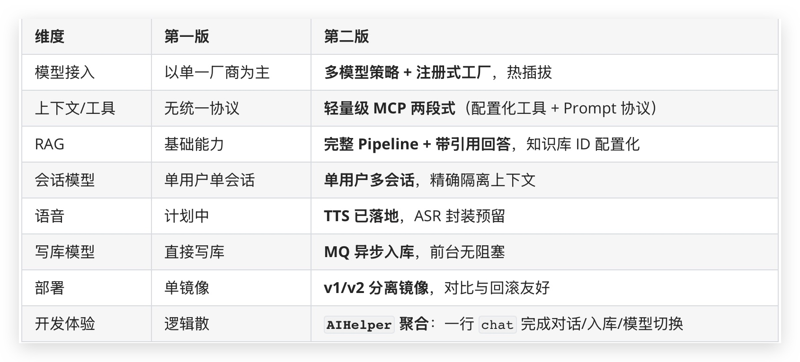

# AIApps目录结构与文件说明:

```cpp
AIApps/
    `-- ChatServer
    |-- src
    |   |-- main.cpp							//用于线程池、服务初始化
    |   |-- handlers
    |   |   |-- ChatSpeechHandler.cpp		    //语音合成tts的业务
    |   |   |-- ChatSessionsHandler.cpp		    //获取所有会话id的业务
    |   |   |-- ChatSendHandler.cpp             //AI聊天界面的聊天业务
    |   |   |-- ChatRegisterHandler.cpp			//注册界面注册业务
    |   |   |-- ChatLogoutHandler.cpp			//菜单界面登出业务
    |   |   |-- ChatLoginHandler.cpp			//登录界面登录业务
    |   |   |-- ChatHistoryHandler.cpp			//AI聊天界面的同步历史数据业务
    |   |   |-- ChatHandler.cpp					//AI聊天界面	
    |   |   |-- ChatEntryHandler.cpp			//登录界面
    |   |   |-- ChatCreateAndSendHandler.cpp	//第一次会话处理
    |   |   |-- AIUploadSendHandler.cpp			//图像识别业务
    |   |   |-- AIUploadHandler.cpp				//有关图像识别页面
    |   |   `-- AIMenuHandler.cpp				//有关菜单页面
    |   |-- ChatServer.cpp						//包装多个业务相关的映射表
    |   `-- AIUtil
    |       |-- base64.cpp						//三方库，用于解码前端传进来的图片base64数据
    |       |-- MQManager.cpp					//封装消息队列有关的线程池（消费者生产者相关函数)
    |       |-- ImageRecognizer.cpp				//内部封装openncv等接口进行图像识别操作
    |       |-- AIToolRegistry.cpp				//用于注册MCP相关的工具
    |       |-- AIStrategy.cpp					//策略模式封装多模型对象
    |       |-- AISpeechProcessor.cpp			//包含asr与tts服务
    |       |-- AISessionIdGenerator.cpp		//生成唯一会话id，区分不同会话
    |       |-- AIHelper.cpp					//内部封装curl访问各个模型
    |       |-- AIFactory.cpp					//注册式工厂模式封装多模型对象
    |       `-- AIConfig.cpp					//用于解析MCP相关的Json文件
    |-- resource
    |   |-- upload.html							//图像识别页面
    |   |-- menu.html							//菜单前端页面
    |   |-- entry.html							//登录前端页面
    |   |-- config.json							//用于MCP的配置文件
    |   |-- NotFound.html						//鉴权失败返回的前端页面
    |   `-- AI.html								//AI聊天前端页面
    `-- include
    |-- handlers
    |   |   |-- ChatSpeechHandler.h				//语音合成tts的业务
    |   |   |-- ChatSessionsHandler.h			//获取所有会话id的业务
    |   |   |-- ChatSendHandler.h           	//AI聊天界面的聊天业务
    |   |   |-- ChatRegisterHandler.h			//注册界面注册业务
    |   |   |-- ChatLogoutHandler.h				//菜单界面登出业务
    |   |   |-- ChatLoginHandler.h				//登录界面登录业务
    |   |   |-- ChatHistoryHandler.h			//AI聊天界面的同步历史数据业务
    |   |   |-- ChatHandler.h					//AI聊天界面	
    |   |   |-- ChatEntryHandler.h				//登录界面
    |   |   |-- ChatCreateAndSendHandler.h		//第一次会话处理
    |   |   |-- AIUploadSendHandler.h			//图像识别业务
    |   |   |-- AIUploadHandler.h				//有关图像识别页面
    |   |   `-- AIMenuHandler.h					//有关菜单页面
    |   |-- ChatServer.h						//包装多个业务相关的映射表
    `-- AIUtil
    |       |-- base64.h						//三方库，用于解码前端传进来的图片base64数据
    |       |-- MQManager.h						//封装消息队列有关的线程池（消费者生产者相关函数)
    |       |-- ImageRecognizer.h				//内部封装openncv等接口进行图像识别操作
    |       |-- AIToolRegistry.h				//用于注册MCP相关的工具
    |       |-- AIStrategy.h					//策略模式封装多模型对象
    |       |-- AISpeechProcessor.h				//包含asr与tts服务
    |       |-- AISessionIdGenerator.h			//生成唯一会话id，区分不同会话
    |       |-- AIHelper.h						//内部封装curl访问各个模型
    |       |-- AIFactory.h						//注册式工厂模式封装多模型对象
    |       `-- AIConfig.h						//用于解析MCP相关的Json文件
```

* `handlers/`：对话、登录、历史同步、图像识别、TTS、会话管理…**业务入口全在这里**
* `AIUtil/`：
  * `AIStrategy` / `AIFactory`：**多模型抽象与创建**
  * `AIHelper`：**对话主控**（模型选择、上下文管理、入库调度）
  * `AIToolRegistry` / `AIConfig`：**工具注册 + Prompt 模板化**
  * `MQManager`：**生产/消费**（与 MySQL 解耦）
  * `ImageRecognizer` / `AISpeechProcessor`：**多模态能力**
  * `AISessionIdGenerator`：**唯一会话 ID**
* `resource/`：**前端页面 & MCP 配置**（`config.json`）

# 主要更新内容说明

1. **重构与优化**
   * 重构了第一版中的部分代码，提升可维护性与可读性。
   * 更改所有前端 HTML 文件，优化对应界面，改善交互与视觉体验。
2. **Docker 更新**
   * 更新Docker，将第一版的Docker和第二版分离，方便观察二者版本区别
3. **语音功能**
   * 增加语音能力，包括语音识别与语音合成。
   * 当前业务逻辑主要使用语音合成功能。
4. **实现AI调用服务内部函数 & MCP 设计**
   * 实现内部 MCP 服务，使 AI 具备访问外部工具的能力，例如查询指定城市天气、获取当前时间等（后续若想加入更多AI所不具备的能力可通过配置&代码来做到）。
5. **RAG 功能**
   * 构建基于知识库的 AI（Retrieval-Augmented Generation），支持通过知识检索增强回答质量。
6. **多会话支持**
   * 系统从「单用户单会话」升级为「单用户多会话」模式，支持同时管理多个对话上下文。
7. **多模型选择**
   * 新增多模型支持，用户可自由切换不同模型（如豆包、阿里百炼等）。

# 系统设计

## 技术架构图

相对第一版，第二版做了不少的重构和新增内容，但是总体的技术架构图是基本不变的

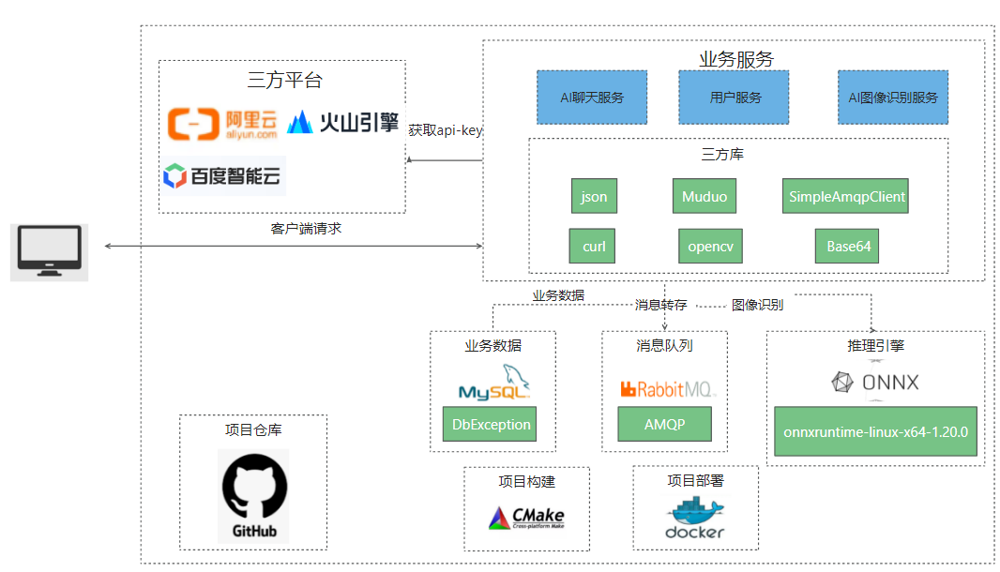

架构图展示了 **自研 C++ HTTP 服务框架** 如何将 AI 模型调用、图像识别、消息队列、数据库存储与多厂商模型 API 进行解耦，实现了**高性能、可扩展、可私有化部署**的 AI 应用平台。

***

## 一、总体结构概览

整个系统从上到下可分为四层：

| 层级 | 主要功能 |
| --- | --- |
| **1️⃣**\*\* 客户端层\*\* | 用户通过 Web / 命令行 / 其他 SDK 发起请求（例如 AI 聊天、文档问答、图像识别等） |
| **2️⃣**\*\* 业务服务层（C++ 框架核心）\*\* | 提供对话服务、图像识别服务、用户管理服务，是整个平台的核心逻辑层 |
| **3️⃣**\*\* 数据与消息层\*\* | 负责业务数据的存储、异步任务的转发与缓冲，提升系统稳定性与并发性能 |
| **4️⃣**\*\* 推理与第三方平台层\*\* | 对接多家 AI 大模型（阿里云、百度智能云、火山引擎等）以及本地推理引擎（ONNXRuntime） |

***

## 二、核心模块解析

### 业务服务层（核心逻辑层）

这是平台的心脏部分，全部基于 C++ 自研框架实现，支持多线程、高并发和异步 I/O。

包括三个核心服务：

1. **AI 聊天服务**
   * 封装各大模型的 API 调用（GPT、通义、百炼、火山、智谱等）。
   * 负责多轮上下文管理、函数调用、工具注册（MCP 思想）。
   * 内部使用 `json`、`curl` 等库实现 HTTP 通信与 JSON 解析。
2. **AI 图像识别服务**
   * 基于 `OpenCV` + `ONNXRuntime` 实现图像分类、OCR、目标检测等任务。
   * 可以调用外部模型（百度智能云视觉、火山引擎）或使用本地 ONNX 模型部署。
3. **用户服务**
   * 提供登录、用户信息管理、配额限制、访问日志等功能。
   * 与 MySQL / RabbitMQ 打通，实现异步入库和高可靠消息处理。

🔧 用到的关键第三方库：

* `Muduo`：C++ 网络库，实现 Reactor 模型和高并发网络通信
* `SimpleAmqpClient`：RabbitMQ 的 C++ 封装
* `OpenCV`：图像识别与处理
* `Base64`：图像与数据编码传输

***

### 数据与消息层

* **MySQL**\
  存储业务数据、用户记录、会话历史、日志等，配合 `DbException` 实现稳定的数据库访问。
* **RabbitMQ**\
  负责异步消息传递，例如：
  * AI 聊天日志异步落库；
  * 图像识别任务异步执行；
  * 提升系统并发度与响应速度。

✅ 这部分是系统的“解耦层”，让前台 HTTP 请求和后台任务异步化执行，提升整体吞吐。

***

### 推理引擎层

* 使用 **ONNXRuntime (x64-1.20.0)** 实现本地模型推理。
* 支持多种部署方式（Docker / 本地 / GPU）。
* 可加载本地量化模型（如 GGUF）进行离线 AI 计算。

在私有化部署场景下，可以直接通过本地 ONNXRuntime 完成推理，不依赖外部 API，大幅降低成本。

***

### 第三方平台层

* 对接阿里云、百度智能云、火山引擎等主流 LLM API。
* 通过配置 API-Key 即可动态选择服务商。
* 既能支持通用大模型（如 GPT / 通义），也能支持图像、语音识别类接口。

✅ 支持“云端 + 本地”双模架构：\
云端负责通用模型推理，本地负责高性能推理与缓存。

***

### 🧩 项目支撑与部署层

* **CMake**：跨平台构建系统，统一管理依赖与编译配置；
* **Docker**：容器化部署，快速一键启动完整 AI 服务平台；
* **GitHub**：项目仓库托管与版本管理。

🧱 支撑体系保证平台具备“可移植、可维护、可复现”的工程特性。

## 流程图

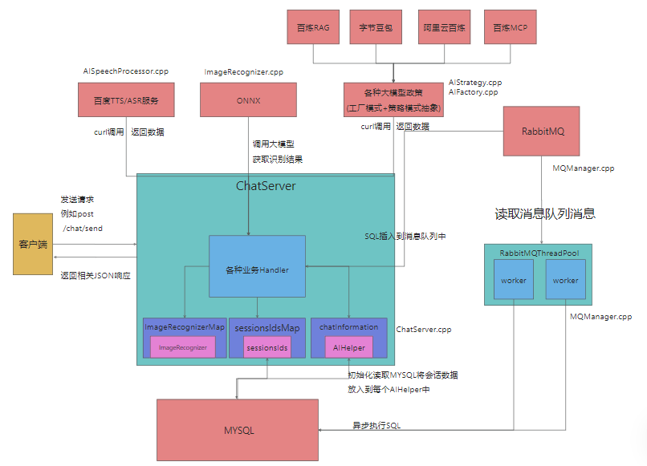

上图展示了整个系统从 **客户端请求 → ChatServer 业务调度 → 多模型调用 → 异步消息入库** 的全链路流程：

## 一、总体架构思路

该系统基于自研的 **C++ HTTP 服务框架** 构建，是一个支持：

* 多模型接入（GPT / 通义 / 豆包 / 百炼 / 百川）
* 图像识别（ONNX + OpenCV）
* 语音识别与合成（ASR/TTS）
* 异步消息入库（RabbitMQ）
* 多会话管理
* MCP 工具协议化

的完整 AI 应用服务平台。

系统核心是 `ChatServer`，它负责：

* 接收客户端请求；
* 调用对应业务 `Handler`；
* 根据类型分发到不同 AI 模块（聊天、图像识别、语音）；
* 将结果异步入库或交由队列处理。

## 二、整体流程解读

### 1️⃣ 客户端请求

用户通过网页前端（如 `AI.html`、`upload.html`）发起请求，例如：

```plain
POST /chat/send
```

请求体中包含用户输入、上传图像、会话 ID 等数据。\
C++ 服务器接收请求后交由 `ChatServer` 处理。

### 2️⃣ ChatServer 主控模块

文件：`src/ChatServer.cpp`\
职责：统一路由分发、上下文维护、异步写库。

内部核心数据结构：

* `ImageRecognizerMap`：缓存图像识别器对象；
* `sessionsIdsMap`：管理所有活跃会话；
* `chatInformation`：缓存每个 AI 对话上下文（AIHelper 实例）。

当请求进入时：

1. `ChatServer` 根据 URL 分发到对应 `Handler`；
2. 初始化/复用 `AIHelper`（按用户 session）；
3. 将请求转发至模型策略层或图像识别层；
4. 结果通过 JSON 返回客户端；
5. 同时异步写入 MySQL 或发送至 RabbitMQ。

***

### 3️⃣ 各种业务 Handler（业务层）

位于：`src/handlers/`\
这些文件实现了不同功能模块，对应 HTTP 路由。

| 业务类型 | 对应文件 | 功能说明 |
| --- | --- | --- |
| 登录 / 注册 / 登出 | `ChatLoginHandler.cpp`<br/>、`ChatRegisterHandler.cpp`<br/>、`ChatLogoutHandler.cpp` | 用户登录鉴权、注册、退出 |
| 聊天接口 | `ChatSendHandler.cpp`<br/>、`ChatCreateAndSendHandler.cpp` | 接收用户输入，调用 AI 模型 |
| 会话管理 | `ChatSessionsHandler.cpp`<br/>、`ChatHistoryHandler.cpp` | 获取、恢复聊天记录 |
| 图像识别 | `AIUploadHandler.cpp`<br/>、`AIUploadSendHandler.cpp` | 前端上传图像，执行识别并返回结果 |
| 语音功能 | `ChatSpeechHandler.cpp` | 文本转语音（TTS） |
| 页面跳转 | `ChatEntryHandler.cpp`<br/>、`AIMenuHandler.cpp` | 控制前端界面逻辑（登录、菜单） |

***

### 4️⃣ AI 功能模块（AIUtil 工具层）

目录：`src/AIUtil/`\
这是整个 AI 平台的“核心引擎层”，负责和外部模型、工具交互。

| 模块 | 说明 |
| --- | --- |
| **AIHelper.cpp** | 封装 HTTP 调用逻辑（curl），可连接 GPT、通义、百炼等；处理上下文拼接。 |
| **AIStrategy.cpp / AIFactory.cpp** | 工厂 + 策略模式实现多模型抽象，统一接口层：`LLMProvider::chat(prompt)`<br/>。 |
| **ImageRecognizer.cpp** | 调用 OpenCV + ONNX 模型执行图像识别。 |
| **AISpeechProcessor.cpp** | 接入百度智能云 ASR（语音识别）与 TTS（语音合成）API。 |
| **MQManager.cpp** | 基于 `SimpleAmqpClient`<br/> 实现 RabbitMQ 生产者 / 消费者，异步消息入库。 |
| **AISessionIdGenerator.cpp** | 为每个新会话生成唯一 ID。 |
| **AIToolRegistry.cpp** | MCP 工具注册中心，支持模型调用外部工具。 |
| **AIConfig.cpp** | 解析 `config.json`<br/>（MCP 工具/Prompt 模板配置）。 |

## 基本调用链：

这里的只讲基本的调用链，方便大家理清是怎么一个处理流程。重点的调用链查看第三点（右侧目录找第三点）

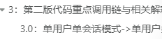

### 初始化阶段：

初始化ChatServer以及线程池（具体看注释）

```cpp
//工作线程绑定的函数
void executeMysql(const std::string sql) {
    http::MysqlUtil mysqlUtil_;
    mysqlUtil_.executeUpdate(sql);
}
    //初始化ChatServer
    ChatServer server(port, serverName);
    server.setThreadNum(4);
    std::this_thread::sleep_for(std::chrono::seconds(2));
    server.initChatMessage();    
    //初始化线程池，将参数绑定
    RabbitMQThreadPool pool(RABBITMQ_HOST, QUEUE_NAME, THREAD_NUM, executeMysql);
    //启动线程池，处理MQ的消息，作为消费者
    pool.start();
    //开启服务监听外来请求
    server.start();
```

其中ChatServer初始化会做以下操作:

```cpp
void ChatServer::initialize() {
    //初始化MysqlUtil（用于和mysql对接的，封装了mysql相关句柄）
	http::MysqlUtil::init("tcp://127.0.0.1:3306", "root", "123456", "ChatHttpServer", 5);
    //初始化Session，属于http服务框架底层的内容，和上层AI应用层没有关联
    initializeSession();
    //初始化中间件，属于http服务框架底层的内容，和上层AI应用层没有关联
    initializeMiddleware();
    //初始化路由接口，后续来请求，会通过具体路由的地址通过具体的Handler做相应业务处理
    //如httpServer_.Get("/chat", std::make_shared<ChatHandler>(this));
    initializeRouter();
}
```

ChatServer也会做initChatMessage函数操作（会将chatInformation和sessionsIdsMap做初始化操作）

用于将消息和会话信息绑定

```cpp
    while (res->next()) {
        long long user_id = 0;
        std::string session_id ;  
        std::string username, content;
        long long ts = 0;
        int is_user = 1;

        try {
            user_id    = res->getInt64("id");       
            session_id = res->getString("session_id");  
            username   = res->getString("username");
            content    = res->getString("content");
            ts         = res->getInt64("ts");
            is_user    = res->getInt("is_user");
        }
        catch (const std::exception& e) {
            std::cerr << "Failed to read row: " << e.what() << std::endl;
            continue; 
        }

        auto& userSessions = chatInformation[user_id];

        std::shared_ptr<AIHelper> helper;
        auto itSession = userSessions.find(session_id);
        if (itSession == userSessions.end()) {
            helper = std::make_shared<AIHelper>();
            userSessions[session_id] = helper;
			sessionsIdsMap[user_id].push_back(session_id);
        } else {
            helper = itSession->second;
        }

        helper->restoreMessage(content, ts);
    }
```

### 请求->响应阶段：

以/chat/send接口举例，当有请求过来的时候，底层http服务框架会做相应处理，根据封装的映射表映射到ChatSendHandler对象去做处理

（这边http服务框架具体做的事情，详情看前几章，本篇侧重应用层就不细讲了）

后续将会执行以下核心代码，获取一些信息（如userID，用户提问的信息，每个Handler获取的信息不一定完全相同）

获取完信息后,执行指定相关业务，如AIHelperPtr->chat，执行内部封装好了的逻辑，最终响应给用户执行结果的相应信息

```cpp
        auto session = server_->getSessionManager()->getSession(req, resp);
        LOG_INFO << "session->getValue(\"isLoggedIn\") = " << session->getValue("isLoggedIn");
        if (session->getValue("isLoggedIn") != "true")
        {

            json errorResp;
            errorResp["status"] = "error";
            errorResp["message"] = "Unauthorized";
            std::string errorBody = errorResp.dump(4);

            server_->packageResp(req.getVersion(), http::HttpResponse::k401Unauthorized,
                "Unauthorized", true, "application/json", errorBody.size(),
                errorBody, resp);
            return;
        }


        int userId = std::stoi(session->getValue("userId"));
        std::string username = session->getValue("username");

        std::string userQuestion;
        std::string modelType;
        std::string sessionId;

        auto body = req.getBody();
        if (!body.empty()) {
            auto j = json::parse(body);
            if (j.contains("question")) userQuestion = j["question"];
            if (j.contains("sessionId")) sessionId = j["sessionId"];

            modelType = j.contains("modelType") ? j["modelType"].get<std::string>() : "1";
        }
        //执行相应逻辑信息，如AIHelperPtr->chat函数

        resp->setStatusLine(req.getVersion(), http::HttpResponse::k200Ok, "OK");
        resp->setCloseConnection(false);
        resp->setContentType("application/json");
        resp->setContentLength(successBody.size());
        resp->setBody(successBody);
        return;
```

# 0：前置知识

## 什么是RAG？

什么是 RAG？——让AI更聪明地“看资料”

AI为什么需要RAG？

我们都知道，现在的AI（比如ChatGPT、文心一言、通义千问）能回答很多问题，但它们其实**不是真的“联网搜索”**，而是根据**训练时学到的内容**来回答。

问题是：

* 如果问AI一些**最新的信息**（比如“2025年苹果发布了什么手机？”），它可能不知道；
* 或者问一些**公司内部文档、产品资料**，AI也没法直接访问。

这时候，就需要一种“外挂大脑”的技术 —— **RAG**。

***

RAG 是什么？

**RAG** 的全称是 **Retrieval-Augmented Generation**，中文翻译是 **“检索增强生成”**。

简单来说：

RAG 就是让 AI 在回答问题前，**先去资料库里找相关内容（检索）**，再结合这些资料**生成回答（生成）**。

也就是：

“先查资料，再回答。”

***

RAG 的工作流程（通俗版）

可以想象一个场景：

你问AI：“我们公司退款政策是怎样的？”

AI的内部流程是这样的

1. **检索（Retrieval）**\
   AI 先在一个知识库（比如公司内部文档、产品FAQ、数据库）中搜索和“退款政策”有关的内容。
2. **增强（Augmentation）**\
   把找到的资料作为“参考信息”，附加到模型的上下文里。
3. **生成（Generation）**\
   AI 再根据用户提问 + 找到的资料，一起生成最终回答。\
   这样，它就不会“瞎编”，而是引用到了真实的数据。

***

一个例子

假设你问AI：

“你能告诉我我们产品A的售后流程吗？”

如果没有RAG：\
AI 可能回答得模糊不清：“一般来说，售后流程包括联系客服、维修、退换货等步骤……”

如果有RAG：\
AI 会去你公司知识库里检索到真实文件，比如：

「产品A售后流程」：用户需登录官网 → 填写售后申请 → 等待审核 → 邮寄产品 → 收到检测结果。

然后AI会回答：

“根据公司售后文档，产品A的售后流程如下：登录官网填写申请表 → 审核通过后邮寄产品 → 检测后通知结果。”

***

RAG 的组成部分

一个典型的RAG系统包含三个核心部分：

| 模块 | 作用 | 举例 |
| --- | --- | --- |
| **文档存储** | 保存知识内容 | 公司文档、PDF、产品资料 |
| **检索引擎** | 负责快速查找相关内容 | 向量数据库（如 Milvus、FAISS、Pinecone） |
| **大语言模型** | 根据资料生成回答 | GPT、Claude、通义千问等 |

***

RAG 的好处

✅ **让AI“知道最新的事”**：不受训练时间限制\
✅ **减少AI胡说八道（幻觉）**\
✅ **可用作企业内部知识助手**\
✅ **灵活扩展**：更新资料库就能“更新知识”

***

总结一句话

**RAG 就是给AI加上了“搜索引擎的脑子”。**\
它不再死记硬背，而是会“先查再答”，让AI更可靠、更聪明。

## 什么是MCP？

什么是 MCP？——让 AI 学会“自己用工具”的新协议

AI 为什么需要 MCP？

你可能发现现在的 AI 聊天模型（比如 ChatGPT、Claude、通义千问）越来越聪明了，它们不仅能聊天，还能：

* 调用计算器帮你算账；
* 查天气；
* 查询数据库；
* 写代码、执行命令、甚至控制外部程序。

但是——\
不同的开发者、公司、框架，**接入 AI 工具的方式都不一样**，比如：

* 有的用 OpenAI 的 “function calling”；
* 有的用 LangChain 的 “tools”；
* 有的自建 HTTP 接口；
* 有的要写插件。

结果就像每个 AI 都在说自己的“方言”，**互不兼容**。

所以，AI 世界需要一种“通用语言”，来告诉模型：

“外部有哪些工具可以用、它们怎么用、怎么返回结果。”

于是，这个标准就诞生了 —— **MCP**。

***

MCP 是什么？

**MCP** 全称是 **Model Context Protocol（模型上下文协议）**。

一句话解释：

**MCP 是一种让AI模型和外部工具之间能通用交互的标准协议。**

它的目标是：

让模型像人一样，可以“发现工具”“调用工具”“获取结果”，而不需要每家都重新发明一套接口。

***

MCP 的核心思想

可以这么理解：

以前：\
每个 AI 应用都要告诉模型“我有这些接口，你得这样调用”。

现在有了 MCP：\
模型只要遵守 MCP 协议，就能自动“发现”有哪些工具，并按照统一格式使用它们。

就像：

* USB 协议让各种键盘、鼠标都能插电脑；
* MCP 协议让各种 AI 工具都能接到模型上。

MCP 的工作流程

当 AI 模型和 MCP 服务打交道时，大致会经历以下几个步骤

1. **发现（Discover）**\
   模型先问 MCP 服务：“你这边有哪些工具可以用？”\
   服务返回工具列表和它们的描述。
2. **调用（Call）**\
   模型根据任务决定要用哪个工具，并发送调用请求（带参数）。
3. **执行（Execute）**\
   MCP 服务执行对应的操作，比如访问数据库、获取接口数据等。
4. **返回（Respond）**\
   MCP 把结果返回给模型，模型再把结果融入回答中。

***

一个例子

假设你问AI：

“帮我查一下东京今天的天气。”

模型通过 MCP 交互的过程是：

1. 模型问 MCP 服务：“你有天气查询的工具吗？”
2. MCP 回复：“有一个 `get_weather` 工具，参数是城市名称。”
3. 模型调用：

```plain
{
  "tool": "get_weather",
  "args": { "city": "Tokyo" }
}
```

4. MCP 执行 API 请求 → 获取天气信息；
5. MCP 返回结果 → 模型生成回答：“东京今天晴，气温24°C。”

整个过程是自动协作完成的，模型不需要提前硬编码接口。

***

MCP 的好处

✅ **通用标准化**：不论是本地工具、HTTP接口、数据库、AI插件，都能统一接入\
✅ **可扩展**：新增工具不用改模型，只要注册到 MCP 即可\
✅ **安全可控**：模型不能随便访问外部，只能用注册的 MCP 工具\
✅ **多语言支持**：C++、Go、Python、Java等语言都可以实现自己的 MCP 服务端\
✅ **结合RAG更强大**：模型可以通过 MCP 调用“知识库检索工具”，实现动态问答

## RAG和MCP的区别：

RAG 是让 AI “查资料”，\
MCP 是让 AI “动手干活”。

| 对比点 | RAG | MCP |
| --- | --- | --- |
| **核心目标** | 让模型“知道”更多内容 | 让模型“会用”外部工具 |
| **工作方式** | 查知识库 → 提供上下文 | 注册工具 → 执行操作 |
| **典型用途** | 文档问答、企业知识助手 | 数据查询、操作执行、自动化任务 |
| **能否结合** | ✅ 可以结合使用：模型通过 MCP 调用 RAG 检索模块 | |

## 什么是TTS?什么是ASR?

***

**TTS（Text-to-Speech）——文本转语音**

**全称：** Text To Speech\
**作用：** 把「文字」转换成「语音」。

✅ 举例：

你输入一句话：

“你好，今天天气真不错。”

TTS 系统会输出一段语音（mp3、wav等格式），听起来就像一个人说出这句话。

🎧 **ASR（Automatic Speech Recognition）——自动语音识别**

**全称：** Automatic Speech Recognition\
**作用：** 把「语音」转换成「文字」。

✅ 举例：

你说了一句话：

“今天天气真不错。”

ASR 系统会识别并输出文字：

“今天天气真不错。”

# 1：第二版项目演示：

[音视频附件: ai第二版.mp4](./attachments/mUBv3LKWFpewwh0x\ai第二版.mp4)

# 2：如何启动项目？(docker配置版)

相较于第一版，第二版需要获取的api-key倒是会多一些

包含

* 1：第一版所需要的阿里云百炼大模型的api-key（用于多模型调用中的阿里百炼大模型调用功能）
* 2：字节火山引擎中豆包大模型的api-key(用于多模型调用中的豆包大模型调用功能）
* 3：百度相关的client\_id还有client\_secret（用于语音合成tts相关功能）
* 4：阿里知识库的知识库ID（需要自己创建一个知识库，打造自己的RAG服务）

## 2.1：获取阿里云百炼大模型的api-key

进入此链接，获取自己本账号的api-key，后续会用到

<https://bailian.console.aliyun.com/?spm=5176.29619931.J__Z58Z6CX7MY__Ll8p1ZOR.1.1369521crCDcVM&tab=api#/api>

需要点击密钥管理这个按钮进入到第二张图片这里


创建完之后记住它方便后续创建docker使用


## 2.2: 获取字节火山引擎中豆包大模型的api-key

登录进入火山引擎界面

搜索豆包大模型


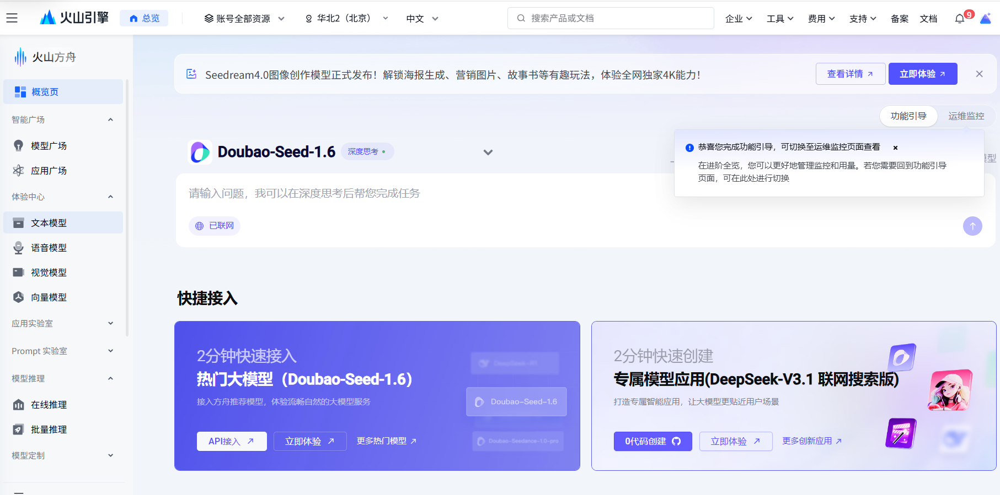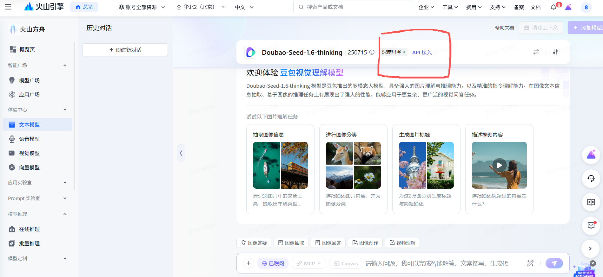

创建对应API-Key，记住他方便后续创建docker使用，

**注意：这边创建API KEY完后，进入step 2阶段，会出现开通模型的内容，选择开启所有服务(这边开启250715的服务也行，但是一键开启所有服务就不用专门去找250715服务了。如果没有开通，即便有api-key，后续访问大模型的时候会返回空数据，调用不成功!!!）**

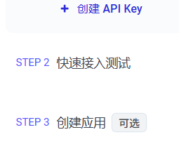

## 2.3：获取百度相关的client\_id还有client\_secret

登录进入百度智能云，搜索语音合成


点击立即使用（注意：中途可能会让你注册服务什么的，直接开通服务即可）

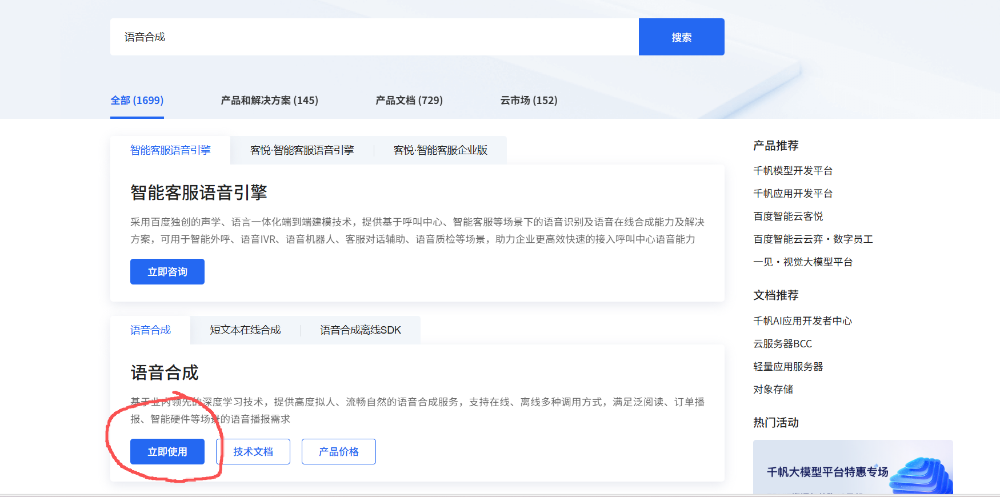

点击下面的API在线调试

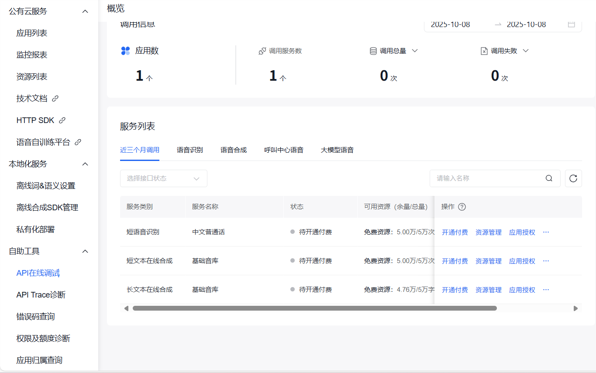

从这里可以查看对应client\_id还有client\_secret

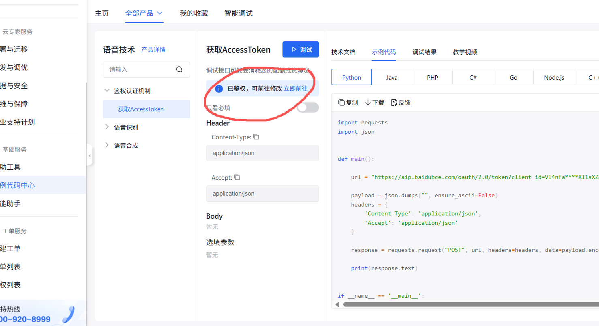

## 2.4：构造阿里知识库&&获取知识库ID

进入该地点，点击右侧的创建知识库：<https://bailian.console.aliyun.com/?tab=app#/knowledge-base>


知识库一般从pdf，word文档中读入，按照我这么选择即可，点击下一步

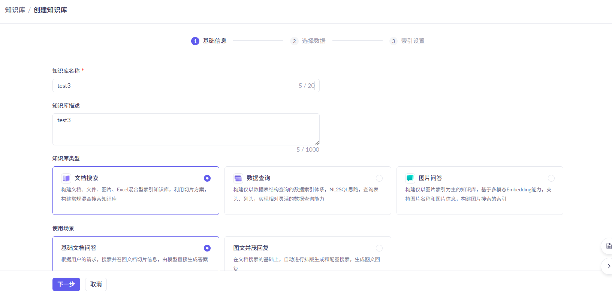

这边我将一份简历放入进去，后续搭建好了之后，AI会知道我当前知识库的信息，后续基于知识库中的内容做出相应回答。点击下一步

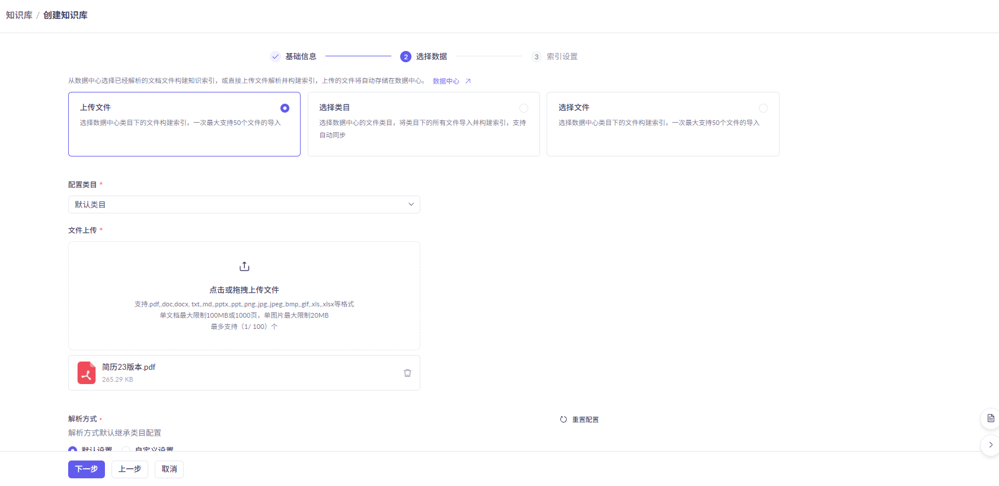

直接点导入完成即可，不需要弄太复杂的操作

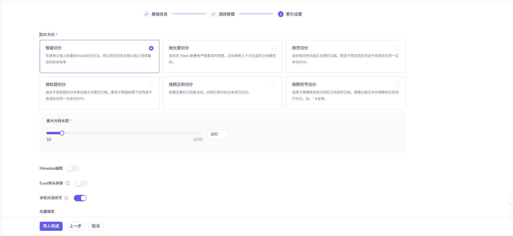

创建完成

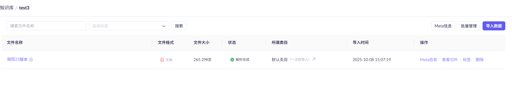

再进入此，创建一个新应用 <https://bailian.console.aliyun.com/?tab=app#/app-center>


创建智能体应用，输入应用名称，点击立即创建

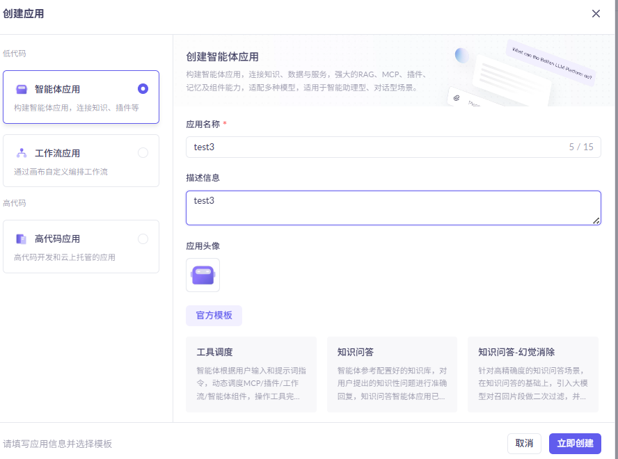

模型选择：通义千问-Plus-Latest

由于我刚刚创建的知识库是有关简历的，所以这边提示词写成如下了

大家可以自行根据不同的知识库，来告诉AI不同的提示词，打造特有的AI

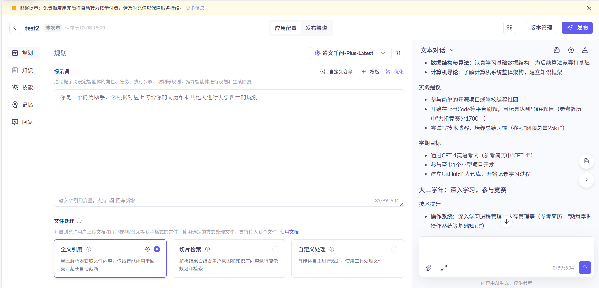

点击知识，将刚刚创建的知识库导入进来


选择刚刚创建的知识库

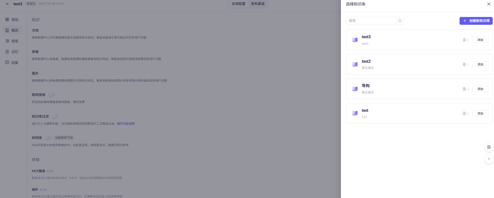

点击发布

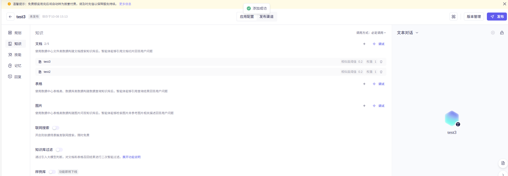

进入发布渠道

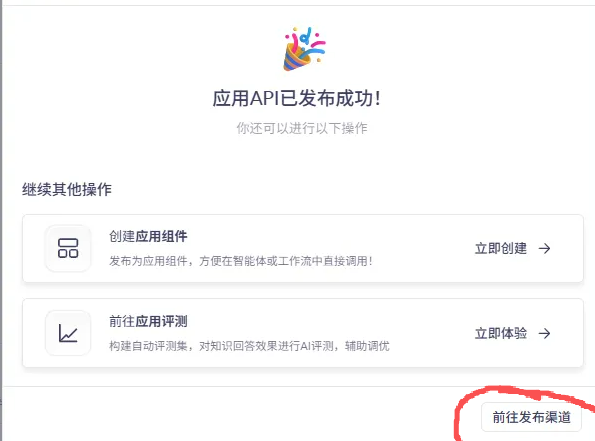

获取知识库ID，这边可以进行复制

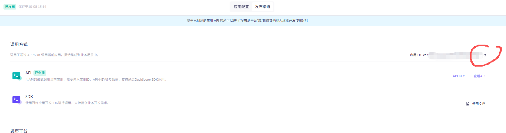

## 2.5：下载Docker

可以查看这个文章来下载对应的docker

<https://blog.csdn.net/jackeydengjun/article/details/147185455>

## 2.6：从远程拉取我配置好的镜像并创建容器（注意，第一版和第二版的docker并不一样，若考虑镜像太大，可以删除第一版镜像和容器再拉取第二版的镜像)

```plain
# 将我提供的远程镜像拉取到本地
docker pull huanheart/ai-service-based-on-http-framework-2
```

如果在这个过程中出现

Error response from daemon: Get "<https://registry-1.docker.io/v2/":> context deadline exceeded

可以进行如下操作

这边如果还遇到问题，请在项目群中联系@卡哥助手-焕心

```plain
# 生成该json
vim /etc/docker/daemon.json
```

将下面内容复制上去

```json
{
  "registry-mirrors": [
    "https://docker.registry.cyou",
    "https://docker-cf.registry.cyou",
    "https://dockercf.jsdelivr.fyi",
    "https://docker.jsdelivr.fyi",
    "https://dockertest.jsdelivr.fyi",
    "https://mirror2.aliyuncs.com",
    "https://dockerproxy.com",
    "https://mirror.baidubce.com",
    "https://docker.m.daocloud.io",
    "https://docker.nju.edu.cn",
    "https://docker.mirrors.sjtug.sjtu.edu.cn",
    "https://docker.mirrors.ustc.edu.cn",
    "https://mirror.iscas.ac.cn",
    "https://docker.rainbond.cc"
  ]
}
```

<font style="color:rgb(38, 38, 38);">保存之后重新启动docker，并重新拉取该镜像，应该就可以了，如果上述方式不可用了，大家可以自行网上搜索，或者在本项目群里找@卡哥助手-焕心</font>

<font style="color:rgb(38, 38, 38);"></font>

```cpp
sudo systemctl daemon-reexec
sudo systemctl restart docker
```

<font style="color:rgb(38, 38, 38);">  
</font><font style="color:rgb(38, 38, 38);">接下来创建容器</font>

* DASHSCOPE\_API\_KEY为第一步需要你获取的api-key（如果没有这个将不能进行阿里云百炼聊天、阿里云百炼MCP，阿里云百炼RAG通信）
* DOUBAO\_API\_KEY是第二步中获取的api-key，没有这个用不了豆包功能
* BAIDU\_CLIENT\_ID和BAIDU\_CLIENT\_SECRET是第三步中获取的（没有这个不能使用语音合成功能)
* Knowledge\_Base\_ID为刚刚复制的知识库应用的ID（没有这个不能使用阿里云RAG）

```cpp
docker run -dit \
    -e DASHSCOPE_API_KEY="your_api_key_here" \
    -e Knowledge_Base_ID="Knowledge_Base_ID" \
    -e BAIDU_CLIENT_ID="BAIDU_CLIENT_ID" \
    -e BAIDU_CLIENT_SECRET="BAIDU_CLIENT_SECRET" \
    -e DOUBAO_API_KEY="DOUBAO_API_KEY" \
    --name ai-httpserver-2 \
    -p 8116-8117:8116-8117 \
    huanheart/ai-service-based-on-http-framework-2 \
    tail -f /dev/null
```

## 2.7：进入docker

先docker ps查看是否有这个容器

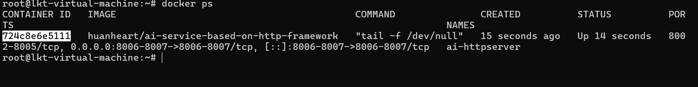

通过docker exec -it 724c8e6e5111 bash进入容器，**724c8e6e5111为你的CONTAINER ID ，看上面的截图，每个人的不一样**

进入了docker之后，跟着下面做

```plain
cd /root/httpserver_vsersion2/build
# 下面四步尤重要（每次启动一次docker都要执行下面四行命令）
# 用于开启服务，否则会出现错误
service mysql start 
rabbitmq-server -detached
rabbitmqctl start_app
# 不知道为什么不查看状态依旧出错，所以需要执行一次状态命令
rabbitmqctl status
```

```plain
# 接着我们运行如下指令，拿8117端口举例

./http_server -p 8117
```

访问成功！（若用wsl登录，请在浏览器上输入127.0.0.1)

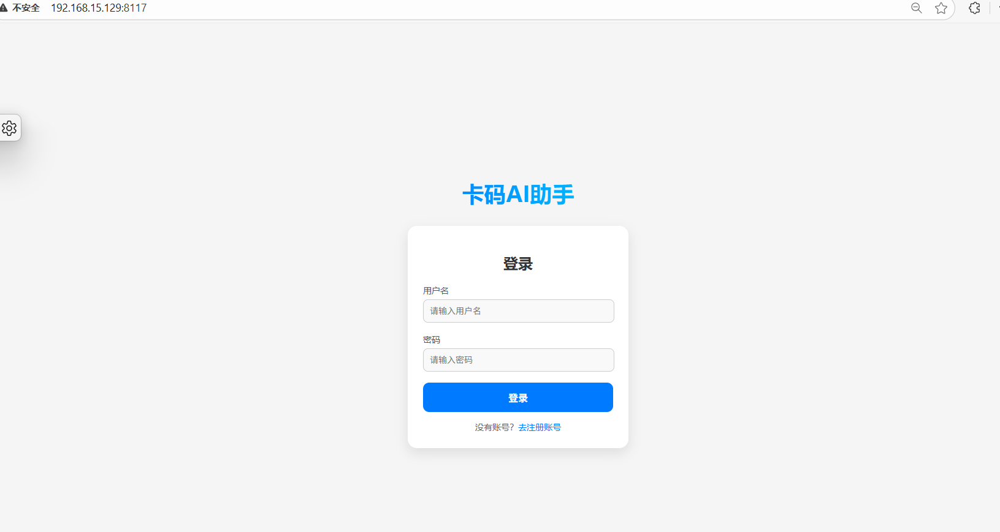

## 2.8：关于访问mysql的注意点：

这边容器的mysql的密码是123456，如果想要访问mysql的话记住这个密码即可

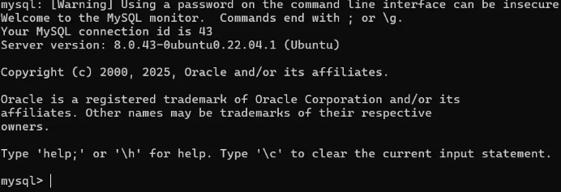

## 2.9：对于项目启动的补充：

如果想要直接源代码启动的话，需要自己手动安装rabbitmq，opencv等相关库，可以查看cmake所需库来安装。但是自己手动安装肯定没有docker一键启动方便，毕竟环境已经够给你配好了，就没有必要从0继续搭建一次了。固然这里也不提供手动配置版的搭建过程了

# 3：第二版代码重点调用链与相关解释(项目难点）

针对一些第一版说过了的东西，第二版这边就不再重复提及了（像服务初始化这些代码逻辑都是没有变的，直接看第一版的描述即可了）

针对一些不是很重点的内容，这边也没有提及，大家可以看代码来理解

**在看项目难点之前，强烈建议大家先把MCP和RAG看明白了再看下文**

## 3.0：单用户单会话模式->单用户多会话模式的重构与相关调用链说明

在这之前，我先说明一下现在进入AI.html界面的逻辑：

* 首先会请求**当前用户所有的会话ID**，存到前端中。
* 当如视频所示每次点击指定会话的时候，若是进入AI.html界面以来第一次点击某一个会话，会**自动触发**第一版已经做好了的\*\*同步历史数据功能。\*\*自动将对应会话消息填充到界面上
* 若需要**创建新会话需要点击新会话**，后续会请求/chat/send-new-session相关接口。走到ChatCreateAndSendHandler逻辑中去(和第一版ChatSendHandler不一样地方在于会先创建一个唯一会话)
* 后续在此会话基础上都会请求/chat/send接口，走到第一版就维护好了的ChatSendHandler逻辑中去

上述是重构后浏览器端和服务端的一个交互逻辑，接下来说明一下有哪些地方重构了

我们知道，之前是单用户单会话模式，那么维护的其实是一个一维映射表

```cpp
std::unordered_map<int, std::shared_ptr<AIHelper>> chatInformation;
```

第二版重构成了单用户多会话。

先是通过userid映射到指定的会话当中，后续通过唯一会话ID再映射到指定的AIHelper中，如下所示

```cpp
std::unordered_map<int, std::unordered_map<std::string,std::shared_ptr<AIHelper> > > chatInformation;
```

因为对应的表变成二维的了，引入了SessionID。那么自然ChatServer初始化的逻辑与MYSQL中的表结构也变化了

从代码中可以看出，相对于第一版，chat\_message这张表中多加了一个session\_id字段，后续在插入信息的时候，会将session\_id也插入到对应的表中。其它的逻辑其实是和第一版差不多的

这边在初始化读取数据库的信息的时候，会将所有用户对应的所会话id加入到sessionsIdsMap中，**这边的目的就是在用户进入AI.html界面的时候，前端调用接口获取所有会话ID，后续才能根据会话ID恢复指定的历史数据**

```cpp
void ChatServer::readDataFromMySQL() {
    std::string sql = "SELECT id, username,session_id, is_user, content, ts FROM chat_message ORDER BY ts ASC, id ASC";

    sql::ResultSet* res;
    try {
        res = mysqlUtil_.executeQuery(sql);
    }
    catch (const std::exception& e) {
        std::cerr << "MySQL query failed: " << e.what() << std::endl;
        return;
    }

    while (res->next()) {
        long long user_id = 0;
        std::string session_id ;  
        std::string username, content;
        long long ts = 0;
        int is_user = 1;

        try {
            user_id    = res->getInt64("id");       
            session_id = res->getString("session_id");  
            username   = res->getString("username");
            content    = res->getString("content");
            ts         = res->getInt64("ts");
            is_user    = res->getInt("is_user");
        }
        catch (const std::exception& e) {
            std::cerr << "Failed to read row: " << e.what() << std::endl;
            continue; 
        }

        auto& userSessions = chatInformation[user_id];

        std::shared_ptr<AIHelper> helper;
        auto itSession = userSessions.find(session_id);
        if (itSession == userSessions.end()) {
            helper = std::make_shared<AIHelper>();
            userSessions[session_id] = helper;
            //在这边做的原因：防止重复放入session_id到vector中
            //也可以采用双重map操作
            sessionsIdsMap[user_id].push_back(session_id);
        } else {
            helper = itSession->second;
        }
        
        helper->restoreMessage(content, ts);
    }

    std::cout << "readDataFromMySQL finished" << std::endl;
}
```

## 3.1：多模型切换&设计模式的应用(策略模式&工厂模式）

**策略模式的核心思想：**\
将一类算法或行为抽象出来，通过统一的接口进行调用，让不同的策略可以自由替换，而不影响上层业务逻辑。

**工厂模式的核心思想：**\
将对象的创建过程封装起来，让上层代码只需关心“要什么”，而无需关心“怎么创建”，从而降低耦合度。

**为什么要使用设计模式：**\
在版本一中，系统只能调用阿里百炼的大模型；但在版本二中，新增了多模型切换的需求。\
通过调研发现，不同厂商（如阿里百炼、字节豆包）的接口请求格式并不完全一致，甚至同一厂商下（如阿里百炼普通模型与RAG模型）也存在差异。\
因此，需要将这些“模型调用逻辑”抽象出来，上层使用者只需统一调用接口即可，无需关心具体的请求实现。\
当后续需要接入新的大模型时，只需新增一个对应的策略类，并在工厂中注册即可，无需修改原有逻辑。\
这种方式符合 **“开闭原则”** —— 对扩展开放、对修改封闭，使系统在扩展性与可维护性方面得到显著提升。

**注意：很多人在学习设计模式的时候容易将策略模式和工厂模式搞混，分不清这两个有什么不同**

***

**区别：工厂模式侧重于对象创建的不同的逻辑，而策略模式侧重于行为的不同的逻辑**

可以查看如下文章来加深理解：[设计模式：策略模式和工厂模式混合使用原创](https://blog.csdn.net/qq_27586963/article/details/133045626)

更多设计模式的学习可以进入**卡码网**[设计模式编程课](https://kamacoder.com/course.php?course_id=14)进行学习（**<font style="color:rgb(0, 0, 0);background-color:rgb(250, 250, 250);">设计模式的讲解 配套 23道编程题目，通过代码实战学会设计模式！</font>**<font style="color:rgb(0, 0, 0);background-color:rgb(250, 250, 250);">）</font>

```cpp
//阿里百炼调用模型的curl请求体封装如下
json AliyunStrategy::buildRequest(const std::vector<std::pair<std::string, long long>>& messages) const {
    json payload;
    payload["model"] = getModel();
    json msgArray = json::array();

    for (size_t i = 0; i < messages.size(); ++i) {
        json msg;
        if (i % 2 == 0) {
            msg["role"] = "user";
        }
        else {
            msg["role"] = "assistant";
        }
        msg["content"] = messages[i].first;
        msgArray.push_back(msg);
    }
    payload["messages"] = msgArray;
    return payload;
}
//阿里百炼RAG调用模型的curl请求体封装如下
json AliyunRAGStrategy::buildRequest(const std::vector<std::pair<std::string, long long>>& messages) const {
    json payload;
    json msgArray = json::array();
    for (size_t i = 0; i < messages.size(); ++i) {
        json msg;
        msg["role"] = (i % 2 == 0 ? "user" : "assistant");
        msg["content"] = messages[i].first;
        msgArray.push_back(msg);
    }
    payload["input"]["messages"] = msgArray;
    payload["parameters"] = json::object(); 
    return payload;
}
```

和刚刚csdn文章那篇封装思路其实是一样的，都是采用了多种接口+注册式工厂来做的

下面是策略相关类的.h文件

```cpp
#pragma once
#include <string>
#include <vector>
#include <utility>
#include <iostream>
#include <sstream>
#include <memory>

#include "../../../../HttpServer/include/utils/JsonUtil.h"


class AIStrategy {
public:
    virtual ~AIStrategy() = default;

    // APIַ
    virtual std::string getApiUrl() const = 0;

    // API Key
    virtual std::string getApiKey() const = 0;


    virtual std::string getModel() const = 0;


    virtual json buildRequest(const std::vector<std::pair<std::string, long long>>& messages) const = 0;


    virtual std::string parseResponse(const json& response) const = 0;

    bool isMCPModel = false;

};

class AliyunStrategy : public AIStrategy {

public:
    AliyunStrategy() {
        const char* key = std::getenv("DASHSCOPE_API_KEY");
        if (!key) throw std::runtime_error("Aliyun API Key not found!");
        apiKey_ = key;
        isMCPModel = false;
    }

    std::string getApiUrl() const override;
    std::string getApiKey() const override;
    std::string getModel() const override;

    json buildRequest(const std::vector<std::pair<std::string, long long>>& messages) const override;
    std::string parseResponse(const json& response) const override;

private:
    std::string apiKey_;
};

class DouBaoStrategy : public AIStrategy {

public:
    DouBaoStrategy() {
        const char* key = std::getenv("DOUBAO_API_KEY");
        if (!key) throw std::runtime_error("DOUBAO API Key not found!");
        apiKey_ = key;
        isMCPModel = false;
    }
    std::string getApiUrl() const override;
    std::string getApiKey() const override;
    std::string getModel() const override;

    json buildRequest(const std::vector<std::pair<std::string, long long>>& messages) const override;
    std::string parseResponse(const json& response) const override;

private:
    std::string apiKey_;
};

class AliyunRAGStrategy : public AIStrategy {

public:
    AliyunRAGStrategy() {
        const char* key = std::getenv("DASHSCOPE_API_KEY");
        if (!key) throw std::runtime_error("Aliyun API Key not found!");
        apiKey_ = key;
        isMCPModel = false;
    }

    std::string getApiUrl() const override;
    std::string getApiKey() const override;
    std::string getModel() const override;

    json buildRequest(const std::vector<std::pair<std::string, long long>>& messages) const override;
    std::string parseResponse(const json& response) const override;

private:
    std::string apiKey_;
};

class AliyunMcpStrategy : public AIStrategy {

public:
    AliyunMcpStrategy() {
        const char* key = std::getenv("DASHSCOPE_API_KEY");
        if (!key) throw std::runtime_error("Aliyun API Key not found!");
        apiKey_ = key;
        isMCPModel = true;
    }

    std::string getApiUrl() const override;
    std::string getApiKey() const override;
    std::string getModel() const override;

    json buildRequest(const std::vector<std::pair<std::string, long long>>& messages) const override;
    std::string parseResponse(const json& response) const override;

private:
    std::string apiKey_;
};

```

下面是注册式工厂的实现：

```cpp
#pragma once
#include <string>
#include <vector>
#include <utility>
#include <iostream>
#include <sstream>
#include <memory>
#include <functional>
#include <unordered_map>
#include <string>

#include"AIStrategy.h"

class StrategyFactory {

public:
    using Creator = std::function<std::shared_ptr<AIStrategy>()>;

    static StrategyFactory& instance();

    void registerStrategy(const std::string& name, Creator creator);

    std::shared_ptr<AIStrategy> create(const std::string& name);

private:
    StrategyFactory() = default;
    std::unordered_map<std::string, Creator> creators;
};

template<typename T>
struct StrategyRegister {
    StrategyRegister(const std::string& name) {
        StrategyFactory::instance().registerStrategy(name, [] {
            std::shared_ptr<AIStrategy> instance = std::make_shared<T>();
            return instance;
            });
    }
};


```

```cpp
#include"../include/AIUtil/AIFactory.h"


StrategyFactory& StrategyFactory::instance() {
    static StrategyFactory factory;
    return factory;
}

void StrategyFactory::registerStrategy(const std::string& name, Creator creator) {
    creators[name] = std::move(creator);
}

std::shared_ptr<AIStrategy> StrategyFactory::create(const std::string& name) {
    auto it = creators.find(name);
    if (it == creators.end()) {
        throw std::runtime_error("Unknown strategy: " + name);
    }
    return it->second();
}

```

在AIStrategy.cpp的最下面，有这么将几个策略类注册到工厂中，会在服务刚开始的时候，就调用AIFactory.h中定义的StrategyRegister函数，将一个匿名表达式注册到工厂中，后续当使用std::shared\_ptr<AIStrategy> StrategyFactory::create(std::name)函数的时候，他会自动调用该匿名表达式，创建一个新的智能指针，返回给用户。【**注意：这边是创建一个新的智能指针，而不是将原先服务初始化static的对象的引用计数+1并返回给使用者，让每一个使用者得到的对象都不是同一个，防止后续扩展的时候需要考虑锁问题**】

```cpp
static StrategyRegister<AliyunStrategy> regAliyun("1");
static StrategyRegister<DouBaoStrategy> regDoubao("2");
static StrategyRegister<AliyunRAGStrategy> regAliyunRag("3");
static StrategyRegister<AliyunMcpStrategy> regAliyunMcp("4");
```

## 3.2：语音合成：AISpeechProcessor.h/cpp

体现相关业务的handler是**ChatSpeechHandler**

**这里只有语音合成(TTS)的相关服务**，虽然AISpeechProcessor类中也有封装语音识别，但是经多轮测试，发现识别出来的效果并不是很准确，所以就没有用到相关的这个功能了

**原先目的是想做一个和AI语音通信的服务**（但是由于考虑到**语音识别不准确**，会导致后续都不准确，所以更改成了如今的功能：点击对话文字，可将语音进行输出）

**用户通过浏览器输入语音->通过ASR语音识别技术将其转化文字->发送给AI->AI文字通过TTS技术转化成语音->前端将语音输出**

具体AISpeechProcessor封装是根据文档这边2.4图中对应链接的示例进行curl封装的

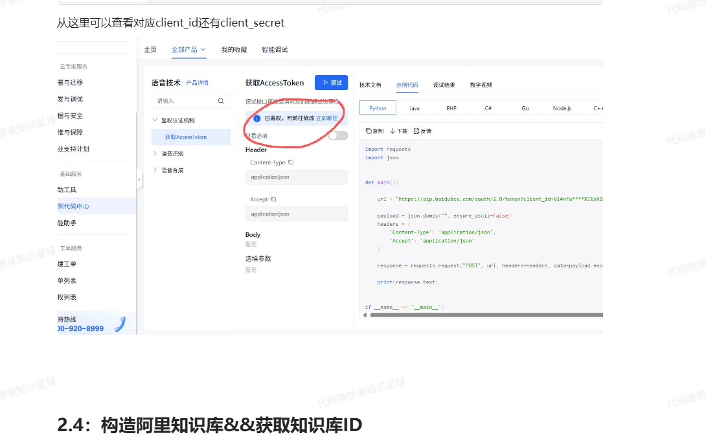

语音合成器中的语音合成（TTS）逻辑如下：

语音合成（创建任务 -> 轮询 -> 返回 speech\_url）

这么做的原因：**百度相关API只有调用TTS接口和查询任务是否做完这两个接口**

**且由于AI项目基于自研HTTP服务框架（只支持单向通信）并不能做到拥有sse/websocket这种服务端主动发送数据给客户端的功能**，固然只能占用当前线程去做一个拥有**超时机制的轮询检测**，当查询到语音合成服务完成了之后再返回给客户端相关地址，后浏览器会播放指定地址的音频内容

如果有websocket/sse这种主动推送的功能，那么可以将查询的服务放入到后台线程，做到select/poll甚至epoll的封装，达到对应io多路复用的效果，最后当查询成功之后，再**主动通信**给到客户端

```cpp
// 语音合成（创建任务 -> 轮询 -> 返回 speech_url）
std::string AISpeechProcessor::synthesize(const std::string& text,
                                          const std::string& format,
                                          const std::string& lang,
                                          int speed,
                                          int pitch,
                                          int volume) 
{
    CURL* curl = nullptr;
    CURLcode res;
    std::string response;

    // ----------- 第一步：创建合成任务 -----------
    curl = curl_easy_init();
    if (!curl) return "";

    std::string create_url = "https://aip.baidubce.com/rpc/2.0/tts/v1/create?access_token=" + token_;

    curl_easy_setopt(curl, CURLOPT_URL, create_url.c_str());
    curl_easy_setopt(curl, CURLOPT_CUSTOMREQUEST, "POST");
    curl_easy_setopt(curl, CURLOPT_FOLLOWLOCATION, 1L);
    curl_easy_setopt(curl, CURLOPT_DEFAULT_PROTOCOL, "undefined");

    struct curl_slist* headers = NULL;
    headers = curl_slist_append(headers, "Content-Type: application/json");
    headers = curl_slist_append(headers, "Accept: application/json");
    curl_easy_setopt(curl, CURLOPT_HTTPHEADER, headers);

    json body = {
        {"text", text},
        {"format", format},
        {"lang", lang},
        {"speed", speed},
        {"pitch", pitch},
        {"volume", volume},
        {"enable_subtitle", 0}
    };

    std::string data = body.dump();

    response.clear();
    curl_easy_setopt(curl, CURLOPT_POSTFIELDS, data.c_str());
    curl_easy_setopt(curl, CURLOPT_WRITEFUNCTION, onWriteData);
    curl_easy_setopt(curl, CURLOPT_WRITEDATA, &response);

    res = curl_easy_perform(curl);
    if (res != CURLE_OK) {
        curl_easy_cleanup(curl);
        if (headers) curl_slist_free_all(headers);
        return "";
    }

    curl_easy_cleanup(curl);
    if (headers) curl_slist_free_all(headers);

    // 解析 task_id
    std::string task_id;
    try {
        json result_json = json::parse(response);
        // 有些示例中 task_id 在根节点或者在 tasks_info[0] 中都可能出现，优先取根 task_id，再尝试 tasks_info
        if (result_json.contains("task_id") && result_json["task_id"].is_string()) {
            task_id = result_json["task_id"].get<std::string>();
        } else if (result_json.contains("tasks_info") && result_json["tasks_info"].is_array()
                   && !result_json["tasks_info"].empty() && result_json["tasks_info"][0].contains("task_id")) {
            task_id = result_json["tasks_info"][0]["task_id"].get<std::string>();
        }
    } catch (...) {
        return "";
    }

    if (task_id.empty()) return "";

    // ----------- 第二步：轮询查询任务状态 -----------
    std::string speech_url;
    json query;
    query["task_ids"] = json::array({task_id});

    // 轮询，上限可按需调整（例如超时 30 次）
    const int max_loops = 60; // 最多等 60 秒（sleep 1s）
    int loops = 0;
    while (loops++ < max_loops) {
        std::this_thread::sleep_for(std::chrono::seconds(1));

        curl = curl_easy_init();
        if (!curl) break;

        std::string query_url = "https://aip.baidubce.com/rpc/2.0/tts/v1/query?access_token=" + token_;
        curl_easy_setopt(curl, CURLOPT_URL, query_url.c_str());
        curl_easy_setopt(curl, CURLOPT_CUSTOMREQUEST, "POST");
        curl_easy_setopt(curl, CURLOPT_FOLLOWLOCATION, 1L);
        curl_easy_setopt(curl, CURLOPT_DEFAULT_PROTOCOL, "undefined");

        headers = NULL;
        headers = curl_slist_append(headers, "Content-Type: application/json");
        headers = curl_slist_append(headers, "Accept: application/json");
        curl_easy_setopt(curl, CURLOPT_HTTPHEADER, headers);

        data = query.dump();
        response.clear();
        curl_easy_setopt(curl, CURLOPT_POSTFIELDS, data.c_str());
        curl_easy_setopt(curl, CURLOPT_WRITEFUNCTION, onWriteData);
        curl_easy_setopt(curl, CURLOPT_WRITEDATA, &response);

        res = curl_easy_perform(curl);
        curl_easy_cleanup(curl);
        if (headers) curl_slist_free_all(headers);
        if (res != CURLE_OK) break;

        // 解析轮询结果
        try {
            json queryResult = json::parse(response);
            if (queryResult.contains("tasks_info") && queryResult["tasks_info"].is_array()
                && !queryResult["tasks_info"].empty()) {
                json task = queryResult["tasks_info"][0];
                if (task.contains("task_status") && task["task_status"].is_string()) {
                    std::string status = task["task_status"].get<std::string>();
                    if (status == "Success" && task.contains("task_result") && task["task_result"].contains("speech_url")) {
                        speech_url = task["task_result"]["speech_url"].get<std::string>();
                        break;
                    }
                }
            }
        } catch (...) {
            break;
        }
    }

    return speech_url;
}
```

应用层业务逻辑如下：

```cpp
    try
    {
        //获取唯一会话id
        auto session = server_->getSessionManager()->getSession(req, resp);
        LOG_INFO << "session->getValue(\"isLoggedIn\") = " << session->getValue("isLoggedIn");
        if (session->getValue("isLoggedIn") != "true")
        {

            json errorResp;
            errorResp["status"] = "error";
            errorResp["message"] = "Unauthorized";
            std::string errorBody = errorResp.dump(4);

            server_->packageResp(req.getVersion(), http::HttpResponse::k401Unauthorized,
                "Unauthorized", true, "application/json", errorBody.size(),
                errorBody, resp);
            return;
        }

        int userId = std::stoi(session->getValue("userId"));
        std::string username = session->getValue("username");


        std::string text;

        auto body = req.getBody();
        if (!body.empty()) {
            auto j = json::parse(body);
            if (j.contains("text")) text = j["text"];
        }


        const char* secretEnv = std::getenv("BAIDU_CLIENT_SECRET");
        const char* idEnv = std::getenv("BAIDU_CLIENT_ID");

        if (!secretEnv) throw std::runtime_error("BAIDU_CLIENT_SECRET not found!");
        if (!idEnv) throw std::runtime_error("BAIDU_CLIENT_ID not found!");

        std::string clientSecret(secretEnv);
        std::string clientId(idEnv);
        //创建语音处理器
        AISpeechProcessor speechProcessor(clientId, clientSecret);
        
        //获取语音合成后的文件地址&转发给用户
        std::string speechUrl = speechProcessor.synthesize(text,
                                                           "mp3-16k", 
                                                           "zh",  
                                                            5, 
                                                            5, 
                                                            5 );  

        json successResp;
        successResp["success"] = true;
        successResp["url"] = speechUrl;
        std::string successBody = successResp.dump(4);
        resp->setStatusLine(req.getVersion(), http::HttpResponse::k200Ok, "OK");
        resp->setCloseConnection(false);
        resp->setContentType("application/json");
        resp->setContentLength(successBody.size());
        resp->setBody(successBody);
        return;
    }
```

## 3.3：重构大模型调用逻辑(重构AIHelper类逻辑)

在第一版中，我们知道ChatSendHandler是调用大模型请求的处理类

这边第二版有将它的处理逻辑重构了，我们来对比一下可以发现，原先在ChatSendHandler中需要使用者手动调用AIHelperPtr->addMessage将用户消息插入，这样设计的不好，固然我将模型切换，用户/AI消息插入这些逻辑都封在了AIHelper中

**这样使用者就可以一步到位做到Chat了，无需关注其它逻辑，具体里面做了什么，看3.4轻量级MCP应用设计**

第一版ChatSendHandler核心处理代码逻辑如下：

```cpp
        std::string userQuestion;
        auto body = req.getBody();
        if (!body.empty()) {
            auto j = json::parse(body);
            if (j.contains("question")) userQuestion = j["question"];
        }
        //int userId, const std::string& userName, bool is_user, const std::string& userInput
        AIHelperPtr->addMessage(userId, username,true,userQuestion);

        std::string aiInformation=AIHelperPtr->chat(userId, username);
```

第二版ChatSendHandler核心代码逻辑如下

```cpp
        std::string userQuestion;
        std::string modelType;
        std::string sessionId;

        auto body = req.getBody();
        if (!body.empty()) {
            auto j = json::parse(body);
            if (j.contains("question")) userQuestion = j["question"];
            if (j.contains("sessionId")) sessionId = j["sessionId"];

            modelType = j.contains("modelType") ? j["modelType"].get<std::string>() : "1";
        }


        std::shared_ptr<AIHelper> AIHelperPtr;
        {
            std::lock_guard<std::mutex> lock(server_->mutexForChatInformation);

            auto& userSessions = server_->chatInformation[userId];

            if (userSessions.find(sessionId) == userSessions.end()) {

                userSessions.emplace( 
                    sessionId,
                    std::make_shared<AIHelper>()
                );
            }
            AIHelperPtr= userSessions[sessionId];
        }
        

        std::string aiInformation=AIHelperPtr->chat(userId, username,sessionId, userQuestion, modelType);
```

## 3.4：（重点）轻量级MCP应用设计

我们来看AIHelper里面的chat成员函数重构成什么样子了

可以看到

* 先是**设置了"策略"**，通过前端传入的模型类型，创建了后台内部的策略类（阿里百炼，阿里RAG，豆包这种）
* 判断是否是MCP模型，这边**只有阿里MCP的isMCPModel设置为了true**，其它都是false
  * **若为false**，那么和第一版的逻辑其实差不多，将消息**同步插入到内存中**，**异步通过RabbitMQ插入到数据库MYSQL中**
  * \*\*若为true,  \*\*说明是支持MCP的，会做MCP相应的操作

在讲MCP具体操作之前，先讲一下我设计MCP的想法。MCP操作的时候用到了哪些具体的类以及工具

```cpp
// 发送聊天消息
std::string AIHelper::chat(int userId,std::string userName, std::string sessionId, std::string userQuestion, std::string modelType) {

    //设置策略
    setStrategy(StrategyFactory::instance().create(modelType));

    
    if (false == strategy->isMCPModel) {

        addMessage(userId, userName, true, userQuestion, sessionId);
        json payload = strategy->buildRequest(this->messages);

        //执行请求
        json response = executeCurl(payload);
        std::string answer = strategy->parseResponse(response);
        addMessage(userId, userName, false, answer, sessionId);
        return answer.empty() ? "[Error] 无法解析响应" : answer;
    }
    //说明是MCP模型 
    //...做相应操作
}

```

### MCP设计思想：

相比于 Java 或 Python，**C++ 在 AI 应用开发生态上仍然相对薄弱**。以 Java 为例，它拥有像 **Spring AI** 这样的框架，可以帮助开发者快速集成大模型接口并实现工具调用；**而在 C++ 中，这些功能往往需要我们自行设计和实现。**

**以第一版中构建的AI 聊天系统为例，我们需要自己维护消息表、管理消息的时间顺序（例如通过时间戳），这些在 Java/Python 框架中通常已经被封装好。但在 C++ 中，我们必须手动去实现**。

MCP（Model Context Protocol）同样如此。它的目标是让模型可以“调用外部工具”并通过统一协议交互。那么在 C++ 中，如何实现这种“AI 调用自定义工具”的效果呢？

在查阅资料后我发现，C++ 生态中还没有像某些 RAG 框架那样的三方现成方案可以通过curl进行调用，**于是无奈之下我想到一种替代方案**：

1. **服务端首先将用户输入与提示词合并，询问 AI 是否需要调用某个工具；**
2. **如果模型返回需要调用某个工具，服务端根据返回内容执行该工具逻辑；**
3. **然后将工具结果与上下文合并，再次发送给 AI，获得最终回答。**

通过这种方式，就可以模拟出“**AI 主动调用服务端工具**”的**效果**。

后来我查阅文章，研究 Spring AI 的底层实现，**发现它的设计理念与我的思路非常相似**：**模型同样是通过输出控制是否调用工具，而框架负责执行具体调用并将结果再反馈给模型。这说明即便没有现成框架，C++ 依然可以通过合理的设计达到同样的效果**。

在实现自定义 MCP 协议的过程中，我设计了一个 `config.json` 文件，用于集中管理工具列表、提示词模板等配置。\
这样做的好处是：**工具定义与业务逻辑解耦**，后续如果修改某个工具，只需要调整 JSON 配置，而不需要改动太多服务端代码。  （若是新增工具，在服务端这边相关工具对象的接口注册到指定的接口中即可）

这里的 **prompt\_template** 起到了核心作用。\
因为当前的 AI 模型并不会「真正调用函数」，而是根据提示词判断是否应该返回一个结构化的 JSON。\
服务端再根据这个 JSON 决定是否调用对应工具。

需要特别注意的是，**提示词的设计必须足够精准**。\
如果提示不够明确，模型可能依然返回普通文本而不是 JSON，这会让服务端误以为模型不需要调用工具，导致逻辑错误。\
因此，在实际使用中我通过不断测试与微调，让模型始终能稳定地按约定格式返回结果。

```json
{
  "prompt_template": "我是一个第三方中间人，帮客户端传达信息的，你帮我查看用户所说的话是否需要调用工具。特别注意：若需要调用工具，只需要输出json，其它任何内容不需要输出!!!如果只是回答用户的问题或者用户所有参数并没有完全对应的上，请直接输出文本回答。以下是用户所说的话：{user_input}\n你可以使用以下工具:\n{tool_list}\n如果需要调用，请输出JSON格式: {\"tool\":\"工具名\",\"args\":{\"key\":\"value\"}}\n",
  "tools": [
    {
      "name": "get_weather",
      "params": {
        "city": "北京"
      },
      "desc": "获取天气"
    },
    {
      "name": "get_time",
      "params": {},
      "desc": "获取当前时间"
    }
  ]
}

```

那么在代码中它是如何解析这个json并运用到MCP中的呢？看接下来的部分：

### AIConfig.h/cpp与AIToolRegistry.h/cpp文件讲解

观看代码可以知道

* AIConfig是用来读取json文件进行解析 & 合并用户消息和json中的提示词 & 合并用户消息和二次请求AI的提示词
* AIToolRegistry是一个注册器，后续AI告诉服务端应该调用哪个函数，参数是什么。

```cpp
#pragma once
#include <string>
#include <unordered_map>
#include <vector>
#include <regex>
#include <fstream>
#include <sstream>
#include <iostream>
#include "../../../../HttpServer/include/utils/JsonUtil.h"  //封装了 nlohmann::json

// 结构体：单个工具信息
struct AITool {
std::string name;
std::unordered_map<std::string, std::string> params;
std::string desc;
};

// 结构体：AI 响应中工具调用结果
struct AIToolCall {
std::string toolName;
json args;
bool isToolCall = false;
};

// 配置管理类
class AIConfig {
public:
bool loadFromFile(const std::string& path);
std::string buildPrompt(const std::string& userInput) const;
AIToolCall parseAIResponse(const std::string& response) const;
std::string buildToolResultPrompt(const std::string& userInput,const std::string& toolName,const json& toolArgs,const json& toolResult) const;

private:
std::string promptTemplate_;
std::vector<AITool> tools_;

std::string buildToolList() const;
};

```

```cpp
#include"../include/AIUtil/AIConfig.h"

bool AIConfig::loadFromFile(const std::string& path) {
    std::ifstream file(path);
    if (!file.is_open()) {
        std::cerr << "[AIConfig] Unable to open configuration file: " << path << std::endl;
        return false;
    }

    json j;
    file >> j;

    // Parsing templates
    if (!j.contains("prompt_template") || !j["prompt_template"].is_string()) {
        std::cerr << "[AIConfig] prompt_template is missing" << std::endl;
        return false;
    }
    promptTemplate_ = j["prompt_template"].get<std::string>();

    // List of parsing tools
    if (j.contains("tools") && j["tools"].is_array()) {
        for (auto& tool : j["tools"]) {
            AITool t;
            t.name = tool.value("name", "");
            t.desc = tool.value("desc", "");
            if (tool.contains("params") && tool["params"].is_object()) {
                for (auto& [key, val] : tool["params"].items()) {
                    t.params[key] = val.get<std::string>();
                }
            }
            tools_.push_back(std::move(t));
        }
    }
    return true;
}

std::string AIConfig::buildToolList() const {
    std::ostringstream oss;
    for (const auto& t : tools_) {
        oss << t.name << "(";
        bool first = true;
        for (const auto& [key, val] : t.params) {
            if (!first) oss << ", ";
            oss << key;
            first = false;
        }
        oss << ") → " << t.desc << "\n";
    }
    return oss.str();
}

std::string AIConfig::buildPrompt(const std::string& userInput) const {
    std::string result = promptTemplate_;
    std::cout << "promptTemplate_ is " << promptTemplate_ << std::endl;
    result = std::regex_replace(result, std::regex("\\{user_input\\}"), userInput);
    result = std::regex_replace(result, std::regex("\\{tool_list\\}"), buildToolList());
    return result;
}

AIToolCall AIConfig::parseAIResponse(const std::string& response) const {
    AIToolCall result;
    try {
        // Try parsing as JSON
        json j = json::parse(response);

        if (j.contains("tool") && j["tool"].is_string()) {
            result.toolName = j["tool"].get<std::string>();
            if (j.contains("args") && j["args"].is_object()) {
                result.args = j["args"];
            }
            result.isToolCall = true;
        }
    }
    catch (...) {
        // Not JSON, directly return text response
        result.isToolCall = false;
    }
    return result;
}

std::string AIConfig::buildToolResultPrompt(
    const std::string& userInput,
    const std::string& toolName,
    const json& toolArgs,
    const json& toolResult) const
{
    std::ostringstream oss;
    oss << "下面是用户说的话：" << userInput << "\n"
        << "我刚才调用了工具 [" << toolName << "] ，参数为："
        << toolArgs.dump() << "\n"
        << "工具返回的结果如下：\n" << toolResult.dump(4) << "\n"
        << "请根据以上信息，用自然语言回答用户。";
    return oss.str();
}


```

```cpp
#pragma once
#include <string>
#include <unordered_map>
#include <functional>
#include <stdexcept>
#include <iostream>
#include <ctime>
#include <curl/curl.h>
#include "../../../../HttpServer/include/utils/JsonUtil.h"

class AIToolRegistry {
public:
    using ToolFunc = std::function<json(const json&)>;

    AIToolRegistry();

    void registerTool(const std::string& name, ToolFunc func);
    json invoke(const std::string& name, const json& args) const;
    bool hasTool(const std::string& name) const;

private:
    std::unordered_map<std::string, ToolFunc> tools_;

    // 工具函数
    static size_t WriteCallback(void* contents, size_t size, size_t nmemb, std::string* output);
    static json getWeather(const json& args);
    static json getTime(const json& args);
};

```

```cpp
#include "../include/AIUtil/AIToolRegistry.h"
#include <sstream>

// ---------------- 构造函数 ----------------
AIToolRegistry::AIToolRegistry() {
    registerTool("get_weather", getWeather);
    registerTool("get_time", getTime);
}

// ---------------- 注册工具 ----------------
void AIToolRegistry::registerTool(const std::string& name, ToolFunc func) {
    tools_[name] = func;
}

// ---------------- 调用工具 ----------------
json AIToolRegistry::invoke(const std::string& name, const json& args) const {
    auto it = tools_.find(name);
    if (it == tools_.end()) {
        throw std::runtime_error("Tool not found: " + name);
    }
    return it->second(args);
}

// ---------------- 判断是否存在 ----------------
bool AIToolRegistry::hasTool(const std::string& name) const {
    return tools_.count(name) > 0;
}

// ---------------- CURL 回调 ----------------
size_t AIToolRegistry::WriteCallback(void* contents, size_t size, size_t nmemb, std::string* output) {
    size_t totalSize = size * nmemb;
    output->append((char*)contents, totalSize);
    return totalSize;
}

// ---------------- 获取天气 ----------------
json AIToolRegistry::getWeather(const json& args) {
    if (!args.contains("city")) {
        return json{ {"error", "Missing parameter: city"} };
    }

    std::string city = args["city"].get<std::string>();
    std::string encodedCity;

    // URL 编码中文城市
    char* encoded = curl_easy_escape(nullptr, city.c_str(), city.length());
    if (encoded) {
        encodedCity = encoded;
        curl_free(encoded);
    }
    else {
        return json{ {"error", "URL encode failed"} };
    }

    std::string url = "https://wttr.in/" + encodedCity + "?format=3&lang=zh";

    CURL* curl = curl_easy_init();
    std::string response;

    if (!curl) {
        return json{ {"error", "Failed to init CURL"} };
    }

    curl_easy_setopt(curl, CURLOPT_URL, url.c_str());
    curl_easy_setopt(curl, CURLOPT_WRITEFUNCTION, WriteCallback);
    curl_easy_setopt(curl, CURLOPT_WRITEDATA, &response);
    curl_easy_setopt(curl, CURLOPT_TIMEOUT, 5L);
    curl_easy_setopt(curl, CURLOPT_FOLLOWLOCATION, 1L);

    CURLcode res = curl_easy_perform(curl);
    curl_easy_cleanup(curl);

    if (res != CURLE_OK) {
        return json{ {"error", "CURL request failed"} };
    }

    // 返回简洁格式的天气字符串
    return json{ {"city", city}, {"weather", response} };
}

// ---------------- 获取时间 ----------------
json AIToolRegistry::getTime(const json& args) {
    (void)args;
    std::time_t t = std::time(nullptr);
    std::tm* now = std::localtime(&t);
    char buffer[64];
    std::strftime(buffer, sizeof(buffer), "%Y-%m-%d %H:%M:%S", now);
    return json{ {"time", buffer} };
}

```

### 再回头看AIHelper.chat函数

1： 读取配置文件（config.json）\[ 这样做的好处是可以**动态扩展工具**，无需改动代码，只需修改配置即可 ]

首先，程序会通过 `AIConfig` 类加载配置文件 `config.json`，其中包含：

* 工具列表（供模型选择）
* 提示词模板（用于指导模型返回 JSON 格式）

2：生成临时提示词（Prompt）

接着，根据用户的输入问题（`userQuestion`），利用配置文件中的提示模板生成一个“临时提示词”字符串：

这个提示词会告诉 AI：

* 当前有哪些工具可用；
* 如果需要调用工具，请严格按照 JSON 格式输出。

这个提示词非常关键。\
如果提示设计不够准确，模型可能仍然返回普通文本，而不是 JSON，从而导致服务端误判。

3：临时加入消息数组（不持久化）

生成的提示词接下来会被**临时加入到消息数组中**：

这么做的目的，是在请求 AI 时，能让这条提示词参与上下文，使模型理解“自己可以调用工具”。\
**但这条消息只是“服务端内部行为”，它不属于真正的用户消息（message和数据库中需要保留真实的用户信息，并不能保留任何三方自行加入的信息）。**

因此，我们只让它**在内存中短暂存在**。\
在请求发送完毕并得到模型响应后，就会立即移除：

4：后续就会利用到刚刚所涉及到的类进行操作了。最终将用户信息和AI响应都同步内存中和异步插入到数据库

```cpp
    //说明支持MCP
    AIConfig config;
    config.loadFromFile("../AIApps/ChatServer/resource/config.json");
    std::string tempUserQuestion =config.buildPrompt(userQuestion);
    std::cout << "tempUserQuestion is " << tempUserQuestion << std::endl;
    messages.push_back({ tempUserQuestion, 0 });

    json firstReq = strategy->buildRequest(this->messages);
    json firstResp = executeCurl(firstReq);
    std::string aiResult = strategy->parseResponse(firstResp);
    // 用完立即移除提示词
    messages.pop_back();

    std::cout << "aiResult is " << aiResult << std::endl;
    // 解析AI响应（是否工具调用）
    AIToolCall call = config.parseAIResponse(aiResult);

    // 情况1：AI 不调用工具
    if (!call.isToolCall) {
        addMessage(userId, userName, true, userQuestion, sessionId);
        addMessage(userId, userName, false, aiResult, sessionId);

        std::cout << "No tools required" << std::endl;
        return aiResult;
    }

    // 情况 2：AI 要调用工具
    json toolResult;
    AIToolRegistry registry;

    try {
        toolResult = registry.invoke(call.toolName, call.args);
        std::cout << "Tool call success" << std::endl;
    }
    catch (const std::exception& e) {
        //大多数情况都不会走这里
        std::string err = "[工具调用失败] " + std::string(e.what());
        addMessage(userId, userName, true, userQuestion, sessionId);
        addMessage(userId, userName, false, err, sessionId);

        std::cout << "Tool call failed" << std::endl << std::string(e.what());
        return err;
    }

    // 第二次调用AI
    // 说明工具执行过
    std::string secondPrompt = config.buildToolResultPrompt(userQuestion, call.toolName, call.args, toolResult);
    
    std::cout << "secondPrompt is " << secondPrompt << std::endl;
    messages.push_back({ secondPrompt, 0 });

    json secondReq = strategy->buildRequest(messages);
    json secondResp = executeCurl(secondReq);
    std::string finalAnswer = strategy->parseResponse(secondResp);
    //删除包含提示词的信息
    messages.pop_back();

    std::cout << "finalAnswer is " << finalAnswer << std::endl;

    addMessage(userId, userName, true, userQuestion, sessionId);
    addMessage(userId, userName, false, finalAnswer, sessionId);
    return finalAnswer;
```

# 4：应用层的简历写法(第一版&第二版综合）

选择自己熟悉部分的内容加上去就行（因为我们知道完整的项目包含应用层+底层封装，此时的内容非常多，全部写上去可能导致简历过长，挑自己最熟悉的几个就行）

**AI 对话系统集成**：在自研 HTTP 框架中嵌入多模型对话接口，支持多轮对话与会话记忆，实现用户上下文信息的持久化与同步，为用户提供个性化的智能交互体验。

**AI 图像识别功能**：基于 ONNXRuntime + OpenCV 部署轻量级分类模型，完成端到端图像识别流程（数据预处理 → 推理调用 → 结果解析），在 1000 类有限数据集下实现高精度识别效果。

**高并发 AI 推理服务**：依托 Muduo 网络库与线程池实现高并发请求处理，将 AI 聊天与图像识别任务分发至 RabbitMQ 消息队列，异步执行模型推理与数据库写入，避免主线程阻塞，显著提升系统吞吐量与响应性能。

**服务化与部署**：利用 Docker 构建统一运行环境，整合 MySQL、RabbitMQ 等组件，实现一键部署与快速迁移，提升系统可维护性与扩展性。

**用户功能实现**：实现用户登录、注册、退出及历史记录同步功能，基于自研 Session 机制完成用户状态校验与持久化管理。

**策略模式 + 工厂模式设计**：支持多模型动态切换（RAG、百炼、豆包等），通过策略模式抽象不同模型的对话行为，提升模块解耦性与扩展性；结合工厂模式实现模型动态实例化，使新增模型无需修改主逻辑，增强系统的可维护性与可插拔性。

**轻量级 MCP 服务设计**：参考 Model Context Protocol 思想，封装自定义工具调用机制，实现服务端工具注册、提示词构建与调用流程，为语音识别等新功能扩展预留接口能力。

**语音识别与合成（ASR + TTS）**：集成百度语音识别与合成 API，实现语音输入转文本、文本转语音输出，支持异步任务轮询与结果回传，为系统提供完整语音交互能力。

# 5：可能的面试问题

## 1、 你们的 HTTP 路由是如何映射到 `handlers/` 下各个业务 Handler 的？`ChatServer.cpp` 的映射表如何避免重复注册和顺序依赖？

在代码中我们知道各个handler是在ChatServer.cpp中进行注册的

```cpp
httpServer_.Post("/upload/send", std::make_shared<AIUploadSendHandler>(this));
```

点进底层可以看见，内部维护了一个映射表，后续在底层HTTP服务框架解析http请求的时候，通过解析请求行，可以知道具体的路径，后续从map中找到指定路径的handler。不过观察代码可以发现，并没有做太多健壮性的操作。如在代码中若是注册了相同路径（如/upload/send）的不同handler，可能就会出现问题。

但是这个也不难改，直接加一个判断，如果出错抛出一个异常即可，这边面试的时候如果被问到这个问题直接说就行

```cpp
void Router::registerHandler(HttpRequest::Method method, const std::string &path, HandlerPtr handler)
{
    RouteKey key{method, path};
    handlers_[key] = std::move(handler);
}
```

规范答法：

在我们的 HTTP 框架中，所有业务 Handler 都通过 `ChatServer.cpp` 进行集中注册 。

框架内部维护了一张映射表（通常是 `std::unordered_map<RouteKey, HandlerPtr>`），每个路由的唯一键由请求方法和路径组成。当 HTTP 服务解析请求行后，会从映射表中找到对应的 Handler 并执行。

且框架层已经加了**重复注册检测机制**，如果注册相同路径的不同 Handler，会直接抛出异常，避免被后注册的逻辑覆盖。这确保了路由表的一致性和可维护性

此外，我们的注册逻辑是**集中式执行**的——所有 Handler 都在服务器初始化阶段统一注册，而不是依赖静态对象或全局构造函数。这样可以完全规避 **顺序依赖问题**（即不同编译单元初始化顺序不确定导致的注册顺序异常）。

## 2、为何把 `chatInformation` 从一维 `unordered_map<int, shared_ptr<AIHelper>>` 升级为二维 `unordered_map<int, vector<string, shared_ptr<AIHelper>>>`？带来了哪些并发与一致性问题？

主要是为了支持从 **单用户单会话** 模式扩展到 **单用户多会话** 模式。

在旧设计中，一个用户 ID 只能对应一个会话上下文，不便于同一用户同时进行多轮独立对话。\
而升级后的结构通过两级映射实现了清晰的层级关系：

* **第一层 key：用户 ID**（`userId`） → 对应该用户的所有会话表；
* **第二层 key：会话 ID**（`sessionId`） → 对应某一具体会话的上下文（`AIHelper` 实例）。

这样可以保证：

* 每个用户的多会话数据彼此独立；
* 能快速通过 `(userId, sessionId)` 精确定位唯一的会话上下文；
* 为后续的上下文切换、历史记录管理提供扩展性。

并发与一致性问题

由于底层基于 **muduo** 网络库实现多线程 I/O，每个连接可能由不同的工作线程处理，多个线程可能会同时访问或修改 `chatInformation`。\
而 C++ STL 容器（包括 `unordered_map`）**默认并非线程安全**，为此，我们在访问 `chatInformation` 的时候加入了锁机制

## 3、`readDataFromMySQL()` 如何保证顺序一致 ?

在放入消息的时候，会一并放入时间戳以便于下次启动服务器的时候通过如下sql

根据时间戳升序排序消息，而保证所有用户的消息是顺序的

```cpp
SELECT id, username, session_id, is_user, content, ts 
FROM chat_message ORDER BY ts ASC, id ASC;
```

## 4、你为什么同时用 策略模式 和 注册式工厂？如果后续再接一个“需要流式输出”的 GPT 家族模型，怎么在不改调用方的前提下扩展？

* 同时使用了策略模式和注册式工厂，主要是为了从**行为层**和**创建层**两个方向实现解耦。
  * **策略模式**负责抽象不同模型的**行为逻辑**，比如请求构造、响应解析等 调用方只依赖统一接口`AIStrategy`，不关心具体模型的内部实现，从而实现行为层的可替换性。
  * **注册式工厂**负责抽象策略对象的**创建逻辑**。通过自动注册机制，新增模型时只需实现子类并注册一次，就可以在运行时动态选择实例，无需修改原有调用代码。
  * 两者结合后，调用方既不需要知道“怎么创建对象”，也不需要知道“对象内部怎么执行”，整个架构实现了：1：**创建与行为的双层解耦 2：对扩展开放，对修改封闭（OCP）3：调用方零侵入扩展**
* 后续如果要扩展流式模型，我只需要在策略接口中新增一个流式行为方法，并注册一个新策略类，就能在不改调用方代码的情况下完成接入。

## 5、阿里百炼普通模型、RAG 模型、豆包模型的请求体差异如何在 `AIStrategy` 层屏蔽？返回内容怎样统一到“一个标准结构”？

不同模型的请求体结构不一致，通常需要分别实现各自的 `buildRequest()`。为了在 AIStrategy 层屏蔽这种差异，我会设计一个**模板化配置机制**：

* 将请求体结构定义在配置文件中，由一个**配置类负责读取和解析**；
* 策略父类中持有该配置对象，通过统一的 `buildRequest()` 实现动态构造请求。

这样既能屏蔽模型差异，又符合**开闭原则**，新增模型只需补一份配置，无需改动代码。

## 6、你实现的“类 MCP”两段式调用（是否需要工具 → 调工具 → 二次回答）里，如何保证模型稳定地产生 JSON？如果模型输出了“半结构化文本”，你怎么兜底？

我们知道像 **SpringAI** 这类框架其实也是基于相同思路去封装的，但这种方式并不能完全避免误判。\
想要保证模型在需要调用工具时稳定输出 JSON，核心还是**依赖模型本身的理解能力**以及**提示词（Prompt）设计的精度与约束性**。\
我经过多轮测试，逐步优化并构造了相对稳定的提示词模板，以提高输出一致性。\
即便出现半结构化文本，也会通过 **正则提取结构化片段**、**健壮性校验与容错解析**等机制来兜底，确保流程稳定可控。

## 7、用户发消息后，你们是同步写内存、异步写 MySQL（RabbitMQ）。如何保证最终一致且不会丢消息？

为了保证最终一致性和不丢消息，可以做三层保障：

1. **消息持久化**：生产消息前开启 RabbitMQ 的持久化（`delivery_mode=2`），确保即使服务或 Broker 异常重启，消息不会丢失。
2. **消费确认机制**：消费端使用 `manual ack` 模式，只有业务逻辑执行成功才 ack，否则进入重试或死信队列（DLX），保证消费可靠性。
3. **监控与补偿机制**：通过定期巡检或监控 RabbitMQ 的队列堆积情况，检测是否存在消费失败的消息；若出现异常，会触发**人工或自动补偿任务**，重新拉取和恢复消息，确保最终数据一致。

这样可以做到：即使异步链路暂时失败，消息也不会丢失，系统能在最终状态下保持一致性。

## 8、目前采用“创建任务→轮询查询→返回 `speech_url`”。你如何控制轮询成本与并发？如果未来有 WebSocket/SSE，你的设计如何无缝迁移？

当前的语音合成逻辑采用“创建任务 → 轮询查询 → 返回 speech\_url”的同步模式。\
由于系统暂时不具备服务端主动推送能力，因此只能在严格的请求-响应模型下工作。

在这种情况下，我通过**超时控制与轮询频率控制**来降低系统轮询成本。例如为每个请求设置最大轮询次数和超时时间，避免线程长时间阻塞；同时可以配合**线程池或任务队列**实现有限并发，确保高并发场景下系统仍可稳定运行。

如果未来支持 **WebSocket 或 SSE**，整个架构可以**无缝迁移**为异步推送模型：

* 将任务创建请求提交至后台线程池进行异步处理；
* 建立持久连接，由服务端在任务完成时主动向客户端推送结果（speech\_url）；
* 不再需要轮询或阻塞线程，从同步转为**事件驱动**的非阻塞模式。

这样既能显著降低系统的轮询成本，又能在未来具备流式、实时推送的扩展能力，实现同步到异步的平滑演进。

## 9、`mutexForChatInformation` 的加锁范围如何控制到细粒度，避免“全局大锁”降吞吐？如果允许并发写同一会话，如何避免消息乱序？

目前 `mutexForChatInformation` 是一个全局锁，用于保护整个 `chatInformation` 结构。

但可能对于大并发的情况下，做以下方面的优化

**采用读写锁（shared\_mutex）**（因为本质上使用到锁的情形几乎都是在读内容）\
对消息读取操作使用共享锁，对写入使用独占锁，适合读多写少的典型聊天场景。

针对并发写同一个会话，目前代码中是不允许的。（原因：代码中只允许同一个用户登录账号进去操作，若此时有其它方想要登录进去，此时会被拦截，大家可以试一下）

若真想做多端允许登录同一个账户去访问AI的话，那么可以考虑以下情况

* **单调序列号**\
  每个会话维护一个原子递增的 `seqId`，每条消息在写入时分配唯一序列号，后续在广播或存储阶段按序处理。
* **时间戳排序 / 延迟合并**：\
  在高并发场景下，也可以根据消息时间戳或序列号对消息流进行排序与批量提交，保证逻辑顺序正确。

## 10、如果要支持“ChatGPT 式逐 token 流式输出”，在 协议（SSE/WS）、后端线程模型、客户端播放 上如何改造？

要实现类似 ChatGPT 的逐 token 流式输出，需要在三个层面改造：

* 改造成长连接协议，例如 **SSE（Server-Sent Events）** 或 **WebSocket**，让服务端可以在生成内容的过程中实时推送 token 给客户端。
* 服务端采用**线程池 + 事件驱动模型**。每个生成任务投递到线程池中异步执行，生成到新 token 时触发事件，将数据写入连接通道（如 SSE 流或 WebSocket 会话）。这样既能并发多用户，又能避免阻塞主线程。
* 客户端从长连接中**持续接收流式数据**，边接收边渲染，实现“打字机”式输出体验。

整体改造后，系统从“请求-等待-返回”模式升级为“请求-实时推送”模式，实现真正的低延迟交互。

## 11、你如何实现一条“从用户请求 → RAG 检索 → LLM 推理 → 工具调用 → TTS 回传”的分布式追踪？

什么是分布式追踪？可以查看这篇文章：[什么是分布式追踪？](https://aws.amazon.com/cn/what-is/distributed-tracing/)

一句话总结给你记：分布式追踪就是“跨服务的结构化日志系统”，它通过统一的 **TraceId + SpanId** 把不同服务器的调用日志关联起来，让你能在一个界面看到一次请求从入口到模型、到TTS的所有耗时与错误。

下面摘取该文章的两个截图

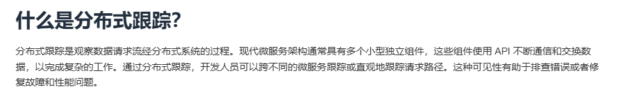

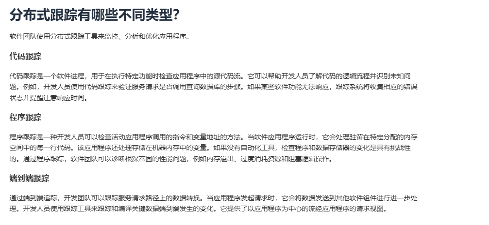

### 答法：

* **在请求的最开始阶段生成一个“追踪上下文”（Trace Context）**，
* 然后 **沿着整个调用链条跨服务传递下去**，每个服务接收到这个"上下文"之后对它进行"赋值"或其它相关操作，记录当前服务的信息（如服务耗时等信息）
* 最后所有服务把自己的追踪数据上报到一个集中平台（比如 Jaeger、Tempo、Zipkin），\
  平台再把这些数据拼成一条完整的“调用链路图”。

## 12、在多租户情况下，如何做到：API Key 隔离、RAG 数据域隔离、会话越权防护？上传文件如何清洗以防 PDF/HTML 注入？

在解决这个疑问之前，我们首先要知道它在问什么：

我们知道服务端是通过唯一的API-KEY去访问指定模型，即不会出现两个API-KEY都去访问阿里百炼这**一个相同的模型**

那么什么时候需要通过不同的API-KEY去访问相同模型呢？

假设：

* 你的服务为 10 家公司提供 AI 问答；
* 你后端统一用一个大模型的 API Key 去访问 OpenAI / 自建模型；
* 那么所有客户的调用都混在同一个 Key 下。

但是这样会有问题：

* **无法区分计费/统计** — 不知道哪个客户消耗了多少 token；
* **无法限制滥用** — 某客户疯狂请求会拖垮整个服务；
* **数据安全隔离弱** — 不同租户间的请求上下文可能混淆；
* **日志与审计困难** — trace 不到具体用户是谁触发的。

### 答法：

针对API Key隔离：颁发一个API-KEY给每个用户，存在数据库中；请求时带上 `Authorization: Bearer <key>`服务端解析 key → 查到租户 ID → 做权限和数据隔离

如果要清洗以防 PDF/HTML 注入，我们可以进行**上传文件清洗**：对 PDF/HTML 上传前做内容提取 + 标签过滤，去除脚本、链接、样式等潜在注入风险，防止 XSS / 注入攻击。

### 补充：

在看完之后，可以查阅以下文章，讲的挺不错的：

[吊打面试官！全网最全多租户系统设计方案](https://blog.csdn.net/vincent1007/article/details/143949268)

## 13、面对“多模型 + RAG + 语音”的综合成本，如何做成本可观测与弹性伸缩？在成本飙升时，系统的降级路径是什么？

在调用层统一封装各模型（阿里百炼、豆包、TTS/ASR）接口，埋点记录模型类型、token 数量、响应时长、调用成本等指标。数据上报到 Prometheus，并用 Grafana 做可视化统计，实现不同模型、功能模块的成本透明化。  当成本飙升的时候，统一使用降级策略， 优先关闭 RAG 检索，仅走基础对话 如使用本地模型（若有）/低成本模型

## 14、你在项目中如何统一不同厂商（阿里百炼、豆包、LLaMA 本地）的 请求/响应协议？为什么用策略模式而不是简单的 `if-else`？

我在项目中需要同时兼容多个大模型厂商，而它们的 **请求格式（buildRequest）** 和 **响应解析方式（parseResponse）** 都存在差异。为了统一接口层调用、减少上层逻辑的复杂度，我采用了 **策略模式（Strategy Pattern）** 来封装这些差异：\
如果用 if-else 判断模型类型（例如 `if(type == "aliyun") ... else if(type == "doubao") ...`），会导致：

* 代码高度耦合、可扩展性差；
* 每次新增厂商都要改动主流程，违背 **开闭原则（OCP）**；
* 不利于单元测试和独立演化。

而策略模式的优点在于：

* 每个厂商独立封装，互不影响；
* 可以通过注册机制（`StrategyRegister`）动态扩展；

## 15、当 不同模型的上下文窗口、工具调用能力、函数格式不一致时，如何在抽象层屏蔽差异？

不同模型的上下文窗口、函数调用格式和工具能力确实不一样。\
我的做法是保持上层接口统一，在 **AIStrategy 抽象层** 只定义标准接口，比如 `buildRequest()`、`parseResponse()`。

每个模型（阿里百炼、豆包）各自实现这些接口，去处理自身的差异，比如：

* 有的模型支持函数调用，就在 `buildRequest()` 里加上函数字段；
* 不支持的就直接忽略；
* 上下文窗口差异也由各模型自己控制。

上层调用只依赖基类指针执行，不需要知道是哪家厂商，从而**屏蔽了底层差异**。

相比 if-else，这种方式结构更清晰、扩展性更强，新增模型只需新增一个策略类并注册即可，不影响原有逻辑。

## 16、你如何处理 长文档（100MB+）的解析与入库：异步流水线、批量嵌入、失败重试、断点续传分别怎么做？

（这个就跟一些八股扯上关联了，大数据量/长文本这种场景）

这些操作在服务端没有太过于考虑，项目核心点不在这里，但是我们可以做如下操作

* 异步流水线：
  * 解析任务
  * 放入线程池，交给工作线程做事情
  * 后台非阻塞执行完成，交给客户端结果
* 流式解析 / 切块（避免一次性 OOM）
  * 不把整个 100MB 文件载入内存。用流式解析
  * 文本切块策略：
    * 切块长度以 **token 或字符** 为单位，约 2–8 KB 文本。并保留重叠（overlap）比如 50–200 tokens，保证检索上下文连续性。
    * 对于语义分段优先使用句子/段落边界，再按最大 token 限制拆分。
  * 每生成一个 chunk 就推送到消息队列（chunk metadata 包括 documentId、chunkIndex、checksum、offset、seq）。
* 批量嵌入：
  * 批量发送给 embedding 服务以提高吞吐：
  * 选择合适的 batch size（例如 16–128），取决于模型的吞吐/内存。实际值需基于模型和硬件调优。
  * 组 batch 前尽量按相似长度聚合以减少 padding waste。
  * 对模型调用要注意并发与速率限制（rate limits）——用并发窗口（concurrency limiter）+令牌桶（token bucket）。
  * 每个 batch 的请求应带上 **batchId + per-chunk seqId** 以保证幂等与追踪。

## 17 、你的“类 MCP”两段式流程（判断是否需要工具→调用工具→二次回答）如何 保证模型稳定输出 JSON？如果输出半结构化文本怎么兜底？

我们知道像 **SpringAI** 这类框架其实也是基于相同思路去封装的，但这种方式并不能完全避免误判。\
想要保证模型在需要调用工具时稳定输出 JSON，核心还是**依赖模型本身的理解能力**以及**提示词（Prompt）设计的精度与约束性**。\
我经过多轮测试，逐步优化并构造了相对稳定的提示词模板，以提高输出一致性。\
即便出现半结构化文本，也会通过 **正则提取结构化片段**、**健壮性校验与容错解析**等机制来兜底，确保流程稳定可控。


> 更新: 2025-11-22 23:28:45  
> 原文: <https://www.yuque.com/chengxuyuancarl/imh9xc/hzpib1xpx85xbg3n>