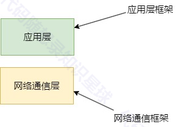

# 2.项目介绍

## 项目背景
### 什么是 HTTP 框架？
HTTP 框架是一种软件库，旨在简化 Web 应用程序和服务的开发。它提供了一种结构化的方法来处理 HTTP 请求和响应，管理路由，并通常包括会话管理、安全性和数据处理的工具。HTTP 框架抽象了网络通信的复杂性，使开发人员能够专注于构建应用程序逻辑。

### 为什么要实现 HTTP 框架？
1. **效率**：通过提供可重用的组件和抽象，HTTP 框架减少了开发人员需要编写的样板代码，从而加快了开发过程。
2. **可扩展性**：框架通常内置支持处理多个并发请求，使构建可扩展的应用程序变得更加容易。
3. **可维护性**：结构良好的框架强制执行最佳实践和设计模式，使代码库更易于维护和扩展。
4. **安全性**：框架通常包括安全功能，如输入验证、输出编码以及防止常见漏洞（如 SQL 注入和跨站脚本攻击）。
5. **社区和支持**：流行的框架拥有庞大的社区和丰富的文档，为开发人员提供支持和资源。

## 项目概述
该项目是一个使用 Muduo 库构建的 HTTP 框架，Muduo 是一个用于高性能网络应用的 C++ 网络库。该框架旨在高效处理 HTTP 请求和响应，为构建 Web 应用程序提供基础。

### 关键组件
1. **HttpRequest 和 HttpResponse：**这些类封装了 HTTP 请求和响应的细节。HttpRequest 处理 HTTP 方法、头部和主体内容的解析，而 HttpResponse 管理 HTTP 响应的构建，包括状态码、头部和主体内容的设置。
2. **HttpContext：**该类管理 HTTP 请求在处理过程中的状态。它跟踪解析状态并存储 HttpRequest 对象，确保请求的完整性和一致性。
3. **HttpServer：**作为框架的核心，HttpServer 负责接受连接、读取请求和发送响应。它使用 Muduo 库的高效事件驱动架构来处理网络通信，支持高并发和低延迟。
4. **路由和处理器：**框架支持根据请求路径和方法将请求路由到特定的处理器。处理器负责处理请求并生成适当的响应，支持动态路由和中间件功能。
5. **日志记录和错误处理：**框架包括日志记录功能以跟踪请求处理，并提供错误处理机制以优雅地管理异常和无效请求。通过详细的日志记录和错误报告，开发者可以快速定位和解决问题。
6. **会话管理：**支持用户会话的创建、维护和销毁，确保用户状态的一致性和安全性。
7. **中间件支持：**允许开发者在请求处理的各个阶段插入自定义逻辑，增强系统的灵活性和可扩展性。

### 工作原理
1. **请求解析：**传入的 HTTP 请求由 HttpContext 类解析，提取方法、路径、头部和主体。解析后的请求被传递给路由系统。
2. **路由：**根据请求路径和方法，框架将请求路由到适当的处理器。路由系统支持静态和动态路径匹配，确保请求被正确处理。
3. **响应生成：**处理器处理请求并生成 HttpResponse，然后将其发送回客户端。响应生成过程包括设置状态码、头部和主体内容。
4. **连接管理：**框架使用 Muduo 的事件驱动架构管理连接，使其能够高效地处理多个并发连接。通过非阻塞 I/O 和多线程支持，系统能够在高负载下保持稳定。
5. **安全通信：**通过集成 OpenSSL，框架支持 HTTPS，确保数据传输的安全性和完整性。

### 未来增强
+ **模板渲染：**添加支持渲染 HTML 模板以简化动态网页的创建。通过模板引擎，开发者可以轻松生成动态内容，提高开发效率。
+ **WebSocket 支持：**扩展框架以支持 WebSocket 连接，实现实时通信。WebSocket 的引入将增强应用的互动性和响应速度，适用于聊天应用、实时更新等场景。
+ **身份验证和授权：**集成 OAuth 和 JWT 等认证方式，增强系统的安全性和用户管理能力。
+ **负载均衡和分布式支持：**通过引入负载均衡策略和分布式架构，提升系统的可扩展性和可靠性，支持大规模应用的部署。

### 项目难点
+ **请求解析的准确性：**解析HTTP请求时，需要准确地解析请求行、头部和主体，任何解析错误都可能导致请求处理失败或安全漏洞
+ **继承和多态技术：**完成URI到处理器的绑定。
+ **灵活的路由机制：**框架需要提供灵活的路由机制，以便根据请求路径和方法将请求路由到正确的处理器。
+ **模块化设计：框**架应采用模块化设计，以便于扩展和维护。新功能或组件应能方便地集成到现有框架中。
+ **动态路由：**支持基于 URL 模式的动态路由（例如，支持 /users/:id 这样的路径）。 
+ **会话支持：**实现会话管理，支持用户登录状态的保持。持久化存储：支持将会话数据存储在数据库或内存中。
+ **数据库集成：**
    - 数据库连接池：实现数据库连接池，提高数据库访问效率。
    - ORM 支持：集成一个轻量级的 ORM，简化数据库操作。
+ **路由中间件：**允许在请求到达最终处理器之前进行预处理（例如，身份验证、日志记录）。 
+ **常用中间件：**提供一些常用的中间件，如 CORS 处理、请求限流、压缩（gzip）等。

这些重难点反映了在设计和实现 HTTP 框架时需要考虑的关键问题。解决这些问题需要深入理解 HTTP 协议、网络编程和系统设计等方面的知识。通过合理的架构设计和代码实现，可以有效地应对这些挑战。

## 结论
该 HTTP 框架为使用 C++ 构建 Web 应用程序提供了一个强大的基础。通过利用 Muduo 库，它提供了高性能和可扩展性，适用于广泛的应用程序。通过进一步的增强，它可以成为现代 Web 开发需求的全面解决方案。

## 该项目与WebServer的区别
大家可能会有这样的疑惑，同样是可以提供web服务，该项目跟 WebServer 项目有什么区别呢？下面我将根据我的理解去介绍这两者项目的区别。

为了让大家更清楚的理解，我将根据下面的架构图去介绍两个项目：

首先介绍 WebServer 项目，根据我了解学习到的绝大多数市面上的 WebServer 项目，都是教你从 socket 开始写最终能够实现一个简单的 HTTP 访问和响应就算是结束了。也就说明了 WebServer 这个项目的工作重点在于不仅需要实现一个网络通信框架，还需要实现一个简单可用的应用层实现。

其次就是介绍 HTTP 框架项目，该项目的重点在于应用层部分的实现，该项目的网络通信框架部分是直接使用muduo 网络库而不需要自己手动去实现。

#### 这么说不是做WebServer的项目更有意义吗？WebServer项目不仅可以手动实现网络通信框架还可以利用自己实现的网络通信框架的基础上去搭建HTTP框架。
先给出结论，这种方法理论上可行，但是实践起来将会遇到非常多的困难，并且这个项目的完成周期也会很长。

为什么该项目直接使用 muduo 网络库作为通信框架，而不自己手动去搭建一个通信框架，原因就在于 muduo 网络库稳定（有过实际项目开发经验的同学一定懂得稳定这两个字是多么重要）。以我个人举例子，我看过 muduo网络库的源码，懂得其设计思想，并且网上资料很多，但是最终我本人开发出来的网络框架在实际应用的过程中依然有各种各样的问题（总有我考虑不周的点），所以看似自己搭一个网络框架能够写很多代码学到很多东西，但是项目一旦大起来再想推进进度将会十分困难，不是修 bug 就是在修 bug 的路上，而且排错非常困难，你不知道是网络框架出的问题还是上层应用出的问题。

#### 做WebServer还是做HTTP框架项目怎么选？
什么样的人适合做 WebServer

+ C++初学者，只懂得C++基础语法，但是不懂如何使用C++开发网络项目
+ 想学习网络框架的设计，想知道 muduo 等网络库是怎么来的，想知道网络通信框架内部实现。

什么样的人适合做 HTTP 框架

+ 建议做过或者至少了解过 WebServer 或其他网络项目的人，对 C++ 网络编程有一定概念
+ 学习过计算机网络，理解 HTTP 协议，该项目可以让大量 HTTP 相关理论知识得到实践

总的来说，做过 WebServer 的人再去做 HTTP 框架项目将会有更多的收获，HTTP 框架项目由于不需要考虑网络通信框架部分的实现，它可以在应用层上有很大的施展空间，拓展很多后端常用功能。并且 HTTP 框架项目相较而言更稳定，在此基础上实现业务功能更稳定，debug 的难度会降低很多，在这一点上 WebServer 项目是不能比的，大多数人实现的 WebServer 项目的稳定性都极差，很难往上加业务功能，更别说有的人的 WebServer 就是单纯用来学习其设计思想的，编译运行起来都一大堆 bug。

> 更新: 2025-01-20 14:41:10  
> 原文: <https://www.yuque.com/chengxuyuancarl/imh9xc/utty1nkbh3idqrz6>