# 3.环境准备

**<font style="color:#333333;">注意：该篇环境准备针对的应用层是五子棋+HTTP服务框架，AI应用层简历写法这些全部在第九点</font>**

**<font style="color:#333333;"></font>**

**<font style="color:#333333;">建议购买一台云服务器，腾讯云或者阿里云，用来部署自己的项目 非常方便，无论是做本项目还是做其他项目，无论是自己练习，还是项目上线，都需要一台有公网Ip的独立服务器。 自己电脑安装虚拟机，不仅麻烦，进场出莫名其妙的问题。</font>**

* [阿里云活动期间服务器购买](https://www.aliyun.com/minisite/goods?taskCode=shareNew2205\&recordId=3641992\&userCode=roof0wob)
* [腾讯云活动期间服务器购买](https://curl.qcloud.com/EiaMXllu)

# l编译环境

* 操作系统(虚拟机或云服务器均可)：Ubuntu 22.04.5
* 数据库：mysql 5.7.29
* boost\_1\_69\_0
* muduo网络库

# 从零开始配置环境（一键配置版）

> 需要保证当前的操作系统是**纯净**的，没有任何配置，否则**可能报错（比如：已安装mysql）**，如果是**非纯净环境**，大家可以**参考手动配置版**，根据自己当前的系统环境，缺哪些地方就补哪些地方。

### 下载脚本文件

新建一个项目目录

```plain
mkdir http_project
```

```plain
cd http_project
```

下载build-HTTP.sh脚本文件

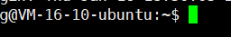

```cpp
wget https://www.programmercarl.com/download/build-HTTP.sh
```

下载完成后给他加上可执行权限

```cpp
chmod +x build-HTTP.sh
```

### 运行脚本文件

```cpp
sudo ./build-HTTP.sh
```

### 脚本运行过程

> 环境配置时间很长，大概要**二十分钟以上**，请耐心等待。

注意：执行到这里的时候密码一定要设置为\*\* root\*\*

> 这里代表的是数据库**root用户**的密码，因为脚本涉及到登录你的mysql数据库帮你建数据库、建表、打开远程访问权限等，具体涉及到哪些功能，可以看手动配置版中有介绍。

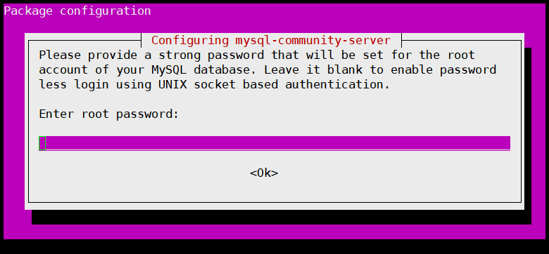

后续执行过程中遇到下列问题，一直**回车**就好了

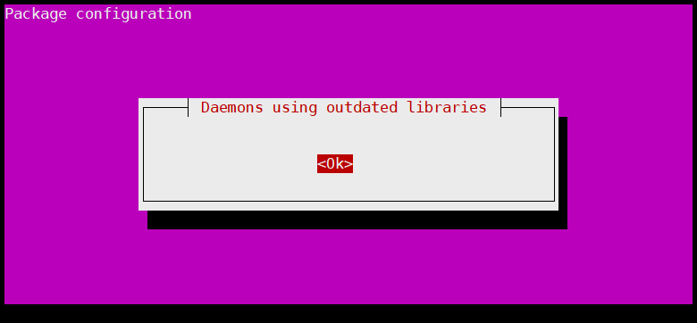

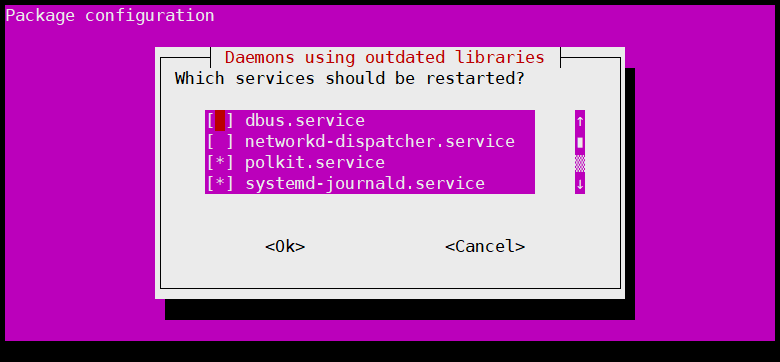

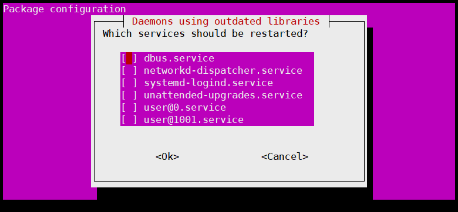

### 编译运行HTTP框架

如果大家从github下载压缩包，解压缩完之后是这个样子的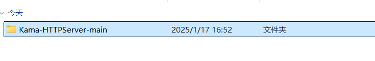

或者这样拉取项目

```cpp
git init
git clone https://github.com/youngyangyang04/Kama-HTTPServer.git
```

大家将项目上传到Ubuntu上，进入该项目根目录就可以开始执行下列命令了

#### 编译

```cpp
mkdir build
cd build/
cmake ..
make
```

#### 运行

```cpp
sudo ./simple_webserver
```

### 运行成功界面

登录，如果你是用云服务器启动的，则访问云服务器公网IP地址就可以：

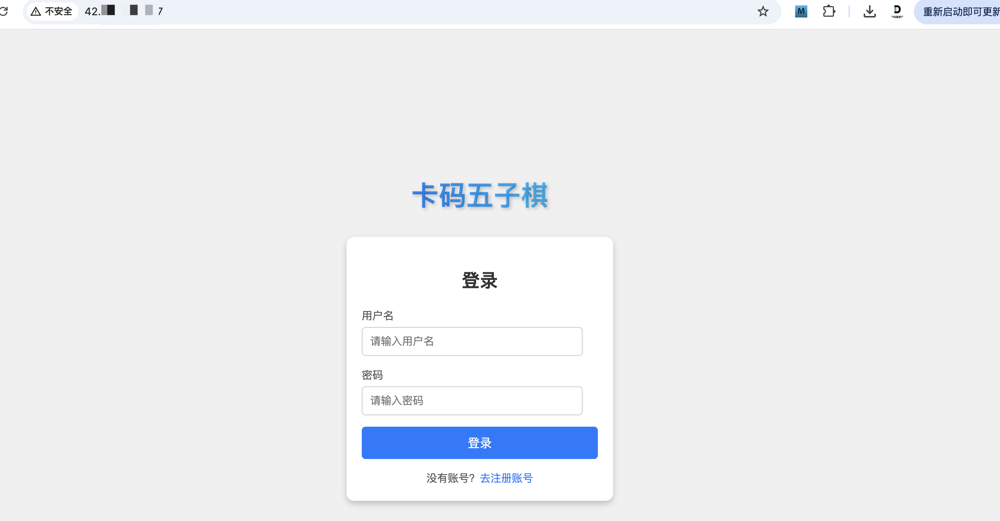

菜单

> 匹配玩家和退出游戏待开发中。。。

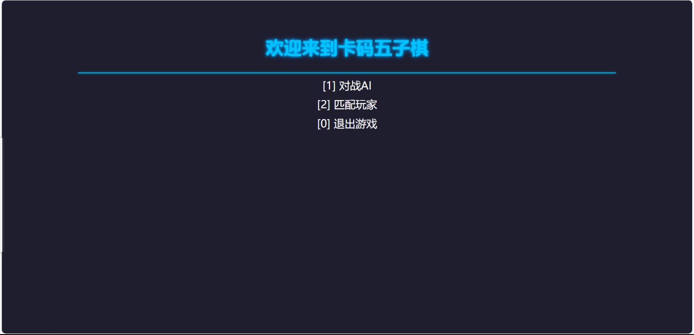

对战AI

> 人机对战目前只是用于demo测试，AI很弱智，待完善。。。

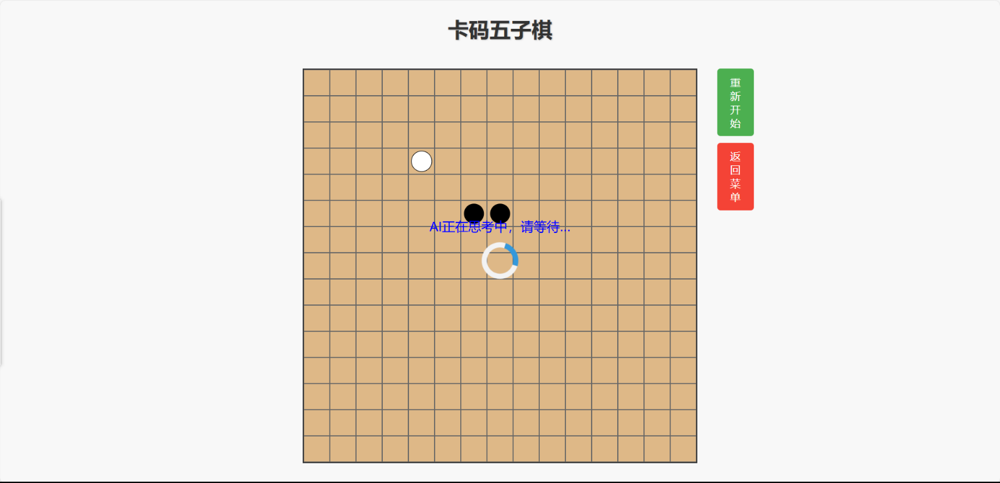

# 从零开始配置环境（更为推荐的docker配置版）

（注意：此镜像对应的应用层为卡玛五子棋，若是想看AI，查阅第九点）


## 1:下载Docker

可以i查看这个文章来下载对应的docker

<https://blog.csdn.net/jackeydengjun/article/details/147185455>

## 2：从远程拉取我配置好的镜像并创建容器

```cpp
# 将我提供的远程镜像拉取到本地
docker pull huanheart/httpserver:v1
```

如果在这个过程中出现

Error response from daemon: Get "<https://registry-1.docker.io/v2/":> context deadline exceeded

那么可能是因为没有设置代理导致的，可以设置国内镜像源代理或者说用梯子开启局域网服务，并在虚拟机上进行绑定

这边 @卡哥助手 已找好对应代理，跟着接下来这么做（如果还遇到问题，请在项目群中联系@卡哥助手-焕心）

```cpp
# 生成该json
vim /etc/docker/daemon.json
```

将下面内容复制上去

```cpp
{
  "registry-mirrors": [
    "https://docker.registry.cyou",
    "https://docker-cf.registry.cyou",
    "https://dockercf.jsdelivr.fyi",
    "https://docker.jsdelivr.fyi",
    "https://dockertest.jsdelivr.fyi",
    "https://mirror2.aliyuncs.com",
    "https://dockerproxy.com",
    "https://mirror.baidubce.com",
    "https://docker.m.daocloud.io",
    "https://docker.nju.edu.cn",
    "https://docker.mirrors.sjtug.sjtu.edu.cn",
    "https://docker.mirrors.ustc.edu.cn",
    "https://mirror.iscas.ac.cn",
    "https://docker.rainbond.cc"
  ]
}

```

保存之后重新启动docker，并重新拉取该镜像，应该就可以了，

如果代理不可用了，大家可以自行网上搜索，或者在群里找[@焕、心](undefined/huanxin-katrm)要梯子,通过梯子的方式设置代理，而不是国内镜像源

```cpp
sudo systemctl daemon-reexec
sudo systemctl restart docker
docker pull huanheart/httpserver:v1

```

此时镜像就已经拉取好了，现在需要创建容器了

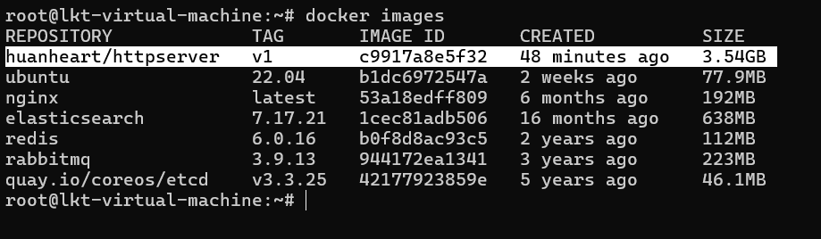

创建容器,执行该命令（这边暴露5个端口是为后续可能用到多个端口做铺垫）

```cpp
docker run -d \
  --name httpserver-container \
  -p 8001:8001 \
  -p 8002:8002 \
  -p 8003:8003 \
  -p 8004:8004 \
  -p 8005:8005 \
  huanheart/httpserver:v1 \
  tail -f /dev/null

```

**注意：如果出现以下问题，说明端口被占用过了，将-p指定的端口换成另外一个即可**

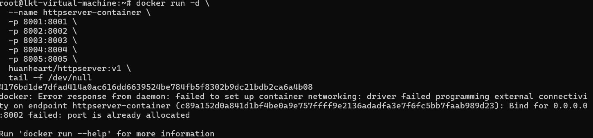

## 3：进入docker

先docker ps查看是否有这个容器

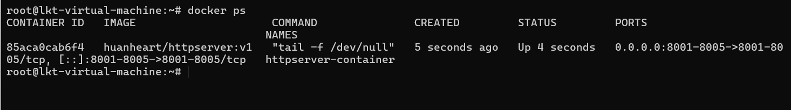

通过docker exec -it 85aca0cab6f4 bash进入容器，**85aca0cab6f4为你的CONTAINER ID ，看上面的截图，每个人的不一样**

```cpp
# 由于这边没有设置mysql自启动，需要手动启动一次，否则会导致错误
service mysql start
# 进入容器后，进入根目录
cd ~
# ls可以发现有如下内容，我们进入Kama-HTTPServer/build_temp/
cd Kama-HTTPServer/build_temp/
```

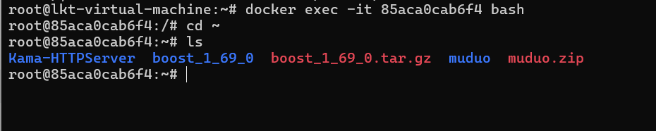

```cpp
# 接着我们运行如下指令，拿8001端口举例
./simple_server -p 8001
```

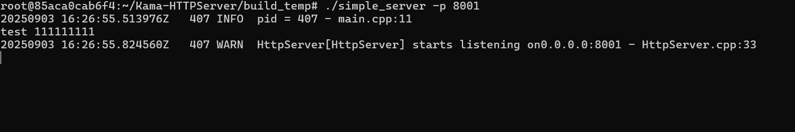

最后我们去浏览器中访问即可,可以发现成功访问到了

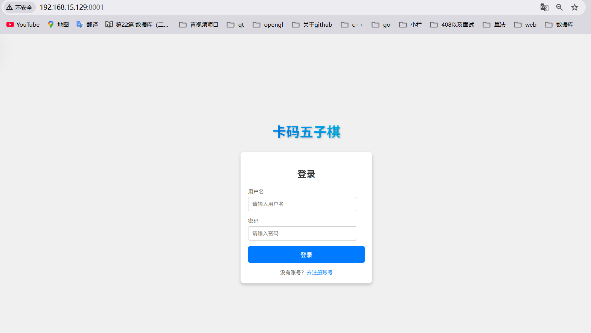

## 4：关于访问mysql的注意点：

这边容器的mysql的密码是123456，如果想要访问mysql的话记住这个密码即可

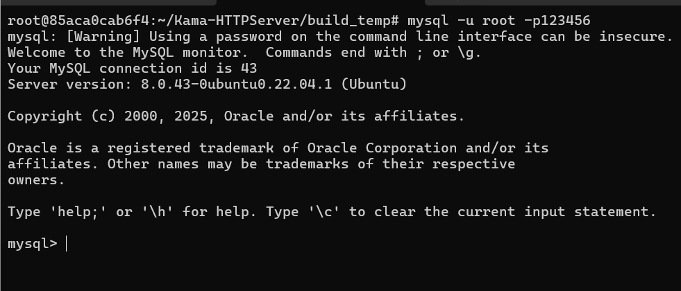

# 从零开始配置环境（手动配置版）

（注意：此镜像对应的应用层为卡玛五子棋，若是想看AI，查阅第九点）


**首先，我们要将HTTP框架项目从github上下载到自己的云服务器或者虚拟机上，其次我们就开始我们的环境配置了。**

先禁用自动更新服务，防止它与手动操作冲突

```shell
sudo systemctl stop apt-daily.timer
sudo systemctl stop apt-daily-upgrade.timer
sudo systemctl disable apt-daily.timer
sudo systemctl disable apt-daily-upgrade.timer
```

## 编译器相关

### g++、cmake、make

```cpp
sudo apt update
sudo apt install g++ cmake make
```

## MySql相关

### mysql 5.7压缩包下载：

<font style="color:rgb(6, 6, 7);">使用 </font>`aria2`<font style="color:rgb(6, 6, 7);"> 加速下载压缩包： </font><code><font style="color:rgb(6, 6, 7);">aria2</font></code><font style="color:rgb(6, 6, 7);"> 是一个支持多协议、多源和多线程的下载工具。您可以安装 </font><code><font style="color:rgb(6, 6, 7);">aria2</font></code><font style="color:rgb(6, 6, 7);"> 并使用它来下载文件</font>

```cpp
sudo apt install aria2
aria2c https://downloads.mysql.com/archives/get/p/23/file/mysql-server_5.7.29-1ubuntu18.04_amd64.deb-bundle.tar
```

下载好压缩包之后解压缩

```cpp
sudo tar -xvf mysql-server_5.7.29-1ubuntu18.04_amd64.deb-bundle.tar
```

出现如图所示表示解压缩正确：

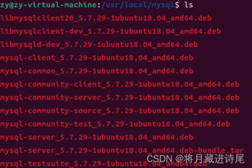

### 安装mysql

<font style="color:rgb(77, 77, 77);">安装依赖lib包</font>

```shell
sudo apt install ./libmysql*
sudo apt install libtinfo5
```

<font style="color:rgb(77, 77, 77);">安装客户端和服务端，按提示可能要先安装community版本</font>

```shell
sudo apt-get install ./mysql-community-client_5.7.29-1ubuntu18.04_amd64.deb
sudo apt-get install ./mysql-client_5.7.29-1ubuntu18.04_amd64.deb
sudo apt-get install ./mysql-community-server_5.7.29-1ubuntu18.04_amd64.deb
sudo apt-get install ./mysql-server_5.7.29-1ubuntu18.04_amd64.deb 
```

<font style="color:rgb(77, 77, 77);">第三行命令执行时会提示设置MySQL的密码，用户名默认root。</font>**<font style="color:rgb(77, 77, 77);">出现下图时，设置密码之后按回车键就行</font>\*\*\*\*<font style="color:#DF2A3F;">（一键配置：这里让大家统一输入root）</font>**<font style="color:rgb(77, 77, 77);">。</font>

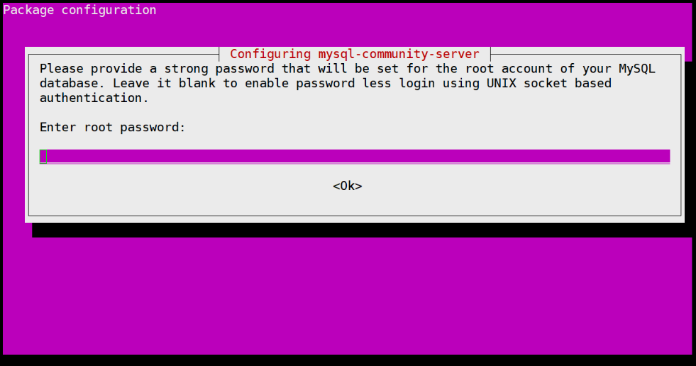

### <font style="color:rgb(77, 77, 77);">启动mysql</font>

#### 检查状态

<font style="color:rgb(77, 77, 77);">一般安装成功就自动启动，输入命令检查启动状态，绿色的active表示运行中</font>

```shell
systemctl status mysql.service
```

按ctrl + c退出

#### <font style="color:rgb(79, 79, 79);">登录MySQL</font>

<font style="color:rgb(77, 77, 77);">使用root用户登录MySQL</font>

```shell
sudo mysql -uroot -proot
```

安转好mysql以后，进入mysql后创建数据库数据表命令，以及设置root用户访问权限（比如放开远程连接）：

```cpp
create database Gomoku;
use Gomoku;
CREATE TABLE users (
    id INT(11) NOT NULL AUTO_INCREMENT,
    username VARCHAR(255) NOT NULL,
    password VARCHAR(255) NOT NULL,
    PRIMARY KEY (id)
);
UPDATE mysql.user SET host = '%' WHERE user = 'root' AND host = 'localhost';
GRANT ALL PRIVILEGES ON *.* TO 'root'@'%' IDENTIFIED BY 'root' WITH GRANT OPTION;
FLUSH PRIVILEGES;
```

在系统文件中也要开启远程访问权限，设置完毕后需要重启MySQL服务

```cpp
sudo sed -i "s/^bind-address\s*=.*/bind-address = 0.0.0.0/" /etc/mysql/mysql.conf.d/mysqld.cnf
sudo systemctl restart mysql
sudo ufw allow 3306
```

## 第三方库：boost库、muduo网络库、nlohmann/json等相关库

##### <font style="color:rgb(31, 35, 40);">boost库和muduo网络库的安装教程链接如下：</font>

<font style="color:rgb(31, 35, 40);">boost库：</font><https://blog.csdn.net/QIANGWEIYUAN/article/details/88792874>\ <font style="color:rgb(31, 35, 40);">muduo库：</font><https://blog.csdn.net/QIANGWEIYUAN/article/details/89023980>

### <font style="color:rgb(79, 79, 79);">Linux下 Boost库环境搭建</font>

<font style="color:rgb(77, 77, 77);">先把Linux系统下的boost源码包boost\_1\_69\_0.tar.gz通过命令下载下来，然后解压，如下：</font>

```cpp
wget https://www.programmercarl.com/download/boost_1_69_0.tar.gz
tar -zxvf boost_1_69_0.tar.gz
```

<font style="color:rgb(77, 77, 77);">tar解压完成后，进入源码文件目录，查看内容：</font>

```cpp
cd boost_1_69_0/
```

<font style="color:rgb(77, 77, 77);">运行bootstrap.sh工程编译构建程序，需要等待一会儿，查看目录：</font>

```cpp
./bootstrap.sh 
```

后续要执行的命令(详情大家看boost库链接)：

```cpp
./b2
sudo ./b2 install
cd ..
```

### <font style="color:rgb(79, 79, 79);">Linux下 muduo库环境搭建</font>

这里直接给出安装命令（详情请看上述 muduo 库对应链接）

<font style="color:rgb(77, 77, 77);">首先在boost库压缩包相同的目录下通过命令将 muduo-master.zip 下载到Linux系统下，其次就按照下面命令执行就可以了</font>

```cpp
wget https://www.programmercarl.com/download/muduo-master.zip
sudo apt install unzip
unzip muduo-master.zip
cd muduo-master
sudo chmod +x build.sh
./build.sh
./build.sh install
cd ..
cd build/
cd release-install-cpp11/
cd include/
sudo mv muduo/ /usr/include/
cd ..
cd lib/
sudo mv * /usr/local/lib/
```

### nlohmann/json

ubuntu22.04按这个命令来：

```cpp
sudo apt upgrade
sudo apt install nlohmann-json3-dev
```

出现如图情况一直<font style="color:#DF2A3F;">回车</font>就行。

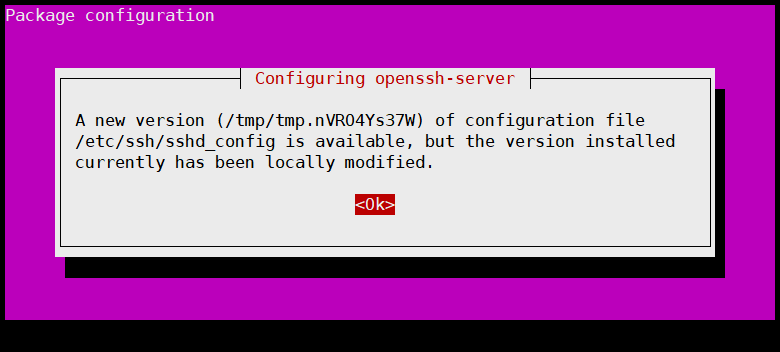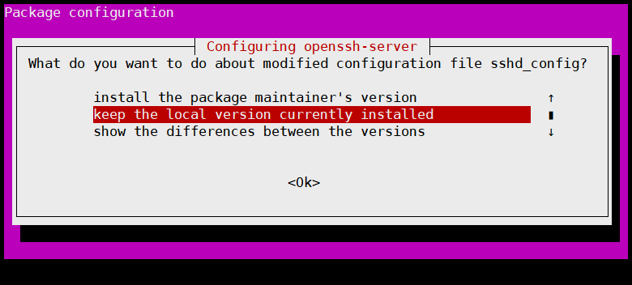

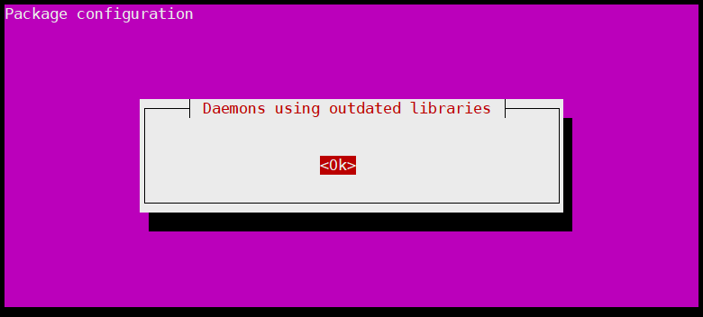

### c++mysql库:

```cpp
sudo apt install libmysqlcppconn-dev
```

### 安装 OpenSSL 开发库

```cpp
sudo apt install libssl-dev
```

> <font style="color:#000000;">出现上面同样紫色的情况也是一路回车就好了</font>

## 编译运行

如果大家是完全按照上述描述执行的，现在应该在这个目录下，只需要退出当前目录，找到HTTP项目目录就行

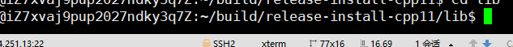

```cpp
cd ..
cd ..
cd ..
cd HTTP项目名称/
```

编译命令

```cpp
mkdir build
cd build/
cmake ..
make
```

运行命令

> 这里大家可以自己通过 \*\*-p 端口号 \*\*来配置服务器运行端口号

```cpp
sudo ./simple_server
```

# 保持运行云服务器上

如果大家通过xshell将项目运行在云服务器上，想要在xshell关闭时项目依然运行，可参考如下：

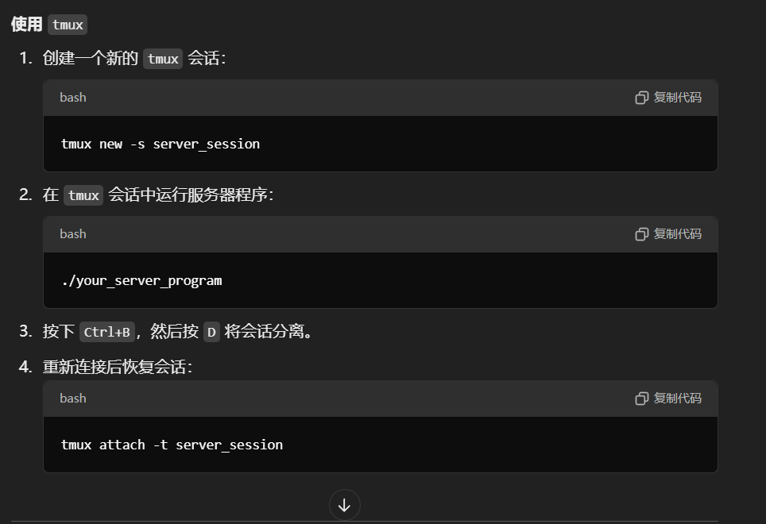

重新连接后恢复会话

```cpp
tmux attach -t server_session
```


> 更新: 2025-11-03 16:23:48  
> 原文: <https://www.yuque.com/chengxuyuancarl/imh9xc/txt4ssk5pdgg166g>