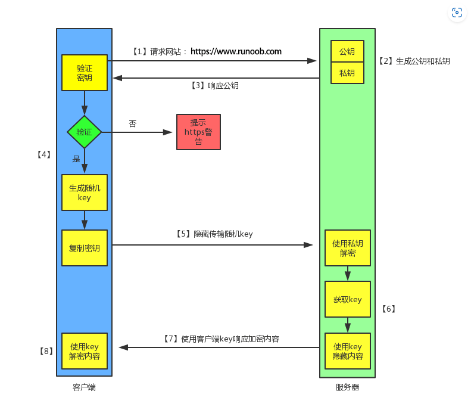

# HTTPS模块

参考文章：

<https://zhuanlan.zhihu.com/p/631089816>

<https://www.runoob.com/w3cnote/http-vs-https.html>

# 理论部分

## <font style="color:rgb(25, 27, 31);">概述</font>

<font style="color:rgb(25, 27, 31);">为实现Web浏览器和网站服务器之间的信息传递，我们一般会采用</font>[<font style="color:rgb(25, 27, 31);">HTTP协议</font>](https://zhida.zhihu.com/search?content_id=228373455\&content_type=Article\&match_order=1\&q=HTTP%E5%8D%8F%E8%AE%AE\&zhida_source=entity)<font style="color:rgb(25, 27, 31);">进行通信。不过需要注意的是，HTTP以明文方式发送内容且没有提供任何形式的数据加密功能，在涉及敏感信息（如信用卡号、密码等支付相关内容）时存在安全隐患。因此，我们应该使用另一种更为安全可靠的协议：HTTPS。HTTPS在HTTP基础上引入了SSL协议，并通过证书验证服务器身份以确保通信过程中数据得到合理保护和加密处理。</font>

## **<font style="color:rgb(25, 27, 31);">HTTP和HTTPS的基本概念</font>**

<font style="color:rgb(25, 27, 31);">HTTP是一种广泛使用的</font>[<font style="color:rgb(25, 27, 31);">网络协议</font>](https://zhida.zhihu.com/search?content_id=228373455\&content_type=Article\&match_order=1\&q=%E7%BD%91%E7%BB%9C%E5%8D%8F%E8%AE%AE\&zhida_source=entity)<font style="color:rgb(25, 27, 31);">，用于浏览器和服务器之间的请求和应答。它基于TCP协议，用于从WWW服务器传输超文本到本地浏览器。HTTP可以提高浏览器效率，减少网络传输。</font>

<font style="color:rgb(25, 27, 31);">HTTPS旨在提供一个安全、可靠的</font>[<font style="color:rgb(25, 27, 31);">HTTP通道</font>](https://zhida.zhihu.com/search?content_id=228373455\&content_type=Article\&match_order=1\&q=HTTP%E9%80%9A%E9%81%93\&zhida_source=entity)<font style="color:rgb(25, 27, 31);">。简而言之，它是对HTTP进行加密保护后的版本，在其基础上添加了</font>[<font style="color:rgb(25, 27, 31);">SSL层</font>](https://zhida.zhihu.com/search?content_id=228373455\&content_type=Article\&match_order=1\&q=SSL%E5%B1%82\&zhida_source=entity)<font style="color:rgb(25, 27, 31);">以实现更高级别的安全性保障。HTTPS所采用加密技术基于SSL来实现。</font>

## <font style="color:rgb(25, 27, 31);">HTTP与HTTPS有什么区别？</font>

<font style="color:rgb(25, 27, 31);">由于HTTP协议传输的数据是明文格式的，因此发送隐私信息时存在着安全风险。为确保数据传输安全性，</font>[<font style="color:rgb(25, 27, 31);">网景公司</font>](https://zhida.zhihu.com/search?content_id=228373455\&content_type=Article\&match_order=1\&q=%E7%BD%91%E6%99%AF%E5%85%AC%E5%8F%B8\&zhida_source=entity)<font style="color:rgb(25, 27, 31);">推出了SSL（Secure Sockets Layer）协议，并在其基础上创造出了HTTPS通信方式。简而言之，HTTPS是一种安全、支持加密传输和身份认证功能的网络通信方式，它是在SSL与HTTP结合后诞生的。</font>

<font style="color:rgb(25, 27, 31);">HTTPS和HTTP的区别主要如下：</font>

<font style="color:rgb(25, 27, 31);">1、https协议需要到ca申请证书，一般免费证书较少，因而需要一定费用。</font>

<font style="color:rgb(25, 27, 31);">2、http是</font>[<font style="color:rgb(25, 27, 31);">超文本传输协议</font>](https://zhida.zhihu.com/search?content_id=228373455\&content_type=Article\&match_order=1\&q=%E8%B6%85%E6%96%87%E6%9C%AC%E4%BC%A0%E8%BE%93%E5%8D%8F%E8%AE%AE\&zhida_source=entity)<font style="color:rgb(25, 27, 31);">，信息是明文传输，https则是具有安全性的ssl加密传输协议。</font>

<font style="color:rgb(25, 27, 31);">3、http和https使用的是完全不同的连接方式，用的端口也不一样，前者是80，后者是443。</font>

<font style="color:rgb(25, 27, 31);">4、http的连接很简单，是无状态的；HTTPS协议是由SSL+HTTP协议构建的可进行加密传输、身份认证的网络协议，比</font>[<font style="color:rgb(25, 27, 31);">http协议</font>](https://zhida.zhihu.com/search?content_id=228373455\&content_type=Article\&match_order=1\&q=http%E5%8D%8F%E8%AE%AE\&zhida_source=entity)<font style="color:rgb(25, 27, 31);">安全。</font>

## <font style="color:rgb(51, 51, 51);">HTTPS 的工作原理</font>

<font style="color:rgb(25, 27, 31);">我们都知道 HTTPS 能够加密信息，以免敏感信息被第三方获取，所以很多银行网站或电子邮箱等等安全级别较高的服务都会采用 HTTPS 协议。</font>

**<font style="color:rgb(25, 27, 31);">1、客户端发起 HTTPS 请求</font>**

<font style="color:rgb(25, 27, 31);">这个没什么好说的，就是用户在浏览器里输入一个 https 网址，然后连接到 server 的 443 端口。</font>

**<font style="color:rgb(25, 27, 31);">2、服务端的配置</font>**

<font style="color:rgb(25, 27, 31);">采用 HTTPS 协议的服务器必须要有一套数字证书，可以自己制作，也可以向组织申请，区别就是自己颁发的证书需要客户端验证通过，才可以继续访问，而使用受信任的公司申请的证书则不会弹出提示页面(startssl 就是个不错的选择，有 1 年的免费服务)。</font>

<font style="color:rgb(25, 27, 31);">这套证书其实就是一对公钥和私钥，如果对公钥和私钥不太理解，可以想象成一把钥匙和一个锁头，只是全世界只有你一个人有这把钥匙，你可以把锁头给别人，别人可以用这个锁把重要的东西锁起来，然后发给你，因为只有你一个人有这把钥匙，所以只有你才能看到被这把锁锁起来的东西。</font>

**<font style="color:rgb(25, 27, 31);">3、传送证书</font>**

<font style="color:rgb(25, 27, 31);">这个证书其实就是公钥，只是包含了很多信息，如证书的颁发机构，过期时间等等。</font>

**<font style="color:rgb(25, 27, 31);">4、客户端解析证书</font>**

<font style="color:rgb(25, 27, 31);">这部分工作是有客户端的TLS来完成的，首先会验证公钥是否有效，比如颁发机构，过期时间等等，如果发现异常，则会弹出一个警告框，提示证书存在问题。</font>

<font style="color:rgb(25, 27, 31);">如果证书没有问题，那么就生成一个随机值，然后用证书对该随机值进行加密，就好像上面说的，把随机值用锁头锁起来，这样除非有钥匙，不然看不到被锁住的内容。</font>

**<font style="color:rgb(25, 27, 31);">5、传送加密信息</font>**

<font style="color:rgb(25, 27, 31);">这部分传送的是用证书加密后的随机值，目的就是让服务端得到这个随机值，以后客户端和服务端的通信就可以通过这个随机值来进行加密解密了。</font>

**<font style="color:rgb(25, 27, 31);">6、服务端解密信息</font>**

<font style="color:rgb(25, 27, 31);">服务端用私钥解密后，得到了客户端传过来的随机值(对称秘钥)，然后把内容通过该值进行对称加密，所谓对称加密就是，将信息和私钥通过某种算法混合在一起，这样除非知道私钥，不然无法获取内容，而正好客户端和服务端都知道这个私钥，所以只要加密算法够彪悍，私钥够复杂，数据就够安全。</font>

**<font style="color:rgb(25, 27, 31);">7、传输加密后的信息</font>**

<font style="color:rgb(25, 27, 31);">这部分信息是服务段用私钥加密后的信息，可以在客户端被还原。</font>

**<font style="color:rgb(25, 27, 31);">8、客户端解密信息</font>**

<font style="color:rgb(25, 27, 31);">客户端用之前生成的私钥解密服务段传过来的信息，于是获取了解密后的内容，整个过程第三方即使监听到了数据，也束手无策。</font>

### <font style="color:rgb(51, 51, 51);">加密方式</font>

HTTPS的加密方式是对称加密和非对称加密两种加密方式混合的方式，先执行非对称加密再执行对称加密。

#### 为什么使用混合加密方式？

如果直接使用对称加密，发送方通过密钥对报文进行加密，接收方收到报文后通过相同的密钥对报文进行解密。但是问题就出在发送方如何把密钥安全地送到接收方手上，并且不被任何中间人所截获，因为接收方能通过密钥解密，那么其他中间人拿到密钥后也能对报文进行解密，那么这个密钥就失去了作用。

如果直接使用非对称密钥的话，接收方要在发送方发送数据前把公钥（所有人都可以获取公钥，专门用于加密）传给发送方，接收方自己保留一个私钥（专门用于解密），发送方发送数据时就用公钥进行加密，中间人由于没有私钥只能拿到公钥所以无法对报文进行解密，所以保证了报文的安全。但是非对称加密的完成过程相较繁琐，如果每条数据的发送都需要进行非对称加密，响应速度将会大大降低。

所有就有了混合加密方式，接收方先将公钥发送给发送方，发送方生成对称密钥，用公钥对对称密钥进行加密之后，将对称密钥发送给接收方，接收方通过私钥解密出对称密钥，保证了只有通信的双方拿到对称密钥，从此以后双方就可以通过对称密钥来保证数据的安全传输了。

### 证书

证书的使用步骤：

1. 服务器的运营人员会通过数字证书认证机构进行身份认证。当机构验证其身份后，会对服务器的公钥进行数字签名，并将其与公钥绑定在一起形成公钥证书
2. 客户端接收到服务器发送的公钥证书后，会向数字证书认证机构验证数字签名的正确性，以确保公钥未被篡改或替换
3. 即使中间人想伪造公钥证书，也无法通过数字证书认证机构的验证，因此无法欺骗客户端。
4. 通过数字签名和验证机制，确保了公钥的真实性和安全性。
5. 服务器使用数字证书认证来确认其身份并获取由机构颁发的公钥。客户端接收到该公钥时会通过验证来确保其未被篡改。这种方法可以防止中间人攻击并保护通信安全

## **<font style="color:rgb(25, 27, 31);">HTTPS的优点与缺点</font>**

HTTPS（HyperText Transfer Protocol Secure）是一种用于安全通信的协议，它在 HTTP 基础上添加了 SSL/TLS 加密层。以下是 HTTPS 的优点和缺点：

### **优点**

1. **数据加密**\
   HTTPS 使用 SSL/TLS 加密，保护用户与服务器之间的数据传输，防止数据被窃取或篡改，尤其适用于敏感信息如密码、信用卡号等。
2. **身份验证**\
   HTTPS 使用数字证书验证服务器的真实性，确保用户连接到的是合法网站，而不是伪造或恶意网站。
3. **数据完整性**\
   通过加密和哈希校验，HTTPS 确保数据在传输过程中没有被篡改。
4. **搜索引擎排名优化**\
   搜索引擎（如 Google）倾向于优先排名使用 HTTPS 的网站，从而提升网站的 SEO。
5. **用户信任**\
   浏览器会标记未使用 HTTPS 的网站为“不安全”，而 HTTPS 网站增强了用户信任感。

### **缺点**

1. **性能开销**\
   HTTPS 需要加密和解密数据，这增加了服务器和客户端的计算负载，对性能有一定影响。不过，现代硬件和优化技术（如 TLS 1.3）已大大减轻了性能损耗。
2. **成本（部分情况下）**\
   虽然有免费的 SSL 证书提供商（如 Let’s Encrypt），一些企业仍选择购买更高级的证书，这会产生费用。
3. **配置复杂性**\
   HTTPS 需要正确配置 SSL/TLS 证书，包括证书安装、续期和中间证书管理，操作复杂性可能导致安全隐患。
4. **兼容性问题**\
   旧版本的浏览器或设备可能不支持现代的 HTTPS/TLS 标准，导致部分用户无法访问。

# 代码部分

> 这里作为知识点应对面试，给大家展现实现思路，让大家清楚大概是如何实现的。没有完全实现所有功能，后续如果有机会的话我可能会抽时间验证一下（如果大家有时间的话可以自行验证并实现HTTPS的所有功能）。

### 概述

在 HTTP 服务器的基础上实现 HTTPS 需要引入 SSL/TLS 协议。通过使用 OpenSSL 库，我们可以在现有的 HTTP 服务器上添加加密层，确保数据传输的安全性。

### 基础架构设计

HTTPS 的实现主要涉及以下几个步骤：

1. 配置 OpenSSL 环境
2. 创建 SSL 上下文
3. 在现有的 HTTP 服务器中集成 SSL
4. 处理 SSL 握手和加密通信

### 配置OpenSSL环境

#### 3.1 安装 OpenSSL

确保系统中安装了 OpenSSL 库。可以通过以下命令安装：

```cpp
sudo apt update
sudo apt install libssl-dev
```

#### 3.2 生成 SSL 证书

使用 OpenSSL 生成自签名证书：

```cpp
openssl req -x509 -nodes -days 365 -newkey rsa:2048 -keyout server.key -out server.crt
```

如果有**云服务器且有域名**可以使用这种生成证书的方式:

最常用的免费SSL证书提供方是Let's Encrypt。以下是获取步骤：

使用Certbot获取Let's Encrypt证书：

```cpp
sudo apt-get install certbot

# 获取证书
sudo certbot certonly --standalone -d your-domain.com
```

### HTTPS测试主程序

```cpp
#include "../include/http/HttpServer.h"
#include <muduo/base/Logging.h>
#include "../include/ssl/SslConfigLoader.h"

int main(int argc, char *argv[])
{
    // 设置日志级别
    muduo::Logger::setLogLevel(muduo::Logger::DEBUG);

    try
    {
        // 创建服务器实例
        auto serverPtr = std::make_unique<http::HttpServer>(443, "HTTPSServer", true);

        // 加载 SSL 配置
        ssl::SslConfig sslConfig;

        // 获取当前工作目录
        char cwd[PATH_MAX];
        if (getcwd(cwd, sizeof(cwd)) != nullptr)
        {
            LOG_INFO << "Current working directory: " << cwd;
        }

        // 设置证书文件（使用绝对路径）
        std::string certFile = "/etc/letsencrypt/live/growingshark.asia/fullchain.pem";
        std::string keyFile = "/etc/letsencrypt/live/growingshark.asia/privkey.pem";

        LOG_INFO << "Loading certificate from: " << certFile;
        LOG_INFO << "Loading private key from: " << keyFile;

        sslConfig.setCertificateFile(certFile);
        sslConfig.setPrivateKeyFile(keyFile);
        sslConfig.setProtocolVersion(ssl::SSLVersion::TLS_1_2);

        // 验证文件是否存在
        if (access(certFile.c_str(), R_OK) != 0)
        {
            LOG_FATAL << "Cannot read certificate file: " << certFile;
            return 1;
        }
        if (access(keyFile.c_str(), R_OK) != 0)
        {
            LOG_FATAL << "Cannot read private key file: " << keyFile;
            return 1;
        }

        serverPtr->setSslConfig(sslConfig);

        // 设置线程数
        serverPtr->setThreadNum(4);

        // 添加一些测试路由
        serverPtr->Get("/", [](const http::HttpRequest &req, http::HttpResponse *resp)
                   {
            resp->setStatusCode(http::HttpResponse::k200Ok);
            resp->setStatusMessage("OK");
            resp->setContentType("text/plain");
            resp->setBody("Hello, World!"); });

        // 启动服务器
        LOG_INFO << "Server starting on port 443...";
        serverPtr->start();
    }
    catch (const std::exception &e)
    {
        LOG_FATAL << "Server start failed: " << e.what();
        return 1;
    }

    return 0;
}
```

### 创建 SSL 上下文

SSL 上下文 (`SSL_CTX`) 是 OpenSSL 中用于管理 SSL/TLS 协议的核心结构。它负责存储 SSL 配置、证书、密钥等信息，并用于创建 SSL 连接。创建 SSL 上下文是实现 HTTPS 的关键步骤。

创建一个新的 SSL 上下文，用于管理 SSL 连接。

#### 主要功能

* 初始化 SSL 环境：设置 SSL/TLS 协议版本和选项。
* 加载证书和私钥：用于验证服务器身份和加密通信。
* 配置 SSL 参数：如会话缓存、验证模式等。

#### SslConfig 类

SslConfig 类用于存储 SSL 配置，包括证书和密钥文件路径

```cpp
class SslConfig 
{
public:
    SslConfig();
    ~SslConfig() = default;

    // 证书配置
    void setCertificateFile(const std::string& certFile) { certFile_ = certFile; }
    void setPrivateKeyFile(const std::string& keyFile) { keyFile_ = keyFile; }
    void setCertificateChainFile(const std::string& chainFile) { chainFile_ = chainFile; }
    
    // 协议版本和加密套件配置
    void setProtocolVersion(SSLVersion version) { version_ = version; }
    void setCipherList(const std::string& cipherList) { cipherList_ = cipherList; }
    
    // 客户端验证配置
    void setVerifyClient(bool verify) { verifyClient_ = verify; }
    void setVerifyDepth(int depth) { verifyDepth_ = depth; }
    
    // 会话配置
    void setSessionTimeout(int seconds) { sessionTimeout_ = seconds; }
    void setSessionCacheSize(long size) { sessionCacheSize_ = size; }

    // Getters
    const std::string& getCertificateFile() const { return certFile_; }
    const std::string& getPrivateKeyFile() const { return keyFile_; }
    const std::string& getCertificateChainFile() const { return chainFile_; }
    SSLVersion getProtocolVersion() const { return version_; }
    const std::string& getCipherList() const { return cipherList_; }
    bool getVerifyClient() const { return verifyClient_; }
    int getVerifyDepth() const { return verifyDepth_; }
    int getSessionTimeout() const { return sessionTimeout_; }
    long getSessionCacheSize() const { return sessionCacheSize_; }

private:
    std::string certFile_; // 证书文件
    std::string keyFile_; // 私钥文件
    std::string chainFile_; // 证书链文件
    SSLVersion  version_; // 协议版本
    std::string cipherList_; // 加密套件
    bool        verifyClient_; // 是否验证客户端
    int         verifyDepth_; // 验证深度
    int         sessionTimeout_; // 会话超时时间
    long        sessionCacheSize_; // 会话缓存大小
};
```

#### SslContext 类定义

SslContext 类用于初始化和管理 SSL 上下文。

```cpp
class SslContext : muduo::noncopyable 
{
public:
    explicit SslContext(const SslConfig& config);
    ~SslContext();

    bool initialize();
    SSL_CTX* getNativeHandle() { return ctx_; }

private:
    bool loadCertificates();
    bool setupProtocol();
    void setupSessionCache();
    static void handleSslError(const char* msg);

private:
    SSL_CTX*  ctx_; // SSL上下文
    SslConfig config_; // SSL配置
};
```

#### SslContext 类核心功能实现

**初始化 SSL 上下文**

使用 TLS\_server\_method() 创建一个新的 SSL 上下文。

检查上下文创建是否成功。

```cpp
bool SslContext::initialize()
{
    // 初始化 OpenSSL
    OPENSSL_init_ssl(OPENSSL_INIT_LOAD_SSL_STRINGS | 
                    OPENSSL_INIT_LOAD_CRYPTO_STRINGS, nullptr);

    // 创建 SSL 上下文
    const SSL_METHOD* method = TLS_server_method();
    ctx_ = SSL_CTX_new(method);
    if (!ctx_)
    {
        handleSslError("Failed to create SSL context");
        return false;
    }

    // 设置 SSL 选项
    long options = SSL_OP_NO_SSLv2 | SSL_OP_NO_SSLv3 | 
                  SSL_OP_NO_COMPRESSION |
                  SSL_OP_CIPHER_SERVER_PREFERENCE;
    SSL_CTX_set_options(ctx_, options);

    // 加载证书和私钥
    if (!loadCertificates())
    {
        return false;
    }

    // 设置协议版本
    if (!setupProtocol())
    {
        return false;
    }

    // 设置会话缓存
    setupSessionCache();

    LOG_INFO << "SSL context initialized successfully";
    return true;
}
```

**加载证书和私钥**

使用 SSL\_CTX\_use\_certificate\_file 加载服务器证书。

使用 SSL\_CTX\_use\_PrivateKey\_file 加载服务器私钥。

```cpp
bool SslContext::loadCertificates()
{
    // 加载证书
    if (SSL_CTX_use_certificate_file(ctx_,
     config_.getCertificateFile().c_str(), SSL_FILETYPE_PEM) <= 0)
    {
        handleSslError("Failed to load server certificate");
        return false;
    }

    // 加载私钥
    if (SSL_CTX_use_PrivateKey_file(ctx_, 
        config_.getPrivateKeyFile().c_str(), SSL_FILETYPE_PEM) <= 0)
    {
        handleSslError("Failed to load private key");
        return false;
    }

    // 验证私钥
    if (!SSL_CTX_check_private_key(ctx_))
    {
        handleSslError("Private key does not match the certificate");
        return false;
    }

    // 加载证书链
    if (!config_.getCertificateChainFile().empty())
    {
        if (SSL_CTX_use_certificate_chain_file(ctx_,
            config_.getCertificateChainFile().c_str()) <= 0)
        {
            handleSslError("Failed to load certificate chain");
            return false;
        }
    }

    return true;
}
```

### 集成 SSL 到 HTTP 服务器

将 SSL 集成到 HTTP 服务器中是实现 HTTPS 的关键步骤。通过在现有的 HTTP 服务器中添加 SSL 支持，我们可以确保数据传输的安全性。以下是集成 SSL 的详细步骤和核心实现功能。

#### 主要功能

* SSL 上下文初始化：创建和配置 SSL 上下文。
* SSL 连接管理：处理 SSL 握手和加密通信。
* 服务器配置：在服务器中集成 SSL 支持。

##### SSL 上下文初始化

功能：创建和配置 SSL 上下文，用于管理 SSL 连接。\
流程：

1. 创建 `SslConfig` 对象，存储证书和密钥文件路径。
2. 使用 `SslConfig` 初始化 `SslContext`，加载证书和私钥。

##### SSL连接管理

功能：处理SSL握手和加密通信

流程：

1. 在新连接建立时，创建`SslConnection`对象。
2. 调用`startHandshake`方法，开始 SSL 握手。
3. 在握手完成后，处理加密数据的读写。

##### 服务器配置

功能：在服务器中集成 SSL 支持。\
流程：

1. 在 `HttpServer::start` 方法中，初始化 SSL 上下文。
2. 在连接建立时，使用 `SslConnection` 处理 SSL 连接。

#### SslConnection 类定义

`SslConnection` 类用于处理 SSL 连接，包括握手和数据加密/解密。

```cpp
class SslConnection : muduo::noncopyable 
{
public:
    using TcpConnectionPtr = std::shared_ptr<muduo::net::TcpConnection>;
    using BufferPtr = muduo::net::Buffer*;
    
    SslConnection(const TcpConnectionPtr& conn, SslContext* ctx);
    ~SslConnection();

    void startHandshake();
    void send(const void* data, size_t len);
    void onRead(const TcpConnectionPtr& conn, BufferPtr buf, muduo::Timestamp time);
    bool isHandshakeCompleted() const { return state_ == SSLState::ESTABLISHED; }
    muduo::net::Buffer* getDecryptedBuffer() { return &decryptedBuffer_; }
    // SSL BIO 操作回调
    static int bioWrite(BIO* bio, const char* data, int len);
    static int bioRead(BIO* bio, char* data, int len);
    static long bioCtrl(BIO* bio, int cmd, long num, void* ptr);
    // 设置消息回调函数
    void setMessageCallback(const MessageCallback& cb) { messageCallback_ = cb; }
private:
    void handleHandshake();
    void onEncrypted(const char* data, size_t len);
    void onDecrypted(const char* data, size_t len);
    SSLError getLastError(int ret);
    void handleError(SSLError error);

private:
    SSL*                ssl_; // SSL 连接
    SslContext*         ctx_; // SSL 上下文
    TcpConnectionPtr    conn_; // TCP 连接
    SSLState            state_; // SSL 状态
    BIO*                readBio_;   // 网络数据 -> SSL
    BIO*                writeBio_;  // SSL -> 网络数据
    muduo::net::Buffer  readBuffer_; // 读缓冲区
    muduo::net::Buffer  writeBuffer_; // 写缓冲区
    muduo::net::Buffer  decryptedBuffer_; // 解密后的数据
    MessageCallback     messageCallback_; // 消息回调
};
```

#### SslConnection 类实现

```cpp
// 自定义 BIO 方法
static BIO_METHOD* createCustomBioMethod() 
{
    BIO_METHOD* method = BIO_meth_new(BIO_TYPE_MEM, "custom");
    BIO_meth_set_write(method, SslConnection::bioWrite);
    BIO_meth_set_read(method, SslConnection::bioRead);
    BIO_meth_set_ctrl(method, SslConnection::bioCtrl);
    return method;
}

SslConnection::SslConnection(const TcpConnectionPtr& conn, SslContext* ctx)
    : ssl_(nullptr)
    , ctx_(ctx)
    , conn_(conn)
    , state_(SSLState::HANDSHAKE)
    , readBio_(nullptr)
    , writeBio_(nullptr)
    , messageCallback_(nullptr)
{
    // 创建 SSL 对象
    ssl_ = SSL_new(ctx_->getNativeHandle());
    if (!ssl_) {
        LOG_ERROR << "Failed to create SSL object: " << ERR_error_string(ERR_get_error(), nullptr);
        return;
    }

    // 创建 BIO
    readBio_ = BIO_new(BIO_s_mem());
    writeBio_ = BIO_new(BIO_s_mem());
    
    if (!readBio_ || !writeBio_) {
        LOG_ERROR << "Failed to create BIO objects";
        SSL_free(ssl_);
        ssl_ = nullptr;
        return;
    }

    SSL_set_bio(ssl_, readBio_, writeBio_);
    SSL_set_accept_state(ssl_);  // 设置为服务器模式
    
    // 设置 SSL 选项
    SSL_set_mode(ssl_, SSL_MODE_ACCEPT_MOVING_WRITE_BUFFER);
    SSL_set_mode(ssl_, SSL_MODE_ENABLE_PARTIAL_WRITE);
    
    // 设置连接回调
    conn_->setMessageCallback(
        std::bind(&SslConnection::onRead, this, std::placeholders::_1,
                 std::placeholders::_2, std::placeholders::_3));
}

SslConnection::~SslConnection() 
{
    if (ssl_) 
    {
        SSL_free(ssl_);  // 这会同时释放 BIO
    }
}

void SslConnection::startHandshake() 
{
    SSL_set_accept_state(ssl_);
    handleHandshake();
}

void SslConnection::send(const void* data, size_t len) 
{
    if (state_ != SSLState::ESTABLISHED) {
        LOG_ERROR << "Cannot send data before SSL handshake is complete";
        return;
    }
    
    int written = SSL_write(ssl_, data, len);
    if (written <= 0) {
        int err = SSL_get_error(ssl_, written);
        LOG_ERROR << "SSL_write failed: " << ERR_error_string(err, nullptr);
        return;
    }
    
    char buf[4096];
    int pending;
    while ((pending = BIO_pending(writeBio_)) > 0) {
        int bytes = BIO_read(writeBio_, buf, 
                           std::min(pending, static_cast<int>(sizeof(buf))));
        if (bytes > 0) {
            conn_->send(buf, bytes);
        }
    }
}

void SslConnection::onRead(const TcpConnectionPtr& conn, BufferPtr buf, 
                         muduo::Timestamp time) 
{
    if (state_ == SSLState::HANDSHAKE) {
        // 将数据写入 BIO
        BIO_write(readBio_, buf->peek(), buf->readableBytes());
        buf->retrieve(buf->readableBytes());
        handleHandshake();
        return;
    } else if (state_ == SSLState::ESTABLISHED) {
        // 解密数据
        char decryptedData[4096];
        int ret = SSL_read(ssl_, decryptedData, sizeof(decryptedData));
        if (ret > 0) {
            // 创建新的 Buffer 存储解密后的数据
            muduo::net::Buffer decryptedBuffer;
            decryptedBuffer.append(decryptedData, ret);
            
            // 调用上层回调处理解密后的数据
            if (messageCallback_) {
                messageCallback_(conn, &decryptedBuffer, time);
            }
        }
    }
}

void SslConnection::handleHandshake() 
{
    int ret = SSL_do_handshake(ssl_);
    
    if (ret == 1) {
        state_ = SSLState::ESTABLISHED;
        LOG_INFO << "SSL handshake completed successfully";
        LOG_INFO << "Using cipher: " << SSL_get_cipher(ssl_);
        LOG_INFO << "Protocol version: " << SSL_get_version(ssl_);
        
        // 握手完成后，确保设置了正确的回调
        if (!messageCallback_) {
            LOG_WARN << "No message callback set after SSL handshake";
        }
        return;
    }
    
    int err = SSL_get_error(ssl_, ret);
    switch (err) {
        case SSL_ERROR_WANT_READ:
        case SSL_ERROR_WANT_WRITE:
            // 正常的握手过程，需要继续
            break;
            
        default: {
            // 获取详细的错误信息
            char errBuf[256];
            unsigned long errCode = ERR_get_error();
            ERR_error_string_n(errCode, errBuf, sizeof(errBuf));
            LOG_ERROR << "SSL handshake failed: " << errBuf;
            conn_->shutdown();  // 关闭连接
            break;
        }
    }
}

void SslConnection::onEncrypted(const char* data, size_t len) 
{
    writeBuffer_.append(data, len);
    conn_->send(&writeBuffer_);
}

void SslConnection::onDecrypted(const char* data, size_t len) 
{
    decryptedBuffer_.append(data, len);
}

SSLError SslConnection::getLastError(int ret) 
{
    int err = SSL_get_error(ssl_, ret);
    switch (err) 
    {
        case SSL_ERROR_NONE:
            return SSLError::NONE;
        case SSL_ERROR_WANT_READ:
            return SSLError::WANT_READ;
        case SSL_ERROR_WANT_WRITE:
            return SSLError::WANT_WRITE;
        case SSL_ERROR_SYSCALL:
            return SSLError::SYSCALL;
        case SSL_ERROR_SSL:
            return SSLError::SSL;
        default:
            return SSLError::UNKNOWN;
    }
}

void SslConnection::handleError(SSLError error) 
{
    switch (error) 
    {
        case SSLError::WANT_READ:
        case SSLError::WANT_WRITE:
            // 需要等待更多数据或写入缓冲区可用
            break;
        case SSLError::SSL:
        case SSLError::SYSCALL:
        case SSLError::UNKNOWN:
            LOG_ERROR << "SSL error occurred: " << ERR_error_string(ERR_get_error(), nullptr);
            state_ = SSLState::ERROR;
            conn_->shutdown();
            break;
        default:
            break;
    }
}

int SslConnection::bioWrite(BIO* bio, const char* data, int len) 
{
    SslConnection* conn = static_cast<SslConnection*>(BIO_get_data(bio));
    if (!conn) return -1;

    conn->conn_->send(data, len);
    return len;
}

int SslConnection::bioRead(BIO* bio, char* data, int len) 
{
    SslConnection* conn = static_cast<SslConnection*>(BIO_get_data(bio));
    if (!conn) return -1;

    size_t readable = conn->readBuffer_.readableBytes();
    if (readable == 0) 
    {
        return -1;  // 无数据可读
    }

    size_t toRead = std::min(static_cast<size_t>(len), readable);
    memcpy(data, conn->readBuffer_.peek(), toRead);
    conn->readBuffer_.retrieve(toRead);
    return toRead;
}

long SslConnection::bioCtrl(BIO* bio, int cmd, long num, void* ptr) 
{
    switch (cmd) 
    {
        case BIO_CTRL_FLUSH:
            return 1;
        default:
            return 0;
    }
}
```

#### 集成到HttpServer中

在程序启动的时候，完成SSL相关配置，例如:

```cpp
#include "HttpServer.h"

void HttpServer::start(const std::string& certFile, const std::string& keyFile) {
    ssl::SslConfig sslConfig(certFile, keyFile);
    sslContext_ = ssl::SslContext(sslConfig);
    // 初始化服务器并开始监听
    // 在连接建立时创建 SslConnection
}
```

在新连接建立的时候，创建`SslConnection`对象

```cpp
void HttpServer::onConnection(const muduo::net::TcpConnectionPtr &conn)
{
    // 给连接设置一个HttpContext对象用于解析请求报文，提取封装请求信息
    if (conn->connected())
    {
        if (useSSL_)
        {
            auto sslConn = std::make_unique<ssl::SslConnection>(conn, sslCtx_.get());
            sslConns_[conn] = std::move(sslConn);
            sslConns_[conn]->startHandshake();
        }
        conn->setContext(HttpContext());
    }
    else 
    {
        if (useSSL_)
        {
            sslConns_.erase(conn);
        }
    }
}
```

每次使用有消息发送过来时，判断是否使用HTTPS服务

```cpp
void HttpServer::onMessage(const muduo::net::TcpConnectionPtr &conn,
                           muduo::net::Buffer *buf,
                           muduo::Timestamp receiveTime)
{
    try
    {
        // 这层判断只是代表是否支持ssl
        if (useSSL_)
        {
            // 1.查找对应的SSL连接
            auto it = sslConns_.find(conn);
            if (it != sslConns_.end())
            {
                // 2. SSL连接处理数据
                it->second->onRead(conn, buf, receiveTime);

                // 3. 如果 SSL 握手还未完成，直接返回
                if (!it->second->isHandshakeCompleted())
                {
                    return;
                }

                // 4. 从SSL连接的解密缓冲区获取数据
                muduo::net::Buffer* decryptedBuf = it->second->getDecryptedBuffer();
                if (decryptedBuf->readableBytes() == 0)
                    return; // 没有解密后的数据

                // 5. 使用解密后的数据进行HTTP 处理
                buf = decryptedBuf; // 将 buf 指向解密后的数据

            }
        }
        // HttpContext对象用于解析出buf中的请求报文，并把报文的关键信息封装到HttpRequest对象中
        HttpContext *context = boost::any_cast<HttpContext>(conn->getMutableContext());
        if (!context->parseRequest(buf, receiveTime)) // 解析一个http请求
        {
            // 如果解析http报文过程中出错
            conn->send("HTTP/1.1 400 Bad Request\r\n\r\n");
            conn->shutdown();
        }
        // 如果buf缓冲区中解析出一个完整的数据包才封装响应报文
        if (context->gotAll())
        {
            onRequest(conn, context->request());
            context->reset();
        }
    }
    catch (const std::exception &e)
    {
        // 捕获异常，返回错误信息
        LOG_ERROR << "Exception in onMessage: " << e.what();
        conn->send("HTTP/1.1 400 Bad Request\r\n\r\n");
        conn->shutdown();
    }
}
```


> 更新: 2025-01-21 16:50:50  
> 原文: <https://www.yuque.com/chengxuyuancarl/imh9xc/ex4pw2l4dmkvkmgl>