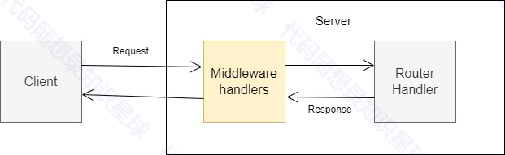

# 中间件模块

## 理论部分

### <font style="color:rgb(33, 37, 41);">一、什么是http中间件</font>

<font style="color:rgb(33, 37, 41);">HTTP 中间件是一种处理 HTTP 请求和响应的函数或组件，它在客户端请求到达服务器处理逻辑之前、或者服务器响应返回客户端之前执行。中间件通过提供一种模块化的方式来添加功能，使得 HTTP 服务器的架构更加灵活和可扩展。\ </font><font style="color:rgb(33, 37, 41);">常用的应用场景有：</font>

1. <font style="color:rgb(33, 37, 41);">客户端身份校验</font>
2. <font style="color:rgb(33, 37, 41);">用户鉴权</font>
3. <font style="color:rgb(33, 37, 41);">客户端对服务器提供的特定服务是否有访问权限</font>
4. <font style="color:rgb(33, 37, 41);">验证用户 session，并保持通信存活</font>
5. <font style="color:rgb(33, 37, 41);">客户端请求参数解密</font>
6. <font style="color:rgb(33, 37, 41);">客户端参数格式化</font>
7. <font style="color:rgb(33, 37, 41);">日志记录器，用于记录每个 REST API 访问请求</font>
8. <font style="color:rgb(33, 37, 41);">跨域配置</font>
9. <font style="color:rgb(33, 37, 41);">返回数据格式化</font>
10. <font style="color:rgb(33, 37, 41);">Header设置</font>

### <font style="color:rgb(33, 37, 41);">为什么叫 "中间件"？</font>

<font style="color:rgb(33, 37, 41);">"中间件" 一词表明它在客户端与服务器之间起着中间处理的作用。客户端发送请求时，请求流过多个中间件处理函数，最终到达实际的路由处理逻辑；服务器生成响应时，响应也会经过中间件处理后再返回给客户端。它们处于数据流的 "中间"，因此得名。</font>



### <font style="color:rgb(33, 37, 41);">中间件的作用</font>

* **请求预处理**<font style="color:rgb(33, 37, 41);">：解析请求体、处理认证和授权。</font>
* **响应格式化**<font style="color:rgb(33, 37, 41);">：修改或格式化服务器的响应数据。</font>
* **日志记录**<font style="color:rgb(33, 37, 41);">：记录请求和响应的信息以便于调试和监控。</font>
* **错误处理**<font style="color:rgb(33, 37, 41);">：捕获并处理服务器运行中的异常。</font>

### <font style="color:rgb(33, 37, 41);">常见的 HTTP 中间件例子</font>

#### <font style="color:rgb(33, 37, 41);">1. Express.js（Node.js 中的 HTTP 框架）</font>

* **body-parser**<font style="color:rgb(33, 37, 41);">: 解析 JSON、URL 编码和其他格式的请求体。</font>
* **morgan**<font style="color:rgb(33, 37, 41);">: 记录 HTTP 请求的日志。</font>
* **cors**<font style="color:rgb(33, 37, 41);">: 处理跨域资源共享（CORS）问题。</font>

#### <font style="color:rgb(33, 37, 41);">2. Django（Python Web 框架）</font>

* **AuthenticationMiddleware**<font style="color:rgb(33, 37, 41);">: 处理用户认证。</font>
* **CsrfViewMiddleware**<font style="color:rgb(33, 37, 41);">: 提供 CSRF 保护。</font>
* **GZipMiddleware**<font style="color:rgb(33, 37, 41);">: 对响应进行 GZip 压缩。</font>

#### <font style="color:rgb(33, 37, 41);">3. ASP.NET Core</font>

* **Routing Middleware**<font style="color:rgb(33, 37, 41);">: 控制请求的路由。</font>
* **Authentication Middleware**<font style="color:rgb(33, 37, 41);">: 验证用户身份。</font>
* **Static File Middleware**<font style="color:rgb(33, 37, 41);">: 提供对静态文件的访问。</font>

### <font style="color:rgb(33, 37, 41);">中间件的实现原理</font>

<font style="color:rgb(33, 37, 41);">中间件通常实现一个特定的接口，用来接收请求、响应对象以及一个 </font><code><font style="color:rgb(33, 37, 41);">next</font></code><font style="color:rgb(33, 37, 41);"> 回调函数。</font>

<font style="color:rgb(33, 37, 41);">示例（基于 Express.js）：</font>

```javascript
function myMiddleware(req, res, next) {
  console.log('处理中间件逻辑');
  next(); // 调用 next() 以将控制权交给下一个中间件
}
```

<font style="color:rgb(33, 37, 41);">每个中间件可以选择处理请求、修改请求或响应，甚至终止请求-响应循环，而无需调用 </font><code><font style="color:rgb(33, 37, 41);">next()</font></code><font style="color:rgb(33, 37, 41);">。</font>

### <font style="color:rgb(33, 37, 41);">中间件的优势</font>

* **模块化**<font style="color:rgb(33, 37, 41);">：可以将复杂的功能拆分为多个独立的中间件。</font>
* **复用性**<font style="color:rgb(33, 37, 41);">：通用功能（如身份验证、日志记录）可以作为独立的中间件在多个项目中复用。</font>
* **可扩展性**<font style="color:rgb(33, 37, 41);">：易于向应用程序添加新功能。</font>

## <font style="color:rgb(33, 37, 41);">结论</font>

<font style="color:rgb(33, 37, 41);">HTTP 中间件是现代 Web 应用程序中不可或缺的组成部分，它简化了请求处理链条，使得 Web 服务器具备更好的扩展能力和模块化设计。通过中间件，开发者能够更加灵活地控制应用的行为和特性。</font>

## <font style="color:rgb(33, 37, 41);">代码实现</font>

这里以跨域中间件为例来介绍中间件的完整实现流程。这里先介绍跨域中间件的相关知识

#### 什么是跨域？跨域中间件的作用是什么？

跨域就是当前主机访问的服务器不在本地而是去访问别域名的服务器。跨域中间件的作用就是给服务器设置，哪些域名的客户端可以访问服务器（一般是\*也就是所有客户端都可以访问）、哪些方法可以跨域请求、包含什么样的头文件可以跨域

#### 1.中间件基类接口 (Middleware.h)

```cpp
class Middleware {
public:
    virtual ~Middleware() = default;
    
    // 请求前处理
    virtual void before(HttpRequest& request) = 0;
    
    // 响应后处理
    virtual void after(HttpResponse& response) = 0;
    
    // 设置下一个中间件
    void setNext(std::shared_ptr<Middleware> next) {
        nextMiddleware = next;
    }

protected:
    std::shared_ptr<Middleware> nextMiddleware;
};
```

#### 2. 中间件链管理 (MiddlewareChain.h)

```cpp
class MiddlewareChain {
public:
    void addMiddleware(std::shared_ptr<Middleware> middleware);
    void processBefore(HttpRequest& request);
    void processAfter(HttpResponse& response);

private:
    std::vector<std::shared_ptr<Middleware>> middlewares;
};
```

#### 3. CORS配置类 (CorsConfig.h)

```cpp
struct CorsConfig {
    std::vector<std::string> allowedOrigins;
    std::vector<std::string> allowedMethods;
    std::vector<std::string> allowedHeaders;
    bool allowCredentials = false;
    int maxAge = 3600;
    
    static CorsConfig defaultConfig() {
        CorsConfig config;
        config.allowedOrigins = {"*"};
        config.allowedMethods = {"GET", "POST", "PUT", "DELETE", "OPTIONS"};
        config.allowedHeaders = {"Content-Type", "Authorization"};
        return config;
    }
};
```

#### 4. CORS中间件实现 (CorsMiddleware.h)

```cpp
class CorsMiddleware : public Middleware 
{
public:
    explicit CorsMiddleware(const CorsConfig& config = CorsConfig::defaultConfig());
    
    void before(HttpRequest& request) override;
    void after(HttpResponse& response) override;

    std::string join(const std::vector<std::string>& strings, const std::string& delimiter);

private:
    CorsConfig config_;
    const HttpRequest* request_; // 添加请求引用成员
    
    bool isOriginAllowed(const std::string& origin) const;
    void handlePreflightRequest(const HttpRequest& request, HttpResponse& response);
    void addCorsHeaders(HttpResponse& response, const std::string& origin);
};
```

#### 5. CORS中间件实现 (CorsMiddleware.cpp)

```cpp
CorsMiddleware::CorsMiddleware(const CorsConfig& config) : config_(config) {}

void CorsMiddleware::before(HttpRequest& request) {
    request_ = &request;
    if (request.method() == HttpRequest::Method::kOptions) {
        HttpResponse response;
        handlePreflightRequest(request, response);
        throw response; // 抛出响应（CORS预检请求），告诉HttpServer不需要再处理请求
    }
}

void CorsMiddleware::after(HttpResponse& response) {
    const std::string& origin = request_->getHeader("Origin");
    if (!origin.empty() && isOriginAllowed(origin)) {
        addCorsHeaders(response, origin);
    }
}

bool CorsMiddleware::isOriginAllowed(const std::string& origin) const {
    if (config_.allowedOrigins.empty() || 
        std::find(config_.allowedOrigins.begin(), config_.allowedOrigins.end(), "*") != config_.allowedOrigins.end()) {
        return true;
    }
    return std::find(config_.allowedOrigins.begin(), config_.allowedOrigins.end(), origin) != config_.allowedOrigins.end();
}

void CorsMiddleware::handlePreflightRequest(const HttpRequest& request, HttpResponse& response) {
    const std::string& origin = request.getHeader("Origin");
    if (!isOriginAllowed(origin)) 
    {   // 如果请求源不允许，返回403 Forbidden
        response.setStatusCode(HttpResponse::k403Forbidden);
        return;
    }

    addCorsHeaders(response, origin);
    response.setStatusCode(HttpResponse::k204NoContent);
}

void CorsMiddleware::addCorsHeaders(HttpResponse& response, const std::string& origin) {
    // 设置允许的源
    response.addHeader("Access-Control-Allow-Origin", origin);
    
    // 设置允许的凭证
    if (config_.allowCredentials) {
        response.addHeader("Access-Control-Allow-Credentials", "true");
    }
    
    // 设置允许的方法
    if (!config_.allowedMethods.empty()) {
        std::ostringstream methods;
        for (size_t i = 0; i < config_.allowedMethods.size(); ++i) {
            if (i > 0) methods << ", ";
            methods << config_.allowedMethods[i];
        }
        response.addHeader("Access-Control-Allow-Methods", methods.str());
    }
    
    // 设置允许的头部
    if (!config_.allowedHeaders.empty()) {
        std::ostringstream headers;
        for (size_t i = 0; i < config_.allowedHeaders.size(); ++i) {
            if (i > 0) headers << ", ";
            headers << config_.allowedHeaders[i];
        }
        response.addHeader("Access-Control-Allow-Headers", headers.str());
    }
    
    // 设置预检请求的有效期
    response.addHeader("Access-Control-Max-Age", std::to_string(config_.maxAge));
}

// 工具函数：将字符串数组连接成单个字符串
std::string CorsMiddleware::join(const std::vector<std::string>& strings, const std::string& delimiter) {
    std::ostringstream result;
    for (size_t i = 0; i < strings.size(); ++i) {
        if (i > 0) result << delimiter;
        result << strings[i];
    }
    return result.str();
}
```

#### 项目中如何在项目中使用跨域中间件？

1.修改 HttpServer.h

```cpp
#include "middleware/MiddlewareChain.h"
#include "middleware/cors/CorsMiddleware.h"

class HttpServer {
private:
    middleware::MiddlewareChain middlewareChain_;
    
public:
    // 添加中间件的方法
    void addMiddleware(std::shared_ptr<middleware::Middleware> middleware) {
        middlewareChain_.addMiddleware(middleware);
    }
    
    // 其他现有代码...
};
```

2.在 HttpServer 的请求处理流程中使用中间件

```cpp
void HttpServer::handleRequest(HttpRequest& request, HttpResponse& response) {
    try {
        // 处理请求前的中间件
        middlewareChain_.processBefore(request);
        
        // 原有的路由处理逻辑
        // ...
        
        // 处理响应后的中间件
        middlewareChain_.processAfter(response);
    }
    catch (const HttpResponse& res) {
        // 处理中间件抛出的响应（如CORS预检请求）
        response = res;
    }
    catch (const std::exception& e) {
        // 错误处理
        response.setStatus(HttpResponse::k500InternalServerError);
        response.setBody(e.what());
    }
}
```

3.使用示例

```cpp
int main() {
    HttpServer server;
    
    // 创建CORS配置
    http::middleware::CorsConfig corsConfig;
    corsConfig.allowedOrigins = {"http://localhost:3000"};
    corsConfig.allowedMethods = {"GET", "POST", "PUT", "DELETE", "OPTIONS"};
    corsConfig.allowedHeaders = {"Content-Type", "Authorization"};
    corsConfig.allowCredentials = true;
    corsConfig.maxAge = 3600;
    
    // 添加CORS中间件
    auto corsMiddleware = std::make_shared<http::middleware::CorsMiddleware>(corsConfig);
    server.addMiddleware(corsMiddleware);
    
    // 添加路由
    server.get("/api/users", [](HttpRequest& req, HttpResponse& res) {
        // 处理请求...
    });
    
    server.start(8080);
    return 0;
}
```


> 更新: 2025-01-10 19:06:50  
> 原文: <https://www.yuque.com/chengxuyuancarl/imh9xc/uykqx710gggbu767>