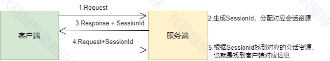

# 会话管理模块

## 理论部分

部分参考：<https://blog.csdn.net/qq_44627608/article/details/106277191>

### 为什么要进行会话管理

* HTTP基于请求/响应模式
  * 所有请求都是相互独立的，无连续性的
* HTTP是无连接的协议（短连接）
  * 限制每次连接只处理一个请求（短连接）
* HTTP是无状态协议
  * 协议对于事务处理没有记忆能力

### 会话管理的产生

* 对于简单的页面浏览或信息获取，HTTP协议即可胜任
  * 浏览资讯
  * 查看在线图书目录
* 对于需要客户端和服务端多次交互的网络应用，则必须记住客户端的状态
  * 网上的购物车
  * 用户登录

### 会话管理概念

会话就是一个客户端连续不断地和服务端进行请求/响应的一系列交互，多次请求间建立关联的方式称为会话管理，或会话跟踪

* 会话状态，指服务器与浏览器在会话过程中产生的状态信息

### 会话的实现过程

HTTP没有提供任何记住客户端的途径，服务器如何建立、维护与客户端的会话



当服务端接收到客户端的首次请求时，服务器初始化一个会话并分配给该会话一个唯一标识符(sessionId)，在以后的请求中，客户端必须将唯一标识符包含在请求中，服务器根据此表示符将请求与对应的会话联系起来。

### 使用会话的主要场景：

##### 用户认证：

* 登录时创建会话并存储用户信息
* 在需要认证的接口中检查会话状态
* 登出时清除会话

##### 用户状态维护：

* 存储用户偏好设置
* 保存游戏状态
* 维护购物车信息

##### 访问控制：

* 检查用户权限
* 限制访问特定资源
* 实现角色基础的访问控制

通过这种方式，你可以在整个应用程序中维护用户状态，实现用户认证和授权功能。会话管理使得在无状态的 HTTP 协议上实现有状态的用户交互成为可能。

## 代码解析

代码参考：[GitHub - youngyangyang04/KamaServer: 【代码随想录知识星球】项目分享-webserver（CPP）](https://github.com/youngyangyang04/KamaServer/tree/main)

该会话管理系统旨在处理Web应用程序中的用户会话。它提供创建、管理和销毁会话的功能，并存储会话数据。系统由几个关键组件组成：

* Session（会话）：表示一个用户会话。
* SessionManager（会话管理器）：管理会话的生命周期。
* SessionStorage（会话存储）：会话存储实现的抽象类。
* MemorySessionStorage（内存会话存储）：SessionStorage的内存实现。

### Session（会话）

Session类表示一个用户会话。它保存会话数据并管理会话过期。

* 构造函数：使用唯一ID、SessionManager的引用和可选的过期时间（默认1小时）初始化会话。
* getId()：返回会话ID。
* isExpired()：检查会话是否已过期。
* refresh()：重置会话的过期时间。
* setValue()：在会话数据中存储键值对。
* getValue()：从会话数据中按键检索值。
* remove()：从会话数据中移除键值对。
* clear()：清空所有会话数据。

### SessionManager（会话管理器）

SessionManager类负责创建、检索和销毁会话。它还处理会话存储。

* 构造函数：使用SessionStorage实现和用于会话ID创建的随机数生成器初始化会话管理器。
* getSession()：从请求中检索现有会话或创建新会话。
* destroySession()：从存储中移除会话。
* cleanExpiredSessions()：用于清理过期会话（实现依赖于存储类型）。
* updateSession()：将会话保存到存储中。
* generateSessionId()：生成唯一的会话ID。
* getSessionIdFromCookie()：从请求的Cookie中提取会话ID。
* setSessionCookie()：在响应中设置会话ID作为Cookie。

### SessionStorage（会话存储）

定义会话存储接口的抽象类。

* save()：保存会话。
* load()：通过ID加载会话。
* remove()：通过ID移除会话。

### MemorySessionStorage（内存会话存储）

SessionStorage的内存实现。

* save()：在内存中存储会话。
* load()：从内存中检索会话，并检查是否过期。
* remove()：从内存中删除会话。

### 设计原理

* 关注点分离：系统将会话管理（`SessionManager`）与会话存储（`SessionStorage`）分开。这允许存储实现的灵活性（例如，内存、数据库，会话数据可以存在内存中也可以存在数据库中）。
* 自动过期：会话根据可配置的超时时间自动过期，通过限制会话寿命增强安全性。
* 自动持久化：如果关联了`SessionManager`，会话数据的更改会自动保存，确保数据一致性。
* 随机会话ID：会话ID使用随机数生成器生成，以确保唯一性和安全性。

### 会话使用案例

在 HTTP 框架中使用会话管理，主要在路由处理器（`Handler`）中使用。我将通过几个在项目中的具体例子来说明如何使用会话管理功能。

#### 1. 在 HttpServer 类中添加 SessionManager

首先，需要在 HttpServer 类中添加 `SessionManager`：

```cpp
class HttpServer {
public:
    // ... 其他代码 ...
    void setSessionManager(std::unique_ptr<SessionManager> sessionManager) {
        sessionManager_ = std::move(sessionManager);
    }

    SessionManager* getSessionManager() { return sessionManager_.get(); }

private:
    std::unique_ptr<SessionManager> sessionManager_;
    // ... 其他成员 ...
};
```

#### 2. 在处理器中使用会话

以登录处理器为例，展示如何使用会话：

```cpp
#include "../include/handlers/LoginHandler.h"

void LoginHandler::handle(const HttpRequest& req, HttpResponse* resp) {
    try {
        // 解析请求体
        json request = json::parse(req.getBody());
        std::string username = request["username"].get<std::string>();
        std::string password = request["password"].get<std::string>();

        // 验证用户
        int userId = server_->queryUserId(username, password);
        if (userId != -1) {
            // 获取会话
            auto session = server_->getSessionManager()->getSession(req, resp);
            
            // 在会话中存储用户信息
            session->setValue("userId", std::to_string(userId));
            session->setValue("username", username);
            session->setValue("isLoggedIn", "true");

            // 返回成功响应
            json successResp;
            successResp["status"] = "ok";
            successResp["message"] = "login successful";
            successResp["userId"] = userId;
            std::string successBody = successResp.dump(4);
            
            server_->packageResp(req.getVersion(), HttpResponse::k200Ok, "OK", 
                               false, "application/json", successBody.size(), 
                               successBody, resp);
        } else {
            // ... 处理登录失败 ...
        }
    } catch (const std::exception& e) {
        // ... 错误处理 ...
    }
}
```

#### 3. 创建需要身份验证的处理器

```cpp
class GameHandler : public RouterHandler {
public:
    void handle(const HttpRequest& req, HttpResponse* resp) override {
        // 检查用户是否已登录
        auto session = server_->getSessionManager()->getSession(req, resp);
        
        if (session->getValue("isLoggedIn") != "true") {
            // 用户未登录，返回未授权错误
            json errorResp;
            errorResp["status"] = "error";
            errorResp["message"] = "Unauthorized";
            std::string errorBody = errorResp.dump(4);
            
            server_->packageResp(req.getVersion(), HttpResponse::k401Unauthorized,
                               "Unauthorized", false, "application/json",
                               errorBody.size(), errorBody, resp);
            return;
        }

        // 获取用户信息
        std::string userId = session->getValue("userId");
        std::string username = session->getValue("username");

        // 处理游戏逻辑
        // ...
    }
};
```

#### 4. 登出处理器示例

```cpp
void LogoutHandler::handle(const HttpRequest& req, HttpResponse* resp) {
    // 获取会话
    auto session = server_->getSessionManager()->getSession(req, resp);
    
    // 清除会话数据
    session->clear();
    
    // 销毁会话
    server_->getSessionManager()->destroySession(session->getId());

    // 返回成功响应
    json successResp;
    successResp["status"] = "ok";
    successResp["message"] = "logout successful";
    std::string successBody = successResp.dump(4);
    
    server_->packageResp(req.getVersion(), HttpResponse::k200Ok, "OK",
                        false, "application/json", successBody.size(),
                        successBody, resp);
}
```

#### 5. 在服务器初始化时设置会话管理器

```cpp
void GomokuServer::initialize() {
    // 创建会话存储
    auto sessionStorage = std::make_unique<MemorySessionStorage>();
    
    // 创建会话管理器
    auto sessionManager = std::make_unique<SessionManager>(std::move(sessionStorage));
    
    // 设置会话管理器
    setSessionManager(std::move(sessionManager));

    // 初始化路由
    initializeRouter();
}
```


> 更新: 2025-01-20 14:44:31  
> 原文: <https://www.yuque.com/chengxuyuancarl/imh9xc/zdui8tc6y3217hob>