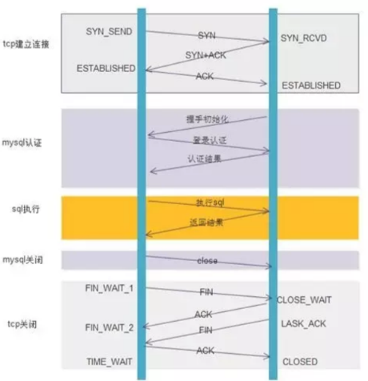

# 集成数据库连接池模块

## 理论介绍、

引用文章链接：<https://blog.csdn.net/CrankZ/article/details/82874158>

### 如何提高MYSQL(基于C/S设计)数据库的访问瓶颈?

1. 数据库就可以看成是一个磁盘，将数据都存储在磁盘上，当有热点数据时，我们就需要在磁盘上频繁的进行I/O操作，为了避免磁盘频繁的I/O，我们可以在服务器添加缓存服务器缓存常用数据(redis或者memory cache他们存储数据的方式通常是键值对，而mysql存储数据的方式是二维表).
2. 服务器应用与数据库之间的关系是客户端与服务器之间的关系，还可以增加连接池，来提高MYSQL Server的访问效率，再高并发情况下，大量的tcp三次握手，MYSQL Server连接认证，MYSQL Server关闭连接回收资源和TCP四次回收所耗费的性能时间也是非常明显的，增加连接池就是为了减少这一部分性能的损耗

### 什么是连接池

数据库连接池负责分配、管理和释放数据库连接，它允许应用程序重复使用一个现有的数据库连接，而不是再重新建立一个。

### 为什么要使用连接池

数据库连接是一种关键的有限的昂贵的资源，这一点在多用户的网页应用程序中体现得尤为突出。  一个数据库连接对象均对应一个物理数据库连接，每次操作都打开一个物理连接，使用完都关闭连接，这样造成系统的 性能低下。

数据库连接池的解决方案是在应用程序启动时建立足够的数据库连接，并将这些连接组成一个连接池(简单说：在一个“池”里放了好一定数量的已经建立完成的连接，是现成可直接使用的连接)，由应用程序动态地对池中的连接进行从向池中申请、使用和使用完后放回池中。对于多于连接池中连接数的并发请求，应该在请求队列中排队等待。并且应用程序可以根据池中连接的使用率，动态增加或减少池中的连接数。 连接池技术尽可能多地重用了消耗内存地资源，大大节省了内存，提高了服务器地服务效率，能够支持更多的客户服务。通过使用连接池，将大大提高程序运行效率，同时，我们可以通过其自身的管理机制来监视数据库连接的数量、使用情况等。

### 传统的连接机制与数据库连接池的运行机制区别

<font style="color:rgb(77, 77, 77);">下面以访问</font><font style="color:rgb(78, 161, 219) !important;">MySQL</font><font style="color:rgb(77, 77, 77);">为例，执行一个SQL命令，需要经过哪些流程。</font>

执行一条SQL语句的完整流程就是：

1. TCP三次握手建立连接
2. MYSQL连接认证并分配相应资源
3. 执行SQL语句
4. MYSQL连接关闭并回收相应资源
5. TCP的四次回收关闭连接

#### 是否使用连接池的区别

不使用连接池：不使用连接池的话那么我们每次使用连接执行sql语句都会面临上面的执行过程。可以看到为了执行一条SQL语句，需要进行繁琐的建立连接和释放连接的过程，在高并发的执行sql语句的情况下，执行效率一定会大大降低，响应速度也会随之变得迟钝。

使用连接池：使用连接池的话，只会在程序启动连接池初始化的时候将执行连接建立的操作，在程序退出的时候执行连接销毁的操作。在程序运行的过程中需要执行数据库操作时，可以直接从连接池中取出现成的连接使用，使用完毕(执行完sql语句)后再将连接放回连接池即可。

#### 使用连接池后的优点

1. <font style="color:rgb(51, 51, 51);">较少了网络开销</font>
2. <font style="color:rgb(51, 51, 51);">系统的性能会有一个实质的提升</font>
3. <font style="color:rgb(51, 51, 51);">没了麻烦的TIME\_WAIT状态</font>

<font style="color:rgb(51, 51, 51);"></font>

### <font style="color:rgb(51, 51, 51);">数据库连接池的工作原理</font>

<font style="color:rgb(51, 51, 51);">连接池的工作原理主要由三部分组成，分别为</font>

* <font style="color:rgb(51, 51, 51);">连接池的建立</font>
* <font style="color:rgb(51, 51, 51);">连接池中连接的使用管理</font>
* <font style="color:rgb(51, 51, 51);">连接池的关闭</font>

<font style="color:rgb(51, 51, 51);">        第一、连接池的建立。一般在系统初始化时，连接池会根据系统配置建立，并在池中创建了几个连接对象，以便使用时能从连接池中获取。连接池中的连接不能随意创建和关闭，这样避免了连接随意建立和关闭造成的系统开销。C++中提供了很多容器类可以方便的构建连接池，例如vector、queue等。</font>

<font style="color:rgb(51, 51, 51);">        第二、连接池的管理。连接池管理策略是连接池机制的核心，连接池内连接的分配和释放对系统的性能有很大的影响。其管理策略是：</font>

<font style="color:rgb(51, 51, 51);">        当客户请求数据库连接时，首先查看连接池中是否有空闲连接，如果存在空闲连接，则将连接分配给客户使用；如果没有空闲连接，则查看当前所开的连接数是否已经达到最大连接数，如果没达到就重新创建一个连接给请求的客户；如果达到就按设定的最大等待时间进行等待，如果超出最大等待时间，则抛出异常给客户。</font>

<font style="color:rgb(51, 51, 51);">  当用户使用连接完毕之后，就将连接重新放回数据库连接池容器之中。</font>

<font style="color:rgb(51, 51, 51);">        该策略保证了数据库连接的有效复用，避免频繁的建立、释放连接所带来的系统资源开销。</font>

<font style="color:rgb(51, 51, 51);">        第三、连接池的关闭。当应用程序退出时，关闭连接池中所有的连接，释放连接池相关的资源，该过程正好与创建相反。</font>

## <font style="color:rgb(51, 51, 51);">代码实现</font>

### 基础架构设计

该项目连接池主要包含三个核心类：

* DbConnection: 管理单个数据库连接
* DbConnectionPool: 管理连接池
* MysqlUtil: 提供便捷的数据库操作接口

#### DbConnection

DbConnection 类负责管理与 MySQL 数据库的单个连接。它提供了执行查询、更新、连接检查和重连等功能。通过使用 C++ 的 RAII（资源获取即初始化）和智能指针，确保资源的安全管理和异常处理。

##### 类定义

```cpp
class DbConnection {
public:
    DbConnection(const std::string& host,
                const std::string& user,
                const std::string& password,
                const std::string& database);
    
    template<typename... Args>
    sql::ResultSet* executeQuery(const std::string& sql, Args&&... args);
    
    template<typename... Args>
    int executeUpdate(const std::string& sql, Args&&... args);
    
    bool ping();
    void reconnect();
    void cleanup();

private:
    std::shared_ptr<sql::Connection> conn_;
    std::mutex mutex_;
    std::string host_;
    std::string user_;
    std::string password_;
    std::string database_;
    
    void bindParams(sql::PreparedStatement*, int);
    
    template<typename T, typename... Args>
    void bindParams(sql::PreparedStatement* stmt, int index, 
                   T&& value, Args&&... args);
};
```

下面我将介绍一下该类的关键功能

##### 构造函数

功能：初始化数据库连接。

```cpp
DbConnection::DbConnection(const std::string& host,
                           const std::string& user,
                           const std::string& password,
                           const std::string& database)
    : host_(host), user_(user), password_(password), database_(database) {
    try {
        sql::mysql::MySQL_Driver* driver = sql::mysql::get_mysql_driver_instance();
        conn_.reset(driver->connect(host_, user_, password_));
        conn_->setSchema(database_);
    } catch (const sql::SQLException& e) {
        throw DbException(e.what());
    }
}
```

##### 执行查询

功能：执行SQL查询并返回结果集

线程安全: 使用 std::lock\_guard 保护共享资源。

预编译和执行SQL查询： 使用 `PreparedStatement` 代替拼接 SQL 字符串，提供了动态参数绑定的能力，从而实现灵活的查询和防止 SQL 注入攻击。

安全高效的参数绑定：`bindParams` 使用 `std::forward` 保留参数类型，避免不必要的拷贝，提高了效率。预编译语句也能加快重复执行相同语句的速度。

```cpp
template<typename... Args>
sql::ResultSet* DbConnection::executeQuery(const std::string& sql, Args&&... args) {
    std::lock_guard<std::mutex> lock(mutex_);
    try {
        std::unique_ptr<sql::PreparedStatement> stmt(
            conn_->prepareStatement(sql)
        );
        bindParams(stmt.get(), 1, std::forward<Args>(args)...);
        return stmt->executeQuery();
    } catch (const sql::SQLException& e) {
        throw DbException(e.what());
    }
}
```

##### 执行更新

功能: 执行 SQL 更新操作。

返回值: 返回受影响的行数。

```cpp
template<typename... Args>
int DbConnection::executeUpdate(const std::string& sql, Args&&... args) {
    std::lock_guard<std::mutex> lock(mutex_);
    try {
        std::unique_ptr<sql::PreparedStatement> stmt(
            conn_->prepareStatement(sql)
        );
        bindParams(stmt.get(), 1, std::forward<Args>(args)...);
        return stmt->executeUpdate();
    } catch (const sql::SQLException& e) {
        throw DbException(e.what());
    }
}
```

##### 连接检查

功能: 检查连接是否有效。

返回值: 返回 true 表示连接有效。

这里ping是为了让连接池的连接保持活性，如果发现连接池中的连接断开了需要及时reconnect()进行重连

```cpp
bool DbConnection::ping() {
    try {
        std::unique_ptr<sql::Statement> stmt(conn_->createStatement());
        stmt->execute("SELECT 1");
        return true;
    } catch (const sql::SQLException& e) {
        return false;
    }
}
```

##### 重新连接

功能: 重新建立数据库连接。

```cpp
void DbConnection::reconnect() {
    std::lock_guard<std::mutex> lock(mutex_);
    try {
        if (conn_) {
            conn_->reconnect();
        } else {
            sql::mysql::MySQL_Driver* driver = sql::mysql::get_mysql_driver_instance();
            conn_.reset(driver->connect(host_, user_, password_));
            conn_->setSchema(database_);
        }
    } catch (const sql::SQLException& e) {
        throw DbException(e.what());
    }
}
```

#### DbConnectionPool

DbConnectionPool 是一个用于管理数据库连接的类，旨在提高数据库访问的效率和性能。通过复用连接，减少了频繁创建和销毁连接的开销。

核心功能如下：

##### 单例模式

连接池采用单例模式，确保全局只有一个连接池实例。

```cpp
class DbConnectionPool {
public:
    static DbConnectionPool& getInstance() {
        static DbConnectionPool instance;
        return instance;
    }
    // ...
};
```

##### 获取连接

getConnection 方法从连接池中获取一个可用的数据库连接。如果没有可用连接，则会等待。如果获取连接前未初始化会抛出异常。

获取到连接之后需要判断连接是否有效，如果失效则进行重连。

注意这里返回的智能指针的第二个参数是一个lambada表达式，代表重写std::shared\_ptr的析构函数（也就是重写智能指针的删除器函数）

```cpp
std::shared_ptr<DbConnection> getConnection() {
    std::unique_lock<std::mutex> lock(mutex_);
    
    while (connections_.empty()) {
        if (!initialized_) {
            throw DbException("Connection pool not initialized");
        }
        cv_.wait(lock);
    }
    
    auto conn = connections_.front();
    connections_.pop();
    
    lock.unlock();
    
    try {
        if (!conn->ping()) {
            conn->reconnect();
        }
        
        return std::shared_ptr<DbConnection>(conn.get(), 
            [this, conn](DbConnection*) {
                std::lock_guard<std::mutex> lock(mutex_);
                connections_.push(conn);
                cv_.notify_one();
            });
            
    } catch (const std::exception& e) {
        connections_.push(conn);
        cv_.notify_one();
        throw;
    }
}
```

##### 连接检查

checkConnections 方法定期检查连接池中的连接是否有效，并尝试重连失效的连接（由连接池初始化时连接池新开一个线程来执行）。

```cpp
void checkConnections() {
    while (true) {
        try {
            std::vector<std::shared_ptr<DbConnection>> connsToCheck;
            {
                std::unique_lock<std::mutex> lock(mutex_);
                if (connections_.empty()) {
                    std::this_thread::sleep_for(std::chrono::seconds(1));
                    continue;
                }
                
                auto temp = connections_;
                while (!temp.empty()) {
                    connsToCheck.push_back(temp.front());
                    temp.pop();
                }
            }
            
            for (auto& conn : connsToCheck) {
                if (!conn->ping()) {
                    try {
                        conn->reconnect();
                    } catch (const std::exception& e) {
                        LOG_ERROR << "Failed to reconnect: " << e.what();
                    }
                }
            }
            
            std::this_thread::sleep_for(std::chrono::seconds(60));
        } catch (const std::exception& e) {
            LOG_ERROR << "Error in check thread: " << e.what();
            std::this_thread::sleep_for(std::chrono::seconds(5));
        }
    }
}
```

#### MysqlUtil

MysqlUtil 是一个便捷的工具类，提供了对数据库的简单接口，隐藏了底层连接池的复杂性。它通过静态方法提供数据库的初始化、查询和更新操作，适合在应用程序中快速集成和使用。

主要是实现了三个方法，一个就是数据库连接池的初始化，其次就是从连接池中获取连接执行查询操作和执行（增删改）操作。主要作用就是为了简化接口，让业务层能够更轻松地使用连接池进行增删改查的工作。

```cpp
class MysqlUtil
{
public:
    static void init(const std::string& host, const std::string& user,
                    const std::string& password, const std::string& database,
                    size_t poolSize = 10)
    {
        http::db::DbConnectionPool::getInstance().init(
            host, user, password, database, poolSize);
    }

    template<typename... Args>
    sql::ResultSet* executeQuery(const std::string& sql, Args&&... args)
    {
        auto conn = http::db::DbConnectionPool::getInstance().getConnection();
        return conn->executeQuery(sql, std::forward<Args>(args)...);
    }

    template<typename... Args>
    int executeUpdate(const std::string& sql, Args&&... args)
    {
        auto conn = http::db::DbConnectionPool::getInstance().getConnection();
        return conn->executeUpdate(sql, std::forward<Args>(args)...);
    }
};
```


> 更新: 2025-01-15 19:55:34  
> 原文: <https://www.yuque.com/chengxuyuancarl/imh9xc/uu8ekvcsivhcrbgo>