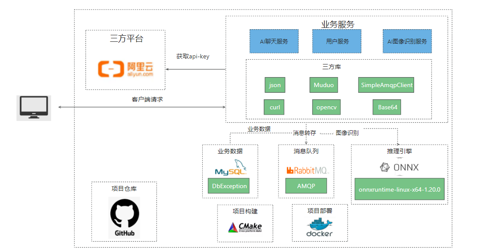
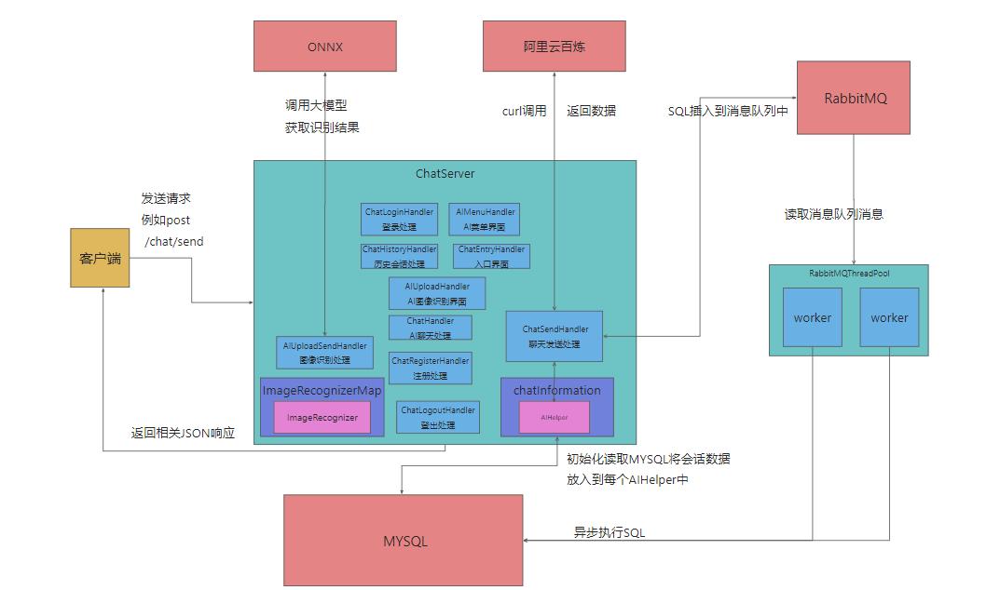
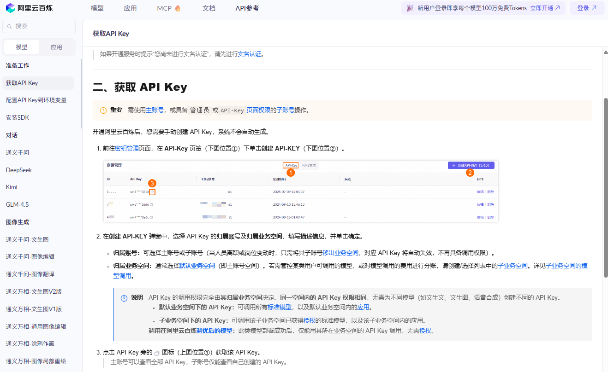
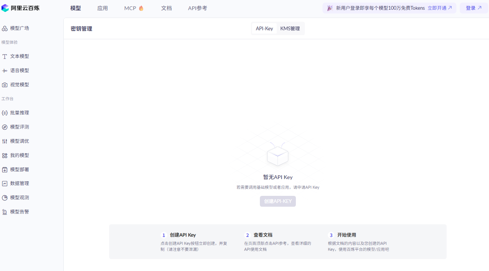
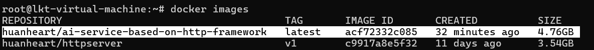
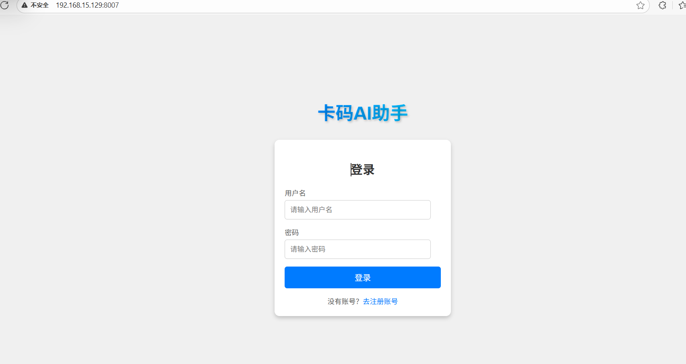

# 9. AI应用服务平台第一版【升级】

本应用层，针对有基础经验的人可以几个小时就将该应用层看完，针对无基础也可以做到7天之内看完

建议大家在看这篇文章的时候，先去看一下框架应用之卡玛五子棋这篇文章，有了框架应用之卡玛五子棋的基础之后，再去学习这篇文章对应的AL框架应用会好很多

大家都看到这里了，应该底层的http框架已经看完了，该应用层功能不算多，但也可以学到一些东西的，而且本身应用层+底层HTTP服务框架部分其实整个项目规模也不算小了。

# 仓库地址与说明:

仓库地址：<https://github.com/youngyangyang04/CppAIService>

现在仓库中的代码已更新为第二版AI应用服务平台了，但是我们可以在拉取项目后通过git命令回退版本来查看第一版的代码。这样也方便对比第一版和第二版之间的不同逻辑。

当然第二版出了也可以直接看第二版的代码，不过还是需要结合第一版文章的说明来看，因为第二版的说明不会包含第一版的文章讲解

那么如何回退呢？

进入到项目中通过如下指令，就会切换到第一版的代码了

```cpp
git checkout dc03a42 
```

若要继续恢复为第二版的代码，则使用如下指令

```cpp
git checkout 6eebccf
```

# AIApps目录结构与文件说明:

```cpp
AIApps     
`-- ChatServer
    |-- include
    |   |-- AIUtil
    |   |   |-- AIHelper.h    		//内部封装curl去访问对阿里的模型
    |   |   |-- ImageRecognizer.h   //内部封装openncv等接口进行图像识别操作
    |   |   |-- MQManager.h  		//封装消息队列有关的线程池（消费者生产者相关函数)
    |   |   `-- base64.h     		//三方库，用于解码前端传进来的图片base64数据
    |   |-- ChatServer.h     		//包装多个业务相关的映射表
    |   `-- handlers
    |       |-- AIMenuHandler.h      		//有关菜单页面
    |       |-- AIUploadHandler.h           //有关图像识别页面
    |       |-- AIUploadSendHandler.h       //有关图像识别业务
    |       |-- ChatEntryHandler.h			//有关登录界面
    |       |-- ChatHandler.h				//有关AI聊天界面
    |       |-- ChatHistoryHandler.h		//有关AI聊天界面的同步历史数据业务
    |       |-- ChatLoginHandler.h			//有关登录界面登录业务
    |       |-- ChatLogoutHandler.h			//有关菜单界面登出业务
    |       |-- ChatRegisterHandler.h		//有关注册界面注册业务
    |       `-- ChatSendHandler.h			//有关AI聊天界面的聊天业务
    |-- resource
    |   |-- AI.html							//AI聊天前端页面
    |   |-- NotFound.html					//鉴权失败返回的前端页面
    |   |-- entry.html						//登录前端页面
    |   |-- menu.html						//菜单前端页面	
    |   `-- upload.html						//图像识别页面
    `-- src
        |-- AIUtil
    |   |   |-- AIHelper.cpp    		//内部封装curl去访问对阿里的模型
    |   |   |-- ImageRecognizer.cpp   	//内部封装openncv等接口进行图像识别操作
    |   |   |-- MQManager.cpp  			//封装消息队列有关的线程池（消费者生产者相关函数)
    |   |   `-- base64.cpp     			//三方库，用于解码前端传进来的图片base64数据
    |   |-- ChatServer.cpp     			//包装多个业务相关的映射表
        |-- handlers
    |       |-- AIMenuHandler.cpp      		//有关菜单页面
    |       |-- AIUploadHandler.cpp         //有关图像识别页面
    |       |-- AIUploadSendHandler.cpp     //有关图像识别业务
    |       |-- ChatEntryHandler.cpp		//有关登录界面
    |       |-- ChatHandler.cpp				//有关AI聊天界面
    |       |-- ChatHistoryHandler.cpp		//有关AI聊天界面的同步历史数据业务
    |       |-- ChatLoginHandler.cpp		//有关登录界面登录业务
    |       |-- ChatLogoutHandler.cpp		//有关菜单界面登出业务
    |       |-- ChatRegisterHandler.cpp		//有关注册界面注册业务
    |       `-- ChatSendHandler.cpp			//有关AI聊天界面的聊天业务
        `-- main.cpp 						//用于线程池、服务初始化
```

# 0：系统设计:

## 技术架构图



### 1. 系统整体设计

本项目基于 **自研 HTTP 服务框架**，在其之上扩展了 **AI 聊天服务** 与 **AI 图像识别服务**。整体架构分为三层：

* **客户端层**：用户通过浏览器或前端页面发起请求（如登录、聊天、上传图片）。
* **应用服务层**：由自研 HTTP 框架承载，整合了 AI 对话服务、AI 图像识别服务、用户管理服务。
* **基础支撑层**：由数据库、消息队列、推理引擎及三方 API 组成，为应用层提供持久化、异步处理和模型推理能力。

在整体流程上，用户请求经过 HTTP 服务框架调度，调用对应的 **业务 Handler**，并通过消息队列、数据库、推理引擎完成 AI 聊天、图像识别等功能，再将结果返回到前端页面。

***

### 2. 技术架构解读

1. **业务服务层**
   * **AI 聊天服务**：通过 `cURL` 调用阿里云百炼 API，实现大语言模型对话。
   * **AI 图像识别服务**：基于 OpenCV + ONNX Runtime 部署轻量级模型，实现图片分类。
   * **用户服务**：负责登录、注册、登出、会话管理等功能。
2. **三方依赖库**
   * `json`：C++ JSON 解析
   * `curl`：HTTP 请求封装
   * `Muduo`：高性能网络库
   * `OpenCV`：图像预处理
   * `SimpleAmqpClient / Base64`：用于消息队列通信与图片数据解码
3. **基础支撑模块**
   * **MySQL**：存储用户信息、聊天记录、图像识别结果
   * **RabbitMQ**：提供异步消息队列，解耦高并发场景下的数据库写入
   * **ONNX Runtime**：执行模型推理，支持轻量化部署（如 MobileNetV2）
4. **项目构建与部署**
   * **CMake**：统一构建管理
   * **Docker**：提供一键化部署，集成 MySQL、RabbitMQ、OpenCV、ONNX 等环境

***

### 3. 学习与收获

通过学习本项目，你可以系统掌握以下技能：

* **AI 聊天服务集成**：在 C++ 框架中调用大模型 API，实现多轮对话与会话记忆。
* **AI 图像识别服务**：结合 OpenCV + ONNX Runtime，完成图像预处理与推理全流程。
* **高并发架构设计**：利用 Muduo + RabbitMQ + 线程池，提升系统在多用户场景下的并发处理能力。
* **工程化能力**：熟悉 Docker 部署、消息队列解耦、数据库异步写入等服务化开发经验。

## 整体流程：

初始化阶段会从MYSQL中读取内容到内存中

* 将所有用户的消息读取到内存中，即更新chatInformation哈希表

后续客户端请求某个接口，ChatServer中的各个Handler会做相应处理，期间会进行权限校验甚至可能会调用ONNX工具或者通过curl远程请求模型（百炼）

在Handler做处理的过程中，若是涉及到大模型对话相关业务，就会将消息表更新立刻同步到内存中，再放入到消息队列中，后续内部线程池中的工作线程会异步地读取消息队列的消息，并持久化到数据库中



整体流程实现了 **前端请求 → 服务端调度 → 消息队列削峰 → 模型推理 → 数据持久化 → 前端响应** 的闭环。下面逐步解读技术要点：

***

### 1. 客户端请求入口

用户通过浏览器或前端页面发起请求（如 `POST /chat/send` 或上传图片），请求以 **JSON 格式** 封装，提交到服务端 `ChatServer`。

* 优点：统一使用 JSON，避免底层 form-data 兼容性问题。
* 技术点：HTTP 框架自带 **路由与会话管理**，可直接将请求分发至对应 Handler（如 `ChatSendHandler`、`AIUploadSendHandler`）。

***

### 2. ChatServer 业务调度

`ChatServer` 是项目的核心调度模块，内部包含多类 **Handler**：

* **ChatSendHandler**：处理 AI 对话请求
* **AIUploadSendHandler**：处理图像识别请求
* **ChatLoginHandler / ChatRegisterHandler**：处理用户认证
* **ChatHistoryHandler**：恢复并同步历史消息

技术亮点：

* Handler 设计采用 **职责分离** 思路，每个业务独立封装，增强了系统扩展性。
* 会话信息集中存放在 `chatInformation`，通过智能指针管理，避免了频繁加锁操作的开销。

***

### 3. AI 能力调用

根据业务类型，系统调用不同的 AI 模块：

* **AI 聊天**：`AIHelper` 封装了 cURL 调用逻辑，请求阿里云百炼 API，返回上下文关联的回答。
* **图像识别**：`ImageRecognizer` 结合 **OpenCV** 做预处理（resize、归一化），再通过 **ONNX Runtime** 执行模型推理（MobileNetV2），输出分类结果。

技术亮点：

* **上下文记忆**：`AIHelper` 会把历史会话加载到内存，保证对话的连续性。
* **轻量推理**：使用 ONNX Runtime 部署模型，兼顾可移植性与性能。

***

### 4. 数据持久化与消息队列

所有用户消息与 AI 回答，在写入 MySQL 前，统一通过 **RabbitMQ 消息队列** 异步处理：

1. 生产者：`AIHelper` 将 SQL 插入语句推送至 RabbitMQ。
2. 消费者：`RabbitMQThreadPool` 多线程异步执行 SQL 写入。

技术亮点：

* **异步解耦**：避免了高并发下 MySQL 插入阻塞主线程。
* **削峰填谷**：请求量过大时，消息可先缓存在队列中，保证系统稳定性。
* **可靠性**：RabbitMQ 支持消息确认与持久化，确保数据不会丢失。

***

### 5. 历史数据恢复

当用户重新登录时，系统会：

1. 初始化阶段，从 MySQL 读取历史对话。
2. 将数据恢复至对应 `AIHelper` 的消息数组。
3. 保证会话流转时依旧保持 **用户 → AI → 用户 → AI** 的顺序，避免上下文错乱。

技术亮点：

* **会话一致性保障**：通过时间戳排序，确保历史对话恢复正确。
* **可扩展性**：当前默认单会话，可扩展为多会话管理（类似 ChatGPT 的对话列表）。

***

### 6. 结果返回客户端

最后，服务端将 AI 响应或识别结果以 JSON 格式打包返回前端。

* 对话接口：返回 AI 回答内容。
* 图像识别接口：返回图片类别与置信度（可扩展至多标签、多任务推理）。

技术亮点：

* **低延迟响应**：前端无需等待数据库写入完成，即可快速获得推理结果。
* **标准化输出**：统一 JSON 协议，方便前后端对接。

#

# 1：项目演示：

* 基本的登录注册以及登出功能
* **包含AI对话功能（含有记忆会话，同步数据，AI对话功能）**
* **AI图像识别功能（根据图片返回对应的结果，【注意：识别能力有限，只包含1000数据】）**

[音视频附件: luping.mp4](./attachments/8TSBBCFa6rXzFx9V\luping.mp4)

# 2：应用功能描述&&学习本应用你能收获什么？

该应用基于自主封装的 **HTTP 服务框架**，实现了以下功能与学习目标：

**图像识别功能**

* 封装了 ONNX Runtime 与预训练模型（MobileNetV2）的推理流程
* 具备基础的图像识别能力，能够完成 **图片 → 模型推理 → 标签结果** 的完整闭环
* 学习到了 **如何将已训练的大模型部署并在实际服务中调用**

**ChatGPT 接口功能**

* 在 C++ 服务框架中集成了调用大语言模型的能力（通过 cURL / HTTP API）
* 实现了简单的对话接口，支持前端与大模型的交互
* 学习到了 **如何部署、调用并进一步封装大模型，使其具备可复用性和扩展性**

**完善功能**

* 对已有的卡玛五子棋应用进行功能补全，修复并扩展了部分未实现逻辑
* 加深了对 **HTTP 服务框架请求处理流程、会话管理、消息分发** 的理解

# 3：项目应用技术栈：

包括但不限于

**后端框架与语言**

* **C++**：作为主要开发语言
* **自研 HTTP 服务框架**：用于处理请求、会话管理和接口封装
* **线程池：具体使用原因看下文**

**AI 与推理相关**

* **ONNX Runtime**：执行预训练模型推理（如 MobileNetV2）
* **OpenCV**：图像处理与数据预处理（resize、归一化、通道变换）
* **大语言模型 API (阿里云百炼等)**：通过 **cURL + HTTP** 进行调用

**工具与依赖库**

* **cURL**：HTTP 客户端请求封装（用于调用大模型 API）
* **nlohmann/json**：C++ JSON 解析与序列化
* **Muduo**：网络编程与并发支持
* **CMake**：项目构建与依赖管理

**数据存储与消息中间件**

* **MySQL**\*\*：用户会话、聊天记录与应用数据的持久化存储\*\*
* **RabbitMQ：异步消息队列，用于任务调度和多用户并发处理**

具体的使用原因可以看下文，我们先配置环境吧？

# 4：如何启动项目？(docker配置版)

这边我已经将整个项目所需要的环境全部集成到一个docker镜像当中了，大家只需要在官方网站获取自己大模型的api-key在初始化容器的时候填入就可以直接将项目运行起来

**也是非常的方便，不用一个一个命令地自己去安装环境了！！！**

**注意：此docker镜像并不是第二版的，第二版和第一版的镜像隔离了，目的是方便观察差异**

## 4.0：获取api-key

进入此链接，获取自己本账号的api-key，后续会用到

<https://bailian.console.aliyun.com/?spm=5176.29619931.J__Z58Z6CX7MY__Ll8p1ZOR.1.1369521crCDcVM&tab=api#/api>

需要点击密钥管理这个按钮进入到第二张图片这里





## 4.1：下载Docker

可以查看这个文章来下载对应的docker

<https://blog.csdn.net/jackeydengjun/article/details/147185455>

## 4.2：从远程拉取我配置好的镜像并创建容器

```cpp
# 将我提供的远程镜像拉取到本地
docker pull huanheart/ai-service-based-on-http-framework
```

如果在这个过程中出现

Error response from daemon: Get "<https://registry-1.docker.io/v2/":> context deadline exceeded

可以进行如下操作

```cpp
# 生成该json
vim /etc/docker/daemon.json
```

将下面内容复制上去

```cpp
{
  "registry-mirrors": [
    "https://docker.registry.cyou",
    "https://docker-cf.registry.cyou",
    "https://dockercf.jsdelivr.fyi",
    "https://docker.jsdelivr.fyi",
    "https://dockertest.jsdelivr.fyi",
    "https://mirror2.aliyuncs.com",
    "https://dockerproxy.com",
    "https://mirror.baidubce.com",
    "https://docker.m.daocloud.io",
    "https://docker.nju.edu.cn",
    "https://docker.mirrors.sjtug.sjtu.edu.cn",
    "https://docker.mirrors.ustc.edu.cn",
    "https://mirror.iscas.ac.cn",
    "https://docker.rainbond.cc"
  ]
}

```

保存之后重新启动docker，并重新拉取该镜像，应该就可以了，

如果上述方式不可用了，大家可以自行网上搜索，或者在群里找[@焕、心](undefined/huanxin-katrm)

```cpp
sudo systemctl daemon-reexec
sudo systemctl restart docker
```

这边如果还遇到问题，请在项目群中联系@卡哥助手-焕心

接下来创建容器



DASHSCOPE\_API\_KEY为第一步需要你获取的api-key

如果没有这个将不能进行聊天通信

```cpp
docker run -dit \
  -e DASHSCOPE_API_KEY="your_api_key_here" \
  --name ai-httpserver \
  -p 8006-8007:8006-8007 \
  huanheart/ai-service-based-on-http-framework \
  tail -f /dev/null

```

## 4.3：进入docker

先docker ps查看是否有这个容器


通过docker exec -it 724c8e6e5111 bash进入容器，**724c8e6e5111为你的CONTAINER ID ，看上面的截图，每个人的不一样**

进入了docker之后，跟着下面做

```cpp
cd /root/httpserver_vsersion2/build
# 下面四步尤重要（每次启动一次docker都要执行下面四行命令）
# 用于开启服务，否则会出现错误
service mysql start 
rabbitmq-server -detached
rabbitmqctl start_app
# 不知道为什么不查看状态依旧出错，所以需要执行一次状态命令
rabbitmqctl status
```

```cpp
# 接着我们运行如下指令，拿8007端口举例

./http_server -p 8007
    
```

访问成功！（若用wsl登录，请在浏览器上输入127.0.0.1)



## 4.4：关于访问mysql的注意点：

这边容器的mysql的密码是123456，如果想要访问mysql的话记住这个密码即可


## 4.5：对于项目启动的补充：

如果想要直接源代码启动的话，需要自己手动安装rabbitmq，opencv等相关库，可以查看cmake所需库来安装。但是自己手动安装肯定没有docker一键启动方便，毕竟环境已经够给你配好了，就没有必要从0继续搭建一次了。固然这里也不提供手动配置版的搭建过程了

# 5：代码调用链与相关解释(项目难点）

这边由于登录注册以及菜单卡玛五子棋都有了，像多增加的退出登入，返回页面这些逻辑也很简单，这边就不讲了

**项目难点的话，可以结合着这个第五点代码调用链与第六点简历写法来理解项目中的难点**

## 5.0：服务初始化阶段

***

### 调用链

* 设置muduo处理线程
* server调用initChatMessage，将数据库的信息加载到内存中，加载到指定用户的AIHelper中的messages数组中

(**注意：在插入数据库的时候，会将插入时的时间戳插入到表中，以便于服务重启的时候从数据库拿取数据**

**时可以根据时间戳将对话排序，保证恢复的对话是用户->ai->用户->ai这种形式，而非可能出现的**

**用户->用户->ai->ai 这种情况。保证数组存放的是一问一答的回答，防止上下文混乱**）

(**注意2：这边我并没有将initChatMessage这一步放到ChatServer中进行操作。原因：我一开始这么做的**

**但是发现数据库可能出现"卡死"情况**，找了一晚上没找到原因，后睡眠2s再调用就不会出现问题，大家若是

有兴趣可以重现bug，找找原因)

* **初始化RabbitMQThreadPool线程池，用于充当消费者（用于异步入库）目前不懂的看下文生产者的逻辑就知道了**。线程数默认为2，每个线程的回调函数为executeMysql

(注意：这边线程池每个线程的回调函数设计有个不方便之处，即不能做到消费者执行的回调函数是不同的，

而都是统一的executeMysql函数。但是做到这点也不难，可以参考[**星球的协程库**](https://wx.zsxq.com/group/88511825151142/topic/1525124545455242)上层维护一个任务类

将线程/协程有内容进行消费的时候，获取到对应生产者传入的任务类，将任务类里面封装的函数/协程执行，

而不是获取生产者传入的字符串并做相应处理。这样每个线程执行的函数体内容就可以是不同的了

* 开启线程池和server服务监听外部请求

### 相关代码：

```cpp
ChatServer server(port, serverName);
    server.setThreadNum(4);
    std::this_thread::sleep_for(std::chrono::seconds(2));
    //初始化chat_message表到chatInformation中
    server.initChatMessage();    

    // 初始化消费队列的线程池，传入处理函数（这边所有线程都做统一的处理函数逻辑）
    RabbitMQThreadPool pool(RABBITMQ_HOST, QUEUE_NAME, THREAD_NUM, executeMysql);
    pool.start();

    server.start();
```

## 5.1：AI对话发送流程

对应ChatSendHandler这个类

### 调用链：

* 前端发送携带了用户消息的请求
* **后端权限校验成功后，获取用户对应的AIHelperPtr**

**(这边有一个小思考点**：chatInformation是否能存放值而不存放指针/智能指针呢？

是不行的，若存放值，而不存放指针，那么我们后续对unordered\_map\[key]的映射之后的操作也需要加锁，

因为在c++中，stl并不是线程安全的

但是存放指针，我们后续操作的是指针指向的内容，并没有修改map中的内容，固然不需要加锁）

* 调用AIHelperPtr->addMessage(userId, username,true,userQuestion);将用户消息放入到AIHelper的messages数组中，**内部调用pushMessageToMysql，将sql构建出来放入到消息队列中**（**作为生产者，异步等待消费者将数据多线程写到mysql中，而不是当前线程同步插入到mysql中，因为考虑多用户多聊天情景，同步插入且插入的对象是mysql发送时间会很长，导致性能问题**)
* 调用AIHelperPtr->chat函数，内部构建消息将当前会话历史消息通过curl库发送给大模型，并利用WriteCallback函数回调数据给到上层AIHelper对象，**将ai回答插入数据库中以便于同步历史数据**
* 后端将ai回答响应给前端，前端渲染数据

### 相关代码

```cpp
// 获取用户信息以及获取用户对应的表数据
        int userId = std::stoi(session->getValue("userId"));
        std::string username = session->getValue("username");

        std::shared_ptr<AIHelper> AIHelperPtr;
        {
            std::lock_guard<std::mutex> lock(server_->mutexForChatInformation);
            if (server_->chatInformation.find(userId) == server_->chatInformation.end()) {
                //从linux环境变量中拿取对应的api-key并初始化一个AIHelper
                const char* apiKey = std::getenv("DASHSCOPE_API_KEY");
                if (!apiKey) {
                    std::cerr << "Error: DASHSCOPE_API_KEY not found in environment!" << std::endl;
                    return;
                }
                // 插入一个新的 AIHelper
                server_->chatInformation.emplace(
                    userId,           
                    std::make_shared<AIHelper>(apiKey)
                );
            }
            AIHelperPtr= server_->chatInformation[userId];
        }

        std::string userQuestion;
        auto body = req.getBody();
        if (!body.empty()) {
            auto j = json::parse(body);
            if (j.contains("question")) userQuestion = j["question"];
        }
        //int userId, const std::string& userName, bool is_user, const std::string& userInput
        AIHelperPtr->addMessage(userId, username,true,userQuestion);

        std::string aiInformation=AIHelperPtr->chat(userId, username);
        json successResp;
        successResp["success"] = true;
        successResp["Information"] = aiInformation;
        std::string successBody = successResp.dump(4);

        resp->setStatusLine(req.getVersion(), http::HttpResponse::k200Ok, "OK");
        resp->setCloseConnection(false);
        resp->setContentType("application/json");
        resp->setContentLength(successBody.size());
        resp->setBody(successBody);
        return;
```

## 5.2：同步历史数据：

对应ChatHistoryHandler这个类

### 调用链：

* 在初始化阶段，我们知道会将mysql表中的数据读取出来，加载到每一个用户对应的AIHelper中的messages中，**目的就是用于将历史信息渲染给前端**，方便在用户退出的时候，可以通过点击按钮的形式将数据恢复起来。**且通过保存数据库的形式，将用户会话保留起来**

(注意：这边可以发现每个用户只能有一个对话，而非像chatgpt那样可以创建多个会话，这个做也不难

有兴趣者可以加几个按钮，支持一个用户可以有多个AIHelper )

* 对用户的AIHelper中的messages做对应的遍历，将其所有数据返回给前端

(注意：这边是返回所有数据，若考虑到历史会话太多了，可以**使用前端懒加载和后端分页**的方式将部分数据

返回回去)

(注意2：同时这边默认是一问一答的标准，且用户总是为首先发言者，固然偶数下标为用户信息，奇数下标

为ai的信息，并没有考虑太多的特殊情形）

### 相关代码

```cpp
// 获取用户信息以及获取用户对应的表数据
        int userId = std::stoi(session->getValue("userId"));
        std::string username = session->getValue("username");
        std::vector<std::pair<std::string, long long>> messages;
        {
            std::shared_ptr<AIHelper> AIHelperPtr;
            std::lock_guard<std::mutex> lock(server_->mutexForChatInformation);
            if (server_->chatInformation.find(userId) == server_->chatInformation.end()) {
                //从linux环境变量中拿取对应的api-key并初始化一个AIHelper
                const char* apiKey = std::getenv("DASHSCOPE_API_KEY");
                if (!apiKey) {
                    std::cerr << "Error: DASHSCOPE_API_KEY not found in environment!" << std::endl;
                    return;
                }
                // 插入一个新的 AIHelper
                server_->chatInformation.emplace(
                    userId,
                    std::make_shared<AIHelper>(apiKey)
                );
            }
            AIHelperPtr = server_->chatInformation[userId];
            messages= AIHelperPtr->GetMessages();
        }
        //start
        json successResp;
        successResp["success"] = true;
        successResp["history"] = json::array();

        for (size_t i = 0; i < messages.size(); ++i) {
            json msgJson;
            msgJson["is_user"] = (i % 2 == 0);
            msgJson["content"] = messages[i].first;
            successResp["history"].push_back(msgJson);
        }

        std::string successBody = successResp.dump(4);

        resp->setStatusLine(req.getVersion(), http::HttpResponse::k200Ok, "OK");
        resp->setCloseConnection(false);
        resp->setContentType("application/json");
        resp->setContentLength(successBody.size());
        resp->setBody(successBody);
        return;
```

## 5.3：发送图片进行识别：

对应AIUploadSendHandler这个类

### 调用链

* 获取每个用户的ImageRecognizerPtr，将前端传过来的图像解析

(注意：选用base64数据存以json形式传入，是因为当前http服务框架底层并不支持form-data形式的数据）

* 将base64数据解码，调用ImageRecognizerPtr->PredictFromBuffer函数，从内存读取内容,内部利用 OpenCV与 ONNX Runtime 做对应的图像处理，将识别数据通过查表的形式返回

(注意: 这里有做硬编码处理，todo: 写yaml/toml等配置文件，将路径写到配置文件中)

* OpenCV(预处理)   把输入图片从任意大小 / 格式，变换成模型期望的**数值张量，像素->张量**
* ONNX Runtime(已加载好地模型)把张量喂给已经加载好的ONNX模型，运行前向传播

得到输出向量 ，最后映射到对应该模型的表中，返回表中内容）

### 相关代码：

```cpp
        //处理对应流程start
        // 1. 解析 JSON 请求体
        int userId = std::stoi(session->getValue("userId"));
        std::shared_ptr<ImageRecognizer> ImageRecognizerPtr;
        {
            std::lock_guard<std::mutex> lock(server_->mutexForImageRecognizerMap);
            if (server_->ImageRecognizerMap.find(userId) == server_->ImageRecognizerMap.end()) {
                // 插入一个新的 ImageRecognizer
                server_->ImageRecognizerMap.emplace(
                    userId,
                    std::make_shared<ImageRecognizer>("/root/models/mobilenetv2/mobilenetv2-7.onnx")  //todo:需要将/path/to/model.onnx更改成真实路径
                );
            }
            ImageRecognizerPtr = server_->ImageRecognizerMap[userId];
        }

        auto body = req.getBody();
        std::string filename;
        std::string imageBase64;
        if (!body.empty()) {
            auto j = json::parse(body);
            if (j.contains("filename")) filename = j["filename"];
            if (j.contains("image")) imageBase64 = j["image"];
        }
        if (imageBase64.empty())
        {
            throw std::runtime_error("No image data provided");
        }

        std::string decodedData = base64_decode(imageBase64);
        std::vector<uchar> imgData(decodedData.begin(), decodedData.end());
        //开始进行识别
        std::string className = ImageRecognizerPtr->PredictFromBuffer(imgData);

        // 4. 构造响应
        json successResp;
        successResp["success"] = "ok";
        successResp["filename"] = filename;
        successResp["class_name"] = className;
        //模型对这个的置信度
        successResp["confidence"] = 0.95; // todo:这里写死了，后续你可以从模型里返回真实的

        //end
        std::string successBody = successResp.dump(4);

        resp->setStatusLine(req.getVersion(), http::HttpResponse::k200Ok, "OK");
        resp->setCloseConnection(false);
        resp->setContentType("application/json");
        resp->setContentLength(successBody.size());
        resp->setBody(successBody);
        return;
```

## 5.4：AIHelper封装不足之处与改进（防sql注入）

原先的代码中是注释这种直接将用户的内容和ai的内容直接拼到字符串中，这种方式不好，因为可能导致sql注入或者其它情况

```cpp
void AIHelper::pushMessageToMysql(int userId, const std::string& userName, bool is_user, const std::string& userInput,long long ms) {
    // std::string sql = "INSERT INTO chat_message (id, username, is_user, content, ts) VALUES ("
    //     + std::to_string(userId) + ", "  // 这里用 userId 作为 id，或者你自己生成
    //     + "'" + userName + "', "
    //     + std::to_string(is_user ? 1 : 0) + ", "
    //     + "'" + userInput + "', "
    //     + std::to_string(ms) + ")";
    std::string safeUserName = escapeString(userName);
    std::string safeUserInput = escapeString(userInput);

    std::string sql = "INSERT INTO chat_message (id, username, is_user, content, ts) VALUES ("
        + std::to_string(userId) + ", "
        + "'" + safeUserName + "', "
        + std::to_string(is_user ? 1 : 0) + ", "
        + "'" + safeUserInput + "', "
        + std::to_string(ms) + ")";
    //改成消息队列异步执行mysql操作，用于流量削峰与解耦逻辑
    //mysqlUtil_.executeUpdate(sql);

    MQManager::instance().publish("sql_queue", sql);
}
```

### 什么是sql注入？

**<font style="color:rgba(0, 0, 0, 0.9);"></font>**

**<font style="color:rgb(0, 0, 0);">SQL 注入（SQL Injection）</font>**<font style="color:rgb(0, 0, 0);"> 是一种攻击方式，攻击者通过在用户输入中插入恶意的 SQL 代码片段，从而篡改 SQL 查询的逻辑，可能导致：</font>

* <font style="color:rgb(0, 0, 0);">数据泄露（如获取管理员密码）</font>
* <font style="color:rgb(0, 0, 0);">数据篡改（如修改用户权限）</font>
* <font style="color:rgb(0, 0, 0);">数据库被删除（如执行 </font><code><font style="color:rgb(0, 0, 0);">DROP TABLE</font></code><font style="color:rgb(0, 0, 0);">）</font>

举个例子：

```cpp
'); DROP TABLE chat_message; --
```

那么拼接后的语句可能变成如下（导致一个表被删除！！！）

```cpp
INSERT INTO chat_message (id, username, is_user, content, ts) VALUES (
    123, 
    'Alice', 
    1, 
    ''); DROP TABLE chat_message; --', 
    1234567890)
```

### 解决方案：

针对上述直接拼接的方式会导致sql注入，我们有以下两种方案可以解决（当然也可以使用上层orm框架）

* 方案一：使用参数化查询
* 方案二，对特殊字符进行转义

```cpp
// 使用 ? 或 @param 占位符
std::string sql = "INSERT INTO chat_message (id, username, is_user, content, ts) VALUES (?, ?, ?, ?, ?)";
// 然后绑定参数（具体取决于你的数据库库）
```

```cpp
std::string safeUserName = escapeString(userName);
std::string safeUserInput = escapeString(userInput);
```

这边选择了方案二，不过效果没有方案一好（因为仍然可能导致sql注入，后续todo：改成方案一）

### 其它情况说明:

在前面我们说这种可能会导致其它情况，举个例子：

我们知道插入的时候底层是由消费者线程池从消息队列拿取sql语句进行插入

如果不做相应的操作对字符进行转义字符操作，那么可能底层插入操作会失败（做一些不合法的sql语句。 里面有 `'`、换行、`your-api-key` 等特殊字符 → SQL 语法断裂 → MySQL 报错。  ）

那么如果消费者消费失败，此时此消息一直没被消费，导致后面的消息不被消费，从而出现接下来消息都不会被插入到数据库中。固然这边使用方案二/方案一可以解决这个问题

如果还是不理解的话可以尝试丢给ai，或者自己亲自恢复注释的代码，将方案二的更改删掉。

自己编译多用用项目的ai功能，多问几次可能就会出现此现象了.

# 6：应用层的简历写法

下面是应用层的简历写法

选择自己熟悉部分的内容加上去就行（因为我们知道完整的项目包含应用层+底层封装，此时的内容非常多，全部写上去可能导致简历过长，挑自己最熟悉的几个就行）

**AI 对话系统集成**：在自研 HTTP 框架中嵌入 AI 大模型对话接口，支持 多轮对话与会话记忆，实现用户上下文信息的持久化与同步，为用户提供个性化的智能交互体验。

**AI 图像识别功能**：基于 ONNXRuntime + OpenCV 部署轻量级分类模型，完成端到端图像识别任务，涵盖 数据预处理、推理调用、结果解析 全流程；在有限数据集（1000类）下，实现了较高的识别准确率。

**高并发 AI 推理服务**：依托 Muduo 网络库 + 线程池 实现高并发请求处理，将 AI 聊天与图像识别请求分发至 RabbitMQ 消息队列，异步执行模型推理与数据库写入，避免阻塞主线程，显著提升系统吞吐量。

**服务化与部署**：利用 Docker 构建应用环境，整合 MySQL、RabbitMQ 等组件，保证项目可快速部署和迁移。

\*\* 用户功能实现   \*\*实现用户登录、注册、退出及历史数据同步等功能，并基于自研 Session 机制完成用户状态校验

# 7：可能的面试问题

欢迎大家补充自己面试被问到的问题，我将会补充到第七点上

这块可以和项目同时观看，方便更好地理解。

不一定要在看项目之前就全把这部分的东西搞懂，有疑问的话可以在本项目的项目答疑群里面@卡哥助手-焕心

## <font style="color:rgb(24, 24, 24);">大模型方面: 为什么选择阿里云百炼?</font>

很重要的一点，就是<font style="color:rgb(24, 24, 24);">阿里云百炼是免费的，我们可以通过它方便的了解整一个大模型调用的部署过程</font>

以下原因来源于阿里云官方

* **<font style="color:rgb(24, 24, 24);">丰富的模型选择</font>**<font style="color:rgb(24, 24, 24);">：阿里云百炼提供通义千问商业版的官方</font><font style="color:rgb(24, 24, 24);">API</font><font style="color:rgb(24, 24, 24);">接口，</font><font style="color:rgb(24, 24, 24);">同时支持主流第三方大模型，</font><font style="color:rgb(24, 24, 24);">涵盖文本、图像</font><font style="color:rgb(24, 24, 24);">、音视频</font><font style="color:rgb(24, 24, 24);">等模态，并提供行业定制化模型。</font>
* **<font style="color:rgb(24, 24, 24);">便捷的开发工具</font>**<font style="color:rgb(24, 24, 24);">：阿里云百炼提供的</font><font style="color:rgb(24, 24, 24);">Prompt</font><font style="color:rgb(24, 24, 24);">自动优化、知识库管理、函数调用</font><font style="color:rgb(24, 24, 24);">、流程编排、模型定制</font><font style="color:rgb(24, 24, 24);">等能力，能帮助您更快地构建一个生产级别的大模型应用。</font>
* **<font style="color:rgb(24, 24, 24);">更低的使用成本</font>**<font style="color:rgb(24, 24, 24);">：相比本地部署大模型，您无需在前期投入巨额成本来购置硬件，后期也无需考虑硬件的维护和折旧。只需按实际用量付费，可显著降低成本。</font>
* **<font style="color:rgb(24, 24, 24);">严格的数据保护</font>**<font style="color:rgb(24, 24, 24);">：阿里云严格保护数据隐私，绝不会将您的数据用于模型训练。同时，您在构建应用或训练大模型过程中传输的数据都会经过加密，确保数据安全。</font>

## 在本项目中，为什么又自己实现了一个线程池？

下层HTTP服务框架使用了muduo，且我们在使用muduo的时候设置了多个线程

内部底层会根据监听,事件等机制进行tcp连接的建立与连接后的事件的处理，而这些处理部分，是给相应的工作线程做的\*\*(如果看过星球的协程库，muduo等项目的话对底层怎么处理的应该会很熟）\*\*

那么如果多个人在进行chat操作，那么相当于多个线程在生产信息到消息队列中，而若不用线程池操作，而是只开一个线程读取消息队列的内容，这样消费的速度会很慢

而如果我们当消息队列中有一个消息就开辟一个线程，此时的资源消耗是非常大的，固然我们使用池化技术管理一个线程池，去进行消费消息

## 为什么项目在调用大模型的时候使用curl库？

因为c++本身不像，go这些语言，可以直接发送对应的http请求，像muduo这些都是在tcp层面的，而调用大模型需要http，固然这边使用了curl库

## 在项目中为什么使用RabbitMQ消息队列？

如果有看代码，那么可以知道消息队列相关的是在这么几处

**1：AIHelper中的pushMessageToMysql放入sql语句到消息队列中（充当生产者）**

**2：RabbitMQThreadPool中的worker将消息队列的读取进行相应操作（充当消费者）**

此时通过消息队列，就可以做到

**削峰填谷&&异步解耦**\
如果瞬间来了很多请求，RabbitMQ 可以先把它们缓存到队列里，后端慢慢消费，不至于直接压爆服务，因为我们知道本项目中是用于进行mysql插入语句，插入这些操作的最终导向是磁盘，是一个很耗性能的操作，固然我们使用消息队列&&线程池进行异步插入。

**可靠性**\
RabbitMQ 支持消息确认、持久化、重试，保证消息不会轻易丢失。

**多消费者扩展**\
很容易加多个消费者实例一起消费队列，而不用自己在AIHelper中主动将所有的sql语句主动**加锁**插入到工作队列中，让线程池的工作线程消费

## 你是如何保证用户会话的上下文记忆的？

系统会通过异步方式执行数据库的持久化操作

在服务初始化阶段，会预先从 MySQL 中按时间戳顺序拉取指定用户与 AI 的历史消息，并加载到内存中的映射结构中。这样，当用户登录时，系统即可基于内存数据快速恢复其上下文会话，实现持续的对话记忆。

## 在图像识别部分，为什么选择 MobileNetV2 作为模型？是否可以替换成其他模型？

**选择 MobileNetV2 的原因：**

1. **轻量级设计**：MobileNetV2 基于深度可分离卷积（Depthwise Separable Convolution），显著减少了模型参数量与计算量，非常适合在资源受限的环境（如 Docker 容器、移动端、嵌入式设备）中部署。
2. **性能均衡**：在保持较小模型体积和较低推理延迟的同时，MobileNetV2 在常见的图像分类与特征提取任务上能够提供较为稳定的准确率。

**缺点：**

* **表达能力有限**：相比 ResNet、DenseNet 等大规模模型，MobileNetV2 在复杂图像识别任务（例如高分辨率、多类别、细粒度识别）中的准确率偏低。
* **训练空间受限**：模型过于轻量化，参数量小，可能无法充分拟合复杂的数据分布。

## 如果要支持 多会话管理（像 ChatGPT 一样），该如何在现有框架上扩展？

（todo：这个也是目前AI升级版第二版将会做的内容）

在当前应用中，系统仅维护了一维的用户映射关系：   即每个用户仅对应一个 `AIHelper` 实例，无法支持多会话

若要扩展为 **多会话管理**（类似 ChatGPT 的对话模式），需要在用户标识的基础上增加会话维度。实现方式是为每一个会话生成唯一的 `sessionID`，并与 `userID` 共同组成复合键，作为映射的索引。

这样，数据结构将从：

* **单会话管理**：`userID → AIHelper`\
  转变为：
* **多会话管理**：`(userID, sessionID) → AIHelper`

## 在生产环境中，AI 推理通常会带来性能瓶颈，你觉得可以采用哪些优化手段？

缓存（Cache）

相同或相似问题不必每次都跑模型，直接从缓存拿结果。

* 可以对 **输入文本做哈希**，作为 key；
* 输出结果存到 **Redis** 或本地内存；
* 设置 **TTL（有效期）**，比如 10 分钟；
* 遇到完全相同的问题时，直接返回缓存结果。

异步处理

由于当前底层 HTTP 服务框架不支持服务端主动向客户端推送结果，可扩展为支持该机制。具体方案为：

* 在服务端为 AI 推理逻辑增加线程池处理；
* 前端在请求发出后，先显示“正在处理中”的提示；
* 后端线程池完成推理后，通过扩展的推送机制将结果返回前端，实现异步交互。

## 如果阿里云百炼 API 出现延迟或不可用，你会如何保证系统的可用性？

超时控制

在 HTTP 请求调用百炼 API 时，应设置合理的超时时间（如 3s–5s），以避免请求无限阻塞。若在规定时间内未获得响应，系统可立即启用降级策略，例如：

* 返回缓存中的历史回答；
* 返回本地兜底提示（如“服务繁忙，请稍后再试”）。

异步处理

由于当前底层 HTTP 服务框架不支持服务端主动向客户端推送结果，可扩展为支持该机制。具体方案为：

* 在服务端为 AI 推理逻辑增加线程池处理；
* 前端在请求发出后，先显示“正在处理中”的提示；
* 后端线程池完成推理后，通过扩展的推送机制将结果返回前端，实现异步交互。

请求限流

为保证整体系统稳定性并避免触发百炼 API 的 QPS 限制，应实现请求限流策略：

* **全局限流**：控制系统整体调用速率；
* **细粒度限流**：针对单用户或单会话设置请求频率上限，避免个别用户消耗过多资源。

## 项目中 AI 部分采用了外部 API 调用，你会考虑 本地模型部署 吗？为什么？

在当前项目中，AI 能力通过外部 API（如阿里云百炼）调用实现。从项目推广和 Docker 部署的角度来看，**并不推荐在容器内直接集成本地大模型**，原因主要包括：

1. **镜像体积过大**\
   本地模型通常体积在数 GB 甚至数十 GB 级别，如果随 Docker 一同部署，会导致镜像过于庞大，不利于分发和快速部署。
2. **资源消耗高**\
   本地推理需要 GPU/CPU 大量算力和内存，对部署环境要求高，而外部 API 可以将算力压力交给云端。
3. **维护与升级成本高**\
   本地模型需要持续更新和优化（如模型升级、权重替换、量化裁剪等），这会加重维护成本。相比之下，调用外部 API 可直接享受云厂商提供的最新模型能力。

因此，在推广阶段，更推荐采用外部 API 的方式：既能保证轻量级部署（Docker 镜像小、启动快），又能利用云端算力降低本地运维压力。

## 你觉得这个项目在 真实生产环境 中存在哪些不足？（例如性能、可靠性、安全性）

**项目在真实生产环境中的不足**

1. **健壮性不足**
   * 当前消息存储采用一问一答数组结构：偶数下标存用户问题，奇数下标存 AI 回答。
   * 若服务突发崩溃或异常中断，可能导致消息未按预期两两插入数据库。
   * 这种情况下，后续服务恢复时可能出现用户问题与 AI 回答错位，导致上下文混乱或返回错误内容。
2. **潜在影响**
   * 上下文错乱会直接影响用户体验，使 AI 回答与用户问题不匹配。
   * 系统缺少容错机制和数据校验，难以保证长期稳定运行。
3. **改进方向**
   * 引入事务管理或原子操作，确保消息写入的一致性。
   * 增加服务恢复和校验机制，在系统重启或异常后能正确恢复用户–AI 对话上下文。
4. **底层限制**
   * 系统基于自研 HTTP 服务框架，功能支持不如官方框架丰富，可能限制某些功能的开发和扩展。

## 如果要在现有框架中集成多模态（文本 + 语音 + 图像），你会如何设计？

**集成多模态说明**

* 多模态指系统能够同时处理多种类型的信息（文本、语音、图像等），并将它们融合以做判断或生成结果。
* 举例：用户上传图片并输入文字问题，系统的回答需要结合图片内容与文字问题生成。

**设计思路**

1. **扩展输入接口**\
   支持文本、语音（转文本）、图像输入，统一封装消息结构：

```cpp
type Message struct {
UserID    string
SessionID string
Text      string
ImageData []byte
AudioData []byte
Timestamp int64
}
```

1. **多模态处理模块**

* **文本** → NLP 模型
* **图像** → 图像识别模型
* **语音** → ASR（语音转文本）+ NLP
* **融合层** → 整合不同模态输出，生成最终 AI 回复

1. **注意事项**

* 如果需要模型同时理解文字和图像，**需要确认所用模型是否支持多模态输入**；否则可能需要分开处理再做融合。

## 目前是单一服务架构，如果要拆分为 微服务架构，你会怎么拆？

**当前架构与微服务拆分方案**

1. **现状**

* 目前采用单体服务架构，主要包含：
  * 图像识别服务
  * 用户登录/登出/注册服务
  * AI 聊天服务
* 功能模块尚不复杂，但正在持续扩展中。

1. **微服务拆分思路**

* 将核心模块拆分为独立服务：
  * **用户服务**：负责用户认证、注册、会话管理
  * **图像识别服务**：负责图像输入处理、识别、分析
  * **AI 聊天服务**：负责多模态输入解析、上下文管理、AI 推理
* 每个服务可独立部署、扩展和维护，提高系统弹性与可用性

1. **分布式协调与通信**

* 使用 **Redis 或其他组件** 实现分布式锁和缓存，保证跨服务操作的一致性
* 请求入口通过 **网关** 统一接入，处理协议转换，并路由至具体微服务
* 服务间通信可采用 **RPC** 方式，例如：
  * 使用 **brpc** 框架
  * 或在 TCP 上层使用 **Protobuf** 做数据传输
* 通过微服务化，可实现独立伸缩、容错和异步处理，提高系统整体可用性


> 更新: 2025-11-03 17:00:41  
> 原文: <https://www.yuque.com/chengxuyuancarl/imh9xc/rbw2ktnuxhe5hv1q>