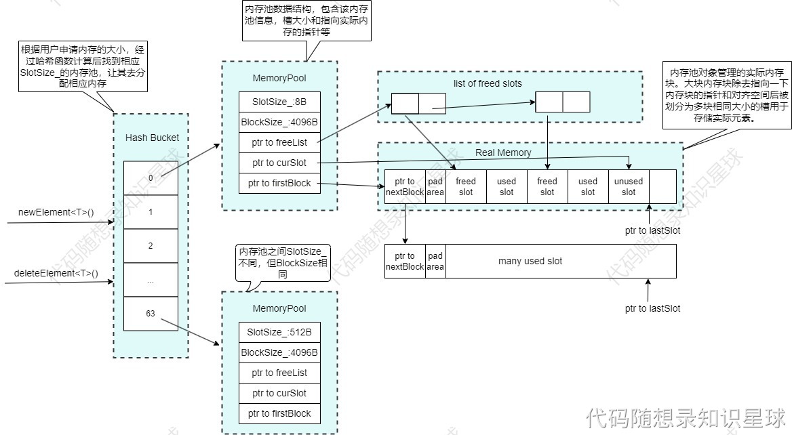
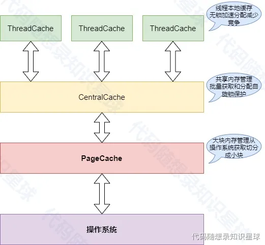
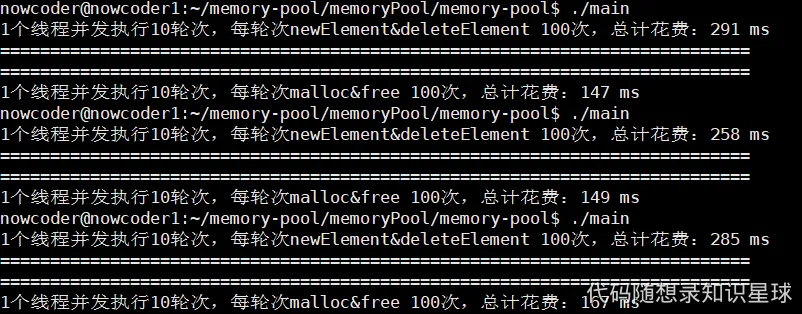
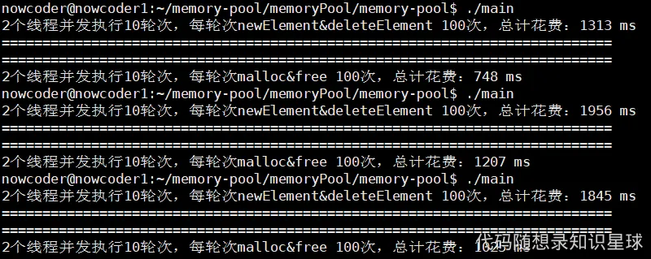
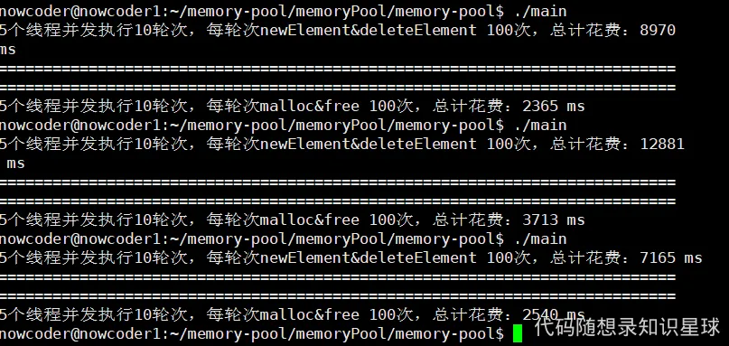
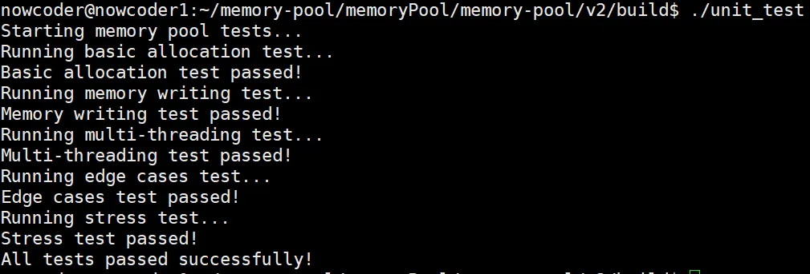
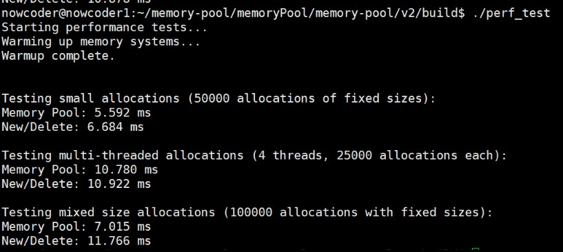
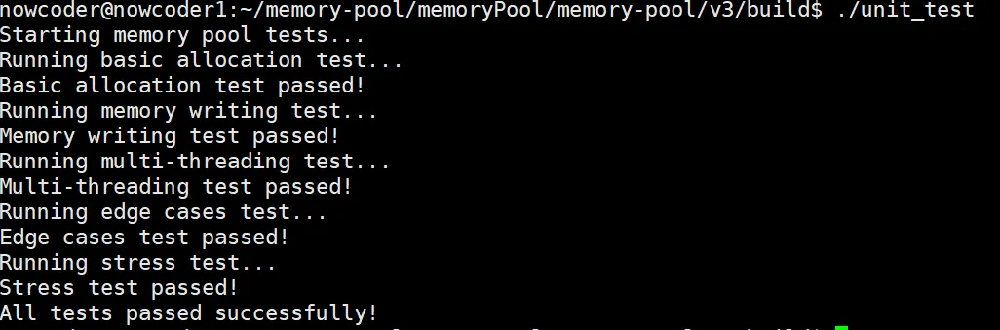
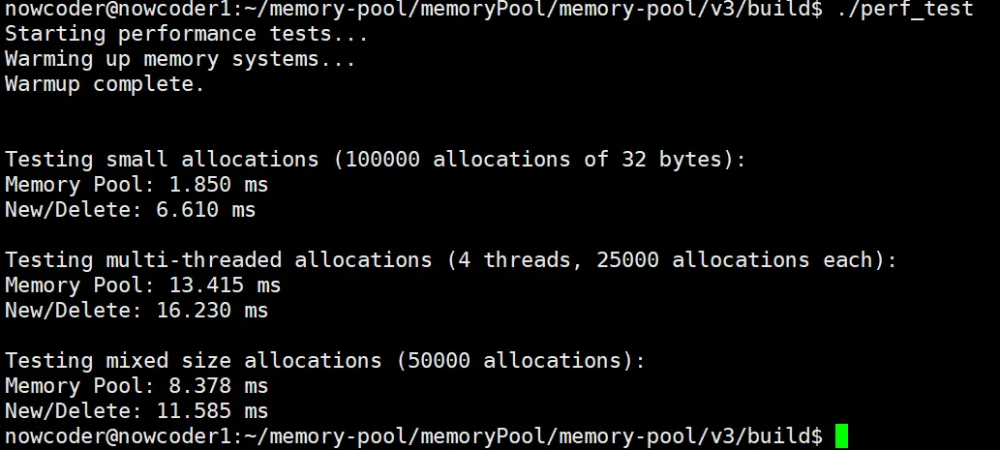

# 1.项目介绍

**项目名称：Kama-memory-pool**

**项目地址：**[**https://github.com/youngyangyang04/memory-pool**](https://github.com/youngyangyang04/memory-pool)

**开篇：**内存池在实际的项目开发中较为常见，[代码随想录知识星球](https://wx.zsxq.com/group/88511825151142)将从学习的角度带大家去高效了解和学习内存池项目。

### 什么是内存池？
**内存池是一种预分配内存并进行重复利用的技术**，通过减少频繁的动态内存分配与释放操作，从而提高程序运行效率。内存池通常预先分配一块大的内存区域，将其划分为多个小块，每次需要分配内存时直接从这块区域中分配，而不是调用系统的动态分配函数（如`new`或`malloc`）。简单来说就是申请一块较大的内存块(不够继续申请)，之后将这块内存的管理放在应用层执行，减少系统调用带来的开销。

### 为什么要做内存池？
#### 性能优化：
+ **减少动态内存分配的开销：**系统调用`malloc/new和free/delete`涉及复杂的内存管理操作（如内存查找、碎片整理），导致性能较低，而内存池通过预分配和简单的管理逻辑显著提高了分配和释放的效率。
+ **避免内存碎片：**动态分配内存会产生内存碎片，尤其在大量小对象频繁分配和释放的场景中，导致的后果就是：当程序长时间运行时，由于所申请的内存块的大小不定，频繁使用时会造成大量的内存碎片从而降低程序和操作系统的性能。内存池通过管理固定大小的内存块，可以有效避免碎片化。
+ **降低系统调用频率：**系统级内存分配（如`malloc`）需要进入内核态，频繁调用会有较高的性能开销。内存池通过减少系统调用频率提高程序效率。

#### 确定性（实时性）：
+ **稳定的分配时间：**使用内存池可以使分配和释放操作的耗时更加可控和稳定，适合实时性有严格要求的系统。

### 内存池的应用场景：
#### 高频小对象分配：
+ **游戏开发：**游戏中大量小对象（如粒子、子弹、NPC）的动态分配和释放非常频繁，使用内存池可以显著优化性能。
+ **网络编程：**网络编程中，大量请求和响应对象（如消息报文）和频繁创建和销毁非常适合使用内存池。
+ **内存管理库：**一些容器或数据结构（如`std::vector`或`std::deque`）在内部可能使用内存池来优化分配性能。

#### 实时系统：
+ 嵌入式设备或实时控制系统中，动态内存分配的延迟可能影响实时性，内存池提供确定性的分配性能。

#### 高性能计算：
+ 在高性能计算程序中，频繁地内存分配和释放会拖累整个程序的性能，内存池可以优化内存管理

#### 服务器开发：
+ 数据库服务器、web服务器等需要管理大量连接和请求，这些连接涉及大量内存分配，内存池能有效提升服务器性能。

### 内存池在代码中的应用
+ 对`new/malloc/delete/free`等动态开辟内存的系统调用进行替换
+ 对STL众多容器中的空间配置器`std::allocator`进行替换

### 内存池的缺点
+ **初始内存占用：**内存池需要预先分配较大的内存区域，可能浪费一些内存。
+ **复杂性：**实现和调试内存池代码比直接使用 `malloc / new` 更复杂。
+ **不适合大型对象：**对于大对象的分配可能并不划算。 


## 学习本项目的收获
+ **理解内存管理机制**  
掌握操作系统动态内存分配 (`malloc/new`) 的开销来源，理解用户态和内核态的切换成本。
+ **掌握内存池原理与实现**  
学会如何预分配大块内存、划分小块、重复利用，减少频繁系统调用。
+ **优化性能的常见手段**  
学习如何通过减少碎片化、降低系统调用频率来提高程序效率。
+ **确定性与实时性**  
认识到内存池能保证分配/释放耗时稳定，适用于实时系统或高性能场景。
+ **应用场景实践**  
游戏开发、网络编程、数据库/服务器开发、高性能计算等领域的应用案例。
+ **与 STL allocator 结合**  
掌握如何替换 `std::allocator` 等容器分配器，让内存池融入实际项目。
+ **工程能力提升**  
学习如何设计、实现并调试一套比系统分配更复杂但更高效的内存管理方案。


## <font style="color:rgb(31, 35, 40);">项目介绍</font>
<font style="color:rgb(31, 35, 40);">本项目是基于 C++ 实现的自定义内存池框架，旨在提高内存分配和释放的效率，特别是在多线程环境下。 该项目中实现的内存池主要分为两个版本，分别是目录 v1 和 v2 ( v3 在 v2 基础上进行了一定优化)，这两个版本的内存池设计思路大不相同。</font>

### <font style="color:rgb(31, 35, 40);">v1 介绍</font>
<font style="color:rgb(31, 35, 40);">基于哈希映射的多种定长内存分配器，可用于替换 new 和 delete 等内存申请释放的系统调用。包含以下主要功能：</font>

+ <font style="color:rgb(31, 35, 40);">内存分配：提供 allocate 方法，从内存池中分配内存块。</font>
+ <font style="color:rgb(31, 35, 40);">内存释放：提供 deallocate 方法，将内存块归还到内存池。</font>
+ <font style="color:rgb(31, 35, 40);">内存块管理：通过 allocateNewBlock 方法管理内存块的分配和释放。</font>
+ <font style="color:rgb(31, 35, 40);">自由链表：使用无锁的自由链表管理空闲内存块，提高并发性能。</font>

<font style="color:rgb(31, 35, 40);">项目架构图如下： </font>

### <font style="color:rgb(31, 35, 40);">v2、v3 介绍</font>
<font style="color:rgb(31, 35, 40);">该项目包括以下主要功能：</font>

+ <font style="color:rgb(31, 35, 40);">线程本地缓存（ThreadCache）：每个线程维护自己的内存块链表，减少线程间的锁竞争，提高内存分配效率。</font>
+ <font style="color:rgb(31, 35, 40);">中心缓存（CentralCache）：用于管理多个线程共享的内存块，支持批量分配和回收，优化内存利用率。</font>
+ <font style="color:rgb(31, 35, 40);">页面缓存（PageCache）：负责从操作系统申请和释放大块内存，支持内存块的合并和分割，减少内存碎片。</font>
+ <font style="color:rgb(31, 35, 40);">自旋锁和原子操作：在多线程环境下使用自旋锁和原子操作，确保线程安全的同时减少锁的开销。</font>

<font style="color:rgb(31, 35, 40);">项目架构图如下：</font>

<font style="color:rgb(31, 35, 40);">  
</font>

## <font style="color:rgb(31, 35, 40);">编译</font>
<font style="color:rgb(31, 35, 40);">先进入 v1 或 v2 或 v3 项目目录</font>

```plain
cd v1
```

<font style="color:rgb(31, 35, 40);">在项目目录下创建build目录，并进入该目录</font>

```plain
mkdir build
cd build
```

<font style="color:rgb(31, 35, 40);">执行 cmake 命令</font>

```plain
cmake ..
```

<font style="color:rgb(31, 35, 40);">执行 make 命令</font>

```plain
make
```

<font style="color:rgb(31, 35, 40);">删除编译生成的可执行文件：</font>

```plain
make clean
```

## <font style="color:rgb(31, 35, 40);">运行</font>
```plain
./可执行文件名
```

## <font style="color:rgb(31, 35, 40);">测试结果</font>
### <font style="color:rgb(31, 35, 40);">v1</font>
#### <font style="color:rgb(31, 35, 40);">单个线程下的测试情况：</font>



#### <font style="color:rgb(31, 35, 40);">两个线程下的测试情况：</font>





#### <font style="color:rgb(31, 35, 40);">五个线程下的测试情况：</font>




<font style="color:rgb(31, 35, 40);"> </font>

<font style="color:rgb(31, 35, 40);">通过上述测试结果大家可以看出该内存池的性能甚至不如直接使用系统调用 malloc 和 free，所以就有了内存池v2、v3。</font>

### <font style="color:rgb(31, 35, 40);">v2</font>
#### <font style="color:rgb(31, 35, 40);">功能测试结果</font>



#### <font style="color:rgb(31, 35, 40);">性能测试结果</font>



### <font style="color:rgb(31, 35, 40);">v3</font>
#### <font style="color:rgb(31, 35, 40);">功能测试结果</font>



#### <font style="color:rgb(31, 35, 40);">性能测试结果</font>
<font style="color:rgb(31, 35, 40);">测试结果表明内存池v3的性能要略好于内存池v2。 </font>


> 更新: 2025-11-13 11:13:20  
> 原文: <https://www.yuque.com/chengxuyuancarl/ooq1de/mbf28r1oyghrh26p>