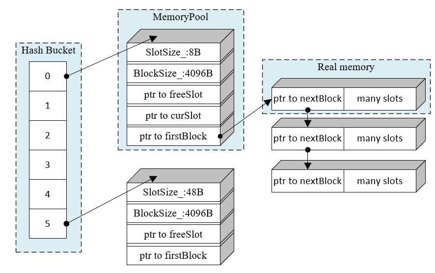
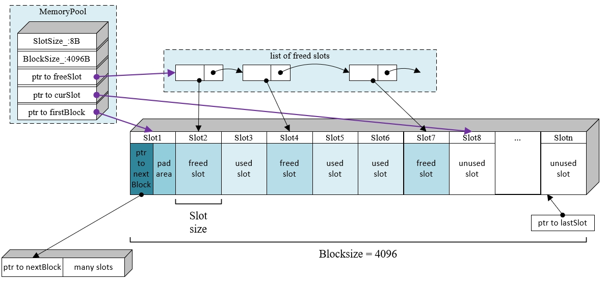
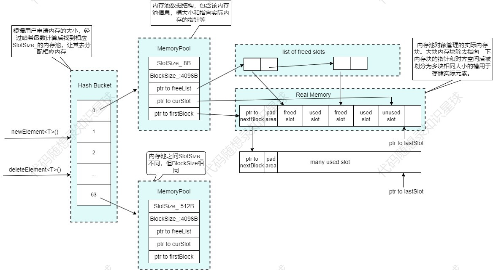
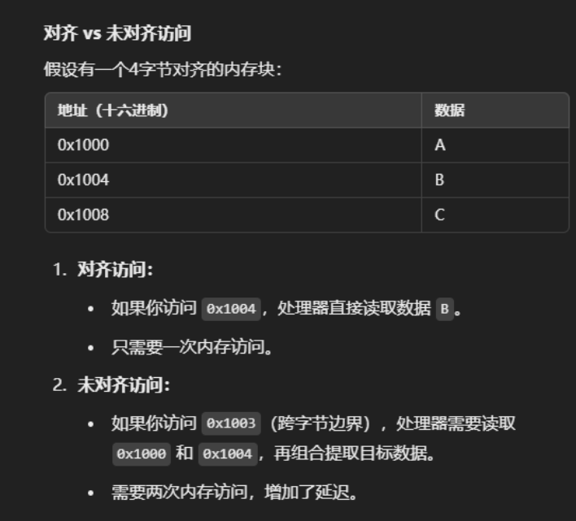

# 3.内存池版本1项目框架

## 项目框架

大家上网搜索内存池时，会发现搜出来的内存池项目五花八门，各不相同。许多人可能因此对内存池项目心生畏惧。但其实，当深入学习并了解完一个内存池项目后，就会发现所有的内存池本质上都在做同一件事：预先向系统申请一大片内存，并交由应用层管理，在程序运行时，内存的分配和回收都由应用层的内存池处理，从而减少系统调用。

该项目实现的是**基于哈希映射的多种定长内存分配器（内存池中的一种）：**



主要框架如上图所示，主要就是维护一个哈希桶 `MemoryPools`，里面每项对应一个内存池 `MemoryPool`，哈希桶中每个内存池的块大小 `BlockSize` 是相同的（4096字节，当然也可以设置为不同的），但是每个内存池里每个块分割的大小（槽大小）`SlotSize`是不同的，依次为8,16,32,...,512字节（需要的内存超过512字节就用`new/malloc`），用户申请不同大小的内存就通过哈希桶的映射找到相应（槽大小）  SlotSize 的内存池向其申请，比如用户分别申请8字节和12字节的内存，则经过哈希函数的计算找到槽大小为8字节的内存池和槽大小为16字节（哈希函数向上取整，因为分配给用户的内存块只能大不能小）的内存池分别分配内存给用户，这样设置的好处是可以保证内存碎片在可控范围内。

**注：到这里大家可能想问为什么用户申请超过512字节的内存就直接调用**\*\*<font style="color:rgb(31, 9, 9);background-color:rgb(218, 218, 218);"> new/malloc </font>\*\***等系统调用？**

答：**因为内存池主要解决的是 小内存带来的内存碎片问题 和 小内存频繁申请释放带来的性能问题**。但如果是用户申请较大块的内存依然选择通过内存池分配内存则会导致内存池频繁因为管理的内存不足而向系统申请内存，这样既没有起到性能优化的作用同时增加的程序的复杂度。(ps：频繁申请小内存带来的问题可参考：<https://blog.csdn.net/LF_2016/article/details/53511648>)

介绍完大致框架之后再来看一下每个内存池的内部结构图：

主要的对象有：指向第一个可用内存块的指针`Slot currentBlock`（也是图中的`ptr to firstBlock`），被释放对象的slot链表`Slot freeSlot`，未使用的slot链表`Slot* currentSlot`，下面讲下具体的作用：

* <code>**Slot currentBlock**</code>\*\*：\*\*内存池实际上是一个一个的 `Block` 以链表的形式连接起来，每一个 `Block` 是一块大的内存，当内存池的内存不足的时候，就会向操作系统申请新的 `block` 加入链表。
* <code>**Slot freeSlot**</code>\*\*：\*\*链表里面的每一项都是对象被释放后归还给内存池的空间，内存池刚创建时 `freeSlot` 是空的。用户创建对象，将对象释放时，把内存归还给内存池，此时内存池不会将内存归还给系统（`delete/free`），而是把指向这个对象的内存的指针加到 `freeSlot` 链表的前面（前插），之后用户每次申请内存时，`memoryPool`就先在这个 `freeSlot` 链表里面找。
* <code>**Slot curretSlot**</code>\*\*：\*\*用户在创建对象的时候，先检查 `freeSlot` 是否为空，不为空的时候直接取出一项作为分配出的空间。否则就在当前 `Block` 将 `currentSlot` 所指的内存分配出去，如果 `Block` 里面的内存已经使用完，就向操作系统申请一个新的 `Block`。

上述两个图已经大致介绍了该项目的结构，下面我将以一个整体流程图解读的方式，给大家介绍该内存池项目：



该项目对外提供了两个重要的接口`newElement`和`deleteElement`，分别是向内存池申请内存和将申请的内存进行回收操作。

首先介绍newElement函数，其函数声明如下：

```cpp
template<typename T, typename... Args>
T* newElement(Args&&... args);
```

用户在构造对象T的时候通过调用`newElement<T>()`方法申请内存，`newElement<T>()`方法计算出元素T的大小后传入哈希桶中，哈希桶中根据哈希映射选择相应槽大小的内存池去分配内存返回（分配内存时优先使用`FreeList_`里的空闲内存槽，其次再找`curSlot_`*，如果*<code>_curSlot__</code>*大于等于*<code>_lastSot__</code>*，则重新申请一块内存块来分配内存槽*），`newElement`函数获得内存之后，在该内存上构造对象T后将地址返回给用户。

其次是介绍deleteElement函数，其函数声明如下：

```cpp
template<typename T>
void deleteElement(T* p);
```

当用户想要释放对象时可调用`deleteElement`函数，该方法首先调用对象T的析构函数，其次同样经过哈希映射找到相应的内存池去把内存槽加入到`FreeList_`中。

## 项目代码

看完上面的项目描述再看代码就很好理解了。

`MemoryPool.h`

```cpp
namespace memoryPool
{
#define MEMORY_POOL_NUM 64
#define SLOT_BASE_SIZE 8
#define MAX_SLOT_SIZE 512


/* 具体内存池的槽大小没法确定，因为每个内存池的槽大小不同(8的倍数)
   所以这个槽结构体的sizeof 不是实际的槽大小 */
struct Slot 
{
    Slot* next;
};

class MemoryPool
{
public:
    MemoryPool(size_t BlockSize = 4096);
    ~MemoryPool();
    
    void init(size_t);

    void* allocate();
    void deallocate(void*);
private:
    void allocateNewBlock();
    size_t padPointer(char* p, size_t align);

private:
    int        BlockSize_; // 内存块大小
    int        SlotSize_; // 槽大小
    Slot*      firstBlock_; // 指向内存池管理的首个实际内存块
    Slot*      curSlot_; // 指向当前未被使用过的槽
    Slot*      freeList_; // 指向空闲的槽(被使用过后又被释放的槽)
    Slot*      lastSlot_; // 作为当前内存块中最后能够存放元素的位置标识(超过该位置需申请新的内存块)
    std::mutex mutexForFreeList_; // 保证freeList_在多线程中操作的原子性
    std::mutex mutexForBlock_; // 保证多线程情况下避免不必要的重复开辟内存导致的浪费行为
};


class HashBucket
{
public:
    static void initMemoryPool();
    static MemoryPool& getMemoryPool(int index);

    static void* useMemory(size_t size)
    {
        if (size <= 0)
            return nullptr;
        if (size > MAX_SLOT_SIZE) // 大于512字节的内存，则使用new
            return operator new(size);

        // 相当于size / 8 向上取整（因为分配内存只能大不能小
        return getMemoryPool(((size + 7) / SLOT_BASE_SIZE) - 1).allocate();
    }

    static void freeMemory(void* ptr, size_t size)
    {
        if (!ptr)
            return;
        if (size > MAX_SLOT_SIZE)
        {
            operator delete(ptr);
            return;
        }

        getMemoryPool(((size + 7) / SLOT_BASE_SIZE) - 1).deallocate(ptr);
    }

    template<typename T, typename... Args> 
    friend T* newElement(Args&&... args);
    
    template<typename T>
    friend void deleteElement(T* p);
};

template<typename T, typename... Args>
T* newElement(Args&&... args)
{
    T* p = nullptr;
    // 根据元素大小选取合适的内存池分配内存
    if ((p = reinterpret_cast<T*>(HashBucket::useMemory(sizeof(T)))) != nullptr)
        // 在分配的内存上构造对象
        new(p) T(std::forward<Args>(args)...);

    return p;
}

template<typename T>
void deleteElement(T* p)
{
    // 对象析构
    if (p)
    {
        p->~T();
         // 内存回收
        HashBucket::freeMemory(reinterpret_cast<void*>(p), sizeof(T));
    }
}

} // namespace memoryPool
```

`MemoryPool.cpp`

```cpp
namespace memoryPool 
{
MemoryPool::MemoryPool(size_t BlockSize)
    : BlockSize_ (BlockSize)
{}

MemoryPool::~MemoryPool()
{
    // 把连续的block删除
    Slot* cur = firstBlock_;
    while (cur)
    {
        Slot* next = cur->next;
        // 等同于 free(reinterpret_cast<void*>(firstBlock_));
        // 转化为 void 指针，因为 void 类型不需要调用析构函数，只释放空间
        operator delete(reinterpret_cast<void*>(cur));
        cur = next;
    }
}

void MemoryPool::init(size_t size)
{
    assert(size > 0);
    SlotSize_ = size;
    firstBlock_ = nullptr;
    curSlot_ = nullptr;
    freeList_ = nullptr;
    lastSlot_ = nullptr;
}

void* MemoryPool::allocate()
{
    // 优先使用空闲链表中的内存槽
    if (freeList_ != nullptr)
    {
        {
            std::lock_guard<std::mutex> lock(mutexForFreeList_);
            if (freeList_ != nullptr)
            {
                Slot* temp = freeList_;
                freeList_ = freeList_->next;
                return temp;
            }
        }
    }

    Slot* temp;
    {   
        std::lock_guard<std::mutex> lock(mutexForBlock_);
        if (curSlot_ >= lastSlot_)
        {
            // 当前内存块已无内存槽可用，开辟一块新的内存
            allocateNewBlock();
        }
    
        temp = curSlot_;
        // 这里不能直接 curSlot_ += SlotSize_ 因为curSlot_是Slot*类型，所以需要除以SlotSize_再加1
        curSlot_ += SlotSize_ / sizeof(Slot);
    }
    
    return temp; 
}

void MemoryPool::deallocate(void* ptr)
{
    if (ptr)
    {
        // 回收内存，将内存通过头插法插入到空闲链表中
        std::lock_guard<std::mutex> lock(mutexForFreeList_);
        reinterpret_cast<Slot*>(ptr)->next = freeList_;
        freeList_ = reinterpret_cast<Slot*>(ptr);
    }
}

void MemoryPool::allocateNewBlock()
{   
    //std::cout << "申请一块内存块，SlotSize: " << SlotSize_ << std::endl;
    // 头插法插入新的内存块
    void* newBlock = operator new(BlockSize_);
    reinterpret_cast<Slot*>(newBlock)->next = firstBlock_;
    firstBlock_ = reinterpret_cast<Slot*>(newBlock);

    char* body = reinterpret_cast<char*>(newBlock) + sizeof(Slot*);
    size_t paddingSize = padPointer(body, SlotSize_); // 计算对齐需要填充内存的大小
    curSlot_ = reinterpret_cast<Slot*>(body + paddingSize);

    // 超过该标记位置，则说明该内存块已无内存槽可用，需向系统申请新的内存块
    lastSlot_ = reinterpret_cast<Slot*>(reinterpret_cast<size_t>(newBlock) + BlockSize_ - SlotSize_ + 1);

    freeList_ = nullptr;
}

// 让指针对齐到槽大小的倍数位置
size_t MemoryPool::padPointer(char* p, size_t align)
{
    // align 是槽大小
    return (align - reinterpret_cast<size_t>(p)) % align;
}

void HashBucket::initMemoryPool()
{
    for (int i = 0; i < MEMORY_POOL_NUM; i++)
    {
        getMemoryPool(i).init((i + 1) * SLOT_BASE_SIZE);
    }
}   

// 单例模式
MemoryPool& HashBucket::getMemoryPool(int index)
{
    static MemoryPool memoryPool[MEMORY_POOL_NUM];
    return memoryPool[index];
}

} // namespace memoryPool
```

## 项目细节思考

**为什么内存池需要为不同类型的元素分配内存，但**<code>**MemoryPool**</code>**类和**<code>**HashBucket**</code>**类却不需要写成类模板？**

答：因为对外提供的`newElement`函数和`deleteElement`函数是模版函数，他们根据传入的实际元素计算出元素大小后，通过`HashBucket`类提供的接口找到相应槽大小的`MemoryPool`对象，也就是说内存池和哈希桶其实不关心是为哪种类型元素申请内存，它只关心分配内存的大小。

**为什么**<code>**lastSlot_**</code>\*\* 的值等于\*\*<code>**newBlock +  BlockSize - sizeof(slot_type_) + 1**</code>\*\* 而不是\*\*<code>**newBlock + BlockSize - sizeof(slot_type_) **</code>**？**

答：因为`lastSlot_`不是指向当前内存块的最后一个槽的地址，而是指向当前内存块中最后能存储槽的位置标志，等于或大于这个位置就代表当前内存块不足构成一个槽位以再用于存储对象了。并且`newBlock + BlockSize - sizeof(slot_type_)` 也不能够做为内存块最后一个槽的地址因为内存对齐的大小是不确定的，所以最后一个槽的地址也是不确定的。

**内存对齐的意义是什么？**

1. 提高访问效率：

缓存对齐：cpu的缓存通常以固定大小的块(如64字节或128字节)为单位，如果内存对齐，数据可以完全放入一个缓冲块中，提高缓存命中率。

内存总线对齐：现代内存通常是按块传输(如4、8、16字节)。未对齐的访问可能导致额外的内存访问，降低效率

2. 满足硬件要求：某些硬件架构要求特定数据类型对齐，不对齐可能导致硬件异常，即使不严格要求对齐的平台，不对齐也可能导致性能下降或未定义行为。
3. 保证兼容性：\
   数据结构标准化：C++标准库的数据结构通常要求对齐，例如std::allocator分配的内存默认按最大对齐要求对齐。\
   跨平台兼容：对齐内存可以确保代码在不同架构下正确运行，避免潜在的问题。



## 项目优化

下面是对原有的项目进行高并发优化，优化点具体如下：

* 无锁数据结构：虽然这里仍然使用了锁，但可以进一步优化为无锁数据结构（如无锁队列）来管理空闲槽。

### 无锁数据结构

这里主要实现一个基于原子操作的无锁队列来替代原有使用互斥锁的实现。主要修改`freeList_`的管理方式。属于一种常用的无锁并发编程技术，通常使用于内存池或对象池管理，以避免使用锁，从而提高并发性能

主要改进说明：

1. 原子操作：
   1. 使用 std::atomic\<Slot\*> 替代普通指针，确保对指针的操作是原子的。
   2. 使用 compare\_exchange\_weak 实现无锁的 CAS（Compare-And-Swap）操作。
2. 内存序（Memory Ordering）：
   1. memory\_order\_relaxed：用于不需要同步的操作。
   2. memory\_order\_release：确保在此之前的所有内存写入对其他线程可见。
   3. memory\_order\_acquire：确保在此之后的所有内存读取能看到其他线程的写入。
3. 无锁算法：
   1. pushFreeList：实现无锁入队操作，使用 CAS 确保线程安全。
   2. popFreeList：实现无锁出队操作，同样使用 CAS 确保线程安全。
4. 性能优化：
   1. 移除了 mutexForFreeList\_ 互斥锁，减少了锁竞争。
   2. 保留 mutexForBlock\_ 用于新块分配，因为这是较少发生的操作。

首先修改 MemoryPool.h

```cpp
#pragma once 

#include <cassert>
#include <cstdint>
#include <atomic>
#include <memory>

namespace memoryPool
{
#define MEMORY_POOL_NUM 64
#define SLOT_BASE_SIZE 8
#define MAX_SLOT_SIZE 512

// 修改 Slot 结构，使用原子指针
struct Slot 
{
    std::atomic<Slot*> next;
};

class MemoryPool
{
public:
    MemoryPool(size_t BlockSize = 4096);
    ~MemoryPool();
    
    void init(size_t);
    void* allocate();
    void deallocate(void*);

private:
    void allocateNewBlock();
    size_t padPointer(char* p, size_t align);
    
    // 使用CAS操作进行无锁入队和出队
    bool pushFreeList(Slot* slot);
    Slot* popFreeList();

private:
    int        BlockSize_; 
    int        SlotSize_; 
    Slot*      firstBlock_;
    Slot*      curSlot_;
    std::atomic<Slot*> freeList_;  // 修改为原子指针
    Slot*      lastSlot_;
    std::mutex mutexForBlock_;     // 仍然保留块分配的互斥锁
};

// ... 其他代码保持不变 ...

} // namespace memoryPool
```

修改 MemoryPool.cpp 实现无锁队列

```cpp
#include "MemoryPool.h"

namespace memoryPool 
{

MemoryPool::MemoryPool(size_t BlockSize)
    : BlockSize_(BlockSize), SlotSize_(0), firstBlock_(nullptr),
      curSlot_(nullptr), freeList_(nullptr), lastSlot_(nullptr)
{}

// ... 其他代码保持不变 ...

// 实现无锁入队操作
bool MemoryPool::pushFreeList(Slot* slot) {
    while (true) {
        // 获取当前头节点
        Slot* oldHead = freeList_.load(std::memory_order_relaxed);
        // 将新节点的 next 指向当前头节点
        slot->next.store(oldHead, std::memory_order_relaxed);
        
        // 尝试将新节点设置为头节点
        if (freeList_.compare_exchange_weak(oldHead, slot,
                                          std::memory_order_release,
                                          std::memory_order_relaxed)) {
            return true;
        }
        // CAS 失败则重试
    }
}

// 实现无锁出队操作
Slot* MemoryPool::popFreeList() {
    while (true) {
        Slot* oldHead = freeList_.load(std::memory_order_relaxed);
        if (oldHead == nullptr) {
            return nullptr;  // 队列为空
        }
        
        // 获取下一个节点
        Slot* newHead = oldHead->next.load(std::memory_order_relaxed);
        
        // 尝试更新头节点
        if (freeList_.compare_exchange_weak(oldHead, newHead,
                                          std::memory_order_acquire,
                                          std::memory_order_relaxed)) {
            return oldHead;
        }
        // CAS 失败则重试
    }
}

void* MemoryPool::allocate() {
    // 优先使用空闲链表中的内存槽
    Slot* slot = popFreeList();
    if (slot != nullptr) {
        return slot;
    }

    // 如果空闲链表为空，则分配新的内存
    std::lock_guard<std::mutex> lock(mutexForBlock_);
    if (curSlot_ >= lastSlot_) {
        allocateNewBlock();
    }
    
    Slot* result = curSlot_;
    curSlot_ = reinterpret_cast<Slot*>(
        reinterpret_cast<char*>(curSlot_) + SlotSize_
    );
    return result;
}

void MemoryPool::deallocate(void* ptr) {
    if (!ptr) return;
    
    Slot* slot = static_cast<Slot*>(ptr);
    pushFreeList(slot);
}

void MemoryPool::init(size_t size) {
    assert(size > 0);
    SlotSize_ = size;
    firstBlock_ = nullptr;
    curSlot_ = nullptr;
    freeList_.store(nullptr, std::memory_order_relaxed);
    lastSlot_ = nullptr;
}

// ... 其他代码保持不变 ...

} // namespace memoryPool
```

这个实现的主要优势是：

1. 完全无锁的内存释放和重用机制
2. 更好的并发性能，特别是在高并发场景下
3. 避免了互斥锁带来的线程阻塞和上下文切换开销

需要注意的是，虽然移除了互斥锁，但 CAS 操作在高并发情况下可能会发生多次重试，这是无锁算法的特性。在实际使用中，这种实现通常比基于互斥锁的实现有更好的性能表现。


> 更新: 2025-03-05 15:56:14  
> 原文: <https://www.yuque.com/chengxuyuancarl/ooq1de/ri92nlgype579gpu>