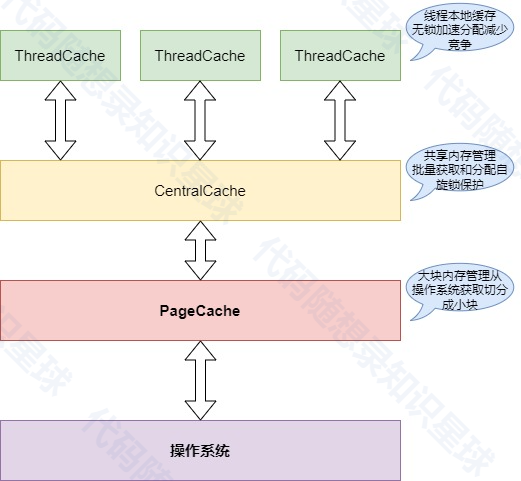

# 4.内存池版本2&版本3项目框架

# 为什么实现了内存池版本1还要实现内存池版本2 ？
因为版本1内存池的设计结构有一定的局限性，版本2选择了一种更加**高性能**和**常用**的内存池设计结构：三层缓存结构的内存池设计。

使用这种设计结构的知名项目有：

### TCMalloc (Thread-Caching Malloc)
+ Google开发的内存分配器
+ 用于Chrome浏览器
+ 应用在Google的很多核心项目中

结构：

+ ThreadCache：线程本地缓存
+ CentralCache：中央缓存
+ PageHeap：页面堆（对应我们的PageCache）

### jemalloc
+ Facebook广泛使用
+ FreeBSD的默认内存分配器
+ Redis默认使用的内存分配器

类似的多级缓存结构：

+ TCache (Thread Cache)
+ Arena
+ Chunk/Huge

### ptmalloc2
+ glibc的默认内存分配器
+ Linux系统默认使用

多层次结构：

+ Thread Arena
+ Bins
+ Top Chunk

### mimalloc
+ Microsoft开发的内存分配器
+ VS Code等项目在使用

类似的分层设计：

+ Local Free Lists
+ Thread Free Lists
+ Page Based

这种三层缓存结构的优势：

+ 减少锁竞争
+ 提高内存分配效率
+ 降低内存碎片
+ 更好的多线程扩展性

这也是为什么这种设计被这么多大型项目采用的原因。

# 项目整体介绍
这个项目实现了一个高效的内存池，旨在优化内存分配和释放的性能，特别是在多线程环境下。内存池通过分层缓存架构来管理内存，主要包括以下三层：  
1. ThreadCache（线程本地缓存）

+ 每个线程独立的内存缓存
+ 无锁操作，快速分配和释放
+ 减少线程间竞争，提高并发性能

2. CentralCache（中心缓存）

+ 管理多个线程共享的内存块
+ 通过自旋锁保护，确保线程安全
+ 批量从PageCache获取内存，分配给ThreadCache

3. PageCache（页缓存）

+ 从操作系统获取大块内存
+ 将大块内存切分成小块，供CentralCache使用
+ 负责内存的回收和再利用

## 内存池架构图


## 执行流程图
```cpp
+-------------------+
|  应用请求内存     |
+-------------------+
         |
         v
+-------------------+
|   ThreadCache     |
|-------------------|
|  检查本地缓存     |
|  有：直接分配     |
|  无：请求Central  |
+-------------------+
         |
         v
+-------------------+
|   CentralCache    |
|-------------------|
|  检查共享缓存     |
|  有：分配给Thread |
|  无：请求Page     |
+-------------------+
         |
         v
+-------------------+
|    PageCache      |
|-------------------|
|  从操作系统获取    |
|  切分成小块       |
|  返回给Central    |
+-------------------+
```


> 更新: 2025-01-26 11:12:36  
> 原文: <https://www.yuque.com/chengxuyuancarl/ooq1de/kcd60hxk8vg433s3>