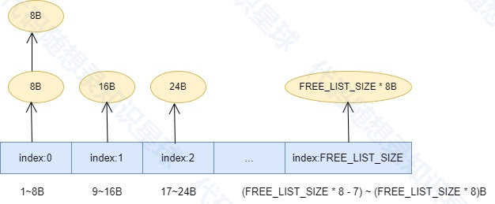

# 线程本地缓存(ThreadCache)

## 线程本地缓存介绍

详细介绍一下ThreadCache的设计思路和实现原理

### ThreadCache的定义

```cpp
// 线程本地缓存
class ThreadCache
{
public:
    static ThreadCache* getInstance()
    {
        static thread_local ThreadCache instance;
        return &instance;
    }

    void* allocate(size_t size);
    void deallocate(void* ptr, size_t size);
private:
    ThreadCache() = default;
    // 从中心缓存获取内存
    void* fetchFromCentralCache(size_t index);
    // 归还内存到中心缓存
    void returnToCentralCache(void* start, size_t size);
    // 计算批量获取内存块的数量
    size_t getBatchNum(size_t size);
    // 判断是否需要归还内存给中心缓存
    bool shouldReturnToCentralCache(size_t index);
private:
    // 每个线程的自由链表数组
    std::array<void*, FREE_LIST_SIZE> freeList_;    
    std::array<size_t, FREE_LIST_SIZE> freeListSize_; // 自由链表大小统计
};
```

线程本地缓存的数据结构`freeList_`可视化展示



关键设计点

* 使用thread\_local确保每个线程独立实例
* 自由链表数组管理不同大小的内存块
* 单例模式简化访问

### 内存分配实现

```cpp
void* ThreadCache::allocate(size_t size)
{
    // 处理0大小的分配请求
    if (size == 0)
    {
        size = ALIGNMENT; // 至少分配一个对齐大小
    }
    
    if (size > MAX_BYTES)
    {
        // 大对象直接从系统分配
        return malloc(size);
    }

    size_t index = SizeClass::getIndex(size);
    
    // 更新对应自由链表的长度计数
    freeListSize_[index]--;
    
    // 检查线程本地自由链表
    // 如果 freeList_[index] 不为空，表示该链表中有可用内存块
    if (void* ptr = freeList_[index])
    {
        freeList_[index] = *reinterpret_cast<void**>(ptr); // 将freeList_[index]指向的内存块的下一个内存块地址（取决于内存块的实现）
        return ptr;
    }
    
    // 如果线程本地自由链表为空，则从中心缓存获取一批内存
    return fetchFromCentralCache(index);
}
```

优势：

* 快速路径：直接从自由链表分配
* 无锁操作：线程本地访问
* 分级处理：大小内存分开处理

### 从中心缓存获取内存

当线程本地缓存中管理对应大小(`index`)内存块的自由链表中没有内存块可以分配时，则向中心缓存请求内存块以满足用户的内存请求。

```cpp
void* ThreadCache::fetchFromCentralCache(size_t index)
{
    // 从中心缓存批量获取内存
    void* start = CentralCache::getInstance().fetchRange(index);
    if (!start) return nullptr;

    // 取一个返回，其余放入自由链表
    void* result = start;
    freeList_[index] = *reinterpret_cast<void**>(start);
    
    // 更新自由链表大小
    size_t batchNum = 0;
    void* current = start; // 从start开始遍历

    // 计算从中心缓存获取的内存块数量
    while (current != nullptr)
    {
        batchNum++;
        current = *reinterpret_cast<void**>(current); // 遍历下一个内存块
    }

    // 更新freeListSize_，增加获取的内存块数量
    freeListSize_[index] += batchNum;
    
    return result;
}
```

设计考虑

* 批量获取：一次性从中心缓存中获取一定数量的对应大小内存块存入线程本地缓存的自由链表中管理，以减少与中心缓存的交互。
* 链表管理：将从中心缓存中获取的批量空闲内存块，用对应`index`的自由链表来维护。
* 延迟加载：按需从中心缓存获取。

### 内存释放实现

```cpp
void ThreadCache::deallocate(void* ptr, size_t size)
{
    if (size > MAX_BYTES)
    {
        free(ptr);
        return;
    }

    size_t index = SizeClass::getIndex(size);

    // 插入到线程本地自由链表
    *reinterpret_cast<void**>(ptr) = freeList_[index];
    freeList_[index] = ptr;

    // 更新对应自由链表大小
    freeListSize_[index]++; // 增加对应大小类的自由链表大小

    // 判断是否需要将部分内存回收给中心缓存
    if (shouldReturnToCentralCache(index))
    {
        returnToCentralCache(freeList_[index], size);
    }
}
```

特点：

* 快速释放：直接插入线程本地缓存对应链表头部
* 无锁操作：提高并发性能
* 内存复用：减少系统调用

### 将内存归还给中心缓存

当用户调用`deallocate`将内存块归还给线程本地缓存时，检查到线程本地缓存对应`index`的自由链表管理内存块数量超过阈值时会调用`returnToCentralCache`将部分内存块归还给中心缓存。

```cpp
void ThreadCache::returnToCentralCache(void* start, size_t size)
{
    // 根据大小计算对应的索引
    size_t index = SizeClass::getIndex(size);

    // 获取对齐后的实际块大小
    size_t alignedSize = SizeClass::roundUp(size);

    // 计算要归还内存块数量
    size_t batchNum = freeListSize_[index];
    if (batchNum <= 1) return; // 如果只有一个块，则不归还

    // 保留一部分在ThreadCache中（比如保留1/4）
    size_t keepNum = std::max(batchNum / 4, size_t(1));
    size_t returnNum = batchNum - keepNum;

    // 将内存块串成链表
    char* current = static_cast<char*>(start);
    // 使用对齐后的大小计算分割点
    char* splitNode = current;
    for (size_t i = 0; i < keepNum - 1; ++i) 
    {
        splitNode = reinterpret_cast<char*>(*reinterpret_cast<void**>(splitNode));
        if (splitNode == nullptr) 
        {
            // 如果链表提前结束，更新实际的返回数量
            returnNum = batchNum - (i + 1);
            break;
        }
    }

    if (splitNode != nullptr) 
    {
        // 将要返回的部分和要保留的部分断开
        void* nextNode = *reinterpret_cast<void**>(splitNode);
        *reinterpret_cast<void**>(splitNode) = nullptr; // 断开连接

        // 更新ThreadCache的空闲链表
        freeList_[index] = start;

        // 更新自由链表大小
        freeListSize_[index] = keepNum;

        // 将剩余部分返回给CentralCache
        if (returnNum > 0 && nextNode != nullptr)
        {
            CentralCache::getInstance().returnRange(nextNode, returnNum * alignedSize, index);
        }
    }
}
```

### 为什么这样实现

1. 性能优化
   1. thread\_local避免了线程间同步
   2. 自由链表提供O(1)的分配和释放
   3. 批量操作减少系统调用
2. 内存管理
   1. 按大小分类管理，减少碎片
   2. 本地缓存提高复用率
   3. 分级结构便于拓展
3. 并发处理
   1. 无锁设计提高并发性能
   2. 线程隔离减少竞争
   3. 批量操作提高吞吐量

### 在内存池中的作用

* 作为第一级缓存，处理最频繁的内存请求
* 减轻中心缓存的压力
* 提供快速的内存分配和释放
* 优化多线程性能

这种实现方式使得ThreadCache成为了内存池的性能保证，特别适合：

1. 频繁的小内存分配/释放
2. 多线程高并发场景
3. 对延迟敏感的应用
4. 需要高性能的系统

## 项目完整实现

```cpp
// 线程本地缓存
class ThreadCache
{
public:
    static ThreadCache* getInstance()
    {
        static thread_local ThreadCache instance;
        return &instance;
    }

    void* allocate(size_t size);
    void deallocate(void* ptr, size_t size);
private:
    ThreadCache() 
    {
        // 初始化自由链表和大小统计
        freeList_.fill(nullptr);
        freeListSize_.fill(0);
    }
    
    // 从中心缓存获取内存
    void* fetchFromCentralCache(size_t index);
    // 归还内存到中心缓存
    void returnToCentralCache(void* start, size_t size);

    bool shouldReturnToCentralCache(size_t index);
private:
    // 每个线程的自由链表数组
    std::array<void*, FREE_LIST_SIZE>  freeList_; 
    std::array<size_t, FREE_LIST_SIZE> freeListSize_; // 自由链表大小统计   
};
```

```cpp
void* ThreadCache::allocate(size_t size)
{
    // 处理0大小的分配请求
    if (size == 0)
    {
        size = ALIGNMENT; // 至少分配一个对齐大小
    }
    
    if (size > MAX_BYTES)
    {
        // 大对象直接从系统分配
        return malloc(size);
    }

    size_t index = SizeClass::getIndex(size);
    
    // 更新对应自由链表的长度计数
    freeListSize_[index]--;
    
    // 检查线程本地自由链表
    // 如果 freeList_[index] 不为空，表示该链表中有可用内存块
    if (void* ptr = freeList_[index])
    {
        freeList_[index] = *reinterpret_cast<void**>(ptr); // 将freeList_[index]指向的内存块的下一个内存块地址（取决于内存块的实现）
        return ptr;
    }
    
    // 如果线程本地自由链表为空，则从中心缓存获取一批内存
    return fetchFromCentralCache(index);
}

void ThreadCache::deallocate(void* ptr, size_t size)
{
    if (size > MAX_BYTES)
    {
        free(ptr);
        return;
    }

    size_t index = SizeClass::getIndex(size);

    // 插入到线程本地自由链表
    *reinterpret_cast<void**>(ptr) = freeList_[index];
    freeList_[index] = ptr;

    // 更新对应自由链表的长度计数
    freeListSize_[index]++; 

    // 判断是否需要将部分内存回收给中心缓存
    if (shouldReturnToCentralCache(index))
    {
        returnToCentralCache(freeList_[index], size);
    }
}

// 判断是否需要将内存回收给中心缓存
bool ThreadCache::shouldReturnToCentralCache(size_t index)
{
    // 设定阈值，例如：当自由链表的大小超过一定数量时
    size_t threshold = 256; 
    return (freeListSize_[index] > threshold);
}

void* ThreadCache::fetchFromCentralCache(size_t index)
{
    // 从中心缓存批量获取内存
    void* start = CentralCache::getInstance().fetchRange(index);
    if (!start) return nullptr;

    // 取一个返回，其余放入自由链表
    void* result = start;
    freeList_[index] = *reinterpret_cast<void**>(start);
    
    // 更新自由链表大小
    size_t batchNum = 0;
    void* current = start; // 从start开始遍历

    // 计算从中心缓存获取的内存块数量
    while (current != nullptr)
    {
        batchNum++;
        current = *reinterpret_cast<void**>(current); // 遍历下一个内存块
    }

    // 更新freeListSize_，增加获取的内存块数量
    freeListSize_[index] += batchNum;
    
    return result;
}

void ThreadCache::returnToCentralCache(void* start, size_t size)
{
    // 根据大小计算对应的索引
    size_t index = SizeClass::getIndex(size);

    // 获取对齐后的实际块大小
    size_t alignedSize = SizeClass::roundUp(size);

    // 计算要归还内存块数量
    size_t batchNum = freeListSize_[index];
    if (batchNum <= 1) return; // 如果只有一个块，则不归还

    // 保留一部分在ThreadCache中（比如保留1/4）
    size_t keepNum = std::max(batchNum / 4, size_t(1));
    size_t returnNum = batchNum - keepNum;

    // 将内存块串成链表
    char* current = static_cast<char*>(start);
    // 使用对齐后的大小计算分割点
    char* splitNode = current;
    for (size_t i = 0; i < keepNum - 1; ++i) 
    {
        splitNode = reinterpret_cast<char*>(*reinterpret_cast<void**>(splitNode));
        if (splitNode == nullptr) 
        {
            // 如果链表提前结束，更新实际的返回数量
            returnNum = batchNum - (i + 1);
            break;
        }
    }

    if (splitNode != nullptr) 
    {
        // 将要返回的部分和要保留的部分断开
        void* nextNode = *reinterpret_cast<void**>(splitNode);
        *reinterpret_cast<void**>(splitNode) = nullptr; // 断开连接

        // 更新ThreadCache的空闲链表
        freeList_[index] = start;

        // 更新自由链表大小
        freeListSize_[index] = keepNum;

        // 将剩余部分返回给CentralCache
        if (returnNum > 0 && nextNode != nullptr)
        {
            CentralCache::getInstance().returnRange(nextNode, returnNum * alignedSize, index);
        }
    }
}
```


> 更新: 2025-08-08 10:45:38  
> 原文: <https://www.yuque.com/chengxuyuancarl/ooq1de/uwlql7b45n36frdl>