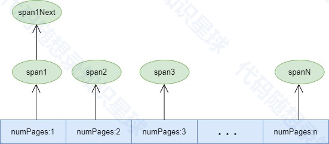

# 页缓存(PageCache)

## 页缓存介绍

### PageCache的定位和职责

PageCache是内存池中的大块内存管理器，主要负责：

```cpp
class PageCache
{
public:
    static const size_t PAGE_SIZE = 4096; // 4K页大小

    static PageCache& getInstance()
    {
        static PageCache instance;
        return instance;
    }

    // 分配指定页数的span
    void* allocateSpan(size_t numPages);

    // 释放span
    void deallocateSpan(void* ptr, size_t numPages);

private:
    PageCache() = default;

    // 向系统申请内存
    void* systemAlloc(size_t numPages); 
private:
    struct Span
    {
        void*  pageAddr; // 页起始地址
        size_t numPages; // 页数
        Span*  next;     // 链表指针
    };

    // 按页数管理空闲span，不同页数对应不同Span链表
    std::map<size_t, Span*> freeSpans_;
    // 页号到span的映射，用于回收
    std::map<void*, Span*> spanMap_;
    std::mutex mutex_;
};
```

1. 系统内存申请
   1. 直接与操作系统交互，通过mmap申请大块内存
   2. 以页(4KB)为单位进行内存管理
   3. 充当内存池与操作系统之间的桥梁
2. 大块内存管理
   1. 管理和组织空闲的内存页
   2. 处理内存的分配和回收
   3. 实现内存页的合并和分割

### 核心功能实现

1. 内存分配流程

```cpp
void* PageCache::allocateSpan(size_t numPages)
{
    // 1. 先从空闲列表中查找
    auto it = freeSpans_.lower_bound(numPages);
    if (it != freeSpans_.end())
    {
        // 2. 如果找到的span过大，进行分割
        if (span->numPages > numPages) 
        {
            // 分割出需要的页数，剩余超出的部分放回空闲列表
        }
        return span->pageAddr;
    }

    // 3. 没有合适的空闲内存，向系统申请
    void* memory = systemAlloc(numPages);
    // ...
}
```

2. 内存回收流程

```cpp
void PageCache::deallocateSpan(void* ptr, size_t numPages)
{
    // 1. 查找要释放的span
    auto it = spanMap_.find(ptr);
    
    // 2. 尝试与相邻的空闲span合并
    void* nextAddr = static_cast<char*>(ptr) + numPages * PAGE_SIZE;
    auto nextIt = spanMap_.find(nextAddr);
    if (nextIt != spanMap_.end())
    {
        // 合并相邻的span
    }

    // 3. 将合并后的span放入空闲列表
    auto& list = freeSpans_[span->numPages];
    span->next = list;
    list = span;
}
```

### 在内存池中的作用

1. 内存层次结构中的角色
   1. 作为最上层的内存管理单元
   2. 为下层的ThreadCache和CentralCache提供内存资源
   3. 管理大块内存的分配和回收
2. 性能优化
   1. 减少系统调用次数
   2. 通过内存复用降低申请开销
   3. 通过合并相邻内存块减少内存碎片
3. 资源管理
   1. 统一管理系统层面的内存资源
   2. 实现内存的按需分配和动态拓展
   3. 提供内存回收和复用机制

## 项目细节思考

#### 向页缓存申请内存都是以页为单位的，为什么要这样呢？有什么好处？

以页为单位进行内存管理有以下几个重要优势：

1. 硬件层面的优化
   1. 现代计算机的内存管理单元(MMU)就是以页为单位进行管理的
   2. 操作系统的虚拟内存系统也是以页为基本单位
   3. 通过与硬件和操作系统的页面管理对齐，可以获得更好的性能
2. 减少内存碎片
   1. 统一使用4KB的页面大小，可以减少内存碎片
   2. 所有分配都对齐到页边界，便于管理和合并
   3. 当释放内存时，更容易将连续的页面合并成更大的块
3. 内存管理效率

```cpp
// 按页数管理空闲span，不同页数对应不同Span链表
std::map<size_t, Span*> freeSpans_;
```

`freeSpans_`空闲`Span`图形化展示:



```
1. 以页为单位可以简化内存管理的复杂度
2. 使用map数据结构可以快速找到合适大小的内存块
3. 便于实现内存的分配和回收算法
```

4\. 缓存友好
1\. 页面大小通常与CPU的缓存行大小有良好的对齐
2\. 有助于提高CPU缓存命中率
3\. 减少TLB(Translation Lookaside Buffer)缺失
5\. 系统调用优化
1\. 使用mmap等系统调用时，以页为单位可以获得最佳性能
2\. 减少系统调用的次数，因为可以一次性申请多个页面
3\. 与操作系统的内存管理机制保持一致
6\. 适应不同大小的内存需求

```cpp
struct Span
{
    void* pageAddr; // 页起始地址
    size_t numPages; // 页数
    Span* next; // 链表指针
};
```

* 可以通过组合多个页面来满足大内存的需求
* 也可以将大的页面分割成小的页面
* 提供了灵活的内存分配策略

这种设计在很多现代的内存分配器中都有采用，比如tcmalloc、jemalloc等。他是在性能、管理效率和系统资源利用之间取得平衡的一种有效方案。

#### 为什么是找到大于等于`numPages`的`freeSpans_`中的空闲链表去分配页内存而不直接找等于`numPages`的空闲链表？

向页缓存申请内存的代码实现：

通过`allocateSpan`向页缓存中申请多少页的页数据就给多少页，`freeSpans_`中的页缓存链表如果只有大于申请页大小的空闲链表，就取出页内存进行切割后再返回。

```cpp
void* PageCache::allocateSpan(size_t numPages)
{
    std::lock_guard<std::mutex> lock(mutex_);

    // 查找合适的空闲span
    // lower_bound函数返回第一个大于等于numPages的元素的迭代器
    auto it = freeSpans_.lower_bound(numPages);
    if (it != freeSpans_.end())
    {
        Span* span = it->second;

        // 将取出的span从原有的空闲链表freeSpans_[it->first]中移除
        if (span->next)
        {
            freeSpans_[it->first] = span->next;
        }
        else
        {
            freeSpans_.erase(it);
        }

        // 如果span大于需要的numPages则进行分割
        if (span->numPages > numPages) 
        {
            Span* newSpan = new Span;
            newSpan->pageAddr = static_cast<char*>(span->pageAddr) + 
                                numPages * PAGE_SIZE;
            newSpan->numPages = span->numPages - numPages;
            newSpan->next = nullptr;

            // 将超出部分放回空闲Span*列表头部
            auto& list = freeSpans_[newSpan->numPages];
            newSpan->next = list;
            list = newSpan;

            span->numPages = numPages;
        }

        // 记录span信息用于回收
        spanMap_[span->pageAddr] = span;
        return span->pageAddr;
    }

    // 没有合适的span，向系统申请
    void* memory = systemAlloc(numPages);
    if (!memory) return nullptr;

    // 创建新的span
    Span* span = new Span;
    span->pageAddr = memory;
    span->numPages = numPages;
    span->next = nullptr;

    // 记录span信息用于回收
    spanMap_[memory] = span;
    return memory;
}
```

**为什么这样设计？**

这是一种常见的内存分配策略，称为“最佳适配”的变体

* 如果只允许完全匹配的大小，会导致内存利用率降低
* 通过允许分割更大的span，可以：
  * 提高内存利用率
  * 减少向系统申请内存的频率
  * 更灵活地满足不同大小的内存请求

#### 为什么页缓存回收内存时要尝试合并?

合并相邻的`span`代码实现：

```cpp
void PageCache::deallocateSpan(void* ptr, size_t numPages)
{
    std::lock_guard<std::mutex> lock(mutex_);

    // 查找对应的span，没找到代表不是PageCache分配的内存，直接返回
    auto it = spanMap_.find(ptr);
    if (it == spanMap_.end()) return;

    Span* span = it->second;

    // 尝试合并相邻的span
    void* nextAddr = static_cast<char*>(ptr) + numPages * PAGE_SIZE;
    auto nextIt = spanMap_.find(nextAddr);
    if (nextIt != spanMap_.end())
    {
        Span* nextSpan = nextIt->second;

        // 从空闲列表中移除下一个span
        // 注意这里是引用
        auto& nextList = freeSpans_[nextSpan->numPages];
        if (nextList == nextSpan) // 如果nextSpan是链表的头节点
        {   // 将nextSpan从链表freeSpans_[nextSpan->numPages]中移除
            nextList = nextSpan->next;
        }
        else // 如果nextSpan不是链表的头节点
        {
            Span* prev = nextList;
            while (prev->next != nextSpan)
                prev = prev->next;
            prev->next = nextSpan->next;
        }

        // 合并span
        span->numPages += nextSpan->numPages;
        spanMap_.erase(nextAddr);
        delete nextSpan;
    }

    // 将合并后的span插入空闲列表
    auto& list = freeSpans_[span->numPages];
    span->next = list;
    list = span;
}
```

**尝试合并相邻的**<code>**span**</code>**有几个重要的意义：**

1. 减少内存碎片

```cpp
// 例如：有两个相邻的 span
// Span1: 2页
// Span2: 3页
// 合并后：
// NewSpan: 5页

// 如果不合并，当需要5页的内存时：
if (request_pages == 5) {
    // 即使总空闲内存足够，但因为碎片化无法满足请求
    // 可能需要向系统申请新内存
}

// 合并后：
if (request_pages == 5) {
    // 可以直接使用合并后的span
    // 避免了向系统申请新内存
}
```

2. 提高大内存分配效率

```cpp
// 不合并的情况
void* allocateSpan(size_t numPages) {
    // 需要遍历多个小span，无法满足大页面请求
    // 最终可能需要向系统申请新内存
}

// 合并后
void* allocateSpan(size_t numPages) {
    // 可能直接找到合适大小的span
    // 减少系统调用，提高性能
}
```

3. 优化内存管理

```cpp
// 合并前，多个小span需要各自维护元数据
struct Span
{
    void* pageAddr; // 每个span都需要这些元数据
    size_t numPages;
    Span* next;
};

// 合并后，减少了元数据开销
// 一个大span替代了多个小span，节省了元数据空间
```

4. 提高缓存效率

```cpp
// 不合并的情况
// 多个小span分散在内存中
// 访问时可能造成多次缓存未命中

// 合并后
// 连续的大span提高了空间局限性
// 有利于CPU缓存的利用
```

5. 系统资源管理

```cpp
// 当span完全空闲且足够大时，可以选择归还给操作系统
if (span->numPages >= RELEASE_THRESHOLD)
{
    // 归还大块内存给操作系统
    munmap(span->pageAddr, span->numPages * PAGE_SIZE);
}
```

**实际例子：**

假设场景如下：

```cpp
// 初始状态：
// Span1: [页0-1]  2页
// Span2: [页2-4]  3页
// Span3: [页5-6]  2页

// 如果释放了Span2，并进行合并：
// 第一次合并：Span1 + Span2 = [页0-4] 5页
// 第二次合并：[页0-4] + Span3 = [页0-6] 7页

// 好处：
1. 可以满足最大7页的内存请求
2. 减少了span的数量，简化管理
3. 提高了内存利用率
4. 减少了内存碎片
```

性能影响：

* 优点：
  * 减少内存碎片
  * 提高大内存分配效率
  * 减少系统调用
  * 优化空间局部性
* 潜在开销：
  * 合并操作本身需要时间
  * 需要维护和搜索相邻span的信息
  * 可能增加锁的持有时间

因此，span合并是一个在时间开销和空间效率之间的权衡，但总体来说，这种合并策略对于内存池的长期运行效率是有益的，特别是在内存使用模式变化较大的场景下。

#### 为什么回收内存时尝试合并的nextSpan需要在spanMap\_中查找，spanMap\_中的span不应该是分配出去还没有回收的吗？

```cpp
 // 尝试合并相邻的span
    void* nextAddr = static_cast<char*>(ptr) + numPages * PAGE_SIZE;
    auto nextIt = spanMap_.find(nextAddr);
    if (nextIt != spanMap_.end())
    {
        Span* nextSpan = nextIt->second;
```

答：解释一下spanMap\_的完整作用：

1. spanMap\_的双重作用

```cpp
// spanMap_不仅记录已分配的span，也记录空闲span
std::map<void*, Span*> spanMap_;
```

* 记录所有由PageCache管理的span（包括已分配和空闲的）
* 用于内存地址到span的快速映射
* 主要用途是内存管理和合并操作

2. 为什么空闲的span也在spanMap\_中？

```cpp
void PageCache::deallocateSpan(void* ptr, size_t numPages)
{
    // ... 
    
    // 1. span被释放后会被放入freeSpans_（空闲列表）
    auto& list = freeSpans_[span->numPages];
    span->next = list;
    list = span;

    // 2. 但span仍然保留在spanMap_中
    // spanMap_[span->pageAddr] = span; // 这个映射关系保持不变
}
```

这样设计的原因：

* 便于快速查找相邻的空闲页面进行合并
* 维护所有内存块的完整映射关系
* 提高内存合并的效率

3. 合并过程示例

假设有以下情况：

```cpp
内存布局：
[Span1: 2页] [Span2: 3页]
当Span1被释放时：
1. Span1保留在spanMap_
2. 检查Span1后面的地址(nextAddr)
3. 在spanMap_中找到了空闲的Span2
4. 可以将Span1和Span2合并
```

两个数据结构相互配合：

* freeSpan\_：管理可用的内存块，按页数大小组织
* spanMap\_：维护地址到span的映射，便于合并操作


> 更新: 2025-07-03 19:41:43  
> 原文: <https://www.yuque.com/chengxuyuancarl/ooq1de/wh2cnq319dqdipl4>