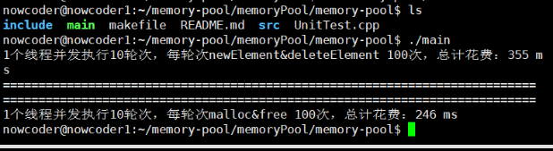
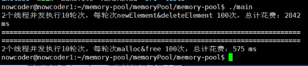
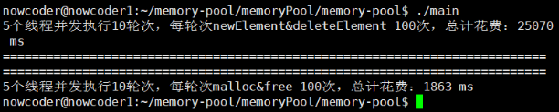
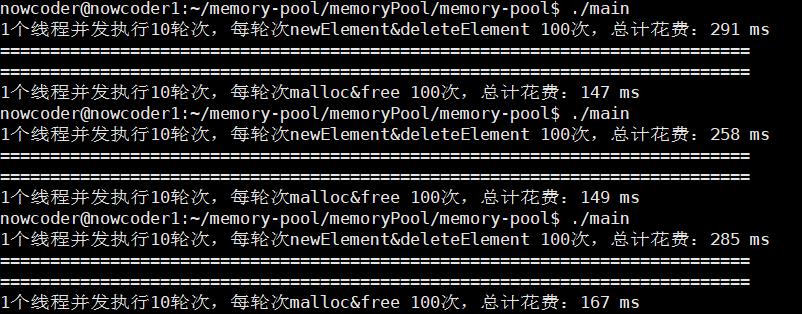
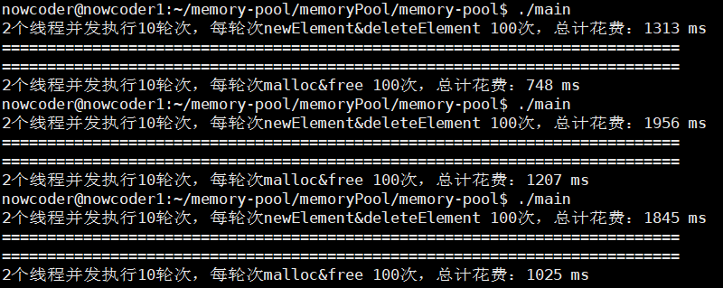
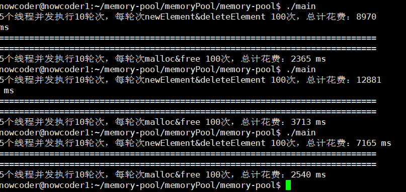
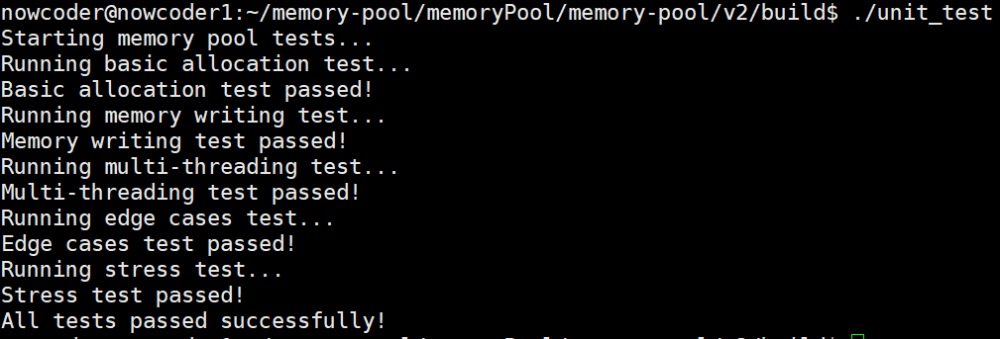
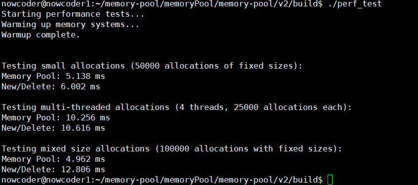
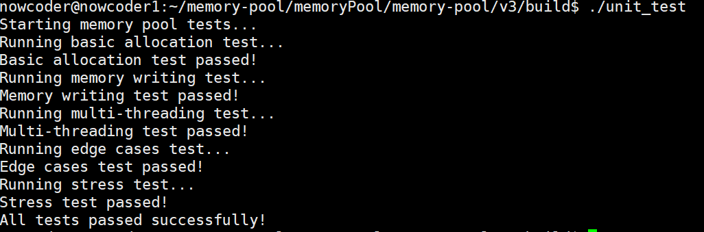
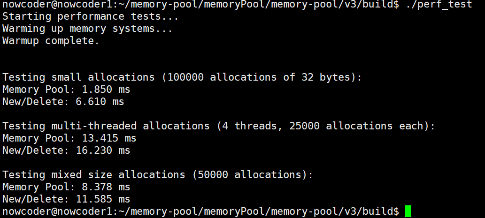

# 5.项目测试

# 内存池版本1测试

## 内存池版本1测试结果

### 内存池优化前测试

单个线程下的测试情况：



两个线程下的测试情况：



五个线程下的测试情况：



### 内存池无锁队列优化后测试结果

1个线程下，测试结果与优化前相差不大：



2个线程，测试结果比优化前快了3倍左右：



5个线程并发执行，测试结果比优化前快了三到四倍：



通过上述测试结果大家可以看出这个内存池的性能甚至不如直接使用系统调用`malloc`和`free`，所以就有了内存池2.0。

## 测试代码

```cpp
#include <iostream>
#include <thread>
#include <vector>

#include "../include/MemoryPool.h"

using namespace memoryPool;

// 测试用例
class P1 
{
    int id_;
};

class P2 
{
    int id_[5];
};

class P3
{
    int id_[10];
};

class P4
{
    int id_[20];
};

// 单轮次申请释放次数 线程数 轮次
void BenchmarkMemoryPool(size_t ntimes, size_t nworks, size_t rounds)
{
	std::vector<std::thread> vthread(nworks); // 线程池
	size_t total_costtime = 0;
	for (size_t k = 0; k < nworks; ++k) // 创建 nworks 个线程
	{
		vthread[k] = std::thread([&]() {
			for (size_t j = 0; j < rounds; ++j)
			{
				size_t begin1 = clock();
				for (size_t i = 0; i < ntimes; i++)
				{
                    P1* p1 = newElement<P1>(); // 内存池对外接口
                    deleteElement<P1>(p1);
                    P2* p2 = newElement<P2>();
                    deleteElement<P2>(p2);
                    P3* p3 = newElement<P3>();
                    deleteElement<P3>(p3);
                    P4* p4 = newElement<P4>();
                    deleteElement<P4>(p4);
				}
				size_t end1 = clock();

				total_costtime += end1 - begin1;
			}
		});
	}
	for (auto& t : vthread)
	{
		t.join();
	}
	printf("%lu个线程并发执行%lu轮次，每轮次newElement&deleteElement %lu次，总计花费：%lu ms\n", nworks, rounds, ntimes, total_costtime);
}

void BenchmarkNew(size_t ntimes, size_t nworks, size_t rounds)
{
	std::vector<std::thread> vthread(nworks);
	size_t total_costtime = 0;
	for (size_t k = 0; k < nworks; ++k)
	{
		vthread[k] = std::thread([&]() {
			for (size_t j = 0; j < rounds; ++j)
			{
				size_t begin1 = clock();
				for (size_t i = 0; i < ntimes; i++)
				{
                    P1* p1 = new P1;
                    delete p1;
                    P2* p2 = new P2;
                    delete p2;
                    P3* p3 = new P3;
                    delete p3;
                    P4* p4 = new P4;
                    delete p4;
				}
				size_t end1 = clock();
				
				total_costtime += end1 - begin1;
			}
		});
	}
	for (auto& t : vthread)
	{
		t.join();
	}
	printf("%lu个线程并发执行%lu轮次，每轮次malloc&free %lu次，总计花费：%lu ms\n", nworks, rounds, ntimes, total_costtime);
}

int main()
{
    HashBucket::initMemoryPool(); // 使用内存池接口前一定要先调用该函数
	BenchmarkMemoryPool(100, 1, 10); // 测试内存池
	std::cout << "===========================================================================" << std::endl;
	std::cout << "===========================================================================" << std::endl;
	BenchmarkNew(100, 1, 10); // 测试 new delete
	
	return 0;
}
```

1. 代码目的\
   这段代码的目的是测试和比较自定义内存池与标准 new/delete 操作在多线程环境下的性能。通过创建多个线程并发地进行内存分配和释放操作，来评估内存池的效率。
2. 关键组件

* 类定义：P1, P2, P3, P4 是用于测试的简单类，分别占用不同大小的内存。
* BenchmarkMemoryPool 函数：测试自定义内存池的性能。
* BenchmarkNew 函数：测试标准 new/delete 的性能。
* main 函数：初始化内存池并调用测试函数。

3. 测试流程
   1. 初始化：在 main 函数中，首先调用 HashBucket::initMemoryPool() 初始化内存池。
   2. 内存池测试：
      1. BenchmarkMemoryPool 函数创建 nworks 个线程。
      2. 每个线程执行 rounds 轮次，每轮次进行 ntimes 次内存分配和释放。
      3. 使用 newElement 和 deleteElement 函数进行内存操作。
      4. 记录并输出总耗时。
   3. 标准分配测试：
      1. BenchmarkNew 函数与 BenchmarkMemoryPool 类似，但使用标准 new 和 delete。
      2. 记录并输出总耗时。
4. 结果分析
   1. 输出格式：%lu个线程并发执行%lu轮次，每轮次newElement\&deleteElement %lu次，总计花费：%lu ms
   2. 比较：通过比较两次测试的总耗时，评估自定义内存池相对于标准 new/delete 的性能优势。
5. 结论
   1. 性能提升：如果自定义内存池的耗时显著低于标准 new/delete，则说明内存池在多线程环境下具有更高的效率。
   2. 优化方向：如果内存池性能不佳，可以考虑优化内存池的实现，如减少锁竞争、提高缓存命中率等。
6. 注意事项
   1. 线程安全：确保内存池实现是线程安全的，避免数据竞争。
   2. 测试环境：在不同硬件和操作系统上测试，可能会得到不同的结果。
   3. 参数调整：可以调整 ntimes, nworks, rounds 参数，观察不同负载下的性能表现。

通过这份教学文档，你应该能够理解这段测试代码的目的、流程和如何分析测试结果。希望这对你理解内存池的性能测试有所帮助！

# 内存池版本2测试

## 内存池版本2测试结果

### 功能测试结果



### 性能测试结果



效率终于比`new/delete`高了!!!

## 测试代码

```cpp

// 计时器类
class Timer 
{
    high_resolution_clock::time_point start;
public:
    Timer() : start(high_resolution_clock::now()) {}
    
    double elapsed() 
    {
        auto end = high_resolution_clock::now();
        return duration_cast<microseconds>(end - start).count() / 1000.0; // 转换为毫秒
    }
};

// 性能测试类
class PerformanceTest 
{
private:
    // 测试统计信息
    struct TestStats 
    {
        double memPoolTime{0.0};
        double systemTime{0.0};
        size_t totalAllocs{0};
        size_t totalBytes{0};
    };

public:
    // 1. 系统预热
    static void warmup() 
    {
        std::cout << "Warming up memory systems...\n";
        // 使用 pair 来存储指针和对应的大小
        std::vector<std::pair<void*, size_t>> warmupPtrs;
        
        // 预热内存池
        for (int i = 0; i < 1000; ++i) 
        {
            for (size_t size : {8, 16, 32, 64, 128, 256, 512, 1024}) {
                void* p = MemoryPool::allocate(size);
                warmupPtrs.emplace_back(p, size);  // 存储指针和对应的大小
            }
        }
        
        // 释放预热内存
        for (const auto& [ptr, size] : warmupPtrs) 
        {
            MemoryPool::deallocate(ptr, size);  // 使用实际分配的大小进行释放
        }
        
        std::cout << "Warmup complete.\n\n";
    }

    // 2. 小对象分配测试
    static void testSmallAllocation() 
    {
        constexpr size_t NUM_ALLOCS = 50000;
        // 使用固定的几个小对象大小，这些大小都是内存池最优化的大小
        const size_t SIZES[] = {8, 16, 32, 64, 128, 256};
        const size_t NUM_SIZES = sizeof(SIZES) / sizeof(SIZES[0]);
        
        std::cout << "\nTesting small allocations (" << NUM_ALLOCS 
                  << " allocations of fixed sizes):" << std::endl;
        
        // 测试内存池
        {
            Timer t;
            // 按大小分类存储内存块
            std::array<std::vector<std::pair<void*, size_t>>, NUM_SIZES> sizePtrs;
            for (auto& ptrs : sizePtrs) {
                ptrs.reserve(NUM_ALLOCS / NUM_SIZES);
            }
            
            for (size_t i = 0; i < NUM_ALLOCS; ++i) 
            {
                // 循环使用不同大小
                size_t sizeIndex = i % NUM_SIZES;
                size_t size = SIZES[sizeIndex];
                void* ptr = MemoryPool::allocate(size);
                sizePtrs[sizeIndex].push_back({ptr, size});
                
                // 模拟真实使用：部分立即释放
                if (i % 4 == 0) 
                {
                    // 随机选择一个大小类别进行释放
                    size_t releaseIndex = rand() % NUM_SIZES;
                    auto& ptrs = sizePtrs[releaseIndex];
                    
                    if (!ptrs.empty()) 
                    {
                        MemoryPool::deallocate(ptrs.back().first, ptrs.back().second);
                        ptrs.pop_back();
                    }
                }
            }
            
            // 清理剩余内存
            for (auto& ptrs : sizePtrs) 
            {
                for (const auto& [ptr, size] : ptrs) 
                {
                    MemoryPool::deallocate(ptr, size);
                }
            }
            
            std::cout << "Memory Pool: " << std::fixed << std::setprecision(3) 
                      << t.elapsed() << " ms" << std::endl;
        }
        
        // 测试new/delete
        {
            Timer t;
            std::array<std::vector<std::pair<void*, size_t>>, NUM_SIZES> sizePtrs;
            for (auto& ptrs : sizePtrs) {
                ptrs.reserve(NUM_ALLOCS / NUM_SIZES);
            }
            
            for (size_t i = 0; i < NUM_ALLOCS; ++i) 
            {
                size_t sizeIndex = i % NUM_SIZES;
                size_t size = SIZES[sizeIndex];
                void* ptr = new char[size];
                sizePtrs[sizeIndex].push_back({ptr, size});
                
                if (i % 4 == 0) 
                {
                    size_t releaseIndex = rand() % NUM_SIZES;
                    auto& ptrs = sizePtrs[releaseIndex];
                    
                    if (!ptrs.empty()) 
                    {
                        delete[] static_cast<char*>(ptrs.back().first);
                        ptrs.pop_back();
                    }
                }
            }
            
            for (auto& ptrs : sizePtrs) 
            {
                for (const auto& [ptr, size] : ptrs) 
                {
                    delete[] static_cast<char*>(ptr);
                }
            }
            
            std::cout << "New/Delete: " << std::fixed << std::setprecision(3) 
                      << t.elapsed() << " ms" << std::endl;
        }
    }
    
    // 3. 多线程测试
    static void testMultiThreaded() 
    {
        constexpr size_t NUM_THREADS = 4;
        constexpr size_t ALLOCS_PER_THREAD = 25000;
        
        std::cout << "\nTesting multi-threaded allocations (" << NUM_THREADS 
                  << " threads, " << ALLOCS_PER_THREAD << " allocations each):" 
                  << std::endl;
        
        auto threadFunc = [](bool useMemPool) 
        {
            std::random_device rd;
            std::mt19937 gen(rd());
            
            // 使用固定的几个大小，这样可以更好地测试内存池的复用能力
            const size_t SIZES[] = {8, 16, 32, 64, 128, 256};
            const size_t NUM_SIZES = sizeof(SIZES) / sizeof(SIZES[0]);
            
            // 每个线程维护自己的内存块列表，按大小分类存储
            std::array<std::vector<std::pair<void*, size_t>>, NUM_SIZES> sizePtrs;
            for (auto& ptrs : sizePtrs) {
                ptrs.reserve(ALLOCS_PER_THREAD / NUM_SIZES);
            }
            
            // 模拟真实应用中的内存使用模式
            for (size_t i = 0; i < ALLOCS_PER_THREAD; ++i) 
            {
                // 1. 分配阶段：优先使用ThreadCache
                size_t sizeIndex = i % NUM_SIZES;  // 循环使用不同大小
                size_t size = SIZES[sizeIndex];
                void* ptr = useMemPool ? MemoryPool::allocate(size) 
                                     : new char[size];
                sizePtrs[sizeIndex].push_back({ptr, size});
                
                // 2. 释放阶段：测试内存复用
                if (i % 100 == 0)  // 每100次分配
                {
                    // 随机选择一个大小类别进行批量释放
                    size_t releaseIndex = rand() % NUM_SIZES;
                    auto& ptrs = sizePtrs[releaseIndex];
                    
                    if (!ptrs.empty()) 
                    {
                        // 释放该大小类别中20%-30%的内存块
                        size_t releaseCount = ptrs.size() * (20 + (rand() % 11)) / 100;
                        releaseCount = std::min(releaseCount, ptrs.size());
                        
                        for (size_t j = 0; j < releaseCount; ++j) 
                        {
                            size_t index = rand() % ptrs.size();
                            if (useMemPool) 
                            {
                                MemoryPool::deallocate(ptrs[index].first, ptrs[index].second);
                            } 
                            else 
                            {
                                delete[] static_cast<char*>(ptrs[index].first);
                            }
                            ptrs[index] = ptrs.back();
                            ptrs.pop_back();
                        }
                    }
                }
                
                // 3. 内存压力测试：测试CentralCache的竞争
                if (i % 1000 == 0)  // 每1000次分配
                {
                    // 短暂地分配大量内存，触发CentralCache的竞争
                    std::vector<std::pair<void*, size_t>> pressurePtrs;
                    for (int j = 0; j < 50; ++j) 
                    {
                        size_t size = SIZES[rand() % NUM_SIZES];
                        void* ptr = useMemPool ? MemoryPool::allocate(size)
                                             : new char[size];
                        pressurePtrs.push_back({ptr, size});
                    }
                    
                    // 立即释放这些内存，测试内存池的回收效率
                    for (const auto& [ptr, size] : pressurePtrs) 
                    {
                        if (useMemPool) 
                        {
                            MemoryPool::deallocate(ptr, size);
                        } 
                        else 
                        {
                            delete[] static_cast<char*>(ptr);
                        }
                    }
                }
            }
            
            // 清理所有剩余内存
            for (auto& ptrs : sizePtrs) 
            {
                for (const auto& [ptr, size] : ptrs) 
                {
                    if (useMemPool) 
                    {
                        MemoryPool::deallocate(ptr, size);
                    } 
                    else 
                    {
                        delete[] static_cast<char*>(ptr);
                    }
                }
            }
        };
        
        // 测试内存池
        {
            Timer t;
            std::vector<std::thread> threads;
            
            for (size_t i = 0; i < NUM_THREADS; ++i) 
            {
                threads.emplace_back(threadFunc, true);
            }
            
            for (auto& thread : threads) 
            {
                thread.join();
            }
            
            std::cout << "Memory Pool: " << std::fixed << std::setprecision(3) 
                      << t.elapsed() << " ms" << std::endl;
        }
        
        // 测试new/delete
        {
            Timer t;
            std::vector<std::thread> threads;
            
            for (size_t i = 0; i < NUM_THREADS; ++i) 
            {
                threads.emplace_back(threadFunc, false);
            }
            
            for (auto& thread : threads) 
            {
                thread.join();
            }
            
            std::cout << "New/Delete: " << std::fixed << std::setprecision(3) 
                      << t.elapsed() << " ms" << std::endl;
        }
    }
    
    // 4. 混合大小测试
    static void testMixedSizes() 
    {
        constexpr size_t NUM_ALLOCS = 100000;
        // 按照内存池的设计特点，将大小分为三类：
        // 1. 小对象: 适合ThreadCache
        // 2. 中等对象: 适合CentralCache
        // 3. 大对象: 适合PageCache
        
        // 使用固定的测试数据
        const size_t SMALL_SIZES[] = {8, 16, 32, 64, 128};
        const size_t MEDIUM_SIZES[] = {256, 384, 512};
        const size_t LARGE_SIZES[] = {1024, 2048, 4096};
        
        const size_t NUM_SMALL = sizeof(SMALL_SIZES) / sizeof(SMALL_SIZES[0]);
        const size_t NUM_MEDIUM = sizeof(MEDIUM_SIZES) / sizeof(MEDIUM_SIZES[0]);
        const size_t NUM_LARGE = sizeof(LARGE_SIZES) / sizeof(LARGE_SIZES[0]);
        
        std::cout << "\nTesting mixed size allocations (" << NUM_ALLOCS 
                  << " allocations with fixed sizes):" << std::endl;
        
        // 测试内存池
        {
            Timer t;
            // 按大小分类存储内存块
            std::array<std::vector<std::pair<void*, size_t>>, NUM_SMALL + NUM_MEDIUM + NUM_LARGE> sizePtrs;
            for (auto& ptrs : sizePtrs) {
                ptrs.reserve(NUM_ALLOCS / (NUM_SMALL + NUM_MEDIUM + NUM_LARGE));
            }
            
            for (size_t i = 0; i < NUM_ALLOCS; ++i) 
            {
                size_t size;
                int category = i % 100;  // 使用循环而不是随机数
                
                if (category < 60) {
                    // 小对象：循环使用固定大小
                    size_t index = (i / 60) % NUM_SMALL;
                    size = SMALL_SIZES[index];
                } else if (category < 90) {
                    // 中等对象：循环使用固定大小
                    size_t index = (i / 30) % NUM_MEDIUM;
                    size = MEDIUM_SIZES[index];
                } else {
                    // 大对象：循环使用固定大小
                    size_t index = (i / 10) % NUM_LARGE;
                    size = LARGE_SIZES[index];
                }
                
                void* ptr = MemoryPool::allocate(size);
                // 计算在sizePtrs中的索引
                size_t ptrIndex = (category < 60) ? (i / 60) % NUM_SMALL :
                                (category < 90) ? NUM_SMALL + (i / 30) % NUM_MEDIUM :
                                NUM_SMALL + NUM_MEDIUM + (i / 10) % NUM_LARGE;
                sizePtrs[ptrIndex].push_back({ptr, size});
                
                // 模拟真实场景：随机释放一些内存
                if (i % 50 == 0) 
                {
                    // 随机选择一个大小类别进行批量释放
                    size_t releaseIndex = rand() % sizePtrs.size();
                    auto& ptrs = sizePtrs[releaseIndex];
                    
                    if (!ptrs.empty()) 
                    {
                        // 释放该大小类别中20%-30%的内存块
                        size_t releaseCount = ptrs.size() * (20 + (rand() % 11)) / 100;
                        releaseCount = std::min(releaseCount, ptrs.size());
                        
                        for (size_t j = 0; j < releaseCount; ++j) 
                        {
                            size_t index = rand() % ptrs.size();
                            MemoryPool::deallocate(ptrs[index].first, ptrs[index].second);
                            ptrs[index] = ptrs.back();
                            ptrs.pop_back();
                        }
                    }
                }
            }
            
            // 清理所有剩余内存
            for (auto& ptrs : sizePtrs) 
            {
                for (const auto& [ptr, size] : ptrs) 
                {
                    MemoryPool::deallocate(ptr, size);
                }
            }
            
            std::cout << "Memory Pool: " << std::fixed << std::setprecision(3) 
                      << t.elapsed() << " ms" << std::endl;
        }
        
        // 测试new/delete
        {
            Timer t;
            std::array<std::vector<std::pair<void*, size_t>>, NUM_SMALL + NUM_MEDIUM + NUM_LARGE> sizePtrs;
            for (auto& ptrs : sizePtrs) {
                ptrs.reserve(NUM_ALLOCS / (NUM_SMALL + NUM_MEDIUM + NUM_LARGE));
            }
            
            for (size_t i = 0; i < NUM_ALLOCS; ++i) 
            {
                size_t size;
                int category = i % 100;
                
                if (category < 60) {
                    size_t index = (i / 60) % NUM_SMALL;
                    size = SMALL_SIZES[index];
                } else if (category < 90) {
                    size_t index = (i / 30) % NUM_MEDIUM;
                    size = MEDIUM_SIZES[index];
                } else {
                    size_t index = (i / 10) % NUM_LARGE;
                    size = LARGE_SIZES[index];
                }
                
                void* ptr = new char[size];
                size_t ptrIndex = (category < 60) ? (i / 60) % NUM_SMALL :
                                (category < 90) ? NUM_SMALL + (i / 30) % NUM_MEDIUM :
                                NUM_SMALL + NUM_MEDIUM + (i / 10) % NUM_LARGE;
                sizePtrs[ptrIndex].push_back({ptr, size});
                
                if (i % 50 == 0) 
                {
                    size_t releaseIndex = rand() % sizePtrs.size();
                    auto& ptrs = sizePtrs[releaseIndex];
                    
                    if (!ptrs.empty()) 
                    {
                        size_t releaseCount = ptrs.size() * (20 + (rand() % 11)) / 100;
                        releaseCount = std::min(releaseCount, ptrs.size());
                        
                        for (size_t j = 0; j < releaseCount; ++j) 
                        {
                            size_t index = rand() % ptrs.size();
                            delete[] static_cast<char*>(ptrs[index].first);
                            ptrs[index] = ptrs.back();
                            ptrs.pop_back();
                        }
                    }
                }
            }
            
            for (auto& ptrs : sizePtrs) 
            {
                for (const auto& [ptr, size] : ptrs) 
                {
                    delete[] static_cast<char*>(ptr);
                }
            }
            
            std::cout << "New/Delete: " << std::fixed << std::setprecision(3) 
                      << t.elapsed() << " ms" << std::endl;
        }
    }
};

int main() 
{
    std::cout << "Starting performance tests..." << std::endl;
    
    // 预热系统
    PerformanceTest::warmup();
    
    // 运行测试
    PerformanceTest::testSmallAllocation();
    PerformanceTest::testMultiThreaded();
    PerformanceTest::testMixedSizes();
    
    return 0;
}
```

### 测试概述

#### 整体结构

这是一个内存池的性能测试程序，主要包含两个类：

* Timer：计时器类，用于测量代码执行时间
* PerformanceTest：主要的测试类，包含多个测试场景

#### 测试场景

代码包含4个主要的测试场景：

a) 预热测试 (warmup)

```cpp
static void warmup()
```

* 目的：预热系统，避免首次运行的性能偏差
* 进行1000次循环，每次分配8-1024字节不等的内存
* 分配后立即释放，确保系统处于稳定状态

b) 小对象分配测试 (testSmallAllocation)

```cpp
static void testSmallAllocation()
```

* 测试小内存块的分配性能
* 固定大小：8, 16, 32, 64, 128, 256字节
* 总共进行50000次分配
* 每4次分配会随机释放一些内存
* 分别对比内存池和系统new/delete的性能

c) 多线程测试 (testMultiThreaded)

```cpp
static void testMultiThreaded()
```

* 使用4个线程并发测试
* 每个线程进行25000次分配
* 模拟真实场景：
  * 定期释放部分内存（每100次分配）
  * 进行内存压力测试（每1000次分配）
* 测试线程安全性和并发性能

d) 混合大小测试 (testMixedSizes)

```cpp
static void testMixedSizes()
```

* 测试不同大小内存块的分配性能
* 分为三类大小：
  * 小对象：8-128字节（60%的分配）
  * 中等对象：256-512字节（30%的分配）
  * 大对象：1024-4096字节（10%的分配）
* 总共进行100000次分配
* 模拟真实使用场景，定期释放内存

#### 测试特点

* 每个测试都会同时对比内存池和系统默认分配器的性能
* 使用毫秒作为计时单位
* 包含了内存的分配和释放操作
* 模拟了真实应用场景的内存使用模式

#### 使用方法

```cpp
int main() 
{
    PerformanceTest::warmup();              // 先进行系统预热
    PerformanceTest::testSmallAllocation(); // 测试小对象分配
    PerformanceTest::testMultiThreaded();   // 测试多线程性能
    PerformanceTest::testMixedSizes();      // 测试混合大小分配
}
```

#### 关键设计点

* 使用固定大小的内存块进行测试，便于对比和分析
* 通过不同的释放策略测试内存复用效率
* 通过多线程测试验证并发性能
* 模拟不同的使用场景，更接近实际应用

这个测试程序设计得非常全面，能够有效地测试内存池在各种场景下的性能表现。通过这些测试，我们可以：

* 评估内存池的分配/释放性能
* 验证内存池的线程安全性
* 测试不同大小内存块的处理效率
* 对比与系统默认分配器的性能差异

# 内存池版本3测试

## 内存池版本3测试结果

### 功能测试结果



### 性能测试结果

测试结果表明内存池版本3的性能要略好于内存池版本2



## 测试代码

与内存池版本2测试代码相同


> 更新: 2025-06-23 17:53:42  
> 原文: <https://www.yuque.com/chengxuyuancarl/ooq1de/pc0odubctz8doq1f>