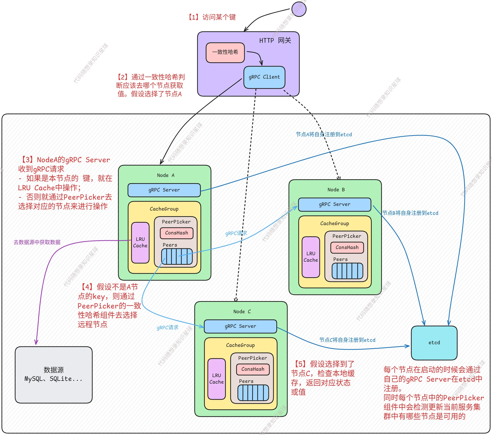

# 0. 项目整体架构

## 架构图



架构图中只演示了获取键（`Get(key)`）的对应操作，不过 `Set`、`Delete` 操作也差不多，只是底层逻辑会不同一些。

## 项目中的核心组件

1. **RU Cache 本地缓存**

`Cache` 组件管理本地存储的缓存数据，底层采用 LRU 算法

```
- 提供线程安全的缓存访问
- 管理统计信息（命中、未命中）
```

2\. **一致性哈希**

使用一致性哈希确定哪个节点负责哪个键，确保键值的均匀分布，并在添加或移除节点时最小化重新分布。

3. **SingleFlight**

通过 SingleFlight 机制来合并重复请求，当多个并发请求同时访问同一个缓存资源时，只让第一个请求执行实际操作，其他请求等待该操作完成后直接复用结果。

4. **Group 缓存组**

`Group` 是缓存的逻辑命名空间，**是缓存操作的主要接口**。外部可通过 rpc 来使用缓存节点，Group 会去执行对应的操作。

主要职责：

```
- 管理缓存数据的逻辑命名空间
- 协调本地缓存和远程节点之间的访问（例如需要访问远程节点时会利用 PeerPicker 来选择）
- 处理缓存操作（Get、Set、Delete）
- 使用 singleflight 模式防止缓存击穿
```

5\. **gRPC Server**

每个节点都会跑一个 gRPC server，每个节点既是一个客户端也是服务端。

```
- 处理其他节点的请求（其他节点在没有缓存某些键的时候会访问含有这个键的节点）
- 向服务注册中心（etcd）注册自己
- 管理服务器生命周期
```

6\. **服务注册与发现**

项目使用 etcd 进行服务发现。每个节点启动时向 etcd 注册自己（通过 gRPC Server），同时节点通过监听 etcd 变化发现可用的 peer 节点。

7. **网关服务**

HTTP 网关通过 etcd 自动发现可用的缓存节点，并通过 gRPC 与它们通信，为外部客户端提供标准的REST API接口；同时使用一致性哈希分布键值，并监听 etcd 的键值对变化，用来负责节点的一致性哈希管理与节点的负载均衡。


> 更新: 2025-10-15 10:52:00  
> 原文: <https://www.yuque.com/chengxuyuancarl/vv9v2t/nuyxg65ac2b0y4b1>