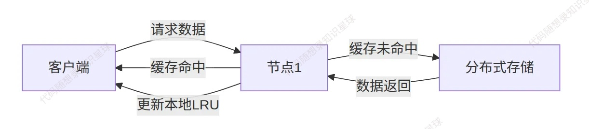

# 1. LRU缓存

<font style="color:rgb(64, 64, 64);">在分布式缓存系统中，LRU（Least Recently Used）策略发挥着关键作用。每个节点独立管理本地内存，我们不会将所有数据都放入缓存中， LRU确保有限内存空间</font>**<font style="color:rgb(64, 64, 64);">优先存储最热数据</font>**<font style="color:rgb(64, 64, 64);">，同时也避免集群中所有节点同时缓存相同冷数据造成的资源浪费。</font>



## 数据封装：ByteView

在 kcache 中，数据使用 `ByteView` 来封装：

```cpp
struct ByteView {
    std::vector<char> data_{};

    ByteView(const std::string& str) {
        data_.resize(str.size());
        std::copy(str.begin(), str.end(), data_.begin());
    }

    auto Len() const -> int64_t { return data_.size(); }

    auto ToString() const -> std::string { return std::string(data_.begin(), data_.end()); }
};

using ByteViewOptional = std::optional<ByteView>;

```

## 键值对存储单元：Entry

在我们的分布式缓存中，请求响应数据采用的是键值对的格式。

```cpp
struct Entry {
    std::string key_;
    ByteView value_;

    Entry(std::string k, const ByteView& v) : key_(std::move(k)), value_(v) {}

    auto operator==(const Entry& entry) const -> bool {
        return key_ == entry.key_ && value_.ToString() == entry.value_.ToString();
    }
};
```

`Entry` 是缓存中存储数据的基本单位，包含：

* key\_：字符串类型的键
* value\_：ByteView 类型的值

<font style="color:rgb(64, 64, 64);">缓存算法使用的是 LRU，当访问或更新缓存时，对应的 Entry 会被移动到链表头部，表示最近使用；当缓存满时，链表尾部的 Entry（最久未使用）会被淘汰。</font>

## 底层的缓存实现：LRUCache

<font style="color:rgb(64, 64, 64);">LRU（Least Recently Used）缓存的实现核心是</font>**<font style="color:rgb(64, 64, 64);">哈希表+双向链表</font>**<font style="color:rgb(64, 64, 64);">的组合，我们采用 STL 中的  </font><code><font style="color:rgb(64, 64, 64);">std::unordered_map</font></code><font style="color:rgb(64, 64, 64);"> 和 </font><code><font style="color:rgb(64, 64, 64);">std::list</font></code><font style="color:rgb(64, 64, 64);"> 来实现，同时要向上层提供操作接口 Get、Set、Delete：</font>

```cpp
// src/include/kcache/cache.h

class LRUCache {
    using EvictedFunc = std::function<void(std::string, ByteView)>;
    using ListElementIter = std::list<Entry>::iterator;

public:
    LRUCache(int max_bytes, const EvictedFunc& evicted_func = nullptr)
        : max_bytes_(max_bytes), evicted_func_(evicted_func) {}

    auto Get(const std::string& key) -> ByteViewOptional;
    void Set(const std::string& key, const ByteView&);
    void Delete(const std::string& key);
    void RemoveOldest();

private:
    int64_t bytes_ = 0;
    int64_t max_bytes_;
    EvictedFunc evicted_func_;

    std::unordered_map<std::string, ListElementIter> cache_;
    std::list<Entry> list_;
    std::mutex mtx_;
};
```

其中：

* <code><font style="color:rgb(38, 44, 49);">std::</font><font style="color:rgb(0, 79, 180);">list</font><font style="color:rgb(38, 44, 49);"><</font><font style="color:rgb(0, 79, 180);">Entry</font><font style="color:rgb(38, 44, 49);">> </font><font style="color:rgb(140, 72, 231);">list_</font><font style="color:rgb(38, 44, 49);">;</font></code><font style="color:rgb(38, 44, 49);">：维护缓存条目的访问顺序，链表头部存放最近访问的元素，链表尾部存放最久未访问的元素；</font>
* <code><font style="color:rgb(38, 44, 49);">std::</font><font style="color:rgb(0, 79, 180);">unordered_map</font><font style="color:rgb(38, 44, 49);"><std::</font><font style="color:rgb(0, 79, 180);">string</font><font style="color:rgb(38, 44, 49);">,</font><font style="color:rgb(0, 79, 180);">ListElementIter</font><font style="color:rgb(38, 44, 49);">> </font><font style="color:rgb(140, 72, 231);">cache_</font><font style="color:rgb(38, 44, 49);">;</font></code><font style="color:rgb(38, 44, 49);">：key 为缓存的键，value 指向 </font><code><font style="color:rgb(38, 44, 49);">list_</font></code><font style="color:rgb(38, 44, 49);">中对应元素的迭代器；</font>

### <font style="color:rgb(38, 44, 49);">Get 实现</font>

```cpp
auto LRUCache::Get(const std::string& key) -> ByteViewOptional {
    std::lock_guard lock{mtx_};
    if (cache_.find(key) == cache_.end()) {
        return std::nullopt;
    }
    auto ele = cache_[key];
    auto [k, value] = *ele;
    list_.erase(ele);
    list_.emplace_front(key, value);
    cache_[key] = list_.begin();
    return value;
}
```

### Set 实现

在 Set 中，缓存数据可能已经存在也可能需要新插入。如果已经存在，需要调整数据在 `list_` 中的位置，设置 `cache_` 中对应的值，并且还要注意调整缓存已有数据的大小。

```cpp
void LRUCache::Set(const std::string& key, const ByteView& value) {
    std::lock_guard lock{mtx_};
    if (cache_.find(key) != cache_.end()) {
        // remove old
        auto ele = cache_[key];
        bytes_ += value.Len() - ele->value_.Len();
        list_.erase(ele);
    } else {
        bytes_ += key.size() + value.Len();
    }
    // insert new
    list_.emplace_front(key, value);
    cache_[key] = list_.begin();

    while (max_bytes_ != 0 && bytes_ > max_bytes_ && !list_.empty()) {
        RemoveOldest();
    }
}
```

在设置新的缓存数据时，可能会超过设置容量的大小，需要去淘汰最久未使用的数据：

```cpp
void LRUCache::RemoveOldest() {
    if (list_.empty()) {
        return;
    }
    auto [key, value] = list_.back();
    cache_.erase(key);
    list_.pop_back();
    bytes_ -= key.size() + value.Len();
    if (evicted_func_) {
        evicted_func_(key, value);
    }
}
```

### Delete 实现

```cpp
void LRUCache::Delete(const std::string& key) {
    std::lock_guard lock{mtx_};
    if (cache_.find(key) == cache_.end()) {
        return;
    }
    auto elem_iter = cache_[key];
    auto [_, value] = *elem_iter;
    list_.erase(elem_iter);
    cache_.erase(key);
    bytes_ -= key.size() + value.Len();
    if (evicted_func_) {
        evicted_func_(key, value);
    }
}
```


> 更新: 2025-07-20 15:24:30  
> 原文: <https://www.yuque.com/chengxuyuancarl/vv9v2t/ixl68uwchuu6wcl5>