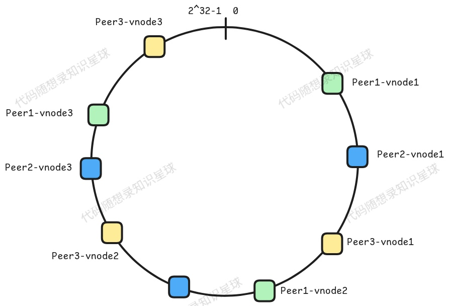
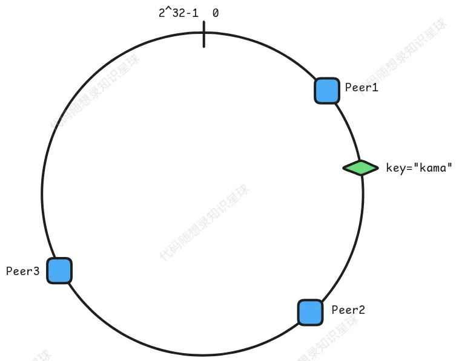

# 2. 一致性哈希

一致性哈希是分布式系统中使用的一种技术，用于在多个节点之间分发数据，以最大限度地减少添加或删除节点时的重组。



当节点数量发生变化时，使用 `hash(key) % n`（其中 n 是节点数）的传统基于哈希的分发会遇到重大的重新分发问题。一致性哈希通过确保在节点计数更改时只需要重新映射一小部分键来解决此问题。

一致性哈希的大致架构用上图就能说明：由一个 `[0, 2^32-1]` 的“线”围成了一个环，对于分布式系统中的每个真实物理节点，都会映射成多个虚拟节点（如上图中使用了 3 个物理节点，这三个物理节点又各自映射了三个虚拟节点），对这些虚拟节点的标识进行哈希运算，就可以得到一个 `[0, 2^32-1]`之间的值。如果把刚刚说的“线”用数组来表示，那么虚拟节点哈希后的值就是这个数组中的一个元素。

当有新节点时或者原有节点 node 发生故障，需要调整只有 node 附近的 key 所属。

> 对于为什么需要一致性哈希，更具体的说明可以看 Go 版本中的 [6. 分布式算法之一致性哈希](https://www.yuque.com/chengxuyuancarl/wk9epc/eu6rmdg3buiq8szp#1-%E4%B8%BA%E4%BB%80%E4%B9%88%E4%BD%BF%E7%94%A8%E4%B8%80%E8%87%B4%E6%80%A7%E5%93%88%E5%B8%8C)，这里就不再赘述了。

## ConsistentHashMap 类

在 KCache 中，一致性哈希是在 `ConsistentHashMap` 类中实现的，它创建了一个“哈希环”，其中节点和键都被映射，每个键都分配给围绕此环顺时针方向最近的节点。

```cpp
// 一致性哈希配置
struct HashConfig {
    // 每个真实节点对应的虚拟节点数
    int replicas;
    // 最小虚拟节点数
    int min_replicas;
    // 最大虚拟节点数
    int max_replicas;
    // 哈希函数
    std::function<uint32_t(const std::string&)> hash_func;
    // 负载均衡阈值，超过此值触发虚拟节点调整
    double load_balance_threshold;
};

// DefaultConfig 默认配置
const HashConfig kDefaultConfig = {
    10,   10, 200, Crc32IEEE,
    0.25,  // 25% 的负载不均衡度触发调整
};

// Map 一致性哈希实现
class ConsistentHashMap {
public:
    // New 创建一致性哈希实例
    explicit ConsistentHashMap(HashConfig cfg = kDefaultConfig);

    // 析构函数，确保负载均衡器线程正确停止
    ~ConsistentHashMap();

    // Add 添加节点
    // 返回 true 表示成功，false 表示失败
    bool Add(const std::vector<std::string>& nodes);

    // Remove 移除节点
    // 返回 true 表示成功，false 表示失败
    bool Remove(const std::string& node);

    // Get 获取节点
    auto Get(const std::string& key) -> std::string;

    // GetStats 获取负载统计信息
    auto GetStats() -> std::unordered_map<std::string, double>;

private:
    // addNode 添加节点的虚拟节点
    void AddNode(const std::string& node, int replicas);

    // checkAndRebalance 检查并重新平衡虚拟节点
    void CheckAndRebalance();

    // rebalanceNodes 重新平衡节点
    void RebalanceNodes();

    // startBalancer 启动负载均衡器线程
    void StartBalancer();

private:
    mutable std::shared_mutex mtx_;  // 读写互斥量，类似于 Go 的 sync.RWMutex
    // 配置信息
    HashConfig config_;

    // 哈希环
    std::vector<uint32_t> keys_;
    // 哈希环到节点的映射
    std::unordered_map<uint32_t, std::string> hash_map_;
    // 节点到虚拟节点数量的映射
    std::unordered_map<std::string, int> node_replicas_;
    // 节点负载统计
    // 使用 std::atomic<long long> 保证对 nodeCounts 中每个节点计数的原子操作
    std::unordered_map<std::string, std::atomic<long long>> node_counts_;
    // 总请求数
    std::atomic<long long> total_requests_;

    std::thread balancer_thread_;         // 负载均衡器线程
    std::atomic<bool> is_balancer_stop_;  // 控制负载均衡器线程停止的标志
};
```

## 虚拟节点

通常，对于一个缓存节点（即物理节点）来说，会在一致性哈希中创建多个**虚拟节点**，这是为了：

1. **均匀分布数据**：虚拟节点通过为每个真实节点创建多个虚拟节点，增加了哈希环上的节点数，使得数据分布更加均匀，避免了因真实节点数量少而导致的负载不均衡；
2. **减少数据迁移**：当节点增减时，使用虚拟节点可以限制数据迁移的范围。每个虚拟节点只负责一小部分数据，因此节点变化时，只有附近的虚拟节点需要重新分配数据，减少了整体迁移量；
3. **提升扩展性**：虚拟节点允许系统在不重新哈希所有数据的情况下扩展。新增节点时，只需为其创建虚拟节点，数据迁移范围受限，系统扩展更加灵活；
4. **平衡负载**：通过虚拟节点，真实节点的负载被分散到多个虚拟节点，避免了某些节点过载的情况，提高了系统的整体负载平衡。

在我们的分布式缓存的一致性哈希中，对于给定的一个 key（string 类型），会返回一个 value（ByteView 类型），这个流程如下：

1. 每一个物理节点对应的 key 在项目中设置为 `key = "ip:port"`，在创建对应的虚拟节点时，采用 `key-i`的格式来给虚拟节点设置键；

> 举个🌰：
>
> 假设当前物理节点为 `127.0.0.1:8001`，默认一个物理节点对应 3 个虚拟节点，那么这三个虚拟节点分别为：`127.0.0.1:8001-0`，`127.0.0.1:8001-1`，`127.0.0.1:8001-2`

2. 使用配置的哈希函数对此组合字符串进行哈希处理，项目中默认使用的是 `std::hash<std::string>{}`，也可以自定义哈希函数；
3. 将节点对应的哈希值存储在 `keys_` 中，这也就是放入了哈希环中；
4. 创建从 hash 值到节点 key 的映射。

对应的代码如下：

```cpp
for (int i = 0; i < replicas; ++i) {
    std::string hash_key = fmt::format("{}-{}", key, std::to_string(i));
    int hash = static_cast<int>(config_.hash_func(hash_key));
    if (hash_map_.find(hash) != hash_map_.end()) {
        continue;
    }
    keys_.push_back(hash);
    hash_map_[hash] = key;
}
```

## 添加节点操作

每当到来一个新的（物理）节点时，原本存在的节点都会通过 etcd 得知消息，**然后每个节点都会**\*\*<font style="color:#DF2A3F;">更新自己的</font>\*\***一致性哈希环**。

⭐是的，每个节点都会有一个一致性哈希环，不过不用担心他们之间的内容会不一致，因为每个节点都会使用 etcd 去监测是否有新的节点到来，同时也监测现在有哪些节点，然后去更新哈希环。

<u>监测和同步的问题放到后面的章节再聊</u>，先看看 `ConsistentHashMap`是如何添加节点的：

```cpp
void ConsistentHashMap::AddNode(const std::string& node, int replicas) {
    for (int i = 0; i < replicas; ++i) {
        std::string hash_key = fmt::format("{}-{}", node, std::to_string(i));
        int hash = static_cast<int>(config_.hash_func(hash_key));
        if (hash_map_.find(hash) != hash_map_.end()) {
            continue;
        }
        keys_.push_back(hash);
        hash_map_[hash] = node;
    }
    node_replicas_[node] = replicas;
    // 如果节点是新添加的，初始化其计数器
    if (node_counts_.find(node) == node_counts_.end()) {
        node_counts_[node] = 0;
    }
}

bool ConsistentHashMap::Add(const std::vector<std::string>& nodes) {
    if (nodes.empty()) {
        return false;
    }

    std::unique_lock lock{mtx_};  // 获取写锁

    for (const auto& node : nodes) {
        if (node.empty()) {
            continue;
        }
        // 为节点添加虚拟节点
        AddNode(node, config_.replicas);
    }

    // 重新排序哈希环
    std::sort(keys_.begin(), keys_.end());
    return true;
}
```

每个节点假设都有一个 `cons_hash_map`变量，那么每当需要添加节点时：

```cpp
cons_hash_map.Add({"node1", "node2", "node3"});
```

## 删除节点操作

当我们需要删除一个节点时，也就是要**删除它在哈希环中对应的所有虚拟节点**。和刚刚的添加节点逻辑比较像，根据虚拟节点的 key 值去操作 `keys_` 和 `hash_map_`。

```cpp
bool ConsistentHashMap::Remove(const std::string& node) {
    if (node.empty()) {
        return false;
    }

    std::unique_lock lock{mtx_};  // 获取写锁

    auto it_replicas = node_replicas_.find(node);
    if (it_replicas == node_replicas_.end()) {
        return false;  // 节点未找到
    }

    int replicas = it_replicas->second;

    // 🌟 移除节点的所有虚拟节点
    for (int i = 0; i < replicas; ++i) {
        std::string hash_key = fmt::format("{}-{}", node, std::to_string(i));
        int hash = static_cast<int>(config_.hash_func(hash_key));
        hash_map_.erase(hash);  // 从哈希映射中移除
        // 从哈希环中移除哈希值
        auto it = std::remove(keys_.begin(), keys_.end(), hash);
        keys_.erase(it, keys_.end());
    }

    node_replicas_.erase(node);
    node_counts_.erase(node);  // 从负载统计中移除
    return true;
}
```

## 获取节点操作

<code><font style="color:rgb(38, 44, 49);">ConsistentHashMap::</font><font style="color:rgb(35, 41, 48);">Get</font></code> 根据给定的键找到对应的节点。



如上图，假设我们有一个键为“**kama**”，那么按照一致性哈希的原理，缓存了这个键对应的值的应该是节点 **Peer2**。在代码实现时原理为：

1. **参数验证与锁机制**：先检查输入键是否为空，使用共享读锁允许多个线程同时读取，提高并发性能
2. **边界检查**：确保哈希环上至少有一个节点
3. **哈希计算**：将输入的键通过配置的哈希函数映射到哈希环上的位置
4. **二分查找**：找到第一个大于等于目标哈希值的位置，这实现了哈希环上的"顺时针查找"
5. **环形处理**：当哈希值超过所有节点位置时，需要"绕回"到环的开始，这体现了一致性哈希的环形特性
6. **节点映射**：通过哈希位置获取对应的节点名称

```cpp
auto ConsistentHashMap::Get(const std::string& key) -> std::string {
    if (key.empty()) {
        return "";
    }

    std::shared_lock lock{mtx_};  // 获取读锁

    if (keys_.empty()) {
        return "";
    }

    int hash = static_cast<int>(config_.hash_func(key));
    // 二分查找：找到第一个大于等于 hash 的位置
    auto it = std::lower_bound(keys_.begin(), keys_.end(), hash);

    // 处理边界情况：如果到了末尾，则回到开头
    if (it == keys_.end()) {
        it = keys_.begin();
    }

    std::string node = hash_map_[*it];
    // 增加节点计数和总请求数，这里使用原子操作
    ++node_counts_[node];
    ++total_requests_;

    return node;
}
```

## 负载均衡

一致性哈希实现中的负载均衡是一个动态自适应系统，**通过监控节点访问情况并调整虚拟节点数量来实现负载均衡**。

> 这里的负载均衡的算法和 Go 版本中的是一致的，只是用 C++来实现的。

### 用于统计的变量

在 `ConsistentHashMap` 中有两个成员变量：

```cpp
class ConsistentHashMap {
    ...
private:
    ...
    // 节点负载统计 - 每个节点的访问次数
    std::unordered_map<std::string, std::atomic<long long>> node_counts_;
    // 总请求数
    std::atomic<long long> total_requests_;
};
```

每次调用 `ConsistentHashMap::Get` 时都会更新统计：

```cpp
++node_counts_[node];  // 节点访问计数
++total_requests_;     // 总请求计数
```

### 后台监控

当我们创建一个一致性哈希组件时，都会在后台启动一个线程来监控：

```cpp
void ConsistentHashMap::StartBalancer() {
    is_balancer_stop_ = false;
    balancer_thread_ = std::thread{[this] {
        while (!is_balancer_stop_) {
            std::this_thread::sleep_for(std::chrono::seconds(1));  // 每秒检查一次
            if (!is_balancer_stop_) {                              // 再次检查，防止在 sleep 期间被要求停止
                CheckAndRebalance();
            }
        }
    }};
}
```

### 负载不均衡检测

1. **<font style="color:rgb(0, 0, 0) !important;">触发条件检查</font>**<font style="color:rgba(0, 0, 0, 0.85) !important;">：</font>
   * <font style="color:rgba(0, 0, 0, 0.85) !important;">当总请求数少于 1000 时，认为样本量不足，不进行负载均衡调整。</font>
   * <font style="color:rgba(0, 0, 0, 0.85) !important;">通过读锁安全访问节点信息（</font><code><font style="color:rgb(0, 0, 0);">node_replicas_</font></code><font style="color:rgba(0, 0, 0, 0.85) !important;"> </font><font style="color:rgba(0, 0, 0, 0.85) !important;">和</font><font style="color:rgba(0, 0, 0, 0.85) !important;"> </font><code><font style="color:rgb(0, 0, 0);">node_counts_</font></code><font style="color:rgba(0, 0, 0, 0.85) !important;">）。</font>
2. **<font style="color:rgb(0, 0, 0) !important;">计算负载均衡度</font>**<font style="color:rgba(0, 0, 0, 0.85) !important;">：</font>
   * <font style="color:rgba(0, 0, 0, 0.85) !important;">计算平均负载：</font><code><font style="color:rgb(0, 0, 0);">avg_load = 总请求数 / 节点数</font></code><font style="color:rgba(0, 0, 0, 0.85) !important;">。</font>
   * <font style="color:rgba(0, 0, 0, 0.85) !important;">遍历所有节点，计算每个节点的负载与平均负载的差异百分比（</font><code><font style="color:rgb(0, 0, 0);">diff / avg_load</font></code><font style="color:rgba(0, 0, 0, 0.85) !important;">）。</font>
   * <font style="color:rgba(0, 0, 0, 0.85) !important;">记录最大差异百分比</font><font style="color:rgba(0, 0, 0, 0.85) !important;"> </font><code><font style="color:rgb(0, 0, 0);">max_diff</font></code><font style="color:rgba(0, 0, 0, 0.85) !important;">，作为负载不均衡度的指标。</font>
3. **<font style="color:rgb(0, 0, 0) !important;">触发重平衡</font>**<font style="color:rgba(0, 0, 0, 0.85) !important;">：</font>
   * <font style="color:rgba(0, 0, 0, 0.85) !important;">当 </font><code><font style="color:rgb(0, 0, 0);">max_diff</font></code><font style="color:rgba(0, 0, 0, 0.85) !important;"> 超过配置的阈值（</font><code><font style="color:rgb(0, 0, 0);">config_.load_balance_threshold</font></code><font style="color:rgba(0, 0, 0, 0.85) !important;">）时，调用 </font><code><font style="color:rgb(0, 0, 0);">RebalanceNodes()</font></code><font style="color:rgba(0, 0, 0, 0.85) !important;"> 进行重平衡。</font>

```cpp
void ConsistentHashMap::CheckAndRebalance() {
    // 样本量检查
    if (total_requests_.load() < 1000) {
        return;  // 样本太少，不进行调整
    }

    std::shared_lock lock{mtx_};

    if (node_replicas_.empty()) {
        return;
    }

    // 计算系统平均负载：总请求数 / 物理节点数量
    long long current_total_requests = total_requests_.load();
    double avg_load = static_cast<double>(current_total_requests) / node_replicas_.size();
    double max_diff = 0.0;

    // 遍历所有节点计算负载偏差，并记录最大相对偏差
    for (auto const& [node, count] : node_counts_) {
        double diff = std::abs(static_cast<double>(count.load()) - avg_load);
        if (avg_load > 0) {
            if (diff / avg_load > max_diff) {
                max_diff = diff / avg_load;
            }
        } else if (diff > 0) {  // If avgLoad is 0 but there are counts, it's imbalanced
            max_diff = 1.0;     // Max imbalance
        }
    }
    lock.unlock();  // 释放读锁，因为 RebalanceNodes 需要写锁

    // 当最大相对偏差超过配置阈值时触发再平衡，调整虚拟节点
    if (max_diff > config_.load_balance_threshold) {
        RebalanceNodes();
    }
}
```

> ***<font style="color:rgba(0, 0, 0, 0.85);">在遍历所有节点计算负载偏差时，当 </font>***<code>_**<font style="color:rgba(0, 0, 0, 0.85);">avg_load</font>**_</code>***<font style="color:rgba(0, 0, 0, 0.85);"> 为 0 但节点有请求（即 </font>***<code>_**<font style="color:rgba(0, 0, 0, 0.85);">diff > 0</font>**_</code>***<font style="color:rgba(0, 0, 0, 0.85);">）时，为什么要将 </font>***<code>_**<font style="color:rgba(0, 0, 0, 0.85);">max_diff</font>**_</code>***<font style="color:rgba(0, 0, 0, 0.85);"> 赋值为 1.0？</font>***

<font style="color:rgba(0, 0, 0, 0.85) !important;">当 </font><code><font style="color:rgba(0, 0, 0, 0.85) !important;">avg_load = 0</font></code><font style="color:rgba(0, 0, 0, 0.85) !important;"> 时</font><font style="color:rgb(0, 0, 0) !important;">，意味着总请求数为 0，所有节点的理想请求数都应该是 0。但如果某个节点的 count（请求数）却大于 0，</font>**<font style="color:rgb(0, 0, 0) !important;">这就表明存在不一致或异常</font>**<font style="color:rgb(0, 0, 0) !important;">。而将 </font><code><font style="color:rgb(0, 0, 0);">max_diff</font></code><font style="color:rgb(0, 0, 0) !important;"> 设为 1.0 的原因为：</font>

1. **<font style="color:rgb(0, 0, 0) !important;">表示最大不均衡状态</font>**
   * <code><font style="color:rgb(0, 0, 0);">max_diff</font></code><font style="color:rgba(0, 0, 0, 0.85) !important;"> 本质上是</font>**<font style="color:rgb(0, 0, 0) !important;">负载差异的相对比例</font>**<font style="color:rgba(0, 0, 0, 0.85) !important;">。当 </font><code><font style="color:rgb(0, 0, 0);">avg_load = 0</font></code><font style="color:rgba(0, 0, 0, 0.85) !important;"> 但节点有请求时，</font><u><font style="color:rgba(0, 0, 0, 0.85) !important;">说明</font></u><u><font style="color:rgb(0, 0, 0) !important;">这本身就是一种非常不平衡的状态</font></u><font style="color:rgb(0, 0, 0) !important;">。</font><font style="color:rgba(0, 0, 0, 0.85) !important;">将 </font><code><font style="color:rgb(0, 0, 0);">max_diff</font></code><font style="color:rgba(0, 0, 0, 0.85) !important;"> 设为 1.0（即 100%），表示 "负载分配达到了最不均衡的状态"，需要强制触发重平衡。</font>
2. **<font style="color:rgb(0, 0, 0) !important;">确保重平衡被触发</font>**
   * <font style="color:rgba(0, 0, 0, 0.85) !important;">在代码中，当 </font><code><font style="color:rgb(0, 0, 0);">max_diff > config_.load_balance_threshold</font></code><font style="color:rgba(0, 0, 0, 0.85) !important;"> 时触发重平衡。若 </font><code><font style="color:rgb(0, 0, 0);">max_diff</font></code><font style="color:rgba(0, 0, 0, 0.85) !important;"> 不设为 1.0，可能导致 </font><code><font style="color:rgb(0, 0, 0);">max_diff</font></code><font style="color:rgba(0, 0, 0, 0.85) !important;"> 始终为 0，无法触发重平衡。</font>

### 节点再平衡

1. **<font style="color:rgb(0, 0, 0) !important;">获取写锁</font>**<font style="color:rgba(0, 0, 0, 0.85) !important;">：</font>
   * <font style="color:rgba(0, 0, 0, 0.85) !important;">由于需要修改哈希环结构，使用写锁确保线程安全。</font>
2. **<font style="color:rgb(0, 0, 0) !important;">计算负载比例</font>**<font style="color:rgba(0, 0, 0, 0.85) !important;">：</font>
   * <font style="color:rgba(0, 0, 0, 0.85) !important;">对每个节点，计算其负载比例</font><font style="color:rgba(0, 0, 0, 0.85) !important;"> </font><code><font style="color:rgb(0, 0, 0);">load_ratio = 节点请求数 / 平均负载</font></code><font style="color:rgba(0, 0, 0, 0.85) !important;">。</font>
   * <font style="color:rgba(0, 0, 0, 0.85) !important;">若</font><font style="color:rgba(0, 0, 0, 0.85) !important;"> </font><code><font style="color:rgb(0, 0, 0);">avg_load</font></code><font style="color:rgba(0, 0, 0, 0.85) !important;"> </font><font style="color:rgba(0, 0, 0, 0.85) !important;">为 0 但节点有请求，将</font><font style="color:rgba(0, 0, 0, 0.85) !important;"> </font><code><font style="color:rgb(0, 0, 0);">load_ratio</font></code><font style="color:rgba(0, 0, 0, 0.85) !important;"> </font><font style="color:rgba(0, 0, 0, 0.85) !important;">设为 2.0（触发虚拟节点减少）。</font>
3. **<font style="color:rgb(0, 0, 0) !important;">调整虚拟节点数量</font>**<font style="color:rgba(0, 0, 0, 0.85) !important;">：</font>
   * **<font style="color:rgb(0, 0, 0) !important;">负载过高</font>**<font style="color:rgba(0, 0, 0, 0.85) !important;">（</font><code><font style="color:rgb(0, 0, 0);">load_ratio > 1.0</font></code><font style="color:rgba(0, 0, 0, 0.85) !important;">）：减少虚拟节点数，公式为</font><font style="color:rgba(0, 0, 0, 0.85) !important;"> </font><code><font style="color:rgb(0, 0, 0);">旧虚拟节点数 / load_ratio</font></code><font style="color:rgba(0, 0, 0, 0.85) !important;">。</font>
   * **<font style="color:rgb(0, 0, 0) !important;">负载过低</font>**<font style="color:rgba(0, 0, 0, 0.85) !important;">（</font><code><font style="color:rgb(0, 0, 0);">load_ratio ≤ 1.0</font></code><font style="color:rgba(0, 0, 0, 0.85) !important;">）：增加虚拟节点数，公式为</font><font style="color:rgba(0, 0, 0, 0.85) !important;"> </font><code><font style="color:rgb(0, 0, 0);">旧虚拟节点数 × (2.0 - load_ratio)</font></code><font style="color:rgba(0, 0, 0, 0.85) !important;">。</font>
   * <font style="color:rgba(0, 0, 0, 0.85) !important;">确保虚拟节点数在配置的</font><font style="color:rgba(0, 0, 0, 0.85) !important;"> </font><code><font style="color:rgb(0, 0, 0);">min_replicas</font></code><font style="color:rgba(0, 0, 0, 0.85) !important;"> </font><font style="color:rgba(0, 0, 0, 0.85) !important;">和</font><font style="color:rgba(0, 0, 0, 0.85) !important;"> </font><code><font style="color:rgb(0, 0, 0);">max_replicas</font></code><font style="color:rgba(0, 0, 0, 0.85) !important;"> </font><font style="color:rgba(0, 0, 0, 0.85) !important;">范围内。</font>
4. **<font style="color:rgb(0, 0, 0) !important;">更新哈希环</font>**<font style="color:rgba(0, 0, 0, 0.85) !important;">：</font>
   * <font style="color:rgba(0, 0, 0, 0.85) !important;">移除旧的虚拟节点：从哈希环（</font><code><font style="color:rgb(0, 0, 0);">hash_map_</font></code><font style="color:rgba(0, 0, 0, 0.85) !important;"> </font><font style="color:rgba(0, 0, 0, 0.85) !important;">和</font><font style="color:rgba(0, 0, 0, 0.85) !important;"> </font><code><font style="color:rgb(0, 0, 0);">keys_</font></code><font style="color:rgba(0, 0, 0, 0.85) !important;">）中删除节点的所有虚拟节点。</font>
   * <font style="color:rgba(0, 0, 0, 0.85) !important;">添加新的虚拟节点：调用</font><font style="color:rgba(0, 0, 0, 0.85) !important;"> </font><code><font style="color:rgb(0, 0, 0);">AddNode()</font></code><font style="color:rgba(0, 0, 0, 0.85) !important;"> </font><font style="color:rgba(0, 0, 0, 0.85) !important;">重新添加调整后的虚拟节点。</font>
5. **<font style="color:rgb(0, 0, 0) !important;">重置计数器</font>**<font style="color:rgba(0, 0, 0, 0.85) !important;">：</font>
   * <font style="color:rgba(0, 0, 0, 0.85) !important;">清空所有节点的请求计数和总请求数，为下一轮负载均衡做准备。</font>
6. **<font style="color:rgb(0, 0, 0) !important;">重新排序哈希环</font>**<font style="color:rgba(0, 0, 0, 0.85) !important;">：</font>
   * <font style="color:rgba(0, 0, 0, 0.85) !important;">对 </font><code><font style="color:rgb(0, 0, 0);">keys_</font></code><font style="color:rgba(0, 0, 0, 0.85) !important;"> 排序，确保哈希环按哈希值有序排列，便于后续查找。</font>

```cpp
void ConsistentHashMap::RebalanceNodes() {
    std::unique_lock lock{mtx_};  // 获取写锁

    if (node_replicas_.empty()) {
        return;
    }

    long long current_total_requests = total_requests_.load();
    double avg_load = static_cast<double>(current_total_requests) / node_replicas_.size();

    // 调整每个节点的虚拟节点数量
    // 注意：这里需要创建一个副本，因为在循环中可能会修改 nodeReplicas 和 nodeCounts
    std::unordered_map<std::string, int> curr_replicas = node_replicas_;
    std::unordered_map<std::string, long long> curr_counts;
    for (auto const& [node, count] : node_counts_) {
        curr_counts[node] = count.load();
    }

    for (auto const& [node, count] : curr_counts) {
        int old_replicas = curr_replicas[node];
        double load_ratio = 0.0;
        if (avg_load > 0) {
            load_ratio = static_cast<double>(count) / avg_load;
        } else if (count > 0) {
            load_ratio = 2.0;
        } else {
            load_ratio = 1.0;
        }

        int new_replicas;
        if (load_ratio > 1.0) {
            // 负载过高，减少虚拟节点
            new_replicas = static_cast<int>(std::round(static_cast<double>(old_replicas) / load_ratio));
        } else {
            // 负载过低，增加虚拟节点
            new_replicas = static_cast<int>(std::round(static_cast<double>(old_replicas) * (2.0 - load_ratio)));
        }

        // 确保在限制范围内
        if (new_replicas < config_.min_replicas) {
            new_replicas = config_.min_replicas;
        }
        if (new_replicas > config_.max_replicas) {
            new_replicas = config_.max_replicas;
        }

        // 虚拟节点重建
        if (new_replicas != old_replicas) {
            // 重新添加节点的虚拟节点：先移除旧的，再添加新的
            // 移除节点的所有虚拟节点
            int replicas_to_remove = node_replicas_[node];
            for (int i = 0; i < replicas_to_remove; ++i) {
                std::string hashKey = node + "-" + std::to_string(i);
                int hash = static_cast<int>(config_.hash_func(hashKey));
                hash_map_.erase(hash);
                auto it = std::remove(keys_.begin(), keys_.end(), hash);
                keys_.erase(it, keys_.end());
            }
            node_replicas_.erase(node);

            // 添加新的虚拟节点
            AddNode(node, new_replicas);
        }
    }

    // 重置计数器
    for (auto& pair : node_counts_) {
        pair.second.store(0);
    }
    total_requests_.store(0);

    // 重新排序哈希环
    std::sort(keys_.begin(), keys_.end());
}
```

> ***为什么负载过高就减少虚拟节点数?***

<font style="color:rgba(0, 0, 0, 0.85);">一致性哈希通过在哈希环上为每个物理节点创建多个虚拟节点，使请求更均匀地分布。</font>**<font style="color:rgb(0, 0, 0) !important;">虚拟节点数越多，节点在哈希环上的 "占位" 越多，分配到的请求也越多</font>**<font style="color:rgba(0, 0, 0, 0.85);">。</font>

<font style="color:rgba(0, 0, 0, 0.85) !important;">而虚拟节点数减少后，该节点在哈希环上的 "覆盖范围" 变小，请求命中该节点的概率降低。且我们使用一致性哈希希望让请求均匀分布到各节点，若某个节点负载过高，说明其虚拟节点数过多，需要减少。</font>


> 更新: 2025-10-15 10:38:05  
> 原文: <https://www.yuque.com/chengxuyuancarl/vv9v2t/haahgq9gw0ghfvxi>