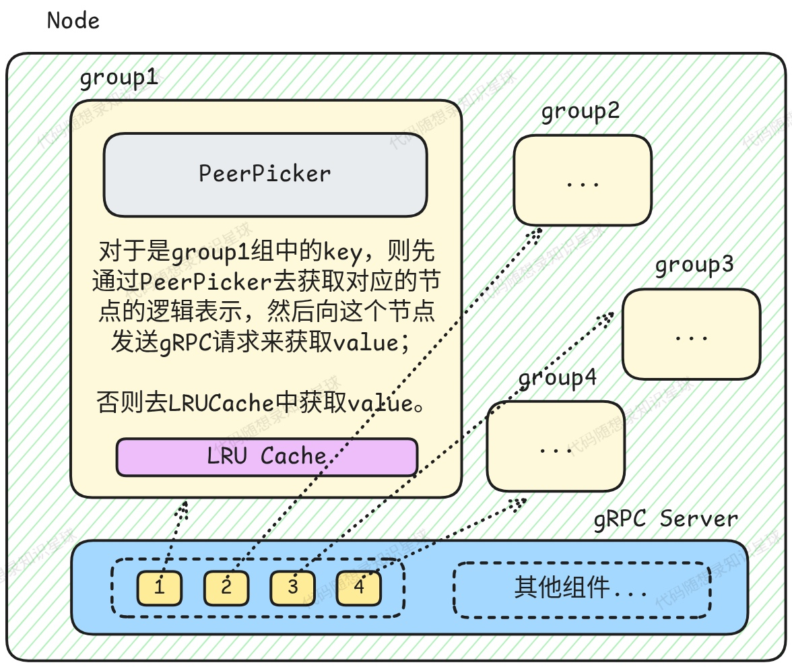

# 4. 缓存组

## 缓存组简介与结构

`CacheGroup` 是分布式缓存系统中的核心组件，它代表了一个逻辑上的缓存分组，具有本地缓存、远程节点访问和数据加载的能力。这个设计允许系统在多个节点之间共享缓存数据，同时保持高效的本地访问性能。



**每个缓存组都是一个独立的命名空间，gRPC服务器维护了一个groups\_映射，每个组都有独立的CacheGroup实例。\*\*\*\*<font style="background-color:#FBDE28;">同一个缓存组内的节点通过一致性哈希协同工作，而不同缓存组之间完全独立。</font>**

```cpp
using DataGetter = std::function<ByteViewOptional(const std::string& key)>;

class CacheGroup {
public:
    CacheGroup() = default;

    CacheGroup(std::string name, int64_t bytes, DataGetter getter)
        : cache_(std::make_unique<LRUCache>(bytes)), name_(name), getter_(getter) {}

    CacheGroup(const CacheGroup&) = delete;

    auto operator=(const CacheGroup& other) -> CacheGroup& = delete;

    CacheGroup(CacheGroup&& other) {
        cache_ = std::move(other.cache_);
        name_ = std::move(other.name_);
        getter_ = std::move(other.getter_);
    }

    auto operator=(CacheGroup&& other) -> CacheGroup& {
        cache_ = std::move(other.cache_);
        name_ = std::move(other.name_);
        getter_ = std::move(other.getter_);
        return *this;
    }

    auto Get(const std::string& key) -> ByteViewOptional;

    bool Set(const std::string& key, ByteView b, bool is_from_peer = false);

    bool Delete(const std::string& key, bool is_from_peer = false);

    void SyncToPeers(const std::string& key, SyncFlag op, ByteView value);

    void RegisterPeerPicker(std::unique_ptr<PeerPicker>&& peer_picker);

private:
    auto Load(const std::string& key) -> ByteViewOptional;
    auto LoadData(const std::string& key) -> ByteViewOptional;
    auto LoadFromPeer(Peer* peer, const std::string& key) -> ByteViewOptional;

private:
    std::unique_ptr<LRUCache> cache_;
    std::unique_ptr<PeerPicker> peer_picker_;
    std::string name_;
    std::atomic<bool> is_close_{false};
    DataGetter getter_;
    SingleFlight loader_;
    GroupStatus status_;
};
```

`CacheGroup` 的主要职责为：

* 管理缓存数据的逻辑命名空间，每个 `CacheGroup` 代表一个独立的缓存命名空间
* 协调本地缓存和远程节点之间的访问，实现多层缓存查找策略
  * 使用 `LRUCache` 作为本地缓存
  * 通过 `PeerPicker` 从远程节点加载数据
* 处理缓存操作：支持 Get、Set、Delete 等基本操作
* 防止缓存击穿：使用 singleflight 机制确保同一时间只有一个请求处理特定键

## 创建获取缓存组

通常，我们不直接使用 `CacheGroup` 的构造函数来创建缓存组，而是通过以下两个函数来操作（**因为请求缓存节点时是通过 gRPC，那 gRPC Server 就应该接收请求后去创建/使用缓存组**）：

```cpp
std::unordered_map<std::string, CacheGroup> cache_groups;
std::mutex mtx;

auto MakeCacheGroup(const std::string& name, int64_t bytes, DataGetter getter) -> CacheGroup& {
    if (getter == nullptr) {
        spdlog::critical("no getter function!");
        std::exit(1);
    }
    std::lock_guard lock{mtx};
    cache_groups[name] = std::move(CacheGroup{name, bytes, getter});
    return cache_groups[name];
}

auto GetCacheGroup(const std::string& name) -> CacheGroup* {
    std::lock_guard lock{mtx};
    if (cache_groups.find(name) == cache_groups.end()) {
        return nullptr;
    }
    return &cache_groups[name];
}
```

其中的 `DataGetter` 定义为：

```cpp
using DataGetter = std::function<ByteViewOptional(const std::string& key)>;
```

当缓存不存在时可通过该 getter 去自定义的数据源加载数据。

## 获取数据

### 数据加载

当缓存组中本地缓存未命中时，会调用 `Load` 来加载数据：

```cpp
auto CacheGroup::Load(const std::string& key) -> ByteViewOptional {
    auto ret = loader_.Do(key, [&] { return LoadData(key); });
    if (!ret) {
        spdlog::error("Failed to load data for key: {}", key);
        return std::nullopt;
    }
    cache_->Set(key, ret.value());
    // TODO 记录加载时间
    return ret;
}
```

`Load` 会使用之前我们实现的 SingleFlight 机制来防止重复请求，其中的具体加载实现为 `LoadData`：

```cpp
auto CacheGroup::LoadData(const std::string& key) -> ByteViewOptional {
    // 先尝试从远程节点获取
    if (peer_picker_ != nullptr) {
        if (auto peer = peer_picker_->PickPeer(key); peer) {
            auto val = LoadFromPeer(peer, key);
            if (val) {
                ++status_.peer_hits;
                return val;
            }
            ++status_.peer_misses;
        } else {
            spdlog::warn("Failed to get from peer");
        }
    }

    // 通过getter从数据源获取
    auto val = getter_(key);
    if (!val) {
        spdlog::error("Failed to get [{}] from data source", key);
        return std::nullopt;
    }
    ++status_.local_hits;
    return val;
}

auto CacheGroup::LoadFromPeer(Peer* peer, const std::string& key) -> ByteViewOptional {
    auto value = peer->Get(name_, key);
    if (!value) {
        return std::nullopt;
    }
    return value;
}
```

`LoadData` 方法实现了**分层加载策略**：

1. **首先尝试从远程节点获取**：如果配置了 `peer_picker_`，会先尝试从其他节点获取数据
2. **回退到数据源**：如果远程节点也没有数据，最后调用 `getter_` 函数从原始数据源加载

> *那为什么要先从远程节点获取数据呢？*

这是因为如果其他节点已经从原始数据源加载过这个数据，那么从远程节点获取比重新从数据源加载要**快得多**。

### Get 操作

首先从本地缓存中获取数据，如果获取失败，就调用 `Load` 去从远程节点或者数据源获取数据。

```cpp
auto CacheGroup::Get(const std::string& key) -> ByteViewOptional {
    if (is_close_) {
        spdlog::error("Cache group [{}] is closed!!!", name_);
        return std::nullopt;
    }

    if (key == "") {
        spdlog::warn("The key [{}] is empty, you can't get a empty key from cache group", key);
        return std::nullopt;
    }

    // 先从本地缓存中获取
    auto ret = cache_->Get(key);
    if (ret) {
        ++status_.local_hits;  // 本地命中缓存次数+1
        return ret;
    }

    ++status_.local_misses;  // 本地未命中缓存次数+1
    return Load(key);
}
```

## 数据同步

`SyncToPeers` 方法的主要作用是在分布式缓存环境中保持数据一致性，当本地节点执行 Set 或 Delete 操作时，将这些操作同步到集群中的其他相关节点。

> 为什么需要将数据同步到其他远程节点？

系统使用一致性哈希算法来分布数据，每个键都有一个"权威"节点负责存储，但其他节点可能也会缓存这个数据。当权威节点的数据发生变化时，需要通知其他可能缓存了该数据的节点。

如果不进行同步，会出现以下问题：

* 节点A修改了某个键的值
* 节点B仍然缓存着旧值
* 客户端从节点B获取到过期数据

### 调用时机

`SyncToPeers` 在以下场景被调用:

1. **Set 操作**: 当本节点执行 `Set()` 且 `is_from_peer=false` 时触发同步
2. **Delete 操作**: 当本节点执行 `Delete()` 且 `is_from_peer=false` 时触发同步
3. **Invalidate 操作**: 当本节点主动失效缓存时触发同步

`is_from_peer` 参数用于防止循环同步:如果操作来自其他节点的 RPC 请求,则不再向其他节点同步。

### 实现机制

`SyncToPeers` 是 `CacheGroup` 类中用于将缓存操作同步到集群中其他节点的方法。该方法根据不同的操作类型(SET/DELETE/INVALIDATE)采用不同的同步策略。

#### SET 操作的同步策略

对于 SET 操作,实现了**最终一致性**模型:

1. **主节点同步**: 首先通过 `peer_picker_->PickPeer(key)` 使用一致性哈希确定该 key 的主节点,然后调用 `primary_peer->Set()` 将数据同步到主节点
2. **其他节点失效**: 向所有其他节点(除主节点外)发送 `Invalidate` 请求,删除它们的本地缓存副本,确保最终一致性

#### DELETE 操作的同步策略

DELETE 操作采用**广播模式**:

* 通过 `peer_picker_->GetAllPeers()` 获取所有节点
* 向每个节点发送 `Delete` RPC 请求
* 确保所有节点都删除该 key

#### INVALIDATE 操作的同步策略

INVALIDATE 操作也采用**广播模式**:

* 向所有节点发送 `Invalidate` RPC 请求
* 每个节点只删除本地缓存,不重新加载数据

```cpp
void CacheGroup::SyncToPeers(const std::string& key, SyncFlag op, ByteView value) {
    if (!peer_picker_) {
        return;
    }

    switch (op) {
        case SyncFlag::SET: {
            // 对于 SET 操作，实现最终一致性：
            // 1. 将数据同步到管理该 key 的节点
            auto primary_peer = peer_picker_->PickPeer(key);
            if (primary_peer) {
                bool ok = primary_peer->Set(name_, key, value);
                if (!ok) {
                    spdlog::warn("Failed to sync SET to primary peer for key: {}", key);
                }
            }

            // 2. 向所有其他节点（除了主节点）发送失效通知，保证最终一致性
            auto all_peers = peer_picker_->GetAllPeers();
            for (auto peer : all_peers) {
                if (peer != primary_peer) {  // 排除已经同步过的主节点
                    bool ok = peer->Invalidate(name_, key);
                    if (!ok) {
                        spdlog::warn("Failed to invalidate key [{}] on peer", key);
                    }
                }
            }
            spdlog::debug("SET operation synced: key [{}] set on primary node, invalidated on {} other nodes", key,
                          all_peers.size() - (primary_peer ? 1 : 0));
            break;
        }
        case SyncFlag::DELETE: {
            // 对于 DELETE 操作，需要广播到所有节点
            auto all_peers = peer_picker_->GetAllPeers();
            for (auto peer : all_peers) {
                bool ok = peer->Delete(name_, key);
                if (!ok) {
                    spdlog::warn("Failed to sync DELETE to peer for key: {}", key);
                }
            }
            spdlog::debug("DELETE operation synced: key [{}] deleted on {} nodes", key, all_peers.size());
            break;
        }
        case SyncFlag::INVALIDATE: {
            // 向所有其他节点发送失效通知
            auto all_peers = peer_picker_->GetAllPeers();
            for (auto peer : all_peers) {
                bool ok = peer->Invalidate(name_, key);
                if (!ok) {
                    spdlog::warn("Failed to invalidate key [{}] on peer", key);
                }
            }
            spdlog::debug("INVALIDATE operation synced: key [{}] invalidated on {} nodes", key, all_peers.size());
            break;
        }
        default:
            spdlog::warn("Unknown sync operation: {}", static_cast<int>(op));
            return;
    }
}
```

### 操作类型

`SyncToPeers` 支持两种同步操作类型，通过 `SyncFlag` 枚举定义：

```cpp
enum class SyncFlag {
    SET,
    DELETE,
};
```

* SET：同步键值设置操作
* DELETE：同步键删除操作

### 防止无限循环

设计中有一个重要的防护机制：只有当操作不是来自其他节点时（`!is_from_peer`）才会触发同步。这防止了节点间的无限同步循环，确保每个操作只会被同步一次。

> 在 Go 版本中通过 `context.Context`加以实现，不过在 C++版本中，个人觉得通过接口的参数即可简单完成

## Set 操作

调用本地缓存的 `Set`接口，设置对应的缓存，并将操作同步到其他远程节点。

```cpp
bool CacheGroup::Set(const std::string& key, ByteView b, bool is_from_peer = false) {
    if (is_close_) {
        spdlog::error("Cache group [{}] is closed!!!", name_);
        return false;
    }
    if (key.empty()) {
        spdlog::warn("The key [{}] is empty, you can't set it into cache group", key);
        return false;
    }
    cache_->Set(key, b);
    // 必须是本身这个节点设置的值，才会同步到其他节点
    if (!is_from_peer && peer_picker_) {
        SyncToPeers(key, SyncFlag::SET, b);
    }
    return true;
}
```

## Delete 操作

调用本地缓存的 `Delete`接口，删除对应的缓存，并将操作同步到其他远程节点。

```cpp
bool CacheGroup::Delete(const std::string& key, bool is_from_peer = false) {
    if (is_close_) {
        spdlog::error("Cache group [{}] is closed!!!", name_);
        return false;
    }
    if (key.empty()) {
        spdlog::warn("The key [{}] is empty, you can't delete it from cache group", key);
        return false;
    }
    cache_->Delete(key);
    // 必须是本身这个节点设置的值，才会同步到其他节点
    if (!is_from_peer && peer_picker_) {
        SyncToPeers(key, SyncFlag::DELETE, ByteView{""});
    }
    return true;
}
```


> 更新: 2025-10-10 08:34:44  
> 原文: <https://www.yuque.com/chengxuyuancarl/vv9v2t/pzs8ewr5b3plfepe>