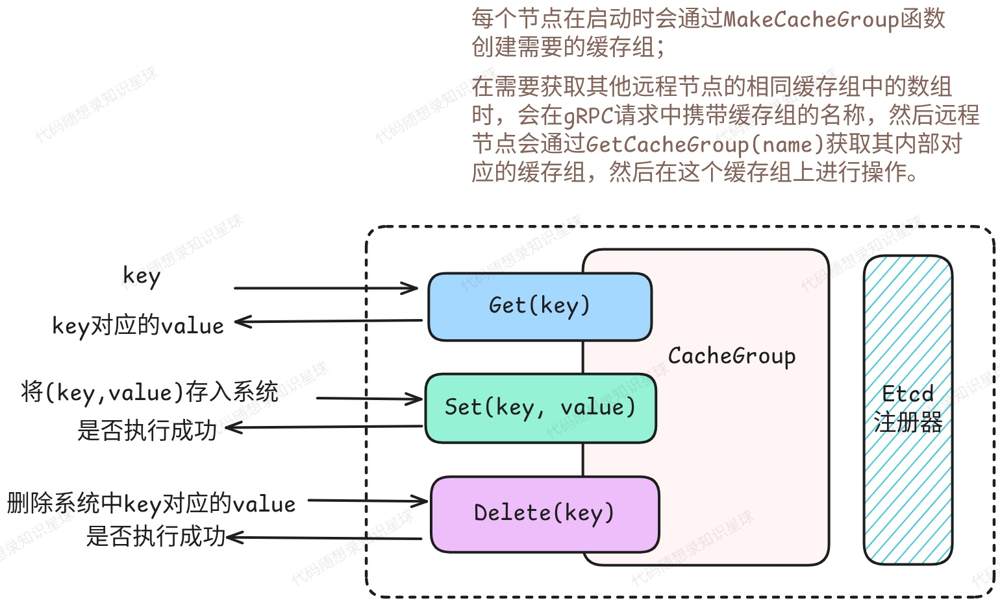

# 5. gRPC Server

## 概述



在项目分布式缓存系统中，gRPC 服务器是每个缓存节点的核心通信组件，C++ 版本中的实现为 `CacheGrpcServer` 类。对于 kcache 中的每个节点既是服务端也是客户端，通过 gRPC 协议进行高效的节点间通信。

```cpp
namespace kcache {

// 服务器的配置类，构造函数已经是默认配置
struct ServerOptions {
    std::vector<std::string> etcd_endpoints;
    std::chrono::milliseconds dial_timeout;
    int max_msg_size;
    bool tls;
    std::string cert_file;
    std::string key_file;

    ServerOptions()
        : etcd_endpoints({"localhost:2379"}),
          dial_timeout(std::chrono::seconds(5)),
          max_msg_size(4 << 20),  // 4MB
          tls(false) {}
};
    
class CacheGrpcServer final : public pb::KCache::Service {
public:
    CacheGrpcServer(const std::string& addr, const std::string& svc_name);
    ~CacheGrpcServer() = default;

    auto Get(grpc::ServerContext* context, const pb::Request* request, pb::GetResponse* response)
        -> grpc::Status override;

    auto Set(::grpc::ServerContext* context, const pb::Request* request, pb::SetResponse* response)
        -> grpc::Status override;

    auto Delete(grpc::ServerContext* context, const pb::Request* request, pb::DeleteResponse* response)
        -> grpc::Status override;

    void Start();

    void Stop();

private:
    std::string addr_;
    std::string svc_name_;

    std::unique_ptr<grpc::Server> grpc_server_;
    std::unique_ptr<EtcdRegistry> etcd_register_;

    std::atomic<bool> is_stop_;

    ServerOptions opts_;
};
    
}
```

可以看到 `CacheGrpcServer`是继承自`pb::KCache::Service`，而这个类是**由 Protocol Buffers（protoc）编译器从 **<code>**kcache.proto**</code>** 文件自动生成的 gRPC 服务基类** 。这个类定义在生成的头文件中，为 KCache 的 gRPC 服务提供了接口规范。

## etcd 服务注册

系统采用了基于 etcd 的服务发现模式，通过租约机制确保服务的高可用性。每个节点既向 etcd 注册自己，也监听其他节点的变化，这样使得节点可以动态加入和离开集群，而无需手动配置。

在上文的 `CacheGrpcServer`中有一个成员变量 `etcd_register_`的类型为 `EtcdRegistry`，其定义为：

```cpp
namespace kcache {

class EtcdRegistry {
public:
    EtcdRegistry(const std::string& endpoints = "http://127.0.0.1:2379") {
        etcd_client_ = std::make_unique<etcd::Client>(endpoints);
    }
    ~EtcdRegistry() = default;

    // 将服务名和地址写入 etcd，格式为 /services/{svc_name}/{addr}，并绑定一个租约（lease）。
    // 这样其他服务可以通过 etcd 查询到所有可用节点。
    bool Register(const std::string& svc_name, std::string addr);

    // 撤销租约并删除服务信息，确保节点下线时不会被其他服务继续发现。
    void Unregister();

private:
    auto GetLocalIP() -> std::string;

    void KeepAliveLoop();

    int64_t lease_id_{0};
    std::unique_ptr<etcd::Client> etcd_client_;
    std::string key_;
    std::thread keepalive_thread_;
    std::atomic<bool> is_stop_{false};
};

}  // namespace kcache
```

### 注册时机

当 `CacheGrpcServer` 构造时，会立即创建 `EtcdRegistry` 实例并向 etcd 注册服务。

```cpp
CacheGrpcServer::CacheGrpcServer(const std::string& addr, const std::string& svc_name)
    : addr_(addr), svc_name_(svc_name) {
    // 创建etcd注册器
    etcd_register_ = std::make_unique<EtcdRegistry>();
    if (!etcd_register_->Register(svc_name_, addr_)) {
        throw std::runtime_error("[kcache] Failed to register service with etcd");
    }
}
```

### 注册实现

<font style="color:rgb(51, 51, 51);">注册过程为：</font>

1. **<font style="color:rgb(51, 51, 51);">获取本地 IP</font>**：通过 `GetLocalIP()` 获取节点的真实 IP 地址
2. **<font style="color:rgb(51, 51, 51);">构建服务键</font>**：按照 <code>**/services/{svc_name}/{addr}**</code> 格式构建 etcd 键
3. **<font style="color:rgb(51, 51, 51);">创建租约</font>**：向 etcd 申请 10 秒的租约，确保服务的生命周期管理
4. **<font style="color:rgb(51, 51, 51);">写入服务信息</font>**：将服务地址与租约绑定写入 etcd
5. **<font style="color:rgb(51, 51, 51);">启动续约线程</font>**：创建后台线程定期续约，保持服务在线状态

```cpp
bool EtcdRegistry::Register(const std::string& svc_name, std::string addr) {
    std::string local_ip = GetLocalIP();
    if (local_ip.empty()) {
        spdlog::error("Failed to get local IP");
        return false;
    }
    if (!addr.empty() && addr[0] == ':') {
        addr = local_ip + addr;
    }
    key_ = "/services/" + svc_name + "/" + addr;

    // 创建租约
    auto lease_resp = etcd_client_->leasegrant(10).get();
    if (!lease_resp.is_ok()) {
        spdlog::error("Failed to create lease: {}", lease_resp.error_message());
        return false;
    }
    lease_id_ = lease_resp.value().lease();

    // 注册服务
    auto is_ok = etcd_client_->put(key_, addr, lease_id_).get();
    if (!is_ok.is_ok()) {
        spdlog::error("Failed to register [{}] to etcd: {}", key_, is_ok.error_message());
        return false;
    }

    // 启动续约线程
    keepalive_thread_ = std::thread{[this] { this->KeepAliveLoop(); }};
    spdlog::info("Etcd Service registered: {}", key_);
    return true;
}

auto EtcdRegistry::GetLocalIP() -> std::string {
    struct ifaddrs* ifaddr;
    if (getifaddrs(&ifaddr) == -1) {
        return "";
    }
    std::string ip;
    for (struct ifaddrs* ifa = ifaddr; ifa; ifa = ifa->ifa_next) {
        if (!ifa->ifa_addr || ifa->ifa_addr->sa_family != AF_INET) continue;
        char buf[INET_ADDRSTRLEN];
        void* addr_ptr = &((struct sockaddr_in*)ifa->ifa_addr)->sin_addr;
        inet_ntop(AF_INET, addr_ptr, buf, INET_ADDRSTRLEN);
        std::string candidate{buf};
        if (candidate != "127.0.0.1") {
            ip = candidate;
            break;
        }
    }
    freeifaddrs(ifaddr);
    return ip;
}
```

### 租期续约

租期续约是用于维持服务在 etcd 中的注册状态。在服务注册时，系统首先向 etcd 申请一个 10 秒的租约，租约 ID 被保存在 `lease_id_` 成员变量中，用于后续的续约操作。

注册成功后，系统会启动一个专门的后台线程来处理续约，这个线程会持续运行 `KeepAliveLoop()` 方法来维持租约的有效性。

**这样如果节点异常退出，租约会自动过期，其他节点能及时发现，且过期的服务注册信息会被 etcd 自动清理，保证了分布式缓存集群中的节点信息始终是最新的。**

```cpp
void EtcdRegistry::KeepAliveLoop() {
    while (!is_stop_) {
        etcd::KeepAlive keepalive{*etcd_client_, 10, lease_id_};
        try {
            // fmt::println("[kcache] Lease {} keepalive successful", lease_id_);
            keepalive.Check();
        } catch (const std::exception& e) {
            // retry_count++;
            spdlog::error("Keepalive exception: {}", e.what());
            keepalive.Cancel();
        } catch (...) {
            spdlog::error("Keepalive unknown exception");
            keepalive.Cancel();
        }

        // 等待间隔（租约时间的1/3）
        std::this_thread::sleep_for(std::chrono::seconds(3));
    }

    spdlog::debug("KeepAlive loop exited for lease {}", lease_id_);
}
```

> 在 `etcd-cpp-apiv3`中类大多都采用了 RAII 机制，因此在使用的时候配合 `std::unique_ptr` 即可非常方便的管理资源。

### 服务注销

`EtcdRegistry::Unregister()`方法负责处理etcd层面的服务注销。

租约撤销是服务注销的核心，通过`etcd_client_->leaserevoke(lease_id_)`实现。当租约被撤销时，所有与该租约关联的键值对（包括服务注册信息）都会从etcd中自动删除。

```cpp
void EtcdRegistry::Unregister() {
    is_stop_ = true;
    if (keepalive_thread_.joinable()) {
        keepalive_thread_.join();
    }
    if (lease_id_ > 0) {
        auto is_ok = etcd_client_->leaserevoke(lease_id_).wait();
        if (!is_ok) {
            throw std::runtime_error(fmt::format("[kcache] Failed to revoke lease: {}", lease_id_));
        } else {
            spdlog::info("Lease {} revoked successfully", lease_id_);
        }
    }
    spdlog::info("Service unregistered: {}", key_);
}
```

## 服务器启动

gRPC 服务器通过 `grpc::ServerBuilder` 进行配置和启动，关键步骤包括：

1. **端口监听**：通过 `builder.AddListeningPort(addr_, credentials)` 绑定监听地址
2. **服务注册**：通过 `builder.RegisterService(this)` 将当前服务实例注册到 gRPC 框架
3. **服务器构建**：`builder.BuildAndStart()` 创建并启动服务器实例
4. **阻塞等待**：`grpc_server_->Wait()` 使服务器进入阻塞状态，等待客户端请求（**在创建一个节点时，会启动一个线程来运行 Server，所以不用担心整个节点会阻塞**）

```cpp
void CacheGrpcServer::Start() {
    try {
        // 配置gRPC服务器选项
        grpc::ServerBuilder builder;

        // 设置最大消息大小
        builder.SetMaxReceiveMessageSize(opts_.max_msg_size);
        builder.SetMaxSendMessageSize(opts_.max_msg_size);

        // 配置TLS或非安全连接
        if (opts_.tls) {
            auto creds = LoadTLSCredentials(opts_.cert_file, opts_.key_file);
            if (!creds) {
                throw std::runtime_error("Failed to load TLS credentials");
            }
            builder.AddListeningPort(addr_, creds);
        } else {
            builder.AddListeningPort(addr_, grpc::InsecureServerCredentials());
        }

        // 启用默认健康检查服务
        grpc::EnableDefaultHealthCheckService(true);
        builder.SetOption(grpc::MakeChannelArgumentOption(GRPC_ARG_KEEPALIVE_TIME_MS, 30000));
        builder.SetOption(grpc::MakeChannelArgumentOption(GRPC_ARG_KEEPALIVE_TIMEOUT_MS, 5000));

        // 注册服务
        builder.RegisterService(this);

        // 构建并启动服务器
        grpc_server_ = builder.BuildAndStart();
        if (!grpc_server_) {
            throw std::runtime_error("Failed to build and start gRPC server");
        }

        // 设置健康检查状态
        auto health_service = grpc_server_->GetHealthCheckService();
        if (health_service) {
            health_service->SetServingStatus(svc_name_, true);
        }

        is_stop_ = false;

        spdlog::info("gRPC Server start success at {}!", addr_);

        grpc_server_->Wait();

    } catch (const std::exception& e) {
        spdlog::error("Failed to start gRPC Server: {}", e.what());
        throw;
    }
}
```

## 缓存操作

之前说过，**每个节点既是客户端，也是服务端**：

* 是客户端：会去请求远程节点中的缓存
* 是服务端：会接受远程客户端节点的请求，执行请求操作并返回操作结果

gRPC Server 就是承担了节点服务端的职责，与 `CacheGroup` 一起配合，**将网络请求转换为具体的缓存操作**。

客户端节点向服务端节点发送 gRPC 请求，在服务端节点中，gRPC 框架会根据请求的方法名自动路由到对应的处理函数：

* **Get 请求**：路由到 `CacheGrpcServer::Get()`
* **Set 请求**：路由到 `CacheGrpcServer::Set()`
* **Delete 请求**：路由到 `CacheGrpcServer::Delete()`

***

每个请求处理方法都遵循相同的模式：

1. **参数解析**：从 `pb::Request` 中提取请求参数
2. **业务逻辑**：调用 `CacheGroup` 执行具体的缓存操作
3. **响应构建**：将结果封装到对应的 protobuf 响应对象中
4. **状态返回**：返回 `grpc::Status` 表示操作结果

### Get

```cpp
auto CacheGrpcServer::Get(grpc::ServerContext* context, const pb::Request* request, pb::GetResponse* response)
    -> grpc::Status {
    auto group = GetCacheGroup(request->group());
    if (!group) {
        return grpc::Status(grpc::StatusCode::NOT_FOUND, "Group not found");
    }
    auto value = group->Get(request->key());
    if (!value) {
        return grpc::Status(grpc::StatusCode::NOT_FOUND, "Key not found");
    }
    response->set_value(value->ToString());
    return grpc::Status::OK;
}
```

### Set

在之后要实现的接口服务器中（或者说是一个网关）对外暴露接口时 ，其对节点的更新操作应该和本地操作的结果一样。即这时 <code>CacheGroup::Set(conststd::string& key, ByteView b, bool is_from_peer)</code>中第三个参数应该为 `false`。

在接口服务器中会在 gRPC 上下文中设置一个叫 `is_gateway` 的字段，如果节点收到的 gRPC 请求中有这个字段，那么说明这个请求应该通过网关发来的外部请求：

1. **外部请求（通过网关）**：
   * 客户端 → 网关 → 节点A：设置 key="user:123"
   * 节点A 执行本地缓存操作
   * 节点A 同步给其他节点（节点B、C）
2. **内部同步（节点间）**：
   * 节点A → 节点B：同步 key="user:123"
   * 节点B 执行本地缓存操作
   * 节点B 不再同步给其他节点（避免循环）

这样做的作用是：

1. **防止无限循环**：避免节点A同步给B，B又同步给C，C又同步回A的循环
2. **一致性保证**：确保只有原始操作节点负责分发更新

```cpp
auto CacheGrpcServer::Set(grpc::ServerContext* context, const pb::Request* request, pb::SetResponse* response)
    -> grpc::Status {
    auto group = GetCacheGroup(request->group());
    if (!group) {
        return grpc::Status(grpc::StatusCode::NOT_FOUND, "Group not found");
    }
    bool is_gateway = context->client_metadata().find("is_gateway") != context->client_metadata().end();
    bool is_from_peer = !is_gateway;
    bool is_set = group->Set(request->key(), request->value(), is_from_peer);
    response->set_value(is_set);
    return grpc::Status::OK;
}
```

### Delete

`Delete` 操作类似于 `Set` 操作。

```cpp
auto CacheGrpcServer::Delete(grpc::ServerContext* context, const pb::Request* request, pb::DeleteResponse* response)
    -> grpc::Status {
    auto group = GetCacheGroup(request->group());
    if (!group) {
        return grpc::Status(grpc::StatusCode::NOT_FOUND, "Group not found");
    }
    bool is_gateway = context->client_metadata().find("is_gateway") != context->client_metadata().end();
    bool is_from_peer = !is_gateway;
    bool is_delete = group->Delete(request->key(), is_from_peer);
    response->set_value(is_delete);
    return grpc::Status::OK;
}
```

## 服务关闭

`CacheGrpcServer::Stop()` 将关闭 gRPC 服务器，停止 gRPC 服务和注销 etcd 服务。

```cpp
void CacheGrpcServer::Stop() {
    is_stop_ = true;
    if (etcd_register_) {
        etcd_register_->Unregister();
        etcd_register_.reset();
    }
    if (grpc_server_) {
        grpc_server_->Shutdown();
        grpc_server_.reset();
    }
    spdlog::info("gRPC Server {} stopped.", addr_);
}
```


> 更新: 2025-07-27 19:43:25  
> 原文: <https://www.yuque.com/chengxuyuancarl/vv9v2t/bccba4zx6hi2zvbz>