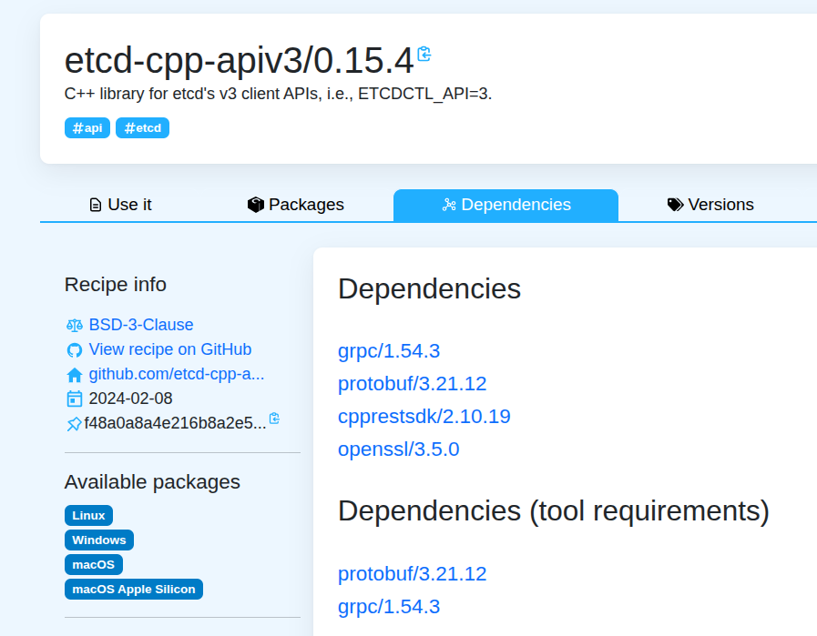
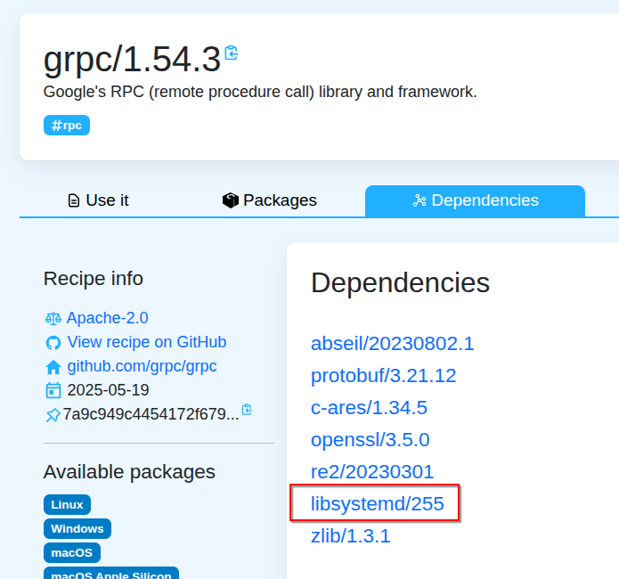
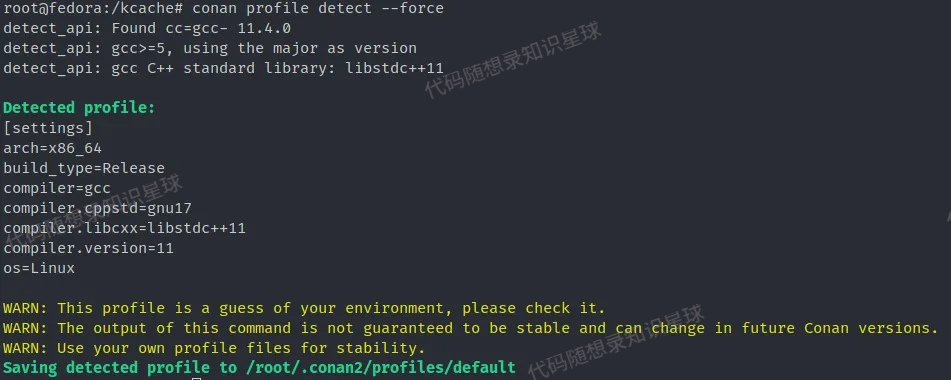
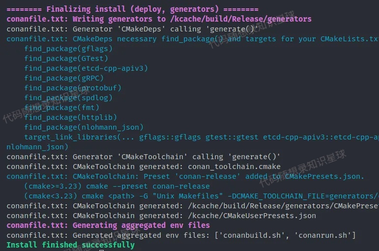
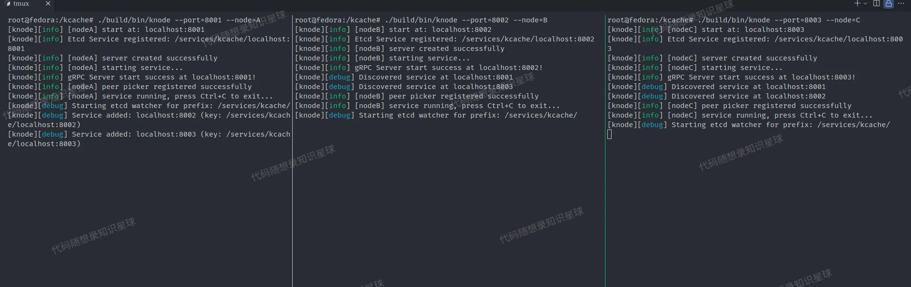
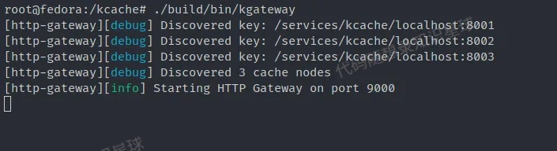
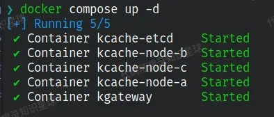
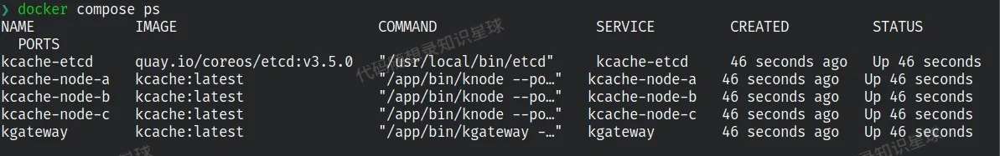
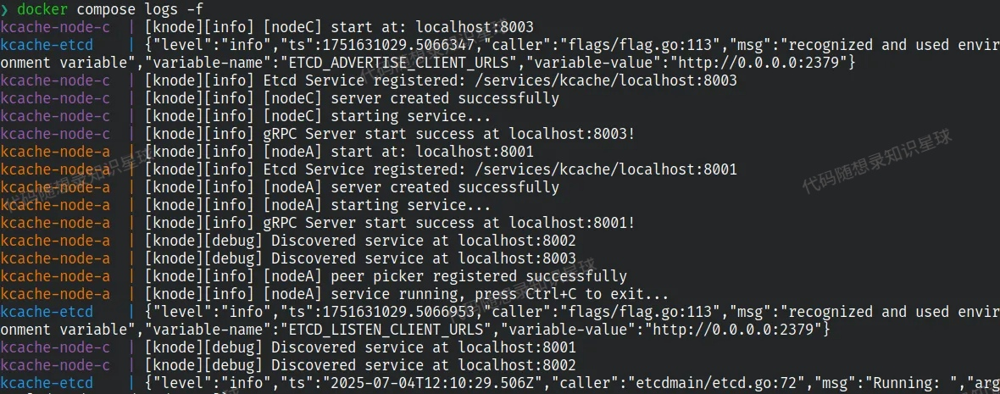
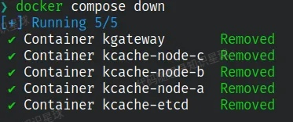

# 环境准备

## 项目所需环境

项目的所需的环境如下：

* Ubuntu 22.04 (Docker)
* GCC 11.4 (use C++ 17)
* CMake 3.22.1
* Conan 2.16.1

使用了以下的第三方库：

* gflags / 2.2.2
* gtest / 1.16.0
* protobuf / 3.21.12
* grpc / 1.54.3
* etcd-cpp-apiv3 / 0.15.4
* fmt / 11.1.3
* spdlog / 1.15.1
* cpp-httplib / 0.20.1
* nlohmann\_json / 3.12.0

这里推荐使用 Ubuntu 22.04 版本，这是因为项目中的一个第三方库 `etcd-cpp-apiv3` 中有依赖并没有支持更高的内核版本（好像是不支持内核版本 6.8 以上）。

在开发时使用的是 \*\*Conan \*\*+ **CMake** 来构建项目，这样可以让我们的项目更加工程化。

**同时为了避免开发环境的差异，项目给出了 Dockerfile，可以自动化构建容器镜像，确保大家的环境都是一致的，当然你也可以用下面的“手动配置”来在你的电脑上完成。**

***

**代码Github：**[**https://github.com/youngyangyang04/KamaCache-CPP**](https://github.com/youngyangyang04/KamaCache-CPP)

## 下载项目源码

```shell
git clone git@github.com:youngyangyang04/KamaCache-CPP.git
```

## 手动配置

### 选择 OS

首先是操作系统，推荐使用 ubuntu22.04。因为在比较知名的 C++ 包管理器中，只有 Conan 对于 `etcd-cpp-apiv3` 这个库有索引，且只有 0.15.4 这个版本，而这个版本中使用的 grpc/1.54.3 又使用了 libsystemd/255，其在高版本的 Linux Kernel 上有一个 bug：

```plain
Unknown filesystems defined in kernel headers:

Filesystem found in kernel header but not in filesystems-gperf.gperf: BCACHEFS_SUPER_MAGIC
Filesystem found in kernel header but not in filesystems-gperf.gperf: PID_FS_MAGIC
```

不过后面这个 bug 修复了，可以看[这里](https://lore.kernel.org/buildroot/ZmGjGvRCN3GwWFhp@landeda/T/)。而我们使用的 Conan 仓库中 etcd-cpp-apiv3 的最新版本还是依赖了 libsystemd/255。

因此如果继续使用 Conan 作为包管理器的话，就需要使用低版本的内核（6.8及以下），这里我使用的是 Ubuntu22.04，内核版本为 5.15，可以使用虚拟机或者 Docker。



### 环境准备

```shell
apt-get update && apt-get install -y \
    build-essential \
    cmake \
    ninja-build \
    gcc \
    g++ \
    git \
    wget \
    curl \
    python3 \
    python3-pip \
    pkg-config
```

### 安装 Conan

Conan 是 Python 写的 C/C++ 包管理器，可以使用 pip 安装：

```shell
pip3 install --upgrade pip && pip3 install conan==2.16.1
```

### 配置 Conan

Conan 配置文件允许用户为编译器、构建配置、架构、共享或静态库等定义配置集。默认情况下，Conan 不会尝试自动检测配置文件，因此我们需要让 Conan 尝试根据当前的作系统和安装的工具去检测并生成对应的配置文件：

```shell
conan profile detect --force
```



### 使用 Conan 安装第三方库

```shell
conan install . --build=missing -s build_type=Release
```

Conan 会根据项目根目录下的 `conanfile.txt` 去下载编译使用的第三方库，这里是从 Conan 的中央仓库下载源码然后在你的电脑上本地编译，所以需要一小段时间，喝杯☕或者站起来走动一下吧~

完成后，conan 会告诉你如何使用这些库：



### 配置 CMake

```shell
cmake -DCMAKE_TOOLCHAIN_FILE=build/Release/generators/conan_toolchain.cmake -DCMAKE_BUILD_TYPE=Release -S . -B build -G Ninja
```

如果是 CMake>=3.23，可以使用：

```shell
cmake --preset conan-release
```

不过 Ubuntu22.04 仓库中默认的 CMake 版本为 3.22.1，所以如果要用用 preset，可以去添加 CMake 相关的仓库。

### 构建项目

```shell
cmake --build build
```

完成后，会在 `build/bin` 目录下生成所有目标，包括 `knode` 和 `kgateway`，分别是缓存节点实例和网关服务器。

### 启动 etcd

```shell
docker run -d --name etcd \
        -p 2379:2379 \
        quay.io/coreos/etcd:v3.5.0 \
        etcd --advertise-client-urls http://0.0.0.0:2379 \
        --listen-client-urls http://0.0.0.0:2379
```

### 运行

在不同终端启动：

```shell
./build/bin/knode --port=8001 --node=A
./build/bin/knode --port=8002 --node=B
./build/bin/knode --port=8003 --node=C

./build/bin/kgateway
```





## Docker 启动

### 构建镜像

```shell
docker build -t kcache:latest .
```

> PS：如果构建时间长或者失败，可以考虑使用本地网络和代理：
>
> `docker build --network host --build-arg HTTP_PROXY=http://your-proxy:port --build-arg HTTPS_PROXY=http://your-proxy:port -t kcache:latest .`

构建镜像时需要安装依赖，编译第三方库，可以喝杯☕慢慢等待~

### 单节点运行

#### 启动 etcd

可以使用 Go 版本文档中 etcd 的启动方式：

```shell
docker run -d --name etcd \
  -p 2379:2379 \
  quay.io/coreos/etcd:v3.5.0 \
  etcd --advertise-client-urls http://0.0.0.0:2379 \
  --listen-client-urls http://0.0.0.0:2379
```

也可以在自己电脑上安装 etcd 来启动。

#### 启动一个 kcache node

```shell
docker run -d \
  --name kcache-node \
  -p 8001:8001 \
  --network host \
  kcache:latest \
  /app/bin/knode --port=8001 --node=A
```

### 多节点集群

使用 Docker Compose 一键启动集群：

```shell
# 启动整个集群（包含 etcd + 3个节点 + 网关）
docker compose up -d
```



可以通过 ps 查看服务状态， log 命令查看节点和网关的日志：

```shell
# 查看服务状态
docker compose ps

# 查看日志
docker compose logs -f
```





结束任务，删除容器：

```shell
# 停止服务
docker compose down
```



## 使用 curl 访问服务

启动服务后，可以通过本机的 9000 端口来访问服务：

1. Get

```shell
curl http://127.0.0.1:9000/api/cache/test/Kerolt
# 输出：{"group":"test","key":"Kerolt","value":"370"}⏎  
```

2. Set

```shell
$ curl -X POST http://127.0.0.1:9000/api/cache/test/Kerolt -d 'value=1219'
# 输出：{"group":"test","key":"Kerolt","success":true,"value":"value=1219"}⏎
```

3. Delete

```shell
$ curl -X DELETE http://127.0.0.1:9000/api/cache/test/Kerolt
# 输出：{"deleted":true,"group":"test","key":"Kerolt"}⏎   
```


> 更新: 2025-10-21 16:09:59  
> 原文: <https://www.yuque.com/chengxuyuancarl/vv9v2t/mt7wugp6inf6f071>