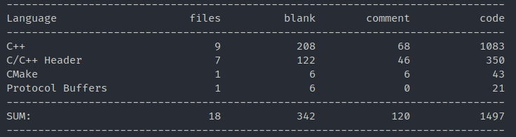

# 项目说明

项目除去测试代码大概 **1500 行**左右：

* 每天学习六七个小时，对于有 C++基础，懂得 grpc，或者学习过 Go 版本的分布式缓存的录友们，大概**一个星期**就能搞定（甚至更短）；
* 而对于基础不足的录友们，边学边做，大概需要 **15~20 天左右**
* 在学习过程中**借助大模型的帮助**是很有用的，但是不能过度依赖它，毕竟幻觉问题还是存在的，我们只是利用这个工具来帮助我们理解，**学习过程中一定要有自己的思考**

## 项目要点

* \*\*分布式架构：\*\*基于一致性哈希算法确保负载均衡，支持节点动态扩缩容和节点发现机制；
* \*\*高效缓存策略：\*\*采用 LRU（最近最少使用）缓存淘汰算法，支持缓存容量限制；
* \*\*服务发现与注册：\*\*基于 etcd 实现服务注册与发现（使用 `etcd-cpp-apiv3` 库），支持节点健康检查，实时监控集群状态变化；
* \*\*通信协议：\*\*使用 gRPC 进行节点间通信，支持 Protocol Buffers 序列化；使用 restful api 对外提供服务

## 学习建议

* 在 **Linux 平台**下编写过 C/C++ 代码，熟悉基本开发环境和工具链，懂得利用 **CMake** 或其他工具来开发 C++项目；
* 项目采用 C++17 开发，需要熟悉（现代）C++ 的常用特性，如**智能指针**、**RAII**、**Lambda**、**线程库**等；
* 了解基本的多线程编程概念；
* 能理解**包管理工具**，例如 **Conan**、Vcpkg、Xrepo 等；
* 对 **C++ 网络编程** 有一定掌握，了解 **HTTP 协议**、**RPC** 等相关知识；

## 项目的“分布式”主要体现在哪里

### 节点间通信与数据分片

KCache使用一致性哈希算法实现数据在多个节点间的分布式存储。当客户端请求数据时，系统通过`PeerPicker`类选择负责该键的节点，如果数据不在本地节点，则通过 gRPC 协议向远程节点请求。

### 服务发现与集群管理

每个节点启动时自动向 etcd 注册服务，并通过 etcd 监听其他节点的加入和离开。这种机制确保了集群成员的动态发现和管理。

### 多节点部署架构

项目支持通过 Docker Compose 部署多节点集群，每个节点运行独立的 gRPC 服务器，并通过 HTTP 网关提供统一的 REST API 接口。

### 负载均衡与容错

系统使用一致性哈希环确保键值的均匀分布，并在节点故障时通过 etcd 的租约机制自动清理失效节点，实现了自动故障转移。

> 更新: 2025-07-16 14:49:35  
> 原文: <https://www.yuque.com/chengxuyuancarl/vv9v2t/dgapspvbv36f9gta>