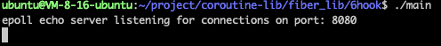
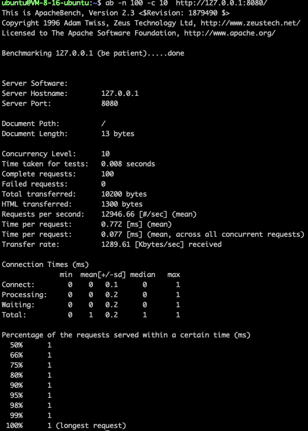
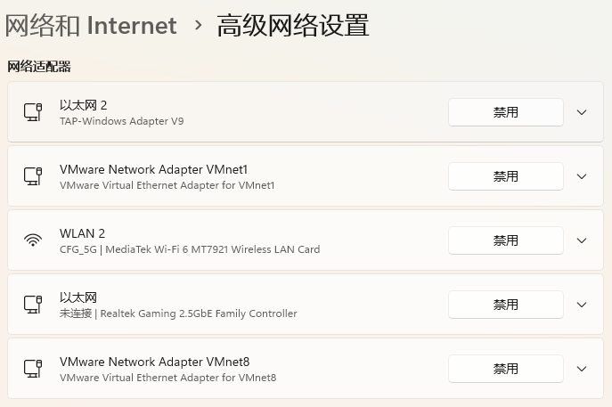
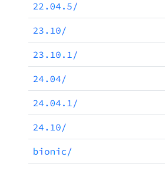

# 3、环境准备

<font style="color:#333333;">建议购买一台云服务器，腾讯云或者阿里云，用来部署自己的项目 非常方便，无论是做本项目还是做其他项目，无论是自己练习，还是项目上线，都需要一台有公网Ip的独立服务器。</font>

+ [阿里云活动期间服务器购买](https://www.aliyun.com/minisite/goods?taskCode=shareNew2205&recordId=3641992&userCode=roof0wob)
+ [腾讯云活动期间服务器购买](https://curl.qcloud.com/EiaMXllu)

## 运行环境
Ubuntu 22.04 LTS 

## 编译指令
首先进入文件所在目录

```shell
cd coroutine-lib && cd fiber_lib && cd 6hook
```

在6hook文件下编译链接可执行文件

```shell
g++ *.cpp -std=c++17 -o main -ldl -lpthread
```


执行可执行文件

```shell
./main
```

如图：

 

### 测试工具的使用：
在ubuntu安装

```shell
sudo apt update
sudo apt install apache2-utils
```

判断是否安装成功

```shell
ab -V
```

### 通过测试工具运行项目:
**注意别忘记启动main可执行程序，并且额外开一个窗口执行以下内容** 

测试工具apache的命令使用的是: 

```shell
ab -n 100 -c 10  http://127.0.0.1:8080/
```

如图：



+ -n 连接数
+ -c 并发数

可以根据自己的服务器的CPU数量，适当调整 测试连接数 和 并发数的数量。


## <font style="color:#333333;">如果不用云服务器，就自己安装虚拟机 （很麻烦，不推荐）： </font>
<font style="color:#333333;">我这里使用的是正常的win10及以上的系统</font>

**<font style="color:#333333;">下载好Vmware16：</font>**

<font style="color:#333333;">可以参考下面这篇文章</font>

[最新版虚拟机VMware16pro下载与安装教程（保姆级）_vm ware 16 pro 下载-CSDN博客](https://blog.csdn.net/ie30GGG/article/details/124902981)

如果出现了虚拟机器也就是Ubuntu没有网络连接不上网的情况。

考虑以下几种情况：

检查你是否存在虚拟网卡



如果不存在可以考虑修复注册表因为这种情况大多数都是你删除vmwar的时候没删除干净，我推荐一个修复软件。

[Glary Utilities | Glarysoft](https://www.glarysoft.com/)

其他基本可以看这个解决(最重要一点一定要看你的ubuntu的网络和你的电脑是不是一个子网比如10.0.1.0最后一个0无所谓前面要一致)。

[Ubuntu无网络连接/无网络标识解决方法_ubuntu没网-CSDN博客](https://blog.csdn.net/qq_45400167/article/details/125874887)

<font style="color:#333333;">Ubuntu24.04。</font>

<font style="color:#333333;">下载地址：  
</font>[VMware虚拟机安装Ubuntu24.04教程（中文）_ubuntu24.04下载-CSDN博客](https://blog.csdn.net/qq_44490498/article/details/138261865)




# 补充
如果有的小伙伴不喜欢用ubuntu的操作方式这里可以使用vscode连接到ubuntu。

vscode的安装：

[VSCode安装配置使用教程（最新版超详细保姆级含插件）一文就够了_vscode使用教程-CSDN博客](https://blog.csdn.net/msdcp/article/details/127033151)

连接的话具体可以看下面的link：

[Vscode连接Ubuntu！看这一篇就够了！_vscode ubuntu-CSDN博客](https://blog.csdn.net/ggw15938357681/article/details/137228620)


> 更新: 2025-11-04 11:04:44  
> 原文: <https://www.yuque.com/chengxuyuancarl/id1now/it5oq4lng3u6gg49>