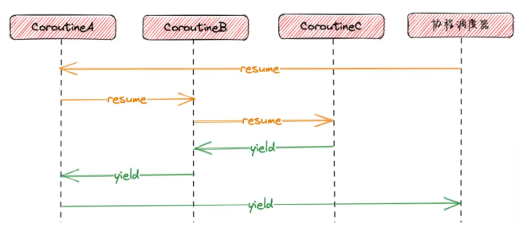

# 4、协程的学习

## <font style="color:#333333;">协程的基础知识</font>

对于协程有两个英文关键单词需要你记住resume(恢复)和yield(暂停)，只是这里的意思是这样。

### 什么是协程？

协程也可以叫做”**轻量级的线程，用户线程**“。

简单的理解协程，协程一种执行过程中能够yield(暂停)和resume(恢复)的子程序，也可以说是协程就是函数和函数运行状态的组合，怎么理解？正常的函数在执行中是直接就执行完成了中间不会有多余的步骤，更不会说我这个函数执行到一半就去执行其他函数了，但是协程不一样，我们使用协程首先要绑定一个入口函数，并且可以在函数的任意位置暂停去执行其他其他的函数，再回来执行暂停的函数，所以说协程是函数和函数运行状态的组合(**协程需要绑定入口函数，协程记录了函数的运行状态**)。

那么协程是如何做到让函数暂停和让函数的恢复呢？\
这个是因为协程的记录会有协程上下文，协程执行yield的时候协程上下文记录了协程暂停的位置，当resume的时候就是从暂停的地方恢复。协程上下文包含了函数在当前状态的全部cpu寄存器的值，这些寄存器记录函数的栈帧、代码执行的位置等信息，如果把这些值交给cpu去执行那么就会实现从函数暂停的地方去恢复执行。**需要注意单线程的情况下，协程的resume和yield一定是同步的，一个协程进行yield暂停，必然对应另一个协程的resume恢复，因为线程不能没用执行主体。**

并且协程的yield和resume是应用程序控制的，这点和线程不一样线程的运行和调度是操作系统来完成的，**协程的运行和调用是由应用程序来完成的**，所以协程也叫做“**用户态线程**”。

<font style="color:rgb(51, 51, 51);">更多协程的介绍可以参考：</font>

[【协程第一话】协程到底是怎样的存在？\_哔哩哔哩\_bilibili](https://www.bilibili.com/video/BV1b5411b7SD/)

<https://jasonkayzk.github.io/2022/06/03/%E6%B5%85%E8%B0%88%E5%8D%8F%E7%A8%8B/>

### 对称协程与非对称协程

<font style="color:rgb(51, 51, 51);">对称协程和非对称协程是协程的一种分类，它们的区别主要在于协程的切换方式和控制流的管理；</font>

**<font style="color:rgb(51, 51, 51);">对称协程</font>**

**<font style="color:rgb(51, 51, 51);">对称协程</font>**<font style="color:rgb(51, 51, 51);">运行协程之间直接相互调用和切换，控制流(执行权拿到执行权的协程才可以执行)可以在多个协程之间自由的转移。这种协程中协程之间是平等的，它们可以相互调用对方，类似于函数调用。每个协程可以显示的决定将控制权转移到那个协程。</font>

**<font style="color:rgb(51, 51, 51);">特点：</font>**

**<font style="color:rgb(51, 51, 51);">自由切换：</font>**<font style="color:rgb(51, 51, 51);">协程可以显示地将控制权转移到其他协程。</font>

**<font style="color:rgb(51, 51, 51);">平等地位：</font>**<font style="color:rgb(51, 51, 51);">所有协程在调度时没用层级的关系，彼此平等。</font>

**<font style="color:rgb(51, 51, 51);">复杂性：</font>**<font style="color:rgb(51, 51, 51);">因为可以任意的切换协程，可能会让程序变得很复杂。</font>

```plain
//因为还没有学习云风的库先用python模拟
def coroutine_a():
print("A1")
switch_to(coroutine_b)
print("A2")

def coroutine_b():
print("B1")
switch_to(coroutine_a)
print("B2")

coroutine_a();
//运行逻辑
先打印A1，然后yield暂停a函数协程跳转到b函数执行打印B1，然后resume恢复a函数打印A2，最后打印B2(因为每个协程相当于调度器一样执行过去完了不就回来了。)
```

**非对称协程**

\*\*非对称协程，\*\*出现了类似堆栈的调用方和被调用方，也就是出现了层级的关系，具体就是A调用了B，B作为了被调用放其进行yield的时候就会将执行的控制权交换给A，而不是其他协程。

（这里使用了原文档的图）



具体我们来看当程序运行的时候依靠协程调度器调用a函数先执行，然后a函数执行的时候调用了b，b有调用c，此时c进行了yield，此时返回的不是协程调度器或者其他协程，而是调用方的b，b进行yield则返回了a，a返回了协程调度器。从中我们可以看出谁进行了resume到另一个协程那么必然那个协程yield会回来。

**使用场景：**

**对称协程：**

* 复杂多任务协作：多个任何或子任务需要频繁、直接彼此交互，共同协同完成一个目标。
* 状态机驱动系统：当有多个状态需要彼此直接切换，避免中间步骤
* 需要频繁切换的计算密集型任务：特别适合高性能场景，例如游戏开发，一个任务可以主动切换到另外一个。

**非对称协程：**

* IO密集型应用：通常需要等待多个IO事件完成，例如web服务器中的请求处理和数据库读写。
* 任务调度：在多线程或任务调度中，协程由一个中心调度器进行调度，这样可以统一处理任务切换，例如Web服务框架中的请求/响应循环。
* 简单的生产者消费者：例如，异步事件循环中，非对称协程使协程的启动、暂停、恢复由调度者控制，结构清晰避免了协程之间的相互依赖

\*\*小总结：对称协程更加灵活，非对称协程更加简单。\*\*也就是说对于对称协程而言，不仅要绑定自己的入口函数来运行而且还需要显示调用下一个调度的协程进行切换，相当于每个协程都做了协程调度器的工作，虽然这样设计起来比较麻烦，且程序运行起来也比较难管理和维护。<font style="color:rgb(51, 51, 51);">而在非对称协程中，可以借助专门的调度器来负责调度协程，每个协程只需要运行自己的入口函数，然后结束时将运行权交回给调度器，由调度器来选出下一个要执行的协程即可。</font>

### <font style="color:rgb(51, 51, 51);">有栈协程与无栈协程</font>

**有栈协程：**

用独立的执行栈来保存协程的上下文信息（当前状态全部寄存器的值）。当协程被yield挂起时，有栈协程会保存当前的执行状态(例如函数调用栈，局部变量、传递的参数等)，<font style="color:rgb(51, 51, 51);">并将控制权交还给调度器。当协程被恢复时，栈协程会将之前保存的执行状态恢复，从上次挂起的地方继续执行。类似于内核态线程的实现，不同协程间切换还是要切换对应的栈上下文，只是不用陷入内核而已。</font>

**<font style="color:rgb(51, 51, 51);">无栈协程：</font>**

<font style="color:rgb(51, 51, 51);">它不需要独立的执行栈来保存协程的上下文信息，协程的上下文都放到公共内存中，当协程被挂起时，无栈协程会将协程的状态保存在堆上的数据结构中，并将控制权交还给调度器。当协程被恢复时，无栈协程会将之前保存的状态从堆中取出，并从上次挂起的地方继续执行。协程切换时，使用状态机来切换，就不用切换对应的上下文了，因为都在堆里的。比有栈协程都要轻量许多。</font>

**补充总结：有栈和无栈的区分是看能不能任意的保存并切换嵌套函数，因为无栈不切换调用栈，所以无法做到嵌套多个函数还能像有栈一样切换。**

<font style="color:rgb(51, 51, 51);">更多详细介绍可以参考：</font>

<https://mthli.xyz/stackful-stackless/>

<https://zhuanlan.zhihu.com/p/347445164>

### 独立栈与共享栈

独立栈和共享栈都是有栈协程(就是可以切换嵌套函数)

**<font style="color:rgb(51, 51, 51);">共享栈本质就是所有的协程在运行的时候都使用同一个栈空间，每次协程切换时要把自身用的共享栈空间拷贝。</font>**<font style="color:rgb(51, 51, 51);">对协程调用 yield 的时候，该协程栈内容暂时保存起来，保存的时候需要用到多少内存就开辟多少，这样就减少了内存的浪费， resume 该协程的时候，协程之前保存的栈内容，会被重新拷贝到运行时栈中。</font>

**<font style="color:rgb(51, 51, 51);">独立栈，也就是每个协程的栈空间都是独立的，固定大小</font>**<font style="color:rgb(51, 51, 51);">。好处是协程切换的时候，内存不用拷贝来拷贝去。坏处则是 内存空间浪费。因为栈空间在运行时不能随时扩容，否则如果有指针操作执行了栈内存，扩容后将导致指针失效。为了防止栈内存不够，每个协程都要预先开一个足够的栈空间使用。当然很多协程在实际运行中也用不了这么大的空间，就必然造成内存的浪费和开辟大内存造成的性能损耗。</font>

**优缺点：**

* 独立栈相对简单，但废内存，冗余栈溢出。
* 共享栈使用公共资源，公共资源内存空间比较大，相对安全节省内存，但是协程需要频繁的进行内存的拷贝，废cpu。

### 协程的优缺点

**优点：**

**1、高效资源利用**

轻量级：协程比线程更轻量。一个线程的创建和上下文开销较大相较于协程，因为协程是利用了线程所使用的栈空间，所以其开销就小。

**2、简化异步编程**

可读性高：使用协程编程异步的程序看起来就好像使用同步代码的异步代码，提升代码的可读性和维护性。比如在Python中,使用'async'和'await'语法可以使异步的代码看起来像同步的。

**补充:同步就是你做了A事件就一定会有B事件比如你发了消息就肯定会有人收到也就是说你一定知道会发生什么，异步如果你学习了计算机操作系统的信号，信号的发生是未知的不可预知的发生我们也叫异步。**

**3、非阻塞操作**

提高性能：协程运行非阻塞操作，使得程序可以在等待I/O或其他耗时操作时继续执行其他任务，提高了程序的并发性和响应性。

**4、适用于高并发场景**

处理大量并发任务：由于协程开销小，适合处理大量的并发任务，如网络请求或高并发的IO操作。

**缺点：**

\*\*第4点最重要，最起码要记住。\
\*\***1、调试困难**

\*\*跟踪问题：\*\*由于协程涉及及异步和延迟执行，调试和跟踪问题可能会比同步代码更复杂，尤其是多个协程交互时候。

**2、复杂的管理**

\*\*协程调度：\*\*对于高级特性(如协程调度、优先级管理)需要额外的调度器或框架支持，这可能增加系统的复杂性。

**3、协程状态管理**

\*\*难以管理状态:\*\*在协程之间共享和管理状态可能会引入复杂性，需要仔细设计避免数据竞争和一致性的问题。

**4、无法利用多核资源**

<font style="color:rgb(51, 51, 51);">线程才是系统调度的基本单位，单线程下的多协程本质上还是串行执行的，只能用到单核计算资源，所以协程往往要与多线程、多进程一起使用。</font>

**<font style="color:rgb(51, 51, 51);">怎么去理解这句话？</font>**

<font style="color:rgb(51, 51, 51);">在现在的系统中，线程是可以直接由操作系统调度的。系统调度器可以将不同线程分配到不同的cpu核上并行执行，因此线程级别的并发可以利用多核资源。换句话说单线程只能被分配到一个cpu的核心上此时哪怕有多协程也只能等待一个协程yield后，另一个协程才能执行resume。</font>

**<font style="color:rgb(51, 51, 51);">这样又引申出了，由应用程序直接控制的调度是无法指定和分配到具体的cpu核心上的，因为操作系统负责对cpu核心资源的分配。</font>**

<font style="color:rgb(51, 51, 51);">比如应用程序可以创建、销毁线程，控制线程的启动、暂停、恢复、结束等行为，但这些都是逻辑上的控制。</font>

<font style="color:rgb(51, 51, 51);">操作系统才是线程实际运行的管理者，决定了线程什么时候运行，以及分配到那个cpu核心上运行。</font>

<font style="color:rgb(51, 51, 51);">通过协程的概念我们知道，协程实际上是依附在线程上并且完全由应用程序去控制，所以cpu核的使用取决于线程的数量，如果是单线程哪怕多个协程也是无法利用到cpu的多核心资源</font>

## <font style="color:rgb(51, 51, 51);">协程类的实现</font>

### <font style="color:rgb(51, 51, 51);">c++有哪些协程库？</font>

C++20引入了原生的协程支持作为C++标准库的一部分，可以用于编写异步代码。具体介绍可参考<https://www.bennyhuo.com/2022/03/09/cpp-coroutines-01-intro/>

<font style="color:rgb(51, 51, 51);">一些有名的第三方协程库有：</font>

<font style="color:rgb(51, 51, 51);">Boost.Coroutine2：这是Boost库中的一个模块，提供了一组灵活的协程实现，包括对称协程和非对称协程。它提供了一些强大的特性，如支持多个栈和自定义栈大小。</font>

<font style="color:rgb(51, 51, 51);">libco：腾讯微信团队开源的一个C/C++协程库，据说微信后台大量在使用这个库，通过几个简单的接口就能实现协程的创建/调度，同时基于epoll/kqueue实现了一个事件反应堆，再加上sys\_call（系统调用）hook技术，以此给开发者提供同步/异步的开发方法</font><font style="color:rgb(51, 51, 51);">\ </font><font style="color:rgb(51, 51, 51);">libgo ：是一个使用 C++ 编写的协作式调度的stackful有栈协程库, 同时也是一个强大的并行编程库。支持linux平台，MacOS和windows平台，在c++11以上的环境中都能用。</font>

<font style="color:rgb(51, 51, 51);">还有很多不同功能和适用场景的C++协程库可自行搜索。</font>

### <font style="color:rgb(51, 51, 51);">协程类的实现</font>

<font style="color:rgb(51, 51, 51);">在正式编写协程类之前，⾸先需要学习⼀下Linux下的ucontext族函数，ucontext机制是GNU C库提供的⼀组创 建，保存，切换⽤户态执⾏上下⽂的API，这是协程能够随时切换和恢复的关键。</font>

**<font style="color:rgb(51, 51, 51);">项目里主要会用到的API如下：</font>**

```cpp
// 上下⽂结构体定义
// 这个结构体是平台相关的，因为不同平台的寄存器不⼀样
// 下⾯列出的是所有平台都⾄少会包含的4个成员
typedef struct ucontext_t {
 // 当前上下⽂结束后，下⼀个激活的上下⽂对象的指针，只在当前上下⽂是由makecontext创建时有效
struct ucontext_t *uc_link;
 // 当前上下⽂的信号屏蔽掩码
sigset_t          uc_sigmask;
 // 当前上下⽂使⽤的栈内存空间，只在当前上下⽂是由makecontext创建时有效
stack_t           uc_stack;
 // 平台相关的上下⽂具体内容，包含寄存器的值
mcontext_t        uc_mcontext;
    ...
 } ucontext_t;
 // 获取当前的上下⽂
int getcontext(ucontext_t *ucp);
 // 恢复ucp指向的上下⽂，这个函数不会返回，⽽是会跳转到ucp上下⽂对应的函数中执⾏，相当于变相调⽤了函数
int setcontext(const ucontext_t *ucp);
 // 修改由getcontext获取到的上下⽂指针ucp，将其与⼀个函数func进⾏绑定，⽀持指定func运⾏时的参数，
// 在调⽤makecontext之前，必须⼿动给ucp分配⼀段内存空间，存储在ucp->uc_stack中，这段内存空间将作为
func函数运⾏时的栈空间，
// 同时也可以指定ucp->uc_link，表示函数运⾏结束后恢复uc_link指向的上下⽂，
// 如果不赋值uc_link，那func函数结束时必须调⽤setcontext或swapcontext以重新指定⼀个有效的上下⽂，
否则程序就跑⻜了
// makecontext执⾏完后，ucp就与函数func绑定了，调⽤setcontext或swapcontext激活ucp时，func就会被
运⾏
void makecontext(ucontext_t *ucp, void (*func)(), int argc, ...);

// 恢复ucp指向的上下⽂，同时将当前的上下⽂存储到oucp中，
// 和setcontext⼀样，swapcontext也不会返回，⽽是会跳转到ucp上下⽂对应的函数中执⾏，相当于调⽤了函数
// swapcontext是sylar⾮对称协程实现的关键，线程主协程和⼦协程⽤这个接⼝进⾏上下⽂切换
int swapcontext(ucontext_t *oucp, const ucontext_t *ucp);
```

更详细的介绍和示例可以参考：[ucontext-人人都可以实现的简单协程库-阿里云开发者社区 (aliyun.com)](https://developer.aliyun.com/article/52886)

<font style="color:rgb(51, 51, 51);">sylar的协程实现使⽤了⾮对称模型，且保证⼦协程不能再创建新的协程，即协程不能嵌套调⽤，⼦协程只能与线程 主协程进⾏切换，这种模型简单，⾮常容易理解。</font>

### <font style="color:rgb(51, 51, 51);">对uncontext的补充</font>

**1、干货：**

\*\*c++/c不直接支持协程语义库，具体可能要c++20引入协程，但是有不少开源的协程库，如：\
\*\*Protothreads：[一个“蝇量级” C 语言协程库](http://coolshell.cn/articles/10975.html)\
libco:[来自腾讯的开源协程库libco介绍](http://www.cnblogs.com/bangerlee/p/4003160.html)，[官网](http://code.tencent.com/libco.html)\
coroutine:[云风的一个C语言同步协程库](https://github.com/cloudwu/coroutine/),[详细信息](http://blog.codingnow.com/2012/07/c_coroutine.html)

目前看到大概有四种实现协程的方式：

* 第一种：利用glibc 的 ucontext组件(云风的库)
* 第二种：使用汇编代码来切换上下文([实现c协程](http://www.cnblogs.com/sniperHW/archive/2012/06/19/2554574.html))
* 第三种：利用C语言语法switch-case的技巧来实现（Protothreads)
* 第四种：利用了 C 语言的 setjmp 和 longjmp（ [一种协程的 C/C++ 实现](http://www.cnblogs.com/Pony279/p/3903048.html),要求函数里面使用 static local 的变量来保存协程内部的数据）

**本篇主要使用ucontext来实现简单的协程库。**

**2、ucontext初接触**

利用ucontext提供的四个函数

getcontext()、setcontext()、makecontext()、swqpcontext()可以在一个进程中实现用户击级的协程切换。

先来看看简单的例子：

```cpp
#include<stdio.h>
#include<ucontext.h>
#include<unistd.h>
int main(int argc,const char *argv[]){
ucontext_t context;//创建结构体对象
getcontext(&context);//获取上下文
puts("Hello world");
sleep(1);
setcontext(&context);//恢复getcontext指向的上下文
return 0;
}
//运行结果
//通过
gcc example.c -o example
会无限制的打印hello world.
    
```

那么问题来了那么神奇的ucontext到底是什么？

**3、ucontext组件是什么？**

ucontext\_t是POSIX标准中定义的一个结构体，用于表示用户级上下文。它通常用于非对称协程切换。

在类System V的环境中，在头文件\*\*\<ucontext.h>\*\*中定义了两个结构体类型，mcontext\_t和ucontext\_t和四个函数getcoontext()，setcontext(),makecontext(),swapcontext().利用它们可以在一个进程中实现用户级的线程切换(协程)。mcontext\_t类型与机器相关，并且不透明。ucontext\_t结构体则至少拥有以下几个域：

```cpp
         typedef struct ucontext {
               struct ucontext *uc_link;//系统恢复时指向的上下文
               sigset_t         uc_sigmask;
               stack_t          uc_stack;
               mcontext_t       uc_mcontext;
               ...
           } ucontext_t
```

如果当前上下文如果使用的结构体是(makecontext创建的上下文)运行终止时系统会恢复uc\_link指向的上下文，uc\_sigmask为该上下问中阻塞信号集合；uc\_stack为该上下文使用的栈；uc\_mcontext保存的上下文的的特定机器表示，包括调用线程的特定寄存器等。

**补充：uc\_mcontext的作用**

\*\*"uc\_mcontext"**保存了处理器的特定状态，包括各种寄存器值和其他硬件相关的信息。当一个上下文被保存时，这些寄存器的值和处理器状态会被存储到uc\_mcontext中。当上下文被恢复时候，**"uc\_mcontext"\*\*中的内容会被加载回处理器寄存器，使得处理器恢复到保存上下文时的状态。

**简单理解就是，uc\_mcontext就是实现协程上下文保存的关键通过保存pc指针和栈指针(相当于保存调用栈)，协程上下文的挂起和恢复依赖的就是uc\_mcontext.**

小总结：

<font style="color:rgb(51, 51, 51);">当一个子程序（例如一个协程）被暂停时，系统会保存当前的处理器状态到 </font><code><font style="color:rgb(51, 51, 51);background-color:rgb(243, 244, 244);">uc_mcontext</font></code><font style="color:rgb(51, 51, 51);"> 中，包括所有的寄存器值和其他必要的处理器状态信息。这样，处理器可以完全恢复到这个状态。然后，当需要恢复这个子程序时，系统会将 </font><code><font style="color:rgb(51, 51, 51);background-color:rgb(243, 244, 244);">uc_mcontext</font></code><font style="color:rgb(51, 51, 51);"> 中保存的状态重新加载到处理器寄存器中，从而恢复上下文，继续执行子程序。</font>

**<font style="color:rgb(51, 51, 51);">讲了那么多来练习一下吧</font>**

<font style="color:rgb(51, 51, 51);">先复习一下那四个函数的用途：\ </font><font style="color:rgb(51, 51, 51);">getcontext：初始化ucp结构体，将当前上下文保存到ucp中</font>

```cpp
int getcontext(ucontext_t *ucp);
```

<font style="color:rgb(51, 51, 51);">setcontext:</font>

<font style="color:rgb(51, 51, 51);">设置当前的上下文为ucp，setcontext的上下文应该通过getcontext或者makecontext取得，如果调用成功则不返回。如果上下文是通过getcontext()取得，程序会继续执行这个调用后面的内容比如我们刚刚的helloworld，如果上下文是通过调用makecontext取得,程序会调用makecontext函数的第二个参数指向的函数，如果func函数返回,则恢复makecontext第一个参数指向的上下文第一个参数指向的上下文context\_t中指向的uc\_link.如果uc\_link为NULL,则线程退出。</font>

```cpp
int setcontext(const ucontext_t *ucp);
```

<font style="color:rgb(51, 51, 51);">makecontext:</font>

<font style="color:rgb(51, 51, 51);">makecontext修改通过getcontext取得的上下文ucp(这意味着makecontext前必须调用getcontext)。然后给上下文指定一个栈空间ucp->stack,设置后继的ucp->uc\_link.</font>

<font style="color:rgb(51, 51, 51);">当上下文通过setcontext或者swapcontext激活后，执行func函数，argc为func的参数个数，后面是func的参数序列。当func执行返回后，继承的上下文被激活，如果继承上下文ucp->link为NULL时，线程退出。</font>

```cpp
void makecontext(ucontext_t *ucp, void (*func)(), int argc, ...);
```

<font style="color:rgb(51, 51, 51);">swapcontext:</font>

<font style="color:rgb(51, 51, 51);">保存当前上下文到ucp结构体中，然后激活upc上下文。 </font>

<font style="color:rgb(51, 51, 51);">如果执行成功，getcontext返回0，setcontext和swapcontext不返回；如果执行失败，getcontext,setcontext,swapcontext返回-1，并设置对于的errno.</font>

```cpp
int swapcontext(ucontext_t *oucp, ucontext_t *ucp);
```

**正式开始：**

<font style="color:rgb(51, 51, 51);">虽然我们称协程是一个用户态的轻量级线程，但实际上多个协程同属一个线程。任意一个时刻，同一个线程不可能同时运行两个协程。如果我们将协程的调度简化为：主函数调用协程1，运行协程1直到协程1返回主函数，主函数在调用协程2，运行协程2直到协程2返回主函数。</font>

**<font style="color:rgb(51, 51, 51);">示意步骤如下,这也是非对称协程的运行过程：</font>**


**实现用户级线程(协程)的过程是：**\
我们首先调用getcontext获得当前上下文

修改当前上下文的ucontext\_t来指定新的上下文，如指定栈空间及其大小，设置用户线程执行完后返回后继上下文(即主函数的上下文)等

调用makecontext创建上下文，并指定用户线程中要执行的函数。

切换到用户线程上下文去执行用户线程(如果设置的后继上下文为主函数，则用户线程执行完后会自动返回主函数)。

下面context\_test函数完成了上面的要求。

```cpp
#include<ucontext.h>
#include<stdio.h>
void func1(void *arg)
{
    puts("1");
    puts("11");
    puts("111");
    puts("1111");
}//此函数用来给makecontext使用
void context_test()
{
    char stack[1024*128];//设置栈的空间
    ucontext_t child,main;//设置两个上下文
    getcontext(&child);//将此时的上下文信息保存到child中
    child.uc_stack.ss_sp=stack;//指定栈空间
    child.uc_stack.ss_size=sizeof(stack);//指定栈空间大小
    child.uc_stack.ss_flags=0;
    child.uc_link=&main;//设置后继上下文
    makecontext(&child,(void(*)(void))func1,0);//修改上下文让其指向func1的函数
    swapcontext(&main,&child);//切换到child上下文，保存当前上下文到main
    puts("main")//如果设置了后继上下文也就是uc_link指向了其他ucontext_t的结构体对象则makecontext中的函数function
                //执行完成后会返回此处打印main，如果指向的为nullptr就直接结束
}
int main()
{
    context_test();
    return 0;
}
```

**具体的分析：**\
首先设计了一个func1的函数用来提供给makecontext使用，当makecontext出现后会将上下文child替换成func1函数并且进入函数内执行，我们可以发现getcontext和makecontext是成对出现的并且要在makecontext设置好ucontext\_t 结构体对象的值，然后swapcontext执行保存的上下文child并且将当前的上下文保存到main中，由于child在makecontext已经被替换成了func1函数，所以我们会去执行func1函数的代码打印结果，因为uc\_link设置了后继的上下文所以执行完func1后会从swapcontext后执行打印main，至此流程结束。

所以，通过这种流程：

**非对称协程的特点**得以体现，协程 1 是 `child`，协程 2 是 `main`。控制权从主协程（`context_test` 中的 `main` 上下文）进入 `child`（协程 1），而执行完 `child` 后，控制权回到 `main`，继续执行后续代码。

`swapcontext` 和 `uc_link` 帮助实现了协程的 **切换和恢复**，实现了协程从 `main` 到 `child` 再回到 `main` 的完整流转。

引出一个小问题：**<font style="color:rgb(51, 51, 51);">如果get后面还有打印就像上面的循环打印helloworld会因为make后无法继续循环吗？</font>**

<font style="color:rgb(51, 51, 51);">答案是肯定的因为make后会修改上下文，使其在被set或者swap激活时候，跳转到函数进行，然后执行函数，函数返回后会执行后swap或set中保存后继的位置，也就是swap或set的位置开始执行后面的内容。</font>

```cpp
#include <stdio.h>
#include <ucontext.h>

void func1() {
    puts("In func1");
}

int main() {
    ucontext_t context;
    getcontext(&context);
    context.uc_stack.ss_sp = malloc(8192);
    context.uc_stack.ss_size = 8192;
    context.uc_link = NULL;
    makecontext(&context, func1, 0);
    setcontext(&context);
    puts("This will not be printed");
    puts("Hello World");
    return 0;
}
```


> 更新: 2025-06-05 15:36:56  
> 原文: <https://www.yuque.com/chengxuyuancarl/id1now/kva81b5egidud39g>