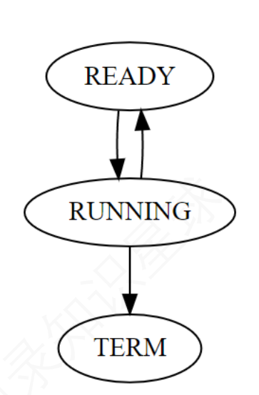
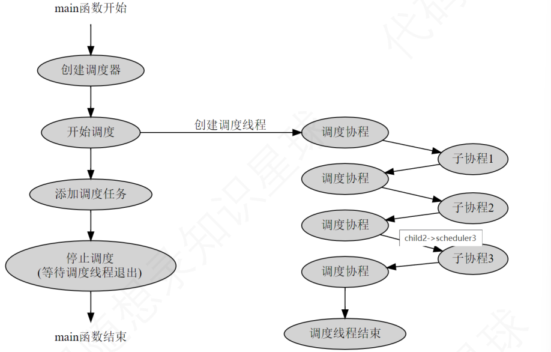
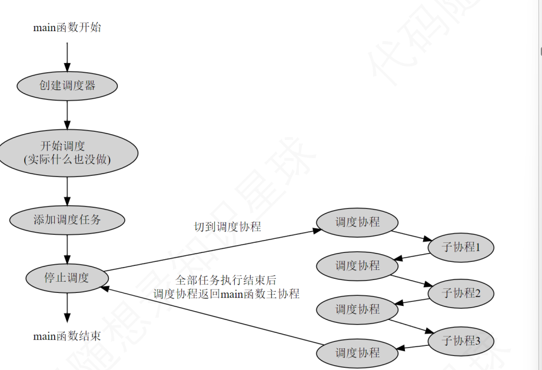
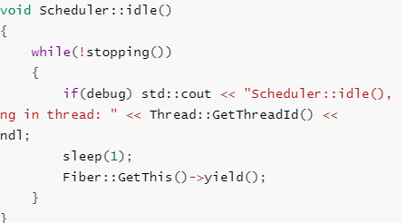

# 5、模块的详解与代码分析

# 协程库代码：

## 从哪里开始需要什么类？

**主要分为以下：**

* thread：这个模块的意义主要是为了完成，协程的缺点使用多线程配合多协程更好的利用多核cpu的资源。
* fiber：负载协程的创建、暂停等真正运行任务的地方。
* scheduler：没有这个类那就需要用户自己去调度协程的执行和暂停，不够灵活显得不够智能。
* ioscheduler：io+scheduler，协程库是需要使用在服务器上的服务器上的fd都配合不了，那不就成了一个玩具项目，此类使用epoll监听fd上绑定的读写事件，当读写事件触发将其放入到调度器中等待调度。
* timer：服务器也需要一个定时器吧，不然遇到定时任务如何执行，所有此类完成定时器的创建、删除、和取消，使用最小堆的结果，将超时定时器触发作为固定信号tickle来触发ioscheduler等待的epoll\_wait。
* hook：hook+ioscheduler才能完全体现出一个非阻塞的服务器框架，虽然前面实现了协程的调度，但是每个系统调用中，不去改变函数内部结构无法做出协程的挂起和恢复，也就是sleep(1)该睡多久还是多久，无法体现我们使用协程的优势，所以就将使用hook改变原始函数增添内容，更好的搭配上我们的ioscheduler，将其sleep(1)作为定时任务，放入到time中的定时器堆中等待超时触发，后唤醒epoll去放入到调度器中执行。

以上就是这几个类使用的初衷。

### 补充说明

**模块之间的协作**：

* `fiber` 是任务的执行单元，所有任务代码运行在其中。
* `scheduler` 管理 `fiber` 的执行顺序，实现协程的挂起和恢复。
* `ioscheduler` 扩展了 `scheduler` 的功能，支持 IO 事件触发调度。
* `timer` 为 `scheduler` 和 `ioscheduler` 提供定时任务支持。
* `hook` 改变系统调用行为，使其与协程框架更好地配合。

***

## <font style="color:#333333;">Thread类 </font>

在项目中的thread.h分为两个部分：

### Semaphore:

这部分主要知识点：

c++11的condition\_variable ：

简单概念：condition\_variable是c++11提供的一种线程间的同步机制，主要用于在多线程环境下实现条件等待和通知，从而协调线程之间的执行顺序。通常用于需要等待某个条件成立后才能继续执行的场景。

一般需要配合c++11的互斥锁std::unique\_lock一起使用;

详细可以看这里：

[C++11多线程条件变量std::condition\_variable详解（转 ）\_while (!ready) cv.wait(lck);-CSDN博客](https://blog.csdn.net/qq_38210354/article/details/107168532)

信号量：

在操作系统中我们会学习到进程间的通信其中的信号量pv操作，一般P操作代表是减去公共共享的资源，V操作是增加上减去的资源，可以简单理解为是一个-1，+1的操作，其中PV操作还可以实现同步或者互斥，比如共享资源只有1个那么经过p操作后剩余0，此时其他进程或者线程想要获取资源是不行的要等到执行完v操作后才能获取。同步则是共享资源为0因为p操作无法进行，只能等到v操作先添加资源后才能继续，这个就是同步。

详细例子：

这里面的信号量实现的例子和本项目类似

[C++ 多线程（七）：信号量 Semaphore 及 C++ 11 实现 - 知乎](https://zhuanlan.zhihu.com/p/512969481)

互斥锁：

说到互斥锁，其实具体的理念就和信号量的互斥理念类似，都是在多线程环境下防止对共享资源而引发的竞争的问题，主要确保的就是同一时间内只有一个线程可以访问这个共享资源。

详细例子：

这个例子主要是对unique\_lock的讲解。

个人对其的看法：

灵活的加锁和解锁的控制：std::unique\_lock允许手动加锁、解锁和重新加锁，而std::lock\_guard在构造时必须锁定，析构时自动释放。适用场景比如你需要在途中释放锁进行其他操作的话，你最好选择unique\_lock。

因为std::unique\_lock可以手动的释放锁，所以常配合上面说的condition\_variable条件变量共同使用。

[C++11多线程 unique\_lock详解\_uniquelock-CSDN博客](https://blog.csdn.net/u012507022/article/details/85909567)

```cpp
// 用于线程方法间的同步
class Semaphore
{
private:
    std::mutex mtx;
    std::condition_variable cv;
    int count;

public:
    // 信号量初始化为0
    explicit Semaphore(int count_ = 0) : count(count_) {}

    // P操作
    void wait()
    {
        std::unique_lock<std::mutex> lock(mtx);//这里不使用lock_guard的原因是不允许手动解锁，还有因为wait中会将锁释放，如果使用lock_grud函数没有结束的话释放不了锁
        while (count == 0) {//这里是为了防止虚假唤醒，直到count>0才跳出循环
            cv.wait(lock); // wait for signals
        }
        count--;
    }

    // V操作,这里是负责给count++，然后通知wait唤醒等待的线程
    void signal()
    {
        std::unique_lock<std::mutex> lock(mtx);
        count++;
        cv.notify_one();  // signal，要注意这里的one指的不是只有一个可能是多个线程
    }
};


```

**分析：**

1、首先构造函数的隐式转换其目的是防止出现 Semaphore sem=3，将数字3转换成Semaphore的对象。

2、这里使用了信号量进行一个PV操作可以发现，一开始count=0,这意味着是一个同步操作，P操作也就是我们wait函数一开始因为count=0并不能进行-1操作，只有v操作也就是当调用了signal函数count++，并且通过notify\_one();唤醒了cv.wait（lock）,notify\_one()并不是真的只是唤醒了一个wait，可能会唤醒多个但是只有一个能拿到资源所以为了防止多个唤醒但是又拿不到资源的情况，就要使用while去约束防止这种虚假唤醒。

***

### Thread类

Thread类在协程库中主要用于创建并管理底层线程，为协程提供运行环境，同时通过线程局部存储和同步机制，为协程调度提供必要支持。它确保协程可以在合适的线程上被正确的调度和执行。

#### Thread.h

```cpp
class Thread {
public:
    Thread(std::function<void()> cb, const std::string& name);
    ~Thread();

    pid_t getId() const { return m_id; }
    const std::string& getName() const { return m_name; }

    void join();

public:
    // 获取系统分配的线程id
    static pid_t GetThreadId();
    // 获取当前所在线程
    static Thread* GetThis();

    // 获取当前线程的名字
    static const std::string& GetName();
    // 设置当前线程的名字
    static void SetName(const std::string& name);

private:
    // 线程函数
    static void* run(void* arg);

private:
    pid_t m_id = -1;//进程的id
    pthread_t m_thread = 0;//线程

    // 线程需要运行的函数
    std::function<void()> m_cb;
    std::string m_name;//线程的name

    Semaphore m_semaphore;//引入信号量的类来完成线程的同步创建。
};

```

简单分析：

1、对Thread类的构造函数中function分析：

线程的构造函数中又一个知识点std::function\<void()> cb，这个是c++stl中算法具体的目的是用来存放返回值是void()没用参数的函数，你可以理解为是一个容器类似于vector这些。为什么线程需要这个function因为线程是cpu调度的基本单位线程必须有执行的主体，如果没用执行的函数，那要线程做什么？

2、static的使用

这里使用static在getname、setname上的目的是为了方便在类可以直接使用作用域限定符访问。

```cpp
class test{
public: //注意如果这里是private则不行使用限定符访问
    static op(){
    }
};
test::op;//这样就可以直接调用类内的函数，不需要先通过构造函数建立对象。
```

#### Thread.cc

<font style="color:rgb(51, 51, 51);">这里要注意一下有两个设置线程名字的方法主要是方便使用，可以使用构造函数进行取名，也可以通过</font><font style="color:rgb(51, 51, 51);">成函数进行</font><font style="color:rgb(51, 51, 51);">。</font>

**<font style="color:rgb(51, 51, 51);">关键操作的具体实现：\ </font>**<font style="color:rgb(51, 51, 51);">Thread类提供一个构造函数中有function\<void( )>m\_cb和线程名的成员变量，通过pthread\_create()绑定run函数为线程的入口函数，在这里run方法负责初始化线程和真正调用线程需要运行任务(函数对象cb)，并且使用用Semaphore类控制线程初始化的同步，保证</font><font style="color:rgb(51, 51, 51);">所有</font><font style="color:rgb(51, 51, 51);">的线程都能初始化上，防止未初始化的线程出现，剩下的GetThreadId()主要是使用系统调用获取真实的线程id，和getpid()返回的进程ID是一样的。其他就是正常的获取线程的名字或者设置和获取线程的id。</font>

```cpp
#include "thread.h"

#include <sys/syscall.h>
#include <iostream>
#include <unistd.h>

namespace sylar {

    // 线程信息
    static thread_local Thread* t_thread          = nullptr;//当前线程的Thread对象指针
    static thread_local std::string t_thread_name = "UNKNOWN";//当前线程的名称。

    pid_t Thread::GetThreadId()// 获取系统分配的线程id
    {
        return syscall(SYS_gettid);//syscall(SYS_gettid)是一个系统调用，用于获取当前线程的唯一ID。SYS_gettid 是 Linux 特定的系统调用编号，用来获取线程ID (TID)。pid_t 是一个数据类型，用于表示进程ID或线程ID。
    }

    Thread* Thread::GetThis()// 获取当前所在线程
    {
        return t_thread;
    }

    const std::string& Thread::GetName()//获取当前线程的名字
    {
        return t_thread_name;
    }

    void Thread::SetName(const std::string &name)//给当前线程设置名字
    {
        if (t_thread)
        {
            t_thread->m_name = name;
        }
        t_thread_name = name;
    }
    ad::Thread(std::function<void()> cb, const std::string &name):
    m_cb(cb), m_name(name)
    {
        int rt = pthread_create(&m_thread, nullptr, &Thread::run, this);//这里需要注意的是this是传递给run函数进行转换的。
        if (rt)
        {
            std::cerr << "pthread_create thread fail, rt=" << rt << " name=" << name;
            throw std::logic_error("pthread_create error");
        }
        // 等待线程函数完成初始化
        m_semaphore.wait();
    }

    Thread::~Thread()
    {
        if (m_thread)
        {
            pthread_detach(m_thread);
            m_thread = 0;
        }
    }

    void Thread::join()
    {
        if (m_thread)
        {
            int rt = pthread_join(m_thread, nullptr);
            if (rt)
            {
                std::cerr << "pthread_join failed, rt = " << rt << ", name = " << m_name << std::endl;
                throw std::logic_error("pthread_join error");
            }
            m_thread = 0;
        }
    }

    void* Thread::run(void* arg)//这里run为什么需要在h文件中设置为static
    {
        Thread* thread = (Thread*)arg;

        t_thread       = thread;
        t_thread_name  = thread->m_name;
        thread->m_id   = GetThreadId();
        pthread_setname_np(pthread_self(), thread->m_name.substr(0, 15).c_str());//pthread_self()获取当前线程的ID，设置m_name是前15个字节取，
                                                                                //目的就是设置线程的名字方便调试,//存在可能被问的问题为什么是0，15，由于操作系统对线程名称长度的限制决定的，
                                                                                //在linux中线程最大的名字只能是15，后面还有一个\0总共16.

        std::function<void()> cb;
        cb.swap(thread->m_cb); // swap -> 可以减少m_cb中只能指针的引用计数

        // 初始化完成，这里确保了主线程创建出来一个工作线程，提供给协程使用，否则可能出现协程在未出初始化的线程上使用。
    thread->m_semaphore.signal();

        cb();//真正执行函数的地方
        return 0;
    }

}


```

具体分析：

首先要解决的问题是：

1、为什么要使用namespace sylar？

原因：

\*\*避免命名冲突：\*\*在大型项目中，不同的模块或库可能会使用相同的类或者函数名，使用命名空间将这些元素包裹起来，避免了冲突。

**组织代码:**

命名空间可以帮助组织和划分代码，特别是在大型项目中，将相关的类和函数放在一个命名空间中有助于代码结构清晰性和模块化。

2、static thread\_local又是什么意思？

static代表生命周期知道程序运行结束时候销毁，thread\_local表示线程是本地的也就是每一个访问到这个类的线程都具有一个副本都会有Thread的指针及当前线程的名字，并且多个线程独立的副本互不影响。

3、GetThreadId()中的syscall(SYS\_getid)的系统调用具体干啥？

是一个系统调用用于获取当前线程的唯一线程id(TID),进程是PID，获取的目的是为了更好的调式和监控。或者可以记录日志的时候更加清楚的知道是那个线程产生的日志。

4、线程是如何创建、结束和销毁并且static run方法的static有什么作用

**1、对pthread\_create使用前的了解：**

这里使用的是**Unix、Linux**等操作系统的创建线程的函数。实际上它的功能是为了给线程的绑定其入口函数，意思就是线程创建好后它的工作内容是什么。

**2、对pthread\_create、pthread\_detch、pthread\_join的详解**

**pthread\_create**

```cpp
int pthread_create(pthread_t* restrict tidp,const pthread_attr_t* restrict_attr,void* (*start_rtn)(void*),void *restrict arg);
```

* <font style="color:rgb(77, 77, 77);">输入参数：\ </font><font style="color:rgb(77, 77, 77);">tidp:填入pthread\_t类型参数。</font>
* <font style="color:rgb(77, 77, 77);">attr:通常设置为NULL，用于定制各种不同的线程属性。</font>
* <font style="color:rgb(77, 77, 77);">start\_rtn:新创建线程的入口函数由此绑定。无参数把arg设置为NULL即可</font>
* <font style="color:rgb(77, 77, 77);">返回值：成功返回0，否则返回错误码。</font>

<font style="color:rgb(77, 77, 77);">线程的入口函数第一句一般都是获取传入的参数:比如pthread\_create(\&m\_thread, nullptr, \&Thread::run, this);</font>**<font style="color:rgb(77, 77, 77);"></font>**

<font style="color:rgb(77, 77, 77);">Thread\* thread = (Thread\*)arg;</font>

**<font style="color:rgb(77, 77, 77);">pthread\_detch</font>**

* <font style="color:rgb(77, 77, 77);">目的是为了确保线程在结束后能够正确的释放资源，而不需要主线程或其他线程进行join操作。一般适用的场景是在子线程要脱离主线程的管理，并且主线程不需要担心其资源的释放，简化了使用的复杂性。</font>
* <font style="color:rgb(77, 77, 77);">避免了内存泄漏防止忘记调用join导致的内存泄露</font>

**<font style="color:rgb(77, 77, 77);">pthread\_join</font>**

<font style="color:rgb(51, 51, 51);">pthread\_Join是POSIX线程库的一个函数，用于等待一个线程的终止并回收它的资源</font>

**<font style="color:rgb(77, 77, 77);">值得说的一点就是一般都可以写nullptr。如果你需要接受某个实际的值，那就写一个实际的指针去接受它</font>\*\*\*\*<font style="color:rgb(77, 77, 77);">。</font>**

<font style="color:rgb(77, 77, 77);">详细直接看：</font>

[【c语言多线程编程】关于pthread\_create()和pthread\_join()的多线程详解 - 笑着的程序员 - 博客园](https://www.cnblogs.com/smile-programmer/p/17322907.html)

**3、static run设**\*\*<font style="color:rgb(51, 51, 51);">置为静态函数目的</font>\*\*

第一主要是超过了pthread\_create可传入的参数的限制，因为在c++中类的函数都会有一个this指针用于连接对象和成员函数。所以此时需要将run方法设置为static这就没有this指针了，但是入口函数需要用到Thread类怎么办那就传入构造函数的this指针就可以了

**4、pthread\_setname\_np是什么？**

<font style="color:rgb(51, 51, 51);">pthread\_setname\_np是一个非标准的(np代表“non-portable”)POSIX线程库函数，用于设置线程的名字。这名字可以帮助一些调试工具或者日志中显示，这里 </font><code><font style="color:rgb(51, 51, 51);background-color:rgb(243, 244, 244);">pthread_setname_np(pthread_self(), thread->m_name.substr(0, 15).c_str())</font></code><font style="color:rgb(51, 51, 51);"> 语句将当前线程的名字设置为 </font><code><font style="color:rgb(51, 51, 51);background-color:rgb(243, 244, 244);">thread->m_name</font></code><font style="color:rgb(51, 51, 51);"> 的前 15 个字符。</font>

***

## <font style="color:#333333;">fiber类 </font>

<code><font style="color:rgb(51, 51, 51);background-color:rgb(243, 244, 244);">Fiber</font></code><font style="color:rgb(51, 51, 51);">类提供了协程的基本功能，包括创建、管理、切换和销毁协程。它使用了ucontext\_t结构(主要使用非对称协程)保存和恢复协程的上下文，并通过</font><code><font style="color:rgb(51, 51, 51);background-color:rgb(243, 244, 244);">std::function</font></code><font style="color:rgb(51, 51, 51);">来存储协程的执行逻辑。</font>

#### <font style="color:rgb(51, 51, 51);">Fiber.h</font>

**协程的状态**

我们都知道进程有就绪、阻塞等各种状态，要实现协程也要考虑协程的状态，这里我们也尽可能简化，只设置三种协程的状态：就绪态、运行态和结束态，一个协程要么正在运行(RUNNING)，要么准备(READY)，要运行结束(TERM)。

如下图所示：



\*\*注意：\*\*对于非对称协程来说，协程除了创建语句外，只有两种操作，一种是resume，表示恢复协程运行，一种是yield，表示让出执行。协程的结束没有专门的操作，协程函数运行结束时即结束，协程结束时会自动调用一次yield从调度协程返回到主协程（调度协程和主协程的概念会在后面补充）。

在介绍协程时，我们提到协程相当于一个可以随意切换的函数，在实现协程时需要给协程绑定一个运行函数，除此之外我们项目是使用的是独立栈所以需要给每一个创建的协程分配空间。

```cpp
#ifndef _COROUTINE_H_
#define _COROUTINE_H_
#include <iostream>
#include <memory>
#include <atomic>
#include <functional>
#include <cassert>
#include <ucontext.h>
#include <unistd.h>
#include <mutex>
namespace sylar {
class Fiber : public std::enable_shared_from_this<Fiber>
{
public:
    enum State//定义协程的状态，属于协程的上下文切换的时候，需要被保存
    {
        READY,
        RUNNING,
        TERM
    };
private:
    Fiber();//细节1 Fiber()是私有的，只能被GetThis()方法调用，用于创建主协程。
public:
    Fiber(std::function<void()> cb, size_t stacksize = 0, bool run_in_scheduler = true);//用于创建指定回调函数、栈大小和 run_in_scheduler 本协程是否参与调度器调度，默认为true
    ~Fiber();
public:
    void reset(std::function<void()> cb);//重置协程状态和⼊⼝函数，复⽤栈空间，不重新创建栈
    void resume();//恢复协程执行。
    void yield();//将执行全还给调度协程
    uint64_t getId() const {return m_id;}//获取唯一标识
    State getState() const {return m_state;}
public:

    static void SetThis(Fiber *f);//设置当前运行的协程。
    static std::shared_ptr<Fiber> GetThis();//获取当前运行的协程的shared_ptr实例。
    static void SetSchedulerFiber(Fiber* f);//设置调度协程，默认主协程
    static uint64_t GetFiberId();//获取当前运行的协程的ID。
    static void MainFunc();//协程的主函数，入口点
private:
    uint64_t m_id = 0;//协程唯一标识符
    uint32_t m_stacksize = 0;//栈的大小
    State m_state = READY;//协程的初始状态是ready
    ucontext_t m_ctx;//协程的上下文
    void* m_stack = nullptr;//协程栈的指针
    std::function<void()> m_cb;//协程的回调函数
    bool m_runInScheduler;//标志是否将执行器交给调度协程
public:
    std::mutex m_mutex;
    };
  }
#endif

```

#### Fiber.cc:

开始前需要了解的一个知识点：

c++11中std::atomic用法:提供了一种多线程环境进行无锁操作的方法。确保了对变量的所有操作都是原子的，即不会被中断，可以防止数据竞争。

例如：i++这个操作其实不是原子性的在拿取数据到+的过程中有可能会被系统中断或者进行其他操作。但是使用了atomic就不会有这个问题了。所谓的原子性就是一定会发生要么都不发生这点和mysql中的事务一样。

下面的关键操作具体实现：

**提前先说明作者并没用实现嵌套的协程，也就是子协程和子协程的调度，本项目的任务工作主要是由子协程去完成，但是在使用协程之前必须调用一次getthis()为了初始化主协程和调度协程**

##### 构造函数：

**带参构造函数：**

Fiber类提供两个构造函数，带参的用于构造子协程，初始化子协程的ucontext\_t上下文和栈空间，要求传入协程的入口函数，以及可选协程栈大小，sylar采取的是独立栈的形式，每个协程都有自己固定的大小栈空间。协程构造函数要负责分配栈内存空间，并且后面还有是否使用调度器的bool类型变量。

**不带参构造函数：**

不带参的构造函数用于初始化当前线程的协程功能，构造线程主协程的对象，以及对t\_fiber和t\_thread\_fiber、t\_scheduler\_fiber进行赋值。这个函数被定义成私有的成员方法，不允许在类外部调用，只能通过GetThis()方法，在返回当前正在运行的协程时，如果发现当前线程的主协程未被初始化，那就用不带参数的构造函数初始化主线协程。因为GetThis()兼具初始化主协程的功能，**在使用协程之前必须调用一次GetThis()初始化主协程。**

**析构函数：**

减少活跃的协程的数量，判断是否有栈，有独立栈的肯定是子协程所以此时直接释放栈空间，当然最好先用assert()判断协程的状态是否是term,这里其实对主协程析构要做特别的处理的但是并没有，所以下面写个概念可以看看：

```cpp
//所以在这里写出来看看
Fiber::~Fiber {
    s_fiber_count--;
    if(m_stack){
        //存在栈是子协程
        assert(m_state==TERM)
         free(m_stack);
    }else
    {
        //没有栈，说明是线程的主协程
        assert(m_state==RUNNING)
        Fiber * cur=t_fiber;//此时运行的协程肯定是主协程
        if(cur==this){
            SetThis(nullptr);
        }
    }
}
```

```cpp
#include "fiber.h"

static bool debug = false;

namespace sylar {

    // 当前线程上的协程控制信息

    // 正在运行的协程
    static thread_local Fiber* t_fiber = nullptr;
    // 主协程
    static thread_local std::shared_ptr<Fiber> t_thread_fiber = nullptr;
    // 调度协程
    static thread_local Fiber* t_scheduler_fiber = nullptr;

    /全局协程 ID 计数器
    static std::atomic<uint64_t> s_fiber_id{0};
    //s_fiber_count: 活跃协程数量计数器。
    static std::atomic<uint64_t> s_fiber_count{0};

    void Fiber::SetThis(Fiber *f)//设置当前运行的协程
    {
        t_fiber = f;
    }

    // 首先运行该函数创建主协程
    std::shared_ptr<Fiber> Fiber::GetThis()
    {
        if(t_fiber)
        {
            return t_fiber->shared_from_this();
        }

        std::shared_ptr<Fiber> main_fiber(new Fiber());
        t_thread_fiber = main_fiber;
        t_scheduler_fiber = main_fiber.get(); // 除非主动设置 主协程默认为调度协程

        assert(t_fiber == main_fiber.get());//用于判断，t_fiber是否等于main_fiber是继续执行
                                            //否则程序终止。
        return t_fiber->shared_from_this();
    }

    void Fiber::SetSchedulerFiber(Fiber* f)//设置当前的调度协程
    {
        t_scheduler_fiber = f;
    }

    64_t Fiber::GetFiberId()//获取当前运行的协程的ID。
    {
        if(t_fiber)
        {
            return t_fiber->getId();
        }
        return (uint64_t)-1;//返回-1，并且是(Uint64_t)-1那就会转换成UINT64_max，所以用来表示错误的情况
    }
    //作用：创建主协程。设置状态，初始化上下文，并分配ID;
    Fiber::Fiber()
    {
        SetThis(this);//在getThis中使用了无参的FIber来构造t_fiber
        m_state = RUNNING;//设置协程的状态为可运行

        if(getcontext(&m_ctx))
        {
            std::cerr << "Fiber() failed\n";
            pthread_exit(NULL);
        }

        m_id = s_fiber_id++;//分配id，协程id从0开始，用完加1
        s_fiber_count ++;//活跃的协程数量+1；
        if(debug) std::cout << "Fiber(): main id = " << m_id << std::endl;
    }
    //作用：创建一个新协程，初始化回调函数，栈的大小和状态。分配栈空间，并通过make修改上下文当set或swap激活ucontext_t m_ctx上下文时候会执行make第二个参数的函数。
    Fiber::Fiber(std::function<void()> cb, size_t stacksize, bool run_in_scheduler):
    m_cb(cb), m_runInScheduler(run_in_scheduler)
    {
        m_state = READY;//初始化状态

        // 分配协程栈空间
        m_stacksize = stacksize ? stacksize : 128000;
        m_stack = malloc(m_stacksize);

        if(getcontext(&m_ctx))
        {
            std::cerr << "Fiber(std::function<void()> cb, size_t stacksize, bool run_in_scheduler) failed\n";
            pthread_exit(NULL);
        }

        m_ctx.uc_link = nullptr;//这里因为没有设置了后继所以在运行完mainfunc后协程退出，会调用一次yield返回主协程。
        m_ctx.uc_stack.ss_sp = m_stack;
        m_ctx.uc_stack.ss_size = m_stacksize;
        makecontext(&m_ctx, &Fiber::MainFunc, 0);

        m_id = s_fiber_id++;
        s_fiber_count ++;
        if(debug) std::cout << "Fiber(): child id = " << m_id << std::endl;
    }

    Fiber::~Fiber()

        s_fiber_count --;//减少活跃协程计数器
        if(m_stack)
        {
            free(m_stack);
        }
        if(debug) std::cout << "~Fiber(): id = " << m_id << std::endl;
    }
    //作用：重置协程的回调函数，并重新设置上下文，使用与将协程从`TERM`状态重置READY
    void Fiber::reset(std::function<void()> cb)
    {
        assert(m_stack != nullptr&&m_state == TERM);

        m_state = READY;
        m_cb = cb;

        if(getcontext(&m_ctx))
        {
            std::cerr << "reset() failed\n";
            pthread_exit(NULL);
        }

        m_ctx.uc_link = nullptr;
        m_ctx.uc_stack.ss_sp = m_stack;
        m_ctx.uc_stack.ss_size = m_stacksize;
        makecontext(&m_ctx, &Fiber::MainFunc, 0);
    }
    //作用：将协程的状态设置为running，并恢复协程的执行。如果 m_runInScheduler 为 true，则将上下文切换到调度协程；否则，切换到主线程的协程。
    void Fiber::resume()
    {
        assert(m_state==READY);

        m_state = RUNNING;

        if(m_runInScheduler)//这里的切换就相当于非对称协程函数那个当a执行完成后会将执行权交给b
        {
            SetThis(this);//这里的setthis实际是就是目前工作的协程。
            if(swapcontext(&(t_scheduler_fiber->m_ctx), &m_ctx))
            {
                std::cerr << "resume() to t_scheduler_fiber failed\n";
                pthread_exit(NULL);
            }
        }
        else
        {
            SetThis(this);
            if(swapcontext(&(t_thread_fiber->m_ctx), &m_ctx))
            {

                std::cerr << "resume() to t_thread_fiber failed\n";
                pthread_exit(NULL);
            }
        }
    }

    void Fiber::yield()
    {
        assert(m_state==RUNNING || m_state==TERM);

        if(m_state!=TERM)
        {
            m_state = READY;
        }

        if(m_runInScheduler)
        {
            SetThis(t_scheduler_fiber);
            if(swapcontext(&m_ctx, &(t_scheduler_fiber->m_ctx)))
            {
                std::cerr << "yield() to to t_scheduler_fiber failed\n";
                pthread_exit(NULL);
            }
        }
        else
        {
            SetThis(t_thread_fiber.get());
            if(swapcontext(&m_ctx, &(t_thread_fiber->m_ctx)))
            {
                std::cerr << "yield() to t_thread_fiber failed\n";
                pthread_exit(NULL);
            }
        }
    }
     Fiber::MainFunc()
    {
        std::shared_ptr<Fiber> curr = GetThis();//// GetThis()的shared_from_this()⽅法让引⽤计数加1
        assert(curr!=nullptr);

        curr->m_cb();
        curr->m_cb = nullptr;
        curr->m_state = TERM;

        // 运行完毕 -> 让出执行权
        auto raw_ptr = curr.get();
        curr.reset();//这里留意一个细节，就是重置的cb回调函数就希望它指向nullptr因为方便其他线程再次调用这个协程对象。
        raw_ptr->yield();
    }

}

```

##### 协程切换的实现

resume和yield：

**resume:**

**主协程和调度协程、子协程的概念和使用的原因我们在scheduler讲。**

在非对称的协程里，执行resume我们要分为两种情况

**注意：**<font style="color:rgb(51, 51, 51);">创建协程时，根据协程身份状态也就是m\_runlnScheduler，来决定是否被调度器调度。</font>

第一种情况：

使用了调度器也就是我们m\_runInScheduler的成员变量为true，代表此时的子协程需要调度协程参与调度，setthis(this)用来确认此时运行的协程，然后如果此时是子协程，swapcontext就是用来保存此时线程的局部变量的调度协程的上下文，然后激活线程局部变量的子协程去做任务，

第二种情况：

如果m\_runInScheduler是false此时的交互就是不需要调度协程参与调度，主协程，此时的执行过程就只是保存主协程，激活子协程就可以了，这个过程就不需要调度协程进行参与了。

```cpp
void Fiber::resume()
{
    assert(m_state==READY);

    m_state = RUNNING;

    if(m_runInScheduler)//这里的切换就相当于非对称协程函数那个当a执行完成后会将执行权交给b
    {
        SetThis(this);//这里的setthis实际是就是目前工作的协程。
        if(swapcontext(&(t_scheduler_fiber->m_ctx), &m_ctx))
        {
            std::cerr << "resume() to t_scheduler_fiber failed\n";
            pthread_exit(NULL);
        }
    }
    else
    {
        SetThis(this);
        if(swapcontext(&(t_thread_fiber->m_ctx), &m_ctx))
        {

            std::cerr << "resume() to t_thread_fiber failed\n";
            pthread_exit(NULL);
        }
    }
}

```

**yield**

有上面resume的理论为基础，此时我们就可以根据m\_runInScheduler的身份状态来判断此时的yield是由那个协程到那个协程。

如果在yield的情况m\_runInScheduler为true代表此时的协程调度器参与协程调度，那就是保存了子协程上下文，将执行权切换给调度协程，如果为false，则是主协程和子协程直接调度，也就是保存了子协程的上下文，激活了主协程。

```cpp
void Fiber::yield()
{
    assert(m_state==RUNNING || m_state==TERM);

    if(m_state!=TERM)
    {
        m_state = READY;
    }

    if(m_runInScheduler)
    {
        SetThis(t_scheduler_fiber);
        if(swapcontext(&m_ctx, &(t_scheduler_fiber->m_ctx)))
        {
            std::cerr << "yield() to to t_scheduler_fiber failed\n";
            pthread_exit(NULL);
        }
    }
    else
    {
        SetThis(t_thread_fiber.get());
        if(swapcontext(&m_ctx, &(t_thread_fiber->m_ctx)))
        {
            std::cerr << "yield() to t_thread_fiber failed\n";
            pthread_exit(NULL);
        }
    }
}

```

**Reset**

\*\*主要目的是:\*\*重用一个已经终止的协程对象，从而避免频繁创建和销毁对象带来的开销。通过重置协程的状态和任务，可以在执行新的任务时重新利用这个协程对象。

**具体使用场景:**

**实例:**

假设有一个协程池，管理了一批协程对象，每当有新任务需要执行时，从池中取出一个空闲的协程对象并重置。

```cpp
class FiberPool {
public:
    FiberPool(size_t size) {//构造函数，根据size多少初始化多少个fiber对象
        for (size_t i = 0; i < size; ++i) {
            fibers.push_back(std::make_shared<Fiber>());
        }
    }

    std::shared_ptr<Fiber> getFiber(std::function<void()> cb) {
        for (auto& fiber : fibers) {//基于范围性的for循环，判断状态为Term的都是任务结束的协程
                                    //可以选择重用它reset的写法和下面类似.
            if (fiber->getState() == Fiber::TERM) {
                fiber->reset(cb);
                return fiber;
            }
        }
        // 如果没有空闲的，就创建一个新的
        auto new_fiber = std::make_shared<Fiber>(cb);
        fibers.push_back(new_fiber);
        return new_fiber;
    }

private:
    std::vector<std::shared_ptr<Fiber>> fibers;
};

// 使用示例
FiberPool pool(10);
auto fiber = pool.getFiber([](){
    std::cout << "Executing task" << std::endl;
});
fiber->resume();

```

```cpp
 //作用：重置协程的回调函数，并重新设置上下文，使用与将协程从`TERM`状态重置READY
void Fiber::reset(std::function<void()> cb)
{
    assert(m_stack != nullptr&&m_state == TERM);

    m_state = READY;
    m_cb = cb;

    if(getcontext(&m_ctx))
    {
        std::cerr << "reset() failed\n";
        pthread_exit(NULL);
    }

    m_ctx.uc_link = nullptr;
    m_ctx.uc_stack.ss_sp = m_stack;
    m_ctx.uc_stack.ss_size = m_stacksize;
    makecontext(&m_ctx, &Fiber::MainFunc, 0);
}

```

#### 协程入口函数

MainFunc（）

通过封装协程入口函数，可以实现协程在结束自动执行yield的操作。

具体分析：\
首先调用了Getthis()获取正在运行的协程正常来说执行任务的话应该是子协程了，所以子协程对象运行其函数对象m\_cb()真正执行任务的地方，然后运行完后需要让其的状态变成term代表结束，然后使用raw\_ptr去调用yield避免潜在的生命周期管理的问题。

**问题：为什么需要raw\_ptr去避免潜在的生命周期管理的问题。**

如果在yield()调用期间curr依旧持有share\_ptr引用，那么在yield()返回前，这个shared\_ptr的引用计数是不会减到0的，因此协程对象无法在合适的时间销毁。

**问题2：assert是什么？**

assert是一个用于调式的断言宏，其定义在<cassert>头文件中。它的功能是用来检查一个条件是否为真，如果条件不成立，则会除非程序的中断或终止。

具体来说assert(表达式):

assert会检查表示式的内容是否为真(非0)，如果表达式的值为假，程序会输出错误的信息并终止调试。

```cpp
//举个例子
assert(t_fiber==main_fiber.get());
目的就是为了判断t_fiber是否等于main_fiber.get(),意味着在创建main_fiber时，t_fiber应该被设置为main_fiber.get();
如果条件不成立，程序会中断，并提示错误的信息。
```

```cpp
void Fiber::MainFunc()
{
    std::shared_ptr<Fiber> curr = GetThis();//// GetThis()的shared_from_this()⽅法让引⽤计数加1
    assert(curr!=nullptr);//判断curr获取到不为空就

    curr->m_cb();//真正执行任务的地方
    curr->m_cb = nullptr;//防止悬空引用
    curr->m_state = TERM;

    // 运行完毕 -> 让出执行权
    auto raw_ptr = curr.get();//获取原始指针，不增加引用计数
    curr.reset();//引用计数-1，如果此时为0，协程对象销毁
    raw_ptr->yield();
}

```

**至此FIber所有关键的模块都梳理清楚了。**

***

## <font style="color:#333333;">scheduler类</font>

**<font style="color:#DF2A3F;">为了防止你们被绕晕因为我快晕了在这里做一个小总结：</font>**

其实你们只需要记住在scheduler类中一开始是主协程和调度协程（也可以理解成子协程）在互相上下切换，因为没有任务resume走不到true的情况，当有任务来的时候才此时是子协程去调用了resume，对你没听错，所以此时子协程调用的resume可以进入true的判断，setthis也就是子协程了，然后记录调度协程的上下文，方便yield的时候切回去，不然丢了我子协程怎么一步步切回调度协程，然后运行子协程上下文就可以了。

**所以简单来说：调度协程相当于子协程找到主协程的工作人，没事的时候就是主协程和调度协程玩，等到有事情了就让调度协程和子协程玩。**

***

**Fiber类的历史遗留问题你将在看完这里后明白什么是主协程和调度协程、子协程**

先引申出原文档的一个问题：

当你有很多协程的时候，如何把这些协程都消耗掉，这就是协程调度。

原文档对其进行了详细的描述，这边进行一个简单的概括就是fiber类的模块，协程的调度都是由用户进行resume或yield的，这就好比让用户充当了调度器的工作，显然是不够灵活的。引入了协程调度后，则可以先创建一个协程调度器，然后把这些要调度的协程传递个协程调度器，让其一个个消耗。

本项目使用的是调度协程的算法是简单的先来先服务，也是sylar中使用的。

```cpp
//简单协程类的实现，支持添调度任务以及运行调度任务
Class Scheduler{
    void scheduler(fiber *f){
          m_task.push_back(f);  //添加任务
    }
    void run(){
        fiber * f;
        auto it=m_task.begin();
        while(it!=m_task.end()){
            f=*it;//获取fiber对象
            m_task.erase(it++);//从任务中移除
            f->resume();//执行协程
        }
    }
    private:
    //任务队列
    std::vector<Fiber*>m_task;
};
void test_fiber(i){//真正执行的任务
std::cout<<"hello world"<<i<<endl;
}
int main()
{
        //初始化当前线程的主协程
        Fiber::GetThis();
        //创建调度器
        Scheduler sc;
        //添加调度任务
        for(auto i=0;i<10;i++){
         Fiber *fiber=new Fiber(std::bind(test_fiber,i));
         sc.scheduler(fiber);
        }
    //执行调度任务
    sc.run();
}
```

sylar协程调度器和上面的思路完全相同，上面的实现可以看出sylar的协程调度器的一个特例，当sylar协程调度器只使用main函数所在的线程进行调度时，它的工作原理和上面的完全一样。

接下里从上面的协程调度器开始，了解协程调度器相关的概念。

#### 调度器的设计：

```
- **调度器任务的定义：**对于协程调度器来说，协程当然是调度器需要调度的任务，但是函数也是，为什么？协程本身就是函数和函数运行状态的组合，所以协程可以看作是一个函数，那既然如此函数也可以被协程调度器调度，也可以是任务啊，但是实际运行中还是要把函数包装成协程去运行的，协程调度器的实现重点还是以协程为主；
- **多线程：**通过前面的内容对协程的了解，一个线程同一时刻只能运行一个协程，所以为了协程调度器的效率，使用多线程多协程，这样同一时刻有多个线程多个协程同时运行，效率肯定好过单线程。
- 
```

\*\*问题：\*\*既然多线程能提高效率，那么，能不能把调度器所在的线程(称为caller线程)也加入进来作为调度线程呢？比如典型地，在main函数中定义的调度器，能不能把main函数所在的线程也用来执行任务？

首先肯定是没问题的哈，毕竟创建线程也是需要一定的开销，而且实际上做事的只是调度协程和子协程，此时完全可以让主协程参与调度，省去了创建调度协程的时间和效率。

\*\*调度器的运行：\*\*调度器创建后，内部首先会创建一个调度线程池，调度开始后，所有调度线程按顺序从任务队列里取任务执行，调度线程数越多，能够同时调度的任务也就越多，当所有任务都调度完后，调度线程就停止下来等新的任务进来。

\*\*添加调度的任务：\*\*添加调度任务的本质就是往调度器的任务队列里塞任务，但是只添加任务是不够的，还要有一种方式用于通知调度线程有新的任务加进来了，因为调度线程并不一定重点有新任务进来。当然可以考虑不断轮询有没有新任务，但是这样cpu占用率会很高。

**调度器的停止：**

调度器应该支持停止调度的功能，以便回收调度线程的资源，只有当所有的调度线程都结束后，调度器才算真正的停止。

**总结：**

调度器内部维护一个任务队列和一个调度线程池。开始调度后，线程池从任务队列里按顺序取任务执行。调度线程可以包含caller(调度器的线程也可也参与调度)。当全部的任务执行完成后，线程池停止调度，等待新的任务到来。当新的任务到来，通知线程池重新开始调度，然后线程池重新开始运行调度。停止调度时，各调度线程退出，调度器停止工作。

***

#### 调度时的协程切换问题：

**1、当主线程(调度线程不是协程)不参与调度时**

即use\_caller(主线程是否参与调度)为false时，就必须要创建其他线程进行协程调度：



因为有单独的线程用于协程的调度\*\*（调度器线程或者main主线程）**，那只需要让新线程的入口函数作为调度协程，从任务队列里取任务执行就行了，main函数**（main主线程和调度器线程）\*\*的不参与协程的调度，所以只需要将任务添加到调度器中即可，在适当的时机停止调度器，当调度器停止时，main函数要等待调度线程结束后再退出。

**注意1：主线程和调度线程不参与调度并且其主协程、调度协程、子协程也不参与调度，它做的只是创建了调度线程，然后这个新线程启动后会运行调度器的主循环，负责从任务队列中取出任务并根据m\_runISchedluer的状态判断此时的true还是fasle，如果是true此时就是新线程的调度协程和子协程进行上下文的切换，如果是false就是新线程的主协程好子协程的上下文切换。**

***

**2、当主线程也参与调度时**

use\_caller为true时，可以是多线程，也可以是单线程，\*\*多线程时的切换和上面一样也就是不一定需要创建另外一个线程作为调度协程的入口函数，现在可以主线程也参与了调度可以看作成调度协程去与子协程切换，\*\*并且还负责了任务的分配和调度器的停止。也就是功能多了。

**注意2：那就按上面的意思此时就不需要创建新的线程利用其来进行协程上下文切换和调度工作，这些工作全部交给了主线程，当然如果是多线程的情况下它们还是会创建新线程进行调度，但是如果use\_caller为fasle的话情况和主线程不参与调度类似，如果为true的话主线程也会参与调度。**

***

**问题：但是主线程参与调度的情况下单线程是如何切换呢？**



首先再一次强调这是单线程的主线程main参与调度的情况。

\*\* main函数线程要运行的协程，会有三类协程：\*\*

1、main函数对应的主协程

2、调度协程

3、待调度的任务协程

**<font style="color:#DF2A3F;">在main函数线程里这三类协程运行的顺序是这样的：</font>**

**我都弄红色这个逻辑有多重要不是我说了吧**

1、main函数主协程运行，创建调度器。

2、任然是main函数运行，向调度器添加任务。

3、开始协程调度，main函数除了要添加任务还有适当时机停止调度器外，主协程让出执行权到调度协程，调度协程从任务队列里按顺序执行所有的任务。

4、每次执行完一个任务，调度协程都要让出执行权，再切到该任务的协程里去执行，任务执行结束后，还要切回调度协程，继续下一个任务的调度。

5、所有任务都执行完后，调度协程还要让出执行权并切回main函数的主协程，以保证程序的顺利结束。

\*\*总体的过程： \*\*<font style="color:#DF2A3F;">main创建调度器->添加任务->主协程->调度协程->从任务队列按顺序拿取任务->执行权切换->子协程->所有任务执行完->调度协程->主协程。</font>

但是具体实现上，sylar的子协程只能和线程主协程切换，而不能和另一个子协程切换。因为两个子协程切换上下文都会变成子协程的，主协程没有保存不就没了，但是本项目使用的是主协程+调度协程+子协程的设计思路，有更好的灵活性和拓展性。但是如何解决调度协程和子协程的切换会导致主协程跑飞呢？

**答案：**

**<font style="color:#DF2A3F;">第二个重点</font>**

**<font style="color:#DF2A3F;">看懂了你就会本项目了</font>**

**只需要给每个线程增加一个线程局部变量用于保存调度协程的上下文**，这样每个线程可以同时保存三个协程的上下文。有了这三个上下文，协程就可以根据自己的身份来选择和每次和那个协程进行交换，具体的实现如下：

1、给协程类增加一个bool类型的成员m\_runInScheduler,用于记录该协程是否通过调度器来运行。

2、创建协程时，根据协程的身份指定对应的协程类型，具体来说，只有想让调度器调度的协程的m\_runIScheduler的值设置为true，线程主协程和线程的调度协程的m\_runnInScheduler都为false。

3、resume一个协程时，如果这个协程的m\_runInScheduler的值为true，表示这个调度器参与这个协程的调度，那么此时这个协程就应该和三个线程局部变量中的调度协程进行切换，同理，在yield时，也应该恢复调度协程的上下文，表示子协程切换回调度协程；

4、如果协程的m\_runInScheduler值为false，表示这个协程不参与调度器调度，那么在resume协程时，直接和线程主协程切换就可以了相当于默认不去使用调度协程，yield也一样，应该恢复线程主写成的上下文。m\_runInScheduler值为false的协程上下文切换完全和调度协程无关，可以脱离调度器使用。

**具体在项目中的代码如下:**

其实在已经在协程类进行了相应的改造，在有参构造函数中新增加了m\_runInScheduler的bool类型成员确定是否使用调度器调度，然后再resume和yield上，根据这个变量确定是线程主协程和子协程上下文切换还是调度协程进行上下文切换；\
**setthis: 在yield中比较能体现到它还有一个功能就是预先设置当前协程的上下文方便getthis()返回当前运行的，所以也可通过this判断即将要运行的协程的哪一个。**

```cpp
//Fiber类
Fiber::Fiber(std::function<void()>cb,size_t stacksize,bool run_in_scheduler)
:m_id(s_fiber_id++)
,m_cb(cb)
,m_runInScheduler(run_in_scheduler){
m_state=READY;
//分配协程栈空间
m_stacksize=stacksize?stacksize:128000;
mstack=malloc(m_stacksize);
if(getcontext(&m_ctx)){
    std::cerr<<"Fiber(std::function<void()>cb,size_t stacksize,bool run_in_scheduler)failed\n";
    pthread_exit(NULL);
}
    m_ctx.uc_link=nullptr;//这里因为没有设置后继所以在运行完mainfunc后协程退出，会调用移除yield返回主协程或者调度协程
    m_ctx.uc_stack.ss_sp=m_stack;
    m_ctx.uc_stack.ss_size=m_stacksize;
    makecontext(&m_ctx,&Fiber::MainFunc,0);
    m_id=s_fiber_id++;
    s_fiber_count++;
    if(debug)std::cout<<"Fiber():child id="<<m_id<<std::endl;
}
void Fiber::resume()
{
    assert(m_state==READY);
    m_state==RUNNING;
    if(m_runInScheduler){
        SetThis(this);//这里的SetThis(确认就是目前工作的协程)
        if(swapconetext(&(t_scheduler_fiber->m_ctx),&m_ctx))
        {
            std::cerr<<"resume() to t_scheduler_fiber failed"\n;
            pthread_eixt(NULL);
        }
    }else{
        SetThis(this);
        if(swapcontext(&(t_thread_fiber->m_ctx),&m_ctx))
        {
            std::cerr<<"resume() to t_thread_fiber failed"\n;
            pthread_exit(NULL);
        }
    }
}
void Fiber::yield()
{
	assert(m_state==RUNNING || m_state==TERM);

	if(m_state!=TERM)
	{
		m_state = READY;
	}

	if(m_runInScheduler)
	{
		SetThis(t_scheduler_fiber);
		if(swapcontext(&m_ctx, &(t_scheduler_fiber->m_ctx)))
		{
			std::cerr << "yield() to to t_scheduler_fiber failed\n";
			pthread_exit(NULL);
		}		
	}
	else
	{
		SetThis(t_thread_fiber.get());
		if(swapcontext(&m_ctx, &(t_thread_fiber->m_ctx)))
		{
			std::cerr << "yield() to t_thread_fiber failed\n";
			pthread_exit(NULL);
		}	
	}	
}
```

到这里概念你应该理解的就差不多了，来看看Scheduler的类吧

***

#### Scheduler.h

开头：

**<font style="color:#DF2A3F;">特别说明：Scheduler的实现的前面fiber类和Thread类的关键，所以一些重点地方讲解可能和上面不一样。</font>**

首先Scheduler是围绕协程和线程设计的就如：如上面的调度器设计的思路意思一样需要引入协程和线程，我们要利用多线程和多协程并且不需要像单一的FIber类一样需要用户手动resume和yield协程充当调度器，机器办事还是比不靠谱的人放心对吧。

故：出现了调度器用来分配多线程去拿取任务，然后让协程去执行，这也是这个类设计的核心。

```cpp
#ifndef _SCHEDULER_H_
#define _SCHEDULER_H_

//#include "hook.h"
#include "fiber.h"
#include "thread.h"

#include <mutex>
#include <vector>

namespace sylar {

class Scheduler
{
public:
 	//threads指定线程池的线程数量，use_caller指定是否将主线程作为工作线程，name调度器的名称
    Scheduler(size_t threads = 1, bool use_caller = true, const std::string& name="Scheduler");
    virtual ~Scheduler();//防止出现资源泄露，基类指针删除派生类对象时不完全销毁的问题。

    const std::string& getName() const {return m_name;}//获取调度器的名字

public:
    // 获取正在运行的调度器
    static Scheduler* GetThis();

protected:
    // 设置正在运行的调度器
    void SetThis();

public:
    // 添加任务到任务队列
 	// FiberOrCb 调度任务类型，可以是协程对象或函数指针
    template <class FiberOrCb>//这个不需要想那么复杂看成T也行
    void scheduleLock(FiberOrCb fc, int thread = -1)
    {
        bool need_tickle;//用于标记任务队列是否为空，从而判断是否需要唤醒线程。
        {
            std::lock_guard<std::mutex> lock(m_mutex);
            // empty ->  all thread is idle -> need to be waken up
            need_tickle = m_tasks.empty();
			//创建Task的任务对象
            ScheduleTask task(fc, thread);
            if (task.fiber || task.cb)//存在就加入
            {
                m_tasks.push_back(task);
            }
        }

        if(need_tickle)//如果检查出了队列为空，就唤醒线程
        {
            tickle();
        }
    }


    // 启动线程池，启动调度器
    virtual void start();
    // 关闭线程池，停止调度器，等所有调度任务都执行完后再返回。
    virtual void stop();

protected:
    virtual void tickle();//唤醒线程

    // 线程函数
    virtual void run();

    // 空闲协程函数，无任务调度时执行idle协程。
    virtual void idle();

    // 是否可以关闭
    virtual bool stopping();
	//返回是否有空闲线程
 	//当调度协程进入idle时空闲线程数+1，从idle协程返回时空闲 线程数减1；
    bool hasIdleThreads() {return m_idleThreadCount>0;}

private:
    // 任务
    struct ScheduleTask
    {
        std::shared_ptr<Fiber> fiber;
        std::function<void()> cb;
        int thread; // 指定任务需要运行的线程id

        ScheduleTask()
        {
            fiber = nullptr;
            cb = nullptr;
            thread = -1;
        }

        ScheduleTask(std::shared_ptr<Fiber> f, int thr)
        {
            fiber = f;
            thread = thr;
        }

        ScheduleTask(std::shared_ptr<Fiber>* f, int thr)
        {
            fiber.swap(*f);//将内容转移也就是指针内部的转移和上面的赋值不同，引用计数不会增加
            thread = thr;
        }

        ScheduleTask(std::function<void()> f, int thr)
        {
            cb = f;
            thread = thr;
        }

        ScheduleTask(std::function<void()>* f, int thr)
        {
            cb.swap(*f);//同理
            thread = thr;
        }

        void reset()//重置
        {
            fiber = nullptr;
            cb = nullptr;
            thread = -1;
        }
    };

private:
    std::string m_name;//调度器的名称
    // 互斥锁 -> 保护任务队列
    std::mutex m_mutex;
    // 线程池，存初始化好的线程
    std::vector<std::shared_ptr<Thread>> m_threads;
    // 任务队列
    std::vector<ScheduleTask> m_tasks;
    // 存储工作线程的线程id
    std::vector<int> m_threadIds;
    // 需要额外创建的线程数
    size_t m_threadCount = 0;
    // 活跃线程数
    std::atomic<size_t> m_activeThreadCount = {0};//赋值好可以省略，m_activeThreadCount{0},c++11后
                                                  //叫做统一初始化列表
    // 空闲线程数
    std::atomic<size_t> m_idleThreadCount = {0};
    // 主线程是否用作工作线程
    bool m_useCaller;
    // 如果是 -> 需要额外创建调度协程
    std::shared_ptr<Fiber> m_schedulerFiber;
    // 如果是 -> 记录主线程的线程id
    int m_rootThread = -1;
    // 是否正在关闭
    bool m_stopping = false;
};
}

#endif

```

***

#### Schecduler.cc

拿到一个类的文件应该先从如下入手：

**构造函数：**

首先初始化了线程池的数量threads，调度器的线程或主线程是否参与调度use\_caller，设置了调度器的名字等。

然后判断use\_caller是否需要主线程或调度线程作为工作线程，如果需要则线程池的数量-1，并且在前面提到使用协程之前需要调用一次GetThis初始化线程局部变量的主协程和调度协程，通过reset创建新的调度协程，覆盖Getthis初始化的调度协程，将主线程的id存储到工作线程的线程id中，最后将剩余的线程数threads的总和放入到m\_threadCount中。

```cpp
Scheduler::Scheduler(size_t threads, bool use_caller, const std::string &name):
   m_useCaller(use_caller), m_name(name)
   {
        assert(threads>0 && Scheduler::GetThis()==nullptr);//首先判断线程的数量是否大于0，并且调度器的对象是否是空指针，是就调用setThis()进行设置.
   
       SetThis();//设置当前调度器对象
   
      Thread::SetName(m_name);//设置当前线程的名称为调度器的名称 m_name。
   
       // 使用主线程当作工作线程，创建协程的主要原因是为了实现更高效的任务调度和管理
      if(use_caller)//如果user_caller为true，表示当前线程也要作为一个工作线程使用。
        {
            threads --;//因为此时作为了工作线程所以线程数量--
   
         // 创建主协程
         Fiber::GetThis();
 
          // 创建调度协程
          m_schedulerFiber.reset(new Fiber(std::bind(&Scheduler::run, this), 0, false)); // false -> 该调度协程退出后将返回主协程
          Fiber::SetSchedulerFiber(m_schedulerFiber.get());//设置协程的调度器对象
          m_rootThread = Thread::GetThreadId();//获取主线程ID
          m_threadIds.push_back(m_rootThread);
       }
           
     m_threadCount = threads;//将剩余的线程数量（即总线程数量减去是否使用调用者线程）赋值给 m_threadCount。
      if(debug) std::cout << "Scheduler::Scheduler() success\n";
  }
```

**析构函数：**

等到Scheduler对象结合后用来释放资源，防止资源不释放占用系统资源拖慢你的电脑。

```cpp
Scheduler::~Scheduler()
{
	assert(stopping()==true);//判断调度器是否终止
	if (GetThis() == this)//获取调度器的对象 
	{
        t_scheduler = nullptr;//将其设置为nullptr防止悬空指针
    }
    if(debug) std::cout << "Scheduler::~Scheduler() success\n";
}
```

**关键函数：**

**stopping：**

使用互斥锁的目的因为m\_tasks，m\_activeThreadCount会被多线程竞争所以需要互斥锁来保护资源的访问，

此时这个函数的目的就是为了判断调度器是否退出。在stop函数中如果stopping为true代表调度器已经退出直接返回return 不进行任何的操作。

```cpp
bool Scheduler::stopping() 
{
    std::lock_guard<std::mutex> lock(m_mutex);
    return m_stopping && m_tasks.empty() && m_activeThreadCount == 0;
}
```

**start:**

主要初始化调度线程池**并且让初始化后的线程运行到run函数中**，如果只使用的是caller的线程进行调度那这个方法啥也不做，原因是上面提到的单线程的主线程作为工作线程进行调度就不需要创建额外的线程，作为调度协程的入口函数去和子协程进行任务，直接主协程就和子协程互动起来，变成sylar一样了。

如果需要使用多线程也就是创建额外的线程作为协程调度的入口函数与子协程互动就需要这个函数了。

```cpp
void Scheduler::start()
{
	std::lock_guard<std::mutex> lock(m_mutex);//互斥锁防止共享资源的竞争
	if(m_stopping)//如果调度器退出直接报错打印cerr后面的话
	{
		std::cerr << "Scheduler is stopped" << std::endl;
		return;
	}

	assert(m_threads.empty());//首先线程池数量为空
	m_threads.resize(m_threadCount);//将其线程池的数量多少重置成和
	for(size_t i=0;i<m_threadCount;i++)
	{
		m_threads[i].reset(new Thread(std::bind(&Scheduler::run, this), m_name + "_" + std::to_string(i)));
		m_threadIds.push_back(m_threads[i]->getId());
	}
	if(debug) std::cout << "Scheduler::start() success\n";
}

```

**<font style="color:#DF2A3F;">run:</font>**

线程如何去实现调度协程？

调度协程的实现，上面说到线程在初始化后都会进入到run函数方法，然后需要判断此线程是否是主线程因为只有主线程在构造函数调用了getthis有主协程和调度协程，但是通过start初始化的线程是没有的，所以需要调用一次Getthis()。

然后创建空闲协程idle这个是为了在没有任务的时候，线程不会退出进入的一个忙等待状态cpu的占用率非常高，idle内部的工作也很简单就是不断的resume/yield，不断的和该线程的调度协程进行交互（因为生成idle的时候使用的是默认值），等到有任务了。

\*\*那这里有一个问题：\*\***此时任务来了在第一个task.fiber进行resume是什么协程？**

其实是子协程，为什么？因为我看看项目中3.Scheduler中的main.cpp的测试部分我们放入是子协程具体如下：

<font style="color:#DF2A3F;">所以有任务后就是子协程和调度协程进行交互了。</font>

```cpp
std::shared_ptr<Fiber> fiber = std::make_shared<Fiber>(task);//这里默认的是m_runInScheduler是true意味着是子协程
scheduler->scheduleLock(fiber);//加入任务队列
```

```cpp
//作用：调度器的核心，负责从任务队列中取出任务并通过协程执行
void Scheduler::run()
{
    int thread_id = Thread::GetThreadId();//获取当前线程的ID
    if(debug) std::cout << "Schedule::run() starts in thread: " << thread_id << std::endl;

    set_hook_enable(true);

    SetThis();//设置调度器对象

    // 运行在新创建的线程 -> 需要创建主协程
    if(thread_id != m_rootThread)//如果不是主线程，创建主协程
    {
        Fiber::GetThis();//分配了线程的主协程和调度协程
    }
		//创建空闲协程，std::make_shared 是 C++11 引入的一个函数，用于创建 std::shared_ptr 对象。相比于直接使用 std::shared_ptr 构造函数，std::make_shared 更高效且更安全，因为它在单个内存分配中同时分配了控制块和对象，避免了额外的内存分配和指针操作。
    std::shared_ptr<Fiber> idle_fiber = std::make_shared<Fiber>(std::bind(&Scheduler::idle, this));//子协程
    ScheduleTask task;

    while(true)
    {
        task.reset();
        bool tickle_me = false;//是否唤醒了其他线程进行任务调度

        {
            std::lock_guard<std::mutex> lock(m_mutex);
            auto it = m_tasks.begin();
            // 1 遍历任务队列
  		 while(it!=m_tasks.end())
            {
                if(it->thread!=-1&&it->thread!=thread_id)//不能等于当前thread_id,其目的是让人任何的线程都可以执行。
                {
                    it++;
                    tickle_me = true;
                    continue;
                }

                // 2 取出任务
                assert(it->fiber||it->cb);
                task = *it;
                m_tasks.erase(it);
                m_activeThreadCount++;
                break;//这里取到任务的线程就直接break所以并没有遍历到队尾
            }
            tickle_me = tickle_me || (it != m_tasks.end());//确保任然存在未处理的任务
        }

        if(tickle_me)//这里虽然写了唤醒但并没有具体的逻辑代码，具体的在io+scheduler
        {
            tickle();
        }

        // 3 执行任务
        if(task.fiber)
        {		//resume协程，resume返回时此时任务要么执行完了，要么半路yield了，总之任务完成了，活跃线程-1；
            {
                std::lock_guard<std::mutex> lock(task.fiber->m_mutex);
                if(task.fiber->getState()!=Fiber::TERM)
                {
                    task.fiber->resume();
                }
            }
            m_activeThreadCount--;//线程完成任务后就不再处于活跃状态，而是进入空闲状态，因此需要将活跃线程计数减一。
            task.reset();
        }
        else if(task.cb)
        {	  //上面解释过对于函数也应该被调度，具体做法就封装成协程加入调度。
            std::shared_ptr<Fiber> cb_fiber = std::make_shared<Fiber>(task.cb);
            {
                std::lock_guard<std::mutex> lock(cb_fiber->m_mutex);
                cb_fiber->resume();
            }
            m_activeThreadCount--;
            task.reset();
        }
        // 4 无任务 -> 执行空闲协程
        else
        {
            // 系统关闭 -> idle协程将从死循环跳出并结束 -> 此时的idle协程状态为TERM -> 再次进入将跳出循环并退出run()
  		if (idle_fiber->getState() == Fiber::TERM)
            {		//如果调度器没有调度任务，那么idle协程回不断的resume/yield,不会结束进入一个忙等待，如果idele协程结束了
                  //一定是调度器停止了，直到有任务才执行上面的if/else，在这里idle_fiber就是不断的和主协程进行交互的子协程
                if(debug) std::cout << "Schedule::run() ends in thread: " << thread_id << std::endl;
                break;
            }
            m_idleThreadCount++;
            idle_fiber->resume();
            m_idleThreadCount--;
        }
    }

}

```

**idle:**

空闲协程，具体的用法在上面的run方法解释的差不多了。

```cpp
void Scheduler::idle()
{
	while(!stopping())
	{
		if(debug) std::cout << "Scheduler::idle(), sleeping in thread: " << Thread::GetThreadId() << std::endl;	
		sleep(1);//降低空闲协程在无任务时对cpu占用率，避免空转浪费资源
		Fiber::GetThis()->yield();
	}
}
```

类的参数：

```cpp
private:
    std::string m_name;//调度器的名称
    // 互斥锁 -> 保护任务队列
    std::mutex m_mutex;
    // 线程池，存初始化好的线程
    std::vector<std::shared_ptr<Thread>> m_threads;
    // 任务队列
    std::vector<ScheduleTask> m_tasks;
    // 存储工作线程的线程id
    std::vector<int> m_threadIds;
    // 需要额外创建的线程数
    size_t m_threadCount = 0;
    // 活跃线程数
    std::atomic<size_t> m_activeThreadCount = {0};//赋值好可以省略，m_activeThreadCount{0},c++11后
                                                  //叫做统一初始化列表
    // 空闲线程数
    std::atomic<size_t> m_idleThreadCount = {0};
    // 主线程是否用作工作线程
    bool m_useCaller;
    // 如果是 -> 需要额外创建调度协程
    std::shared_ptr<Fiber> m_schedulerFiber;
    // 如果是 -> 记录主线程的线程id
    int m_rootThread = -1;
    // 是否正在关闭
    bool m_stopping = false;

```

**stop函数：**

stop方法的主要目的是保证线程和协程都正常的退出，**需要注意的是：“**当使用的是m\_useCaller(主线程和调度线程作为工作线程情况下)当运行到start方法时候因为没有创建其他线程运行调度，所以调度任务并不会立即执行只有当执行到stop方法的时候调度器才会真正在caller线程上开始执行，所以就和上面说过的一样主线程不仅要执行任务的分配和程序的退出，还需要去负责调度任务**”**。

```cpp
void Scheduler::stop()
{
    if(debug) std::cout << "Schedule::stop() starts in thread: " << Thread::GetThreadId() << std::endl;

    if(stopping())
    {
        return;
    }

    m_stopping = true;

    if (m_useCaller)
    {
        assert(GetThis() == this);
    }
    else
    {
        assert(GetThis() != this);
    }
	  //调用tickle()的目的唤醒空闲线程或协程，防止m_scheduler或其他线程处于永久阻塞在等待任务的状态中
    for (size_t i = 0; i < m_threadCount; i++)
    {
        tickle();//唤醒空闲线程
    }

    if (m_schedulerFiber)
    {
        tickle();//唤醒可能处于挂起状态，等待下一个任务的调度的协程
    }
	  //当只有主线程或调度线程作为工作线程的情况，只能从stop()方法开始任务调度
    if(m_schedulerFiber)
    {
        m_schedulerFiber->resume();//开始任务调度
        if(debug) std::cout << "m_schedulerFiber ends in thread:" << Thread::GetThreadId() << std::endl;
    }
	//获取此时的线程通过swap不会增加引用计数的方式加入到thrs，方便下面的join保持线程正常退出
    std::vector<std::shared_ptr<Thread>> thrs;
    {
  	std::lock_guard<std::mutex> lock(m_mutex);
        thrs.swap(m_threads);
    }

    for(auto &i : thrs)
    {
        i->join();
    }
    if(debug) std::cout << "Schedule::stop() ends in thread:" << Thread::GetThreadId() << std::endl;
}

```

代码总览：

通过学习完scheduler你应该理解\*\*<font style="color:rgb(51, 51, 51);">多线程通过互斥锁拿取任务后，利用线程的局部变量各自调用子协程去做任务，互不干扰和影响并发的去执行任务。</font>\*\*

```cpp
#include "scheduler.h"

static bool debug = false;//默认为false

namespace sylar {

static thread_local Scheduler* t_scheduler = nullptr;//用于保存当前线程的调度器对象。

Scheduler* Scheduler::GetThis()//返回调度器对象
{
    return t_scheduler;
}

void Scheduler::SetThis()//设置调度器对象
{
    t_scheduler = this;
}

Scheduler::Scheduler(size_t threads, bool use_caller, const std::string &name):
m_useCaller(use_caller), m_name(name)
{
    assert(threads>0 && Scheduler::GetThis()==nullptr);//首先判断线程的数量是否大于0，并且调度器的对象是否是空指针，是就调用setThis()进行设置.

    SetThis();

    Thread::SetName(m_name);//设置当前线程的名称为调度器的名称 m_name。

    // 使用主线程当作工作线程，创建协程的主要原因是为了实现更高效的任务调度和管理
    if(use_caller)//如果user_caller为true，表示当前线程也要作为一个工作线程使用。
    {
        threads --;//因为此时作为了工作线程所以线程数量--

        // 创建主协程
        Fiber::GetThis();

        // 创建调度协程
        m_schedulerFiber.reset(new Fiber(std::bind(&Scheduler::run, this), 0, false)); // false -> 该调度协程退出后将返回主协程
        Fiber::SetSchedulerFiber(m_schedulerFiber.get());//设置协程的调度器对象

        m_rootThread = Thread::GetThreadId();//获取主线程ID
        m_threadIds.push_back(m_rootThread);
    }

    m_threadCount = threads;//将剩余的线程数量（即总线程数量减去是否使用调用者线程）赋值给 m_threadCount。
    if(debug) std::cout << "Scheduler::Scheduler() success\n";
}

Scheduler::~Scheduler()
{
    assert(stopping()==true);
    if (GetThis() == this)
    {
 			t_scheduler = nullptr;
    }
    if(debug) std::cout << "Scheduler::~Scheduler() success\n";
}
//函数是启动调度器的核心方法之一。它负责初始化和启动调度器管理的所有工作线程。
 //需要注意这里执行完thred的线程创建完成后也就是执行了thread的run方法后reset才会完成。所以此时完成创建的工作线程已经开始执行了 Scheduler::run()
void Scheduler::start()
{
    std::lock_guard<std::mutex> lock(m_mutex);
    if(m_stopping)
    {
        std::cerr << "Scheduler is stopped" << std::endl;
        return;
    }

    assert(m_threads.empty());//断言 m_threads 数组为空，确保在启动时没有残留的线程。
    m_threads.resize(m_threadCount);
    //循环创建和启动m_threadCount个工作线程
    for(size_t i=0;i<m_threadCount;i++)
    {
        m_threads[i].reset(new Thread(std::bind(&Scheduler::run, this), m_name + "_" + std::to_string(i)));
        m_threadIds.push_back(m_threads[i]->getId());
    }
    if(debug) std::cout << "Scheduler::start() success\n";
}
//作用：调度器的核心，负责从任务队列中取出任务并通过协程执行
void Scheduler::run()
{
    int thread_id = Thread::GetThreadId();//获取当前线程的ID
    if(debug) std::cout << "Schedule::run() starts in thread: " << thread_id << std::endl;

    //set_hook_enable(true);

    SetThis();//设置调度器对象

    // 运行在新创建的线程 -> 需要创建主协程
    if(thread_id != m_rootThread)//如果不是主线程，创建主协程
    {
        Fiber::GetThis();//分配了线程的主协程和调度协程
    }
		//创建空闲协程，std::make_shared 是 C++11 引入的一个函数，用于创建 std::shared_ptr 对象。相比于直接使用 std::shared_ptr 构造函数，std::make_shared 更高效且更安全，因为它在单个内存分配中同时分配了控制块和对象，避免了额外的内存分配和指针操作。
    std::shared_ptr<Fiber> idle_fiber = std::make_shared<Fiber>(std::bind(&Scheduler::idle, this));//子协程
    ScheduleTask task;

    while(true)
    {
        task.reset();
        bool tickle_me = false;

        {
            std::lock_guard<std::mutex> lock(m_mutex);
            auto it = m_tasks.begin();
            // 1 遍历任务队列
  		 while(it!=m_tasks.end())
            {
                if(it->thread!=-1&&it->thread!=thread_id)//不能等于当前thread_id,其目的是让人任何的线程都可以执行。
                {
                    it++;
                    tickle_me = true;
                    continue;
                }

                // 2 取出任务
                assert(it->fiber||it->cb);
                task = *it;
                m_tasks.erase(it);
                m_activeThreadCount++;
                break;//这里取到任务的线程就直接break所以并没有遍历到队尾
            }
            tickle_me = tickle_me || (it != m_tasks.end());//确保任然存在未处理的任务
        }

        if(tickle_me)//这里虽然写了唤醒但并没有具体的逻辑代码
        {
            tickle();
        }

        // 3 执行任务
        if(task.fiber)
        {
            {
                std::lock_guard<std::mutex> lock(task.fiber->m_mutex);
                if(task.fiber->getState()!=Fiber::TERM)
                {
                    task.fiber->resume();
                }
            }
            m_activeThreadCount--;//线程完成任务后就不再处于活跃状态，而是进入空闲状态，因此需要将活跃线程计数减一。
            task.reset();
        }
        else if(task.cb)
        {
            std::shared_ptr<Fiber> cb_fiber = std::make_shared<Fiber>(task.cb);
            {
                std::lock_guard<std::mutex> lock(cb_fiber->m_mutex);
                cb_fiber->resume();
            }
            m_activeThreadCount--;
            task.reset();
        }
        // 4 无任务 -> 执行空闲协程
        else
        {
            // 系统关闭 -> idle协程将从死循环跳出并结束 -> 此时的idle协程状态为TERM -> 再次进入将跳出循环并退出run()
  		if (idle_fiber->getState() == Fiber::TERM)
            {
                if(debug) std::cout << "Schedule::run() ends in thread: " << thread_id << std::endl;
                break;
            }
            m_idleThreadCount++;
            idle_fiber->resume();
            m_idleThreadCount--;
        }
    }

}

void Scheduler::stop()
{
    if(debug) std::cout << "Schedule::stop() starts in thread: " << Thread::GetThreadId() << std::endl;

    if(stopping())
    {
        return;
    }

    m_stopping = true;

    if (m_useCaller)
    {
        assert(GetThis() == this);
    }
    else
    {
        assert(GetThis() != this);
    }

    for (size_t i = 0; i < m_threadCount; i++)
    {
        tickle();
    }

    if (m_schedulerFiber)
    {
        tickle();
    }

    if(m_schedulerFiber)
    {
        m_schedulerFiber->resume();
        if(debug) std::cout << "m_schedulerFiber ends in thread:" << Thread::GetThreadId() << std::endl;
    }

    std::vector<std::shared_ptr<Thread>> thrs;
    {
  	std::lock_guard<std::mutex> lock(m_mutex);
        thrs.swap(m_threads);
    }

    for(auto &i : thrs)
    {
        i->join();
    }
    if(debug) std::cout << "Schedule::stop() ends in thread:" << Thread::GetThreadId() << std::endl;
}

void Scheduler::tickle()
{
}

void Scheduler::idle()
{
    while(!stopping())
    {
        if(debug) std::cout << "Scheduler::idle(), sleeping in thread: " << Thread::GetThreadId() << std::endl;
        sleep(1);
        Fiber::GetThis()->yield();
    }
}

bool Scheduler::stopping()
{
    std::lock_guard<std::mutex> lock(m_mutex);
    return m_stopping && m_tasks.empty() && m_activeThreadCount == 0;
}
}

```

***

## Timer类

实现了：<font style="color:rgb(51, 51, 51);">实现了一个定时器(Timer)和定时器管理器(TimerManager)的功能，主要用于管理定时任务。定时器允许我们在设定的时间后执行某些操作，并且可以管理多个定时器，比如添加、删除、刷新等操作。</font>

#### <font style="color:rgb(51, 51, 51);">定时器的了解为什么要做定时器，sylar怎么做的定时器？</font>

* **为什么要做？**

为了实现协程调度器对定时任务的调度，服务器上经常要处理定时事件，比如3秒后关闭一个连接，或是定期检测一个客户端的连接状态。定时器也是后面hook模块的基础。

* **sylar怎么做的定时器？**

主要分为以下几个点：

```
- 常见的定时器有那些：
```

如果学习到WebServer中的小伙伴对其肯定不算不熟悉，常见的定时器的实现有升序链表、高性能时间轮、时间堆等。《Linux高性能服务编程》[Linux高性能服务器编程.pdf · alex/ebook - Gitee.com](https://gitee.com/alex5657/ebook/blob/master/Linux%E9%AB%98%E6%80%A7%E8%83%BD%E6%9C%8D%E5%8A%A1%E5%99%A8%E7%BC%96%E7%A8%8B.pdf)**第11章**对定时器有完整而详细地介绍，网上各种也有各种介绍，这里就不展开介绍了，只看看本项目里对定时器的实现。

```
-   关于tick信号：

	无论是升序链表还是时间轮的设计都依赖一个固定周期触发的tick信号，也就是比如3s唯一个标准触发信号然后检查定时器是否超时没有就继续等下一个3s。**其实还可以使用另外一种设计思路，**具体操作是每次取出所有定时器中超时时间最小的超时值作为一个tick信号，这样，一旦tick触发，超时时间最小的定时器必然到期。处理完已超时的定时器后，再从剩余的定时器中找出超时时间最小的一个，并将这个最小时间作为下一个tick，如此反复，就可以实现较为精确的定时。

- sylar定时器的设计：
```

sylar的定时器采用最小堆的设计，当然本项目使用的也是最小堆因为着可以很快的获取到当前最小超时时间，所有的定时器根据绝对的超时时间点进行排序，每次取出离当前时间最近的一个超时时间点，计算出超时需要等待的时间，然后等待超时。超时时间到后，获取当前的绝对时间点(**<font style="color:#DF2A3F;">对时间点是具体的时刻，比如2024年9/24日15：30这样的时间点，算起的纳秒级或者毫秒级</font>**)，然后把最小堆里超时时间点小于这个时间点的定时器都收集起来，执行回调函数。

<font style="color:#DF2A3F;">注意：</font>在注册定时事件时，一般提供的时相对时间，比如相对当前时间3s后执行。\*\*sylar会根据传入的相对时间和当前的绝对时间计算出定时器超时的绝对时间点，\*\*然后根据这个绝对时间点对定时器进行排序。因为依赖的是系统绝对时间，所以需要考虑校时的因素。

sylar定时器的超时等待基于epoll\_wait，精度只支持毫秒级，因为epoll\_wait的超时精度也只有毫秒级。

```
-   关于定时器和io协程调度器(下一个模块提到)的整合：
```

IO协程调度器会在调度的空闲时阻塞在epoll\_wait上(这里没看明白没关系因为在下一个模块)，等待IO时间发生，在之前的代码里，epoll\_wait具有固定的超时时间，这个值是5秒钟。加入定时器的功能后，epoll\_wait的超时时间改用当前定时器的最小超时时间来代替。epoll\_wait返回后，根据当前的绝对时间把已超时的所有定时器收集起来，执行它们的回调函数。

**epoll触发一定是超时了吗？**

由于epoll\_wait的返回并不一定是超时引起的，也有可能是IO事件唤醒的，所以在epoll返回时不能想当当的以为是定时器超时，所以这个时候定时器的好处就出来了，可以通过比较当前的绝对时间和定时器的绝对时间判断一下，就可以确定一个定时器到底有没有超时。

**开始看代码咯：**

#### Timer.h

**梳理：**

所有Timer对象都由TimerManager类进行管理，TimerManager包含一个std::set类型的Timer集合，这个集合就是定时器的最小堆结构，因为set里的元素总是排过序过的，所以总是可以很方便地获取到当前的最小定时器。

TimerManager提供创建定时器，获取最近一个定时器的超时时间，以及获取全部已经超时的定时器回调函数的方法，并且提供一个onTimerInsertedAt方法，这是虚函数，有IOScheduler继承实现，当新的定时器插入到Timer集合首部时，TimerManager通过该方法来通知IOManager立刻更新当前的epoll\_wait超时。

TimerManager还负责检测是否发生系统时间出现问题校对时的问题，由detectClockRollover方法实现。

```cpp
#include <memory>//智能指针头文件
#include <vector>
#include <set>
#include <shared_mutex>//读写锁头文件
#include <assert.h>//判断是否符号条件
#include <functional>//函数对象
#include <mutex>//互斥锁

namespace sylar {

class TimerManager;//定时器管理类
//继承的public是用来返回智能指针timer的this值
class Timer : public std::enable_shared_from_this<Timer>
{
    friend class TimerManager;//设置成友元访问timerManager类的函数和成员变量
public:
    // 从时间堆中删除timer
    bool cancel();
    // 刷新timer
    bool refresh();
    // 重设timer的超时时间
    //ms定时器执行间隔时间(ms)，from_now是否从当前时间开始计算
    bool reset(uint64_t ms, bool from_now);

private:
    Timer(uint64_t ms, std::function<void()> cb, bool recurring, TimerManager* manager);

private:
    // 是否循环
    bool m_recurring = false;
    // 超时时间
    uint64_t m_ms = 0;
    // 绝对超时时间，即该定时器下一次触发的时间点。
    std::chrono::time_point<std::chrono::system_clock> m_next;
    // 超时时触发的回调函数
    std::function<void()> m_cb;
    // 管理此timer的管理器
    TimerManager* m_manager = nullptr;

private:
    // 实现最小堆的比较函数，⽤于⽐较两个Timer对象，⽐较的依据是绝对超时时间。
    struct Comparator
    {
        bool operator()(const std::shared_ptr<Timer>& lhs, const std::shared_ptr<Timer>& rhs) const;
    };
};
s TimerManager
{
    friend class Timer;
public:
    TimerManager();//构造函数
    virtual ~TimerManager();

    // 添加timer
    //ms定时器执行间隔时间
    //cb定时器回调函数
    //recurring是否循环定时器
    std::shared_ptr<Timer> addTimer(uint64_t ms, std::function<void()> cb, bool recurring = false);

    // 添加条件timer
    // weak_cond条件
    std::shared_ptr<Timer> addConditionTimer(uint64_t ms, std::function<void()> cb, std::weak_ptr<void> weak_cond, bool recurring = false);

    // 拿到堆中最近的超时时间
    uint64_t getNextTimer();

    // 取出所有超时定时器的回调函数
    void listExpiredCb(std::vector<std::function<void()>>& cbs);

    // 堆中是否有定时器timer
    bool hasTimer();

protected:
    // 当一个最早的timer加入到堆中 -> 调用该函数
    virtual void onTimerInsertedAtFront() {};

    // 添加timer
    void addTimer(std::shared_ptr<Timer> timer);

private:
    // 当系统时间改变时 -> 调用该函数
    bool detectClockRollover();

private:
    std::shared_mutex m_mutex;
    // 时间堆
    std::set<std::shared_ptr<Timer>, Timer::Comparator> m_timers;//存储所有的 Timer 对象，并使用 Timer::Comparator 进行排序，确保最早超时的 Timer 在最前面。

    // 在下次getNextTime()执行前 onTimerInsertedAtFront()是否已经被触发了 -> 在此过程中 onTimerInsertedAtFront()只执行一次。防止重复调用
    bool m_tickled = false;
    // 上次检查系统时间是否回退的绝对时间
    std::chrono::time_point<std::chrono::system_clock> m_previouseTime;
};

}

#endif

```

#### Timer.cc

关键函数：

cancle:

这个函数的主要目的是取消一个定时器，删除该定时器的回调函数并将其从定时器管理器中移除。

对于std::unique\_lock<std::shared_mutex>write\_lock()的解释：

write\_lock是一个std::unique\_lock的类型对象，它用于在多线程环境中对共享资源进行独占式的写操作保护。

std::unique\_lock与std::shared\_mutex以前使用可以确保对资源的独占访问，这意味着其他线程无法同时访问该资源，确保数据的完整性。

```cpp
bool Timer::cancel()
{
    std::unique_lock<std::shared_mutex> write_lock(m_manager->m_mutex);//写锁互斥锁

    if(m_cb == nullptr)//这里就是将回调函数如果存在设置为nullptr
    {
        return false;
    }
    else
    {
        m_cb = nullptr;
    }

   auto it=m_manager->m_timers.find(shared_from_this());//从定时管理器中找到需要删除的定时器
    if(it!=m_manager->m_timers.end())
    {
        m_manager->m_timers.erase(it);//删除定时器
    }
    return true;
}

```

refresh:

刷新定时器超时时间，这个刷新操作会将定时器的下次触发延后。

补充：std::chrono::system\_clock::now()是C++中用来获取当前系统时间的标准方法，返回的时间是系统(绝对时间)，通常用于记录当前的实际时间点。

```cpp
 // refresh 只会向后调整
bool Timer::refresh()
{
    std::unique_lock<std::shared_mutex> write_lock(m_manager->m_mutex);

    if(!m_cb)
    {
        return false;
    }

    auto it = m_manager->m_timers.find(shared_from_this());//在定时器集合中查找当前定时器
    if(it==m_manager->m_timers.end())//检查定时器是否存在
    {
        return false;
    }
	  //删除当前定时器并更新超时时间
    m_manager->m_timers.erase(it);
    m_next = std::chrono::system_clock::now() + std::chrono::milliseconds(m_ms);
    m_manager->m_timers.insert(shared_from_this());//并且将新的定时器加入到定时器管理类中
    return true;
}

```

reset:

重置定时器的超时时间，可以选择从当前时间或上次超时时间开始计算超时时间。

如果你对下面start的求法有疑问可以结合构造函数看一看：

我给出的理解是相当于我转换了一下求得start然后重新换了一个定时器的时间间隔m\_ms 。

```cpp
bool Timer::reset(uint64_t ms, bool from_now)
{
    if(ms==m_ms && !from_now)//检查是否要重置
    {
        return true;//代表不需要重置
    }
	//如果不满足上面的条件需要重置，删除当前的定时器然后重新计算超时时间并重新插入定时器
    {
        std::unique_lock<std::shared_mutex> write_lock(m_manager->m_mutex);

        if(!m_cb)//如果为空，说明该定时器已经被取消或未初始化，因此无法重置
        {
            return false;
        }
		  //否则就是定时器已经初始化了
        auto it = m_manager->m_timers.find(shared_from_this());//寻找定时器
        if(it==m_manager->m_timers.end())//没找到定时器
        {
            return false;
        }
        m_manager->m_timers.erase(it);//找到删除
    }

    // reinsert
    auto start = from_now ? std::chrono::system_clock::now() : m_next - std::chrono::milliseconds(m_ms);//如果为true则重新计算超时时间，为false就需要上一次的起点开始
    m_ms = ms;
    m_next = start + std::chrono::milliseconds(m_ms);
    m_manager->addTimer(shared_from_this()); // insert with lock
    return true;
}


```

Timer构造函数：

```cpp
Timer::Timer(uint64_t ms, std::function<void()> cb, bool recurring, TimerManager* manager):
m_recurring(recurring), m_ms(ms), m_cb(cb), m_manager(manager)
{
    auto now = std::chrono::system_clock::now();//记录当前时间
    m_next = now + std::chrono::milliseconds(m_ms);//下一次超时时间
}

bool Timer::Comparator::operator()(const std::shared_ptr<Timer>& lhs, const std::shared_ptr<Timer>& rhs) const
{
    assert(lhs!=nullptr&&rhs!=nullptr);
    return lhs->m_next < rhs->m_next;
}

```

***

TimerManager函数：

```cpp
TimerManager::TimerManager()
{
   m_previouseTimer=std::chrono::system_clock::now();//初始化当前系统事件，为后续检查系统时间错误时
                                                     //进行校对。
}
//析构函数
TimerManager::~TimerManager()
{
}
```

TimerManager::addTimer:

<font style="color:rgb(51, 51, 51);">作用：是将一个新定时器，添加到定时器管理器中，并在必要时唤醒管理中的线程准确的来说是在ioscheduler类的阻塞中的epoll，以确保定时器能够及时触发后执行回调函数。</font>

```cpp
std::shared_ptr<Timer> TimerManager::addTimer(uint64_t ms, std::function<void()> cb, bool recurring)
{
    std::shared_ptr<Timer> timer(new Timer(ms, cb, recurring, this));
    addTimer(timer);
    return timer;
}

ock + tickle()
void TimerManager::addTimer(std::shared_ptr<Timer> timer)
{
    bool at_front = false;//标识插入的是最早超时的定时器
    {
        std::unique_lock<std::shared_mutex> write_lock(m_mutex);
        auto it = m_timers.insert(timer).first;//将定时器插入到 m_timers 集合中。由于 m_timers 是一个 std::set，插入时会自动按定时器的超时时间排序。
        at_front = (it == m_timers.begin()) && !m_tickled;//判断插入的定时器是否是集合超时时间中最早的定时器

        // only tickle once till one thread wakes up and runs getNextTime()
        if(at_front)//标识有一个新的最早定时器被插入了，防止重复唤醒。
        {
            m_tickled = true;
        }
    }

    if(at_front)
    {
        // wake up
        onTimerInsertedAtFront();//虚函数具体执行在ioscheduler
    }
}


```

OnTimer:

**<font style="color:rgb(51, 51, 51);">问题为什么需要用weak\_ptr转换成share\_ptr</font>**<font style="color:rgb(51, 51, 51);">:</font>

<font style="color:rgb(51, 51, 51);">weak\_ptr是一种弱引用不会增加对象的引用计数。通过 </font><code><font style="color:rgb(51, 51, 51);background-color:rgb(243, 244, 244);">std::weak_ptr</font></code><font style="color:rgb(51, 51, 51);">，你可以持有对一个对象的非所有权引用。这在避免循环引用和管理对象生命周期时非常有用。</font>

```cpp
// 如果条件存在 -> 执行cb()
static void OnTimer(std::weak_ptr<void> weak_cond, std::function<void()> cb)
{
    std::shared_ptr<void> tmp = weak_cond.lock();//确保当前条件的的对象任然存在
    if(tmp)
    {
        cb();
    }
}
```

addConditionTiemr:

添加一个条件定时器，并在定时器触发的时候执行的cb的会触发Ontimer，在Ontimer中会真正触发任务。

```cpp
std::shared_ptr<Timer> TimerManager::addConditionTimer(uint64_t ms, std::function<void()> cb, std::weak_ptr<void> weak_cond, bool recurring)
{
    return addTimer(ms, std::bind(&OnTimer, weak_cond, cb), recurring);//将OnTImer的真正指向交给了第一个addtimer
                                                                       //然后创建timer对象。
}

```

getNextTimer:

<font style="color:rgb(51, 51, 51);">获取定时器管理器中下一个定时器的超时时间。</font>

```cpp
uint64_t TimerManager::getNextTimer()
{
    std::shared_lock<std::shared_mutex> read_lock(m_mutex);//读锁

    // reset m_tickled
    m_tickled = false;

    if (m_timers.empty())
    {
        // 返回最大值
        return ~0ull;
    }

    auto now = std::chrono::system_clock::now();//获取当前系统时间
    auto time = (*m_timers.begin())->m_next;//获取最小时间堆中的第一个超时定时器判断超时

    if(now>=time)//判断当前时间是否已经超过了下一个定时器的超时时间
    {
        // 已经有timer超时
        return 0;
    }
    else
    {
        auto duration = std::chrono::duration_cast<std::chrono::milliseconds>(time - now);//计算从当前时间到下一个定时器超时时间的时间差，结果是一个 std::chrono::milliseconds 对象。
        return static_cast<uint64_t>(duration.count());//将时间差转换为毫秒，并返回这个值。
    }
}


```

\*\*问题：\*\*m\_tickled=false,为什么这里需要重新设置一次？

\*\*m\_tickled是一个标志：\*\*用于指示是否需要在定时器插入到时间堆的前端时触发额外的处理操作，例如唤醒一个等待的线程或进行其他管理操作。

设置为false的意义就在于能继续在addtimer重新触发插入定时器如果是最早的超时定时器，能正常触发as\_fornt;

***

ListExpiredCb:

处理所有已经超时的定时器，并将它们的回调函数收到cbs向量中。这个函数还会处理定时器的循环逻辑。

梳理：

具体的流程先获取了当前时间，用写锁限制了资源的访问，通过deteClockRollover()有没有出现系统时间回滚的情况，如何此时定时时间堆不为空，并且发生了rollover系统回退或者时间堆中第一个定时器小于等于当前时间，都需要对其从时间堆中移除把<font style="color:#DF2A3F;">cb函数对象(定时任务)</font>交给cbs函数对象存储数组存储，如果定时器是循环则需要重新设置定时器并添加，否则情况<font style="color:#DF2A3F;">temp中的cb(定时任务)</font>就行。

```cpp
void TimerManager::listExpiredCb(std::vector<std::function<void()>>& cbs)
{
    auto now = std::chrono::system_clock::now();

    std::unique_lock<std::shared_mutex> write_lock(m_mutex);

    bool rollover = detectClockRollover();//判断是否出现系统时间错误

    // 回退 -> 清理所有timer || 超时 -> 清理超时timer,如果rolover为false就没发生系统时间回退
    while (!m_timers.empty() && (rollover || (*m_timers.begin())->m_next <= now))//如果时间回滚发生或者定时器的超时时间早于或等于当前时间，则需要处理这些定时器。为什么说早于或等于都要处理，因为超时时间都是基于now后的
    {
        std::shared_ptr<Timer> temp = *m_timers.begin();
        m_timers.erase(m_timers.begin());

        cbs.push_back(temp->m_cb);
			//如果定时器是循环的,m_next 属性设置为当前时间加上定时器的间隔（m_ms），然后重新插入到定时器集合中。
        if (temp->m_recurring)
        {
            // 重新加入时间堆
            temp->m_next = now + std::chrono::milliseconds(temp->m_ms);
            m_timers.insert(temp);
        }
        else
        {
            // 清理cb
            temp->m_cb = nullptr;
        }
    }
}

```

detectClockRoolover:

检测系统时间是否发生了回滚(即时间是否倒退)。

```cpp
bool TimerManager::detectClockRollover()
{
    bool rollover = false;
当前时间 now 与上次记录的时间 m_previouseTime 减去一个小时的时间量 (60 * 60 * 1000 毫秒)。
当前时间 now 小于这个时间值，说明系统时间回滚了，因此将 rollover 设置为 true。
    auto now = std::chrono::system_clock::now();
    if(now < (m_previouseTime - std::chrono::milliseconds(60 * 60 * 1000)))
    {
        rollover = true;
    }
    m_previouseTime = now;
    return rollover;
}


```

hasTimer:

这里是为了查看超时时间堆是否为空。

```cpp
bool TimerManager::hasTimer()
{
    std::shared_lock<std::shared_mutex> read_lock(m_mutex);
    return !m_timers.empty();
}

```

**恭喜啊由学会了一个是不是感觉比之前简单的很多，没事下一个部分就是最难的了。**

***

## <font style="color:#333333;">ioscheduler类(io+scheduler的结合)</font>

### <font style="color:#000000;">开头：</font>

#### 为什么需要io+协程？

\*\*<font style="color:#DF2A3F;">最基本的就是协程作为任务添加到任务调度器就调度了，很简单的放入就执行的先到先服务的逻辑。</font>\*\*但是服务器中需要处理大量的socketfd，比如连接，对应的读写事件处理，所以需要使用到IO多路复用来管理这些大量的fd，所以设计IO+协程调度器，目的就是让协程参与到其中，因为虽然IO多路复用处理的不需要阻塞等待数据，比如执行read()系统调用的时候看到是有读的数据才进行处理，如果现在的read的执行过程中想做其他的事情如果没有协程的话显然是不行的，所以我们引入IO+协程即解决了因资源阻塞的问题，又解决了运行函数的处理复杂时可以处理简单的任务，增加了灵活性和并发效率。

#### IO协程调度是什么，有什么功能？

**是什么：**

IO协程调度可以看成是**增强版的协程调度**。在前面的协程调度模块中，调度器对协程的调度是无条件执行的，在调度器已经启动调度的情况下，任务一旦添加成功，就会排队等待调度器执行。调度器不支持删除调度任务，并且调度器在正常退出之前一定会执行完全部的调度任务，**<font style="color:#DF2A3F;">所以某种程度上可以认为，把一个协程添加到调度器的任务队列，就相当于调用了协程的resume方法。</font>**

**有什么功能：**

IO协程调度支持协程调度的全部功能，因为IO协程调度器是\*\*<font style="color:#DF2A3F;">直接继承协程协程调度器实现的</font>**。除了协程调度，IO协程调度还增加了IO事件调度的功能，这个功能针对描述符(一般是**套接字描述符\*\*)\*\*的。\*\*IO协程调度支持为描述符注册可读和可写事件，当描述符可读或可写时，执行对应的回调函数。(**可以把回调函数等效为协程因为实际用还是要转换成协程.**)

事实上很多的库都可以实现类似的工作，比如libevent，libuv，libev等，这些库被称为异步事件库或IO库，从网络上可以搜索到很多资料。[深入浅出理解libevent——2万字总结\_libev 堆-CSDN博客](https://blog.csdn.net/txh1873749380/article/details/134571392)等，有的库不仅可以处理socketfd事件，还可以处理定时器事件和信号事件。这些事件库的实现原理基本类似，都是先将套接字设置为非阻塞状态，然后将套接字与回调函数绑定，接下来进入一个基于IO多路复用的事件循环，等待事件发生，然后调用对应的回调函数。

#### sylar的IO协程调度模块基于什么？

基于epoll实现，只支持linux平台。对每个fd，sylar支持两类事件，一类是可读事件，对应EPOLLIN，一类是可写事件，对应EPOLLOUT，sylar的事件枚举值直接继承子epoll。

**当然epoll除了本身支持epollin和epollout两类事件外**，还支持其他事件，比如epollrdhup（对端关闭），epollerr(错误事件)，epollhup(挂起事件)。对于这些事件，sylar的做法是对其进行归类，分别对应到epollin和epollout中，也就是所有的事件都可以表示为可读或可写事件，甚至有的事件还可以同时表示可读或可写。比如epollerr事件发生，fd同时可读或可写。

#### IO协程调度为什么都包含一个三元组信息？

对于IO协程调度，每次调度都包含一个三元组信息，分别是描述符-事件类型(可读可写事件)-回调函数，调度器记录全部需要调度的\*\*三元组信息，\*\*其中描述符和事件类型用于epoll\_wait，回调函数用于协程调度。这三元组信息在源码上通过Fdcontext结构体来存储，在执行epoll\_wait时通过epoll\_event的私有数据指针data.ptr来保存Fdcontext的结构体信息。

**<font style="color:#DF2A3F;">先看看代码来理解这个三元组：\ </font>**

```cpp
enum Event//内部枚举
    {
        NONE = 0x0,//表示没有事件
        // READ == EPOLLIN
        READ = 0x1,//表示读事件，对应于 epoll 的 EPOLLIN 事件。
        // WRITE == EPOLLOUT
        WRITE = 0x4//表示写事件，对应于 epoll 的 EPOLLOUT 事件。
    };

private:
    struct FdContext//用于描述一个文件描述的事件上下文
    {
        struct EventContext//描述一个具体事件的上下文，如读事件或写事件。
        {
            // scheduler
            Scheduler *scheduler = nullptr;//关联的调度器。
            // callback fiber
            std::shared_ptr<Fiber> fiber;//关联的回调线程（协程）。
            // callback function
            std::function<void()> cb;//关联的回调函数。
        };

       // read event context
       EventContext read;//read 和write表示读和写的上下文
       // write event context
       EventContext write;
       int fd = 0;
       // events registered
       Event events = NONE;//当前注册的事件目前是没有事件，但可能变成 READ、WRITE 或二者的组合。
       std::mutex mutex;
       EventContext& getEventContext(Event event);//根据事件类型获取相应的事件上下文（如读事件上下文或写事件上下文）。
       void resetEventContext(EventContext &ctx);//重置事件上下文。
       void triggerEvent(Event event);//触发事件。
   };

```

**对其简单的理解：**

**Fdcontext部分：**

Fdcontext,首先记录了fd和event(读写组合、读或写、无事件)，很正常以为我们io+协程的设计目的就是利用epoll的IO多路复用，让socket中的文件描述符绑定sylar中规定的事件可读或可写或组合的情况，所以在代码中我们可以看见Fdcontext有fd，event的成员变量，Fdcontext也叫文件描述符上下文具体用来存放fd和相应的读写事件，那么Eventcontext是具体事件的上下文用来做什么？\
**Eventcontext部分：**

Eventcontext是为了在fd触发了event事件(读或写或读写组合)的时候具体让执行的系统调用如read(),write(),sned()作为协程的入口函数进行任务的调度，目的是提高IO等待read()，write数据较多的时候可以先解决小任务，增加灵活性和提高效率。<font style="color:rgb(51, 51, 51);">所以Eventcontext有函数对象和协程，协程调度器，目的是为了在触发事件后找到对应的调度器对象去运行协程或者函数对象绑定的入口函数(read(),write())。</font>

#### IO协程调度器因为TImer类对idle协程的改造

IO协程调度器在idle时会epoll\_wait所有注册的fd，如果有fd满足条件，epoll\_wait返回，从私有数据中拿到fd的上下文信息，并且执行其中的回调函数。(<font style="color:#DF2A3F;">实际是idle协程只负责收集所有已触发的fd的回调函数并将其加入调度器的任务队列，真正的执行时机是idle协程退出后，调度器在下一轮调度时执行</font>)。

\---------------------------------------------缓冲线--------------------------------------------------

ok,坚持看到这里的录友已经打败百分之八十的人了，当然还没有讲代码估计会更让人痛苦，让我们继续痛苦并快乐吧，引出一个问题io+协程和协程调度器部分有什么不一样？

IO协程调度器支持取消事件。 取消事件表示不关⼼某个fd的某个事件了，如果某个fd的 可读或可写事件都被取消了，那这个fd会从调度器的epoll\_wait中删除。  支持使用IO事件调度，针对套接字描述符，讲描述符注册可读和可写事件的回到函数，当事件触发时执行对应的回调函数。多了一个外挂的定时器处理定时的任务主要是处理sleep、usleep等。

### 代码部分：

#### IOManager.h

```cpp
#ifndef __SYLAR_IOMANAGER_H__
#define __SYLAR_IOMANAGER_H__

#include "scheduler.h"
#include "timer.h"

namespace sylar {

// work flow
// 1 register one event -> 2 wait for it to ready -> 3 schedule the callback -> 4 unregister the event -> 5 run the callback
// 1 注册事件 -> 2 等待事件 -> 3 事件触发调度回调 -> 4 注销事件回调后从epoll注销 -> 5 执行回调进入调度器中执行调度。
s IOManager : public Scheduler, public TimerManager
{
public:
    enum Event//内部枚举
    {
        NONE = 0x0,//表示没有事件
        // READ == EPOLLIN
        READ = 0x1,//表示读事件，对应于 epoll 的 EPOLLIN 事件。
        // WRITE == EPOLLOUT
        WRITE = 0x4//表示写事件，对应于 epoll 的 EPOLLOUT 事件。
    };

private:
     //用于描述一个文件描述的事件上下文
    //每个socket fd都对应一个FdContext，包括fd的值，fd上的事件，以及fd的读写事件上下文
    struct FdContext
    {
        struct EventContext//描述一个具体事件的上下文，如读事件或写事件。
        {
            // scheduler
            Scheduler *scheduler = nullptr;//关联的调度器。
            // callback fiber
            std::shared_ptr<Fiber> fiber;//关联的回调线程（协程）。
            // callback function
            std::function<void()> cb;//关联的回调函数。(都会注册为协程对象)
        };

        // read event context
        EventContext read;//read 和write表示读和写的上下文
        // write event context
        EventContext write;
        int fd = 0; //事件关联的fd(句柄)
        // events registered
        Event events = NONE;//当前注册的事件，可能是 READ、WRITE 或二者的组合。
        std::mutex mutex;
        EventContext& getEventContext(Event event);//根据事件类型获取相应的事件上下文（如读事件上下文或写事件上下文）。
        void resetEventContext(EventContext &ctx);//重置事件上下文。
        void triggerEvent(Event event);//触发事件,根据事件类型调用对应上下文结构的调度器去调度协程或函数
    };

public:
     //threads线程数量，use_caller是否讲主线程或调度线程包含进行，name调度器的名字
    IOManager(size_t threads = 1, bool use_caller = true, const std::string &name = "IOManager");//允许设置线程数量、是否使用调用者线程以及名称。
    ~IOManager();
	//事件管理方法
    // add one event at a time
    int addEvent(int fd, Event event, std::function<void()> cb = nullptr);//添加一个事件到文件描述符 fd 上，并关联一个回调函数 cb。
    // delete event
    bool delEvent(int fd, Event event);//删除文件描述符fd上的某个事件
    // delete the event and trigger its callback
    bool cancelEvent(int fd, Event event);//取消文件描述符上的某个事件，并触发其回调函数
    // delete all events and trigger its callback
    bool cancelAll(int fd);//取消文件描述符 fd 上的所有事件，并触发所有回调函数。

    static IOManager* GetThis();

protected:
    //通知调度器有任务调度
    //写pipe让idle协程从epoll_wait退出，待idle协程yield之后Scheduler::run就可以调度其他任务.
    void tickle() override;
	//判断调度器是否可以停止
    //判断条件是Scheduler::stopping()外加IOManager的m_pendingEventCount为0，表示没有IO事件可调度
    bool stopping() override;
//实际是idle协程只负责收集所有已触发的fd的回调函数并将其加⼊调度器
//的任务队列，真正的执⾏时机是idle协程退出后，调度器在下⼀轮调度时执⾏
    void idle() override;//这里也是scheduler的重写，当没有事件处理时，线程处于空闲状态时的处理逻辑。

    void onTimerInsertedAtFront() override;//因为Timer类的成员函数重写当有新的定时器插入到前面时的处理逻辑

    void contextResize(size_t size);//调整文件描述符上下文数组的大小。

private:
    int m_epfd = 0;//用于epoll的文件描述符。
    // fd[0] read，fd[1] write
    int m_tickleFds[2];//用于线程间通信的管道文件描述符，fd[0] 是读端，fd[1] 是写端。
    std::atomic<size_t> m_pendingEventCount = {0};//原子计数器，用于记录待处理的事件数量。使用atomic的好处是这个变量再进行加或-都是不会被多线程影响
    std::shared_mutex m_mutex;//读写锁
    // store fdcontexts for each fd
    std::vector<FdContext *> m_fdContexts;//文件描述符上下文数组，用于存储每个文件描述符的 FdContext。
};

} // end namespace sylar

#endif

```

#### IOManager.cc

**以下都是关键代码部分：**

**IOManager::GetThis():**

获取当前线程的调度器对象，然后将其动态转换为IOManager\*类型，如果转换成功，表示当前线程的调度器对象确实是一个IOManager对象。否则，如果是转化的是指针类型返回nullptr，引用类型抛出std::bad\_cast异常

```cpp
IOManager* IOManager::GetThis()
{           
    return dynamic_cast<IOManager*>(Scheduler::GetThis());
}               

```

补充dynamic\_cast和static\_cast：

dynamic\_cast:有运行时候的安全检查，不安全就直接如上面说的一样返回，必须基类需要有虚函数，确保类型安全时使用此关键词转化。

static\_cast:无运行的检查，比如基类转换成子类在dynamic\_cast中是不允许的，但是static\_cast不检查所以无所谓，但是转化后有可能导致某些未定义的行为，如无法访问子类的部分成员。

**IOManager:FdContext::getEventContext(Event event):**

根据传入的事件event，返回对应事件上下文的引用。

assert是一种调式工具，它会在运行时检查这个条件是否为真。如果条件为假(即event既不是READ或WRIE)，程序中断执行，并报告错误。

```cpp
IOManager::FdContext::EventContext& IOManager::FdContext::getEventContext(Event event)
{
    assert(event==READ || event==WRITE);//判断事件要么是读事件，或者写事件
    switch (event)
    {
    case READ:
        return read;
    case WRITE:
        return write;
    }
    throw std::invalid_argument("Unsupported event type");
}

```

**补充：**

\*\*std::invalid\_argument：属于std::exception的派生类在<stdexcept>头文件中，\*\*简单来说就是传入的参数不符合预期的参数时抛出异常。

**IOManager::resetEventContext:**

<font style="color:rgb(51, 51, 51);">重置EventContext事件的上下文，将其恢复到初始或者空的状态。主要作用是清理并重置传入的 </font><code><font style="color:rgb(51, 51, 51);background-color:rgb(243, 244, 244);">EventContext</font></code><font style="color:rgb(51, 51, 51);"> 对象，使其不再与任何调度器、线程或回调函数相关联。</font>

```cpp
void IOManager::FdContext::resetEventContext(EventContext &ctx)
{
    ctx.scheduler = nullptr;
    ctx.fiber.reset();
    ctx.cb = nullptr;
}

```

**IOManager::triggerEvent:**

<font style="color:rgb(51, 51, 51);">函数负责在指定的 IO 事件被触发时，执行相应的回调函数或线程，并且在执行完之后清理相关的事件上下文。</font>

```cpp
IOManager::FdContext::triggerEvent(IOManager::Event event) {
    assert(events & event);//确保event是中有指定的事件，否则程序中断。

    // delete event
    // 清理该事件，表示不再关注，也就是说，注册IO事件是一次性的，
    //如果想持续关注某个Socket fd的读写事件，那么每次触发事件后都要重新添加
    events = (Event)(events & ~event);//因为不是使用了十六进制位，所以对标志位取反就是相当于将event从events中删除

    // trigge
    EventContext& ctx = getEventContext(event);
    if (ctx.cb)//这个过程就相当于scheduler文件中的main.cc测试一样，把真正要执行的函数放入到任务队列中等线程取出后任务后，协程执行，执行完成后返回主协程继续，执行run方法取任务执行任务(不过可能是不同的线程的协程执行了)。
    {
        // call ScheduleTask(std::function<void()>* f, int thr)
        ctx.scheduler->scheduleLock(&ctx.cb);
    }
    else
    {
        // call ScheduleTask(std::shared_ptr<Fiber>* f, int thr)
        ctx.scheduler->scheduleLock(&ctx.fiber);
    }

    // reset event context
    resetEventContext(ctx);
    return;
}

```

具体函数流程：

通过判断触发指定的event事件在Fdcontext中的events中存在对应的读或写或读写组合，没有assert就抛出异常了，有就从取反从events中删除，然后获取相应的EventContext具体的读或写事件对应的上下文，将fd绑定的具体读或写任务的回调协程或回调函数，放入到任务队列中等待调度器调度。

**IOManager的构造函数和析构函数：**

**防止你没学习过epoll:**[**图文并茂讲解epoll原理，彻底弄懂epoll机制-CSDN博客**](https://blog.csdn.net/m0_60259116/article/details/134332371)

```cpp
Scheduler(threads, use_caller, name), TimerManager()
{
    // create epoll fd
    m_epfd = epoll_create(5000);//5000，epoll_create 的参数实际上在现代 Linux 内核中已经被忽略，最早版本的 Linux 中，这个参数用于指定 epoll 内部使用的事件表的大小。
    assert(m_epfd > 0);//错误就终止程序

    // create pipe
    int rt = pipe(m_tickleFds);//创建管道的函数规定了m_tickleFds[0]是读端，1是写段
    assert(!rt);//错误就终止程序

    // add read event to epoll
    //将管道的监听注册到epoll上
    epoll_event event;
    event.events  = EPOLLIN | EPOLLET; // Edge Triggered，设置标志位，并且采用边缘触发和读事件。
    event.data.fd = m_tickleFds[0];

    // non-blocked
    //修改管道文件描述符以非阻塞的方式，配合边缘触发。
    rt = fcntl(m_tickleFds[0], F_SETFL, O_NONBLOCK);
    assert(!rt);//每次需要判断rt是否成功

    rt = epoll_ctl(m_epfd, EPOLL_CTL_ADD, m_tickleFds[0], &event);//将 m_tickleFds[0];作为读事件放入到event监听集合中
    assert(!rt);

    contextResize(32);//初始化了一个包含 32 个文件描述符上下文的数组

    start();//启动 Scheduler，开启线程池，准备处理任务。
}
//IOManager的析构函数
IOManager::~IOManager() {
    stop();//关闭scheduler类中的线程池，让任务全部执行完后线程安全退出
    close(m_epfd);//关闭epoll的句柄
    close(m_tickleFds[0]);//关闭管道读端写端
    close(m_tickleFds[1]);
		//将fdcontext文件描述符一个个关闭
    for (size_t i = 0; i < m_fdContexts.size(); ++i)
    {
        if (m_fdContexts[i])
        {
            delete m_fdContexts[i];
        }
    }
}

```

**补充：**

**1、边缘触发和水平触发：**

例子：

边缘触发：假设缓冲区阈值为100字节，此时触发epoll(0->100)，然后你读取你初次读取了50字节（100->50），此时缓冲区仍然有50字节数据，epoll此时因为边缘触发，不会通知。只有当缓冲区从0字节变为有数据状态，或者数据完全被读取，才会通知。

水平触发：只要缓冲区有数据可读，epoll就会不断触发事件通知，无论你已经读取了多少数据，只要缓冲区还有剩余的数据，都会不断触发epoll去拿取数据。

**边缘触发能不能一次性读取完所有的内容？**

可以的，我们可以弄一个while的循环，但是recv值为-1时跳出循环，可以保证边缘触发条件下一次性读取完所有数据。

代码：

```cpp
void handleEvents(int fd) {
    while (true) {
        char buffer[4096];
        ssize_t bytesRead = recv(fd, buffer, sizeof(buffer), 0);
        if (bytesRead == -1) {
            if (errno == EAGAIN || errno == EWOULDBLOCK) {
                // 没有更多数据可读
                break;
            } else {
                // 处理其他错误
                perror("recv");
                break;
            }
        } else if (bytesRead == 0) {
            // 连接关闭
            close(fd);
            break;
        } else {
            // 处理读取的数据
            processData(buffer, bytesRead);
        }
    }
}

```

**2、Fcntl函数：**

```cpp
rt = fcntl(m_tickleFds[0], F_SETFL, O_NONBLOCK);
```

<font style="color:rgb(51, 51, 51);">是一个文件控制函数，用于改变文件描述符的行为。</font>

<font style="color:rgb(51, 51, 51);">m\_tickleFds\[0]：是一个文件描述符，在这个例子中是管道的读端。</font>

<font style="color:rgb(51, 51, 51);">O\_NONBLOCK：将文件描述符设置为非阻塞。</font>

**<font style="color:rgb(51, 51, 51);">F\_SETFL</font>**<font style="color:rgb(51, 51, 51);">：是设置文件描述符的标识,如F\_GETFD获取文件描述符的标志，F\_SETFD设置文件描述符的标志。</font>

<font style="color:rgb(51, 51, 51);">-----------------------------------------iomanager构造完结----------------------------------------------</font>

**<font style="color:rgb(51, 51, 51);">IOManager::ContextResize():</font>**

<font style="color:rgb(51, 51, 51);">主要作用是调整m\_fdContexts数组的大小，并为新的文件描述符(fd)创建并初始化相应的Fdcontext对象。</font>

```cpp
// no lock
void IOManager::contextResize(size_t size)
{
    m_fdContexts.resize(size);//调整m_fdContexts的大小
		// 遍历 m_fdContexts 向量，初始化尚未初始化的 FdContext 对象
    for (size_t i = 0; i < m_fdContexts.size(); ++i)
    {
        if (m_fdContexts[i]==nullptr)
        {
            m_fdContexts[i] = new FdContext();
            m_fdContexts[i]->fd = i;// 将文件描述符的编号赋值给 fd
        }
    }
}


```

**<font style="color:rgb(51, 51, 51);"></font>**

**<font style="color:rgb(51, 51, 51);">重点的IOManager::addevent函数:</font>**

<font style="color:rgb(51, 51, 51);">主要作用是为一个上面contextresize()分配好的fd，添加一个event事件，并在事件触发时执行指定的回调函数(cb)或回调协程具体的触发是在triggerEvent。</font>

**<font style="color:#DF2A3F;">具体的分析：</font>**

首先查找要添加的fd是否在我Fdcontext中管理的文件描述符fd上下文里面，如果有则将其赋值给fd\_ctx，如果没有需要重新重新分配Fdcontext的size，来包含这个fd，此时注意一个细节如果我们m\_fdcontextsize数组包含fd就用读写锁的读锁就好了，但是要求修改size的共享资源所以我们要先解锁再加写锁对资源的独立访问。

然后就判断一下传入的event的读或写事件是否已经存在在fd\_ctx中的events中，存在就直接返回-1不能添加同样的事件，如果不存在就添加上相应的事件注册到epoll中，更新fdcontext中的events事件也就是给本来有事件的添加上了传入的事件，并且给Eventcontext的成员更新一下绑定fd触发事件后执行的回调函数或回调协程。

```cpp
 int IOManager::addEvent(int fd, Event event, std::function<void()> cb)
 {
	  //查找FdContext对象
     // attemp to find FdContext
     FdContext *fd_ctx = nullptr;

     std::shared_lock<std::shared_mutex> read_lock(m_mutex);//使用读写锁
     if ((int)m_fdContexts.size() > fd)//如果说传入的fd在数组里面则查找然后初始化FdContext的对象
     {
         fd_ctx = m_fdContexts[fd];
         read_lock.unlock();
     }
     else//不存在则重新分配数组的size来初始化FdContext的对象
     {
         read_lock.unlock();
         std::unique_lock<std::shared_mutex> write_lock(m_mutex);
         contextResize(fd * 1.5);                                   136         					fd_ctx = m_fdContexts[fd];
     }
 	//一旦找到或者创建Fdcontextt的对象后，加上互斥锁，确保Fdcontext的状态不会被其他线程修改
     std::lock_guard<std::mutex> lock(fd_ctx->mutex);

     // the event has already been added
     if(fd_ctx->events & event)//判断事件是否存在存在？是就返回-1，因为相同的事件不能重复添加
     {
         return -1;
     }

     // add new event
 	  //所以这里就很好判断了如果已经存在就fd_ctx->events本身已经有读或写，就是修改已经有事件，如果不存在就是none事件的情况，就添加事件。
     int op = fd_ctx->events ? EPOLL_CTL_MOD : EPOLL_CTL_ADD;
     epoll_event epevent;
     epevent.events   = EPOLLET | fd_ctx->events | event;
     epevent.data.ptr = fd_ctx;
 	//函数将事件添加到 epoll 中。如果添加失败，打印错误信息并返回 -1。
     int rt = epoll_ctl(m_epfd, op, fd, &epevent);
     if (rt)
     {
         std::cerr << "addEvent::epoll_ctl failed: " << strerror(errno) << std::endl;
         return -1;
     }

     ++m_pendingEventCount;//原子计数器，待处理的事件++；

     // update fdcontext
     fd_ctx->events = (Event)(fd_ctx->events | event);//更新 FdContext 的 events 成员，记录当前的所有事件。注意events可以监听读和写的组合，如果fd_ctx->events为none,就相当于直接是fd_ctx->events = event

     // update event context
 	  //设置事件上下文
     FdContext::EventContext& event_ctx = fd_ctx->getEventContext(event);
     assert(!event_ctx.scheduler && !event_ctx.fiber && !event_ctx.cb);//确保 EventContext 中没有其他正在执行的调度器、协程或回调函数。
     event_ctx.scheduler = Scheduler::GetThis();//设置调度器为当前的调度器实例（Scheduler::GetThis()）。
//如果提供了回调函数 cb，则将其保存到 EventContext 中；否则，将当前正在运行的协程保存到 EventContext 中，并确保协程的状态是正在运行。
     if (cb)
     {
         event_ctx.cb.swap(cb);

     else
     {
         event_ctx.fiber = Fiber::GetThis();//需要确保存在主协程
         assert(event_ctx.fiber->getState() == Fiber::RUNNING);
     }
     return 0;
 }


```

**IOManager::delEvent函数：**

目的是从IOManager中删除某个文件描述符(fd)的特定事件(event)。

**<font style="color:#DF2A3F;">具体的分析：</font>**

一开始还是使用了读写锁，判断fd是否存在在m\_fdcontexts中但是存在才会继续往下走不存在只会直接退出核addevent函数不一样。此时还是读锁，当fd存在数组中就要解锁再加锁对其进行一个单独的操作。

如果我们要删除的event不存在也是直接返回，存在就将其取反在更新其新的event在epoll中并且减少待处理的事件，最后通过reseteventcontext方法，重置Fdcontext中管理的event事件的上下文，具体就是将删除的事件的回调函数、协程、调度器置为nullptr。

```cpp
bool IOManager::delEvent(int fd, Event event) {
    // attemp to find FdContext
    FdContext *fd_ctx = nullptr;
	 //这里的步骤和上面的addevent添加事件类似。
    std::shared_lock<std::shared_mutex> read_lock(m_mutex);//读锁
    if ((int)m_fdContexts.size() > fd)//查找到FdContext如果没查找到代表数组中没这个文件描述符直接，返回false；
    {
        fd_ctx = m_fdContexts[fd];
        read_lock.unlock();
    }
    else
    {
        read_lock.unlock();
        return false;
    }
	 //找到后添加互斥锁
    std::lock_guard<std::mutex> lock(fd_ctx->mutex);

    // the event doesn't exist
    if (!(fd_ctx->events & event))//如果事件不相同就返回false，否则就继续
    {
        return false;
    }

    // delete the event
	  //因为这里要删除事件，对原有的事件状态取反就是删除原有的状态比如说传入参数是读事件，我们取反就是删除了这个读事件但可能还要写事件
    Event new_events = (Event)(fd_ctx->events & ~event);
    int op  = new_events ? EPOLL_CTL_MOD : EPOLL_CTL_DEL;
    epoll_event epevent;
    epevent.events   = EPOLLET | new_events;
    epevent.data.ptr = fd_ctx;//这一步是为了在 epoll 事件触发时能够快速找到与该事件相关联的 FdContext 对象。

    int rt = epoll_ctl(m_epfd, op, fd, &epevent);
    if (rt)
    {
        std::cerr << "delEvent::epoll_ctl failed: " << strerror(errno) << std::endl;
        return -1;
    }


    --m_pendingEventCount;//减少了待处理的事件
 // update fdcontext
    fd_ctx->events = new_events;//所以因为要先将fd_ctx的状态放入epevent.data.ptr所以就没先去更新，这也是为什么需要单独写Event new_events

    // update event context
	 //重置上下文
    FdContext::EventContext& event_ctx = fd_ctx->getEventContext(event);
    fd_ctx->resetEventContext(event_ctx);
    return true;
}

```

**IOManager::cancelEvent函数：**

函数用于取消特定文件描述符上的指定事件(如读事件或写事件)，并触发该事件的回调函数。

我们可以发现具体的操作好像这几个event事件函数做的都差不多，代码也差不多实际上确实差不多。

这里相比delEvent不同在于删除事件后，还需要将删除的事件直接交给trigger函数放入到协程调度器中进行触发。

```cpp
bool IOManager::cancelEvent(int fd, Event event) {
    // attemp to find FdContext
    FdContext *fd_ctx = nullptr;
		//这里步骤和delEvent一致
    std::shared_lock<std::shared_mutex> read_lock(m_mutex);
    if ((int)m_fdContexts.size() > fd)
    {
        fd_ctx = m_fdContexts[fd];
        read_lock.unlock();
    }
    else
    {
        read_lock.unlock();
        return false;
    }

    std::lock_guard<std::mutex> lock(fd_ctx->mutex);

    // the event doesn't exist
    if (!(fd_ctx->events & event))
    {
        return false;
    }

    // delete the event
    Event new_events = (Event)(fd_ctx->events & ~event);
    int op           = new_events ? EPOLL_CTL_MOD : EPOLL_CTL_DEL;
    epoll_event epevent;
    epevent.events   = EPOLLET | new_events;
    epevent.data.ptr = fd_ctx;

    int rt = epoll_ctl(m_epfd, op, fd, &epevent);
    if (rt)
    {
        std::cerr << "cancelEvent::epoll_ctl failed: " << strerror(errno) << std::endl;
        return -1;
    }

    --m_pendingEventCount;

    // update fdcontext, event context and trigger
    fd_ctx->triggerEvent(event);//这个代码和上面那个delEvent一致好像就是最后的处理不同一个是重置，一个是调用事件的回调函数
    return true;
}

```

**IO\*\*\*\*Manager::cancleAll():**

主要功能是取消指定文件描述符(fd)上的所有事件，并且触发这些事件的回调。

和cancle的不同，完全将fd上的事件从epoll中移除，并且挨个的触发了响应的读事件或写事件确保，事件都能被执行。不然咋加了一个all呢？

```cpp
bool IOManager::cancelAll(int fd) {
    // attemp to find FdContext
    FdContext *fd_ctx = nullptr;

    std::shared_lock<std::shared_mutex> read_lock(m_mutex);
    if ((int)m_fdContexts.size() > fd)
    {
        fd_ctx = m_fdContexts[fd];
        read_lock.unlock();
    }
    else
    {
        read_lock.unlock();
        return false;
    }

    std::lock_guard<std::mutex> lock(fd_ctx->mutex);

    // none of events exist
    if (!fd_ctx->events)
    {
        return false;
    }

    // delete all events
    int op = EPOLL_CTL_DEL;
    epoll_event epevent;
    epevent.events   = 0;
    epevent.data.ptr = fd_ctx;

    int rt = epoll_ctl(m_epfd, op, fd, &epevent);
    if (rt)
    {
        std::cerr << "IOManager::epoll_ctl failed: " << strerror(errno) << std::endl;
        return -1;
    }

    // update fdcontext, event context and trigger
    if (fd_ctx->events & READ)
  	fd_ctx->triggerEvent(READ);
        --m_pendingEventCount;
    }

    if (fd_ctx->events & WRITE)
    {
        fd_ctx->triggerEvent(WRITE);
        --m_pendingEventCount;
    }

    assert(fd_ctx->events == 0);
    return true;
}


```

**IOManager::tickle():**\ <font style="color:rgb(51, 51, 51);">重写了scheduler的tickle();</font>

<font style="color:rgb(51, 51, 51);">作用是检测到有空闲线程时，通过写入一个字符到管(</font><code><font style="color:rgb(51, 51, 51);background-color:rgb(243, 244, 244);">m_tickleFds[1]</font></code><font style="color:rgb(51, 51, 51);">) 中，唤醒那些等待任务的线程。</font>

```cpp
void IOManager::tickle()
{
    // no idle threads
    if(!hasIdleThreads())//这个函数在scheduler检查当前是否有线程处于空闲状态。如果没有空闲线程，函数直接返回，不执行后续操作。
    {
        return;
    }
  //如果有空闲线程，函数会向管道 m_tickleFds[1] 写入一个字符 "T"。这个写操作的目的是向等待在 m_tickleFds[0]（管道的另一端）的线程发送一个信号，通知它有新任务可以处理了。
    int rt = write(m_tickleFds[1], "T", 1);
    assert(rt == 1);
}


```

**IOManager::stopping():**

<font style="color:rgb(51, 51, 51);">重写了scheduler的stopping();</font>

<font style="color:rgb(51, 51, 51);">具体来说，它会检查定时器、挂起事件以及调度器状态，以决定是否可以安全地停止运行。</font>

**<font style="color:rgb(51, 51, 51);">需要注意的是</font>**<font style="color:rgb(51, 51, 51);">：scheduler也有一个stopping函数，但是因为重写的原因真正执行的是IOmanager的函数，secheduler的stopping函数只是对该类需要确保任务数量等于0，还有是否需要终止的成员变量，活跃线程总和是否为0做一个判断</font>

```cpp
bool IOManager::stopping()
{
    uint64_t timeout = getNextTimer();
    // no timers left and no pending events left with the Scheduler::stopping()
    return timeout == ~0ull && m_pendingEventCount == 0 && Scheduler::stopping();
}

```

**<font style="color:#DF2A3F;">IOManager::idle():</font>**

开头：重中之重啊这个函数，可以多花一些心思理解清楚。

<font style="color:rgb(51, 51, 51);">这里是Scheduler的idle，IOmanager对idle的一个重写;</font>

<font style="color:rgb(51, 51, 51);">通常在没有任务处理时运行(或者即使当前没有任务处理，线程也会在 </font><code><font style="color:rgb(51, 51, 51);background-color:rgb(243, 244, 244);">idle()</font></code><font style="color:rgb(51, 51, 51);"> 中持续休眠并等待新的任务。保证了在所有任务完成之前调度器不会退出)，等待和处理 I/O 事件。</font>



**<font style="color:#DF2A3F;">具体分析：</font>**

上面我们学习了epoll的话这里，就对epoll\_wait不太陌生这里就不做过多的介绍了直接分析这个函数做了上面。

首先、创建了epoll\_wait能同时处理的最大事件数为256个，这里使用了一个std::unique\_ptr\<epoll\_event\[]> events(new epoll\_event\[MAX\_EVNETS]);动态分配一块存储epoll\_event类型数据的内存，大小是256。

第二、所有的步骤都在一个大的while循环中，先检查了有无debug或者stopping()终止的情况，没有就再设立一个while循环进行epoll\_wait的阻塞等待资源响应的fd读写事件的响应或者超时定时器超时触发tickle信号。**注意：这里的epoll\_wait的超时事件，用getNexTImer()从超时时间堆中取出了一开始超时的定时器的时间和epoll\_wait原生超时时间5000ms进行一个min的比较。**

第三、当epoll\_wait从阻塞中被触发此时肯定要么因为超时触发，又或者注册的fd有响应的事件发生此时，首先做的就是通过listExpiredCb(cbs)获取所有超过当前时间的超时定期的回调函数，并添加到回调函数数组中，一个个排队放进协程调度的任务队列中。

第四、检查了是不是定时器的原因，现在检查因为fd有响应事件的情况首先遍历所有的rt(代表有多少个事件准备了)，从动态数组events中获取一个个准备好的event，别忘记了tickle函数会唤醒epoll\_wait会往其管道写东西，要<font style="color:#DF2A3F;">while(循环不断去拿取直到read返回-1就会退出了)，</font>欧克其他情况我们就正常从获取到的event找到当时存放在\*\*event.data.ptr(在addevent函数中或者其他event函数中我们都做过)\*\*中的fd\_ctx(文件描述符上下文)。

第五、第四步我们从动态数据events中拿取了准备好的一个个event中私有成员event.data.ptr存放的fd\_ctx\*\*，需要注意：sylar中只有读和写EPOLLIN和EPOLLOUT，其他事件都要转换成这两个。\*\*所以代码中将其EPOLLIN|EPOLLOUT对应在fd\_ctx->events中的存在的读事件(EPOLLIN)或写事件(EPOLLOUT)或组合，加入到event.events中这样就变相的将其从EPOLLERR转换成了EPOLLIN，因为后面操作也只是判断这个不需要特意删除EPOLLERR。

第六、我们已经对event的不是EPOLLIN或EPOLLOUT情况做完了，接下来就应该判断fd\_ctx->event真实的事件是什么，所以搞了一个real\_event收集其在events.event中对应的读写事件（**别忘记在前面的不走里就给其添加了fd\_ctx对应的event**），最后只需要对fd\_ctx->events用real\_event进行取反，目的是将触发的事件从fd\_ctx中的event事件中移除，取反的新event用left\_events保存，然后对其在epoll进行修改，最后只需要触发事件，放入到triggerEvent函数中（这里会放入到协程调度器中开始调度）。

最后、idle主动yield让出控制权不然我协程调度器放那么多任务我怎么执行对吧。全部的过程就是这样。

```cpp
void IOManager::idle()
{		//定义了 epoll_wait 能同时处理的最大事件数。
    static const uint64_t MAX_EVNETS = 256;
/使用 std::unique_ptr 动态分配了一个大小为 MAX_EVENTS 的 epoll_event 数组，用于存储从 epoll_wait 获取的事件。
    std::unique_ptr<epoll_event[]> events(new epoll_event[MAX_EVNETS]);

    while (true)
    {
        if(debug) std::cout << "IOManager::idle(),run in thread: " << Thread::GetThreadId() << std::endl;

        if(stopping())
        {
            if(debug) std::cout << "name = " << getName() << " idle exits in thread: " << Thread::GetThreadId() << std::endl;
            break;
        }

        // blocked at epoll_wait
        int rt = 0;
        while(true)
        {
            static const uint64_t MAX_TIMEOUT = 5000;//定义了最大超时时间为 5000 毫秒。
          uint64_t next_timeout = getNextTimer();//获取下一个超时的定时器
         next_timeout = std::min(next_timeout, MAX_TIMEOUT);//获取下一个定时器的超时时间，并将其与 MAX_TIMEOUT 取较小值，避免等待时间过长。

			rt = epoll_wait(m_epfd, events.get(), MAX_EVNETS, (int)next_timeout);//epoll_wait陷入阻塞，等待tickle信号的唤醒，
                                                                              //并且使用了定时器堆中最早超时的定时器作为epoll_wait超时时间。
            // EINTR -> retry
            if(rt < 0 && errno == EINTR)//所rt小于0代表无限阻塞，errno是EINTR(表示信号中断)
            {
                continue;
            }
            else
            {
                break;
            }
        };//end epoll_wait
ollect all timers overdue
        std::vector<std::function<void()>> cbs;//用于存储超时的回调函数。
        listExpiredCb(cbs);//用来获取所有超时的定时器回调，并将它们添加到 cbs 向量中。
        if(!cbs.empty())
        {
            for(const auto& cb : cbs)
            {
                scheduleLock(cb);
            }
            cbs.clear();
        }

        // collect all events ready
		  //遍历所有的rt，代表有多少个事件准备了。
        for (int i = 0; i < rt; ++i)
        {
            epoll_event& event = events[i];//获取第 i 个 epoll_event，用于处理该事件。

            // tickle event
			//检查当前事件是否是 tickle 事件（即用于唤醒空闲线程的事件）。
            if (event.data.fd == m_tickleFds[0])
            {
                uint8_t dummy[256];
                // edge triggered -> exhaust
                while (read(m_tickleFds[0], dummy, sizeof(dummy)) > 0);
                continue;
            }

            // other events
            FdContext *fd_ctx = (FdContext *)event.data.ptr;//通过 event.data.ptr 获取与当前事件关联的 FdContext 指针 fd_ctx，该指针包含了与文件描述符相关的上下文信息。
            std::lock_guard<std::mutex> lock(fd_ctx->mutex);

           //如果当前事件是错误或挂起（EPOLLERR 或 EPOLLHUP），则将其转换为可读或可写事件（EPOLLIN 或 EPOLLOUT），以便后续处理。
            if (event.events & (EPOLLERR | EPOLLHUP))
            {
                event.events |= (EPOLLIN | EPOLLOUT) & fd_ctx->events;
            }
            // events happening during this turn of epoll_wait                                                        				//确定实际发生的事件类型（读取、写入或两者）。
            int real_events = NONE;
            if (event.events & EPOLLIN)
            {
                real_events |= READ;
            }
            if (event.events & EPOLLOUT)
            {
                real_events |= WRITE;
            }

            if ((fd_ctx->events & real_events) == NONE)
            {
  				 continue;
            }

            // delete the events that have already happened
				//这里进行取反就是计算剩余未发送的的事件
            int left_events = (fd_ctx->events & ~real_events);

            int op = left_events ? EPOLL_CTL_MOD : EPOLL_CTL_DEL;
            event.events= EPOLLET | left_events;//如果left_event没有事件了那么就只剩下边缘触发了events设置了

				//根据之前计算的操作（op），调用 epoll_ctl 更新或删除 epoll 监听，如果失败，打印错误并继续处理下一个事件。
            int rt2 = epoll_ctl(m_epfd, op, fd_ctx->fd, &event);
            if (rt2)
            {
                std::cerr << "idle::epoll_ctl failed: " << strerror(errno) << std::endl;
                continue;
            }

            // schedule callback and update fdcontext and event context
				//触发事件，事件的执行
            if (real_events & READ)
            {
                fd_ctx->triggerEvent(READ);
                --m_pendingEventCount;
            }
            if (real_events & WRITE)
            {
                fd_ctx->triggerEvent(WRITE);
                --m_pendingEventCount;
            }
        } // end for
		//当前线程的协程主动让出控制权，调度器可以选择执行其他任务或再次进入 idle 状态。
        Fiber::GetThis()->yield();

    } // end while(true)
}

```

**IOManager::onTimerInsertedAtFront():**

函数的作用是在定时器被插入到最前面时，触发tickle事件，唤醒阻塞的epoll\_wait回收超时的定时任务(回调cb和协程)放入协程调度器中等待调度。

```cpp
void IOManager::onTimerInsertedAtFront()
{
    tickle();  // 唤醒可能被阻塞的 epoll_wait 调用
}

```

IO+Scheduler完结！

***

## <font style="color:#333333;">HOOK类</font>

### hook理论部分：

#### 作者原始对hook设计的解释：

简单来说，HOOK是对原API的同名封装在调用这个接口的时候首先执行的是我们封装好的同名API，其目的是比如在系统提供的malloc()和free()进行一些隐藏操作，在真正进行内存分配和释放之前，统计内存的引用计数，以排查内存泄漏的问题。

#### 本项目使用hook有什么作用？

协程的好处就是可以随时在发生阻塞的情况下，随时切换、提供资源的利用率，我们的协程库就是要实现使用我们协程库的服务器没有阻塞的阶段，也就是当协程发生阻塞的时候，切换到其他协程去运行，等到阻塞需要的资源就绪后再返回来执行。所以Hook和IO协程调度器的关系是密切的；

**<font style="color:#DF2A3F;">举个栗子：</font>**

使用协程调度器处理三个任务：

协程1：sleep(2)睡眠2s后返回。

协程2：在socket fd1上send 100k的数据。

协程3：在socket fd2 上recv直到数据接收成功。

首先为什么说hook和io协程调度器密切相关，如果在未使用hook的情况下IO协程调度器的流程：

先执行协程1，这样因为sleep的阻塞调用会暂停2s，此时协程1被阻塞，等到sleep结束后协程1让出控制权，执行协程2，这里会因为send等不到要发送的写资源一样陷入阻塞，等到写资源来了，才会让出执行权个协程三，但是此时又阻塞在recv的读上，这些过程协程就变成了一个阻塞并且同步的框架，完全实现不了我们的非阻塞协程的切换。**这是为什么？**

\*\*原因在于比如说：\*\*在子协程执行resume函数的时候先去执行sleep()，执行完后才yield，那此时sleep需要等待2s这2s是不是阻塞在这个协程，因为resume函数中执行完才能yield所以，其他协程是不是不能工作，只能等到协程1 执行完让出执行权后，**导致这的原因是sleep函数内部无法yield，因为你没有改变函数内部的执行逻辑，里面不能进行yield所以只能一步步走了，想解决这个问题也很简单使用hook函数内部实现即可，**<font style="color:#DF2A3F;">比如sleep改成加了一个超时定时器后就可以直接暂停让出执行权去处理其他，等到tickle信号，epoll触发，然后添加任务到协程调度器中调度，就可以完成sleep(2)的任务了，在睡眠2s期间还做了其他事情这不是协程灵活性和非阻塞的表现？</font>

\-------------------------------缓冲线--------------------------------------

**所以在完全实现hook+io协程调度器的话，调度的过程将会变成：**

协程1，检测到协程sleep，那么先添加一个2s的定时器，定时器超时触发后会在iomanager类中的idle函数被listExpiredCb函数回收后将任务放入调度器等待调度器，接着让yield出执行权，协程2不需要同步等待sleep(2)之后才可以执行，而是立刻可以执行。同样，调度器检测到协程send，由于不知道fd是否可以马上写，所以在IOManager中利用addevent添加一个写事件\
，目的是不阻塞协程，所以执行权就切换到了协程3，协程3的操作和协程2 类似，给fd注册一个读事件，等yield等待资源到了后触发epoll，将注册的事件的任务放入协程调度器中开始调度。

* 等2s超时定时器触发tickle信号，通过listExpiredCb放入到协程调度器的任务，被调度协程1resume继续执行。
* 等协程2的fd可写，一旦可写(**epoll事件触发会将其加入到协程调度器任务队列别忘记了**)，在协程调度器中run方法调用写事件将协程2resume以便继续执行send。
* 协程3类似这里不多说了。

**<font style="color:#DF2A3F;">总而言之言而总之，在IO协程调度中对相关的系统调用进行hook，可以让调度线程尽可能得把时间片花在有意义的操作上，而不是浪费在阻塞等待中。</font>**

\*\*补充注意：\*\*hook的重点是在替换API的底层实现的同时完全模拟器原本的行为，因为调用方是不知道hook的细节的，在调用被hook的API时，如果其行为与原本的行为不一致，就会给调用方造成困惑。比如，所有socket fd在进行IO调度时都会被设置成NOBLOCK模式，如果用户未显示地对fd设置NONBLOCK，那就要处理好fcntl，不要对用户暴露fd已经是NONBLOCK的事实，这点也说明了，除了IO相关的函数要进行hook外，对fcntl、setsockopt之类的功能函数也要进行hook，才能保证API的一致性。

#### HOOK的两种方式：

**侵入式：**

侵入式很简单，就是直接改造代码，将目标函数的入口点替换未自定义的代码，从而在函数执行之前或之后注入自定义的逻辑。

**外挂式：**

外挂式hook是优先加自定义动态库来实现对后加载动态库进行hook，比如我们自己实现了write函数：

```cpp
#include <unistd.h>
#include <sys/syscall.h>
#include <string.h>
ssize_t write(int fd, const void *buf, size_t count) {
 syscall(SYS_write, STDOUT_FILENO, "12345\n", strlen("12345\n"));
}
```

将其编译成libhook.so动态库，通过设置LD\_PRELOAD环境变量，将libhook.so设置成优先加载。

```cpp
LD_PRELOAD="./libhook.so" ./a.out
```

LD\_PRELOAD环境变量，它指明了在运行a.out之前，系统会优先吧libhook.so加载到程序的进程空间，使得a.out运行之前，其全局符号表就已经有一个write符号，这样在后续加载libc共享库时，由于全局符号介入机制，libc中的write符号不会再被加入全局符号表，所以全局符号表中的write就变成了我们自己的实现。

\-----------------------------------补充线------------------------------------

关于hook模块和IO协程调度的整合。一共有三类接口需要hook，如下：\
1、sleep延时接口，包括sleep/usleep/nanosleep。对于这些接口的hook，只需要给IO协程调度器注册一个定时事件，在定时事件触发后再进行执行当前协程即可。当前协程在注册完定时事情后即可yield让出协程。

2、socket IO系列接口，包括read/write/recv等，connect及accept也可也归到这类接口中。这类接口的hook首先需要判断操作的fd是否scoket fd，以及用户是否显示地对fd设置过非阻塞模式，如果不是socket fd 或是用户显示设置过非阻塞模式，那么就不需要使用hook了，直接调用操作系统的IO接口即可（就是原始的系统调用）。如果需要hook，那么首先在IO协程调度器上注册对应的读写事件，等事件发生后再继续执行当前协程。当前协程再注册完IO事件即可yield让出执行权让其他协程执行。

3、socket/fcntl/ioctl/close等接口，这类接口主要处理的是边缘情况，比如分配fd上下文，处理超时及用户显式设置非阻塞问题。首先是socet fd 上下文和FdManager的实现，这两个类用于记录fd上下文和保存全部的fd上下文。

**这里建议首先去看看hook类的补充类Fd\_manager类，再去学习hook。**

### 代码部分：

#### hook.h

<font style="color:rgb(51, 51, 51);">这个代码片段是一个用于网络钩子（hook）的头文件，旨在拦截并重定向某些系统调用，如与网络相关的socket、connect、read、write等函数。这种技术通常用于网络库、异步I/O操作或协程库中，以便对底层系统调用进行自定义处理，从而实现非阻塞I/O、超时控制或其他功能。</font>

**<font style="color:rgb(51, 51, 51);">问题：</font>**

<font style="color:rgb(51, 51, 51);">可能出现的疑问就是extern "C"的typedef extern。</font>

```cpp
//首先typedef 定义了一个返回值是unsigned int 类型参数是unsigned int seconds的函数指针
//这样下次直接使用sleep_fun代表的就是就是返回值是unsigned int类型 参数是（unsigned int seconds）的函数
 typedef unsigned int (*sleep_fun) (unsigned int seconds);
 extern sleep_fun sleep_f;//声明了一个外部变量名sleep_f，类型是sleep_fun(简单理解为int p这样)。

```

例子：

```cpp
#include <unistd.h> // sleep 函数

sleep_fun sleep_f = sleep; // 将 sleep_f 指向 sleep 函数
//可以直接通过sleep_调用该函数
unsigned int result = sleep_f(5); // 等价于调用 sleep(5)

```

```cpp
#ifndef _HOOK_H_
#define _HOOK_H_
//这些头文件提供了与系统调用和文件描述符操作相关的基本函数和数据结构。
#include <unistd.h>
#include <sys/socket.h>
#include <sys/types.h>
#include <sys/uio.h>
#include <sys/ioctl.h>
#include <fcntl.h>

namespace sylar{

bool is_hook_enable();//用于判断钩子功能是否启用。
void set_hook_enable(bool flag);//用于设置钩子功能的启用或禁用状态。

}

extern "C"//确保正确调用c库中的系统调用，c++编译器不会对这些函数名进行修饰。
{
    // track the original version
 	//C函数原型声明与重定向（第18-120行）
    typedef unsigned int (*sleep_fun) (unsigned int seconds);
    extern sleep_fun sleep_f;

    typedef int (*usleep_fun) (useconds_t usec);

    extern usleep_fun usleep_f;

    typedef int (*nanosleep_fun) (const struct timespec* req, struct timespec* rem);
    extern nanosleep_fun nanosleep_f;

    typedef int (*socket_fun) (int domain, int type, int protocol);
    extern socket_fun socket_f;

    typedef int (*connect_fun) (int sockfd, const struct sockaddr *addr, socklen_t addrlen);
    extern connect_fun connect_f;

    typedef int (*accept_fun) (int sockfd, struct sockaddr *addr, socklen_t *addrlen);
    extern accept_fun accept_f;

    typedef ssize_t (*read_fun) (int fd, void *buf, size_t count);
    extern read_fun read_f;

    typedef ssize_t (*readv_fun)(int fd, const struct iovec *iov, int iovcnt);
    extern readv_fun readv_f;

    typedef ssize_t (*recv_fun) (int sockfd, void *buf, size_t len, int flags);
    extern recv_fun recv_f;

    typedef ssize_t (*recvfrom_fun) (int sockfd, void *buf, size_t len, int flags, struct sockaddr *src_addr, socklen_t *addrlen);
    extern recvfrom_fun recvfrom_f;

    typedef ssize_t (*recvmsg_fun) (int sockfd, struct msghdr *msg, int flags);  extern recvmsg_fun recvmsg_f;

    typedef ssize_t (*write_fun) (int fd, const void *buf, size_t count);
    extern write_fun write_f;
      typedef ssize_t (*writev_fun) (int fd, const struct iovec *iov, int iovcnt);
    extern writev_fun writev_f;

    typedef ssize_t (*send_fun) (int sockfd, const void *buf, size_t len, int flags);
    extern send_fun send_f;

    typedef ssize_t (*sendto_fun) (int sockfd, const void *buf, size_t len, int flags, const struct sockaddr *dest_addr, socklen_t addrlen);
    extern sendto_fun sendto_f;

    typedef ssize_t (*sendmsg_fun) (int sockfd, const struct msghdr *msg, int flags);
    extern sendmsg_fun sendmsg_f;

    typedef int (*close_fun) (int fd);
    extern close_fun close_f;

    typedef int (*fcntl_fun) (int fd, int cmd, ... /* arg */ );
    extern fcntl_fun fcntl_f;

    typedef int (*ioctl_fun) (int fd, unsigned long request, ...);
    extern ioctl_fun ioctl_f;

    typedef int (*getsockopt_fun) (int sockfd, int level, int optname, void *optval, socklen_t *optlen);
    extern getsockopt_fun getsockopt_f;

    typedef int (*setsockopt_fun) (int sockfd, int level, int optname, const void *optval, socklen_t optlen);
    extern setsockopt_fun setsockopt_f;

    // function prototype -> 对应.h中已经存在 可以省略
    // sleep function
 	//函数重定义（第85-120行）
 	//可以通过判断是否启用了钩子来决定是调用原始的系统函数，还是执行自定义的逻辑。
    unsigned int sleep(unsigned int seconds);
    int usleep(useconds_t usce);
    int nanosleep(const struct timespec* req, struct timespec* rem);

    // socket funciton
    int socket(int domain, int type, int protocol);
    int connect(int sockfd, const struct sockaddr *addr, socklen_t addrlen);
    int accept(int sockfd, struct sockaddr *addr, socklen_t *addrlen);

    // read
    ssize_t read(int fd, void *buf, size_t count);
    ssize_t readv(int fd, const struct iovec *iov, int iovcnt);

    ssize_t recv(int sockfd, void *buf, size_t len, int flags);
    ssize_t recvfrom(int sockfd, void *buf, size_t len, int flags, struct sockaddr *src_addr, socklen_t *addrlen);
    ssize_t recvmsg(int sockfd, struct msghdr *msg, int flags);


    // write
    ssize_t write(int fd, const void *buf, size_t count);
    ssize_t writev(int fd, const struct iovec *iov, int iovcnt);

    ssize_t send(int sockfd, const void *buf, size_t len, int flags);
    ssize_t sendto(int sockfd, const void *buf, size_t len, int flags, const struct sockaddr *dest_addr, socklen_t addrlen);
    ssize_t sendmsg(int sockfd, const struct msghdr *msg, int flags);

    // fd
    int close(int fd);

    // socket control
    int fcntl(int fd, int cmd, ... /* arg */ );
    int ioctl(int fd, unsigned long request, ...);

    int getsockopt(int sockfd, int level, int optname, void *optval, socklen_t *optlen);
    int setsockopt(int sockfd, int level, int optname, const void *optval, socklen_t optlen);
}
#endif

```

#### hook.cc

**宏定义的使用**

这个宏HOOK\_FUN（XX)是一个宏展开机制，通过将XX依次应用于宏定义中的每一个函数名称来生成一系列代码。这种方式可以有效减少重复代码，提高代码的可读性和维护性。

```cpp
// apply XX to all functions
#define HOOK_FUN(XX) \
    XX(sleep) \
    XX(usleep) \
    XX(nanosleep) \
    XX(socket) \
    XX(connect) \
    XX(accept) \
    XX(read) \
    XX(readv) \
    XX(recv) \
    XX(recvfrom) \
    XX(recvmsg) \
    XX(write) \
    XX(writev) \
    XX(send) \
    XX(sendto) \
    XX(sendmsg) \
    XX(close) \
    XX(fcntl) \
    XX(ioctl) \
    XX(getsockopt) \
    XX(setsockopt) 
#define XX(name) name ## _f = (name ## _fun)dlsym(RTLD_NEXT, #name);
   62     HOOK_FUN(XX)
   63 #undef XX //提前取消了xx的作用域

```

具体的宏展开

```cpp
1、首先HOOK_FUN(XX)将其内容都替换成了
   XX(sleep) 
    XX(usleep) 
    XX(nanosleep) 
    XX(socket) 
    XX(connect) 
    XX(accept) 
    XX(read)
    XX(readv) 
    XX(recv) 
    XX(recvfrom) 
    XX(recvmsg) 
    XX(write) 
    XX(writev) 
    XX(send) 
    XX(sendto) 
    XX(sendmsg) 
    XX(close) 
    XX(fcntl) 
    XX(ioctl) 
    XX(getsockopt) 
    XX(setsockopt) 
2、XX(name)的宏定义将进一步的展开为：
    sleep_f=(sleep_fun)dlsym(RTLD_NEXT,"sleep");
    usleep_f=(usleep_fun)dlsym(RTLD_NEXT,"usleep");
    ...

```

**补充：**

**dlsym()使用的补充:**

[动态库加载函数dlsym 在C/C++编程中的使用\_c++ dlysm-CSDN博客](https://blog.csdn.net/xuedaon/article/details/123401531)

\*\*总结一下:\*\*因为我们使用了hook外挂式改变了本应该加载的libc共享库，全局符号表中以及有我们的sleep了，此时如果想在代码中继续获取原始的系统调用就需要借助dlsym(**从动态库中获取符号地址函数**)和RTLD\_NEXT,二者结合的就说RTLD\_NEXT告诉dlsym查找原始符号从当前库或者程序之后继续搜索，也就是搜索没被加载进来的libc共享库的sleep原始系统调用。

这里补充宏定义简单的学习：[详解宏定义（#define） - 知乎](https://zhuanlan.zhihu.com/p/447763456)

#### 关键函数：

**namespace sylar:**

首先这里现在匿名空间sylar中实现了钩子函数的初始化，并提供了一种方式来控制钩子函数是否启用。

```cpp
namespace sylar{

//使用线程局部变量，每个线程都会判断一下是否启用了钩子
static thread_local bool t_hook_enable = false;//表示当前线程是否启用了钩子功能。初始值为 false，即钩子功能默认关闭。

bool is_hook_enable()//返回当前线程的钩子功能是否启用。
{
    return t_hook_enable;
}

void set_hook_enable(bool flag)//设置当前线程的钩子功能是否启用。
{
    t_hook_enable = flag;
}

void hook_init()
{
    static bool is_inited = false;//通过一个静态变量来确保 hook_init() 只初始化一次，防止重复初始化。
    if(is_inited)
    {
        return;
    }

    // test
    is_inited = true;


// assignment -> sleep_f = (sleep_fun)dlsym(RTLD_NEXT, "sleep"); -> dlsym -> fetch the original symbols/function
#define XX(name) name ## _f = (name ## _fun)dlsym(RTLD_NEXT, #name);
    HOOK_FUN(XX)
#undef XX
}
static variable initialisation will run before the main function
struct HookIniter
{
    HookIniter()//钩子函数
    {
        hook_init();//初始化hook，让原始调用绑定到宏展开的函数指针中
    }
};

static HookIniter s_hook_initer;//定义了一个静态的 HookIniter 实例。由于静态变量的初始化发生在 main() 函数之前，所以 hook_init() 会在程序开始时被调用，从而初始化钩子函数。

} // end namespace sylar

```

***

**timer\_info结构体：**

用于跟踪定时器的状态。具体来说，它有一个cancelled成员变量，通常用于表示定时器是否已经被取消。

```cpp
 struct timer_info
{
    int cancelled = 0;
};
```

**do\_io的通用模板：**

**可以发现项目代码中的：自定义的系统调用最后都将其参数放入do\_io模板来做一个统一的规范化**

```cpp
ssize_t write(int fd, const void *buf, size_t count)
{
	return do_io(fd, write_f, "write", sylar::IOManager::WRITE, SO_SNDTIMEO, buf, count);	
}
```

**<font style="color:#DF2A3F;">具体函数运行分析也是总结:</font>**

do\_io主要是判断全局钩子是否启用，并且根据文件描述符的是否有效和是否设置了非阻塞来选择是否使用原始系统调用，通过超时管理和取消操作来判断如果是资源不足导致IO操作函数会添加一个事件监听器来等待资源可用。同时，如果有超时设置，还会启动一个条件计时器来取消事件。超时事件主要是处理当超时时间到达后时间还没处理就处理它。然后添加一个事件读或写事件来监听相应的事件调用协程处理，

所以do\_io是对read等系统调用的封装利用实现非阻塞，协程和超时机制保证了可靠性和健壮性，具体在于如果出现资源暂时不可用我们就必须利用添加事件监听将其通过yield挂起，然后使用超时或者资源读或写事件产生就会触发tickle信号唤醒epoll，将任务放入到调度器中执行，然后取消相应定时器，这就是do\_io函数做的事情。

\*\*补充：\*\*std::forward完美转发：[C++ 新特性 | C++ 11 | std::forward、万能引用与完美转发-CSDN博客](https://blog.csdn.net/cloud323/article/details/135824374)

```cpp

template<typename OriginFun, typename... Args>
static ssize_t do_io(int fd, OriginFun fun, const char* hook_fun_name, uint32_t event, int timeout_so, Args&&... args)
{
    if(!sylar::t_hook_enable)//如果全局钩子功能未启用，则直接调用原始的 I/O 函数。
    {
        return fun(fd, std::forward<Args>(args)...);
    }
    //获取与文件描述符 fd 相关联的上下文 ctx。如果上下文不存在，则直接调用原始的 I/O 函数。
    //typedef Singleton<FdManager> FdMgr各位彦祖不要忘记了。
    std::shared_ptr<sylar::FdCtx> ctx = sylar::FdMgr::GetInstance()->get(fd);
    if(!ctx)//如果在Fdmanager类中没找到相应的fd那就调用原始的系统调用
    {
        return fun(fd, std::forward<Args>(args)...);
    }
    //如果文件描述符已经关闭，设置errno为EBADF并返回-1。
    if(ctx->isClosed())
    {
        errno = EBADF;//表示文件描述符无效或已经关闭
        return -1;
    }
    //如果文件描述符不是一个socket或者用户设置了非阻塞模式，则直接调用原始的I/O操作函数。
    if(!ctx->isSocket() || ctx->getUserNonblock())
    {                                                                     
        return fun(fd, std::forward<Args>(args)...);
    }

    // get the timeout
    //获取超时设置并初始化timer_info结构体，用于后续的超时管理和取消操作。
    uint64_t timeout = ctx->getTimeout(timeout_so);
    // timer condition
    std::shared_ptr<timer_info> tinfo(new timer_info);

    //调用原始的I/O函数，如果由于系统中断（EINTR）导致操作失败，函数会重试。
    retry:
    // run the function
    ssize_t n = fun(fd, std::forward<Args>(args)...);

    // EINTR ->Operation interrupted by system ->retry
    while(n == -1 && errno == EINTR)
        {
            n = fun(fd, std::forward<Args>(args)...);
        }

    // 0 resource was temporarily unavailable -> retry until ready 
    //如果I/O操作因为资源暂时不可用（EAGAIN）而失败，函数会添加一个事件监听器来等待资源可用。同时，如果有超时设置，还会启动一个条件计时器来取消事件。
    if(n == -1 && errno == EAGAIN)
    {
        sylar::IOManager* iom = sylar::IOManager::GetThis();
        // timer
        std::shared_ptr<sylar::Timer> timer;
        std::weak_ptr<timer_info> winfo(tinfo);

        // 1 timeout has been set -> add a conditional timer for canceling this operation
        //如果执行的read等函数在Fdmanager管理的Fdctx中fd设置了超时时间，就会走到这里。添加addconditionTimer事件
        if(timeout != (uint64_t)-1)//这行代码检查是否设置了超时时间。
        {
            timer = iom->addConditionTimer(timeout, [winfo, fd, iom, event](){
                auto t = winfo.lock();
                if(!t || t->cancelled)// 如果 timer_info 对象已被释放（!t），或者操作已被取消（t->cancelled 非 0），则直接返回。
                {
                    return;
                }
                t->cancelled = ETIMEDOUT;//如果超时时间到达并且事件尚未被处理(即cancelled任然是0)；
                // cancel this event and trigger once to return to this fiber	
                //取消该文件描述符上的事件，并立即触发一次事件（即恢复被挂起的协程）
                iom->cancelEvent(fd, (sylar::IOManager::Event)(event));
            }, winfo);
        }

        // 2 add event -> callback is this fiber
        //这行代码的作用是将 fd（文件描述符）和 event（要监听的事件，如读或写事件）添加到 IOManager 中进行管理。IOManager 会监听这个文件描述符上的事件，当事件触发时，它会调度相应的协程来处理这个事件。
        int rt = iom->addEvent(fd, (sylar::IOManager::Event)(event));
        if(-1==rt)
        {
            std::cout << hook_fun_name << " addEvent("<< fd << ", " << event << ")";
            if(timer)//如果 rt 为-1，说明 addEvent 失败。此时，会打印一条调试信息，并且因为添加事件失败所以要取消之前设置的定时器，避免误触发。
            {
                timer->cancel();
            }
            return -1;
        }
        else
        {	  //如果 addEvent 成功（rt 为 0），当前协程会调用 yield() 函数，将自己挂起，等待事件的触发。
            sylar::Fiber::GetThis()->yield();

            // 3 resume either by addEvent or cancelEvent
            //当协程被恢复时（例如，事件触发后），它会继续执行 yield() 之后的代码。
            //如果之前设置了定时器（timer 不为 nullptr），则在事件处理完毕后取消该定时器。取消定时器的原因是，该定时器的唯一目的是在 I/O 操作超时时取消事件。如果事件已经正常处理完毕，那么定时器就不再需要了。
            if(timer)
            {
                timer->cancel();
            }
            // by cancelEvent
            //接下来检查 tinfo->cancelled 是否等于 ETIMEDOUT。如果等于，说明该操作因超时而被取消，因此设置 errno 为 ETIMEDOUT 并返回 -1，表示操作失败。
            if(tinfo->cancelled == ETIMEDOUT)
            {
                errno = tinfo->cancelled;
                return -1;
            }
            //如果没有超时，则跳转到 retry 标签，重新尝试这个操作。
            goto retry;
        }
    }
    return n;
}
```

\--------------------------------------下面是具体函数调用do\_io通用模板或内部修改----------------------------

**Sleep函数：**

实现了一个协程版本的sleep，通过钩子机制拦截sleep的调用，并将其改为使用协程来实现非阻塞的休眠。

**<font style="color:rgb(51, 51, 51);">补充</font>**<font style="color:rgb(51, 51, 51);">：需要注意的是sleep\*1000是转换微秒。</font>

```cpp
// only use at task fiber
unsigned int sleep(unsigned int seconds)
{
    if(!sylar::t_hook_enable)//如果钩子未启用，则调用原始的系统调用
    {
        return sleep_f(seconds);
    }
    //获取当前正在执行的协程（Fiber），并将其保存到 fiber 变量中。
    std::shared_ptr<sylar::Fiber> fiber = sylar::Fiber::GetThis();
    //回一个指向当前协程对象 shared_ptr。
    sylar::IOManager* iom = sylar::IOManager::GetThis();
    // add a timer to reschedule this fiber
    iom->addTimer(seconds*1000, [fiber, iom](){iom->scheduleLock(fiber, -1);});
    // wait for the next resume
    fiber->yield();//挂起当前协程的执行，将控制权交还给调度器。
    return 0;
}

```

***

\*\*Usleep函数：\
\*\*系统调用usleep的封装，利用协程和定时器来实现延迟时操作。

**补充:关于useconds\_t的类型:**

useconds\_t一个无符号整数类型，通常用于表示微秒数。在这个函数中，usec表示延时的微秒数，将其转换为毫秒数(usec/1000)后用于定时器。

```cpp
int usleep(useconds_t usec)
{
    if(!sylar::t_hook_enable)
    {
        return usleep_f(usec);
    }
    //这里的步骤和sleep函数类似。
    std::shared_ptr<sylar::Fiber> fiber = sylar::Fiber::GetThis();
    sylar::IOManager* iom = sylar::IOManager::GetThis();
    // add a timer to reschedule this fiber
    iom->addTimer(usec/1000, [fiber, iom](){iom->scheduleLock(fiber);});
    // wait for the next resume
    fiber->yield();
    return 0;
}

```

**nanosleep**

处理协程中的休眠操作，表示的是纳秒级别的睡眠。

```cpp
int nanosleep(const struct timespec* req, struct timespec* rem)
{
    if(!sylar::t_hook_enable)
    {
        return nanosleep_f(req, rem);
    }
    //timeout_ms 将 tv_sec 转换为毫秒，并将 tv_nsec 转换为毫秒，然后两者相加得到总的超时毫秒数。所以从这里看出实现的也是一个毫秒级的操作。
    int timeout_ms = req->tv_sec*1000 + req->tv_nsec/1000/1000;         

    std::shared_ptr<sylar::Fiber> fiber = sylar::Fiber::GetThis();
    sylar::IOManager* iom = sylar::IOManager::GetThis();
    // add a timer to reschedule this fiber
    iom->addTimer(timeout_ms, [fiber, iom](){iom->scheduleLock(fiber, -1);});
    // wait for the next resume
    fiber->yield();
    return 0;
}

```

**总的来说：具体的三个sleep的函数实现的过程都是类似，实现的目标都是为了将时间转换成毫秒，添加到超时时间堆中。然后，暂停协程，方便其他任务执行。**

\------------------------------------------------sleep函数钩子完结-----------------------------------------------

**socket钩子函数**

对系统调用socket的封装，同时添加了一些额外的逻辑，用于处理自定义的钩子和文件描述符管理。

```cpp
int socket(int domain, int type, int protocol)
{
    if(!sylar::t_hook_enable)
    {
        return socket_f(domain, type, protocol);
    }
    //如果钩子启用了，则通过调用原始的 socket 函数创建套接字，并将返回的文件描述符存储在 fd 变量中。
    int fd = socket_f(domain, type, protocol);
    if(fd==-1)//fd是无效的情况
    {
        std::cerr << "socket() failed:" << strerror(errno) << std::endl;
        return fd;
    }
    //如果socket创建成功会利用Fdmanager的文件描述符管理类来进行管理，判断是否在其管理的文件描述符中，如果不在扩展存储文件描述数组大小，并且利用FDctx进行初始化判断是是不是套接字，是不是系统非阻塞模式。
    sylar::FdMgr::GetInstance()->get(fd, true);
    return fd;
}

```

**connect\_with\_timeout函数**

用于在连接超时情况下处理非阻塞套接字连接的实现。它首先尝试使用钩子功能来捕获并管理连接请求的行为，然后使用IOManager和TImer来管理超时机制，可以发现具体的逻辑实现上和do\_io类似。

**注意：如果没有启用hook或者不是一个套接字、用户启用了非阻塞。都去调用connect系统调用，因为connect\_with\_timeout本身就在connect系统调用基础上调用的。**

```cpp
int connect_with_timeout(int fd, const struct sockaddr* addr, socklen_t addrlen, uint64_t timeout_ms)
{
    if(!sylar::t_hook_enable)
    {
        return connect_f(fd, addr, addrlen);
    }

    std::shared_ptr<sylar::FdCtx> ctx = sylar::FdMgr::GetInstance()->get(fd);//获取文件描述符 fd 的上下文信息 FdCtx
    if(!ctx || ctx->isClosed())//检查文件描述符上下文是否存在或是否已关闭。
    {
        errno = EBADF;//EBAD表示一个无效的文件描述符
        return -1;
    }
    //如果不是一个套接字调用原始的
    if(!ctx->isSocket())                                                 
    {
        return connect_f(fd, addr, addrlen);
    }
    //检查用户是否设置了非阻塞模式。如果是非阻塞模式，
    if(ctx->getUserNonblock())
    {

        return connect_f(fd, addr, addrlen);
    }

    // attempt to connect
    int n = connect_f(fd, addr, addrlen);//尝试进行 connect 操作，返回值存储在 n 中。
    if(n == 0)//c
    {
        return 0;
    }
    else if(n != -1 || errno != EINPROGRESS)//说明连接请求未处于等待状态，直接返回结果。
    {
        return n;
    }

    // wait for write event is ready -> connect succeeds
    sylar::IOManager* iom = sylar::IOManager::GetThis();//获取当前线程的 IOManager 实例。
    std::shared_ptr<sylar::Timer> timer;//声明一个定时器对象。
    std::shared_ptr<timer_info> tinfo(new timer_info);//创建追踪定时器是否取消的对象
    std::weak_ptr<timer_info> winfo(tinfo);//判断追踪定时器对象是否存在

    if(timeout_ms != (uint64_t)-1)//检查是否设置了超时时间。如果 timeout_ms 不等于 -1，则创建一个定时器。
    {		//添加一个定时器，当超时时间到达时，取消事件监听并设置 cancelled 状态。
        timer = iom->addConditionTimer(timeout_ms, [winfo, fd, iom]()
            {
                auto t = winfo.lock();//判断追踪定时器对象是否存在或者追踪定时器的成员变量是否大于0.大于0就意味着取消了
                if(!t || t->cancelled)
                {
                    return;
                }
                t->cancelled = ETIMEDOUT;//如果超时了但时间任然未处理
                iom->cancelEvent(fd, sylar::IOManager::WRITE);//将指定的fd的事件触发将事件处理。
            }, winfo);
    }

    int rt = iom->addEvent(fd, sylar::IOManager::WRITE);//为文件描述符 fd 添加一个写事件监听器。这样的目的是为了上面的回调函数处理指定文件描述符
    if(rt == 0)//代表添加事件成功
    {
        sylar::Fiber::GetThis()->yield();

        // resume either by addEvent or cancelEvent
        //
        if(timer)//如果有定时器，取消定时器。
        {
            timer->cancel();
        }

        if(tinfo->cancelled)//发生超时错误或者用户取消
        {
            errno = tinfo->cancelled;//赋值给errno通过其查看具体错误原因。
            return -1;
        }
    }
    else
    {//添加事件失败
        if(timer)
        {
            timer->cancel();
        }
        std::cerr << "connect addEvent(" << fd << ", WRITE) error";
    }

    // check out if the connection socket established 
    int error = 0;
    socklen_t len = sizeof(int);
    if(-1 == getsockopt(fd, SOL_SOCKET, SO_ERROR, &error, &len))//通过getsocketopt检查套接字实际错误状态
        //来判断是否成功或失败。
    {
        return -1;
    }
    if(!error)//如果没有错误，返回 0 表示连接成功。
    {
        return 0;
    }
    else//如果有错误，设置 errno 并返回错误。
    {
        errno = error;
        return -1;
    }
}

```

**补充：超时时间先触发和写事件先触发会导致什么问题：**

**超时：**

如果是超时事件比写资源先触发，那么调度任务肯定执行到定时回调就相当于吧addevent的写事件处理了，然后给tinfo->cancelld标记超时，执行完后子协程让出执行权给调度协程，调度协程从yield的地方继续，删除定时器，并且tinfo->cancelld如果有值就是非0的情况，就将其错误给errno ，然后退出 。

**写事件:**

如果是写事件触发，会直接执行到yiled暂停的后面，并且cancel()会取消上面设置的定时器，所以不可能发生再次调用定时器的回调这个过程，接下来就正常往下走后正确返回就行了。

**connect函数:**

connect\_with\_timeout函数实际上是在原始connect系统调用基础上，增加了超时控制的逻辑。

在超时时间为-1时，表示不启用超时功能，也就是不会调用addconditiontimer函数放入到超时时间堆中，等待超时唤醒tickle触发IOManager::idle函数中epoll，而是就只是监听这个事件，这个事件没到就一直阻塞直到成功或失败。

```cpp
static uint64_t s_connect_timeout = -1;//s_connect_timeout 是一个 static 变量，表示默认的连接超时时间，类型为 uint64_t，可以存储 64 位无符号整数。//-1 通常用于表示一个无效或未设置的值。由于它是无符号整数，-1 实际上会被解释为 UINT64_MAX，表示没有超时限制。
int connect(int sockfd, const struct sockaddr *addr, socklen_t addrlen)
{
    return connect_with_timeout(sockfd, addr, addrlen, s_connect_timeout);//调用hook启用后的connect_with_timeout函数
}
```

**accept**

用于处理套接字接收连接的操作，同时支持超时连接控制，和recv等函数一样使用了do\_io的模板，实现了非阻塞accpet的操作，并且如果成功接收了一个新的连接，则将新的文件描述符fd添加到文件描述符管理器(FdManager)中进行跟踪管理。

```cpp
int accept(int sockfd, struct sockaddr *addr, socklen_t *addrlen)
{
    int fd = do_io(sockfd, accept_f, "accept", sylar::IOManager::READ, SO_RCVTIMEO, addr, addrlen);
    if(fd>=0)
    {
        sylar::FdMgr::GetInstance()->get(fd, true);//添加到文件描述符管理器FdManager中
    }
    return fd;
}

```

**参数说明:**

```
- socketfd:监听套接字的文件描述符。
- accept_f:原始的accpet系统调用函数指针。
- "accpet"：操作名称，用于调试和日志记录。
- sylar::IOManager::READ:表示READ事件(即有心的连接课用时触发)。
- SO_RCVTIMEO:接收超时时间选项，用于处理超时逻辑。
- addr和addrlen：用于保存新链接的客户端地址信息。
```

***

\*\*close函数：\
\*\*很简单就说将所有文件描述符的事件处理了调用IOManager的callAll函数将fd上的读写事件全部处理，最后从FdManger文件描述符管理中移除该fd。

```cpp
int close(int fd)
{
    if(!sylar::t_hook_enable)
    {
        return close_f(fd);
    }

    std::shared_ptr<sylar::FdCtx> ctx = sylar::FdMgr::GetInstance()->get(fd);

    if(ctx)
    {
        auto iom = sylar::IOManager::GetThis();
        if(iom)
        {
            iom->cancelAll(fd);
        }
        // del fdctx
        sylar::FdMgr::GetInstance()->del(fd);
    }
    return close_f(fd);//处理完后调用原始系统调用
}

```

\-----------------------------对fd进行ctl的操作函数---------------------------

**<font style="color:#DF2A3F;">这一部分要提起精神啊</font>**

**Ioctl函数:**

实际处理了文件描述符(fd)上的ioctl系统调用，并在特定条件下对FIONBIO(用于设置非阻塞模式)进行了特殊处理。

```cpp
int ioctl(int fd, unsigned long request, ...)
{
    va_list va;//va持有处理可变参数的状态信息
    va_start(va, request);//给va初始化让它指向可变参数的第一个参数位置。
    void* arg = va_arg(va, void*);//将va的指向参数的以void*类型取出存放到arg中
    va_end(va);//用于结束对 va_list 变量的操作。清理va占用的资源

    if(FIONBIO == request)//用于设置非阻塞模式的命令
    {
        bool user_nonblock = !!*(int*)arg;//当前 ioctl 调用是为了设置或清除非阻塞模式。
        std::shared_ptr<sylar::FdCtx> ctx = sylar::FdMgr::GetInstance()->get(fd);
        //检查获取的上下文对象是否有效（即 ctx 是否为空）。如果上下文对象无效、文件描述符已关闭或不是一个套接字，则直接调用原始的 ioctl 函数，返回处理结果。
        if(!ctx || ctx->isClosed() || !ctx->isSocket())
        {
            return ioctl_f(fd, request, arg);
        }
        //如果上下文对象有效，调用其 setUserNonblock 方法，将非阻塞模式设置为 user_nonblock 指定的值。这将更新文件描述符的非阻塞状态。
        ctx->setUserNonblock(user_nonblock);
    }
    return ioctl_f(fd, request, arg);
}
```

**<font style="color:rgb(51, 51, 51);">va\_list处理可变参数的用法:</font>**[**VA\_LIST可变参数列表的使用方法与原理\_va list-CSDN博客**](https://blog.csdn.net/Erice_s/article/details/101811535)

**补充：\*\*\*\*<font style="color:rgb(51, 51, 51);">！！是为了保证明确的将其转为成一个bool类型，比如一开始结果是true，经过一次!转换成了false，然后！再一次转换成了true；</font>**

**<font style="color:rgb(51, 51, 51);"></font>**

**fnctl函数：**

fcntl是一个用于操作文件描述符的系统调用，可以执行多种操作，比如设置文件描述符状态，锁定文件等。

这个封装的fcntl函数对某些操作进行自定义处理，比如处理非阻塞模式表示，同时保留了对原始fcntl的调用。

**fnctl的学习：**[**【Linux C | 文件I/O】fcntl函数详解 | 设置描述符非阻塞、文件(记录)锁-CSDN博客**](https://blog.csdn.net/wkd_007/article/details/135258634)

**<font style="color:rgb(51, 51, 51);">补充：</font>**<font style="color:#DF2A3F;">对于ifdef和endif的补充</font><font style="color:rgb(51, 51, 51);">，其目的是为了代码在不同系统环境下更具灵活性，例如，F\_SETPIPE\_SZ是一个可能并非在所有系统中都可以用的宏，特别是不同操作系统或内核版本可能支持不同的控制命令，所有使用宏先预处理如果没有定义就不会进入到ifdef和endif内了。</font>

```cpp
int fcntl(int fd, int cmd, ... /* arg */ )
{
    va_list va; // to access a list of mutable parameters

    va_start(va, cmd);//使其指向第一个可变参数（在 cmd 之后的参数）。
    switch(cmd)
        {
            case F_SETFL://用于设置文件描述符的状态标志（例如，设置非阻塞模式）。
                {
                    int arg = va_arg(va, int); // Access the next int argument
                    va_end(va);
                    std::shared_ptr<sylar::FdCtx> ctx = sylar::FdMgr::GetInstance()->get(fd);
                    //如果ctx无效，或者文件描述符关闭不是一个套接字就调用原始调用
                    if(!ctx || ctx->isClosed() || !ctx->isSocket())
                    {
                        return fcntl_f(fd, cmd, arg);
                    }
                    // 用户是否设定了非阻塞                         
                    ctx->setUserNonblock(arg & O_NONBLOCK);
                    // 最后是否阻塞根据系统设置决定
                    if(ctx->getSysNonblock())
                    {
                        arg |= O_NONBLOCK;
                    }
                    else
                    {
                        arg &= ~O_NONBLOCK;
                    }
                    return fcntl_f(fd, cmd, arg);
                }
                break;

            case F_GETFL:
                {
                    va_end(va);
                    int arg = fcntl_f(fd, cmd);//调用原始的 fcntl 函数获取文件描述符的当前状态标志。
                    std::shared_ptr<sylar::FdCtx> ctx = sylar::FdMgr::GetInstance()->get(fd);
                    //如果上下文无效、文件描述符已关闭或不是套接字，则直接返回状态标志。
                    if(!ctx || ctx->isClosed() || !ctx->isSocket())
                    {
                        return arg;
                    }
                    // 这里是呈现给用户 显示的为用户设定的值
                    // 但是底层还是根据系统设置决定的
                    if(ctx->getUserNonblock())
                    {
                        return arg | O_NONBLOCK;
                    } else
                    {
                        return arg & ~O_NONBLOCK;
                    }
                }
                break;

            case F_DUPFD:                                       
            case F_DUPFD_CLOEXEC:
            case F_SETFD:
            case F_SETOWN:
            case F_SETSIG:
            case F_SETLEASE:
            case F_NOTIFY:
            #ifdef F_SETPIPE_SZ
            case F_SETPIPE_SZ:
                #endif
                {
                    int arg = va_arg(va, int);//从va获取标志位
                    va_end(va);//清理va
                    return fcntl_f(fd, cmd, arg);//调用原始调用
                }
                break;


            case F_GETFD:
            case F_GETOWN:
            case F_GETSIG:
            case F_GETLEASE:
            #ifdef F_GETPIPE_SZ
            case F_GETPIPE_SZ:
                #endif
                {
                    va_end(va);//清理va变量
                    return fcntl_f(fd, cmd);//返回原始调用的结果
                }
                break;

            case F_SETLK://设置文件锁，如果不能立即获得锁，则返回失败。
            case F_SETLKW://设置文件锁，且如果不能立即获得锁，则阻塞等待。
            //获取文件锁的状态。如果文件描述符 fd 关联的文件已经被锁定，那么该命令会填充 flock 结构体，指示锁的状态。
            case F_GETLK:
                {
                    //从可变参数列表中获取 struct flock* 类型的指针，这个指针指向一个 flock 结构体，包含锁定操作相关的信息（如锁的类型、偏移量、锁的长度等）。
                    struct flock* arg = va_arg(va, struct flock*);
                    va_end(va);
                    return fcntl_f(fd, cmd, arg);
                }
                break;

            case F_GETOWN_EX://获取文件描述符 fd 所属的所有者信息。这通常用于与信号处理相关的操作，尤其是在异步 I/O 操作中。
            case F_SETOWN_EX://设置文件描述符 fd 的所有者信息。
                {	//和上面的思路类似
                    struct f_owner_exlock* arg = va_arg(va, struct f_owner_exlock*);//从可变参数中提取相应类型的结构体指针
                    va_end(va);
                    return fcntl_f(fd, cmd, arg);
                }
                break;
            default:
                va_end(va);
                return fcntl_f(fd, cmd);
        }
}
```

\-------------------------------sockop函数操作----------------------------

\*\*getsockopt函数：\
\*\*<font style="color:rgb(51, 51, 51);">一个用于获取套接字选项值的函数。它允许你检查指定套接字的某些选项的当前设置。</font>

```cpp
int getsockopt(int sockfd, int level, int optname, void *optval, socklen_t *optlen)
{
    return getsockopt_f(sockfd, level, optname, optval, optlen);
}
```

**参数说明：**

sockfd：这是一个套接字描述符，表示要操作的套接字。

* level：指定选项的协议层次，常见的值是'SOL\_SOCKET'，表示通用套接字选项，还有可能是'IPPROTO\_TCP'等协议相关选项。
* optname：表示你要获取的选项的名称。例如，可以是'SO\_RCVBUF'，表示接收缓冲区大小，或'SO\_RESUEADDR'，表示地址重用。
* optval：指向一个缓冲区，该缓冲区将存储选项的值。
* optlen：指向一个变量，该变量指定'optval'缓冲区的大小，并在函数返回时包含实际存储的选项值的大小。

**setsockopt函数：**

<font style="color:rgb(51, 51, 51);">用于设置套接字的选项。它允许你对套接字的行为进行配置，如设置超时时间、缓冲区大小、地址重用等。</font>

```cpp
int setsockopt(int sockfd, int level, int optname, const void *optval, socklen_t optlen)
{
    if(!sylar::t_hook_enable)
    {
        return setsockopt_f(sockfd, level, optname, optval, optlen);
    }
    //如果 level 是 SOL_SOCKET 且 optname 是 SO_RCVTIMEO（接收超时）或 SO_SNDTIMEO（发送超时），代码会获取与该文件描述符关联的 FdCtx 上下文对象：
    if(level == SOL_SOCKET)
    {
        if(optname == SO_RCVTIMEO || optname == SO_SNDTIMEO)
        {
            std::shared_ptr<sylar::FdCtx> ctx = sylar::FdMgr::GetInstance()->get(sockfd);
            if(ctx)
            {	//那么代码会读取传入的 timeval 结构体，将其转化为毫秒数，并调用 ctx->setTimeout 方法，记录超时设置：
                const timeval* v = (const timeval*)optval;
                ctx->setTimeout(optname, v->tv_sec * 1000 + v->tv_usec / 1000);
            }
        }
    }//无论是否执行了超时处理，最后都会调用原始的 setsockopt_f 函数来设置实际的套接字选项。
    return setsockopt_f(sockfd, level, optname, optval, optlen);
}

```

**参数说明：**

**补充：**

**timeval结构体：**

通常用于表示时间间隔，它在Unix系统中非常常见，定义如下：

```cpp
struct timeval {
    long tv_sec;   // 秒
    long tv_usec;  // 微秒
};
```

因为这里使用的是SOL\_SOCKET，并且设置的是SO\_RCVTIMEO接收超时时间和SO\_SNDTIMEO发送超时时间。所有正常我们使用套接字设置接收操作的超时时间，setsockopt函数如下：

```cpp
int sockfd;
struct timeval timeout;
timeout.tv_sec=5;//5s
timeout.tv_uses=0;//0us
setsockopt(sockfd,SOL_SOCKET,SO_RCVTIMEO,&timeout,sizeof(timeout));
```

**总的来说setsockopt函数就是用来设置套接字，getsockopt就是用来查询套接字的状态和配置信息(在SOL\_SOCKET的情况下，检查超时时间设置，缓冲区大小，TCP协议选项等)。**

***

**<font style="color:#DF2A3F;">恭喜你学完了协程库，完结！！！！！！！！！</font>**

***

## 为hook使用的补充类

### Fd\_manager类

<font style="color:rgb(51, 51, 51);">定义了两个主要的类：</font><code><font style="color:rgb(51, 51, 51);background-color:rgb(243, 244, 244);">FdCtx</font></code><font style="color:rgb(51, 51, 51);"> 和 </font><code><font style="color:rgb(51, 51, 51);background-color:rgb(243, 244, 244);">FdManager</font></code><font style="color:rgb(51, 51, 51);">，用于管理文件描述符（</font><code><font style="color:rgb(51, 51, 51);background-color:rgb(243, 244, 244);">fd</font></code><font style="color:rgb(51, 51, 51);">）的上下文和其相关的操作。</font>

#### Fd\_manager.h

Fdctx类：

主要用于管理与文件描述符相关的状态和操作。

FdCtx类在用户态记录了fd的读写超时和非阻塞信息，**其中非阻塞包括用户显示设置的非阻塞和hook内部\*\*\*\*设置的非阻塞**，区分这两种非阻塞可以有效应对用户对fd设置/获取NONBLOCK模式的情形。

```cpp
namespace sylar{

    // fd info
    class FdCtx : public std::enable_shared_from_this<FdCtx>
    {
    private:
    bool m_isInit = false;//标记文件描述符是否已初始化。
    bool m_isSocket = false;//标记文件描述符是否是一个套接字。
    bool m_sysNonblock = false;//标记文件描述符是否设置为系统非阻塞模式。
    bool m_userNonblock = false;//标记文件描述符是否设置为用户非阻塞模式。
    bool m_isClosed = false;//标记文件描述符是否已关闭。
    int m_fd;//文件描述符的整数值

    // read event timeout
    uint64_t m_recvTimeout = (uint64_t)-1;//读事件的超时时间，默认为 -1 表示没有超时限制。
    // write event timeout
    uint64_t m_sendTimeout = (uint64_t)-1;//写事件的超时时间，默认为 -1 表示没有超时限制。

    public:
    FdCtx(int fd);
    ~FdCtx();

    bool init();//初始化 FdCtx 对象。
    bool isInit() const {return m_isInit;}
    bool isSocket() const {return m_isSocket;}
    bool isClosed() const {return m_isClosed;}

    void setUserNonblock(bool v) {m_userNonblock = v;}//设置和获取用户层面的非阻塞状态。
    bool getUserNonblock() const {return m_userNonblock;}

    void setSysNonblock(bool v) {m_sysNonblock = v;}//设置和获取系统层面的非阻塞状态。
    bool getSysNonblock() const {return m_sysNonblock;}
    //设置和获取超时时间，type 用于区分读事件和写事件的超时设置，v表示时间毫秒。
    void setTimeout(int type, uint64_t v);
    uint64_t getTimeout(int type);
};        


```

\-------------------------------FDCTX-----------------------------------

FdManager类：

<font style="color:rgb(51, 51, 51);">用于管理 </font><code><font style="color:rgb(51, 51, 51);background-color:rgb(243, 244, 244);">FdCtx</font></code><font style="color:rgb(51, 51, 51);"> 对象的集合。它提供了对文件描述符上下文的访问和管理功能。</font>

```cpp
class FdManager
{
public:
FdManager();//构造函数
//获取指定文件描述符的 FdCtx 对象。如果 auto_create 为 true，在不存在时自动创建新的 FdCtx 对象。
std::shared_ptr<FdCtx> get(int fd, bool auto_create = false);
void del(int fd);//删除指定文件描述符的 FdCtx 对象                                                       

private:
std::shared_mutex m_mutex;//用于保护对 m_datas 的访问，支持共享读锁和独占写锁。
std::vector<std::shared_ptr<FdCtx>> m_datas;//存储所有 FdCtx 对象的共享指针。
};

```

Singleton:

<font style="color:rgb(51, 51, 51);">实现了单例模式，确保一个类只有一个实例，并提供全局访问点。</font>

<font style="color:rgb(51, 51, 51);">单例模式的学习：</font>[【C++】C++ 单例模式总结（5种单例实现方法）\_单例模式c++实现-CSDN博客](https://blog.csdn.net/unonoi/article/details/121138176)

如下是懒汉模式+互斥锁维持线程安全:

```cpp
template<class T>
class Singleton{
private:
static T *instace;//对外提供的实例
static std::mutext mutext;//互斥锁
Singleton();
~Singleton();
Singleton(const Singleton&)=delete;
Singleton &operater=(const Singleton&)=delete;
public:
static T * GetInstance(){
    std::lock_grud<std::mutex>lock(mutex);//加锁
    if(instace==nullptr){
        instace=new T();
    }
    return instance;//提高对外的访问点，在系统生命周期中
                    //一般一个类只有一个全局实例。
    }
static void DestroyInstace(){
    std::lock_guard<std::mutex>lock(mutex);
    if(instace){
        delete instace;
        instace=nullptr;//防止野指针
    }
}
};
typedef Singleton<FdManager> FdMgr;//重定义将Singleton<FdManager> 变成FdMgr的缩写。 
```

\---------------------------------.cc实现------------------------------------

#### Fd\_manager.cc

Singleton模板类：

```cpp
// instantiate
template class Singleton<FdManager>;//FdManager 类有一个全局唯一的单例实例。
// Static variables need to be defined outside the class
//这些行代码定义了 Singleton 类模板的静态成员变量 instance 和 mutex。静态成员变量需要在类外部定义和初始化。
template<typename T>
T* Singleton<T>::instance = nullptr;
std::mutex Singleton<T>::mutex;

```

FdCtc类实现：

```cpp
FdCtx::FdCtx(int fd) : m_fd(fd) {
    init();
}

FdCtx::~FdCtx() {
    // Destructor implementation needed
}

bool FdCtx::init() {
    if (m_isInit) { // 如果已经初始化过了就直接返回 true
        return true;
    }

    struct stat statbuf;
    // fd is in valid
    // fstat 函数用于获取与文件描述符 m_fd 关联的文件状态信息存放到 statbuf 中。如果 fstat() 返回 -1，表示文件描述符无效或出现错误。
    if (-1 == fstat(m_fd, &statbuf)) {
        m_isInit = false;
        m_isSocket = false;
    } else {
        m_isInit = true;
        m_isSocket = S_ISSOCK(statbuf.st_mode); // S_ISSOCK(statbuf.st_mode) 用于判断文件类型是否为套接字
    }

    // if it is a socket -> set to nonblock
    if (m_isSocket) { // 表示 m_fd 关联的文件是一个套接字：
        int flags = fcntl_f(m_fd, F_GETFL, 0); // 获取文件描述符的状态
        if (!(flags & O_NONBLOCK)) {
            fcntl_f(m_fd, F_SETFL, flags | O_NONBLOCK); // 检查当前标志中是否已经设置了非阻塞标志。如果没有设置：
        }
        m_sysNonblock = true; // hook 非阻塞设置成功
    } else {
        m_sysNonblock = false; // 如果不是一个 socket 那就没必要设置非阻塞了。
    }

    return m_isInit; // 即初始化是否成功
}
```

**问题：S\_ISSOCK函数是做什么的？**

定义：SISSOCK是一个宏，用于检查'st\_mode'中的位，以确定文件是否是一个套接字(socket)。该宏定义在\<sys/stat.h>头文件中。

***

**FdCtx::setTimeout和getTimeout**

设置和获取与文件描述符相关的超时时间

```cpp
void FdCtx::setTimeout(int type, uint64_t v) {//type指定超时类型的标志。可能的值包括 SO_RCVTIMEO 和 SO_SNDTIMEO，分别用于接收超时和发送超时。v代表设置的超时时间，单位是毫秒或者其他。
    if (type == SO_RCVTIMEO) {//如果type类型的读事件，则超时事件设置到recvtimeout上，否则就设置到sendtimeout上。
        m_recvTimeout = v;
    } else {
        m_sendTimeout = v;
    }
}
uint64_t FdCtx::getTimeout(int type) {//同理根据type类型返回对应读或写的超时时间。
    if (type == SO_RCVTIMEO) {
        return m_recvTimeout;
    } else {
        return m_sendTimeout;
    }
}

```

\------------------------------------FdManager部分---------------------------

FdManager的构造函数：

作用是给std::vector\<std::shared\_ptr<FdCtx>>m\_datas；分配空间大小。

```cpp
FdManager::FdManager(){
    m_datas.resize(64);
}
```

FDManager::get

用于获取m\_datas数组中FdCtx的对象，如果FdCtx对象不存在并且m\_datas.size()<=fd的话会先扩展数组大小，然后通过Fd\_Ctx的构造函数创建其对象存放到m\_datas数组中。

```cpp
std::shared_ptr<FdCtx> FdManager::get(int fd, bool auto_create)
{
    if(fd==-1)//文件描述符无效则直接返回。
    {                                                                     
        return nullptr;
    }

    std::shared_lock<std::shared_mutex> read_lock(m_mutex);
    //如果 fd 超出了 m_datas 的范围，并且 auto_create 为 false，则返回 nullptr，表示没有创建新对象的需求。
    if(m_datas.size() <= fd)
    {
        if(auto_create==false)
        {
            return nullptr;
        }
    }
    else
    {
        if(m_datas[fd]||!auto_create)
        {
            return m_datas[fd];
        }
    }
    //当fd的大小超出m_data.size的值也就是m_datas[fd]数组中没找到对应的fd并且auto_create为true时候会走到这里。
    read_lock.unlock();
    std::unique_lock<std::shared_mutex> write_lock(m_mutex);

    if(m_datas.size() <= fd)
    {
        m_datas.resize(fd*1.5);
    }

    m_datas[fd] = std::make_shared<FdCtx>(fd);
    return m_datas[fd];

}

```

FdManager::del函数

删除指定文件描述的FdCtx对象。

reset简单补充：reset()用于是否std::shared\_ptr所管理的对象，并将智能指针重新置为nullptr(即空指针)，如果此时执行reset的智能指针是最后一个，那么其对象会被销毁。

**总结就是智能指针share调用reset()减少其对对象的引用计数，当引用计数为0销毁对象。**

```cpp
 void FdManager::del(int fd)
   {
      std::unique_lock<std::shared_mutex> write_lock(m_mutex);
     if(m_datas.size() <= fd)
      {
         return;
      }
      m_datas[fd].reset();
   }

 }
```


> 更新: 2025-11-14 22:49:30  
> 原文: <https://www.yuque.com/chengxuyuancarl/id1now/mxd08t1rgehk5hni>