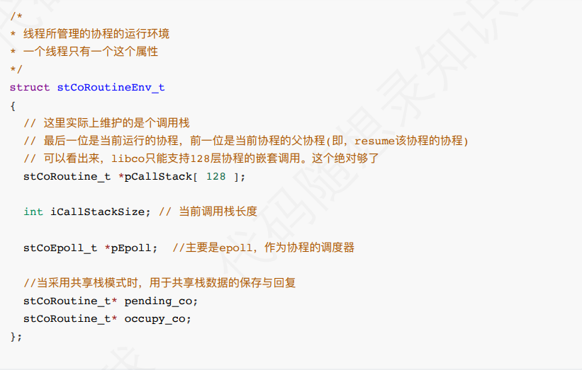
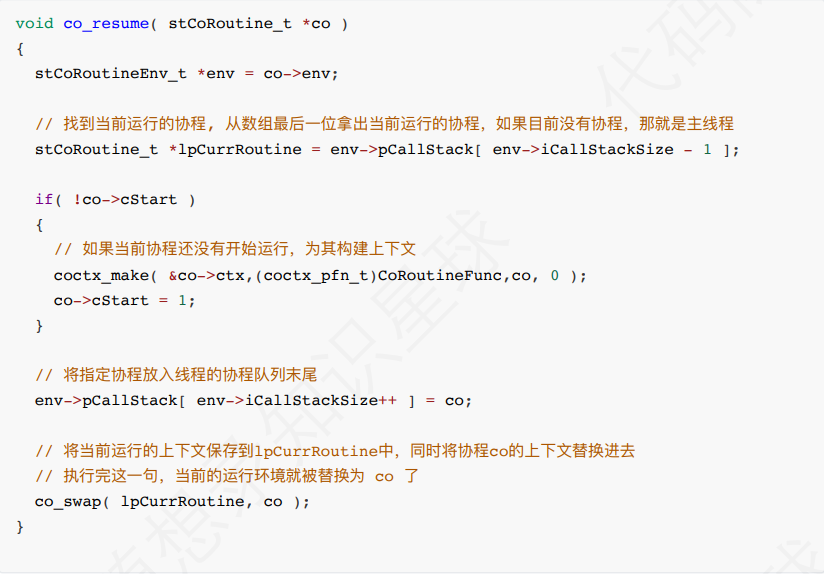
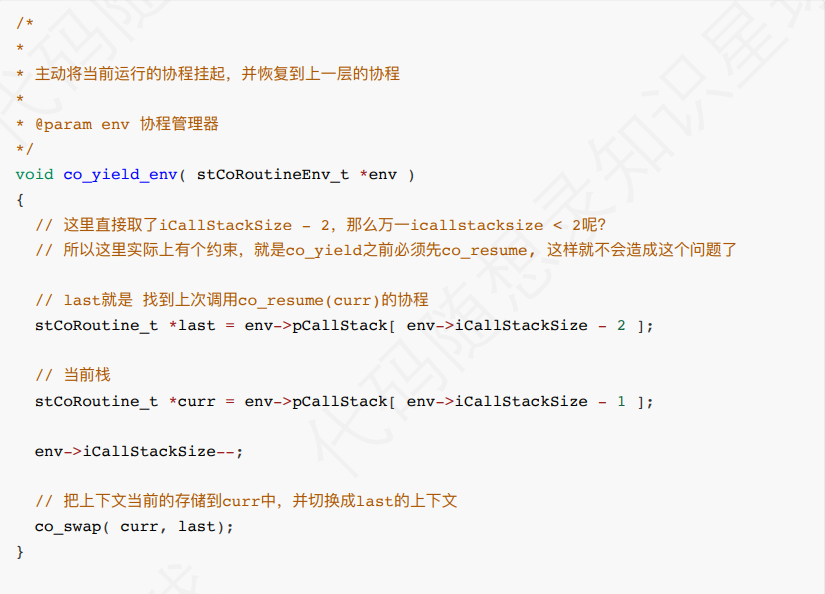

# 6、项目可以优化的地方

**增加对共享栈的支持**

 	本项⽬的协程库是**独⽴栈**的形式，每个协程有⾃⼰的栈空间，优点是实现简单，协程切换开销相对较低，但是 ⽐较耗内存，我们可以增加本项⽬对共享栈的⽀持，让协程在运⾏的时候都使⽤同⼀个栈空间，每次协程切换 时要把⾃身共享栈空间拷⻉。回到该协程的时候，将之前保存的数据，重新拷⻉到运⾏时栈中。

具体的实现可 以参考⼀下libco⾥的实现：  

```cpp
//一个共享栈的结构体，每个共享栈的内存所在
//一个进程或线程栈的地址，是从高位到地位安排数据的，所以stack_bp是栈底，stack_buff是栈顶
struct stStackMem_t
{
stCoRoutine_t* occupy_co; // 当前正在使⽤该共享栈的协程
int stack_size; // 栈的⼤⼩
char* stack_bp; // stack_buffer + stack_size 栈底
char* stack_buffer; // 栈的内容，也就是栈顶
};
/*
* 所有共享栈的结构体，这⾥的共享栈是个数组，每个元素分别是个共享栈
*/
struct stShareStack_t
{
unsigned int alloc_idx; // ⽬前正在使⽤的那个共享栈的index
int stack_size; // 共享栈的⼤⼩，这⾥的⼤⼩指的是⼀个stStackMem_t*的⼤⼩
int count; // 共享栈的个数，共享栈可以为多个，所以以下为共享栈的数组
stStackMem_t** stack_array; //栈的内容，这⾥是个数组，元素是stStackMem_t*
};
```

 下⾯两个函数⽤来创建共享栈以及分配内存：  

```cpp
/**
*创建一个共享栈
*参数：count创建共享栈的个数
*参数:stack_size 每个共享栈的大小
*/
stShareStack_t* co_alloc_sharestack(int count, int stack_size)
{
	stShareStack_t* share_stack = (stShareStack_t*)malloc(sizeof(stShareStack_t));
	share_stack->alloc_idx = 0;
	share_stack->stack_size = stack_size;
	//alloc stack array
	share_stack->count = count;
	stStackMem_t** stack_array = (stStackMem_t**)calloc(count,
	sizeof(stStackMem_t*)); //⻅下⽂介绍
	for (int i = 0; i < count; i++)
		{
			stack_array[i] = co_alloc_stackmem(stack_size); //co_alloc_stackmem⽤于分配每个共
			享栈内存, 实现⻅下
		}
	share_stack->stack_array = stack_array;
	return share_stack;
}
//
/**
* 分配⼀个栈内存
* @param stack_size的⼤⼩
*/
stStackMem_t* co_alloc_stackmem(unsigned int stack_size)
{
	stStackMem_t* stack_mem = (stStackMem_t*)malloc(sizeof(stStackMem_t));
	stack_mem->occupy_co= NULL; //当前没有协程使⽤该共享栈
	stack_mem->stack_size = stack_size;
	stack_mem->stack_buffer = (char*)malloc(stack_size); //栈顶，低内存空间
	stack_mem->stack_bp = stack_mem->stack_buffer + stack_size; //栈底，⾼地址空间
	return stack_mem;
}
```

 在协程切换时，会将共享栈的数据保存到上⼀个协程（occupy_co）的save_buffer中，将接下来要执⾏的协 程（pending_co）save_buffer中的数据拷⻉到共享栈中。 注意，在coctx_swap(&(curr->ctx),&(pending_co->ctx) ); 函数前后，协程经历了切换，函数之前， coctx_swap会进⼊到pending_co的协程环境中运⾏，函数之后已经yield回此协程了，才会执⾏接下来的语 句：  

```cpp
/**
*
* 1. 将当前的运⾏上下⽂保存到curr中
* 2. 将当前的运⾏上下⽂替换为pending_co中的上下⽂
* @param curr
* @param pending_co
*/
void co_swap(stCoRoutine_t* curr, stCoRoutine_t* pending_co)
{
	stCoRoutineEnv_t* env = co_get_curr_thread_env();
	//get curr stack sp
	//c变量的作⽤是为了找到⽬前的栈顶，因为c变量是最后⼀个放⼊栈中的内容。
	char c;
	curr->stack_sp= &c;
	if (!pending_co->cIsShareStack)
	{ 
		// 如果没有采⽤共享栈，清空pending_co和occupy_co
		env->pending_co = NULL;
		env->occupy_co = NULL;
	}
	else
	{ 
		// 如果采⽤了共享栈
		env->pending_co = pending_co;
		//get last occupy co on the same stack mem
		// occupy_co指的是，和pending_co共同使⽤⼀个共享栈的协程
		// 把它取出来是为了先把occupy_co的内存保存起来
		stCoRoutine_t* occupy_co = pending_co->stack_mem->occupy_co;

		//set pending co to occupy thest stack mem;
		// 将该共享栈的占⽤者改为pending_co
		pending_co->stack_mem->occupy_co = pending_co;
		env->occupy_co = occupy_co;
		if (occupy_co && occupy_co != pending_co)
		{ 
			// 如果上⼀个使⽤协程不为空, 则需要把它的栈内容保存起来，⻅下个函数。
			save_stack_buffer(occupy_co);
		}
	}
	// swap context
	coctx_swap(&(curr->ctx),&(pending_co->ctx) );
	// 上⼀步coctx_swap会进⼊到pending_co的协程环境中运⾏
	// 到这⼀步，已经yield回此协程了，才会执⾏下⾯的语句
	// ⽽yield回此协程之前，env->pending_co会被上⼀层协程设置为此协程
	// 因此可以顺利执⾏: 将之前保存起来的栈内容，恢复到运⾏栈上
	//stack buffer may be overwrite, so get again;
	stCoRoutineEnv_t* curr_env = co_get_curr_thread_env();
	stCoRoutine_t* update_occupy_co = curr_env->occupy_co;
	stCoRoutine_t* update_pending_co = curr_env->pending_co;

	// 将栈的内容恢复，如果不是共享栈的话，每个协程都有⾃⼰独⽴的栈空间，则不⽤恢复。
	if (update_occupy_co && update_pending_co && update_occupy_co !=
		update_pending_co)
	{
		// resume stack buffer
		if (update_pending_co->save_buffer && update_pending_co->save_size > 0)
		{
			// 将之前保存起来的栈内容，恢复到运⾏栈上
			memcpy(update_pending_co->stack_sp, update_pending_co->save_buffer,
				update_pending_co->save_size);
		}
	}
}
/**
*将原本占用共享栈的协程的内存保存起来。
*@parm occupy_co 原本占用共享栈的协程
*/
void save_stack_buffer(stCoRoutine_t* occupy_co)
{
	///copy out
	stStackMem_t* stack_mem = occupy_co->stack_mem;
	// 计算出栈的⼤⼩
	int len = stack_mem->stack_bp - occupy_co->stack_sp;
	if (occupy_co->save_buffer)
	{
		free(occupy_co->save_buffer), occupy_co->save_buffer = NULL;
	}
	occupy_co->save_buffer = (char*)malloc(len); //malloc buf;
	occupy_co->save_size = len;
	// 将当前运⾏栈的内容，拷⻉到save_buffer中
	memcpy(occupy_co->save_buffer, occupy_co->stack_sp, len);
}
```

当然我还是很建议想学习这一部分直接去看libco的原码，不然这些函数看起来你也不是很清楚有啥用。

---

**支持协程嵌套**

** 	**本项⽬的协程只⽀持线程主协程与任务协程之间切换，⽆法在⼦协程“调⽤“新⼀层的⼦协程，也就是⽆法进⾏ 协程的嵌套调⽤，可以增加对这个功能的⽀持，具体实现也可以参考libco，每个线程都有⼀份 stCoRoutineEnv_t 对象（协程的运⾏环境），在线程第⼀次创建协程时被⾃动创建，同时也会创建主协程， 并将指向主协程的指针放到 pCallStack[0] ⾥：最多⽀持128层的协程调用。

**以下直接引用原文档的内容(当然也可以直接看原文档):  
**

 引⼊了pCallStack数组以后，协程的切换就变成了下⾯这样：  





**增加对更复杂的协程调度算法的支持**

 	本项⽬的协程调度算法是最简单的先来先服务，我们可以参考操作系统对进程的调度算法，引⼊优先级，相应 ⽐、时间⽚等结构，实现更多相对复杂⼀些的调度算法以应对更多的需求场景。  

---

**增加一个协程池:**

交给你们自己去实现了。


> 更新: 2025-03-10 17:01:34  
> 原文: <https://www.yuque.com/chengxuyuancarl/id1now/emco6uk557e1651w>