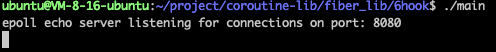

# 7、性能测试

***

写完了协程库，我们势必要对其进行一些测试来验证我们写的协程库是否有用，相比于其他库有什么优势，分析出使用场景和性能瓶颈：

* 你是否对你写的协程库进行过测试？
* 你这个协程库相比于其他库有什么优势？

这些问题也是面试官经常会问到的，性能测试也是比较容易体现出我们思考和能力的环节，进行详细的性能也会成为项目的一大亮点。

我们的协程库主要用于网络服务器后端，所以开发不同场景的简易服务器，用其他网络库来对比。

比如就可以使用协程库改编的WebServer和原始的WebServer分别进行压力测试，对比一下qps。

值得注意的是我们程序是单线程还是多线程，是计算密集型还是IO密集型，业务逻辑的复杂程度都会影响测试结果，我们最好在更重的情况下进行多次，以验证我们协程库项目的优势和适用场景。

这里，我们以本项目、libevent网络库以及原生epoll分别编写单线程回声服务器，适用ApacheBench测试工具分别进行压力测试。

***

**<font style="color:#DF2A3F;">服务器的运行环境：</font>**

**cpu：AMD 76800H 8核16线程，虚拟机使用cpu数量4，cpu内核数量2.**

**带宽： 利用iperf3测试回环的总体传输速率为 19.3 Gbits/sec.**

**内存：16g(本机)，4g(虚拟机)**

**Ubuntu版本：22.04**

***

## ApacheBench

首先，ApacheBench的安装

* **Debian/Ubuntu**: `sudo apt-get install apache2-utils`
* **CentOS/RHEL**: `sudo yum install httpd-tools`
* 安装好后用ab -V检查如下：

```bash
ab: option requires an argument -- v
ab: wrong number of arguments
Usage: ab [options] [http[s]://]hostname[:port]/path
Options are:
    -n requests     Number of requests to perform
    -c concurrency  Number of multiple requests to make at a time
    -t timelimit    Seconds to max. to spend on benchmarking
                    This implies -n 50000
    -s timeout      Seconds to max. wait for each response
                    Default is 30 seconds
    -b windowsize   Size of TCP send/receive buffer, in bytes
    -B address      Address to bind to when making outgoing connections
    -p postfile     File containing data to POST. Remember also to set -T
    -u putfile      File containing data to PUT. Remember also to set -T
    -T content-type Content-type header to use for POST/PUT data, eg.
                    'application/x-www-form-urlencoded'
                    Default is 'text/plain'
    -v verbosity    How much troubleshooting info to print
    -w              Print out results in HTML tables
    -i              Use HEAD instead of GET
    -x attributes   String to insert as table attributes
    -y attributes   String to insert as tr attributes
    -z attributes   String to insert as td or th attributes
    -C attribute    Add cookie, eg. 'Apache=1234'. (repeatable)
```

**测试命令：**

1、基础测试(并发数：10，总请求数：100)

```bash
ab -n 100 -c 10 http://127.0.0.1:8080/
```

* -`n`100:总请求数为100.
* -`c` 10:并发请求数10.

http://127.0.0.1:8080：测试的目标URL(也是本地测试).

2、高并发测试(并发数:100，总请求数:100)

```bash
ab -n 1000 -c 100 http://127.0.0.1:8080/
```

用于测试服务器的高并发能力。请根据服务器的资源情况适当并发调整并发数。

3、模拟持续压力测试(高并发、高请求数)

```bash
ab -n 10000 -c 500 http://127.0.0.1:8080/
```

* `-n 10000`: 模拟 10,000 个请求。
* `-c 500`: 并发请求数为 500.

4、自定义请求测试(POST请求)

如果libco服务器支持POST请求，可以使用以下命令：

```bash
ab -n 100 -c 10 -p post_data.txt -T "application/x-www-form-urlencoded" http://127.0.0.1:8080/
```

`-p` post\_data.txt:包含POST请求的数据文件。

`-T` "application/x-www-form-urlencoded":指定POST请求的内容类型。

5、添加请求头

如果需要附加请求头(如Autorization或自定义标头)，可以使用：

```bash
ab -n 100 -c 10 -H "Autorization: Bearer<token>"http://127.0.0.1:8080/
```

`-H`：添加自定义请求头。

***

**测试结果解读:**

这里是模拟测试的结果，运行ab命令后，您会看到类似以下的结果：

```bash
Server Software:        libco-server#被测试的Web服务器软件的名称。
Server Hostname:        127.0.0.1#表示请求URL主机名
Server Port:            8080#表示被测试的Web服务器的软件的监听端口

Document Path:          /#表示请求的URL中的根绝对路径，通过该文件的后缀名，我们一般可以了解该请求的类型。
Document Length:        13 bytes#表示http响应数据的正文长度。

Concurrency Level:      10#表示并发用户数，这是我们设置的参数之一 -c
Time taken for tests:   0.123 seconds#表示所有这些请求被处理完成所花费的总时间.
Complete requests:      100#表示总请求数量，这是我们设置的参数之一。
Failed requests:        0#失败请求数(应尽量为0)
Total transferred:      1400 bytes
HTML transferred:       1300 bytes
Requests per second:    813.01 [#/sec] (mean)#每秒处理的请求数(关键性能指标)。
Time per request:       12.3 [ms] (mean)#平均每个请求的处理时间
Time per request:       1.23 [ms] (mean, across all concurrent requests)#每个请求实际运行时间的平均值后面括号中的 mean 表示这是一个平均值
Transfer rate:          11.04 [Kbytes/sec] received

```

**具体关于apache的学习和工具使用可以参考：**

[**https://www.cnblogs.com/qmfsun/p/4741733.html**](https://www.cnblogs.com/qmfsun/p/4741733.html)

[**https://www.cnblogs.com/architectforest/p/15848210.html**](https://www.cnblogs.com/architectforest/p/15848210.html)

[**https://www.cnblogs.com/hejianliang/p/13957870.html**](https://www.cnblogs.com/hejianliang/p/13957870.html)

***

## 正式开始测试：

**首先提及一个大多数录友们测试出现的一个问题：**

ab命令测试代码中会出现，70007的错误这是怎么回事？

**AB测试长连接并且单线程回声服务器的情况：**

1、主要是因为ab支持长连接，但是在代码中我们write或send的时候没有立即关闭连接，导致当客户端ab尝试复用连接发起下一次请求时，服务端由于未正确处理长连接逻辑，可能没有响应或直接中断连接。

**或者你可以立即是HTTP协议与ab测试的冲突：**

2、如果服务器只是简单地实现了回声逻辑（即收到消息后原样返回），但没有处理HTTP协议的特定要求，比如响应头部、内容长度或连接管理(是否关闭连接)，就会导致ab在测试的时候出问题。

**AB测试短连接HTTP协议1.0的情况：**

1、这个也是本项目出现的问题，由于服务器是一个简单的回声服务器，它直接读取数据并返回原样数据给客户端，但是ab工具发送的是一个符合HTTP协议的请求。HTTP协议需要服务器返回特定格式响应，包括状态行、响应头部和响应正文，那么ab会将此视为无效响应。

2、HTTP/1.0与连接管理

由于ab使用的是HTTP/1.0协议，它默认不支持长连接除非(Connection:keep-alive显示指定)。

如果服务器不主动关闭连接，`ab` 可能会等待超时，导致报错。

解决办法：

方法1：显示关闭连接

如果服务器不支持http/1.1长连接， 可以显式地关闭连接，告知客户端无需尝试复用：

```cpp
write(events[i].data.fd, buf, len);
// 立即关闭连接
close(events[i].data.fd);
```

方法2：支持HTTP协议的长连接或短连接

为了正确处理长连接（短链接就1.0），可以在返回数据时添加HTTP响应头部，并通过 `Connection: close` 或 `Content-Length` 指定连接行为：

```cpp
char response[2048];
int response_len = snprintf(response, sizeof(response),
    "HTTP/1.1 200 OK\r\n"
    "Content-Length: %d\r\n"
    "Connection: close\r\n"//长连接的话这里换成keep-alive，如果是想通知ab关闭连接就close
    "\r\n"
    "%s",
    len, buf);
write(events[i].data.fd, response, response_len);
close(events[i].data.fd);

```

方法 3：调试 `ab` 参数

如果暂时不想修改服务器逻辑，可以强制 `ab` 使用短连接测试：

```bash
ab -k false -n 100 -c 10 http://127.0.0.1:8888/
//通过 -k false 禁用长连接，ab 会在每次请求后关闭连接，从而避免超时错误。
//如果需要测试长连接，在 ab 中使用 -k 选项开启 keep-alive
ab -n 1000 -c 10 -k http://127.0.0.1:8888/
```

***

## 首先是本项目6hook文件下利用apache进行测试：

本项目的可执行程序在fiber\_lib/6hook文件下：

### 生成可执行程序并运行

```shell
在6hook文件下编译链接可执行文件:
g++ *.cpp -std=c++17 -o main -ldl -lpthread
执行可执行文件
./main
```

运行结果图：



### 测试代码(6hook/main.cpp)

```cpp
#include "corlib.h"
#include <unistd.h>
#include <sys/types.h>
#include <sys/socket.h>
#include <arpa/inet.h>
#include <fcntl.h>
#include <iostream>
#include <stack>
#include <cstring>
#include <chrono>
#include <thread>

static int sock_listen_fd = -1;

void test_accept();
void error(const char *msg)
{
    perror(msg);
    printf("erreur...\n");
    exit(1);
}

void watch_io_read()
{
    corlib::IOManager::GetThis()->addEvent(sock_listen_fd, corlib::IOManager::READ, test_accept);
}

void test_accept()
{
    struct sockaddr_in addr;
    memset(&addr, 0, sizeof(addr));
    socklen_t len = sizeof(addr);
    int fd = accept(sock_listen_fd, (struct sockaddr *)&addr, &len);
    if (fd < 0)
    {
        std::cout << "accept failed, fd = " << fd << ", errno = " << errno << std::endl;
    }
    else
    {
        std::cout << "accepted connection, fd = " << fd << std::endl;
        fcntl(fd, F_SETFL, O_NONBLOCK);
        corlib::IOManager::GetThis()->addEvent(fd, corlib::IOManager::READ, [fd]()
        {
            char buffer[1024];
            memset(buffer, 0, sizeof(buffer));
            while (true)
            {
                int ret = recv(fd, buffer, sizeof(buffer), 0);
                if (ret > 0)
                {
                    // 打印接收到的数据
                    //std::cout << "received data, fd = " << fd << ", data = " << buffer << std::endl;
                    
                    // 构建HTTP响应
                    const char *response = "HTTP/1.1 200 OK\r\n"
                                           "Content-Type: text/plain\r\n"
                                           "Content-Length: 1\r\n"
                                           "\r\n"
                                           "1";
                    
                    // 发送HTTP响应
                    ret = send(fd, response, strlen(response), 0);
                    std::cout << "sent data, fd = " << fd << ", ret = " << ret << std::endl;

                    // 关闭连接
                    close(fd);
                    break;
                }
                if (ret <= 0)
                {
                    if (ret == 0 || errno != EAGAIN)
                    {
                        std::cout << "closing connection, fd = " << fd << std::endl;
                        close(fd);
                        break;
                    }
                    else if (errno == EAGAIN)
                    {
                        std::cout << "recv returned EAGAIN, fd = " << fd << std::endl;
                        std::this_thread::sleep_for(std::chrono::milliseconds(50)); // 延长睡眠时间，避免繁忙等待
                    }
                }
            }
        });
    }
    corlib::IOManager::GetThis()->addEvent(sock_listen_fd, corlib::IOManager::READ, test_accept);
}

void test_iomanager()
{
    int portno = 8080;
    struct sockaddr_in server_addr, client_addr;
    socklen_t client_len = sizeof(client_addr);

    // 设置套接字
    sock_listen_fd = socket(AF_INET, SOCK_STREAM, 0);
    if (sock_listen_fd < 0)
    {
        error("Error creating socket..\n");
    }

    int yes = 1;
    // 解决 "address already in use" 错误
    setsockopt(sock_listen_fd, SOL_SOCKET, SO_REUSEADDR, &yes, sizeof(yes));

    memset((char *)&server_addr, 0, sizeof(server_addr));
    server_addr.sin_family = AF_INET;
    server_addr.sin_port = htons(portno);
    server_addr.sin_addr.s_addr = INADDR_ANY;

    // 绑定套接字并监听连接
    if (bind(sock_listen_fd, (struct sockaddr *)&server_addr, sizeof(server_addr)) < 0)
        error("Error binding socket..\n");

    if (listen(sock_listen_fd, 1024) < 0)
    {
        error("Error listening..\n");
    }

    printf("epoll echo server listening for connections on port: %d\n", portno);
    fcntl(sock_listen_fd, F_SETFL, O_NONBLOCK);
    corlib::IOManager iom(4);
    iom.addEvent(sock_listen_fd, corlib::IOManager::READ, test_accept);
}

int main(int argc, char *argv[])
{
    test_iomanager();
    return 0;
}

```

### 测试结果本项目：

**<font style="color:#DF2A3F;">注意：我使用了多核资源创建了4个线程去做的，其中cpu多核资源可以使用htop命令观察。(如果你发现只是看见一个cpu核心负载高那就没有使用到多核，导致协程库的测试结果低下)</font>**

```bash
//apache测试命令
ab -n 100000 -c 1000 http://127.0.0.1:8888/
```

```bash
Server Software:        					#表示被测试的Web服务器名称
Server Hostname:        127.0.0.1 #表示请求的URL主机名
Server Port:            8080 			#表示被测试的Web服务器软件的监听端口
Document Path:          /					#表示请求URL中的根绝对路径
Document Length:        1 bytes		#表示HTTP响应数据的

Concurrency Level:      1000			#表示并发用户数，这是我们设置的参数之一。-c
Time taken for tests:   12.399 seconds #表示所有这些请求被处理完成所花费的时间
Complete requests:      100000				#表示总请求数 -n
Failed requests:        0							#表示失败的请求数
Total transferred:      6600000 bytes #表示所有请求的响应数据长度总和。
HTML transferred:       100000 bytes  #表示所有请求的响应数据中正文数据的总和
Requests per second:    8064.96 [#/sec] (mean)#吞吐率，计算公式：Complete request/Time taken fo tests
Time per request:       123.993 [ms] (mean) #用户平均请求等待时间 计算公式：Time token for tests/（Complete requests/Concurrency Level）
Time per request:       0.124 [ms] (mean, across all concurrent requests)#服务器平均请求等待时间 计算公式：Timer per request/Concurrency Level。
Transfer rate:          519.81 [Kbytes/sec] received #表示这些请求在单位时间内从服务器获取的数据长度

Connection Times (ms)
              min  mean[+/-sd] median   max
Connect:        0    5   6.5      2      59
Processing:    27  118  11.9    119     170
Waiting:        0  117  13.3    118     170
Total:         59  123   8.2    122     171
#这部分数据用于描述每个请求处理时间的分布情况，比如50%的请求在122毫秒内完成(中位数)
#这个处理时间是指前面的Time per request，即对于单个用户而言，平均每个请求的处理时间。
Percentage of the requests served within a certain time (ms)
  50%    122
  66%    125
  75%    127
  80%    128
  90%    131
  95%    137
  98%    147
  99%    153
 100%    171 (longest request)

```

## 原生epoll

改动：将使用while循环读取epoll，换成直接判断读取的结果如果大于0就进行传输，传输完成后就马上断开连接关闭close(fd)防止ab测试超时(70007的问题也是出自这里)。

生成epoll文件的可执行文件：

### 生成可执行程序并运行：

```shell
与libevnt操作同理
先进入epoll文件
cd epoll

生成可执行文件程序
g++ main.cpp -o epoll

然后运行可执行程序:
./epoll

```

### 测试代码(epoll/main.cpp)

```cpp
#include <stdio.h>
#include <stdlib.h>
#include <string.h>
#include <unistd.h>
#include <sys/socket.h>
#include <arpa/inet.h>
#include <sys/epoll.h>

#define MAX_EVENTS 10
#define PORT 8888

int main() {
    int listen_fd, conn_fd, epoll_fd, event_count;
    struct sockaddr_in server_addr, client_addr;
    socklen_t addr_len = sizeof(client_addr);
    struct epoll_event events[MAX_EVENTS], event;

    // 创建监听套接字
    if ((listen_fd = socket(AF_INET, SOCK_STREAM, 0)) == -1) {
        perror("socket");
        return -1;
    }

    int yes = 1;
    // 解决 "address already in use" 错误
    setsockopt(listen_fd, SOL_SOCKET, SO_REUSEADDR, &yes, sizeof(yes));

    // 设置服务器地址和端口
    memset(&server_addr, 0, sizeof(server_addr));
    server_addr.sin_family = AF_INET;
    server_addr.sin_port = htons(PORT);
    server_addr.sin_addr.s_addr = INADDR_ANY;

    // 绑定监听套接字到服务器地址和端口
    if (bind(listen_fd, (struct sockaddr *)&server_addr, sizeof(server_addr)) == -1) {
        perror("bind");
        return -1;
    }

    // 监听连接
    if (listen(listen_fd, 1024) == -1) {
        perror("listen");
        return -1;
    }

    // 创建 epoll 实例
    if ((epoll_fd = epoll_create1(0)) == -1) {
        perror("epoll_create1");
        return -1;
    }

    // 添加监听套接字到 epoll 实例中
    event.events = EPOLLIN;
    event.data.fd = listen_fd;
    if (epoll_ctl(epoll_fd, EPOLL_CTL_ADD, listen_fd, &event) == -1) {
        perror("epoll_ctl");
        return -1;
    }

    while (1) {
        // 等待事件发生
        event_count = epoll_wait(epoll_fd, events, MAX_EVENTS, -1);
        if (event_count == -1) {
            perror("epoll_wait");
            return -1;
        }

        // 处理事件
        for (int i = 0; i < event_count; i++) {
            if (events[i].data.fd == listen_fd) {
                // 有新连接到达
                conn_fd = accept(listen_fd, (struct sockaddr *)&client_addr, &addr_len);
                if (conn_fd == -1) {
                    perror("accept");
                    continue;
                }

                // 将新连接的套接字添加到 epoll 实例中
                event.events = EPOLLIN;
                event.data.fd = conn_fd;
                if (epoll_ctl(epoll_fd, EPOLL_CTL_ADD, conn_fd, &event) == -1) {
                    perror("epoll_ctl");
                    return -1;
                }
            } else {
                // 有数据可读
                char buf[1024];
                int len = read(events[i].data.fd, buf, sizeof(buf) - 1);
                if (len <= 0) {
                    // 发生错误或连接关闭，关闭连接
                    close(events[i].data.fd);
                } else {
                    // 发送HTTP响应
                    const char *response = "HTTP/1.1 200 OK\r\n"
                                           "Content-Type: text/plain\r\n"
                                           "Content-Length: 1\r\n"
                                           "\r\n"
                                           "1";
                    write(events[i].data.fd, response, strlen(response));
                    //epoll_ctl(epoll_fd,EPOLL_CTL_DEL,events[i].data.fd,NULL);//出现70007的错误再打开，或者试试-r命令
                    // 关闭连接
                    close(events[i].data.fd);
                }
            }
        }
    }

    // 关闭监听套接字和 epoll 实例
    close(listen_fd);
    close(epoll_fd);
    return 0;
}

```

### 测试结果：

```bash
//ab测试命令
ab -n 100000 -c 1000 http://127.0.0.1:8888/
```

```bash
Server Software:        					#表示被测试的Web服务器软件名称
Server Hostname:        127.0.0.1 #表示请求的URL主机名
Server Port:            8888      #表示被测试的Web服务器软件的端口

Document Path:          /
Document Length:        1 bytes

Concurrency Level:      1000
Time taken for tests:   12.767 seconds
Complete requests:      100000
Failed requests:        0
Total transferred:      6600000 bytes
HTML transferred:       100000 bytes
Requests per second:    7832.78 [#/sec] (mean)
Time per request:       127.669 [ms] (mean)
Time per request:       0.128 [ms] (mean, across all concurrent requests)
Transfer rate:          504.85 [Kbytes/sec] received

Connection Times (ms)
              min  mean[+/-sd] median   max
Connect:        0   60  11.2     59     104
Processing:    20   67  13.2     67     126
Waiting:        0   48  12.7     46     100
Total:         71  127   8.6    128     150

Percentage of the requests served within a certain time (ms)
  50%    128
  66%    131
  75%    133
  80%    134
  90%    137
  95%    139
  98%    143
  99%    144
 100%    150 (longest request)

```

### 小总结：

可以发现如果使用多核资源的话，其**效果是超过epoll的具体的差异可以查看测试结果中的Requests per second（吞吐率）协程库和原生epoll分别是8064.96，7832.78**，\*\*并且在50%完成平均请求本项目是稍微比原生epoll更快且结合吞吐量更大的，\*\*但是具体还可以去对比cpu，内存，带宽，io资源，我这里测试到其实相比原生epoll，协程库还是有不少的用户态消耗。

其次压力测试工具可以选择\*\*wrk或hey，\*\*支持多线程、多连接的并发测试。ab可能成为瓶颈在高并发的情况。

PS：看过原文档的录友可能觉得测试数据太低效果不明显，这可能是因为硬件的约束，可以增大其硬件和网络带宽来进行更好的对比。

***

## libevent

### 首先要安装：

```shell
sudo apt-get update
sudo apt-get install libevent-dev
并且检查头文件是否存在
ls /usr/include/event2/event.h
如果返回的结果是这个,那就没问题了
/usr/include/event2/event.h
```

### 生成可执行程序并运行：

```shell
sudo apt update  // 安装一些包
sudo apt install cmake
sudo apt install pkg-config
sudo apt install libevent-dev

```

```shell
先进入文件
cd libevent

先删除libevent/build文件
rm -rf build

然后，生成build文件，并允许cmake构建项目框架
mkdir build && cd build && cmake .. && make

然后进入build 目录，执行
./echo_server

```

### 测试代码：(libevent/main.cpp)

```cpp
#include <stdio.h>
#include <stdlib.h>
#include <string.h>
#include <event2/event.h>
#include <event2/listener.h>
#include <event2/bufferevent.h>
#include <sys/socket.h>
#include <netinet/in.h>
#include <arpa/inet.h>
#include <unistd.h>

#define PORT 8080

// 处理读事件的回调函数
void http_read_cb(evutil_socket_t fd, short events, void *arg) {
    char buf[1024];
    int len = recv(fd, buf, sizeof(buf) - 1, 0);
    if (len <= 0) {
        // 发生错误或连接关闭，关闭连接并释放事件资源
        close(fd);
        event_free((struct event *)arg);
        return;
    }
    buf[len] = '\0';
    printf("接收到消息：%s\n", buf);

    // 构建HTTP响应
    const char *response = "HTTP/1.1 200 OK\r\n"
                           "Content-Type: text/plain\r\n"
                           "Content-Length: 13\r\n"
                           "\r\n"
                           "Hello, World!";
    send(fd, response, strlen(response), 0);

    // 发送响应后关闭连接
    close(fd);
    event_free((struct event *)arg);
}

// 接受连接的回调函数
void accept_conn_cb(evutil_socket_t listener, short event, void *arg) {
    struct event_base *base = (struct event_base *)arg;
    struct sockaddr_storage ss;
    socklen_t slen = sizeof(ss);
    int fd = accept(listener, (struct sockaddr *)&ss, &slen);
    if (fd < 0) {
        perror("accept");
    } else if (fd > FD_SETSIZE) {
        close(fd);
    } else {
        // 创建一个新的事件结构体
        struct event *ev = event_new(NULL, -1, 0, NULL, NULL);
        // 将新的事件添加到事件循环中
        event_assign(ev, base, fd, EV_READ | EV_PERSIST, http_read_cb, (void *)ev);
        event_add(ev, NULL);
    }
}

int main() {
    struct event_base *base;
    struct event *listener_event;
    struct sockaddr_in sin;

    // 初始化监听地址和端口
    memset(&sin, 0, sizeof(sin));
    sin.sin_family = AF_INET;
    sin.sin_addr.s_addr = htonl(INADDR_ANY);
    sin.sin_port = htons(PORT);

    // 创建监听套接字
    int listener = socket(AF_INET, SOCK_STREAM, 0);
    if (listener < 0) {
        perror("socket");
        return -1;
    }

    // 设置套接字选项，允许地址复用
    evutil_make_socket_nonblocking(listener);
    int reuse = 1;
    setsockopt(listener, SOL_SOCKET, SO_REUSEADDR, &reuse, sizeof(reuse));

    // 绑定地址和端口
    if (bind(listener, (struct sockaddr *)&sin, sizeof(sin)) < 0) {
        perror("bind");
        return -1;
    }

    // 监听端口
    if (listen(listener, 1024) < 0) {
        perror("listen");
        return -1;
    }

    // 初始化Libevent库
    base = event_base_new();

    // 创建一个监听事件
    listener_event = event_new(base, listener, EV_READ | EV_PERSIST, accept_conn_cb, (void *)base);

    // 将监听事件添加到事件循环中
    event_add(listener_event, NULL);

    // 开始事件循环
    event_base_dispatch(base);

    // 清理资源
    event_free(listener_event);
    event_base_free(base);
    close(listener);

    return 0;
}

```

###

测试命令：

```bash
ab -n 100000 -c 1000   http://127.0.0.1:8080/
```

### 结果：

```bash
Server Software:        
Server Hostname:        127.0.0.1
Server Port:            8080

Document Path:          /
Document Length:        13 bytes

Concurrency Level:      1000
Time taken for tests:   12.369 seconds
Complete requests:      100000
Failed requests:        0
Total transferred:      7800000 bytes
HTML transferred:       1300000 bytes
Requests per second:    8084.52 [#/sec] (mean)#衡量新性能的好坏，关键指标
Time per request:       123.693 [ms] (mean)#
Time per request:       0.124 [ms] (mean, across all concurrent requests)
Transfer rate:          615.81 [Kbytes/sec] received

Connection Times (ms)
              min  mean[+/-sd] median   max
Connect:        0   52   9.8     51     104
Processing:    21   71  12.9     71     134
Waiting:        0   54  14.3     55     127
Total:         77  123  11.5    123     162

Percentage of the requests served within a certain time (ms)
  50%    123
  66%    128
  75%    130
  80%    132
  90%    138
  95%    141
  98%    147
  99%    150
 100%    162 (longest request)
```

***

***

**当然各位还可以试试多种情况比如更多核的服务器上跑一跑 效果会比这里的更好，因为性能的限制这边作为一个参考和了解即可，主要目的是面试的时候知道什么作为本项目的衡量标准，还可以查看什么。**


> 更新: 2025-09-14 19:24:20  
> 原文: <https://www.yuque.com/chengxuyuancarl/id1now/vv3na06mv63eehv4>