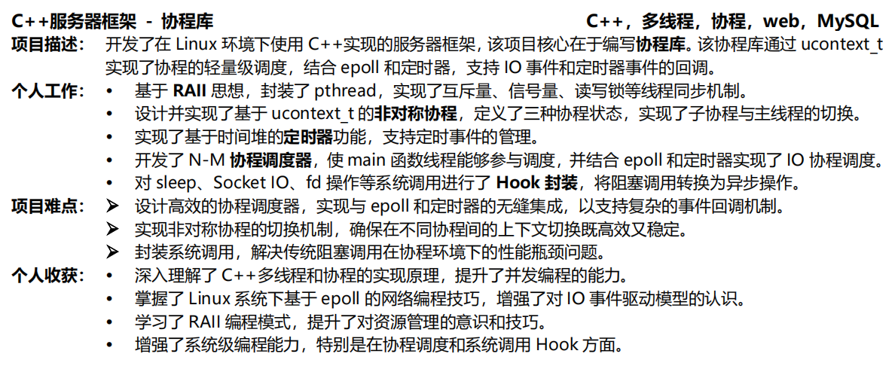
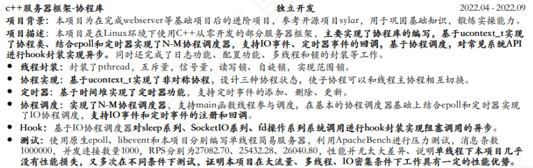

# 9、简历如何写

# 补充
##  项目成就与成果  
+ **性能提升**：提到性能优化后，简洁明了地展示优化幅度，例如 QPS 提升了多少，响应时间减少了多少，或者系统吞吐量提升了多少。
+ **并发处理能力**：如果项目经过了压力测试，可以提供一些具体的数字，如能够处理多少并发连接，或者服务器在高负载下的稳定性等。

这个其实作者原文档总的**简历如何写部分是有的。**

** 项⽬难点：** 

+ 基于epoll和定时器实现多线程IO协程调度器，⽀持对定时任务协程和IO任务协程的调度，且⽀持主线程（创 建调度器的线程）参与调度。 
+ 对seelp、IO等阻塞系统调⽤进⾏hook封装，在函数内部进⾏协程切换，将阻塞系统调⽤改造为⾮阻塞。  

 **个⼈收获：**

+ ** **深⼊了解了协程技术，熟悉了共享栈、对称/⾮对称协程等概念 
+ 了解了主要协程库的优缺点以及适⽤场景，对进程、线程、协程的区别有了更深⼊的了解 
+ 熟练掌握了Linux⽹络编程、系统编程接⼝，对IO多路复⽤、事件驱动模型有了⼀定的了解。  

> 更新: 2024-11-15 18:05:55  
> 原文: <https://www.yuque.com/chengxuyuancarl/id1now/gkeppr9ozsi0q3yv>