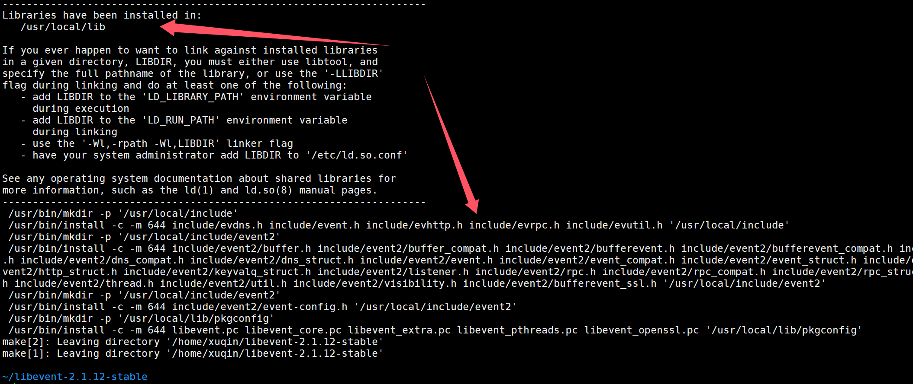

# 2. 环境准备

1. Ubuntu 22.04.5 LTS，也可以其它Linux系统，测试过centos，Ubuntu20.04都可
2. 我这边使用的是wsl2和云服务器搭配，云服务器和自己的wsl2各自作为一个服务器，云服务器有公网ip，用来备份重要日志，而开发就在自己电脑上使用vscode连接wsl2。 


**<font style="color:#333333;">建议购买一台云服务器，腾讯云或者阿里云，用来部署自己的项目 非常方便，无论是做本项目还是做其他项目，无论是自己练习，还是项目上线，都需要一台有公网Ip的独立服务器。 自己电脑安装虚拟机，不仅麻烦，经常出莫名其妙的问题。</font>**

+ [阿里云活动期间服务器购买](https://www.aliyun.com/minisite/goods?taskCode=shareNew2205&recordId=3641992&userCode=roof0wob)
+ [腾讯云活动期间服务器购买](https://curl.qcloud.com/EiaMXllu)


对于云服务器可以只买最低配的，但是不要装太多东西，不然会卡死。比如买这种就ok：


wsl2安装(不是必须要装哈，可以使用虚拟机，只要系统是Linux的就OK)：

[https://blog.csdn.net/u011119817/article/details/130745551](https://blog.csdn.net/u011119817/article/details/130745551)

推荐使用这个启动，第一个方式启动我试了好几个电脑都没法成功，很慢很慢

3. g++安装

```bash
sudo apt update
sudo apt install g++
```

# 日志部分
#### jsoncpp
1. 可自行搜索相关博客学习一下序列化反序列化，相关数据结构的知识，很多相关博客，很简单，这里不提供怕链接失效。

```bash
sudo apt-get libjsoncpp-dev
其头文件所在路径是：/usr/include/jsoncpp/json
动态库在：/usr/lib/x86_64-linux-gnu/libjsoncpp.so-版本号
编译时需要根据动态库的路径进行正确的设置，否则很容易出现“undefined reference to”问题。
使用g++编译时直接加上“-ljsoncpp”选项即可。
```

[安装可以参照这个链接，里面也有使用的例子](https://www.cnblogs.com/paw5zx/p/18245875)

# 存储部分
### 服务端
#### libevent
Linux下安装方法：

```bash
sudo apt-get update
sudo apt-get install build-essential autoconf automake
sudo apt-get install libssl-dev
./configure
wget https://github.com/libevent/libevent/releases/download/release-2.1.12-stable/libevent-2.1.12-stable.tar.gz
tar xvf libevent-2.1.12-stable.tar.gz  //解压下载的源码压缩包，目录下会生成一个libevent-2.1.12-stable目录
cd libevent-2.1.12-stable                 //切换到libevent-2.1.12-stable目录,(安装步骤可以查看README.md文件)
./configure                                       //生成Makefile文件，用ll Makefile可以看到Makefile文件已生成
make                                          //编译
sudo make install                            //安装

# 最后检测是否成功安装
cd sample     //切换到sample目录
./hello-world   //运行hello-world可执行文件
# 新建一个终端，输入以下代码
nc 127.1 9995 //若安装成功，该终端会返回一个Hello, World!
```



安装完成后，在使用该库时编译选项添加-levent即可。如果出现找不到库，find命令找找libevent在哪，然后把该路径加到链接器会找的目录里。可以找到/etc/ld.so.conf文件，加入

```bash
include /usr/local/lib
```

然后执行

```bash
sudo ldconfig
```


#### jsoncpp
日志部分已经安装

#### bundle
源码链接：[https://github.com/r-lyeh-archived/bundle](https://github.com/r-lyeh-archived/bundle)

把源码克隆下来之后，包含bundle.h头文件，buncle.cpp，编译就可以用了。但是由于编译时间会很长，可以选择编译成动态库：g++ -shared -fPIC bundle.cpp -o libbundle.so -std=c++11。之后在编译自己的程序时加上-lbundle选项就ok。使用方法可以直接看bundle库的demo.cc或者看我们存储项目的的util.hpp里的Compress和Uncompress函数。

#### base64库
使用下面的命令将base64克隆下来，然后将里面的base64.h和base64.cpp复制到项目文件目录server/src下即可。

```cpp
git clone https://github.com/ReneNyffenegger/cpp-base64.git 
```


> 更新: 2025-04-15 09:26:47  
> 原文: <https://www.yuque.com/chengxuyuancarl/ipf60h/upy45eqcowb0qkad>