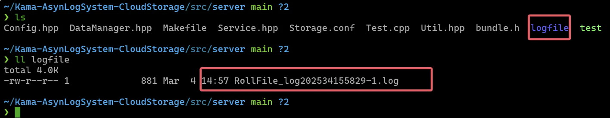
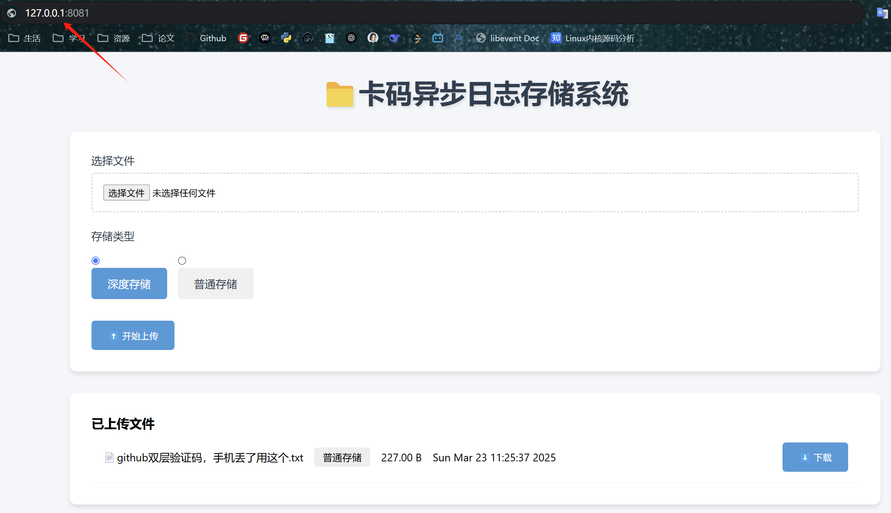
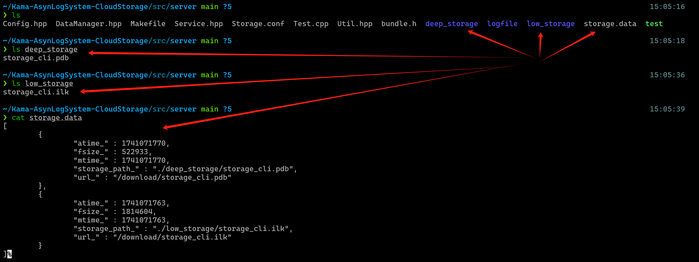
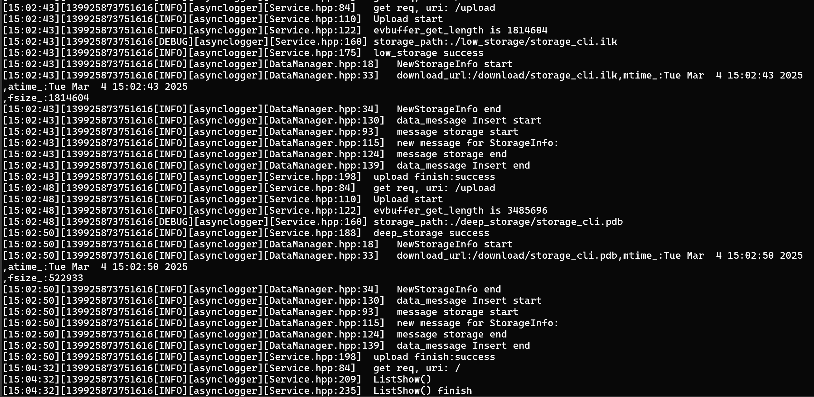
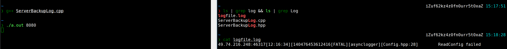

# 3.让项目跑起来

先把Kama-AsynLogSystem-CloudStorage/src/server目录下的Storage.conf文件中的下面两个字段配好，如下面，替换成你自己的服务器ip地址和要使用的端口号，（如果使用的是云服务器需要去你买的云服务器示例下开放安全组规则允许外界访问该端口）。

```plain
"server_port" : 8081,
"server_ip" : "127.0.0.1"
```

再把Kama-AsynLogSystem-CloudStorage/log\_system/logs\_code下的config.conf文件中的如下两个字段配好，这两个字段是备份日志存放的服务器地址和端口号。（这个配置是可选的，如果没有配置，会链接错误，备份日志功能不会被启动，但是不影响其他部分日志系统的功能，本机还是可以正常写日志的）

```plain
"backup_addr" : "47.116.22.222",
"backup_port" : 8080
```

再把log\_stsytem目录下的backlog目录中的ServerBackupLog.cpp和hpp文件拷贝置另外一个服务器或当前服务器作为备份日志服务器，使用命令`g++ ServerBackupLog.cpp`生成可执行文件，`./a.out 端口号` 即可启动备份日志服务器，这里端口号由输入的端口号决定，要与客户端config.conf里的backup\_port字段保持一致。

在Kama-AsynLogSystem-CloudStorage/src/server目录下使用make命令，生成test可执行文件，./test就可以运行起来了。\
打开浏览器输入ip+port即可访问该服务。

启动后，服务端会生成一个文件夹logfile，里面存放的是服务启动后生成的日志信息，默认按照文件大小滚动生成文件。



启动web端，在浏览器地址栏输入`服务器ip:port`就可以访问了。服务端返回的页面支持展示已上传的文件，上传文件以及下载文件，如下图



上传完成后，服务端这边会新出现两个文件夹：deep\_storage和low\_storage 分别代表深度存储和浅度存储，以及一个storage.data，存储了已上传的文件信息，如下图(服务器两个文件夹中分别有一个文件)。



上传文件后，上图deep\_storage右边的logfile文件夹内生成的日志文件里也出现了对应的请求日志



当出现ERROR或Fatal级别的日志时，日志系统就会把该日志发送到另外一个服务器，如图所示，`g++ ServerBacklog.cpp`编译ServerBacklog.cpp后指定任意端口，然后启动编译生成的可执行文件a.out：`./a.out 8080`，将会生成logfile.log文件。下图中展示了日志信息。对于日志系统来说，可以不启动远程备份日志服务器，这不会使日志系统停止工作或者使存储系统停止工作。




> 更新: 2025-04-01 21:00:00  
> 原文: <https://www.yuque.com/chengxuyuancarl/ipf60h/lcygbvphplge4ho8>