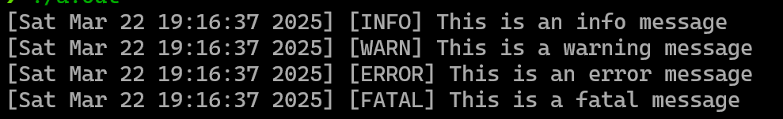
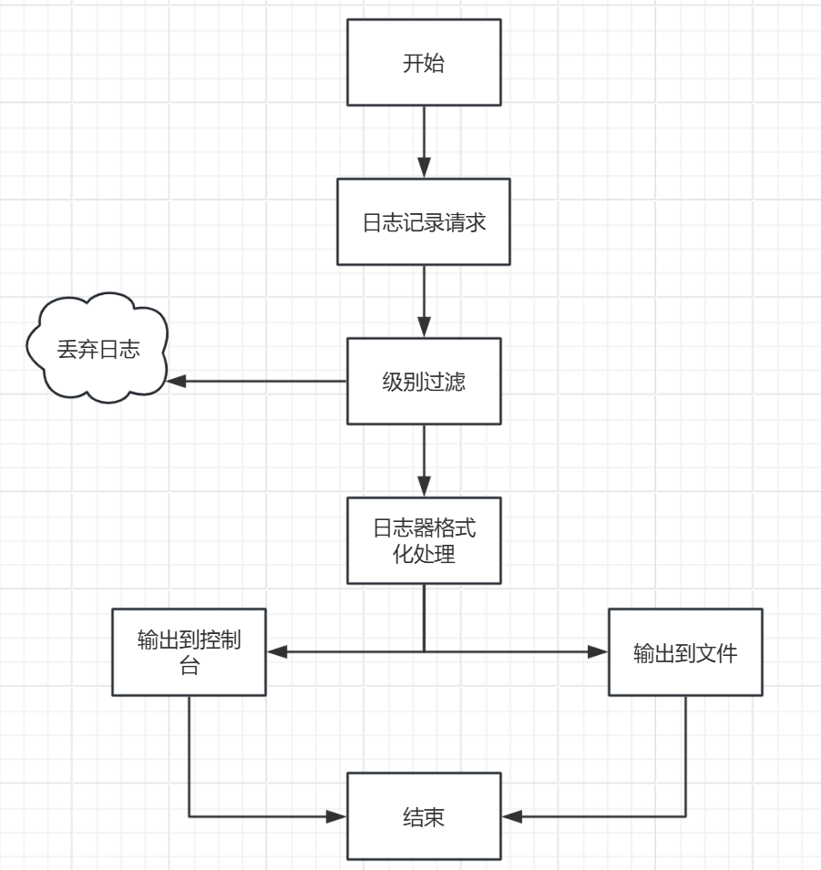
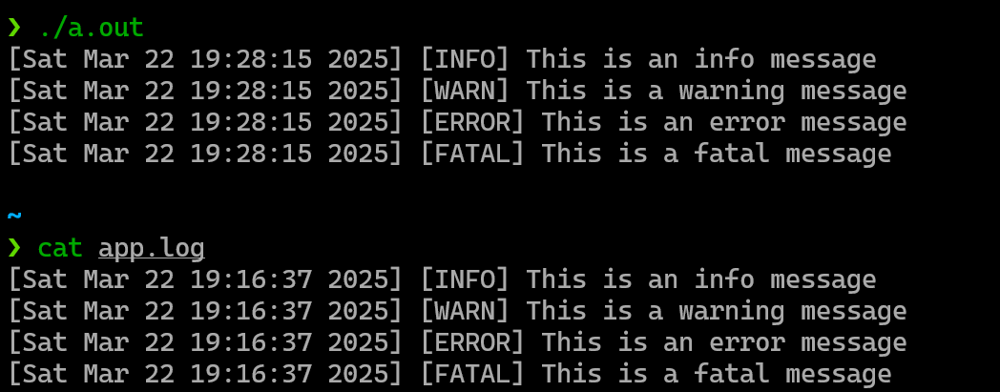

# 4.基础日志系统讲解

## 日志系统的重要性

日志系统在软件开发中作用主要在代码编写和调试以及项目启动后的系统运行状况记录，能够详细记录程序的执行流程、变量的值以及函数的调用情况等，所需要的任何信息都可以通过日志来获取。

由于日志系统在项目的整个生命周期中都有着不可替代的作用，因此可以说任何项目都可以并且应该集成日志系统以便debug，性能分析等操作，所以设计好日志系统 可以嫁接到 所有C++项目里。

## 使用方式

使用类似如下代码发起日志请求将会得到类似下图的日志信息，包含时间，日志等级和日志信息。实际上可自定义比如线程号，文件名，日志所在行等信息。

```cpp
Logger logger();
logger.info("This is an info message");
logger.warn("This is a warning message");
logger.error("This is an error message");
logger.fatal("This is a fatal message");
```



## 核心组件

### 1. 日志记录器（Logger）

日志记录器是日志系统的核心，负责接收和处理日志信息。它对外提供了记录不同级别日志的接口，如`debug`、`info`、`warn`、`error`和`fatal`。

### 2. 日志级别（Log Level）

日志级别用于区分日志的重要程度，常见的日志级别有：

* **DEBUG**：用于开发调试阶段，记录详细的调试信息。
* **INFO**：记录程序正常运行时的关键信息。
* **WARN**：表示程序出现了潜在问题，但不影响正常运行。
* **ERROR**：记录程序发生的错误，导致部分功能无法正常执行。
* **FATAL**：表示发生了严重错误，程序无法继续运行。

### 3. 日志格式化器（Formatter）

日志格式化器负责将日志信息转换为特定的格式，方便查看和分析。常见的日志格式包含时间戳、日志级别、日志消息和来源等信息。

### 4. 日志输出器（Flush）

日志输出器负责将格式化后的日志信息输出到指定的目标，如控制台、文件、数据库等。可以同时配置多个输出器，将日志信息输出到不同的目标。

## 工作流程



1. **日志记录**：在程序中调用日志记录器的相应方法，传入日志消息和日志级别。
2. **级别过滤**：日志记录器根据配置的日志级别，过滤掉低于该级别的日志信息。
3. **格式化处理**：将符合条件的日志信息传递给日志格式化器，进行格式化处理。
4. **输出操作**：格式化后的日志信息被传递给日志输出器，输出到指定的目标。

### 代码示例

* **LogLevel 枚举**：定义了不同的日志级别。
* **Formatter 类**：将日志信息格式化为包含时间戳和日志级别的字符串。
* **Flush 类**：抽象基类，定义了日志输出的接口。
* **ConsoleFlush 类**：将日志信息输出到控制台。
* **FileFlush 类**：将日志信息输出到文件。
* **Logger 类**：日志记录器，负责接收日志信息，进行级别过滤，格式化处理，并将日志信息输出到控制台和文件。

以下给出一个最基础的日志系统代码：

```cpp
#include <iostream>
#include <string>
#include <ctime>
#include <fstream>
#include <memory>

// 日志级别枚举
enum class LogLevel {
    DEBUG,
    INFO,
    WARN,
    ERROR,
    FATAL
};

// 日志格式化器
class Formatter {
public:
    std::string format(LogLevel level, const std::string& message) {
        std::time_t now = std::time(nullptr);
        std::string time_str = std::ctime(&now);
        time_str.pop_back(); // 去掉换行符

        std::string level_str;
        switch (level) {
            case LogLevel::DEBUG: level_str = "DEBUG"; break;
            case LogLevel::INFO: level_str = "INFO"; break;
            case LogLevel::WARN: level_str = "WARN"; break;
            case LogLevel::ERROR: level_str = "ERROR"; break;
            case LogLevel::FATAL: level_str = "FATAL"; break;
        }

        return "[" + time_str + "] [" + level_str + "] " + message;
    }
};

// 日志输出器
class Flush {
public:
    virtual void flush(const std::string& formatted_log) = 0;
    virtual ~Flush() = default;
};

// 控制台输出器
class ConsoleFlush : public Flush {
public:
    void flush(const std::string& formatted_log) override {
        std::cout << formatted_log << std::endl;
    }
};

// 文件输出器
class FileFlush : public Flush {
public:
    FileFlush(const std::string& filename) : file_(filename, std::ios::app) {}

    void flush(const std::string& formatted_log) override {
        if (file_.is_open()) {
            file_ << formatted_log << std::endl;
        }
    }

    ~FileFlush() {
        if (file_.is_open()) {
            file_.close();
        }
    }

private:
    std::ofstream file_;
};

// 日志记录器
class Logger {
public:
    Logger(LogLevel level) : level_(level), formatter_(std::make_unique<Formatter>()) {
        console_Flush_ = std::make_unique<ConsoleFlush>();
        file_Flush_ = std::make_unique<FileFlush>("app.log");
    }

    void log(LogLevel level, const std::string& message) {
        if (level >= level_) {
            std::string formatted_log = formatter_->format(level, message);
            console_Flush_->flush(formatted_log);
            file_Flush_->flush(formatted_log);
        }
    }

    void debug(const std::string& message) {
        log(LogLevel::DEBUG, message);
    }

    void info(const std::string& message) {
        log(LogLevel::INFO, message);
    }

    void warn(const std::string& message) {
        log(LogLevel::WARN, message);
    }

    void error(const std::string& message) {
        log(LogLevel::ERROR, message);
    }

    void fatal(const std::string& message) {
        log(LogLevel::FATAL, message);
    }

private:
    LogLevel level_;
    std::unique_ptr<Formatter> formatter_;
    std::unique_ptr<Flush> console_Flush_;
    std::unique_ptr<Flush> file_Flush_;
};

```

<font style="color:rgba(0, 0, 0, 0.85);">你可以使用以下方式调用上述代码：</font>

```cpp
int main() {
    Logger logger(LogLevel::INFO);
    logger.debug("This is a debug message");
    logger.info("This is an info message");
    logger.warn("This is a warning message");
    logger.error("This is an error message");
    logger.fatal("This is a fatal message");
    return 0;
}
```

将会得到：



### 其他

本项目的日志系统，以这个基础的日志系统为例，该日志系统是 同步 的，本项目扩展了：

* 异步日志系统，这样不会阻塞业务逻辑，用户发起日志请求后，将日志消息组织到缓冲区就返回，相比同步日志减少了磁盘IO次数。
* 滚动文件，日志不会全部积压在一个文件里，导致单个文件过大打开时间长。
* 支持远程备份日志，防止日志丢失，机器crush后日志无法查看，
* 在日志器，日志输出器等地方使用了设计模式，使该日志系统易于扩展，比如建造者模式，工厂模式。


> 更新: 2025-03-24 18:24:12  
> 原文: <https://www.yuque.com/chengxuyuancarl/ipf60h/ogu4egr9g33ixago>