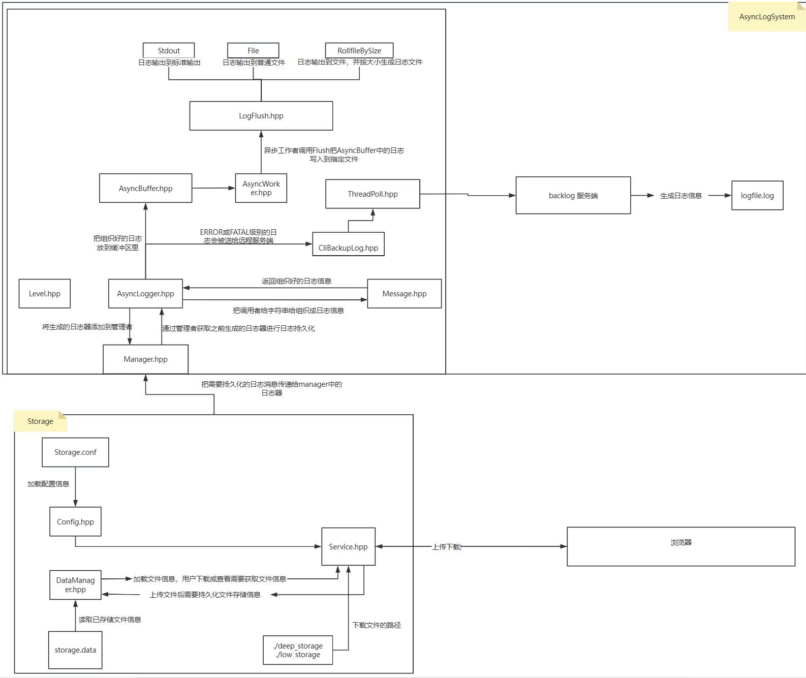
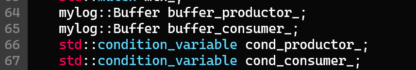
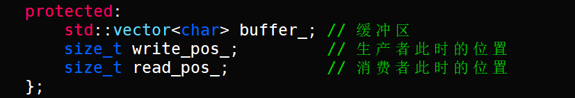
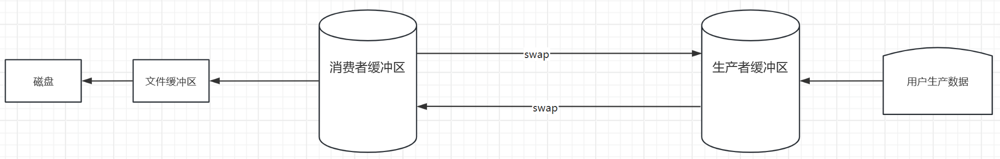
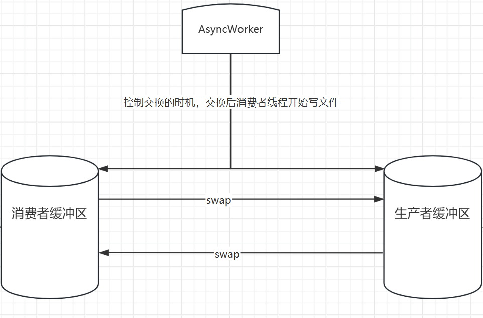
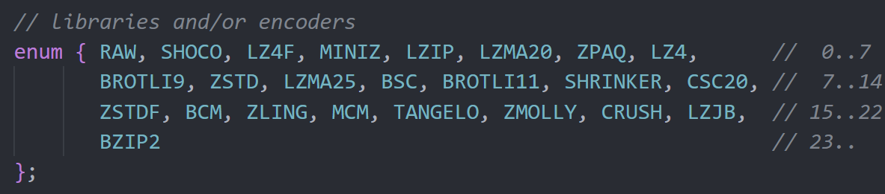
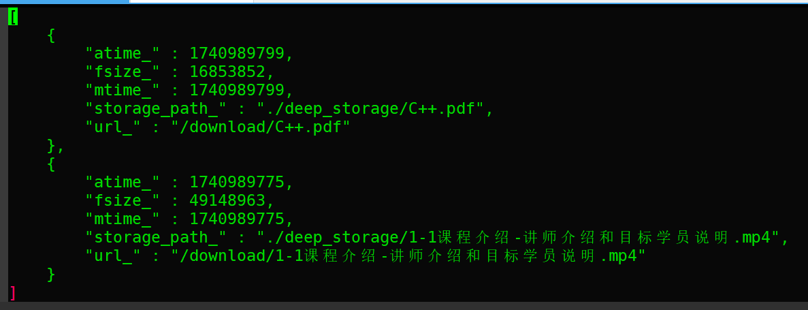
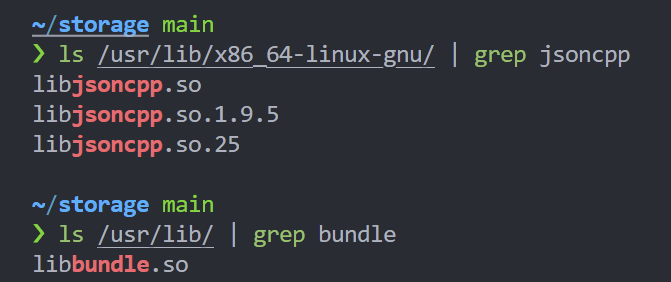
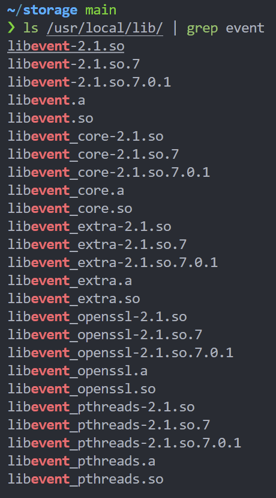
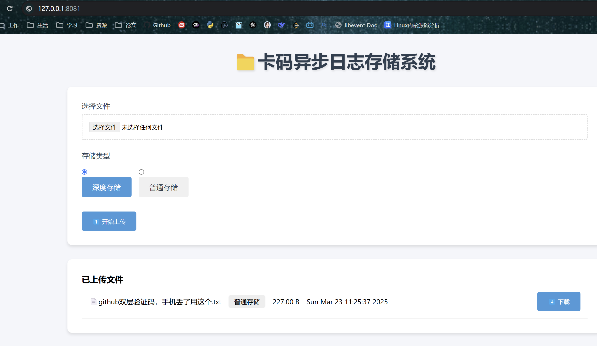

# 5. 框架梳理

# 整体框架图

# 日志部分

## 模块介绍

├── AsyncBuffer.hpp 异步缓冲区模块

├── AsyncLogger.hpp 异步日志器模块

├── AsyncWorker.hpp 异步工作者模块

├── Flush.hpp 日志持久化模块

├── Level.hpp 日志等级模块

├── Manager.hpp 异步日志器管理模块

├── Message.hpp 日志消息生成模块

├── MyLog.hpp

├── ThreadPoll.hpp 建议线程池

├── Util.hpp

├── backlog 远程备份模块

│   ├── CliBackupLog.hpp

│   ├── ServerBackupLog.cpp

│   └── ServerBackupLog.hpp

└── config.conf

该日志库由用户产生日志：`mylog::GetLogger("asynclogger")->Info("NewStorageInfo end");`，由异步线程实际写日志到文件。采用双缓冲设计，分为消费者缓冲区以及生产者缓冲区，生产者缓冲区存放用户产生的日志，当生产者缓冲区中有数据的时候，交换生产者与消费者缓冲区，省去了把生产者缓冲区的数据拷贝给消费者缓冲区的开销。缓冲区的大小可自行配置，也可配置缓冲区容量动态增长。



### AsyncBuffer  异步缓冲区模块

AsyncBuffer 的作用是异步日志的容器，具体来说，当业务上要求写一条日志时，该日志信息会被存放到AsyncBuffer里，其支持通过`AsyncType`字段设置成`ASYNC_UNSAFE`，即可根据业务需求自动增长容量。这里的缓冲区采用双缓冲设计，分为消费者缓冲区以及生产者缓冲区，当生产者缓冲区有数据后则触发缓冲区交换，这种缓冲区交换的方式实际就是交换消费者AsyncBuffer和生产者AsyncBuffer的三个成员变量，而非把该类里的buffer\_的数据复制给了消费者缓冲区。





### AsyncLogger.hpp 异步日志器模块

AsyncLogger 是一个日志器，包含一个异步日志器类和创建日志器的建造者，其中实现了各个日志等级的日志消息组织方式。并最终通过该日志器调用异步工作者进行一个实际的写日志。创建日志器的类使用了建造者模式，方便后续做扩展其他特性的日志器。

所有的操作将会在这里被调用。具体来说，用户需要写一条日志时，首先得生成一个异步日志器即AsyncLogger类对象，然后将其添加到日志器管理模块中，

```cpp
//使用日志器建造者建造一个名字较asynclogger的日志器
std::shared_ptr<mylog::LoggerBuilder> Glb(new mylog::LoggerBuilder());
Glb->BuildLoggerName("asynclogger");
Glb->BuildLoggerFlush<mylog::RollFileFlush>("./logfile/RollFile_log",1024 * 1024);
//将日志器添加到日志器管理者中，管理者是全局单例类
mylog::LoggerManager::GetInstance().AddLogger(Glb->Build());
```

当一条写日志语句被调用后（

如：`mylog::GetLogger("asynclogger")->Info("NewStorageInfo end");`，将会经过：将该调用语句中的日志等级、日志语句所在文件名、文件行、日志器的名称以及用户给的字符串进行解析，序列化解析后的各个字段使其成为预定的格式，确定日志等级，以及确认是否是ERROR或FATLE级别的日志等过程，最后再调用刷新数据到文件的逻辑。

### AsyncWorker.hpp 异步工作者模块

AsyncWorker 是一个异步线程，当日志器被建造后，异步工作者就会启动，检测到AsyncBuffer中没有数据时，会阻塞，等待消费者缓冲区内有数据时则会交换缓冲区，生产者与消费者身份对调，该生产者缓冲区将会变成消费者缓冲区，最后对消费者缓冲区中的数据进行刷新到文件。



该异步工作者包含两种模式，安全和非安全，对应的意思就是是否允许缓冲区增长，非安全就不限制缓冲区的增长，一般用于测试，否则的话可能会导致缓冲区过大导致内存不足。安全模式下当缓冲区不足会阻塞等待其他日志被消费掉。该类使用条件变量的方式唤醒线程，满足条件则会交换缓冲区唤醒消费者去读取缓冲区中的内容写入到磁盘。callback就是在日志器生成的时候传入的RealFlush函数。

### Flush.hpp 日志持久化模块

Flush 是用来控制日志数据该输出到哪里的，具体的比如终端，文件，以及按照文件大小滚动文件中，文件大小可在config.conf中配置。包含一个工厂类用于创建Flush类。在该类实例化的时候。

### Level.hpp 日志等级模块

Level 是日志等级类，规定了该日志系统的日志等级如DEBUG，INFO，ERROR

### Message.hpp 日志消息生成模块

当请求写入日志时如`mylog::GetLogger("asynclogger")->Info("NewStorageInfo end");`，会将用户传入的字符串中的各种参数给到该对象，然后对该文件中的LogMessage对象中的成员变量进行赋值，并返回组织好的日志消息，如

### Manager.hpp 异步日志器管理模块

Manager是管理AsyncLogger日志器的管理者，具体在代码上就是实现为了一个全局单例，当用户生成一个日志器后会被添加进来，当后续用户还需要用某个日志器的时候根据日志器的名字获取该日志器即可，这也是为什么在建造日志器的时候必须要有日志器的名字。实现很简单，直接看代码就能看懂。其中包含一个默认的日志器，该Manager类实例化的时候会默认加入到该类里。

### Mylog.hpp

MyLog 是一些宏函数，简化用户操作

### ThreadPoll 简易线程池模块

ThreadPoll 在备份重要日志的时候使用池中的线程进行网络IO

1. 创建线程池时，启动指定数量的线程，这些线程会进入等待状态，等待任务队列中有新任务。
2. 当有新任务到来时，调用 `enqueue` 函数将任务添加到任务队列中，并唤醒一个等待的线程。
3. 被唤醒的线程从任务队列中取出任务并执行。
4. 当需要销毁线程池时，设置 `stop` 标志位为 `true`，唤醒所有线程，等待它们结束。

### Util.hpp  工具类

一些工具函数，包含了读取配置文件的json反序列化操作，文件操作等

### config.conf

这个文件里放的是配置文件，使用json格式组织，字段含义如下

```bash
{
    "buffer_size": 10000000,      # 一个AsyncBuffer的大小/字节
    "threshold": 10000000000,     # AsyncBuffer按自身大小的倍数增加，当大小到达该字段时，停止倍数增加
    "linear_growth" : 10000000,		# AsyncBuffer 达到threshold时，采用这种方式线性增长的方式增加容量
    "flush_log" : 2,							# 为1时，调用fflush，为2时调用fflush后调用fsync
    "backup_addr" : "47.116.74.254", # 备份重要日志的服务器IP
    "backup_port" : 8080,	 # 备份重要日志的服务器port
    "thread_count" : 3	# 线程池的线程个数
}
```

### backlog 远程备份模块

backlog中包含的几个文件是用来备份日志的tcp服务器和客户端。

该目录下有三个文件，分别是服务端和客户端，服务端放在其他服务器，客户端放在业务所在服务器，客户端发送Fatal和ERROR级别日志给服务端。发送这两个级别的日志给其他服务器做备份主要是为了防止机器crush之后无法查看日志或日志丢失等情况。

具体代码就是普通的tcp通信代码。其中server端的代码做了点小封装，从ServerBackupLog.cpp里main函数开始看就能看懂。

## 调用链介绍

首先使用Util.hpp中的GetJsonData函数将config.conf中的数据加载到内存中，然后初始化内存池大小，然后实例化日志器建造者，使用建造者实例化出日志器，然后加入到日志器管理者中以供全局调用。

在使用MyLog.hpp中的宏时，如：mylog::GetLogger("asynclogger")->Info("NewStorageInfo start");

即从日志器管理者对象中获取名为asynclogger的日志器，日志信息为Mylog.hpp中宏函数定义的那样，发送给日志器的Info函数，Info函数接受后解析日志消息并把日志消息的各个部分赋值给Message.hpp中的类的字段。之后，Info函数对该Message.hpp中的类LogMessage进行序列化成指定格式，生成的日志如：

```cpp
[12:17:16][139969708803648[DEBUG][asynclogger][Service.hpp:60]  event_base_dispatch start
格式为：时间，线程id，日志等级，日志器的名称，文件名+行号，信息体
```

序列化这种数据后，该字符串将会发送给异步缓冲区，然后返回。后续具体的日志写文件由异步工作线程进行处理。

# 存储部分

## 模块介绍

── server

```
├── Config.hpp 配置信息模块

├── DataManager.hpp 数据管理模块

├── Makefile

├── Service.hpp http服务器通信模块

├── Storage.conf 配置文件 

├── Test.cpp 

├── Util.hpp 工具类

├── base64.cpp base64编码源文件

├── base64.h base64头文件

├── bundle.h压缩库

└── index.html 前端代码
```

### Server

#### bundle.h，base64.h，base64.cpp

这是第三方库头文件和cpp文件，像我这样放在代码目录里面就好。

本项目使用的bundle库压缩格式是LZIP格式。

#### Storage.conf 配置文件

```properties
{
    "server_port" : 8081,
    "server_ip" : "10.132.222.35", 
    "download_prefix" : "/download/",  //文件下载的前缀，即url中将包含该字符串，如/download/index.html
    "deep_storage_dir" : "./deep_storage/",  #深度存储的路径 
    "low_storage_dir" : "./low_storage/", #浅度存储的路径
    "bundle_format":4,  #深度存储的文件类型，由选择的压缩格式确定
    "storage_info" : "./storage.data"  #已存储文件的信息
}
```

对于bundle\_format压缩格式字段，选择的是4号也就是LZIP



#### Config.hpp 配置信息模块

这里面是用来获取配置文件Storage.conf的信息的。实现为懒汉模式，Config类的几个成员变量与Storage.conf中的几个字段对应，通过ReadConfig函数进行解析，格式是json格式。程序启动后首先读取配置信息到该类中。

#### DataManager.hpp 数据管理模块

文件上传后会生成Storage.dat文件，Storage.dat文件里包含了：

文件最后一次访问时间，大小，修改时间，文件的存储路径，url下载路径。

这里数据格式是Json，如下图:

持久化后的文件信息，其对应的就是DataManager.hpp中的StorageInfo类的字段信息。当该程序启动后，会首先加载Storage.data中曾经持久化的文件信息。当有新的文件被上传存储时，则使用json序列化方式插入新的StorageInfo。

#### Service.hpp 服务端http通信模块

这里是主体部分，用到libevent库的http服务器。首先实例化该服务器，注册一个通用回调给libevent库的http服务器，当监听到该事件发生后，会调用回调，在该回调中判断是哪一种请求，并在内部进行一次调用处理对应请求。

libevent的使用方式，简单来说，libevent的http服务器在使用时需要调用event\_base()进行一个初始化环境，然后绑定端口ip之后，设置一个通用回调，当然也可以为特殊uri指定回调。然后调用event\_base\_dispatch启动事件循环，事件如果到达，之前注册的回调就会被执行。

其中在前端代码的处理上，上传文件时上传中文名文件会出错，这里前端使用base64编码进行编码，在后端再进行解码获取文件名。在用户刷新前端页面时，后端会返回index.html中的文件内容给浏览器，其中涉及到自定义后端所在的ip和端口，以及将已上传的文件列表添加到html中组织成最终返回给浏览器的html代码。

#### Util.hpp 工具类

和日志部分的util差不多，多加了url的编码解码函数

#### 其他部分

其余部分代码比较简单直接看代码即可。

* test.cpp里是启动服务的主函数所在，首先启动了异步日志系统后，就开始初始化数据管理DataManager类，然后启动服务
* Util.hpp里同样是常用的工具类，其中加了url编解码的函数，此处解码没有对+号进行解码，因为比如下载C++这种名字的符号时，如果解码了，传递的url就会是c  ，+会被替换成空格。
* 启动该服务的makefile文件中，

```cpp
g++ -o test Test.cpp -std=c++17 -lpthread -lstdc++fs -ljsoncpp -lbundle -levent
```

stdc++fs 是C++17中的的文件系统

bundle这边我直接编译成了动态库



event就是libevent的库



## 调用链介绍

看Test.cpp里，首先实例化DataManager类，获取已存储的文件信息列表，然后实例化service类，然后调用service的RunMoudle函数启动服务器。服务端启动之后，客户端或浏览器发送请求，服务端将会根据对应的请求按照相应回调进行处理。

请求分为三种，

* 上传：IP:Port/upload 直接在浏览器输入IP:Port，然后选择文件和在服务端的存储方式，点击Uplload，浏览器自行发送upload请求给服务器响应。
* 下载：IP:Port/download/某文件 直接在浏览器输入IP:Port，然后点击对应的文件下载按钮即可，浏览器自动会发送该文件请求给服务器进行解析。
* 展示已上传的文件IP:Port/  在浏览器输入该url即可。



####


> 更新: 2025-06-17 07:42:00  
> 原文: <https://www.yuque.com/chengxuyuancarl/ipf60h/fvgh7kkwubzp35e0>