# 【补充】客户端扩展

本篇可以不用看

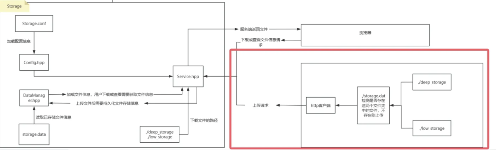

## 功能介绍：
1. 客户端自动扫描默认路径，上传未与服务端同步的文件
2. 客户上传时无论选择浅度还是深度存储，都是普通文件，服务端下载时，会自动返回浅度存储的文件，防止用户得到的是一个无法解析的文件


如果自己实现了win客户端，则我们在win客户端目录下启动exe文件，并往这两个文件夹下分别放入一个文件，进行上传文件

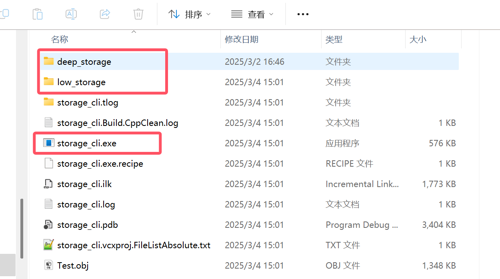

上传成功后客户端会显示

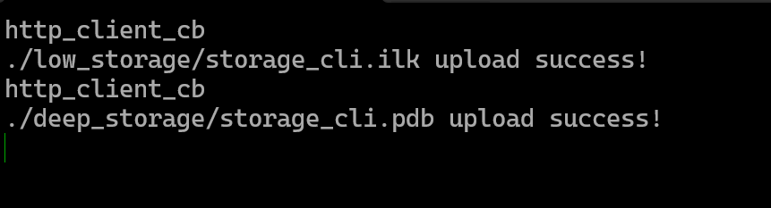

并且在storage.dat文件中出现了已上传文件的名称和自定义的唯一标识

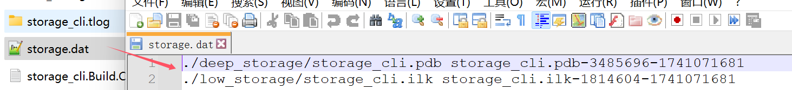


## 环境配置（比较麻烦）
#### libevent
Win的话会麻烦不少。提前准备工具：

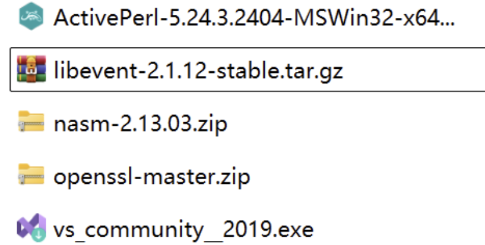

[libevent直接在这里面下，我的是2.1.12-stable版本](https://libevent.org/)

[安装vs2019之后](https://blog.csdn.net/adminstate/article/details/128939556)

[在openssl的github获取源码，把zip文件下载下来](https://github.com/openssl/openssl)

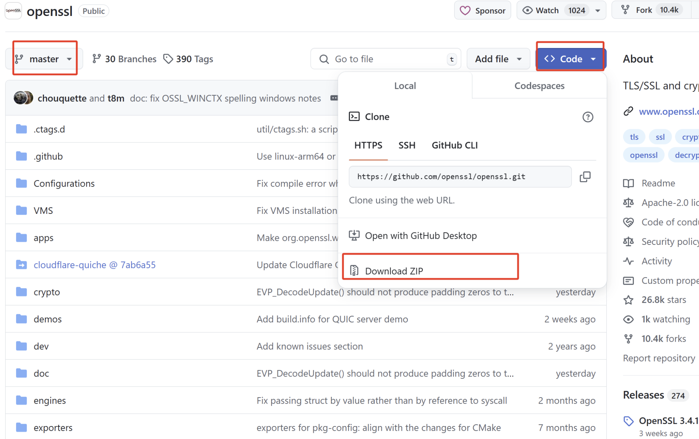

[Perl安装地址](http://www.ffmpeg.club/libevent.html)

[nasm安装地址，网盘里有3个，选那个win32的](http://www.ffmpeg.club/libevent.html)，这里从网盘下载后就ok了，然后把nasm的路径加到环境变量里

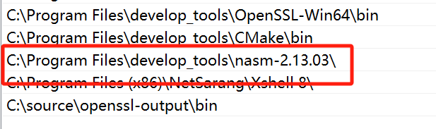

安装perl时，选择这个安装选项并加入环境变量，之后直接一路next就好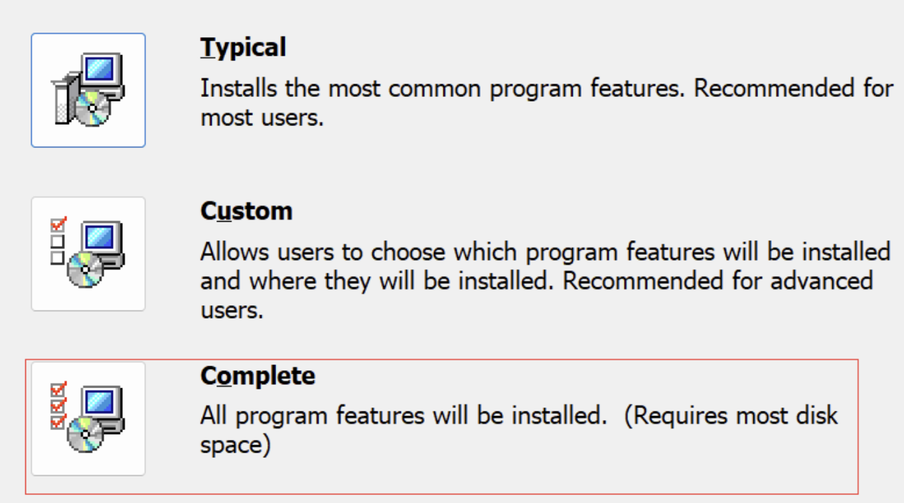

```bash
# 使用以下命令
nasm --version  
perl --version
```

然后使用x64_x86交叉编译的2019的命令行

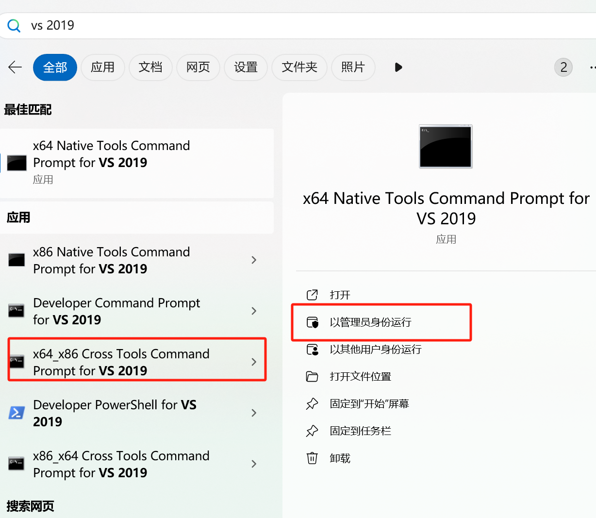

进入到openssl的源码目录下执行编译安装openssl

```bash
perl Configure VC-WIN32 --prefix=D:\software\openssl_output#自己改路径，这个路径是你指定的openssl的安装路径
nmake #这命令时间比较长
nmake install #这个时间会比较长
```

执行完上述命令后你将会在D:\software\openssl_output路径下得到，这个路径就是openssl的安装路径了，存放了一些静态库，可执行文件啥的。把openssl可执行文件的路径添加到环境变量不然后面执行的时候找不到库。

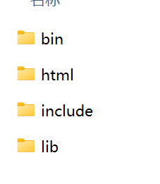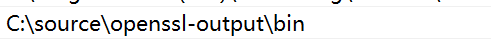

把前面下载的libevent库解压了，然后用前面打开的命令行进入libevent源码的目录执行命令:

```bash
nmake /f Makefile.nmake OPENSSL_DIR=D:\software\openssl_output
```

结束后，使用源码目录的test/目录下的regress.exe执行一下，如果成功执行就说明安装成功了，不用等所有测试都显示OK。如果遇到找不到库或者头文件之类的问题，在自己文件资源管理器里找一下对应的库复制到对应目录下就ok了。比如少了event-config.h，那就复制一份到include/event2/目录下就ok了。

至此安装部分就结束了，但是使用的话需要配置一下vs2019.

首先使用的时候要是x86环境，因为前面编译的库都是x86的，另外下面两行代码是在初始化win的socket，这是win下的socket使用特性，

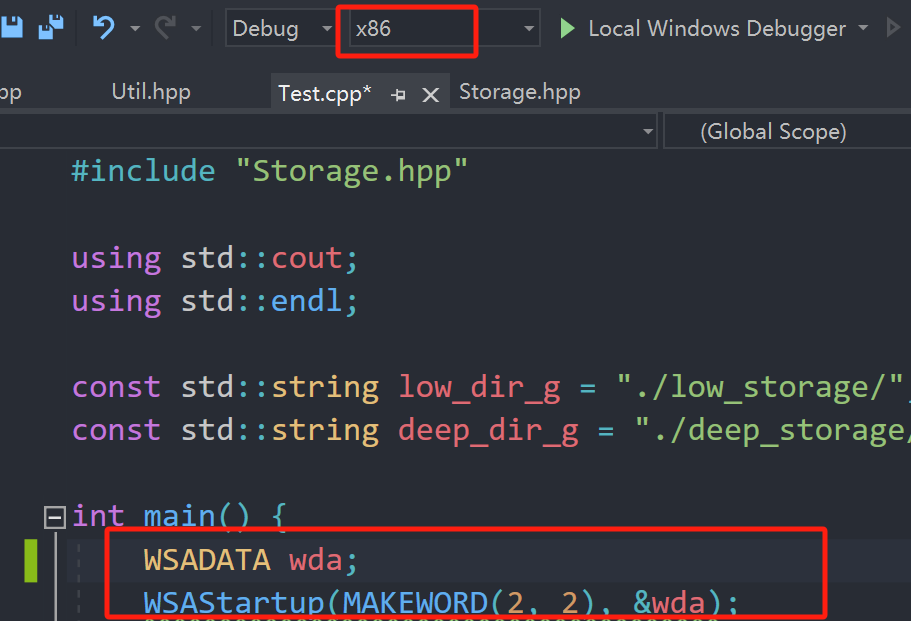

其次，如图操作

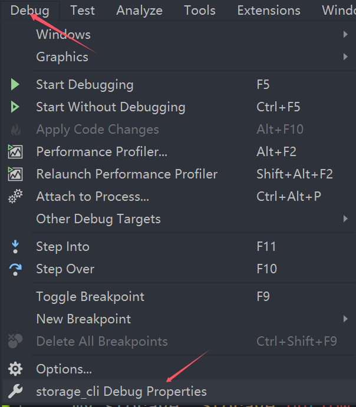

把头文件路径加进来

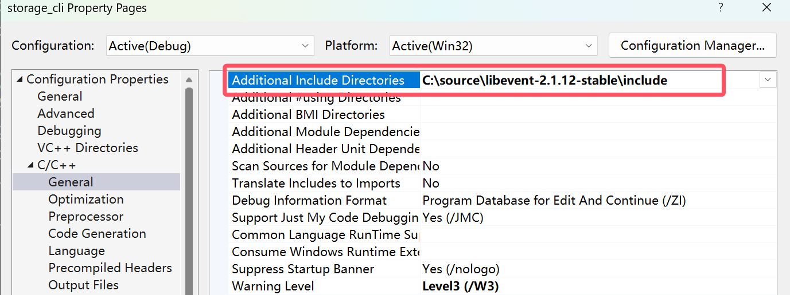

把库路径和库的名字加上

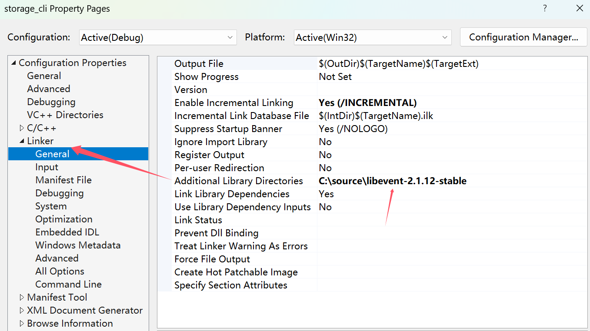

点击edit，进去把前面两个lib加上，后面那个他自动会加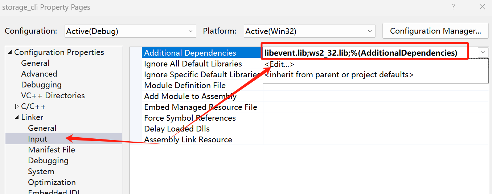

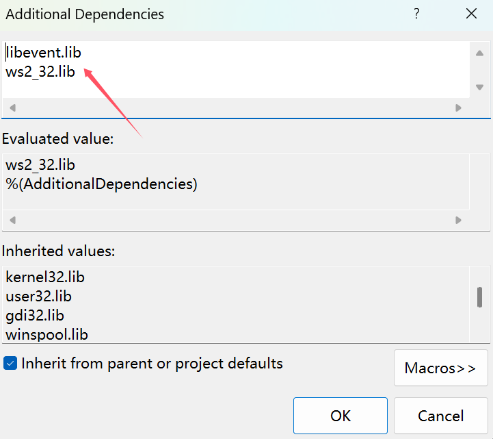

这里libevent的win端就配置完成了。


## 模块介绍
├── client

│   ├── DataManage.hpp 数据管理模块

│   ├── Storage.hpp http客户端通信模块

│   ├── Test.cpp

│   └── Util.hpp 工具类

#### DataManage.hpp 数据管理模块
用于管理上传了的文件信息。格式为文件名+空格+文件唯一标识

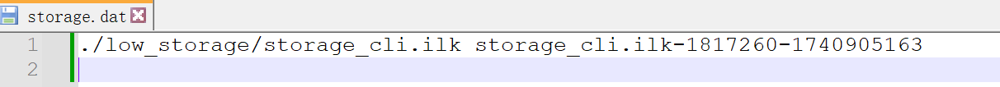

程序启动后，会将之前以及持久化到了文件storage.dat的数据加载到该类进行管理。当有新的文件加入时，则插入新的唯一标识，每次插入数据后会调用Storage函数进行持久化到storage.dat。客户端确认一个文件是否已经被上传过就是通过该类中存的数据与用户的low_storage和deep_storage中的文件进行比对得知。

#### Storage.hpp 客户端通信模块
这里是客户端http通信模块。Storage类初始化时，会加载DataManage类，实例化该对象，然后创建两个目录low和deep，用户把文件放到low目录里，则普通上传，放到low目录，服务端则进行一个压缩存储。

当该模块启动后，客户端会循环扫描这两个目录里的文件，如果满足需要上传的条件，则上传。至于上传的实现用到了一个libevent库的http服务器进行通信。

#### Util.hpp 工具类
这里面是一些工具函数。和服务端差不多。


> 更新: 2025-03-22 11:11:20  
> 原文: <https://www.yuque.com/chengxuyuancarl/ipf60h/ionogeruz2kux20q>