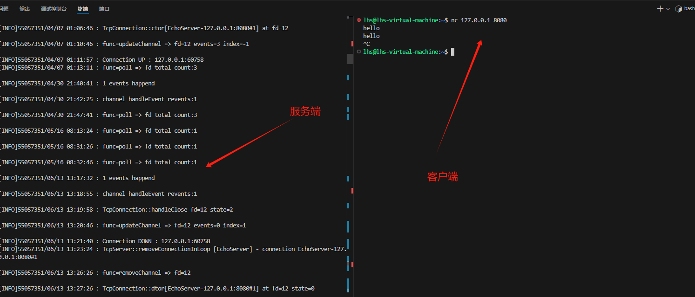

# 3、muduo网络库项目前言

## 为什么要做 muduo？

* 通过学习muduo网络库源码，一定程度上提升了linux网络编程能力;
* 熟悉了网络编程及其下的线程池，缓冲区等设计，学习了多线程编程;
* 通过深入了解muduo网络库源码，对经典的五种IO模型及Reactor模型有了更深的认识
* 掌握基于事件驱动和事件回调的epoll+线程池面向对象编程。
* 还有一点我觉得比较重要就是学习完你可以自行去根据自己需求替换，知识星球的Raft项目、webServer项目、Rpc项目。然后自己再进行拓展这就把自己学习过的知识串通起来了。

## 理论部分

这里提及一下如果多Reactor模型不熟悉的录友：

强烈推荐：<https://xiaolincoding.com/os/8_network_system/reactor.html>

## 结果图片及分析：

### **1. 服务端日志解析**

#### **关键日志内容及说明**

1. <code>**[INFO] channel handleEvent revents:1**</code>
   * 表示某个文件描述符（fd）有事件触发，可能是新连接、数据到达或其他事件。这通常是 Reactor 模型中的事件处理阶段。
2. <code>**[INFO] func=poll => fd total count:3**</code>
   * 表示 `poll` 系统调用在检测事件时，当前监听的文件描述符总数为 3（1 个监听套接字 + 2 个连接）。
3. <code>**[INFO] TcpConnection::handleClose fd=12 state=2**</code>
   * 表示文件描述符 `12` 的连接被关闭，此时该连接的状态为 `state=2`，可能对应 `kDisconnecting` 状态。
4. <code>**[INFO] func=updateChannel => fd=12 events=0 index=1**</code>
   * 文件描述符 `12` 的事件被更新为 `events=0`（不再监听读写事件），表示连接即将从事件管理器中移除。
5. <code>**[INFO] Connection DOWN : 127.0.0.1:60758**</code>
   * 表示客户端 IP 为 `127.0.0.1`、端口为 `60758` 的连接已经断开。
6. <code>**[INFO] TcpServer::removeConnectionInLoop [EchoServer] - connection EchoServer-127.0.0.1:8080#1**</code>
   * 服务端 `EchoServer` 从其连接池中移除了编号为 `#1` 的连接（即 `127.0.0.1:8080#1`）。
7. <code>**[INFO] func=removeChannel => fd=12**</code>
   * 文件描述符 `12` 从事件管理器中移除。
8. <code>**[INFO] TcpConnection::dtor[EchoServer-127.0.0.1:8080#1] at fd=12 state=0**</code>
   * 编号为 `#1` 的连接对象被销毁，文件描述符 `12` 处于 `state=0` 状态（可能对应 `kDisconnected`）。

***

### **2. 客户端行为分析**

根据你的命令和交互：

1. **连接到服务端**
   * 你通过 `nc 127.0.0.1 8080` 使用 `netcat` 工具连接到服务端 `127.0.0.1` 的 `8080` 端口。
   * 服务端接收到了你的连接请求并分配了一个文件描述符（例如 `fd=12`）。
2. **发送消息**
   * 你在客户端输入了 `hello`，服务端处理了这个数据并返回了同样的 `hello`。\
     这说明服务端是一个回显服务器（Echo Server），它接收到数据后原样返回。
3. **断开连接**
   * 当你按下 `Ctrl+C` 时，客户端主动关闭了连接。
   * 服务端检测到连接关闭，触发 `handleClose`，随后清理了相关资源

> 更新: 2025-11-02 00:03:51  
> 原文: <https://www.yuque.com/chengxuyuancarl/gixnqn/bdti3z1ckcafo4qg>