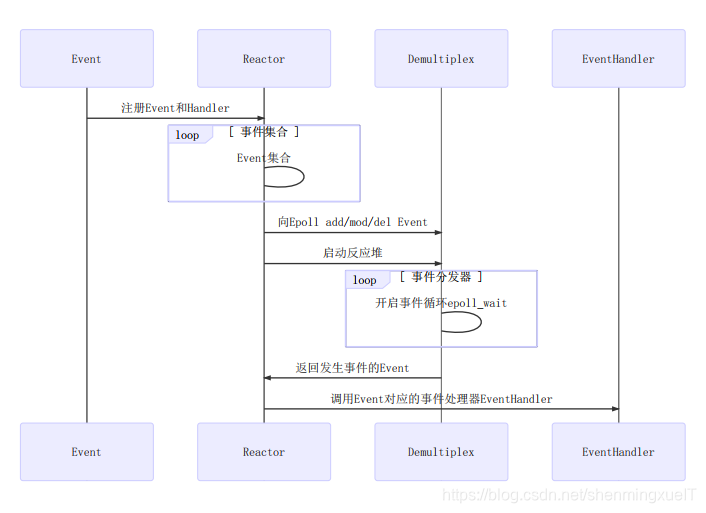
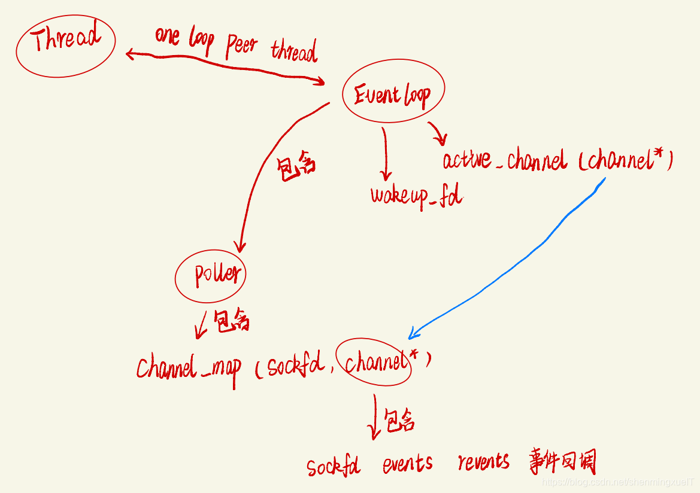
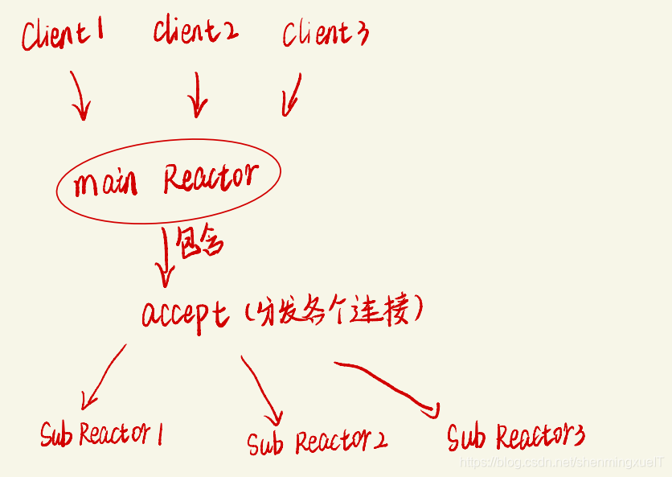

# 4、框架梳理

reactor模型在实际设计中大致是有以下几个部分：

+ Event：事件
+ Reactor： 反应堆
+ Demultiplex：多路事件分发器
+ EventHandler：事件处理器

在muduo中，其**调用关系**大致如下

+ 将事件及其处理方法注册到reactor，reactor中存储了连接套接字connfd以及其感兴趣的事件event
+ reactor向其所对应的demultiplex去注册相应的connfd+事件，启动反应堆
+ 当demultiplex检测到connfd上有事件发生，就会返回相应事件
+ reactor根据事件去调用eventhandler处理程序
+ 

而上述的，是在一个reactor反应堆中所执行的大致流程，其在muduo代码中**包含关系**如下（椭圆圈起来的是类）：

可以看到，EventLoop其实就是我们的subreactor，其执行在一个Thread上，实现了one loop per thread的设计。

每个EventLoop中，我们可以看到有一个Poller和很多的Channel，Poller在上图调用关系中，其实就是demultiplex（多路事件分发器）,而Channel对应的就是event（事件）

现在，我们大致明白了muduo每个reactor的设计，但是作为一个支持高并发的网络库，单线程 往往不是一个好的设计。

muduo采用了和Nginx相似的操作，有一个main reactor通过accept组件负责处理新的客户端连接，并将它们分派给各个sub reactor，每个sub reactor则是负责一个连接的读写等工作。

这里值得一提的是main Reactor也有一个EventLoop 只是其Loop循环的事件是等待连接也就是当Accept触发，那么EventLoop::Loop监听的Poller中epoll_wait就会被唤醒，然后EventLoop把相应的Channel执行其回调事件。这里的回调主要是TcpServer在Accept定义好的newconnection事件，用来初始化Tcpconnection对象的。这个时候就是我们的subReactor也就是我们会通过轮询算法给Tcpconnection对象分配EventLoop对象，此时这个EventLoop对应的就是一个线程，**这就是muduo库重要思想one loop per therad。**

> 更新: 2025-11-22 14:23:12  
> 原文: <https://www.yuque.com/chengxuyuancarl/gixnqn/mwll4lrl8y2m33gn>