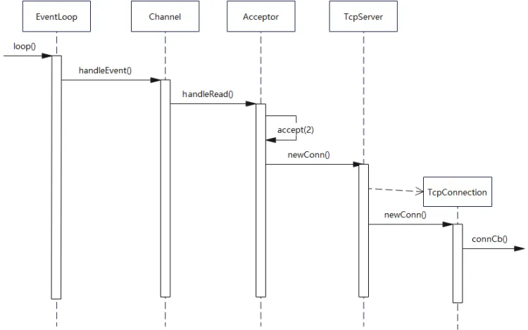

# 5、项目重点类和代码讲解

## Channel

Channel类其实相当于一个文件描述符的保姆！

在TCP网络编程中，想要IO多路复用监听某个文件描述符，就要把这个fd和该fd感兴趣的事件通过epoll\_ctl注册到IO多路复用模块（我管它叫事件监听器）上。当事件监听器监听到该fd发生了某个事件。事件监听器返回 \[发生事件的fd集合]以及\[每个fd都发生了什么事件]

Channel类则封装了一个 \[fd] 和这个 \[fd感兴趣事件] 以及事件监听器监听到 \[该fd实际发生的事件]。同时Channel类还提供了设置该fd的感兴趣事件，以及将该fd及其感兴趣事件注册到事件监听器或从事件监听器上移除，以及保存了该fd的每种事件对应的处理函数。

### Channel类重要的成员变量：

int fd\_这个Channel对象照看的文件描述符

int events\_代表fd感兴趣的事件类型集合   int revents\_代表事件监听器实际监听到该fd发生的事件类型集合，当事件监听器监听到一个fd发生了什么事件，通过Channel::set\_revents()函数来设置revents值。

<font style="color:rgb(38, 38, 38);">EventLoop\* loop这个fd属于哪个EventLoop对象，这个暂时不解释。   </font>

<font style="color:rgb(38, 38, 38);">read\_callback\_ 、write\_callback\_、close\_callback\_、error\_callback\_：这些是std::function类型，代表着这个Channel为这个文件描述符保存的各事件类型发生时的处理函数。比如这个fd发生了可读事件，需要执行可读事件处理函数，这时候Channel类都替你保管好了这些可调用函数，真是贴心啊，要用执行的时候直接管保姆要就可以了。   </font>

### <font style="color:rgb(38, 38, 38);">Channel类重要的成员方法</font>

<font style="color:rgb(38, 38, 38);">向Channel对象注册各类事件的处理函数</font>

```plain
void setReadCallback(ReadEventCallback cb) {read_callback_ = std::move(cb);}
void setWriteCallback(Eventcallback cb) {write_callback_ = std::move(cb);}
void setCloseCallback(EventCallback cb) {close_callback_ = std::move(cb);}
void setErrorCallback(EventCallback cb) {error_callback_ = std::move(cb);}
```

<font style="color:rgb(38, 38, 38);">一个文件描述符会发生可读、可写、关闭、错误事件。当发生这些事件后，就需要调用相应的处理函数来处理。外部通过调用上面这四个函数可以将事件处理函数放进Channel类中，当需要调用的时候就可以直接拿出来调用了。    </font>

<font style="color:rgb(38, 38, 38);">将Channel中的文件描述符及其感兴趣事件注册事件监听器上或从事件监听器上移除</font>

```plain
void enableReading() {events_ |= kReadEvent; upadte();}
void disableReading() {events_ &= ~kReadEvent; update();}
void enableWriting() {events_ |= kWriteEvent; update();}
void disableWriting() {events_ &= ~kWriteEvent; update();}
void disableAll() {events_ |= kNonEvent; update();}
```

<font style="color:rgb(38, 38, 38);">外部通过这几个函数来告知Channel你所监管的文件描述符都对哪些事件类型感兴趣，并把这个文件描述符及其感兴趣事件注册到事件监听器（IO多路复用模块）上。这些函数里面都有一个update()私有成员方法，这个update其实本质上就是调用了epoll\_ctl()。</font>

```plain
int set_revents(int revt) {revents_ = revt;}
```

<font style="color:rgb(38, 38, 38);">当事件监听器监听到某个文件描述符发生了什么事件，通过这个函数可以将这个文件描述符实际发生的事件封装进这个Channel中。</font>

```plain
void Channel::handleEvent(Timestamp receiveTime)；
```

<font style="color:rgb(38, 38, 38);">当调用epoll\_wait()后，可以得知事件监听器上哪些Channel（文件描述符）发生了哪些事件，事件发生后自然就要调用这些Channel对应的处理函数。 Channel::HandleEvent，让每个发生了事件的Channel调用自己保管的事件处理函数。</font>

<font style="color:rgb(38, 38, 38);">每个Channel会根据自己文件描述符实际发生的事件（通过Channel中的revents\_变量得知）和感兴趣的事件（通过Channel中的events\_变量得知）来选择调用read\_callback\_和/或write\_callback\_和/或close\_callback\_和/或error\_callback\_。</font>

<font style="color:rgb(38, 38, 38);"></font>

### <font style="color:rgb(38, 38, 38);">补充：</font>

Channel.cc文件中存在下面代码的注释，这里再进行一次解释：

生命周期：Channel作为TcpConnection的成员，总是随TcpConnection的销毁而销毁。因此，Channel不会在TcpConnection之后存在。\
tie()的目的：提供线程安全保护，防止EventLoop在TcpConnection已销毁后调用Channel的回调函数。它通过弱引用（`weak_ptr`）来检测目标对象是否存活。\
-如果没有tie机制，TcpConnection销毁后Channel的回调可能导致崩溃。但有了tie，Channel在回调前会检查TcpConnection是否还活着，从而避免问题。

```cpp
// channel的tie方法什么时候调用过?  TcpConnection => channel
/**
 * TcpConnection中注册了Channel对应的回调函数，传入的回调函数均为TcpConnection
 * 对象的成员方法，因此可以说明一点就是：Channel的结束一定晚于TcpConnection对象！
 * 此处用tie去解决TcpConnection和Channel的生命周期时长问题，从而保证了Channel对象能够在
 * TcpConnection销毁前销毁。
 **/
```

***

## <font style="color:rgb(38, 38, 38);">Poller</font>

### <font style="color:rgb(38, 38, 38);">Poller/EpollPoller概述</font>

<font style="color:rgb(38, 38, 38);">负责监听文件描述符事件是否触发以及返回发生事件的文件描述符以及具体事件的模块就是Poller。所以一个Poller对象对应一个事件监听器（这里我不确定要不要把Poller就当作事件监听器）。在multi-reactor模型中，有多少reactor就有多少Poller。    </font>

<font style="color:rgb(38, 38, 38);">muduo提供了epoll和poll两种IO多路复用方法来实现事件监听。不过默认是使用epoll来实现，也可以通过选项选择poll。但是我自己重构的muduo库只支持epoll。  </font>

<font style="color:rgb(38, 38, 38);">这个Poller是个抽象虚类，由EpollPoller和PollPoller继承实现，与监听文件描述符和返回监听结果的具体方法也基本上是在这两个派生类中实现。EpollPoller就是封装了用epoll方法实现的与事件监听有关的各种方法，PollPoller就是封装了poll方法实现的与事件监听有关的各种方法。以后谈到Poller希望大家都知道我说的其实是EpollPoller。  </font>

### <font style="color:rgb(38, 38, 38);">Poller：</font>

#### <font style="color:rgb(38, 38, 38);">.h</font>

```cpp
#pragma once

#include <vector>
#include <unordered_map>

#include "noncopyable.h"
#include "Timestamp.h"

class Channel;
class EventLoop;

// muduo库中多路事件分发器的核心IO复用模块
class Poller
{
public:
    using ChannelList = std::vector<Channel *>;

    Poller(EventLoop *loop);
    virtual ~Poller() = default;

    // 给所有IO复用保留统一的接口
    virtual Timestamp poll(int timeoutMs, ChannelList *activeChannels) = 0;
    virtual void updateChannel(Channel *channel) = 0;
    virtual void removeChannel(Channel *channel) = 0;

    // 判断参数channel是否在当前的Poller当中
    bool hasChannel(Channel *channel) const;

    // EventLoop可以通过该接口获取默认的IO复用的具体实现
    static Poller *newDefaultPoller(EventLoop *loop);

protected:
    // map的key:sockfd value:sockfd所属的channel通道类型
    using ChannelMap = std::unordered_map<int, Channel *>;
    ChannelMap channels_;

private:
    EventLoop *ownerLoop_; // 定义Poller所属的事件循环EventLoop
};
```

#### <font style="color:rgb(38, 38, 38);">.cc</font>

```cpp
#include "Poller.h"
#include "Channel.h"

Poller::Poller(EventLoop *loop)
    : ownerLoop_(loop)
{
}

// bool Poller::hasChannel(Channel *channel) const
// {
//     auto it = channels_.find(channel->fd());
//     return it != channels_.end() && it->second == channel;
// }
```

### EpollPoller:

#### .h

```cpp
#pragma once

#include <vector>
#include <sys/epoll.h>

#include "Poller.h"
#include "Timestamp.h"

/**
 * epoll的使用:
 * 1. epoll_create
 * 2. epoll_ctl (add, mod, del)
 * 3. epoll_wait
 **/

class Channel;

class EPollPoller : public Poller
{
public:
    EPollPoller(EventLoop *loop);
    ~EPollPoller() override;

    // 重写基类Poller的抽象方法
    Timestamp poll(int timeoutMs, ChannelList *activeChannels) override;
    void updateChannel(Channel *channel) override;
    void removeChannel(Channel *channel) override;

private:
    static const int kInitEventListSize = 16;

    // 填写活跃的连接
    void fillActiveChannels(int numEvents, ChannelList *activeChannels) const;
    // 更新channel通道 其实就是调用epoll_ctl
    void update(int operation, Channel *channel);

    using EventList = std::vector<epoll_event>; // C++中可以省略struct 直接写epoll_event即可

    int epollfd_;      // epoll_create创建返回的fd保存在epollfd_中
    EventList events_; // 用于存放epoll_wait返回的所有发生的事件的文件描述符事件集
};
```

#### .cc

```cpp
#include <errno.h>
#include <unistd.h>
#include <string.h>

#include "EPollPoller.h"
#include "Logger.h"
#include "Channel.h"

const int kNew = -1;    // 某个channel还没添加至Poller          // channel的成员index_初始化为-1
const int kAdded = 1;   // 某个channel已经添加至Poller
const int kDeleted = 2; // 某个channel已经从Poller删除

EPollPoller::EPollPoller(EventLoop *loop)
    : Poller(loop)
    , epollfd_(::epoll_create1(EPOLL_CLOEXEC)) 
    , events_(kInitEventListSize) // vector<epoll_event>(16)
{
    if (epollfd_ < 0)
    {
        LOG_FATAL("epoll_create error:%d \n", errno);
    }
}

EPollPoller::~EPollPoller()
{
    ::close(epollfd_);
}

Timestamp EPollPoller::poll(int timeoutMs, ChannelList *activeChannels)
{
    // 由于频繁调用poll 实际上应该用LOG_DEBUG输出日志更为合理 当遇到并发场景 关闭DEBUG日志提升效率
    LOG_INFO("func=%s => fd total count:%lu\n", __FUNCTION__, channels_.size());

    int numEvents = ::epoll_wait(epollfd_, &*events_.begin(), static_cast<int>(events_.size()), timeoutMs);
    int saveErrno = errno;
    Timestamp now(Timestamp::now());

    if (numEvents > 0)
    {
        LOG_INFO("%d events happend\n", numEvents); // LOG_DEBUG最合理
        fillActiveChannels(numEvents, activeChannels);
        if (numEvents == events_.size()) // 扩容操作
        {
            events_.resize(events_.size() * 2);
        }
    }
    else if (numEvents == 0)
    {
        LOG_DEBUG("%s timeout!\n", __FUNCTION__);
    }
    else
    {
        if (saveErrno != EINTR)
        {
            errno = saveErrno;
            LOG_ERROR("EPollPoller::poll() error!");
        }
    }
    return now;
}

// channel update remove => EventLoop updateChannel removeChannel => Poller updateChannel removeChannel
void EPollPoller::updateChannel(Channel *channel)
{
    const int index = channel->index();
    LOG_INFO("func=%s => fd=%d events=%d index=%d\n", __FUNCTION__, channel->fd(), channel->events(), index);

    if (index == kNew || index == kDeleted)
    {
        if (index == kNew)
        {
            int fd = channel->fd();
            channels_[fd] = channel;
        }
        else // index == kDeleted
        {
        }
        channel->set_index(kAdded);
        update(EPOLL_CTL_ADD, channel);
    }
    else // channel已经在Poller中注册过了
    {
        int fd = channel->fd();
        if (channel->isNoneEvent())
        {
            update(EPOLL_CTL_DEL, channel);
            channel->set_index(kDeleted);
        }
        else
        {
            update(EPOLL_CTL_MOD, channel);
        }
    }
}

// 从Poller中删除channel
void EPollPoller::removeChannel(Channel *channel)
{
    int fd = channel->fd();
    channels_.erase(fd);

    LOG_INFO("func=%s => fd=%d\n", __FUNCTION__, fd);

    int index = channel->index();
    if (index == kAdded)
    {
        update(EPOLL_CTL_DEL, channel);
    }
    channel->set_index(kNew);
}

// 填写活跃的连接
void EPollPoller::fillActiveChannels(int numEvents, ChannelList *activeChannels) const
{
    for (int i = 0; i < numEvents; ++i)
    {
        Channel *channel = static_cast<Channel *>(events_[i].data.ptr);
        channel->set_revents(events_[i].events);
        activeChannels->push_back(channel); // EventLoop就拿到了它的Poller给它返回的所有发生事件的channel列表了
    }
}

// 更新channel通道 其实就是调用epoll_ctl add/mod/del
void EPollPoller::update(int operation, Channel *channel)
{
    epoll_event event;
    ::memset(&event, 0, sizeof(event));

    int fd = channel->fd();

    event.events = channel->events();
    event.data.fd = fd;
    event.data.ptr = channel;

    if (::epoll_ctl(epollfd_, operation, fd, &event) < 0)
    {
        if (operation == EPOLL_CTL_DEL)
        {
            LOG_ERROR("epoll_ctl del error:%d\n", errno);
        }
        else
        {
            LOG_FATAL("epoll_ctl add/mod error:%d\n", errno);
        }
    }
}
```

### <font style="color:rgb(38, 38, 38);">Poller/EpollPoller的重要成员变量：</font>

<font style="color:rgb(38, 38, 38);">epollfd\_就是用epoll\_create方法返回的epoll句柄，这个是常识。    </font>

<font style="color:rgb(38, 38, 38);">channels\_：这个变量是std::unordered\_map\<int, Channel\*>类型，负责记录 文件描述符 ---> Channel的映射，也帮忙保管所有注册在你这个Poller上的Channel。   </font>

<font style="color:rgb(38, 38, 38);">ownerLoop\_：所属的EventLoop对象，看到后面你懂了。  </font>

### <font style="color:rgb(38, 38, 38);">EpollPoller给外部提供的最重要的方法：</font>

```plain
TimeStamp poll(int timeoutMs, ChannelList *activeChannels)
```

<font style="color:rgb(38, 38, 38);">这个函数可以说是Poller的核心了，当外部调用poll方法的时候，该方法底层其实是通过epoll\_wait获取这个事件监听器上发生事件的fd及其对应发生的事件，我们知道每个fd都是由一个Channel封装的，通过哈希表channels\_可以根据fd找到封装这个fd的Channel。</font>

<font style="color:rgb(38, 38, 38);">将事件监听器监听到该fd发生的事件写进这个Channel中的revents成员变量中。然后把这个Channel装进activeChannels中（它是一个vector\<Channel\*>）。这样，当外界调用完poll之后就能拿到事件监听器的</font>**<font style="color:#DF2A3F;">监听结果（activeChannels\_）。</font>**

<font style="color:rgb(38, 38, 38);">【这里标红是因为后面会经常提到这个“监听结果”这四个字，希望你明白这代表什么含义】，这个activeChannels就是事件监听器监听到的发生事件的fd，以及每个fd都发生了什么事件。</font>

***

## <font style="color:rgb(38, 38, 38);">EventLoop</font>

### <font style="color:rgb(38, 38, 38);">EventLoop概述：</font>

<font style="color:rgb(38, 38, 38);">刚才的Poller是封装了和事件监听有关的方法和成员，调用一次Poller::poll方法它就能给你返回事件监听器的监听结果（发生事件的fd 及其 发生的事件）。作为一个网络服务器，需要有持续监听、持续获取监听结果、持续处理监听结果对应的事件的能力，也就是我们需要循环的去 【调用Poller:poll方法获取实际发生事件的Channel集合，然后调用这些Channel里面保管的不同类型事件的处理函数（调用Channel::HandlerEvent方法）。】     </font>

<font style="color:rgb(38, 38, 38);">EventLoop就是负责实现“循环”，负责驱动“循环”的重要模块！！Channel和Poller其实相当于EventLoop的手下，EventLoop整合封装了二者并向上提供了更方便的接口来使用。    </font>

### <font style="color:rgb(38, 38, 38);">.h</font>

```cpp
#pragma once

#include <functional>
#include <vector>
#include <atomic>
#include <memory>
#include <mutex>

#include "noncopyable.h"
#include "Timestamp.h"
#include "CurrentThread.h"

class Channel;
class Poller;

// 事件循环类 主要包含了两个大模块 Channel Poller(epoll的抽象)
class EventLoop : noncopyable
{
public:
    using Functor = std::function<void()>;

    EventLoop();
    ~EventLoop();

    // 开启事件循环
    void loop();
    // 退出事件循环
    void quit();

    Timestamp pollReturnTime() const { return pollRetureTime_; }

    // 在当前loop中执行
    void runInLoop(Functor cb);
    // 把上层注册的回调函数cb放入队列中 唤醒loop所在的线程执行cb
    void queueInLoop(Functor cb);

    // 通过eventfd唤醒loop所在的线程
    void wakeup();

    // EventLoop的方法 => Poller的方法
    void updateChannel(Channel *channel);
    void removeChannel(Channel *channel);
    // bool hasChannel(Channel *channel);

    // 判断EventLoop对象是否在自己的线程里
    bool isInLoopThread() const { return threadId_ == CurrentThread::tid(); } // threadId_为EventLoop创建时的线程id CurrentThread::tid()为当前线程id

private:
    void handleRead();        // 给eventfd返回的文件描述符wakeupFd_绑定的事件回调 当wakeup()时 即有事件发生时 调用handleRead()读wakeupFd_的8字节 同时唤醒阻塞的epoll_wait
    void doPendingFunctors(); // 执行上层回调

    using ChannelList = std::vector<Channel *>;

    std::atomic_bool looping_; // 原子操作 底层通过CAS实现
    std::atomic_bool quit_;    // 标识退出loop循环

    const pid_t threadId_; // 记录当前EventLoop是被哪个线程id创建的 即标识了当前EventLoop的所属线程id

    Timestamp pollRetureTime_; // Poller返回发生事件的Channels的时间点
    std::unique_ptr<Poller> poller_;

    int wakeupFd_; // 作用：当mainLoop获取一个新用户的Channel 需通过轮询算法选择一个subLoop 通过该成员唤醒subLoop处理Channel
    std::unique_ptr<Channel> wakeupChannel_;

    ChannelList activeChannels_; // 返回Poller检测到当前有事件发生的所有Channel列表

    std::atomic_bool callingPendingFunctors_; // 标识当前loop是否有需要执行的回调操作
    std::vector<Functor> pendingFunctors_;    // 存储loop需要执行的所有回调操作
    std::mutex mutex_;                        // 互斥锁 用来保护上面vector容器的线程安全操作
};
```

### <font style="color:rgb(38, 38, 38);">.cc</font>

```cpp
#include <sys/eventfd.h>
#include <unistd.h>
#include <fcntl.h>
#include <errno.h>
#include <memory>

#include "EventLoop.h"
#include "Logger.h"
#include "Channel.h"
#include "Poller.h"

// 防止一个线程创建多个EventLoop
__thread EventLoop *t_loopInThisThread = nullptr;

// 定义默认的Poller IO复用接口的超时时间
const int kPollTimeMs = 10000; // 10000毫秒 = 10秒钟

/* 创建线程之后主线程和子线程谁先运行是不确定的。
 * 通过一个eventfd在线程之间传递数据的好处是多个线程无需上锁就可以实现同步。
 * eventfd支持的最低内核版本为Linux 2.6.27,在2.6.26及之前的版本也可以使用eventfd，但是flags必须设置为0。
 * 函数原型：
 *     #include <sys/eventfd.h>
 *     int eventfd(unsigned int initval, int flags);
 * 参数说明：
 *      initval,初始化计数器的值。
 *      flags, EFD_NONBLOCK,设置socket为非阻塞。
 *             EFD_CLOEXEC，执行fork的时候，在父进程中的描述符会自动关闭，子进程中的描述符保留。
 * 场景：
 *     eventfd可以用于同一个进程之中的线程之间的通信。
 *     eventfd还可以用于同亲缘关系的进程之间的通信。
 *     eventfd用于不同亲缘关系的进程之间通信的话需要把eventfd放在几个进程共享的共享内存中（没有测试过）。
 */
// 创建wakeupfd 用来notify唤醒subReactor处理新来的channel
int createEventfd()
{
    int evtfd = ::eventfd(0, EFD_NONBLOCK | EFD_CLOEXEC);
    if (evtfd < 0)
    {
        LOG_FATAL("eventfd error:%d\n", errno);
    }
    return evtfd;
}

EventLoop::EventLoop()
    : looping_(false)
    , quit_(false)
    , callingPendingFunctors_(false)
    , threadId_(CurrentThread::tid())
    , poller_(Poller::newDefaultPoller(this))
    , wakeupFd_(createEventfd())
    , wakeupChannel_(new Channel(this, wakeupFd_))
{
    LOG_DEBUG("EventLoop created %p in thread %d\n", this, threadId_);
    if (t_loopInThisThread)
    {
        LOG_FATAL("Another EventLoop %p exists in this thread %d\n", t_loopInThisThread, threadId_);
    }
    else
    {
        t_loopInThisThread = this;
    }
    
    wakeupChannel_->setReadCallback(
        std::bind(&EventLoop::handleRead, this)); // 设置wakeupfd的事件类型以及发生事件后的回调操作
    
    wakeupChannel_->enableReading(); // 每一个EventLoop都将监听wakeupChannel_的EPOLL读事件了
}
EventLoop::~EventLoop()
{
    wakeupChannel_->disableAll(); // 给Channel移除所有感兴趣的事件
    wakeupChannel_->remove();     // 把Channel从EventLoop上删除掉
    ::close(wakeupFd_);
    t_loopInThisThread = nullptr;
}

// 开启事件循环
void EventLoop::loop()
{
    looping_ = true;
    quit_ = false;

    LOG_INFO("EventLoop %p start looping\n", this);

    while (!quit_)
    {
        activeChannels_.clear();
        pollRetureTime_ = poller_->poll(kPollTimeMs, &activeChannels_);
        for (Channel *channel : activeChannels_)
        {
            // Poller监听哪些channel发生了事件 然后上报给EventLoop 通知channel处理相应的事件
            channel->handleEvent(pollRetureTime_);
        }
        /**
         * 执行当前EventLoop事件循环需要处理的回调操作 对于线程数 >=2 的情况 IO线程 mainloop(mainReactor) 主要工作：
         * accept接收连接 => 将accept返回的connfd打包为Channel => TcpServer::newConnection通过轮询将TcpConnection对象分配给subloop处理
         *
         * mainloop调用queueInLoop将回调加入subloop（该回调需要subloop执行 但subloop还在poller_->poll处阻塞） queueInLoop通过wakeup将subloop唤醒
         **/
        doPendingFunctors();
    }
    LOG_INFO("EventLoop %p stop looping.\n", this);
    looping_ = false;
}

/**
 * 退出事件循环
 * 1. 如果loop在自己的线程中调用quit成功了 说明当前线程已经执行完毕了loop()函数的poller_->poll并退出
 * 2. 如果不是当前EventLoop所属线程中调用quit退出EventLoop 需要唤醒EventLoop所属线程的epoll_wait
 *
 * 比如在一个subloop(worker)中调用mainloop(IO)的quit时 需要唤醒mainloop(IO)的poller_->poll 让其执行完loop()函数
 *
 * ！！！ 注意： 正常情况下 mainloop负责请求连接 将回调写入subloop中 通过生产者消费者模型即可实现线程安全的队列
 * ！！！       但是muduo通过wakeup()机制 使用eventfd创建的wakeupFd_ notify 使得mainloop和subloop之间能够进行通信
 **/
void EventLoop::quit()
{
    quit_ = true;

    if (!isInLoopThread())
    {
        wakeup();
    }
}

// 在当前loop中执行cb
void EventLoop::runInLoop(Functor cb)
{
    if (isInLoopThread()) // 当前EventLoop中执行回调
    {
        cb();
    }
    else // 在非当前EventLoop线程中执行cb，就需要唤醒EventLoop所在线程执行cb
    {
        queueInLoop(cb);
    }
}

// 把cb放入队列中 唤醒loop所在的线程执行cb
void EventLoop::queueInLoop(Functor cb)
{
    {
        std::unique_lock<std::mutex> lock(mutex_);
        pendingFunctors_.emplace_back(cb);
    }

    /**
     * || callingPendingFunctors的意思是 当前loop正在执行回调中 但是loop的pendingFunctors_中又加入了新的回调 需要通过wakeup写事件
     * 唤醒相应的需要执行上面回调操作的loop的线程 让loop()下一次poller_->poll()不再阻塞（阻塞的话会延迟前一次新加入的回调的执行），然后
     * 继续执行pendingFunctors_中的回调函数
     **/
    if (!isInLoopThread() || callingPendingFunctors_)
    {
        wakeup(); // 唤醒loop所在线程
    }
}

void EventLoop::handleRead()
{
    uint64_t one = 1;
    ssize_t n = read(wakeupFd_, &one, sizeof(one));
    if (n != sizeof(one))
    {
        LOG_ERROR("EventLoop::handleRead() reads %lu bytes instead of 8\n", n);
    }
}

// 用来唤醒loop所在线程 向wakeupFd_写一个数据 wakeupChannel就发生读事件 当前loop线程就会被唤醒
void EventLoop::wakeup()
{
    uint64_t one = 1;
    ssize_t n = write(wakeupFd_, &one, sizeof(one));
    if (n != sizeof(one))
    {
        LOG_ERROR("EventLoop::wakeup() writes %lu bytes instead of 8\n", n);
    }
}

// EventLoop的方法 => Poller的方法
void EventLoop::updateChannel(Channel *channel)
{
    poller_->updateChannel(channel);
}

void EventLoop::removeChannel(Channel *channel)
{
    poller_->removeChannel(channel);
}

// bool EventLoop::hasChannel(Channel *channel)
// {
//     return poller_->hasChannel(channel);
// }

void EventLoop::doPendingFunctors()
{
    std::vector<Functor> functors;
    callingPendingFunctors_ = true;

    {
        std::unique_lock<std::mutex> lock(mutex_);
        functors.swap(pendingFunctors_); // 交换的方式减少了锁的临界区范围 提升效率 同时避免了死锁 如果执行functor()在临界区内 且functor()中调用queueInLoop()就会产生死锁
    }

    for (const Functor &functor : functors)
    {
        functor(); // 执行当前loop需要执行的回调操作
    }

    callingPendingFunctors_ = false;
}
```

### <font style="color:rgb(38, 38, 38);">One Loop Per Thread 含义介绍</font>

<font style="color:rgb(38, 38, 38);">有没有注意到上面图中，每一个EventLoop都绑定了一个线程（一对一绑定），这种运行模式是Muduo库的特色！！充份利用了多核cpu的能力，每一个核的线程负责循环监听一组文件描述符的集合。至于这个One Loop Per Thread是怎么实现的，后面还会交代。</font>

### <font style="color:rgb(38, 38, 38);">全局概览Poller、Channel和EventLoop在整个Multi-Reactor通信架构中的角色</font>

<font style="color:rgb(38, 38, 38);">EventLoop起到一个驱动循环的功能，Poller负责从事件监听器上获取监听结果。而Channel类则在其中起到了将fd及其相关属性封装的作用，将fd及其感兴趣事件和发生的事件以及不同事件对应的回调函数封装在一起，这样在各个模块中传递更加方便。接着EventLoop调用   </font>

### <font style="color:rgb(38, 38, 38);">EventLoop重要方法 EventLoop:loop()：</font>

```plain
void EventLoop::loop()
{ //EventLoop 所属线程执行
    省略代码 省略代码 省略代码  
    while(!quit_)
    {
        activeChannels_.clear();
        pollReturnTime_ = poller_->poll(kPollTimeMs, &activeChannels_);//此时activeChannels已经填好了事件发生的channel
        for(Channel *channel : activeChannels_)
            channel->HandlerEvent(pollReturnTime_);
        省略代码 省略代码 省略代码
    }
    LOG_INFO("EventLoop %p stop looping. \n", t_loopInThisThread);
}
```

<font style="color:rgb(38, 38, 38);">每个EventLoop对象都唯一绑定了一个线程，这个线程其实就在一直执行这个函数里面的while循环，这个while循环的大致逻辑比较简单。就是调用Poller::poll方法获取事件监听器上的监听结果。接下来在loop里面就会调用监听结果中每一个Channel的处理函数HandlerEvent( )。</font>

<font style="color:rgb(38, 38, 38);">每一个Channel的处理函数会根据Channel类中封装的实际发生的事件，执行Channel类中封装的各事件处理函数。（比如一个Channel发生了可读事件，可写事件，则这个Channel的HandlerEvent( )就会调用提前注册在这个Channel的可读事件和可写事件处理函数，又比如另一个Channel只发生了可读事件，那么HandlerEvent( )就只会调用提前注册在这个Channel中的可读事件处理函数)</font>

***

## <font style="color:rgb(38, 38, 38);">Acceptor</font>

<font style="color:rgb(38, 38, 38);">Accetpor封装了服务器监听套接字fd以及相关处理方法。Acceptor类内部其实没有贡献什么核心的处理函数，主要是对其他类的方法调用进行封装。这里也不好概述，具体看下面的内容吧。</font>

### <font style="color:rgb(38, 38, 38);">.h</font>

```cpp
#pragma once

#include <functional>

#include "noncopyable.h"
#include "Socket.h"
#include "Channel.h"

class EventLoop;
class InetAddress;

class Acceptor : noncopyable
{
public:
    using NewConnectionCallback = std::function<void(int sockfd, const InetAddress &)>;

    Acceptor(EventLoop *loop, const InetAddress &listenAddr, bool reuseport);
    ~Acceptor();
    //设置新连接的回调函数
    void setNewConnectionCallback(const NewConnectionCallback &cb) { NewConnectionCallback_ = cb; }
    // 判断是否在监听
    bool listenning() const { return listenning_; }
    // 监听本地端口
    void listen();

private:
    void handleRead();//处理新用户的连接事件

    EventLoop *loop_; // Acceptor用的就是用户定义的那个baseLoop 也称作mainLoop
    Socket acceptSocket_;//专门用于接收新连接的socket
    Channel acceptChannel_;//专门用于监听新连接的channel
    NewConnectionCallback NewConnectionCallback_;//新连接的回调函数
    bool listenning_;//是否在监听
};
```

### .cc

```cpp
#include <sys/types.h>
#include <sys/socket.h>
#include <errno.h>
#include <unistd.h>

#include "Acceptor.h"
#include "Logger.h"
#include "InetAddress.h"

static int createNonblocking()
{
    int sockfd = ::socket(AF_INET, SOCK_STREAM | SOCK_NONBLOCK | SOCK_CLOEXEC, IPPROTO_TCP);
    if (sockfd < 0)
    {
        LOG_FATAL("%s:%s:%d listen socket create err:%d\n", __FILE__, __FUNCTION__, __LINE__, errno);
    }
    return sockfd;
}

Acceptor::Acceptor(EventLoop *loop, const InetAddress &listenAddr, bool reuseport)
    : loop_(loop)
    , acceptSocket_(createNonblocking())
    , acceptChannel_(loop, acceptSocket_.fd())
    , listenning_(false)
{
    acceptSocket_.setReuseAddr(true);
    acceptSocket_.setReusePort(true);
    acceptSocket_.bindAddress(listenAddr);
    // TcpServer::start() => Acceptor.listen() 如果有新用户连接 要执行一个回调(accept => connfd => 打包成Channel => 唤醒subloop)
    // baseloop监听到有事件发生 => acceptChannel_(listenfd) => 执行该回调函数
    acceptChannel_.setReadCallback(
        std::bind(&Acceptor::handleRead, this));
}

Acceptor::~Acceptor()
{
    acceptChannel_.disableAll();    // 把从Poller中感兴趣的事件删除掉
    acceptChannel_.remove();        // 调用EventLoop->removeChannel => Poller->removeChannel 把Poller的ChannelMap对应的部分删除
}

void Acceptor::listen()
{
    listenning_ = true;
    acceptSocket_.listen();         // listen
    acceptChannel_.enableReading(); // acceptChannel_注册至Poller !重要
}

// listenfd有事件发生了，就是有新用户连接了
void Acceptor::handleRead()
{
    InetAddress peerAddr;
    int connfd = acceptSocket_.accept(&peerAddr);
    if (connfd >= 0)
    {
        if (NewConnectionCallback_)
        {
            NewConnectionCallback_(connfd, peerAddr); // 轮询找到subLoop 唤醒并分发当前的新客户端的Channel
        }
        else
        {
            ::close(connfd);
        }
    }
    else
    {
        LOG_ERROR("%s:%s:%d accept err:%d\n", __FILE__, __FUNCTION__, __LINE__, errno);
        if (errno == EMFILE)
        {
            LOG_ERROR("%s:%s:%d sockfd reached limit\n", __FILE__, __FUNCTION__, __LINE__);
        }
    }
}
```

### <font style="color:rgb(38, 38, 38);">Acceptor封装的重要成员变量</font>

<font style="color:rgb(38, 38, 38);">acceptSocket\_：这个是服务器监听套接字的文件描述符\ </font><font style="color:rgb(38, 38, 38);">acceptChannel\_：这是个Channel类，把acceptSocket\_及其感兴趣事件和事件对应的处理函数都封装进去。\ </font><font style="color:rgb(38, 38, 38);">EventLoop \*loop：监听套接字的fd由哪个EventLoop负责循环监听以及处理相应事件，其实这个EventLoop就是main EventLoop。\ </font><font style="color:rgb(38, 38, 38);">newConnectionCallback\_:</font><font style="color:rgb(38, 38, 38);"> TcpServer构造函数中将TcpServer::newConnection( )函数注册给了这个成员变量。</font><font style="color:rgb(38, 38, 38);">这个TcpServer::newConnection函数的功能是公平的选择一个subEventLoop，并把已经接受的连接分发给这个subEventLoop。</font>

### <font style="color:rgb(38, 38, 38);">Acceptor封装的重要成员方法</font>

<font style="color:rgb(38, 38, 38);">listen( )：该函数底层调用了linux的函数listen( )，开启对acceptSocket\_的监听同时将acceptChannel及其感兴趣事件（可读事件）注册到main EventLoop的事件监听器上。换言之就是让main EventLoop事件监听器去监听acceptSocket\_</font><font style="color:rgb(38, 38, 38);">\ </font><font style="color:rgb(38, 38, 38);">handleRead( )：这是一个私有成员方法，这个方法是要注册到acceptChannel\_上的， 同时handleRead( )方法内部还调用了成员变量newConnectionCallback\_保存的函数。当main EventLoop监听到acceptChannel\_上发生了可读事件时（新用户连接事件），就是调用这个handleRead( )方法。   </font>

***

## <font style="color:rgb(38, 38, 38);">socket</font>

<font style="color:rgb(38, 38, 38);">Socket类只有一个成员sockfd，该类的作用就是用于管理TCP连接对应的sockfd的生命周期（析构的时候close该sockfd），以及提供一些函数来修改sockfd上的选项，比如Nagel算法、设置地址复用等。Socket类如下所示：</font>

```cpp
class Socket : noncopyable
{
public:
    explicit Socket(int sockfd) : sockfd_(sockfd) {}
    ~Socket();
    // 获取sockfd
    int fd() const { return sockfd_; }
    // 绑定sockfd，就是调用::bind函数
    void bindAddress(const InetAddress &localaddr);
    // 就是调用::listen函数
    void listen();
    // 接受连接
    int accept(InetAddress *peeraddr);
    // 设置半关闭
    void shutdownWrite();
    void setTcpNoDelay(bool on);    // 设置Nagel算法 
    void setReuseAddr(bool on);     // 设置地址复用
    void setReusePort(bool on);     // 设置端口复用
    void setKeepAlive(bool on);     // 设置长连接
private:
    const int sockfd_;
};
```

## <font style="color:rgb(38, 38, 38);">buffer</font>

<font style="color:rgb(38, 38, 38);">Buffer类其实是封装了一个用户缓冲区，以及向这个缓冲区写数据读数据等一系列控制方法。</font>

### <font style="color:rgb(38, 38, 38);">.h</font>

```cpp
#pragma once

#include <vector>
#include <string>
#include <algorithm>
#include <stddef.h>

// 网络库底层的缓冲区类型定义
class Buffer
{
public:
    static const size_t kCheapPrepend = 8;//初始预留的prependabel空间大小
    static const size_t kInitialSize = 1024;

    explicit Buffer(size_t initalSize = kInitialSize)
        : buffer_(kCheapPrepend + initalSize)
        , readerIndex_(kCheapPrepend)
        , writerIndex_(kCheapPrepend)
    {
    }

    size_t readableBytes() const { return writerIndex_ - readerIndex_; }
    size_t writableBytes() const { return buffer_.size() - writerIndex_; }
    size_t prependableBytes() const { return readerIndex_; }

    // 返回缓冲区中可读数据的起始地址
    const char *peek() const { return begin() + readerIndex_; }
    void retrieve(size_t len)
    {
        if (len < readableBytes())
        {
            readerIndex_ += len; // 说明应用只读取了可读缓冲区数据的一部分，就是len长度 还剩下readerIndex+=len到writerIndex_的数据未读
        }
        else // len == readableBytes()
        {
            retrieveAll();
        }
    }
    void retrieveAll()
    {
        readerIndex_ = kCheapPrepend;
        writerIndex_ = kCheapPrepend;
    }

    // 把onMessage函数上报的Buffer数据 转成string类型的数据返回
    std::string retrieveAllAsString() { return retrieveAsString(readableBytes()); }
    std::string retrieveAsString(size_t len)
    {
        std::string result(peek(), len);
        retrieve(len); // 上面一句把缓冲区中可读的数据已经读取出来 这里肯定要对缓冲区进行复位操作
        return result;
    }

    // buffer_.size - writerIndex_
    void ensureWritableBytes(size_t len)
    {
        if (writableBytes() < len)
        {
            makeSpace(len); // 扩容
        }
    }

    // 把[data, data+len]内存上的数据添加到writable缓冲区当中
    void append(const char *data, size_t len)
    {
        ensureWritableBytes(len);
        std::copy(data, data+len, beginWrite());
        writerIndex_ += len;
    }
    char *beginWrite() { return begin() + writerIndex_; }
    const char *beginWrite() const { return begin() + writerIndex_; }

    // 从fd上读取数据
    ssize_t readFd(int fd, int *saveErrno);
    // 通过fd发送数据
    ssize_t writeFd(int fd, int *saveErrno);

private:
    // vector底层数组首元素的地址 也就是数组的起始地址
    char *begin() { return &*buffer_.begin(); }
    const char *begin() const { return &*buffer_.begin(); }

    void makeSpace(size_t len)
    {
        /**
         * | kCheapPrepend |xxx| reader | writer |                     // xxx标示reader中已读的部分
         * | kCheapPrepend | reader ｜          len          |
         **/
        if (writableBytes() + prependableBytes() < len + kCheapPrepend) // 也就是说 len > xxx前面剩余的空间 + writer的部分
        {
            buffer_.resize(writerIndex_ + len);
        }
        else // 这里说明 len <= xxx + writer 把reader搬到从xxx开始 使得xxx后面是一段连续空间
        {
            size_t readable = readableBytes(); // readable = reader的长度
            // 将当前缓冲区中从readerIndex_到writerIndex_的数据
            // 拷贝到缓冲区起始位置kCheapPrepend处，以便腾出更多的可写空间
            std::copy(begin() + readerIndex_,
                      begin() + writerIndex_,
                      begin() + kCheapPrepend);
            readerIndex_ = kCheapPrepend;
            writerIndex_ = readerIndex_ + readable;
        }
    }

    std::vector<char> buffer_;
    size_t readerIndex_;
    size_t writerIndex_;
};
```

### .cc

```cpp
#include <errno.h>
#include <sys/uio.h>
#include <unistd.h>

#include "Buffer.h"

/**
 * 从fd上读取数据 Poller工作在LT模式
 * Buffer缓冲区是有大小的！ 但是从fd上读取数据的时候 却不知道tcp数据的最终大小
 *
 * @description: 从socket读到缓冲区的方法是使用readv先读至buffer_，
 * Buffer_空间如果不够会读入到栈上65536个字节大小的空间，然后以append的
 * 方式追加入buffer_。既考虑了避免系统调用带来开销，又不影响数据的接收。
 **/
ssize_t Buffer::readFd(int fd, int *saveErrno)
{
    // 栈额外空间，用于从套接字往出读时，当buffer_暂时不够用时暂存数据，待buffer_重新分配足够空间后，在把数据交换给buffer_。
    char extrabuf[65536] = {0}; // 栈上内存空间 65536/1024 = 64KB

    /*
    struct iovec {
        ptr_t iov_base; // iov_base指向的缓冲区存放的是readv所接收的数据或是writev将要发送的数据
        size_t iov_len; // iov_len在各种情况下分别确定了接收的最大长度以及实际写入的长度
    };
    */

    // 使用iovec分配两个连续的缓冲区
    struct iovec vec[2];
    const size_t writable = writableBytes(); // 这是Buffer底层缓冲区剩余的可写空间大小 不一定能完全存储从fd读出的数据

    // 第一块缓冲区，指向可写空间
    vec[0].iov_base = begin() + writerIndex_;
    vec[0].iov_len = writable;
    // 第二块缓冲区，指向栈空间
    vec[1].iov_base = extrabuf;
    vec[1].iov_len = sizeof(extrabuf);

    // when there is enough space in this buffer, don't read into extrabuf.
    // when extrabuf is used, we read 128k-1 bytes at most.
    // 这里之所以说最多128k-1字节，是因为若writable为64k-1，那么需要两个缓冲区 第一个64k-1 第二个64k 所以做多128k-1
    // 如果第一个缓冲区>=64k 那就只采用一个缓冲区 而不使用栈空间extrabuf[65536]的内容
    const int iovcnt = (writable < sizeof(extrabuf)) ? 2 : 1;
    const ssize_t n = ::readv(fd, vec, iovcnt);

    if (n < 0)
    {
        *saveErrno = errno;
    }
    else if (n <= writable) // Buffer的可写缓冲区已经够存储读出来的数据了
    {
        writerIndex_ += n;
    }
    else // extrabuf里面也写入了n-writable长度的数据
    {
        writerIndex_ = buffer_.size();
        append(extrabuf, n - writable); // 对buffer_扩容 并将extrabuf存储的另一部分数据追加至buffer_
    }
    return n;
}

// inputBuffer_.readFd表示将对端数据读到inputBuffer_中，移动writerIndex_指针
// outputBuffer_.writeFd标示将数据写入到outputBuffer_中，从readerIndex_开始，可以写readableBytes()个字节
ssize_t Buffer::writeFd(int fd, int *saveErrno)
{
    ssize_t n = ::write(fd, peek(), readableBytes());
    if (n < 0)
    {
        *saveErrno = errno;
    }
    return n;
}
```

### <font style="color:rgb(38, 38, 38);">重要的成员方法：</font>

<font style="color:rgb(38, 38, 38);">append(const char\* data, size\_t len)：将data数据添加到缓冲区中。\ </font><font style="color:rgb(38, 38, 38);">retrieveAsString(size\_t len); :获取缓冲区中长度为len的数据，并以strnig返回。\ </font><font style="color:rgb(38, 38, 38);">retrieveAllString();获取缓冲区所有数据，并以string返回。\ </font><font style="color:rgb(38, 38, 38);">ensureWritableByts(size\_t len);当你打算向缓冲区写入长度为len的数据之前，先调用这个函数，这个函数会检查你的缓冲区可写空间能不能装下长度为len的数据，如果不能，就动态扩容。\ </font><font style="color:rgb(38, 38, 38);">下面两个方法主要是封装了调用了上面几个方法：\ </font><font style="color:rgb(38, 38, 38);">ssize\_t Buffer::readFd(int fd, int\* saveErrno);：客户端发来数据，readFd从该TCP接收缓冲区中将数据读出来并放到Buffer中。\ </font><font style="color:rgb(38, 38, 38);">ssize\_t Buffer::writeFd(int fd, int\* saveErrno);：服务端要向这条TCP连接发送数据，通过该方法将Buffer中的数据拷贝到TCP发送缓冲区中。  </font>

<font style="color:rgb(38, 38, 38);"></font>

***

## TcpServer

TcpServer类管理TcpConnetcion，供用户直接使用，生命周期由用户控制。接口如下，用户只需要设置好callback，然后调用start()即可。

下图是TcpServer新建立连接的相关函数调用顺序。

当在EventLoop::loop=>EPollPoller::poll()\[当epoll\_wait被唤醒]=>\[并且唤醒的是listenning fd可读]就会返回所有就绪的Channel的事件，此时就会调用Accpetor::handleRead方法，创建TcpConnection对象，后面应该还会处理其他回调事件的。【这里或许可以考虑使用协程的addevent替换，但是引入协程性能一定会高吗？】

**补充：**

这里channel有几种：

1.Eventloop注册的Channel【eventfd主要是唤醒epoll\_wait，当在执行pending的时候又来了新的回调防止阻塞太久】

2.Acceptor注册的Channel，其目的是就是listen fd新连接可到的时候，调用Accpetor::newConnection（）创建TcpConnection对象。

3.TcpConnection会注册四种fd感兴趣的事件，也就是TcpConnection对应的Channel。



### .h

```cpp
#pragma once

/**
 * 用户使用muduo编写服务器程序
 **/

#include <functional>
#include <string>
#include <memory>
#include <atomic>
#include <unordered_map>

#include "EventLoop.h"
#include "Acceptor.h"
#include "InetAddress.h"
#include "noncopyable.h"
#include "EventLoopThreadPool.h"
#include "Callbacks.h"
#include "TcpConnection.h"
#include "Buffer.h"

// 对外的服务器编程使用的类
class TcpServer
{
public:
    using ThreadInitCallback = std::function<void(EventLoop *)>;

    enum Option
    {
        kNoReusePort,//不允许重用本地端口
        kReusePort,//允许重用本地端口
    };

    TcpServer(EventLoop *loop,
              const InetAddress &listenAddr,
              const std::string &nameArg,
              Option option = kNoReusePort);
    ~TcpServer();

    void setThreadInitCallback(const ThreadInitCallback &cb) { threadInitCallback_ = cb; }
    void setConnectionCallback(const ConnectionCallback &cb) { connectionCallback_ = cb; }
    void setMessageCallback(const MessageCallback &cb) { messageCallback_ = cb; }
    void setWriteCompleteCallback(const WriteCompleteCallback &cb) { writeCompleteCallback_ = cb; }

    // 设置底层subloop的个数
    void setThreadNum(int numThreads);
    /**
     * 如果没有监听, 就启动服务器(监听).
     * 多次调用没有副作用.
     * 线程安全.
     */
    void start();

private:
    void newConnection(int sockfd, const InetAddress &peerAddr);
    void removeConnection(const TcpConnectionPtr &conn);
    void removeConnectionInLoop(const TcpConnectionPtr &conn);

    using ConnectionMap = std::unordered_map<std::string, TcpConnectionPtr>;

    EventLoop *loop_; // baseloop 用户自定义的loop

    const std::string ipPort_;
    const std::string name_;

    std::unique_ptr<Acceptor> acceptor_; // 运行在mainloop 任务就是监听新连接事件

    std::shared_ptr<EventLoopThreadPool> threadPool_; // one loop per thread

    ConnectionCallback connectionCallback_;       //有新连接时的回调
    MessageCallback messageCallback_;             // 有读写事件发生时的回调
    WriteCompleteCallback writeCompleteCallback_; // 消息发送完成后的回调

    ThreadInitCallback threadInitCallback_; // loop线程初始化的回调

    std::atomic_int started_;

    int nextConnId_;
    ConnectionMap connections_; // 保存所有的连接
};
```

注意到并没有连接关闭回调，这是由TcpServer::removeConnection()负责的，进而把工作交给TcpConnecion::connectDestroyed(),用户不可更改设置。

### .cc

```cpp
#include <functional>
#include <string.h>

#include "TcpServer.h"
#include "Logger.h"
#include "TcpConnection.h"

static EventLoop *CheckLoopNotNull(EventLoop *loop)
{
    if (loop == nullptr)
    {
        LOG_FATAL("%s:%s:%d mainLoop is null!\n", __FILE__, __FUNCTION__, __LINE__);
    }
    return loop;
}

TcpServer::TcpServer(EventLoop *loop,
                     const InetAddress &listenAddr,
                     const std::string &nameArg,
                     Option option)
    : loop_(CheckLoopNotNull(loop))
    , ipPort_(listenAddr.toIpPort())
    , name_(nameArg)
    , acceptor_(new Acceptor(loop, listenAddr, option == kReusePort))
    , threadPool_(new EventLoopThreadPool(loop, name_))
    , connectionCallback_()
    , messageCallback_()
    , nextConnId_(1)
    , started_(0)
{
    // 当有新用户连接时，Acceptor类中绑定的acceptChannel_会有读事件发生，执行handleRead()调用TcpServer::newConnection回调
    acceptor_->setNewConnectionCallback(
        std::bind(&TcpServer::newConnection, this, std::placeholders::_1, std::placeholders::_2));
}

TcpServer::~TcpServer()
{
    for(auto &item : connections_)
    {
        TcpConnectionPtr conn(item.second);
        item.second.reset();    // 把原始的智能指针复位 让栈空间的TcpConnectionPtr conn指向该对象 当conn出了其作用域 即可释放智能指针指向的对象
        // 销毁连接
        conn->getLoop()->runInLoop(
            std::bind(&TcpConnection::connectDestroyed, conn));
    }
}

// 设置底层subloop的个数
void TcpServer::setThreadNum(int numThreads)
{
    threadPool_->setThreadNum(numThreads);
}

// 开启服务器监听
void TcpServer::start()
{
    if (started_++ == 0)    // 防止一个TcpServer对象被start多次
    {
        threadPool_->start(threadInitCallback_);    // 启动底层的loop线程池
        loop_->runInLoop(std::bind(&Acceptor::listen, acceptor_.get()));
    }
}

// 有一个新用户连接，acceptor会执行这个回调操作，负责将mainLoop接收到的请求连接(acceptChannel_会有读事件发生)通过回调轮询分发给subLoop去处理
void TcpServer::newConnection(int sockfd, const InetAddress &peerAddr)
{
    // 轮询算法 选择一个subLoop 来管理connfd对应的channel
    EventLoop *ioLoop = threadPool_->getNextLoop();
    char buf[64] = {0};
    snprintf(buf, sizeof buf, "-%s#%d", ipPort_.c_str(), nextConnId_);
    ++nextConnId_;  // 这里没有设置为原子类是因为其只在mainloop中执行 不涉及线程安全问题
    std::string connName = name_ + buf;

    LOG_INFO("TcpServer::newConnection [%s] - new connection [%s] from %s\n",
             name_.c_str(), connName.c_str(), peerAddr.toIpPort().c_str());
    
    // 通过sockfd获取其绑定的本机的ip地址和端口信息
    sockaddr_in local;
    ::memset(&local, 0, sizeof(local));
    socklen_t addrlen = sizeof(local);
    if(::getsockname(sockfd, (sockaddr *)&local, &addrlen) < 0)
    {
        LOG_ERROR("sockets::getLocalAddr");
    }

    InetAddress localAddr(local);
    TcpConnectionPtr conn(new TcpConnection(ioLoop,
                                            connName,
                                            sockfd,
                                            localAddr,
                                            peerAddr));
    connections_[connName] = conn;
    // 下面的回调都是用户设置给TcpServer => TcpConnection的，至于Channel绑定的则是TcpConnection设置的四个，handleRead,handleWrite... 这下面的回调用于handlexxx函数中
    conn->setConnectionCallback(connectionCallback_);
    conn->setMessageCallback(messageCallback_);
    conn->setWriteCompleteCallback(writeCompleteCallback_);

    // 设置了如何关闭连接的回调
    conn->setCloseCallback(
        std::bind(&TcpServer::removeConnection, this, std::placeholders::_1));

    ioLoop->runInLoop(
        std::bind(&TcpConnection::connectEstablished, conn));
}

void TcpServer::removeConnection(const TcpConnectionPtr &conn)
{
    loop_->runInLoop(
        std::bind(&TcpServer::removeConnectionInLoop, this, conn));
}

void TcpServer::removeConnectionInLoop(const TcpConnectionPtr &conn)
{
    LOG_INFO("TcpServer::removeConnectionInLoop [%s] - connection %s\n",
             name_.c_str(), conn->name().c_str());

    connections_.erase(conn->name());
    EventLoop *ioLoop = conn->getLoop();
    ioLoop->queueInLoop(
        std::bind(&TcpConnection::connectDestroyed, conn));
}
```

### 重要函数方法分析

#### TcpServer的构造与析构：

构造函数的主要工作为成员申请资源，为各回调设置回调函数。

<font style="color:rgb(44, 44, 44);">TcpServer析构工作内容很简单，主要销毁ConnectionMap中所有Tcp连接，而每个Tcp连接用的是一个TcpConnection对象来管理的。·</font>

```cpp
static EventLoop *CheckLoopNotNull(EventLoop *loop)//首先判断传入的loop是否有效，无效直接终止程序
{
    if (loop == nullptr)
    {
        LOG_FATAL("%s:%s:%d mainLoop is null!\n", __FILE__, __FUNCTION__, __LINE__);
    }
    return loop;
}

TcpServer::TcpServer(EventLoop *loop,
                     const InetAddress &listenAddr,
                     const std::string &nameArg,
                     Option option)
    : loop_(CheckLoopNotNull(loop))
    , ipPort_(listenAddr.toIpPort())
    , name_(nameArg)
    , acceptor_(new Acceptor(loop, listenAddr, option == kReusePort))
    , threadPool_(new EventLoopThreadPool(loop, name_))
    , connectionCallback_()
    , messageCallback_()
    , nextConnId_(1)
    , started_(0)
{
    // 当有新用户连接时，Acceptor类中绑定的acceptChannel_会有读事件发生，执行handleRead()调用TcpServer::newConnection回调
    acceptor_->setNewConnectionCallback(
        std::bind(&TcpServer::newConnection, this, std::placeholders::_1, std::placeholders::_2));
}

TcpServer::~TcpServer()
{
    for(auto &item : connections_)
    {
        TcpConnectionPtr conn(item.second);
        item.second.reset();    // 把原始的智能指针复位 让栈空间的TcpConnectionPtr conn指向该对象 当conn出了其作用域 即可释放智能指针指向的对象
        // 销毁连接
        conn->getLoop()->runInLoop(
            std::bind(&TcpConnection::connectDestroyed, conn));
    }
}
```

#### start：

TcpServer启动Tcp服务器，主要线程池的启动；Acceptor监听Tcp连接请求。

线程池需要指定其初始数量，当然，这需要在start()之前调用TcpServer::setThreadNum()设置。

```cpp
// 开启服务器监听
void TcpServer::start()
{
    if (started_.fetch_add(1) == 0)    // 防止一个TcpServer对象被start多次
    {
        threadPool_->start(threadInitCallback_);    // 启动底层的loop线程池
        loop_->runInLoop(std::bind(&Acceptor::listen, acceptor_.get()));
    }
}
```

#### NewConnection：

在学习这个类的时候有两个问题：

1.TcpServer如何获得新连接的conn fd？

TcpServer内部使用了Acceptor对象，Acceptor往Channel中注册了一个读事件，读事件handleRead又回去调用newConnection。

2.如何创建TcpConnetion对象？

新连接请求到达时，Acceptor回调newConnection()，通过TcpS<font style="color:#000000;"></font>erver::newConnection创建一个新TcpConnection对象，用于管理一个Tcp连接。

**即 TcpServer::newConnection的回调顺序**

**重点：\*\*\*\*<font style="color:#DF2A3F;">EventLoop=>Channel=>Acceptor=>TcpServer。</font>**

```cpp
// 有一个新用户连接，acceptor会执行这个回调操作，负责将mainLoop接收到的请求连接(acceptChannel_会有读事件发生)通过回调轮询分发给subLoop去处理
void TcpServer::newConnection(int sockfd, const InetAddress &peerAddr)
{
    // 轮询算法 选择一个subLoop 来管理connfd对应的channel
    EventLoop *ioLoop = threadPool_->getNextLoop();
    char buf[64] = {0};
    snprintf(buf, sizeof buf, "-%s#%d", ipPort_.c_str(), nextConnId_);
    ++nextConnId_;  // 这里没有设置为原子类是因为其只在mainloop中执行 不涉及线程安全问题
    std::string connName = name_ + buf;

    LOG_INFO("TcpServer::newConnection [%s] - new connection [%s] from %s\n",
             name_.c_str(), connName.c_str(), peerAddr.toIpPort().c_str());
    
    // 通过sockfd获取其绑定的本机的ip地址和端口信息
    sockaddr_in local;
    ::memset(&local, 0, sizeof(local));
    socklen_t addrlen = sizeof(local);
    if(::getsockname(sockfd, (sockaddr *)&local, &addrlen) < 0)
    {
        LOG_ERROR("sockets::getLocalAddr");
    }

    InetAddress localAddr(local);
    TcpConnectionPtr conn(new TcpConnection(ioLoop,
                                            connName,
                                            sockfd,
                                            localAddr,
                                            peerAddr));
    connections_[connName] = conn;
    // 下面的回调都是用户设置给TcpServer => TcpConnection的，至于Channel绑定的则是TcpConnection设置的四个，handleRead,handleWrite... 这下面的回调用于handlexxx函数中
    conn->setConnectionCallback(connectionCallback_);
    conn->setMessageCallback(messageCallback_);
    conn->setWriteCompleteCallback(writeCompleteCallback_);

    // 设置了如何关闭连接的回调
    conn->setCloseCallback(
        std::bind(&TcpServer::removeConnection, this, std::placeholders::_1));

    ioLoop->runInLoop(
        std::bind(&TcpConnection::connectEstablished, conn));
}

```

**问题：**

在网络编程中，当一个服务器端的socket接收到一个新的连接请求时，它会通过 accept() 函数创建一个新的socket描述符（sockfd），用于与新连接的客户端进行通信。这个新的socket描述符代表了服务器端与客户端的连接通道。

在 TcpServer::newConnection 方法中，sockfd 是这个新建立的连接的socket描述符。虽然这个连接已经建立，但是为了进行数据的发送和接收，服务器需要知道这个连接的具体网络地址信息，即这个socket绑定的本地服务端IP地址和端口号。这些信息对于服务器来说是非常重要的，因为：

1.日志记录：记录服务端在当前连接中使用的ip和端口号，便于调试和追踪问题。

2.支持多网卡环境下的网络服务，服务端可能有多个网卡，绑定了不同的ip地址。如果服务端监听的是0.0.0.0( 即监听所有网卡上的地址），那么 `accept` 返回的 `sockfd` 实际绑定的本地 IP 和端口可能会因具体的客户端请求而异。  使用getsockname可以告诉我们此时建立连接的网卡的服务端的ip地址和port。

3.初始化Tcpconnection对象。

4.防御性编程：确保bin绑定的ip和port，通过getsockname确定没有问题。

***

## TcpConneciton

TcpConnection类是muduo库最核心的类，唯一默认用shared\_ptr来管理的类，唯一继承自enable\_shared\_from\_this的类。

这是因为其生命周期模糊：可能在连接断开时，还有其他地方持有它的引用，贸然delete会造成悬空指针。只有确保其他地方没有持有该对象的引用的时候，才能安全地销毁对象。

### .h

```cpp
#pragma once

#include <memory>
#include <string>
#include <atomic>

#include "noncopyable.h"
#include "InetAddress.h"
#include "Callbacks.h"
#include "Buffer.h"
#include "Timestamp.h"

class Channel;
class EventLoop;
class Socket;

/**
 * TcpServer => Acceptor => 有一个新用户连接，通过accept函数拿到connfd
 * => TcpConnection设置回调 => 设置到Channel => Poller => Channel回调
 **/

class TcpConnection : noncopyable, public std::enable_shared_from_this<TcpConnection>
{
public:
    TcpConnection(EventLoop *loop,
                  const std::string &nameArg,
                  int sockfd,
                  const InetAddress &localAddr,
                  const InetAddress &peerAddr);
    ~TcpConnection();

    EventLoop *getLoop() const { return loop_; }
    const std::string &name() const { return name_; }
    const InetAddress &localAddress() const { return localAddr_; }
    const InetAddress &peerAddress() const { return peerAddr_; }

    bool connected() const { return state_ == kConnected; }

    // 发送数据
    void send(const std::string &buf);
    // 关闭连接
    void shutdown();

    void setConnectionCallback(const ConnectionCallback &cb)
    { connectionCallback_ = cb; }
    void setMessageCallback(const MessageCallback &cb)
    { messageCallback_ = cb; }
    void setWriteCompleteCallback(const WriteCompleteCallback &cb)
    { writeCompleteCallback_ = cb; }
    void setCloseCallback(const CloseCallback &cb)
    { closeCallback_ = cb; }
    void setHighWaterMarkCallback(const HighWaterMarkCallback &cb, size_t highWaterMark)
    { highWaterMarkCallback_ = cb; highWaterMark_ = highWaterMark; }

    // 连接建立
    void connectEstablished();
    // 连接销毁
    void connectDestroyed();

private:
    enum StateE
    {
        kDisconnected, // 已经断开连接
        kConnecting,   // 正在连接
        kConnected,    // 已连接
        kDisconnecting // 正在断开连接
    };
    void setState(StateE state) { state_ = state; }

    void handleRead(Timestamp receiveTime);
    void handleWrite();
    void handleClose();
    void handleError();

    void sendInLoop(const void *data, size_t len);
    void shutdownInLoop();

    EventLoop *loop_; // 这里是baseloop还是subloop由TcpServer中创建的线程数决定 若为多Reactor 该loop_指向subloop 若为单Reactor 该loop_指向baseloop
    const std::string name_;
    std::atomic_int state_;
    bool reading_;

    // Socket Channel 这里和Acceptor类似    Acceptor => mainloop    TcpConnection => subloop
    std::unique_ptr<Socket> socket_;
    std::unique_ptr<Channel> channel_;

    const InetAddress localAddr_;
    const InetAddress peerAddr_;

    // 这些回调TcpServer也有 用户通过写入TcpServer注册 TcpServer再将注册的回调传递给TcpConnection TcpConnection再将回调注册到Channel中
    ConnectionCallback connectionCallback_;       // 有新连接时的回调
    MessageCallback messageCallback_;             // 有读写消息时的回调
    WriteCompleteCallback writeCompleteCallback_; // 消息发送完成以后的回调
    HighWaterMarkCallback highWaterMarkCallback_;
    CloseCallback closeCallback_;
    size_t highWaterMark_;

    // 数据缓冲区
    Buffer inputBuffer_;    // 接收数据的缓冲区
    Buffer outputBuffer_;   // 发送数据的缓冲区 用户send向outputBuffer_发
};
```

### .cc

```cpp
#include <functional>
#include <string>
#include <errno.h>
#include <sys/types.h>
#include <sys/socket.h>
#include <string.h>
#include <netinet/tcp.h>

#include "TcpConnection.h"
#include "Logger.h"
#include "Socket.h"
#include "Channel.h"
#include "EventLoop.h"

static EventLoop *CheckLoopNotNull(EventLoop *loop)
{
    if (loop == nullptr)
    {
        LOG_FATAL("%s:%s:%d mainLoop is null!\n", __FILE__, __FUNCTION__, __LINE__);
    }
    return loop;
}

TcpConnection::TcpConnection(EventLoop *loop,
                             const std::string &nameArg,
                             int sockfd,
                             const InetAddress &localAddr,
                             const InetAddress &peerAddr)
    : loop_(CheckLoopNotNull(loop))
    , name_(nameArg)
    , state_(kConnecting)
    , reading_(true)
    , socket_(new Socket(sockfd))
    , channel_(new Channel(loop, sockfd))
    , localAddr_(localAddr)
    , peerAddr_(peerAddr)
    , highWaterMark_(64 * 1024 * 1024) // 64M
{
    // 下面给channel设置相应的回调函数 poller给channel通知感兴趣的事件发生了 channel会回调相应的回调函数
    channel_->setReadCallback(
        std::bind(&TcpConnection::handleRead, this, std::placeholders::_1));
    channel_->setWriteCallback(
        std::bind(&TcpConnection::handleWrite, this));
    channel_->setCloseCallback(
        std::bind(&TcpConnection::handleClose, this));
    channel_->setErrorCallback(
        std::bind(&TcpConnection::handleError, this));

    LOG_INFO("TcpConnection::ctor[%s] at fd=%d\n", name_.c_str(), sockfd);
    socket_->setKeepAlive(true);
}

TcpConnection::~TcpConnection()
{
    LOG_INFO("TcpConnection::dtor[%s] at fd=%d state=%d\n", name_.c_str(), channel_->fd(), (int)state_);
}

void TcpConnection::send(const std::string &buf)
{
    if (state_ == kConnected)
    {
        if (loop_->isInLoopThread()) // 这种是对于单个reactor的情况 用户调用conn->send时 loop_即为当前线程
        {
            sendInLoop(buf.c_str(), buf.size());
        }
        else
        {
            loop_->runInLoop(
                std::bind(&TcpConnection::sendInLoop, this, buf.c_str(), buf.size()));
        }
    }
}

/**
 * 发送数据 应用写的快 而内核发送数据慢 需要把待发送数据写入缓冲区，而且设置了水位回调
 **/
void TcpConnection::sendInLoop(const void *data, size_t len)
{
    ssize_t nwrote = 0;
    size_t remaining = len;
    bool faultError = false;

    if (state_ == kDisconnected) // 之前调用过该connection的shutdown 不能再进行发送了
    {
        LOG_ERROR("disconnected, give up writing");
    }

    // 表示channel_第一次开始写数据或者缓冲区没有待发送数据
    if (!channel_->isWriting() && outputBuffer_.readableBytes() == 0)
    {
        nwrote = ::write(channel_->fd(), data, len);
        if (nwrote >= 0)
        {
            remaining = len - nwrote;
            if (remaining == 0 && writeCompleteCallback_)
            {
                // 既然在这里数据全部发送完成，就不用再给channel设置epollout事件了
                loop_->queueInLoop(
                    std::bind(writeCompleteCallback_, shared_from_this()));
            }
        }
        else // nwrote < 0
        {
            nwrote = 0;
            if (errno != EWOULDBLOCK) // EWOULDBLOCK表示非阻塞情况下没有数据后的正常返回 等同于EAGAIN
            {
                LOG_ERROR("TcpConnection::sendInLoop");
                if (errno == EPIPE || errno == ECONNRESET) // SIGPIPE RESET
                {
                    faultError = true;
                }
            }
        }
    }
    /**
     * 说明当前这一次write并没有把数据全部发送出去 剩余的数据需要保存到缓冲区当中
     * 然后给channel注册EPOLLOUT事件，Poller发现tcp的发送缓冲区有空间后会通知
     * 相应的sock->channel，调用channel对应注册的writeCallback_回调方法，
     * channel的writeCallback_实际上就是TcpConnection设置的handleWrite回调，
     * 把发送缓冲区outputBuffer_的内容全部发送完成
     **/
    if (!faultError && remaining > 0)
    {
        // 目前发送缓冲区剩余的待发送的数据的长度
        size_t oldLen = outputBuffer_.readableBytes();
        if (oldLen + remaining >= highWaterMark_ && oldLen < highWaterMark_ && highWaterMarkCallback_)
        {
            loop_->queueInLoop(
                std::bind(highWaterMarkCallback_, shared_from_this(), oldLen + remaining));
        }
        outputBuffer_.append((char *)data + nwrote, remaining);
        if (!channel_->isWriting())
        {
            channel_->enableWriting(); // 这里一定要注册channel的写事件 否则poller不会给channel通知epollout
        }
    }
}

void TcpConnection::shutdown()
{
    if (state_ == kConnected)
    {
        setState(kDisconnecting);
        loop_->runInLoop(
            std::bind(&TcpConnection::shutdownInLoop, this));
    }
}

void TcpConnection::shutdownInLoop()
{
    if (!channel_->isWriting()) // 说明当前outputBuffer_的数据全部向外发送完成
    {
        socket_->shutdownWrite();
    }
}

// 连接建立
void TcpConnection::connectEstablished()
{
    setState(kConnected);
    channel_->tie(shared_from_this());
    channel_->enableReading(); // 向poller注册channel的EPOLLIN读事件

    // 新连接建立 执行回调
    connectionCallback_(shared_from_this());
}
// 连接销毁
void TcpConnection::connectDestroyed()
{
    if (state_ == kConnected)
    {
        setState(kDisconnected);
        channel_->disableAll(); // 把channel的所有感兴趣的事件从poller中删除掉
        connectionCallback_(shared_from_this());
    }
    channel_->remove(); // 把channel从poller中删除掉
}

// 读是相对服务器而言的 当对端客户端有数据到达 服务器端检测到EPOLLIN 就会触发该fd上的回调 handleRead取读走对端发来的数据
void TcpConnection::handleRead(Timestamp receiveTime)
{
    int savedErrno = 0;
    ssize_t n = inputBuffer_.readFd(channel_->fd(), &savedErrno);
    if (n > 0) // 有数据到达
    {
        // 已建立连接的用户有可读事件发生了 调用用户传入的回调操作onMessage shared_from_this就是获取了TcpConnection的智能指针
        messageCallback_(shared_from_this(), &inputBuffer_, receiveTime);
    }
    else if (n == 0) // 客户端断开
    {
        handleClose();
    }
    else // 出错了
    {
        errno = savedErrno;
        LOG_ERROR("TcpConnection::handleRead");
        handleError();
    }
}

void TcpConnection::handleWrite()
{
    if (channel_->isWriting())
    {
        int savedErrno = 0;
        ssize_t n = outputBuffer_.writeFd(channel_->fd(), &savedErrno);
        if (n > 0)
        {
            outputBuffer_.retrieve(n);
            if (outputBuffer_.readableBytes() == 0)
            {
                channel_->disableWriting();
                if (writeCompleteCallback_)
                {
                    // TcpConnection对象在其所在的subloop中 向pendingFunctors_中加入回调
                    loop_->queueInLoop(
                        std::bind(writeCompleteCallback_, shared_from_this()));
                }
                if (state_ == kDisconnecting)
                {
                    shutdownInLoop(); // 在当前所属的loop中把TcpConnection删除掉
                }
            }
        }
        else
        {
            LOG_ERROR("TcpConnection::handleWrite");
        }
    }
    else
    {
        LOG_ERROR("TcpConnection fd=%d is down, no more writing", channel_->fd());
    }
}

void TcpConnection::handleClose()
{
    LOG_INFO("TcpConnection::handleClose fd=%d state=%d\n", channel_->fd(), (int)state_);
    setState(kDisconnected);
    channel_->disableAll();

    TcpConnectionPtr connPtr(shared_from_this());
    connectionCallback_(connPtr); // 执行连接关闭的回调
    closeCallback_(connPtr);      // 执行关闭连接的回调 执行的是TcpServer::removeConnection回调方法   // must be the last line
}

void TcpConnection::handleError()
{
    int optval;
    socklen_t optlen = sizeof optval;
    int err = 0;
    if (::getsockopt(channel_->fd(), SOL_SOCKET, SO_ERROR, &optval, &optlen) < 0)
    {
        err = errno;
    }
    else
    {
        err = optval;
    }
    LOG_ERROR("TcpConnection::handleError name:%s - SO_ERROR:%d\n", name_.c_str(), err);
}
```

### 构造函数与析构函数：

这里其实没有什么要说的给私有成员数据初始化，并且Socket socket\_传入的是Acceptor的connfd(已经通过accept系统调用返回的监听全连接队列，服务器和客户端通信的通道。)

Channel就和上面说的一样这个Channel是属于Tcpconnection的。

localaddr表示服务端的ip和port。

peeraddr表示accpet系统调用后的客户端的ip和port。

```cpp
static EventLoop *CheckLoopNotNull(EventLoop *loop)
{
    if (loop == nullptr)
    {
        LOG_FATAL("%s:%s:%d mainLoop is null!\n", __FILE__, __FUNCTION__, __LINE__);
    }
    return loop;
}

TcpConnection::TcpConnection(EventLoop *loop,
                             const std::string &nameArg,
                             int sockfd,
                             const InetAddress &localAddr,
                             const InetAddress &peerAddr)
    : loop_(CheckLoopNotNull(loop))
    , name_(nameArg)
    , state_(kConnecting)
    , reading_(true)
    , socket_(new Socket(sockfd))
    , channel_(new Channel(loop, sockfd))
    , localAddr_(localAddr)
    , peerAddr_(peerAddr)
    , highWaterMark_(64 * 1024 * 1024) // 64M
{
    // 下面给channel设置相应的回调函数 poller给channel通知感兴趣的事件发生了 channel会回调相应的回调函数
    channel_->setReadCallback(
        std::bind(&TcpConnection::handleRead, this, std::placeholders::_1));
    channel_->setWriteCallback(
        std::bind(&TcpConnection::handleWrite, this));
    channel_->setCloseCallback(
        std::bind(&TcpConnection::handleClose, this));
    channel_->setErrorCallback(
        std::bind(&TcpConnection::handleError, this));

    LOG_INFO("TcpConnection::ctor[%s] at fd=%d\n", name_.c_str(), sockfd);
    socket_->setKeepAlive(true);
}

TcpConnection::~TcpConnection()
{
    LOG_INFO("TcpConnection::dtor[%s] at fd=%d state=%d\n", name_.c_str(), channel_->fd(), (int)state_);
}
```

### handleRead:

```cpp
// 读是相对服务器而言的 当对端客户端有数据到达 服务器端检测到EPOLLIN 就会触发该fd上的回调 handleRead取读走对端发来的数据
void TcpConnection::handleRead(Timestamp receiveTime)
{
    int savedErrno = 0;
    ssize_t n = inputBuffer_.readFd(channel_->fd(), &savedErrno);
    if (n > 0) // 有数据到达
    {
        // 已建立连接的用户有可读事件发生了 调用用户传入的回调操作onMessage shared_from_this就是获取了TcpConnection的智能指针
        messageCallback_(shared_from_this(), &inputBuffer_, receiveTime);
    }
    else if (n == 0) // 客户端断开
    {
        handleClose();
    }
    else // 出错了
    {
        errno = savedErrno;
        LOG_ERROR("TcpConnection::handleRead");
        handleError();
    }
}
```

到这里Tcp的连接部分也算是完结了接下来，还是TcpConnection但是是前提部分的内容。

### connectEstablished:

这个连接事件在TcpServer::newConnection中就将其放入Eventloop::runInloop执行

```cpp
// 连接建立
void TcpConnection::connectEstablished()
{
    setState(kConnected);
    channel_->tie(shared_from_this());
    channel_->enableReading(); // 向poller注册channel的EPOLLIN读事件

    // 新连接建立 执行回调
    connectionCallback_(shared_from_this());
}
```

### 错误处理

Channel在处理通道事件handleEvent时，如果发生错误(即不是读取数据，也不是写数据完成)

<font style="color:rgb(44, 44, 44);">调用链路：</font>\ <font style="color:rgb(44, 44, 44);">Channel::handleEvent() => 检测到错误，调用Channel::errorCallback\_ => TcpConnection::handleError()</font>

```cpp
void TcpConnection::handleError()
{
    int optval;
    socklen_t optlen = sizeof optval;
    int err = 0;
    if (::getsockopt(channel_->fd(), SOL_SOCKET, SO_ERROR, &optval, &optlen) < 0)
    {
        err = errno;
    }
    else
    {
        err = optval;
    }
    LOG_ERROR("TcpConnection::handleError name:%s - SO_ERROR:%d\n", name_.c_str(), err);
}
```

### 发送数据：

#### Send：

```cpp
void TcpConnection::send(const std::string &buf)
{
    if (state_ == kConnected)
    {
        if (loop_->isInLoopThread()) // 这种是对于单个reactor的情况 用户调用conn->send时 loop_即为当前线程
        {
            sendInLoop(buf.c_str(), buf.size());
        }
        else
        {
            loop_->runInLoop(
                std::bind(&TcpConnection::sendInLoop, this, buf.c_str(), buf.size()));
        }
    }
}
```

#### SendInLoop

**功能概述：**\
1.将应用层的数据写入到内核的发送缓冲区。

2.处理内核缓冲区写满的情况：将剩余数据保存在用户空间的缓冲区(outputBuffer\_)中。

3.如果数据发送完全，则触发发送完成的回调(writeCompleteCallback\_)。

4.如果数据未发送完全，需要注册写事件(EPOLLOUT)，当内核缓冲区由空间时重新发送。

```cpp
/**
 * 发送数据 应用写的快 而内核发送数据慢 需要把待发送数据写入缓冲区，而且设置了水位回调
 **/
void TcpConnection::sendInLoop(const void *data, size_t len)
{
    ssize_t nwrote = 0;
    size_t remaining = len;
    bool faultError = false;

    if (state_ == kDisconnected) // 之前调用过该connection的shutdown 不能再进行发送了
    {
        LOG_ERROR("disconnected, give up writing");
    }

    // 表示channel_第一次开始写数据或者缓冲区没有待发送数据
    if (!channel_->isWriting() && outputBuffer_.readableBytes() == 0)
    {
        nwrote = ::write(channel_->fd(), data, len);
        if (nwrote >= 0)
        {
            remaining = len - nwrote;
            if (remaining == 0 && writeCompleteCallback_)
            {
                // 既然在这里数据全部发送完成，就不用再给channel设置epollout事件了
                loop_->queueInLoop(
                    std::bind(writeCompleteCallback_, shared_from_this()));
            }
        }
        else // nwrote < 0
        {
            nwrote = 0;
            if (errno != EWOULDBLOCK) // 正常情况下errno==EWOULDBLOCK表示非阻塞模式缓冲区已满，这是一种预期行为，否则就是异常情况
                LOG_ERROR("TcpConnection::sendInLoop");
                if (errno == EPIPE || errno == ECONNRESET) // SIGPIPE RESET
                {
                    faultError = true;
                }
            }
        }
    }
    /**
     * 说明当前这一次write并没有把数据全部发送出去 剩余的数据需要保存到缓冲区当中
     * 然后给channel注册EPOLLOUT事件，Poller发现tcp的发送缓冲区有空间后会通知
     * 相应的sock->channel，调用channel对应注册的writeCallback_回调方法，
     * channel的writeCallback_实际上就是TcpConnection设置的handleWrite回调，
     * 把发送缓冲区outputBuffer_的内容全部发送完成
     **/
    if (!faultError && remaining > 0)
    {
        // 目前发送缓冲区剩余的待发送的数据的长度
        size_t oldLen = outputBuffer_.readableBytes();
        if (oldLen + remaining >= highWaterMark_ && oldLen < highWaterMark_ && highWaterMarkCallback_)
        {
            loop_->queueInLoop(
                std::bind(highWaterMarkCallback_, shared_from_this(), oldLen + remaining));
        }
        outputBuffer_.append((char *)data + nwrote, remaining);
        if (!channel_->isWriting())
        {
            channel_->enableWriting(); // 这里一定要注册channel的写事件 否则poller不会给channel通知epollout
        }
    }
}
```

**关键的分析：**

1. 为什么需要用户空间缓冲区（outputBuffer\_）？\*\*\
   \*\*在非阻塞模式下，如果内核的发送缓冲区满了，write 会返回 EWOULDBLOCK，无法立即发送全部数据。\
   为了保证数据不丢失，将未发送的数据保存在用户空间的缓冲区（outputBuffer\_）中，待内核缓冲区有空间时再发送。
2. 为什么需要注册写事件（EPOLLOUT）？\
   当发送缓冲区满时，需要依赖 EPOLLOUT 事件通知内核缓冲区有空间。\
   EPOLLOUT 事件触发时，poller 会调用 handleWrite，将缓冲区中的数据发送出去。
3. 高水位回调（highWaterMarkCallback\_）的作用\
   在某些场景下，用户可能希望限制发送缓冲区的大小（如防止内存占用过高）。\
   当缓冲区数据量超过 highWaterMark\_ 时，触发回调通知用户程序。
4. 为什么判断 channel\_->isWriting()？\
   避免重复注册 EPOLLOUT 事件，降低系统开销。

***

我觉得主要的了解就到这里了，还有线程池的使用就交给各位自己去看项目代码感悟一下。有疑问也可以在下面提出！


> 更新: 2025-11-22 14:37:50  
> 原文: <https://www.yuque.com/chengxuyuancarl/gixnqn/wr66n9bt0fm8bcde>