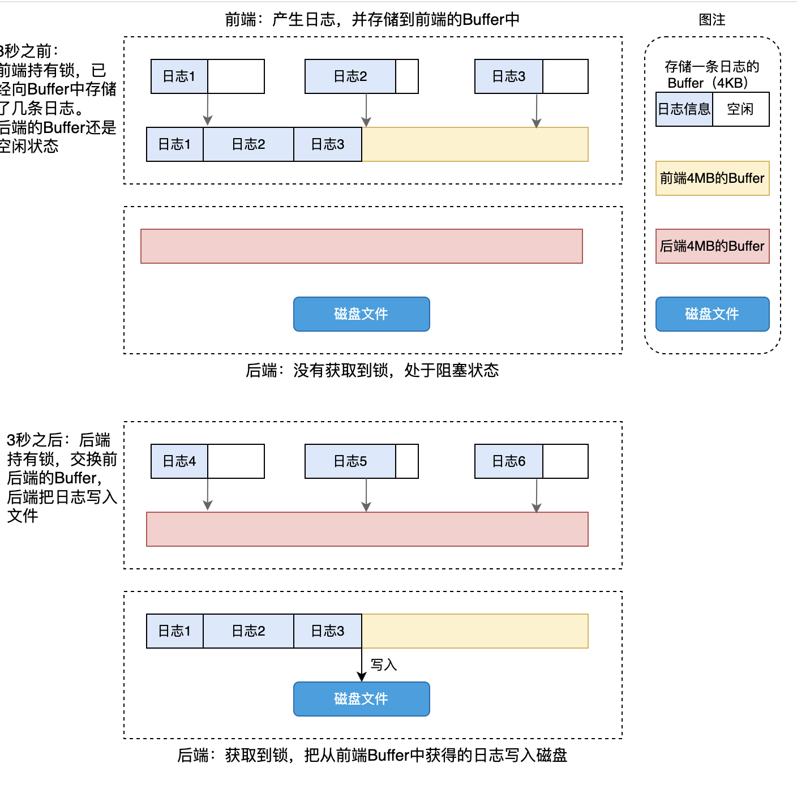
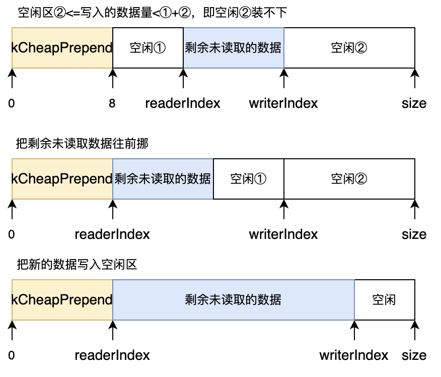
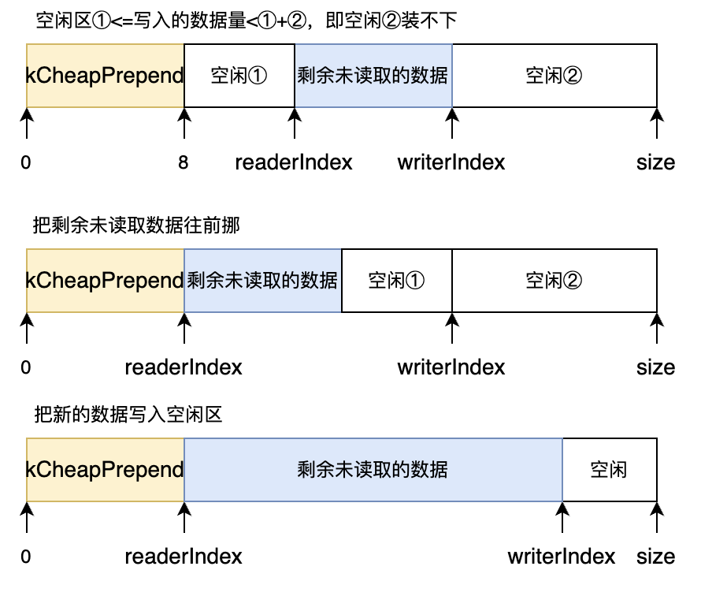
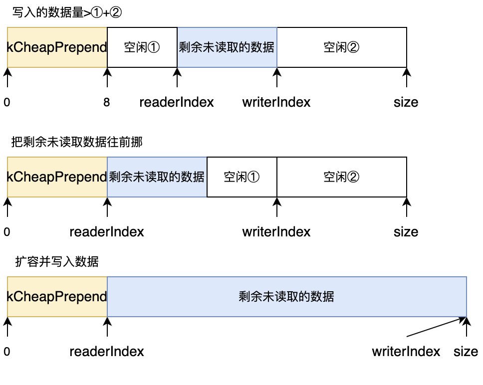
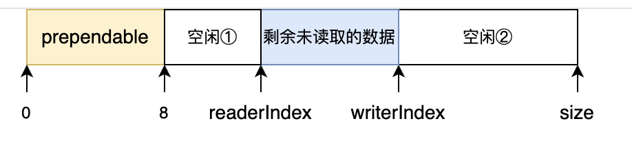
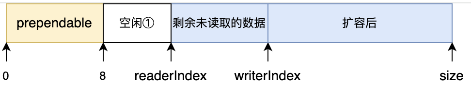
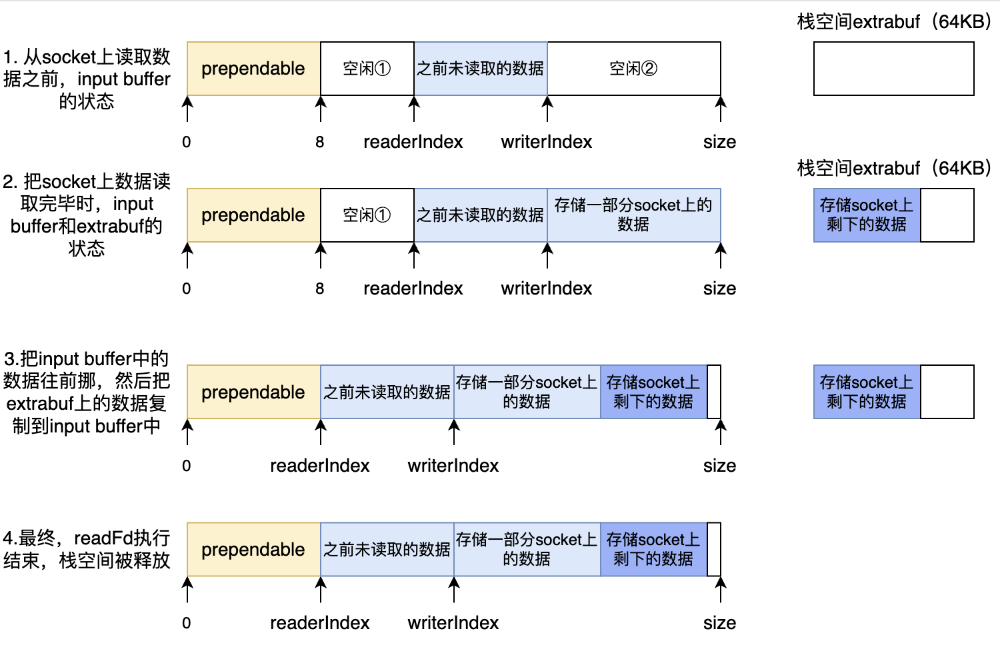
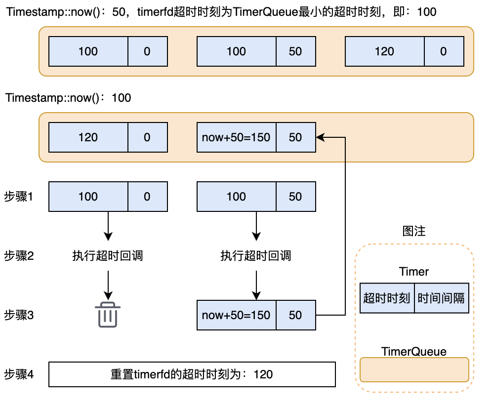

# 6、补充工具类

这里也算是项目的细节，主要是涉及到三个工具类的应用。

## 日志系统

muduo的日志库分采用前后端分离。产生日志的线程都可以称作前端。有一个线程专门负责把前端的日志写入文件，这个线程就称为后端。

**muduo日志库采用双缓冲技术**，所谓双缓冲技术就是前后端各有一个（其实是各有两个）大小为4MB的Buffer，之所以各有一个Buffer，是为了当前端Buffer写满了之后，后端空闲的Buffer能够立刻和前端的Buffer互换，互换完成后就可以释放锁，让前端继续向互换后的Buffer中写入日志，而不必等待后端把日志全部写入文件后再释放锁，大大减小了锁的粒度，这也是muduo异步日志高效的关键原因之一。（详细请看陈硕的书P114，5.3节）

:::tips
需要说明的是：

* muduo前后端各有两个大小为4MB的Buffer，下图为了方面明白异步日志的思想，简化为前后端各自只有一个Buffer
* 这里的Buffer不是Buffer.h中定义的Buffer，而是FixedBuffer.h中定义的，可以理解为一个有4MB
* 大小的字符数组

:::

现在的关键是，前后端的Buffer什么时候互换呢？

* 第一种情况：前端Buffer写满了，就会唤醒后台线程互换Buffer，并把Buffer中的日志写入文件
* 第二种情况：**为了及时把前端Buffer中的日志写入文件，日志库也会每3秒执行一次交换Buffer的操作**。(面试官可能会问你为什么要3秒交换一次Buffer)

下图就以第二种情况为例，展示日志库双缓冲原理。



在0~3秒之间，当前端的线程调用了`LOG_INFO << 日志信息;`，会开辟一个4KB大小的空间，用于存储“日志信息”，当该语句执行结束时，就已经把日志信息都存储到前端的Buffer（黄色Buffer）中，同时析构自己刚开辟的4KB的空间。

在3秒之后，后端线程被唤醒，为了让前端阻塞时间更短，后端把自己的红色Buffer和前端的黄色Buffer互换，然后就可以释放锁，这样前端又能及时的向红色Buffer中写入新的日志信息。后端线程也可以把来自前端的黄色Buffer中的数据写入文件。

### 异步日志流程

异步日志前端产生日志和同步是一致的，下面主要说明异步情况下，`LogStream::buffer_`中的数据是怎么输出到指定位置的。由于异步日志不是默认的方式，需要自行开启，下面就从开启异步日志开始讲解。

### 把日志写入缓冲区

经过同步日志分析，我们直到`LOG_INFO << data`执行完成时，就会调用`asyncOutput`，接下来我们看一下日志信息是怎么写到用户自己定义的缓冲区的（即`g_asyncLog->append(msg, len);`做了什么事）：\
`AsyncLogging::append`函数基本原理是：先将日志信息存储到用户自己开辟的大缓冲区，当缓冲区写满后，通知后台线程把缓冲区的数据写入文件。`apend`代码如下：注意`currentBuffer_`有4M大小，之所以很大，是为了多积累一些日志信息，然后一并交给后端写入文件，避免频繁通知后台写文件。另外，`currentBuffer_->append()`是单纯的把日志信息写入`currentBuffer_`中，而不是像`LogFile`的`apend()`是将数据写入文件中。

```cpp
// 前端如果开启异步日志的话，就会调用这个，把日志信息写入currentBuffer_中
void AsyncLogging::append(const char* logline, int len)
{
    // apend会在多个线程中调用，也就是多个线程会同时像currentBuffer_中写数据，因此要加锁
    std::lock_guard<std::mutex> lock(mutex_);
    // 缓冲区剩余空间足够则直接写入
    if (currentBuffer_->avail() > len)
    {
        currentBuffer_->append(logline, len);
    }
    else
    {
        // 当前缓冲区空间不够，将新信息写入备用缓冲区
        // 将写满的currentBuffer_装入vector中，即buffers_中，注意currentBuffer_是独占指针，
        // move后自己就指向了nullptr
        buffers_.push_back(std::move(currentBuffer_));
        // nextBuffer_不空，说明nextBuffer_指向的内存还没有被currentBuffer_抢走，也就是
        // nextBuffer_还没开始使用
        if (nextBuffer_) 
        {
            // 把nextBuffer_指向的内存区域交给currentBuffer_，nextBuffer_也被置空
            currentBuffer_ = std::move(nextBuffer_);
        } 
        else 
        {
            // 备用缓冲区也不够时，重新分配缓冲区，这种情况很少见
            currentBuffer_.reset(new Buffer);
        }
        currentBuffer_->append(logline, len);
        // 唤醒写入磁盘得后端线程
        cond_.notify_one();
    }
}
```

## Buffer缓冲区

Buffer内部是个std::vector，前8个字节预留着用于记录数据长度，readIndex指向可读取数据的初始位置，writerIndex指向空闲区的起始位置。下图展示了Buffer初始状态、写入部分数据和读取部分数据的情况。



在上图的基础上，如果接下来要继续写入大于"size减writerIndex"的数据怎么办？（见Buffer::makeSpace函数）

1. 如果要写入的数据只比"空闲区②"大，但是比“①+②”小，此时可以把未读取的数据往前挪，剩余的控件就足够写下要写的数据了。



2. 如果要写入的数据大于“①+②”，则对Buffer进行扩容，扩容至刚好可以容纳需要写入的数据。

在代码中都会先将剩余未读取的的数据移到前面，空闲1和2的空间连续在一起后进行扩容。



### 把socket上的数据写入Input Buffer

当socket上有数据可读时，会调用`TcpConnection::handleRead`函数，在该函数中，inputBuffer\_会调用`Buffer::readFd`函数，把socket上的数据写入inputBuffer\_中，核心代码如下：

```cpp
void TcpConnection::handleRead(Timestamp receiveTime)
{
    ssize_t n = inputBuffer_.readFd(channel_->fd(), &savedErrno);
    if (n > 0)                      // 从fd读到了数据，并且放在了inputBuffer_上
    {
        // 已建立连接的用户有可读事件发生了 调用用户传入的回调操作onMessage shared_from_this就是获取了TcpConnection的智能指针
        messageCallback_(shared_from_this(), &inputBuffer_, receiveTime);
    }
}

ssize_t Buffer::readFd(int fd, int *saveErrno)
{
    // 栈额外空间，用于从套接字往出读时，当buffer_暂时不够用时暂存数据，待buffer_重新分配足够空间后，在把数据交换给buffer_。
    char extrabuf[65536] = {0};                     // 栈上内存空间 65536/1024 = 64KB

    struct iovec vec[2];                            // 使用iovec指向两个缓冲区
    const size_t writable = writableBytes();        // 可写缓冲区大小

    // 第一块缓冲区，指向可写空间
    vec[0].iov_base = begin() + writerIndex_;       // 当我们用readv从socket缓冲区读数据，首先会先填满这个vec[0], 也就是我们的Buffer缓冲区
    vec[0].iov_len = writable;
    // 第二块缓冲区，指向栈空间
    vec[1].iov_base = extrabuf;                     // 第二块缓冲区，如果Buffer缓冲区都填满了，那就填到我们临时创建的栈空间
    vec[1].iov_len = sizeof(extrabuf);

    // 如果Buffer缓冲区大小比extrabuf(64k)还小，那就Buffer和extrabuf都用上
    // 如果Buffer缓冲区大小比64k还大或等于，那么就只用Buffer。
    const int iovcnt = (writable < sizeof(extrabuf)) ? 2 : 1;
    const ssize_t n = ::readv(fd, vec, iovcnt);     // Buffer存不下，剩下的存入暂时存入到extrabuf中

    if (n < 0)
    {
        *saveErrno = errno;
    }
    else if (n <= writable)                         // Buffer的可写缓冲区已经够存储读出来的数据了
    {
        writerIndex_ += n;
    }
    else                                            // Buffer存不下，对Buffer扩容，然后把extrabuf中暂存的数据拷贝（追加）到Buffer
    {
        writerIndex_ = buffer_.size();
        append(extrabuf, n - writable);             // 根据情况对buffer_扩容 并将extrabuf存储的另一部分数据追加至buffer_
    }
    return n;

}
```

`Buffer::readFd`函数的功能就是把socket上的数据写入input buffer，**为了能够尽可能把socket上的数据都读取出来，同时节约一点内存空间，muduo借用了栈上的空间来达到这一目的**。

具体如下：

**没有栈空间，是怎么导致空间浪费的？**\
需要指出的是`writableBytes()`函数在计算input buffer可写空间大小时，只计算了从空闲块②的大小，没有把空闲块①计算进来。所以，如果没有栈上的空间，并且通过`writableBytes()`函数来指明input buffer空闲大小，那么从socket上读取的数据大于空闲块②的大小时，就需要扩容input buffer，就变成了下面扩容后的图，显然，空闲块①还没有利用，这就是直接扩容导致了空间的浪费。





:::tips
个人认为，其实也没必要用栈空间，只需要修改writableBytes()，让其返回的是空闲块①和②的大小即可，只不过改了writableBytes()，其他调用writableBytes()的函数，比如Buffer::readFd，就变得复杂了。

:::

**有栈空间时，是怎么减少空间浪费的？**

:::tips
见Buffer::apend()函数，apend函数会调用Buffer::makeSpace函数，makeSpace会根据空闲区域的大小和要写入数据的大小，来判断是否需要扩容

:::

栈空间能够减少空间的浪费，只存在于这种情况：要写入input buffer的数据比"空闲区②"大，但是比“①+②”小。如果要写入的数据大于“①+②”，即使使用了栈空间，最终都是避免不了要扩容input buffer，所以和不用栈空间没什么区别。下面就说明：要写入的数据比"空闲区②"大，但是比“①+②”小时，是怎么减少内存浪费的。



从上图可见，和没有栈空间的情况相比，用栈上的空间可以在“要写入的数据只比"空闲区②"大，但是比“①+②”小”的情况下，避免input buffer扩容。

### 把用户数据通过output buffer发送给对方

以EchoServer为例，如下代码所示，当收到客户端发送过来的信息后，我们要回复客户端，即在EchoServer::onMessage函数中调用TcpConnection::send函数把消息发送给客户端，接下来就看下TcpConnection::send函数是怎么通过output buffer发送给对方的。

```cpp
// 可读写事件回调
void EchoServer::onMessage(const TcpConnectionPtr &conn, Buffer *buf, Timestamp time)
{
    // 把客户端发送的数据取出来
    std::string msg = buf->retrieveAllAsString();
    conn->send(msg);
}

void TcpConnection::send(const std::string &msg)   
{
    ...省略代码
    // 如果连接是已经建立的，就把buffer中的数据取出来发送出去
    sendInLoop(msg.c_str(), msg.size());
    ...省略代码
}

void TcpConnection::sendInLoop(const void *data, size_t len)
{
    ...省略代码
    // 把要发送的数据写入outputBuffer_
    outputBuffer_.append((char *)data, len);
    // 如果没有向Epoll注册可写事件，则注册可写事件
    if (!channel_->isWriting())
    {
        channel_->enableWriting(); 
    }
    ...省略代码
}
```

从上面代码可见，TcpConnection::send函数并没有把数据发送给对方，只是把要发送的数据写入了output buffer，并且告知Epoll关注当前连接的可写事件，那什么时候发送呢？\
由于现在Epoll现在已经关注该连接的可写事件，当该链接的TCP发送缓冲区空闲时，Epoll就会触发该连接的可写事件，也就是会调用TcpConnection::handleWrite函数，该函数核心代码如下：

```cpp
void TcpConnection::handleWrite()
{
    if (channel_->isWriting())  // 如果该连接关注了可写事件
    {
        int savedErrno = 0;
        // 把outputBuffer_中的数据发送给对方
        ssize_t n = outputBuffer_.writeFd(channel_->fd(), &savedErrno);
        if (n > 0)   // 如果发送了部分数据
        {
            // 把outputBuffer_的readerIndex往前移动n个字节，
            // 因为outputBuffer_刚已经发送出去了n字节
            outputBuffer_.retrieve(n);  // readerIndex往前移动n个字节        
            if (outputBuffer_.readableBytes() == 0)
            {
                //outputBuffer_中的数据全部发送完毕后注销写事件，
                // 以免epoll频繁触发可写事件，导致效力低下
                channel_->disableWriting();     
            }
        }
    }
}
```

***

## 定时器思路

要实现定时器，只需要timerfd\_create函数创建timerfd后，在epoll中关注timerfd的可读事件，然后通过timerfd\_settime函数为timerfd指定超时时刻和超时间隔，就可以在内核启动一个定时器，当定时器到期后，epoll就会检测到timerfd可读，此时就会处理timerfd上的可读事件，即调用`TimerQueue::handleRead`函数。

从上述过程也可以看出，一个timerfd对应一个定时器，那多个定时器需要多个timerfd吗？**muduo用了一个比较聪明做法，用一个timerfd就可以实现多个定时器的效果，其核心思想是：让timerfd的超时时刻总是设置为TimerQueue中最小的Timer的超时时刻**，如下图所示：



```cpp
void TimerQueue::addTimer(TimerCallback cb,Timestamp when, double interval)
{
    Timer *timer = new Timer(std::move(cb), when, interval);
    loop_->runInLoop(std::bind(&TimerQueue::addTimerInLoop, this, timer));
}

void TimerQueue::addTimerInLoop(Timer* timer)
{
    // 将timer添加到TimerList（std::set<Entry>）时，判断其超时时刻是否是最早的
    bool eraliestChanged = insert(timer);

    // 如果新添加的timer的超时时刻确实是最早的，就需要重置timerfd_超时时刻
    if (eraliestChanged)
    {
        resetTimerfd(timerfd_, timer->expiration());
    }
}
```

当timerfd超时时（即此时时刻达到100时）timerfd可读，其可读事件会调用TimerQueue::handleRead函数，该函数需要经过如下4个步骤来完成定时器的更新：

* 步骤1：从TimerQueue中取出超时的Timer（实现函数为`TimerQueue::getExpired`）。当前时刻为100，只要TimerQueue中Timer的超时时刻小于或者等于100，就认为超时，需要从TimerQueue中取出超时的Timer，此时TimerQueue中只剩下一个Timer，即超时时刻为120的Timer。
* 步骤2：遍历超时的Timer，分别执行该Timer保存的回调函数（该回调函数其实保存的就是EchoServer::onTimer函数）。
* 步骤3：重置超时Timer（实现函数为`TimerQueue::reset`）。从TimerQueue中取出的两个Timer中，第一个Timer是一次性定时器，直接删除即可，第二个Timer是重复定时器，但是TimerQueue中此时没有这个Timer了，因此，我们需要修改一下该Timer的超时时刻，即设置该Timer的超时时刻为"当前时刻100"+"时间间隔50"=150，然后把它再次添加到TimerQueue中。此时TimerQueue中已经有了两个Timer，一个超时时刻是120，一个是刚添加的超时时刻是150。
* 步骤4：重新设置timerfd的超时时刻（实现函数为TimerQueue.cc的resetTimerfd函数）。前面说过，TimerQueue是个set，其内部是红黑树，会自动排序，此时，可以通过timerfd\_settime函数重新设置timerfd的超时时刻为TimerQueue中最小的Timer，即timerfd下次的超时时刻为120。

TimerQueue::handleRead函数实现如下：

```cpp
void TimerQueue::handleRead()
{
    Timestamp now = Timestamp::now();
    readTimerfd(timerfd_);

    // 步骤1：获取超时的定时器并挨个调用定时器的回调函数
    std::vector<Entry> expired = getExpired(now);
    callingExpiredTimers_ = true;
    for (const Entry& it : expired)
    {
        // 步骤2：执行该定时器超时后要执行的回调函数
        it.second->run();   
    }
    callingExpiredTimers_ = false;

    // 步骤3，4：这些已经到期的定时器中，有些定时器是可重复的，
    // 有些是一次性的需要销毁的，因此重置这些定时器
    reset(expired, now);
}
```

TimerQueue暴露出来的就只有一个方法：addTimer。TimerQueue已经帮我们都封装好了，只需要我们调用addTimer就能实现定时功能。

现在EventLoop对TimerQueue::addTimer函数进行了进一步封装，实现了三个功能不同的定时器：runAt：在某时刻触发（一次性定时器）；runAfer：多久后触发（一次性定时器）；runEvery：每隔多久触发一次（重复定时器）。

```cpp
void EventLoop::runAt(Timestamp time, Functor&& cb) {
    timerQueue_->addTimer(std::move(cb), time, 0.0);
}

void EventLoop::runAfter(double delay, Functor&& cb) {
    Timestamp time(addTime(Timestamp::now(), delay)); 
    runAt(time, std::move(cb));
}

void EventLoop::runEvery(double interval, Functor&& cb) {
    Timestamp timestamp(addTime(Timestamp::now(), interval)); 
    timerQueue_->addTimer(std::move(cb), timestamp, interval);
```

注意：本项目中省略了可自行补充Timer类


> 更新: 2025-01-09 17:35:34  
> 原文: <https://www.yuque.com/chengxuyuancarl/gixnqn/hf9ftffwy9yhwrt4>