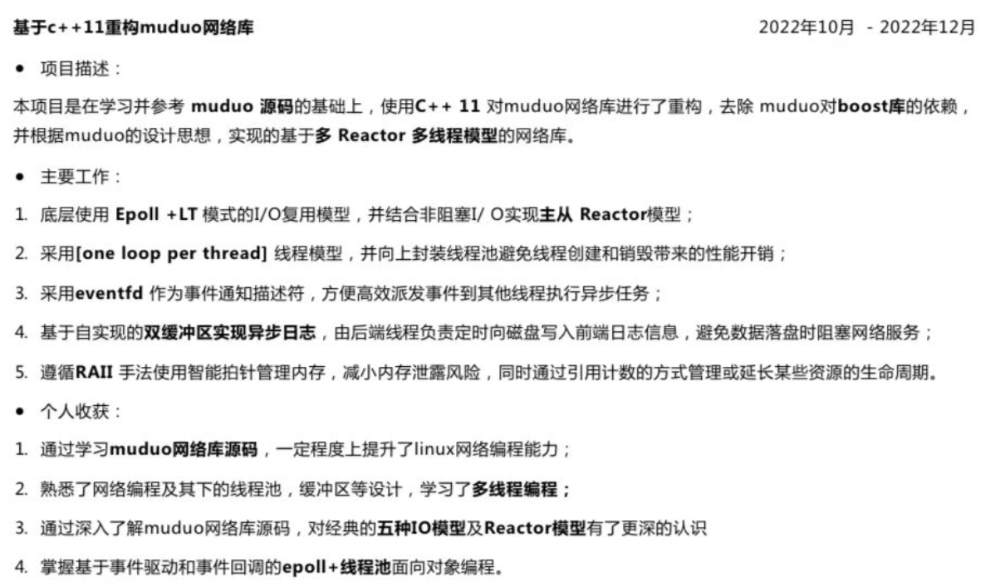
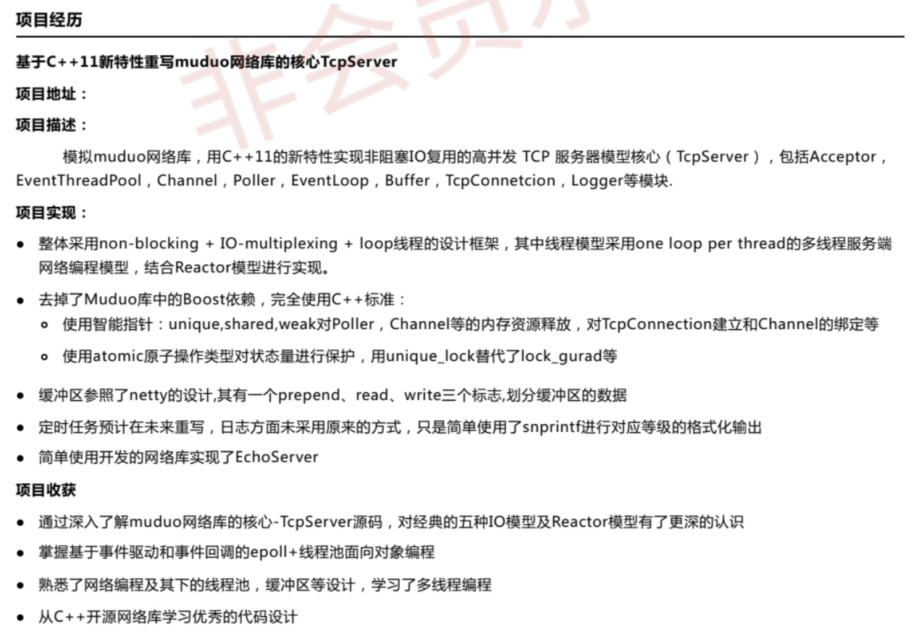
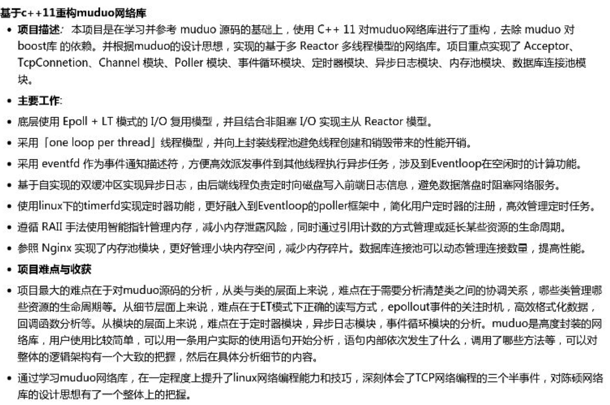

# 8、简历写法&面试技巧

本人24届秋招，拿到了几个互联网后端的offer，目前入职腾讯ieg在提前实习，和各位录友大佬们分享一下自己简历的写法，我个人也是听卡哥的建议来写的，所以基础简历应该都差不多，我主要说一说简历中需要注意的点和面试中的一些心得体会。

## 本项目简历写法

## 通用简历写法
1、 简历上所写的内容一定要熟悉，不是非常熟悉的可以不写，或者作为引申要是面试官问到了就展开说一说。

2、 不要所有都写上去，应该写一些概括的东西，详细的东西可以面试的时候聊；

同时可以设置一些可能会问到的点，这样面试更容易把握方向，知道可能会被问到的点；

3、 教育背景学校如果不太好，可以稍微往后写，最上面的应该是简历上面的亮点地方。

4、 如果有实习，可以写实习的主要内容，但不要大篇幅写实习的很细节的点，可以等面试官问你，你再解释；

如果没有实习，那么就应该在项目上多花点时间，起码在面试的时候有感兴趣，可以聊的点；

5、 项目我感觉是很重要的一环，阿里和美团等等都很看重项目，建议一个轮子鸡架项目，一个业务项目，这样可以由面试官自己挑感兴趣的地方来问；

6、 个人技能方面注意措词要得当，熟悉了解掌握等词要精确用，比如c++学的还算不错，不太建议用熟练掌握(其他语言、中间件等同理)；

7、 像一些无关紧要的奖项其实可以不写，写上反而减分，代表你没有含金量高的；

像英语四级也可以不写，可以写六级(其他奖项同理)；

8、 没有必须一页的说法，比如有三段实习，两个项目的，写一页可能有点费力，也可以两页，甚至一页半；

所有的把控标准都是简历上的内容只要有效即可，别出现废话和啰嗦的话就行了。

## 面试技巧
面试的话，首先就是不要紧张，把每一次面试都当作一次对话，结果不就是两种：过 和 不过。

面试过程中面对面试官问的一个问题，不要就简单的把这个问题的答案机械式的将八股重复一遍就行了，**你可以把这个点相关的所有知识点都从头到尾讲一遍**。

这个时候一般情况下面试官是不会打断你的，而且也可以让他看到你的广度和深度，一个面试下来都按这样回答，基本上十个问题之内就能结束这场面试。

而且面试通过率会非常大，当然前提是你自己真的有东西。

基本面试都是由八股，实习，项目，算法题构成。

其中八股可能由项目拓展而出，场景题可能由实习项目引申而出。

也有可能直接来场景题，比如字节二面的时候，1个多小时就聊了一个场景题，其他什么也没问，让设计一个城市内的滴滴打车系统，当然这种情况也比较少，但常见的场景题也可以看看思路。

分开来说这几点：

### 八股
八股这个其实还是得勤看，先把星球里的[代码随想录知识星球最强八股文（第五版）](https://mp.weixin.qq.com/s/11-X0uJYwohnLiOWK3ugSg)扫一遍，然后可以深入看一下，可能面试会深入聊，直到你答不上来为止；

[代码随想录八股文-速记版](https://mp.weixin.qq.com/s/LTJzDnBRa81d1pLpwcWZcw) 可以用来面前突击一下，效果很好。

腾讯很注重c++、计算机网络、操作系统的考察；

字节注重一面感觉更注重你自己技术展那个语言的广度考察(不好把控会问到什么)；

尽量多说一点，**比如问到哪个八股了，你把你知道的和这个相关的都说一说**，这样的好处 一个是让面试官知道你了解的很深入，还有就是更能把握面试的流程让你在主导，可能没问几个八股时间就差不多了；

**而不是每个只说几句话，这样既增大了问到不会的概率**，而且还让面试官感觉你每个都知道的不太深入。

我个人感觉八股遇到不会的很正常，不会太影响面试的结果，前提是常规的得答出来，很偏的不会其实可以理解，不必太担心。

### 算法
算法可以说是很重要的一环，很多时候都有一票否决权，除非哪个面试官比较好 你要是写不出来会给你换个题继续试试。

我感觉这个只能是多写题，卡哥整理的刷题和力扣的hot100要多刷几遍，一般会涵盖面试中90%的题，其他10%也基本都是稍微的改编。

建议在写之前有不太清楚的点一定和面试官沟通清楚再写，要不然都写完了不符合要求。

那一般不会又等你再写一遍，很影响结果；

同时在写完之后和面试官大致讲讲代码的关键实现的点，帮助他能快速懂你的代码。

### 实习
这个其实大家别过于担心，有的同学说实习没有接触过太核心的项目，这很正常放松心态，把自己所做过的好好总结包装一下就行了。

能有实习已经领先了很多人了，一定心态要好(心态好了运气也会好 亲身经历)。

介绍实习的时候一般从实习工作的主要业务，自己负责的点，挑几个完成的很不错的可以展开讲，比如从业务背景，功能需求，方案评审的技术选型，实现细节，预期结果等等详细说一说。

我在面试的时候感觉实习还是问到的挺多的，会让你在其中选一个你自己写的比较好的来展开讲讲，还要能解释为什么这么做，选这个存储选型原因是什么等等。

对于没有实习的同学，也不要过分焦虑，因为暑期实习目前难度还是很大的，**大多数人其实没有一段拿得出手的实习**。

### 项目
项目可以说是每个人都要有的，不管是自己独立开发的，还是公司的，实验室的都可以，主要是自己要做的有特色，比别人的有优势

(我秋招的时候，感觉在项目上有点吃亏，很多时候问我项目的比较少，大多都在问实习经历)。

对于烂大街的项目，其实没有说不能做，因为项目就是想看你对一个工程的整体掌握和考虑情况。

就算是烂大街的项目，只要你对他掌握的很好，回答的很深入，也有对比别人所没有的点和优势，那完全可以。

当然有新颖的项目更好，可以让面试官更有兴趣提问，但总之，把项目问题回答好 比有一个创新项目 更重要。

项目遵从star法则去回答就好，很多时候面试官会问你项目的细节实现问题，还会根据你刚刚所回答到的点 来继续深入的问你，所以一定要对你所回答的问题负责，不能随心所欲地说，可能会给自己挖坑。

和项目有关的知识点也要复习到，很多时候会根据项目来拓展知识点，而且会让你说项目有什么改进的地方，项目有什么亮点，有什么难点？这些也要提前做好准备。

> 更新: 2025-01-09 17:29:29  
> 原文: <https://www.yuque.com/chengxuyuancarl/gixnqn/xcb415ib6gr6tq5w>