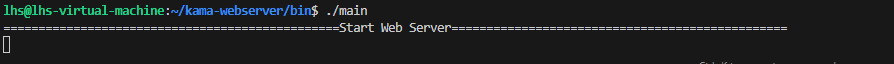
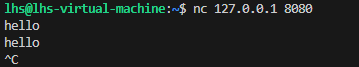
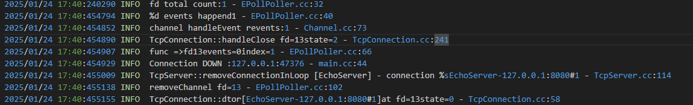

# 1. 开篇

## 为什么还要做WebServer？

<font style="color:rgb(0, 0, 0);">关于C++的项目，大家都会知道 webserver。</font>

<font style="color:rgb(0, 0, 0);">有一个段子：C++选手人均webserver。</font>

<font style="color:rgb(0, 0, 0);">我得给webserver“伸冤”一下，其实</font>**<font style="color:rgb(0, 0, 0);">webserver是一个非常好的学习项目，只是这个项目的形式“烂大街”了</font>**<font style="color:rgb(0, 0, 0);">，它所涉及的知识依然是经典的。</font>

<font style="color:rgb(0, 0, 0);">webserver 所涉及到的知识：</font>

* <font style="color:rgb(1, 1, 1);">C++八股（C/C++语法全覆盖、内存管理等、可以扩展至C++11/17）</font>
* <font style="color:rgb(1, 1, 1);">操作系统（线程、进程、锁、还有大量的 I/O 系统调用及其封装还有 EPOLL 等多路复用机制）</font>
* <font style="color:rgb(1, 1, 1);">网络（网络编程，通信，网络异常的处理）</font>
* <font style="color:rgb(1, 1, 1);">数据库（注册中心的数据库语句、负载均衡等）</font>
* <font style="color:rgb(1, 1, 1);">还有设计模式、缓存设计，日志系统，定时器模块等等</font>

**<font style="color:rgb(0, 0, 0);">大家背的八股，无非就是 网络，操作系统和数据库，还有C++八股，webserver基本都包含了</font>**<font style="color:rgb(0, 0, 0);">，</font>**<font style="color:rgb(0, 0, 0);">webserver是八股结合实战非常好的案例</font>**<font style="color:rgb(0, 0, 0);">！</font>

<font style="color:rgb(0, 0, 0);">可以理解成：</font>**<font style="color:rgb(0, 0, 0);">webserver 就是大家背的八股的实战篇</font>**<font style="color:rgb(0, 0, 0);">。</font>

<font style="color:rgb(0, 0, 0);">webserver 也可以称之为高性能服务器，因为他算是服务器开发，不少录友在简历上不写webserver这个名字，而写的是高性能服务器。</font>

<font style="color:rgb(0, 0, 0);">换一个名字好像高级了一些。。。</font>

**<font style="color:rgb(0, 0, 0);">如果你时间充裕，想系统学习C++，做webserver是非常好的选择</font>**<font style="color:rgb(0, 0, 0);">，你会发现自己背的八股都活学活用了。</font>

\*\*问题：\*\*为什么推荐做WebServer？

1. cpper 能够找到的项⽬（有详细资料的）确实不多

(当然之前代码随想录知识星球没出这么多项目，现在C++项目的选择很多了，知识星球里都有十多个了)

对于科班 or 有充⾜实习经历 or 课题组项⽬丰富的同学来说，⾃然有许多相关的项⽬能够写在简历上。 但是对于项⽬经历贫乏的cpp转码选⼿来说，在⽹上能够找到的项⽬（有较详细资料的），⽆⾮就是⽐较简单的xx 管理系统、五⼦棋等简易游戏、各种⼯具库、烂⼤街的WebServer，然后你就可以发现⾥⾯最⾼⼤上的还是 WebServer（还有个 RPC 框架）。

2. 能够将面试所需的基础知识串联起来

WebServer能够串联绝大部分的面试八股文，语言（C/C++全覆盖，可以拓张c++11/17）+操作系统I/O系统调用及其封装，还有EPOLL等多路复用机制）+计算机网络。

2. 那么每个cpper简历上都有这个项目，那面试官还会问吗？

WebServer 就跟核武器⼀样，你可以不⽤，但不能没有（逃 这个问题其实是看⾯试官的，有的⾯试官就喜欢问⼀些每个候选⼈都有的东⻄，然后根据回答的差异（项⽬的新颖 点、熟悉程度等）去进⾏筛选。有的⾯试官则会挑他⾃⼰所感兴趣的项⽬去提问。

如果⾯试官在你的简历上没有发现特别感兴趣的项⽬时，他会让你⾃⼰挑⼀个你觉得做得最好的项⽬来讲，这个时 候你就可以把 WebServer 拿出来讲了（此时⼤概率会是地狱难度，会挖的很细，因为⾯试官觉得你做的东⻄他都 能看懂）。 但是这样有个问题，要是⼤伙都讲这个项⽬的话，我们肯定得有和别⼈不⼀样的地⽅，这也是⾯试官最看重的地方。

## WebServer所需要的基础知识

### 编程语言

WebServer 对编程语⾔的宽容度较⾼，掌握基本的 C/C++ 语法即可开始做，⽽掌握语⾔的新特性则能够让项⽬更 上⼀层楼。

在做 WebServer 之前，最少需要掌握以下两点（最低配置要求 基本的

* C/C++ 语法，毕竟 linux 的系统调⽤是⽤ C 语⾔写的，保证⾃⼰会⽤和能看懂即可。 C++11 的特性（智能指针、function等），能够掌握 C++14/17 则更好，讲语⾔的新特性⽤到⾃⼰的项⽬中去 也算是⼀个加分项，在项⽬中也可以提⾼⾃⼰对语⾔的掌握程度。
* 简单来说，只要你能在⼒扣上⽤ C++ 刷个⼀两百道题，就完全可以开始做项⽬了。

### 操作系统

* 基本的 Linux 命令，调试 WebServer ⽤，可以参考《⻦哥的 Linux 私房菜》这本书，讲得很全⾯，可以当字 典使⽤。
* 常⻅的系统调⽤，主要就是 read/write AND socket 等函数，参考 CSAPP 来看即可

### 参考书籍

* 游双. Linux⾼性能服务器编程\[M]. 机械⼯业出版社, 2013.
* 陈硕. Linux多线程服务端编程：使⽤muduo C++⽹络库\[M]. 电⼦⼯业出版社, 2013.
* 徐晓鑫. 后台开发:核⼼技术与应⽤实践\[M]. 机械⼯业出版社, 2016.
* Bryant R E, David Richard O H, David Richard O H. Computer systems: a programmer's perspective\[M].
* Upper Saddle River: Prentice Hall, 2003.（《深⼊理解计算机系统》）

## 怎么找到一个靠谱的WebServer

这里放一个原文档的链接方便一下看过原文档或者想知道更多内容的录友：

[这里](https://wx.zsxq.com/group/88511825151142/topic/412241122184228) 。

非常全的webserver，大家可以看这个仓库：<https://github.com/qinguoyi/TinyWebServer>   ，[版本一](https://wx.zsxq.com/group/88511825151142/topic/412241122184228) 是按照这个仓库来讲解的

代码随想录的WebServer项目，kama-webserver：<https://github.com/youngyangyang04/kama-webserver>，**只实现核心功能， 对新人更加友好，但功能上没有 TinyWebserver完善**

## <font style="color:rgb(31, 35, 40);">kama-webserver开发环境</font>

* <font style="color:rgb(31, 35, 40);">linux kernel version5.15.0-113-generic (ubuntu 22.04.6)</font>
* <font style="color:rgb(31, 35, 40);">gcc (Ubuntu 11.4.0-1ubuntu1~22.04) 11.4.0</font>
* <font style="color:rgb(31, 35, 40);">cmake version 3.22</font>

## <font style="color:rgb(31, 35, 40);">目录结构</font>

```plain
kama-webserver/
├── img/ #存放图片
├── include/ #所有头文件.h位置
├── lib/ #存放共享库
|
├── log/ # 日志管理模块
│ ├── log.cc # 日志实现
├── memory/ # 内存管理模块
│ ├── memory.cc # 内存管理实现
├── src/ # 源代码目录
│ ├── main.cpp # 主程序入口
│ ├── ... # 其他源文件 
|
├── CMakeLists.txt # CMake 构建文件
├── LICENSE # 许可证文件
└── README.md # 项目说明文件
```

## <font style="color:rgb(31, 35, 40);">前置工具准备</font>

<font style="color:rgb(31, 35, 40);">安装基本工具</font>

```plain
sudo apt-get update
sudo apt-get install -y wget cmake build-essential unzip git
```

## <font style="color:rgb(31, 35, 40);">编译指令</font>

1. <font style="color:rgb(31, 35, 40);">克隆项目：</font>

```plain
git clone https://github.com/youngyangyang04/kama-webserver.git
   cd kama-webserver
```

1. <font style="color:rgb(31, 35, 40);">创建构建目录并编译：</font>

```plain
mkdir build &&
   cd build &&
   cmake .. &&
   make -j ${nproc}
```

1. <font style="color:rgb(31, 35, 40);">在构建完成后，先进入到bin文件</font>

<font style="color:rgb(31, 35, 40);background-color:rgb(246, 248, 250);">cd bin</font>

1. <font style="color:rgb(31, 35, 40);">启动项目可执行程序main</font>

<font style="color:rgb(31, 35, 40);background-color:rgb(246, 248, 250);">./main </font>

**<font style="color:rgb(31, 35, 40);">注意</font>**<font style="color:rgb(31, 35, 40);">：需要再另外开一个新窗口运行</font><code><font style="color:rgb(31, 35, 40);background-color:rgba(129, 139, 152, 0.12);">nc 127.0.0.1 8080</font></code><font style="color:rgb(31, 35, 40);">启动我们的客户端，来链接main可执行程序启动的web服务器</font>

## <font style="color:rgb(31, 35, 40);">运行结果</font>

<font style="color:rgb(31, 35, 40);">通过运行项目中bin文件下可执行程序main，会出现如下结果：</font>

<font style="color:rgb(31, 35, 40);">其中日志文件将存放bin文件下的</font><font style="color:rgb(31, 35, 40);"> </font><code><font style="color:rgb(31, 35, 40);background-color:rgba(129, 139, 152, 0.12);">logs</font></code><font style="color:rgb(31, 35, 40);"> </font><font style="color:rgb(31, 35, 40);">目录中，每次运行程序时，都会生成新的日志文件，记录程序的运行状态和错误信息。</font>

* <font style="color:rgb(31, 35, 40);">服务器的，运行结果如图</font>




* <font style="color:rgb(31, 35, 40);">客户端的，运行结果如图</font>




**<font style="color:rgb(31, 35, 40);">注意</font>**<font style="color:rgb(31, 35, 40);">：测试的结果还是采用回声服务器测试,注重架构的实现。</font>

***

### <font style="color:rgb(31, 35, 40);">日志核心内容简单分析：</font>

<font style="color:rgb(31, 35, 40);">首先日志结果如图：</font><font style="color:rgb(31, 35, 40);"> </font>


1. <font style="color:rgb(31, 35, 40);">文件描述符统计</font>

<font style="color:rgb(31, 35, 40);background-color:rgb(246, 248, 250);">2025/01/24 17:40:240290 INFO  fd total count:1 - EPollPoller.cc:32</font>

* <font style="color:rgb(31, 35, 40);">说明： EPoll 当前管理的文件描述符总数为 1（可能是一个连接的套接字）。</font>

1. <font style="color:rgb(31, 35, 40);">事件触发</font>

```plain
2025/01/24 17:40:454794 INFO  %d events happend1 - EPollPoller.cc:40
2025/01/24 17:40:454852 INFO  channel handleEvent revents:1 - Channel.cc:73
```

* <font style="color:rgb(31, 35, 40);">一个事件发生（events happend1），可能是客户端套接字的关闭事件。</font>
* <font style="color:rgb(31, 35, 40);">revents:1 表示触发的事件类型为 EPOLLIN，即对端关闭了连接或者发送了数据。</font>

1. <font style="color:rgb(31, 35, 40);">连接关闭处理</font>

```plain
2025/01/24 17:40:454890 INFO  TcpConnection::handleClose fd=13state=2 - TcpConnection.cc:241
2025/01/24 17:40:454907 INFO  func =>fd13events=0index=1 - EPollPoller.cc:66
2025/01/24 17:40:454929 INFO  Connection DOWN :127.0.0.1:47376 - main.cc:44
```

* <font style="color:rgb(31, 35, 40);">TcpConnection::handleClose: 文件描述符 fd=13 的连接关闭，当前状态 state=2（可能表示“已建立连接”状态）。</font>
* <font style="color:rgb(31, 35, 40);">Connection DOWN: 与客户端 127.0.0.1:47376 的连接断开。</font>
* <font style="color:rgb(31, 35, 40);">events=0: 表示该文件描述符不再监听任何事件。</font>

1. <font style="color:rgb(31, 35, 40);">从服务器中移除连接</font>

```plain
2025/01/24 17:40:455009 INFO  TcpServer::removeConnectionInLoop [EchoServer] - connection %sEchoServer-127.0.0.1:8080#1 - TcpServer.cc:114
2025/01/24 17:40:455138 INFO  removeChannel fd=13 - EPollPoller.cc:102
```

* <font style="color:rgb(31, 35, 40);">TcpServer::removeConnectionInLoop: 服务器内部移除与连接 127.0.0.1:47376 的绑定。</font>
* <font style="color:rgb(31, 35, 40);">removeChannel: 从 EPoll 的事件监听列表中移除了文件描述符 fd=13。</font>

1. <font style="color:rgb(31, 35, 40);">资源清理</font>

<font style="color:rgb(31, 35, 40);background-color:rgb(246, 248, 250);">2025/01/24 17:40:455155 INFO  TcpConnection::dtor\[EchoServer-127.0.0.1:8080#1]at fd=13state=0 - TcpConnection.cc:58</font>

* <font style="color:rgb(31, 35, 40);">调用 TcpConnection 析构函数（dtor），释放连接的相关资源。</font>
* <font style="color:rgb(31, 35, 40);">状态 state=0 表示连接已完全关闭，文件描述符 fd=13 被销毁。</font>


> 更新: 2025-11-13 12:48:06  
> 原文: <https://www.yuque.com/chengxuyuancarl/knqvu3/afesysyrdx9799py>