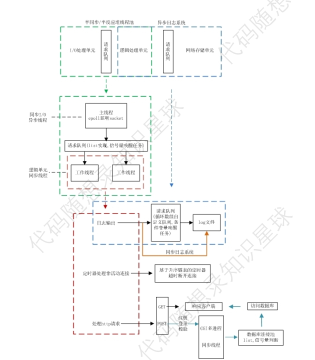
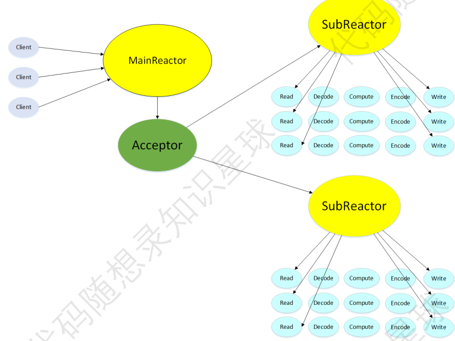
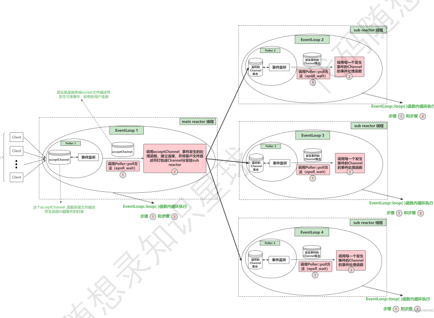
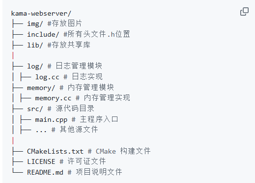

# 2. 拿到源代码不要着急写

# 框架梳理
在进行一个大的项目我们首先要掌握的是项目的梳理框架，就是项目分什么模块组成的，各个模块的功能是什么？这些东西都是为了写项目的时候做一个铺垫这样就不会像一个无头苍蝇一样不知道从那个模块开始看，开始写。

**问题：** 那么问题来了，我们应该如何进⾏项⽬框架的梳理呢？

⾸先我们需要明确⼀点，WebServer 已经是⼀个⾮常成熟 的项⽬了（oppo的⾯试官还问过我，这个 WebServer 都已经出书了，为什么你们还在做），它的基本项⽬框架⼤ 致相同（reactor和proactor），只能具体功能和⼀些模块的实现略有差别。因此，如果你在做这个项⽬之前已经 看过陈硕的《Linux 多线程服务端编程》这本书的话，你就会发现 GitHub 上的 ⾼并发WebServer 只有 reactor 和 模拟的 proactor 两种框架。  

我这边的建议就是看作者或者去找相关的架构图去看，本项目如图：



**注意：本项目没有做http请求处理，采用了回声服务器测试架构的完善和基本功能健全，保证了WebServer基本架构。**

现在对图片分析项⽬中搭建了⼀个半同步/反应堆线程池，在其中维护了⼀个请求队列，线程池中的主线程 通过 epoll 来监听 socket，并且将请求队列中的任务分配给线程池中的⼯作线程，其中⼯作线程能够处理的任务分 为⽇志输出、定时器处理⾮活动连接以及处理 HTTP 请求三种。  

**底层网络模块的框架：**



 这个框架图就更加简洁明了，在 WebServer 中，许多 client 在 MainReactor 中得到了连接请求的响应，并与 WebServer 建⽴具体的连接。然后通过⼀个叫 Acceptor 的模块，将具体的连接分配给到⼀些叫做 SubReactor 的 模块，在 SubReactor 中对具体的连接进⾏读、编码、计算、解码和写操作（即对 client 请求的响应）。这也是 muduo ⽹络库中所提出的 Multi-Reactor 并发框架，如下图（来源⻅⽔印）。  



如果对底层网络模块有兴趣，一定要去看看[代码随想录知识星球—手写网络库。](https://t.zsxq.com/tJ6UX)

项目框架图：

程序入口，即main函数所在的位置src/main.cc文件

```cpp
#include <string>

#include <TcpServer.h>
#include <Logger.h>
#include <sys/stat.h>
#include <sstream>
#include "AsyncLogging.h"
#include "LFU.h"
#include "memoryPool.h"
// 日志文件滚动大小为1MB (1*1024*1024字节)
static const off_t kRollSize = 1*1024*1024;
class EchoServer
{
public:
    EchoServer(EventLoop *loop, const InetAddress &addr, const std::string &name)
        : server_(loop, addr, name)
        , loop_(loop)
    {
        // 注册回调函数
        server_.setConnectionCallback(
            std::bind(&EchoServer::onConnection, this, std::placeholders::_1));
        
        server_.setMessageCallback(
            std::bind(&EchoServer::onMessage, this, std::placeholders::_1, std::placeholders::_2, std::placeholders::_3));

        // 设置合适的subloop线程数量
        server_.setThreadNum(3);
    }
    void start()
    {
        server_.start();
    }

private:
    // 连接建立或断开的回调函数
    void onConnection(const TcpConnectionPtr &conn)   
    {
        if (conn->connected())
        {
            LOG_INFO<<"Connection UP :"<<conn->peerAddress().toIpPort().c_str();
        }
        else
        {
            LOG_INFO<<"Connection DOWN :"<<conn->peerAddress().toIpPort().c_str();
        }
    }

    // 可读写事件回调
    void onMessage(const TcpConnectionPtr &conn, Buffer *buf, Timestamp time)
    {
        std::string msg = buf->retrieveAllAsString();
        conn->send(msg);
        // conn->shutdown();   // 关闭写端 底层响应EPOLLHUP => 执行closeCallback_
    }
    TcpServer server_;
    EventLoop *loop_;

};
AsyncLogging* g_asyncLog = NULL;
AsyncLogging * getAsyncLog(){
    return g_asyncLog;
}
 void asyncLog(const char* msg, int len)
{
    AsyncLogging* logging = getAsyncLog();
    if (logging)
    {
        logging->append(msg, len);
    }
}
int main(int argc,char *argv[]) {
    //第一步启动日志，双缓冲异步写入磁盘.
    //创建一个文件夹
    const std::string LogDir="logs";
    mkdir(LogDir.c_str(),0755);
    //使用std::stringstream 构建日志文件夹
    std::ostringstream LogfilePath;
    LogfilePath << LogDir << "/" << ::basename(argv[0]); // 完整的日志文件路径
    AsyncLogging log(LogfilePath.str(), kRollSize);
    g_asyncLog = &log;
    Logger::setOutput(asyncLog); // 为Logger设置输出回调, 重新配接输出位置
    log.start(); // 开启日志后端线程
    //第二步启动内存池和LFU缓存
     // 初始化内存池
    memoryPool::HashBucket::initMemoryPool();

    // 初始化缓存
    const int CAPACITY = 5;  
    KamaCache::KLfuCache<int, std::string> lfu(CAPACITY);
    //第三步启动底层网络模块
    EventLoop loop;
    InetAddress addr(8080);
    EchoServer server(&loop, addr, "EchoServer");
    server.start();
 // 主loop开始事件循环  epoll_wait阻塞 等待就绪事件(主loop只注册了监听套接字的fd，所以只会处理新连接事件)
    std::cout << "================================================Start Web Server================================================" << std::endl;
    loop.loop();
    std::cout << "================================================Stop Web Server=================================================" << std::endl;
    //结束日志打野
    log.stop();
}
```

从main.cc中可以看见我们设置了异步日志以及日志的输出的位置，启动了底层网络库，然后采用回声服务器用来处理接收的消息，并直接发送回去。开启了内存池和LFU缓存。


> 更新: 2025-03-27 20:17:46  
> 原文: <https://www.yuque.com/chengxuyuancarl/knqvu3/ud1dvz4xvtq8b68h>