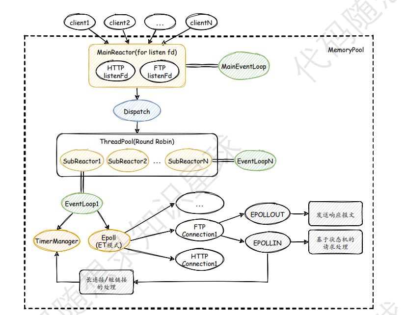
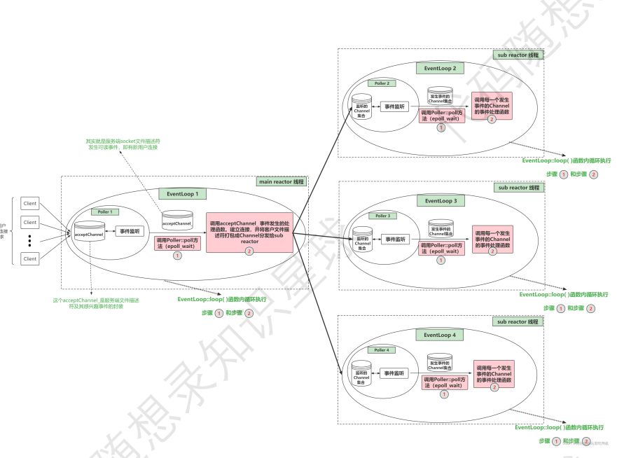
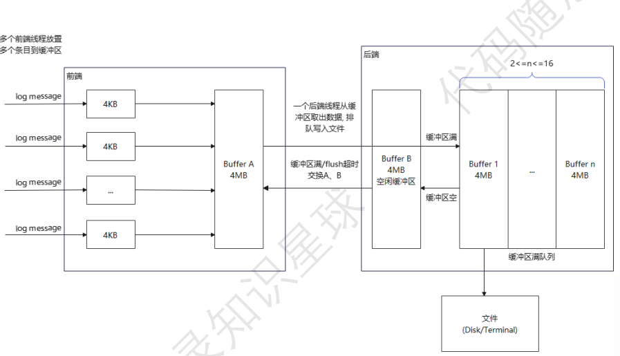
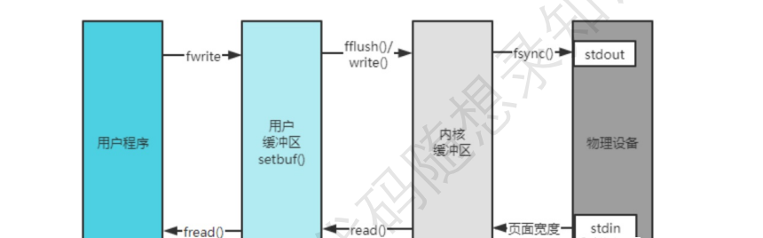
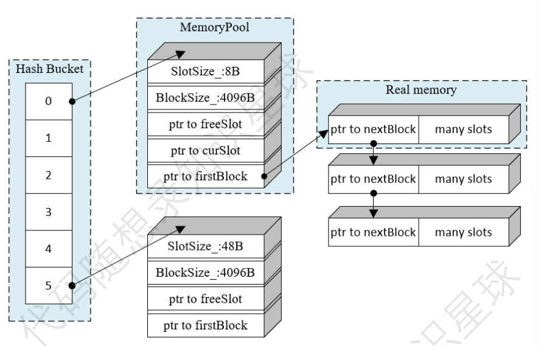
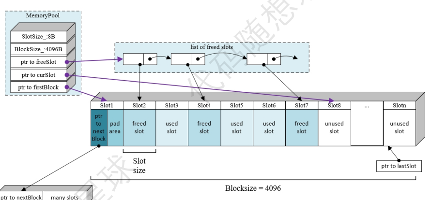
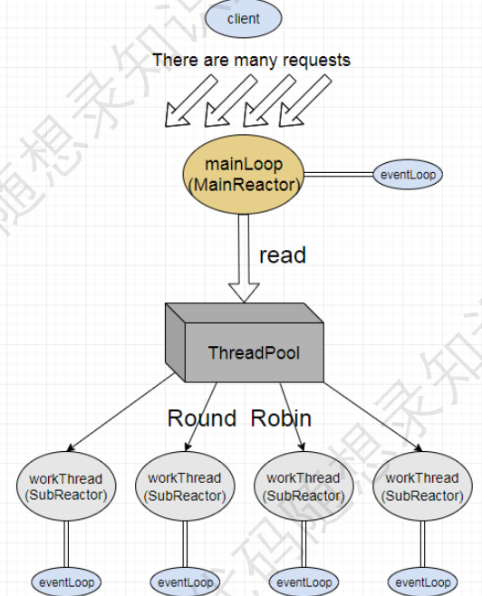
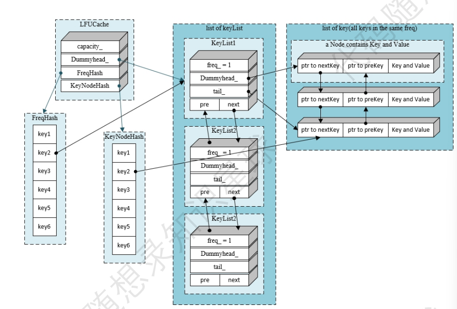

# 3. 终于开始写代码

经过⼀番摸索，我们终于画出⾃⼰的框架图，下⾯我将仿照 muduo 的框架对 WebServer 各个常⻅模块的原理进⾏讲解。



⾸先，许多 client 在访问 WebServer 时，并不是每个 client 都由⼀个服务端的线程/进程进⾏业务处理，这样在⾼ 并发（多个 client 同时访问服务端）的场景中，服务端的响应速度，并且服务端本身可以建⽴的线程/进程数也是 有限的，这样的⽅式也很容易导致服务端的崩溃。 因此，muduo 使⽤⾮阻塞的poll/epoll（IO multiplexing 多路复⽤）轮训监听(Reactor)有⽆ SOCKET 读写IO事 件， 将IO事件的处理回调函数分发到线程池中，实现异步返回结果。在多线程编程模型中采⽤了 "one loop per thread + thread pool" 的形式。⼀个线程中有且仅有⼀个EventLoop（也就是说每⼀个核的线程负责循环监听⼀组 ⽂件描述符的集合），这个线程称之为 IO 线程。如果⻓时间没有事件发⽣，IO线程将处于空闲状态，这时可以利 ⽤IO线程来执⾏⼀些额外的任务（利⽤定时器任务队列来处理超时连接），这就要求⾮阻塞的 poll/epoll 能够在⽆ IO事件但有任务到来时能够被唤醒。

# 并发框架

并发框架这部分还是建议⼤家花时间去看⼀下《Linux多线程服务端编程》的第⼋章—muduo ⽹络库的设计与实 现，⾥⾯对 Reactor 模型的原理和实现都讲得⾮常清晰。

在具体的实现中，最核⼼的部分就是 EventLoop 、 Channel 以及 Poller 三个类，其中 EventLoop 可以看作是对业务线程的封装，⽽ Channel 可以看作是对每 个已经建⽴连接的封装（即 accept(3) 返回的⽂件描述符），三者的关系⻅下图（来源⻅⽔印）。



### EventLoop

#### .h

```cpp
#pragma once

#include <functional>
#include <vector>
#include <atomic>
#include <memory>
#include <mutex>

#include "noncopyable.h"
#include "Timestamp.h"
#include "CurrentThread.h"
#include "TimerQueue.h"
class Channel;
class Poller;

// 事件循环类 主要包含了两个大模块 Channel Poller(epoll的抽象)
class EventLoop : noncopyable
{
public:
    using Functor = std::function<void()>;

    EventLoop();
    ~EventLoop();

    // 开启事件循环
    void loop();
    // 退出事件循环
    void quit();

    Timestamp pollReturnTime() const { return pollRetureTime_; }

    // 在当前loop中执行
    void runInLoop(Functor cb);
    // 把上层注册的回调函数cb放入队列中 唤醒loop所在的线程执行cb
    void queueInLoop(Functor cb);

    // 通过eventfd唤醒loop所在的线程
    void wakeup();

    // EventLoop的方法 => Poller的方法
    void updateChannel(Channel *channel);
    void removeChannel(Channel *channel);
    bool hasChannel(Channel *channel);

    // 判断EventLoop对象是否在自己的线程里
    bool isInLoopThread() const { return threadId_ == CurrentThread::tid(); } // threadId_为EventLoop创建时的线程id CurrentThread::tid()为当前线程id
    /**
     * 定时任务相关函数
     */
    void runAt(Timestamp timestamp, Functor &&cb)
    {
        timerQueue_->addTimer(std::move(cb), timestamp, 0.0);
    }

    void runAfter(double waitTime, Functor &&cb)
    {
        Timestamp time(addTime(Timestamp::now(), waitTime));
        runAt(time, std::move(cb));
    }

    void runEvery(double interval, Functor &&cb)
    {
        Timestamp timestamp(addTime(Timestamp::now(), interval));
        timerQueue_->addTimer(std::move(cb), timestamp, interval);
    }

private:
    void handleRead();        // 给eventfd返回的文件描述符wakeupFd_绑定的事件回调 当wakeup()时 即有事件发生时 调用handleRead()读wakeupFd_的8字节 同时唤醒阻塞的epoll_wait
    void doPendingFunctors(); // 执行上层回调

    using ChannelList = std::vector<Channel *>;

    std::atomic_bool looping_; // 原子操作 底层通过CAS实现
    std::atomic_bool quit_;    // 标识退出loop循环

    const pid_t threadId_; // 记录当前EventLoop是被哪个线程id创建的 即标识了当前EventLoop的所属线程id

    Timestamp pollRetureTime_; // Poller返回发生事件的Channels的时间点
    std::unique_ptr<Poller> poller_;
    std::unique_ptr<TimerQueue> timerQueue_;
    int wakeupFd_; // 作用：当mainLoop获取一个新用户的Channel 需通过轮询算法选择一个subLoop 通过该成员唤醒subLoop处理Channel
    std::unique_ptr<Channel> wakeupChannel_;

    ChannelList activeChannels_; // 返回Poller检测到当前有事件发生的所有Channel列表

    std::atomic_bool callingPendingFunctors_; // 标识当前loop是否有需要执行的回调操作
    std::vector<Functor> pendingFunctors_;    // 存储loop需要执行的所有回调操作
    std::mutex mutex_;                        // 互斥锁 用来保护上面vector容器的线程安全操作
};
```

#### .cc

```cpp
#include <sys/eventfd.h>
#include <unistd.h>
#include <fcntl.h>
#include <errno.h>
#include <memory>

#include <EventLoop.h>
#include <Logger.h>
#include <Channel.h>
#include <Poller.h>

// 防止一个线程创建多个EventLoop
thread_local EventLoop *t_loopInThisThread = nullptr;

// 定义默认的Poller IO复用接口的超时时间
const int kPollTimeMs = 10000; // 10000毫秒 = 10秒钟

/* 创建线程之后主线程和子线程谁先运行是不确定的。
 * 通过一个eventfd在线程之间传递数据的好处是多个线程无需上锁就可以实现同步。
 * eventfd支持的最低内核版本为Linux 2.6.27,在2.6.26及之前的版本也可以使用eventfd，但是flags必须设置为0。
 * 函数原型：
 *     #include <sys/eventfd.h>
 *     int eventfd(unsigned int initval, int flags);
 * 参数说明：
 *      initval,初始化计数器的值。
 *      flags, EFD_NONBLOCK,设置socket为非阻塞。
 *             EFD_CLOEXEC，执行fork的时候，在父进程中的描述符会自动关闭，子进程中的描述符保留。
 * 场景：
 *     eventfd可以用于同一个进程之中的线程之间的通信。
 *     eventfd还可以用于同亲缘关系的进程之间的通信。
 *     eventfd用于不同亲缘关系的进程之间通信的话需要把eventfd放在几个进程共享的共享内存中（没有测试过）。
 */
// 创建wakeupfd 用来notify唤醒subReactor处理新来的channel
int createEventfd()
{
    int evtfd = ::eventfd(0, EFD_NONBLOCK | EFD_CLOEXEC);
    if (evtfd < 0)
    {
        LOG_FATAL<<"eventfd error:%d"<<errno;
    }
    return evtfd;
}

EventLoop::EventLoop()
    : looping_(false)
    , quit_(false)
    , callingPendingFunctors_(false)
    , threadId_(CurrentThread::tid())
    , poller_(Poller::newDefaultPoller(this))
    , wakeupFd_(createEventfd())
    , wakeupChannel_(new Channel(this, wakeupFd_))
{
    LOG_DEBUG<<"EventLoop created"<<this<<"in thread"<<threadId_;
    if (t_loopInThisThread)
    {
        LOG_FATAL<<"Another EventLoop"<<t_loopInThisThread<<"exists in this thread "<<threadId_;
    }
    else
    {
        t_loopInThisThread = this;
    }
    
    wakeupChannel_->setReadCallback(
        std::bind(&EventLoop::handleRead, this)); // 设置wakeupfd的事件类型以及发生事件后的回调操作
    
    wakeupChannel_->enableReading(); // 每一个EventLoop都将监听wakeupChannel_的EPOLL读事件了
}
EventLoop::~EventLoop()
{
    wakeupChannel_->disableAll(); // 给Channel移除所有感兴趣的事件
    wakeupChannel_->remove();     // 把Channel从EventLoop上删除掉
    ::close(wakeupFd_);
    t_loopInThisThread = nullptr;
}

// 开启事件循环
void EventLoop::loop()
{
    looping_ = true;
    quit_ = false;

    LOG_INFO<<"EventLoop start looping";

    while (!quit_)
    {
        activeChannels_.clear();
        pollRetureTime_ = poller_->poll(kPollTimeMs, &activeChannels_);
        for (Channel *channel : activeChannels_)
        {
            // Poller监听哪些channel发生了事件 然后上报给EventLoop 通知channel处理相应的事件
            channel->handleEvent(pollRetureTime_);
        }
        /**
         * 执行当前EventLoop事件循环需要处理的回调操作 对于线程数 >=2 的情况 IO线程 mainloop(mainReactor) 主要工作：
         * accept接收连接 => 将accept返回的connfd打包为Channel => TcpServer::newConnection通过轮询将TcpConnection对象分配给subloop处理
         *
         * mainloop调用queueInLoop将回调加入subloop（该回调需要subloop执行 但subloop还在poller_->poll处阻塞） queueInLoop通过wakeup将subloop唤醒
         **/
        doPendingFunctors();
    }
    LOG_INFO<<"EventLoopstop looping";
    looping_ = false;
}

/**
 * 退出事件循环
 * 1. 如果loop在自己的线程中调用quit成功了 说明当前线程已经执行完毕了loop()函数的poller_->poll并退出
 * 2. 如果不是当前EventLoop所属线程中调用quit退出EventLoop 需要唤醒EventLoop所属线程的epoll_wait
 *
 * 比如在一个subloop(worker)中调用mainloop(IO)的quit时 需要唤醒mainloop(IO)的poller_->poll 让其执行完loop()函数
 *
 * ！！！ 注意： 正常情况下 mainloop负责请求连接 将回调写入subloop中 通过生产者消费者模型即可实现线程安全的队列
 * ！！！       但是muduo通过wakeup()机制 使用eventfd创建的wakeupFd_ notify 使得mainloop和subloop之间能够进行通信
 **/
void EventLoop::quit()
{
    quit_ = true;

    if (!isInLoopThread())
    {
        wakeup();
    }
}

// 在当前loop中执行cb
void EventLoop::runInLoop(Functor cb)
{
    if (isInLoopThread()) // 当前EventLoop中执行回调
    {
        cb();
    }
    else // 在非当前EventLoop线程中执行cb，就需要唤醒EventLoop所在线程执行cb
    {
        queueInLoop(cb);
    }
}

// 把cb放入队列中 唤醒loop所在的线程执行cb
void EventLoop::queueInLoop(Functor cb)
{
    {
        std::unique_lock<std::mutex> lock(mutex_);
        pendingFunctors_.emplace_back(cb);
    }

    /**
     * || callingPendingFunctors的意思是 当前loop正在执行回调中 但是loop的pendingFunctors_中又加入了新的回调 需要通过wakeup写事件
     * 唤醒相应的需要执行上面回调操作的loop的线程 让loop()下一次poller_->poll()不再阻塞（阻塞的话会延迟前一次新加入的回调的执行），然后
     * 继续执行pendingFunctors_中的回调函数
     **/
    if (!isInLoopThread() || callingPendingFunctors_)
    {
        wakeup(); // 唤醒loop所在线程
    }
}

void EventLoop::handleRead()
{
    uint64_t one = 1;
    ssize_t n = read(wakeupFd_, &one, sizeof(one));
    if (n != sizeof(one))
    {
        LOG_ERROR<<"EventLoop::handleRead() reads"<<n<<"bytes instead of 8";
    }
}

// 用来唤醒loop所在线程 向wakeupFd_写一个数据 wakeupChannel就发生读事件 当前loop线程就会被唤醒
void EventLoop::wakeup()
{
    uint64_t one = 1;
    ssize_t n = write(wakeupFd_, &one, sizeof(one));
    if (n != sizeof(one))
    {
        LOG_ERROR<<"EventLoop::wakeup() writes"<<n<<"bytes instead of 8";
    }
}

// EventLoop的方法 => Poller的方法
void EventLoop::updateChannel(Channel *channel)
{
    poller_->updateChannel(channel);
}

void EventLoop::removeChannel(Channel *channel)
{
    poller_->removeChannel(channel);
}

bool EventLoop::hasChannel(Channel *channel)
{
    return poller_->hasChannel(channel);
}

void EventLoop::doPendingFunctors()
{
    std::vector<Functor> functors;
    callingPendingFunctors_ = true;

    {
        std::unique_lock<std::mutex> lock(mutex_);
        functors.swap(pendingFunctors_); // 交换的方式减少了锁的临界区范围 提升效率 同时避免了死锁 如果执行functor()在临界区内 且functor()中调用queueInLoop()就会产生死锁
    }

    for (const Functor &functor : functors)
    {
        functor(); // 执行当前loop需要执行的回调操作
    }

    callingPendingFunctors_ = false;
}
```

#### 重要成员函数

从EventLoop的类定义中可以看出，除了一些状态量意外，每个EventLoop持有一个Epoller智能指针 （对 epoll / poll 的封装），⼀个⽤于 EventLoop 之间通信的 Channel ，⾃⼰的线程 id，互斥锁以及装有等待处理函 数的 vector 。很明显， EventLoop 并不直接管理各个连接的 Channel （⽂件描述符的封装），⽽是通过 Poller 来进⾏的。 EventLoop 中最核⼼的函数就是 EventLoop::Loop() 。

```cpp
// 开启事件循环
void EventLoop::loop()
{
    looping_ = true;
    quit_ = false;

    LOG_INFO<<"EventLoop start looping";

    while (!quit_)
    {
        activeChannels_.clear();
        pollRetureTime_ = poller_->poll(kPollTimeMs, &activeChannels_);
        for (Channel *channel : activeChannels_)
        {
            // Poller监听哪些channel发生了事件 然后上报给EventLoop 通知channel处理相应的事件
            channel->handleEvent(pollRetureTime_);
        }
        /**
         * 执行当前EventLoop事件循环需要处理的回调操作 对于线程数 >=2 的情况 IO线程 mainloop(mainReactor) 主要工作：
         * accept接收连接 => 将accept返回的connfd打包为Channel => TcpServer::newConnection通过轮询将TcpConnection对象分配给subloop处理
         *
         * mainloop调用queueInLoop将回调加入subloop（该回调需要subloop执行 但subloop还在poller_->poll处阻塞） queueInLoop通过wakeup将subloop唤醒
         **/
        doPendingFunctors();
    }
    LOG_INFO<<"EventLoopstop looping";
    looping_ = false;
}

```

每个 EventLoop 对象都唯⼀绑定了⼀个线程，这个线程其实就在⼀直执⾏这个函数⾥⾯的 while 循环，这个 while 循环的⼤致逻辑⽐较简单。就是调⽤ Poller::poll() 函数获取事件监听器上的监听结果。接下来在 Loop ⾥⾯就会调⽤监听结果中每⼀个 Channel 的处理函数 HandlerEvent() 。每⼀个 Channel 的处理函数会 根据 Channel 中封装的实际发⽣的事件，执⾏ Channel 中封装的各事件处理函数。（⽐如⼀个 Channel 发⽣ 了可读事件，可写事件，则这个 Channel 的 HandlerEvent() 就会调⽤提前注册在这个 Channel 的可读事件 和可写事件处理函数，⼜⽐如另⼀个 Channel 只发⽣了可读事件，那么 HandlerEvent() 就只会调⽤提前注册 在这个 Channel 中的可读事件处理函数。

### Channel

在 TCP ⽹络编程中，想要通过 IO 多路复⽤（epoll / poll）监听某个⽂件描述符，就需要把这个 fd 和该 fd 感兴趣 的事件通过 epoll\_ctl 注册到 IO 多路复⽤模块上。当 IO 多路复⽤模块监听到该 fd 发⽣了某个事件。事件监听 器返回发⽣事件的 fd 集合（有哪些 fd 发⽣了事件）以及每个 fd 的事件集合（每个 fd 具体发⽣了什么事件）。 Channel 类则封装了⼀个 fd 和这个 fd 感兴趣事件以及 IO 多路复⽤模块监听到的每个 fd 的事件集合。同时 Channel类还提供了设置该 fd 的感兴趣事件，以及将该fd及其感兴趣事件注册到事件监听器或从事件监听器上移 除，以及保存了该 fd 的每种事件对应的处理函数。 每个 Channel 对象只属于⼀个 EventLoop ，即只属于⼀个 IO 线程。只负责⼀个⽂件描述符（fd）的 IO 时间分 发，但不拥有这个 fd。 Channel 把不同的 IO 事件分发为不同的回调，回调⽤ C++11 的特性 function 表示。声 明周期由拥有它的类负责。

#### .h

```cpp
#pragma once

#include <functional>
#include <memory>

#include "noncopyable.h"
#include "Timestamp.h"

class EventLoop;

/**
 * 理清楚 EventLoop、Channel、Poller之间的关系  Reactor模型上对应多路事件分发器
 * Channel理解为通道 封装了sockfd和其感兴趣的event 如EPOLLIN、EPOLLOUT事件 还绑定了poller返回的具体事件
 **/
class Channel : noncopyable
{
public:
    using EventCallback = std::function<void()>; // muduo仍使用typedef
    using ReadEventCallback = std::function<void(Timestamp)>;

    Channel(EventLoop *loop, int fd);
    ~Channel();

    // fd得到Poller通知以后 处理事件 handleEvent在EventLoop::loop()中调用
    void handleEvent(Timestamp receiveTime);

    // 设置回调函数对象
    void setReadCallback(ReadEventCallback cb) { readCallback_ = std::move(cb); }
    void setWriteCallback(EventCallback cb) { writeCallback_ = std::move(cb); }
    void setCloseCallback(EventCallback cb) { closeCallback_ = std::move(cb); }
    void setErrorCallback(EventCallback cb) { errorCallback_ = std::move(cb); }

    // 防止当channel被手动remove掉 channel还在执行回调操作
    void tie(const std::shared_ptr<void> &);

    int fd() const { return fd_; }
    int events() const { return events_; }
    void set_revents(int revt) { revents_ = revt; }

    // 设置fd相应的事件状态 相当于epoll_ctl add delete
    void enableReading() { events_ |= kReadEvent; update(); }
    void disableReading() { events_ &= ~kReadEvent; update(); }
    void enableWriting() { events_ |= kWriteEvent; update(); }
    void disableWriting() { events_ &= ~kWriteEvent; update(); }
    void disableAll() { events_ = kNoneEvent; update(); }

    // 返回fd当前的事件状态
    bool isNoneEvent() const { return events_ == kNoneEvent; }
    bool isWriting() const { return events_ & kWriteEvent; }
    bool isReading() const { return events_ & kReadEvent; }

    int index() { return index_; }
    void set_index(int idx) { index_ = idx; }

    // one loop per thread
    EventLoop *ownerLoop() { return loop_; }
    void remove();
private:

    void update();
    void handleEventWithGuard(Timestamp receiveTime);

    static const int kNoneEvent;
    static const int kReadEvent;
    static const int kWriteEvent;

    EventLoop *loop_; // 事件循环
    const int fd_;    // fd，Poller监听的对象
    int events_;      // 注册fd感兴趣的事件
    int revents_;     // Poller返回的具体发生的事件
    int index_;

    std::weak_ptr<void> tie_;
    bool tied_;

    // 因为channel通道里可获知fd最终发生的具体的事件events，所以它负责调用具体事件的回调操作
    ReadEventCallback readCallback_;
    EventCallback writeCallback_;
    EventCallback closeCallback_;
    EventCallback errorCallback_;
};
```

从 Channel 的类定义中可以看出，每个 Channel 持有⼀个⽂件描述符，正在监听的事件，已经发⽣的事件（由 Poller 返回），以及各个事件（读、写、更新、错误）回调函数的 Function 对象。

#### .cc

```cpp
#include <sys/epoll.h>

#include <Channel.h>
#include <EventLoop.h>
#include <Logger.h>

const int Channel::kNoneEvent = 0; //空事件
const int Channel::kReadEvent = EPOLLIN | EPOLLPRI; //读事件
const int Channel::kWriteEvent = EPOLLOUT; //写事件

// EventLoop: ChannelList Poller
Channel::Channel(EventLoop *loop, int fd)
    : loop_(loop)
    , fd_(fd)
    , events_(0)
    , revents_(0)
    , index_(-1)
    , tied_(false)
{
}

Channel::~Channel()
{
}

// channel的tie方法什么时候调用过?  TcpConnection => channel
/**
 * TcpConnection中注册了Channel对应的回调函数，传入的回调函数均为TcpConnection
 * 对象的成员方法，因此可以说明一点就是：Channel的结束一定晚于TcpConnection对象！
 * 此处用tie去解决TcpConnection和Channel的生命周期时长问题，从而保证了Channel对象能够在
 * TcpConnection销毁前销毁。
 **/
void Channel::tie(const std::shared_ptr<void> &obj)
{
    tie_ = obj;
    tied_ = true;
}
//update 和remove => EpollPoller 更新channel在poller中的状态
/**
 * 当改变channel所表示的fd的events事件后，update负责再poller里面更改fd相应的事件epoll_ctl
 **/
void Channel::update()
{
    // 通过channel所属的eventloop，调用poller的相应方法，注册fd的events事件
    loop_->updateChannel(this);
}

// 在channel所属的EventLoop中把当前的channel删除掉
void Channel::remove()
{
    loop_->removeChannel(this);
}

void Channel::handleEvent(Timestamp receiveTime)
{
    if (tied_)
    {
        std::shared_ptr<void> guard = tie_.lock();
        if (guard)
        {
            handleEventWithGuard(receiveTime);
        }
        // 如果提升失败了 就不做任何处理 说明Channel的TcpConnection对象已经不存在了
    }
    else
    {
        handleEventWithGuard(receiveTime);
    }
}

void Channel::handleEventWithGuard(Timestamp receiveTime)
{
    LOG_INFO<<"channel handleEvent revents:"<<revents_;
    // 关闭
    if ((revents_ & EPOLLHUP) && !(revents_ & EPOLLIN)) // 当TcpConnection对应Channel 通过shutdown 关闭写端 epoll触发EPOLLHUP
    {
        if (closeCallback_)
        {
            closeCallback_();
        }
    }
    // 错误
    if (revents_ & EPOLLERR)
    {
        if (errorCallback_)
        {
            errorCallback_();
        }
    }
    // 读
    if (revents_ & (EPOLLIN | EPOLLPRI))
    {
        if (readCallback_)
        {
            readCallback_(receiveTime);
        }
    }
    // 写
    if (revents_ & EPOLLOUT)
    {
        if (writeCallback_)
        {
            writeCallback_();
        }
    }
}
```

#### 重要成员函数

总的来说， Channel 就是对 fd 事件的封装，包括注册它的事件以及回调。 EventLoop 通过调⽤ Channel::handleEvent() 来执⾏ Channel 的读写事件。 Channel::handleEvent() 的实现也⾮常简单，就 是⽐较已经发⽣的事件（由 EPoller 返回），来调⽤对应的回调函数（读、写、错误）。

```cpp
void Channel::handleEvent(Timestamp receiveTime)
{
    if (tied_)
    {
        std::shared_ptr<void> guard = tie_.lock();
        if (guard)
        {
            handleEventWithGuard(receiveTime);
        }
        // 如果提升失败了 就不做任何处理 说明Channel的TcpConnection对象已经不存在了
    }
    else
    {
        handleEventWithGuard(receiveTime);
    }
}

void Channel::handleEventWithGuard(Timestamp receiveTime)
{
    LOG_INFO<<"channel handleEvent revents:"<<revents_;
    // 关闭
    if ((revents_ & EPOLLHUP) && !(revents_ & EPOLLIN)) // 当TcpConnection对应Channel 通过shutdown 关闭写端 epoll触发EPOLLHUP
    {
        if (closeCallback_)
        {
            closeCallback_();
        }
    }
    // 错误
    if (revents_ & EPOLLERR)
    {
        if (errorCallback_)
        {
            errorCallback_();
        }
    }
    // 读
    if (revents_ & (EPOLLIN | EPOLLPRI))
    {
        if (readCallback_)
        {
            readCallback_(receiveTime);
        }
    }
    // 写
    if (revents_ & EPOLLOUT)
    {
        if (writeCallback_)
        {
            writeCallback_();
        }
    }
}
```

### Poller

Poller 类的作⽤就是负责监听⽂件描述符事件是否触发以及返回发⽣事件的⽂件描述符以及具体事件。所以⼀个 Poller 对象对应⼀个 IO 多路复⽤模块。在 muduo 中，⼀个 EventLoop 对应⼀个 Poller 。

```cpp
#pragma once

#include <vector>
#include <unordered_map>

#include "noncopyable.h"
#include "Timestamp.h"

class Channel;
class EventLoop;

// muduo库中多路事件分发器的核心IO复用模块
class Poller
{
public:
    using ChannelList = std::vector<Channel *>;

    Poller(EventLoop *loop);
    virtual ~Poller() = default;

    // 给所有IO复用保留统一的接口
    virtual Timestamp poll(int timeoutMs, ChannelList *activeChannels) = 0;
    virtual void updateChannel(Channel *channel) = 0;
    virtual void removeChannel(Channel *channel) = 0;

    // 判断参数channel是否在当前的Poller当中
    bool hasChannel(Channel *channel) const;

    // EventLoop可以通过该接口获取默认的IO复用的具体实现
    static Poller *newDefaultPoller(EventLoop *loop);

protected:
    // map的key:sockfd value:sockfd所属的channel通道类型
    using ChannelMap = std::unordered_map<int, Channel *>;
    ChannelMap channels_;

private:
    EventLoop *ownerLoop_; // 定义Poller所属的事件循环EventLoop
};
```

这个是虚函数的使用一个EventLoop对应Poller，但是真正的执行是继承Poller封装系统调用的epoll的Epoller类，也就是如下的类，这个是真正实现监听Channel绑定fd等待其感兴趣的事件。

### EpollPoller：

#### .h

```cpp
#pragma once

#include <vector>
#include <sys/epoll.h>

#include "Poller.h"
#include "Timestamp.h"

/**
 * epoll的使用:
 * 1. epoll_create
 * 2. epoll_ctl (add, mod, del)
 * 3. epoll_wait
 **/

class Channel;

class EPollPoller : public Poller
{
public:
    EPollPoller(EventLoop *loop);
    ~EPollPoller() override;

    // 重写基类Poller的抽象方法
    Timestamp poll(int timeoutMs, ChannelList *activeChannels) override;
    void updateChannel(Channel *channel) override;
    void removeChannel(Channel *channel) override;

private:
    static const int kInitEventListSize = 16;

    // 填写活跃的连接
    void fillActiveChannels(int numEvents, ChannelList *activeChannels) const;
    // 更新channel通道 其实就是调用epoll_ctl
    void update(int operation, Channel *channel);

    using EventList = std::vector<epoll_event>; // C++中可以省略struct 直接写epoll_event即可

    int epollfd_;      // epoll_create创建返回的fd保存在epollfd_中
    EventList events_; // 用于存放epoll_wait返回的所有发生的事件的文件描述符事件集
};
```

#### .cc

```cpp
#include <errno.h>
#include <unistd.h>
#include <string.h>

#include <EPollPoller.h>
#include <Logger.h>
#include <Channel.h>

const int kNew = -1;    // 某个channel还没添加至Poller          // channel的成员index_初始化为-1
const int kAdded = 1;   // 某个channel已经添加至Poller
const int kDeleted = 2; // 某个channel已经从Poller删除

EPollPoller::EPollPoller(EventLoop *loop)
    : Poller(loop)
    , epollfd_(::epoll_create1(EPOLL_CLOEXEC)) 
    , events_(kInitEventListSize) // vector<epoll_event>(16)
{
    if (epollfd_ < 0)
    {
        LOG_FATAL<<"epoll_create error:%d \n"<<errno;
    }
}

EPollPoller::~EPollPoller()
{
    ::close(epollfd_);
}

Timestamp EPollPoller::poll(int timeoutMs, ChannelList *activeChannels)
{
    // 由于频繁调用poll 实际上应该用LOG_DEBUG输出日志更为合理 当遇到并发场景 关闭DEBUG日志提升效率
    LOG_INFO<<"fd total count:"<<channels_.size();

    int numEvents = ::epoll_wait(epollfd_, &*events_.begin(), static_cast<int>(events_.size()), timeoutMs);
    int saveErrno = errno;
    Timestamp now(Timestamp::now());

    if (numEvents > 0)
    {
        LOG_INFO<<"events happend"<<numEvents; // LOG_DEBUG最合理
        fillActiveChannels(numEvents, activeChannels);
        if (numEvents == events_.size()) // 扩容操作
        {
            events_.resize(events_.size() * 2);
        }
    }
    else if (numEvents == 0)
    {
        LOG_DEBUG<<"timeout!";
    }
    else
    {
        if (saveErrno != EINTR)
        {
            errno = saveErrno;
            LOG_ERROR<<"EPollPoller::poll() error!";
        }
    }
    return now;
}

// channel update remove => EventLoop updateChannel removeChannel => Poller updateChannel removeChannel
void EPollPoller::updateChannel(Channel *channel)
{
    const int index = channel->index();
    LOG_INFO<<"func =>"<<"fd"<<channel->fd()<<"events="<<channel->events()<<"index="<<index;

    if (index == kNew || index == kDeleted)
    {
        if (index == kNew)
        {
            int fd = channel->fd();
            channels_[fd] = channel;
        }
        else // index == kDeleted
        {
        }
        channel->set_index(kAdded);
        update(EPOLL_CTL_ADD, channel);
    }
    else // channel已经在Poller中注册过了
    {
        int fd = channel->fd();
        if (channel->isNoneEvent())
        {
            update(EPOLL_CTL_DEL, channel);
            channel->set_index(kDeleted);
        }
        else
        {
            update(EPOLL_CTL_MOD, channel);
        }
    }
}

// 从Poller中删除channel
void EPollPoller::removeChannel(Channel *channel)
{
    int fd = channel->fd();
    channels_.erase(fd);

    LOG_INFO<<"removeChannel fd="<<fd;

    int index = channel->index();
    if (index == kAdded)
    {
        update(EPOLL_CTL_DEL, channel);
    }
    channel->set_index(kNew);
}

// 填写活跃的连接
void EPollPoller::fillActiveChannels(int numEvents, ChannelList *activeChannels) const
{
    for (int i = 0; i < numEvents; ++i)
    {
        Channel *channel = static_cast<Channel *>(events_[i].data.ptr);
        channel->set_revents(events_[i].events);
        activeChannels->push_back(channel); // EventLoop就拿到了它的Poller给它返回的所有发生事件的channel列表了
    }
}

// 更新channel通道 其实就是调用epoll_ctl add/mod/del
void EPollPoller::update(int operation, Channel *channel)
{
    epoll_event event;
    ::memset(&event, 0, sizeof(event));

    int fd = channel->fd();

    event.events = channel->events();
    event.data.fd = fd;
    event.data.ptr = channel;

    if (::epoll_ctl(epollfd_, operation, fd, &event) < 0)
    {
        if (operation == EPOLL_CTL_DEL)
        {
            LOG_ERROR<<"epoll_ctl del error:"<<errno;
        }
        else
        {
            LOG_FATAL<<"epoll_ctl add/mod error:"<<errno;
        }
    }
}
```

#### 重要成员函数：

```cpp
Timestamp EPollPoller::poll(int timeoutMs, ChannelList *activeChannels)
{
    // 由于频繁调用poll 实际上应该用LOG_DEBUG输出日志更为合理 当遇到并发场景 关闭DEBUG日志提升效率
    LOG_INFO<<"fd total count:"<<channels_.size();

    int numEvents = ::epoll_wait(epollfd_, &*events_.begin(), static_cast<int>(events_.size()), timeoutMs);
    int saveErrno = errno;
    Timestamp now(Timestamp::now());

    if (numEvents > 0)
    {
        LOG_INFO<<"events happend"<<numEvents; // LOG_DEBUG最合理
        fillActiveChannels(numEvents, activeChannels);
        if (numEvents == events_.size()) // 扩容操作
        {
            events_.resize(events_.size() * 2);
        }
    }
    else if (numEvents == 0)
    {
        LOG_DEBUG<<"timeout!";
    }
    else
    {
        if (saveErrno != EINTR)
        {
            errno = saveErrno;
            LOG_ERROR<<"EPollPoller::poll() error!";
        }
    }
    return now;
}
```

Epoll::poll(1) 这个函数可以说是 Poller 的核⼼了，当外部调⽤ poll ⽅法的时候，该⽅法底层其实是通过 epoll\_wait 获取这个事件监听器上发⽣事件的 fd 及其对应发⽣的事件。然后执行`fillActiveChannels`函数

```cpp
// 填写活跃的连接
void EPollPoller::fillActiveChannels(int numEvents, ChannelList *activeChannels) const
{
    for (int i = 0; i < numEvents; ++i)
    {
        Channel *channel = static_cast<Channel *>(events_[i].data.ptr);
        channel->set_revents(events_[i].events);
        activeChannels->push_back(channel); // EventLoop就拿到了它的Poller给它返回的所有发生事件的channel列表了
    }
}
```

将活跃Channel放入到activeChannels的map容器内，其原因是Channel绑定的fd感兴趣的事件触发，导致epoll\_wait被唤醒，将其放入到activeChannels的map容器内，交给EventLoop::Loop函数进行处理，最终会进入到Channel执行其HandleEvent事件。

# 日志系统



服务器的⽇志系统是⼀个多⽣产者，单消费者的任务场景：多⽣产者负责把⽇志写⼊缓冲区，单消费者负责把缓冲 区中数据写⼊⽂件。如果只⽤⼀个缓冲区，不光要同步各个⽣产者,还要同步⽣产者和消费者。⽽且最重要的是需要 保证⽣产者与消费者的并发，也就是前端不断写⽇志到缓冲区的同时，后端可以把缓冲区写⼊⽂件。

LOG 的实现参照了 muduo，但是⽐ muduo 要简化⼀点，⼤致的实现如上图所示，看图还是⽐较好懂的。

* ⾸先是 Logger 类， Logger 类⾥⾯有 Impl 类，其实具体实现是 Impl 类，我也不懂muduo为何要再封装⼀ 层，那么我们来说说 Impl ⼲了什么，在初始化的时候 Impl 会把时间信息存到 LogStream 的缓冲区⾥，在 我们实际⽤ Log 的时候，实际写⼊的缓冲区也是 LogStream ，在析构的时候 Impl 会把当前⽂件和⾏数等信 息写⼊到 LogStream ，再把 LogStream ⾥的内容写到 AsyncLogging 的缓冲区中，当然这时候我们要先 开启⼀个后端线程⽤于把缓冲区的信息写到⽂件⾥。
* LogStream 类，⾥⾯其实就⼀个 Buffer 缓冲区，是⽤来暂时存放我们写⼊的信息的。还有就是重载运算 符，因为我们采⽤的是 C++ 的流式⻛格。
* AsyncLogging 类，最核⼼的部分，在多线程程序中写 Log ⽆⾮就是前端往后端写，后端往硬盘写，⾸先将 LogStream 的内容写到了 AsyncLogging 缓冲区⾥，也就是前端往后端写，这个过程通过 append 函数实 现，后端实现通过 threadfunc 函数，两个线程的同步和等待通过互斥锁和条件变量来实现，具体实现使⽤了 双缓冲技术。
* 双缓冲技术的基本思路：准备两块 buffer，A 和 B,前端往 A 写数据，后端从 B ⾥⾯往硬盘写数据，当 A 写满 后，交换 A 和 B，如此反复。使⽤两个 buffer 的好处是在新建⽇志消息的时候不必等待磁盘⽂件操作，也避 免每条新⽇志消息都触发后端⽇志线程。换句话说，前端不是将⼀条条⽇志消息分别送给后端，⽽是将多条⽇ 志消息拼接成⼀个⼤的 buffer 传送给后端，相当于批处理，减少了线程唤醒的开销。不过实际的实现的话和 这个还是有点区别，具体看代码吧。

我们⾸先看下 logStream 类的实现， logStream 类的主要作⽤是将各个类型的数据转换为 char 的形式放⼊字符 数组中（也就是前端⽇志写⼊ Buffer A 的这个过程），⽅便后端线程写⼊硬盘。

## Logstream类：

### .h文件

```cpp
#pragma once
#include <string.h>
#include <string>
#include "noncopyable.h"
#include "FixedBuffer.h"
class GeneralTemplate : noncopyable
{
public:
    GeneralTemplate()
        : data_(nullptr),
          len_(0)
    {}

    explicit GeneralTemplate(const char* data, int len)
        : data_(data),
          len_(len)
    {}

    const char* data_;
    int len_;
};
// LogStream类用于管理日志输出流，重载输出流运算符<<，将各种类型的值写入内部缓冲区
class LogStream : noncopyable
{
public:
    // 定义一个Buffer类型，使用固定大小的缓冲区
    using Buffer = FixedBuffer<kSmallBufferSize>;

    // 将指定长度的字符数据追加到缓冲区
    void append(const char *buffer, int len)
    {
        buffer_.append(buffer, len); // 调用Buffer的append方法
    }

    // 返回当前缓冲区的常量引用
    const Buffer &buffer() const
    {
        return buffer_; // 返回当前的缓冲区
    }

    // 重置缓冲区，将当前指针重置到缓冲区的起始位置
    void reset_buffer()
    {
        buffer_.reset(); // 调用Buffer的reset方法
    }

    // 重载输出流运算符<<，用于将布尔值写入缓冲区
    LogStream &operator<<(bool express);

    // 重载输出流运算符<<，用于将短整型写入缓冲区
    LogStream &operator<<(short number);
    // 重载输出流运算符<<，用于将无符号短整型写入缓冲区
    LogStream &operator<<(unsigned short);
    // 重载输出流运算符<<，用于将整型写入缓冲区
    LogStream &operator<<(int);
    // 重载输出流运算符<<，用于将无符号整型写入缓冲区
    LogStream &operator<<(unsigned int);
    // 重载输出流运算符<<，用于将长整型写入缓冲区
    LogStream &operator<<(long);
    // 重载输出流运算符<<，用于将无符号长整型写入缓冲区
    LogStream &operator<<(unsigned long);
    // 重载输出流运算符<<，用于将长长整型写入缓冲区
    LogStream &operator<<(long long);
    // 重载输出流运算符<<，用于将无符号长长整型写入缓冲区
    LogStream &operator<<(unsigned long long);

    // 重载输出流运算符<<，用于将浮点数写入缓冲区
    LogStream &operator<<(float number);
    // 重载输出流运算符<<，用于将双精度浮点数写入缓冲区
    LogStream &operator<<(double);

    // 重载输出流运算符<<，用于将字符写入缓冲区
    LogStream &operator<<(char str);
    // 重载输出流运算符<<，用于将C风格字符串写入缓冲区
    LogStream &operator<<(const char *);
    // 重载输出流运算符<<，用于将无符号字符指针写入缓冲区
    LogStream &operator<<(const unsigned char *);
    // 重载输出流运算符<<，用于将std::string对象写入缓冲区
    LogStream &operator<<(const std::string &);
    // (const char*, int)的重载
    LogStream& operator<<(const GeneralTemplate& g);
private:
    // 定义最大数字大小常量
    static constexpr int kMaxNumberSize = 32;

    // 对于整型需要特殊的处理，模板函数用于格式化整型
    template <typename T>
    void formatInteger(T num);

    // 内部缓冲区对象
    Buffer buffer_;
};
```

logStream 类实际上只持有⼀个缓冲区 Buffer （这个缓冲区的实现⽐较简单，⼤家看代码就能懂了），然后重 载对流式运算符 << 进⾏了重载。这⾥需要注意的是，由于⽇志输⼊的类型繁多，为了后端写⼊⽅便（也为了缓冲 区的格式统⼀），需要将输⼊的数据转换为 char 字符类型再进⾏写⼊。这样就很有意思了， int 类型的转成字 符数组很容易实现（leetcode 简单题的⽔平），但如果是浮点数或者指针呢？这⾥的实现很有意思，⼤家可以思考 ⼀下。

然后是` AsynLogging` 类，这个类的作⽤则是将从前端获得的 Buffer A 放⼊ 后端的 Buffer B中，并且将 Buffer B 的内容最终写⼊到磁盘中（也就是整个后端所作的内容）

## AsynLogging类：

```cpp
#pragma once

#include "noncopyable.h"
#include "Thread.h"
#include "FixedBuffer.h"
#include "LogStream.h"
#include "LogFile.h"

#include <vector>
#include <memory>
#include <mutex>
#include <condition_variable>

class AsyncLogging
{
public:
    AsyncLogging(const std::string &basename, off_t rollSize, int flushInterval=3);
    ~AsyncLogging()
    {
        if (running_)
        {
            stop();
        }
    }
    // 前端调用append写入日志
    void append(const char *logline, int len);
    void start()
    {
        running_ = true;
        thread_.start();
    }
    void stop()
    {
        running_ = false;
        cond_.notify_one();
    }

private:
    using LargeBuffer = FixedBuffer<kLargeBufferSize>;
    using BufferVector = std::vector<std::unique_ptr<LargeBuffer>>;
    // BufferVector::value_type 是 std::vector<std::unique_ptr<Buffer>> 的元素类型，也就是 std::unique_ptr<Buffer>。
    using BufferPtr = BufferVector::value_type;
    void threadFunc();
    const int flushInterval_; // 日志刷新时间
    std::atomic<bool> running_;
    const std::string basename_;
    const off_t rollSize_;
    Thread thread_;
    std::mutex mutex_;
    std::condition_variable cond_;
    
    BufferPtr currentBuffer_;
    BufferPtr nextBuffer_;
    BufferVector buffers_;
};
```

这⾥有⼏个⽐较关键的内容：

1. thread\_ ：后端通过⼀个单独的线程来实现将⽇志写⼊⽂件的，这就是那个线程对象。

2. currentBuffer\_ 和 nextBuffer\_ ：双缓冲区，减少前端等待的开销

3. buffers\_ ：缓冲区队列，实际写⼊⽂件的内容也是从这⾥拿的。

线程函数的实现也⽐较有意思，⼤家可以看⼀下，AsynLogging.cc部分位于项目中log文件夹下:

```cpp
void AsyncLogging::threadFunc()
{
    // output写入磁盘接口
    LogFile output(basename_, rollSize_);
    BufferPtr newbuffer1(new LargeBuffer); // 生成新buffer替换currentbuffer_
    BufferPtr newbuffer2(new LargeBuffer); // 生成新buffer2替换newBuffer_，其目的是为了防止后端缓冲区全满前端无法写入
    newbuffer1->bzero();
    newbuffer2->bzero();
    // 缓冲区数组置为16个，用于和前端缓冲区数组进行交换
    BufferVector buffersToWrite;
    buffersToWrite.reserve(16);
    while (running_)
    {
        {
            // 互斥锁保护这样就保证了其他前端线程无法向前端buffer写入数据
            std::unique_lock<std::mutex> lg(mutex_);
            if (buffers_.empty())
            {
                cond_.wait_for(lg, std::chrono::seconds(3));
            }
            buffers_.push_back(std::move(currentBuffer_));
            currentBuffer_ = std::move(newbuffer1);
            if (!nextBuffer_)
            {
                nextBuffer_ = std::move(newbuffer2);
            }
            buffersToWrite.swap(buffers_);
        }
        // 从待写缓冲区取出数据通过LogFile提供的接口写入到磁盘中
        for (auto &buffer : buffersToWrite)
        {
            output.append(buffer->data(), buffer->length());
        }

        if (buffersToWrite.size() > 2)
        {
            buffersToWrite.resize(2);
        }

        if (!newbuffer1)
        {
            newbuffer1 = std::move(buffersToWrite.back());
            buffersToWrite.pop_back();
            newbuffer1->reset();
        }
        if (!newbuffer2)
        {
            newbuffer2 = std::move(buffersToWrite.back());
            buffersToWrite.pop_back();
            newbuffer2->reset();
        }
        buffersToWrite.clear(); // 清空后端缓冲队列
        output.flush();         // 清空文件夹缓冲区
    }
    output.flush(); // 确保一定清空。
}
```

线程函数做的事情也⽐较简单：

1. 每隔3s，或者 Buffer B 满了，就将 Buffer B 放⼊ buffers\_ （缓冲区队列）中，这⾥涉及到多个线程的同 步，需要加互斥锁，还需要判断缓冲区队列是否已经满了，⾥⾯可以⽤ std::move 和 std::swap 进⼀步提 ⾼效率（想想为什么）。

2. 最后再将 buffers\_ （缓冲区队列）⾥的每个 Buffer 放到⽂件输出区 output⾥，再 flush ⼀下就可以了。（⾄ 于为什么要 flush，可以看下⾯这个图，来源⻅⽔印）



**一些问题：**

1. **什么时候切换写到另⼀个⽇志⽂件？**

答：前⼀个 Buffer 已经写满了，则交换两个 Buffer（写满的 Buffer 置 空）。

2. **⽇志串写⼊过多，⽇志线程来不及消费，怎么办？**

答：直接丢掉多余的⽇志 Buffer，腾出内存，防⽌引起程序故 障。

3.\*\* 什么时候唤醒⽇志线程从 Buffer 中取数据？\*\*

答：其⼀是超时，其⼆是前端写满了⼀个或者多个 Buffer。

\*\*最后进⼀步将 logStream 类和 AsynLogging 类封装为 Logger 类就可以完成我们了⽇志库了。 \*\*

## Logger

```cpp
#pragma once

#include <pthread.h>
#include <stdio.h>
#include <string.h>
#include <string>
#include <errno.h>
#include "LogStream.h"
#include<functional>
#include "Timestamp.h"

#define OPEN_LOGGING

// SourceFile的作用是提取文件名
class SourceFile
{
public:
    explicit SourceFile(const char* filename)
        : data_(filename)
    {
        /**
         * 找出data中出现/最后一次的位置，从而获取具体的文件名
         * 2022/10/26/test.log
         */
        const char* slash = strrchr(filename, '/');
        if (slash)
        {
            data_ = slash + 1;
        }
        size_ = static_cast<int>(strlen(data_));
    }

    const char* data_;
    int size_;
};
class Logger
{
public:
   enum LogLevel
    {
        TRACE,
        DEBUG,
        INFO,
        WARN,
        ERROR,
        FATAL,
        LEVEL_COUNT,
    };
    Logger(const char *filename, int line, LogLevel level);
    ~Logger();
    // 流是会改变的
    LogStream& stream() { return impl_.stream_; }


    // 输出函数和刷新缓冲区函数
    using OutputFunc = std::function<void(const char* msg, int len)>;
    using FlushFunc = std::function<void()>;
    static void setOutput(OutputFunc);
    static void setFlush(FlushFunc);

private:
    class Impl
    {
    public:
        using LogLevel=Logger::LogLevel;
        Impl(LogLevel level,int savedErrno,const char *filename, int line);
        void formatTime();
        void finish(); // 添加一条log消息的后缀

        Timestamp time_;
        LogStream stream_;
        LogLevel level_;
        int line_;
        SourceFile basename_;
    };

private:
    Impl impl_;
};

// 获取errno信息
const char* getErrnoMsg(int savedErrno);
/**
 * 当日志等级小于对应等级才会输出
 * 比如设置等级为FATAL，则logLevel等级大于DEBUG和INFO，DEBUG和INFO等级的日志就不会输出
 */
#ifdef OPEN_LOGGING
#define LOG_DEBUG Logger(__FILE__, __LINE__, Logger::DEBUG).stream()
#define LOG_INFO Logger(__FILE__, __LINE__, Logger::INFO).stream()
#define LOG_WARN Logger(__FILE__, __LINE__, Logger::WARN).stream()
#define LOG_ERROR Logger(__FILE__, __LINE__, Logger::ERROR).stream()
#define LOG_FATAL Logger(__FILE__, __LINE__, Logger::FATAL).stream()
#else
#define LOG(level) LogStream()
#endif
```

这⾥仿照 muduo ⽤了⼀个⽐较有意思的⽅法，通过宏定义 #define LOG Logger(**FILE**, **LINE**).stream() 使得我们在使⽤⽇志写⼊语句 LOG << info; 之类的内容时，先构建⼀个临时的 Logger 对象，在构造时⽣成详细的⽇志信息，由于临时对象会在语句结束后析构，我们可以在析构的时候再将⽇志真正地 写⼊⽂件，来保证实现的简洁性。

```cpp
#ifdef OPEN_LOGGING
#define LOG_DEBUG Logger(__FILE__, __LINE__, Logger::DEBUG).stream()
#define LOG_INFO Logger(__FILE__, __LINE__, Logger::INFO).stream()
#define LOG_WARN Logger(__FILE__, __LINE__, Logger::WARN).stream()
#define LOG_ERROR Logger(__FILE__, __LINE__, Logger::ERROR).stream()
#define LOG_FATAL Logger(__FILE__, __LINE__, Logger::FATAL).stream()
#else
#define LOG(level) LogStream()
#endif
```

# 内存池

内存池中哈希桶的思想借鉴了STL allocator。



主要框架如上图所示，主要就是维护⼀个哈希桶 MemoryPools ，⾥⾯每项对应⼀个内存池 MemoryPool ，哈希桶 中每个内存池的块⼤⼩ BlockSize 是相同的（4096字节，当然也可以设置为不同的），但是每个内存池⾥每个块 分割的⼤⼩（槽⼤⼩） SlotSize 是不同的，依次为8,16,32,...,512字节（需要的内存超过512字节就 ⽤ new/malloc ），这样设置的好处是可以保证内存碎⽚在可控范围内。



内存池的内部结构如上图所示，主要的对象有：指向第⼀个可⽤内存块的指针 Slot currentBlock （也是图中的 ptr to firstBlock ，图⽚已经上传懒得改了），被释放对象的slot链表 Slot freeSlot ，未使⽤的slot链 表 Slot\* currentSlot ，下⾯讲下具体的作⽤：

* `Slot currentBlock ：`内存池实际上是⼀个⼀个的 Block 以链表的形式连接起来，每⼀个 Block 是⼀块 ⼤的内存，当内存池的内存不⾜的时候，就会向操作系统申请新的 block 加⼊链表。
* `Slot freeSlot ：`链表⾥⾯的每⼀项都是对象被释放后归还给内存池的空间，内存池刚创建时 freeSlot 是空的。⽤户创建对象，将对象释放时，把内存归还给内存池，此时内存池不会将内存归还给系统 （ delete/free ），⽽是把指向这个对象的内存的指针加到 freeSlot 链表的前⾯（前插），之后⽤户每次 申请内存时， memoryPool 就先在这个 freeSlot 链表⾥⾯找。
* `Slot curretSlot ：`⽤户在创建对象的时候，先检查 freeSlot 是否为空，不为空的时候直接取出⼀项作 为分配出的空间。否则就在当前 Block 将 currentSlot 所指的内存分配出去，如果 Block ⾥⾯的内存已 经使⽤完，就向操作系统申请⼀个新的 Block 。

代码和具体学习的文档，正好代码随想录也有相应的文档链接和仓库链接。

文档：[这里](https://t.zsxq.com/XbIeN) （密码都在知识星球-代码随想录记得自取！）

仓库：[这里](https://github.com/youngyangyang04/memory-pool)

# 线程池



借鉴 muduo 中 one loop per thread 的思想，每个线程与⼀个 EventLoop 对应，设计了 EventLoopThread 类 封装了 thread 和 EventLoop，然后在 EventLoopThreadPool 类中根据需要的线程数来创建 EventLoopThread ，最后根据 Round Robin 来选择下⼀个 EventLoop，实现负载均衡。

由此我们先对 EventLoop 进⾏封装，让每个 Thread 中运⾏ EventLoop 的 Loop。  （<font style="color:#DF2A3F;">如果你没看学习建议要先看，我这里推荐把底层网络模块先去实现了，这个部分就可以跳过了</font>）。

## EventLoopThread

这个类就是EventLoopThreadPool线程池和Thread中间类，减少类的耦合提供更多的功能，其主要目的是提供Thread类创建线程后，线程的运行函数`threadfunc`。并且将一个线程运行一个EventLoop对象，其中EventLoop对象传递会EventLoopThreadPool中目的是为了使用轮询算法，给每一个新连接分配loop对象，来处理其Channel绑定fd感兴趣的事情。

### .h

```cpp
#pragma once

#include <functional>
#include <mutex>
#include <condition_variable>
#include <string>

#include "noncopyable.h"
#include "Thread.h"

class EventLoop;

class EventLoopThread : noncopyable
{
public:
    using ThreadInitCallback = std::function<void(EventLoop *)>;

    EventLoopThread(const ThreadInitCallback &cb = ThreadInitCallback(),
                    const std::string &name = std::string());
    ~EventLoopThread();

    EventLoop *startLoop();

private:
    void threadFunc();

    EventLoop *loop_;
    bool exiting_;
    Thread thread_;
    std::mutex mutex_;             // 互斥锁
    std::condition_variable cond_; // 条件变量
    ThreadInitCallback callback_;
};
```

## Thread

### .h

```cpp
#pragma once

#include <functional>
#include <thread>
#include <memory>
#include <unistd.h>
#include <string>
#include <atomic>

#include "noncopyable.h"

class Thread : noncopyable
{
public:
    using ThreadFunc = std::function<void()>;

    explicit Thread(ThreadFunc, const std::string &name = std::string());
    ~Thread();

    void start();
    void join();

    bool started() { return started_; }
    pid_t tid() const { return tid_; }
    const std::string &name() const { return name_; }

    static int numCreated() { return numCreated_; }

private:
    void setDefaultName();

    bool started_;
    bool joined_;
    std::shared_ptr<std::thread> thread_;
    pid_t tid_;       // 在线程创建时再绑定
    ThreadFunc func_; // 线程回调函数
    std::string name_;
    static std::atomic_int numCreated_;
};
```

# LFU

\*\*问题：\*\*为什么要使用LFU而不是LRU？

* LRU：最近最少使⽤，发⽣淘汰的时候，淘汰访问时间最旧的⻚⾯。
* LFU：最近不经常使⽤，发⽣淘汰的时候，淘汰频次低的⻚⾯。
* 对于时间相关度较低（⻚⾯访问完全是随机，与时间⽆关） WebServer 来说，经常被访问的⻚⾯在下⼀次有 更⼤的可能被访问，此时使⽤LFU更好，并且LFU能够避免周期性或者偶发性的操作导致缓存命中率下降的问 题；⽽对于时间相关度较⾼（某些⻚⾯在特定时间段访问量较⼤，⽽在整体来看频率较低）的 WebServer 来 说，在特定的时间段内，最近访问的⻚⾯在下⼀次有更⼤的可能被访问，此时使⽤LRU更好。
* ⽬前设计的 WebServer 时间相关度较低，所以选择LFU。

LFU的原理⽐较简单，实现⽅法也⽐较多样（leetcode上⾯就有设计LFU和LRU的题），我⽬前采⽤的是双重链表 +hash表的经典做法。



LFU的主要框架如上图所示，主要对象有四个：⼀个⼤链表 FreqList ，⼀个⼩链表 KeyList ，⼀个 key- >FreqList 的哈希表 FreqHash 以及⼀个 key->KeyNode 的哈希表 KeyNodeHash ，下⾯简单说下作⽤：

* FreqList ：链表的每个节点都是⼀个⼩链表附带⼀个值表示频度，频度⽤来记录每个key的访问次数
* KeyList ：同⼀频度下的key value节点 KeyNode ，只要找到 key 对应的 KeyNode ，就可以找到对应的 value
* FreqHash ：key到⼤链表节点的映射，这个主要是为了更新频度，因为更新频度需要先将 KeyNode 节点从 当前频度的⼩链表中删除，然后加⼊下⼀频度的⼩链表（通过遍历⼤链表即可找到）
* KeyNodeHash ：key到⼩链表节点的映射，这个Hash主要是为了根据key来找到对应的 KeyNode ，从⽽获得 对应的value
* LRU中主要就两个操作： bool LFUCache::get(string& key, string& val) 和 void LFUCache::set(string& key, string& val) 。 get(2) 就是先在 FreqHash 中找有没有 key 对应的 节点，如果没有，就是缓存未命中，由⽤户调⽤ set(2) 向缓存中添加节点，如果缓存已满的话就在频度最 低的⼩链表中删除最后⼀个节点；如果有，就是缓存命中，此时需要更新当前节点的频度（先将 KeyNode 节 点从当前频度的⼩链表中删除，然后加⼊下⼀频度的⼩链表），加⼊下⼀频度的⼩链表的头部，这部分与LRU 类似。
* ⽽对于 WebServer 来说，key就是对应的⽂件名，value就是对应的⽂件内容（通过 mmap() 映射），这样 来建⽴⻚⾯缓存还是⽐较简单的。

这里如果有想深入学习录友，正好本项目使用的也是代码随想录仓库的LFU项目。

文档：[这里](https://t.zsxq.com/mYFNw)

仓库：[这里](https://github.com/youngyangyang04/KamaCache)


> 更新: 2025-03-27 20:19:06  
> 原文: <https://www.yuque.com/chengxuyuancarl/knqvu3/mp93si6ozxzd31he>